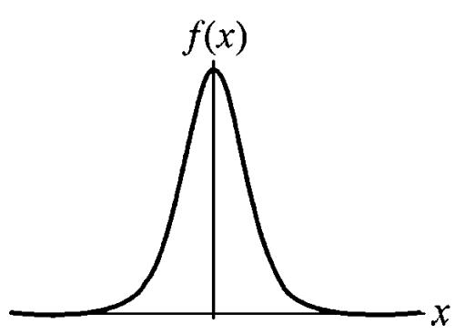
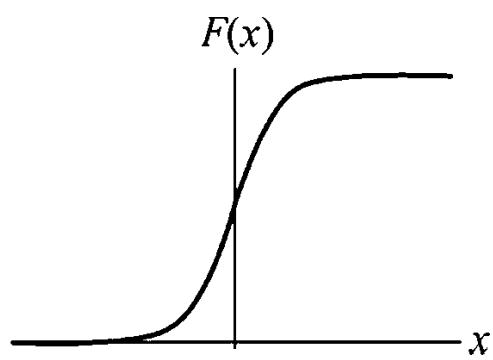
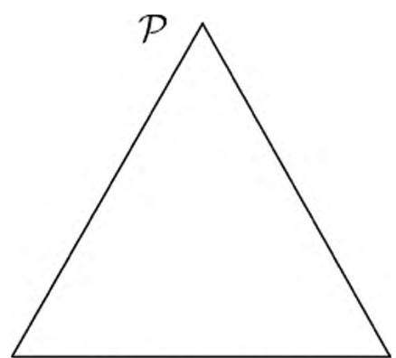
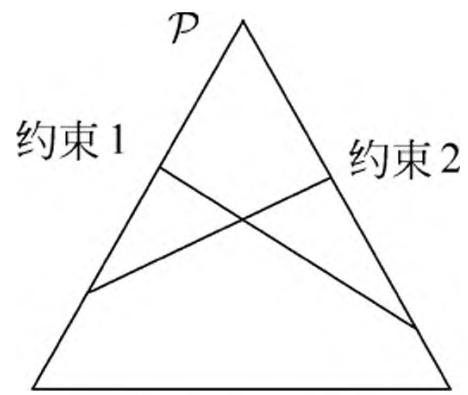

# 第 6 章 逻辑斯谛回归与最大熵模型

逻辑斯谛回归（logistic regression）是统计学习中的经典分类方法。最大熵是概率模型学习的一个准则，将其推广到分类问题得到最大熵模型（maximum entropy model）。逻辑斯谛回归模型与最大熵模型都属于对数线性模型。本章首先介绍逻辑斯谛回归模型，然后介绍最大熵模型，最后讲述逻辑斯谛回归与最大熵模型的学习算法，包括改进的迭代尺度算法和拟牛顿法。

## 6.1 逻辑斯谛回归模型

## 6.1.1 逻辑斯谛分布

首先介绍逻辑斯谛分布（logistic distribution）。

定义 6.1（逻辑斯谛分布）设 $X$ 是连续随机变量， $X$ 服从逻辑斯谛分布是指 $X$ 具有下列分布函数和密度函数：

$$
F (x) = P (X \leqslant x) = \frac {1}{1 + \mathrm {e} ^ {- (x - \mu) / \gamma}} \tag {6.1}
$$

$$
f (x) = F ^ {\prime} (x) = \frac {\mathrm {e} ^ {- (x - \mu) / \gamma}}{\gamma (1 + \mathrm {e} ^ {- (x - \mu) / \gamma}) ^ {2}} \tag {6.2}
$$

式中， $\mu$ 为位置参数， $\gamma > 0$ 为形状参数。

逻辑斯谛分布的密度函数 $f(x)$ 和分布函数 $F(x)$ 的图形如图 6.1 所示。分布函数属于逻辑斯谛函数，其图形是一条 S 形曲线（sigmoid curve）。该曲线以点 $\left(\mu, \frac{1}{2}\right)$ 为中心对称，即满足

$$
F (- x + \mu) - \frac {1}{2} = - F (x + \mu) + \frac {1}{2}
$$

曲线在中心附近增长速度较快，在两端增长速度较慢。形状参数 $\gamma$ 的值越小，曲线在中心附近增长得越快。

> 图 6.1 逻辑斯谛分布的密度函数与分布函数

## 6.1.2 二项逻辑斯谛回归模型

二项逻辑斯谛回归模型（binomial logistic regression model）是一种分类模型，由条件概率分布 $P(Y|X)$ 表示，形式为参数化的逻辑斯谛分布。这里，随机变量 $X$ 取值为实数，随机变量 $Y$ 取值为 1 或 0。我们通过监督学习的方法来估计模型参数。

定义 6.2（逻辑斯谛回归模型）二项逻辑斯谛回归模型是如下的条件概率分布：

$$
P (Y = 1 | x) = \frac {\exp (w \cdot x + b)}{1 + \exp (w \cdot x + b)} \tag {6.3}
$$

$$
P (Y = 0 | x) = \frac {1}{1 + \exp (w \cdot x + b)} \tag {6.4}
$$

这里， $x\in \mathbf{R}^n$ 是输入， $Y\in \{0,1\}$ 是输出， $w\in \mathbf{R}^n$ 和 $b\in \mathbf{R}$ 是参数， $\textit{\textbf{w}}$ 称为权值向量， $b$ 称为偏置， $w\cdot x$ 为 $\textit{\textbf{w}}$ 和 $x$ 的内积。

对于给定的输入实例 $x$ ，按照式 (6.3) 和式 (6.4) 可以求得 $P(Y = 1|x)$ 和 $P(Y = 0|x)$ 。逻辑斯谛回归比较两个条件概率值的大小，将实例 $x$ 分到概率值较大的那一类。

有时为了方便，将权值向量和输入向量加以扩充，仍记作 $w, x$ ，即 $w = (w^{(1)}, w^{(2)}, \dots, w^{(n)}, b)^{\mathrm{T}}$ ， $x = (x^{(1)}, x^{(2)}, \dots, x^{(n)}, 1)^{\mathrm{T}}$ 。这时，逻辑斯谛回归模型如下：

$$
P (Y = 1 | x) = \frac {\exp (w \cdot x)}{1 + \exp (w \cdot x)} \tag {6.5}
$$

$$
P (Y = 0 | x) = \frac {1}{1 + \exp (w \cdot x)} \tag {6.6}
$$

现在考查逻辑斯谛回归模型的特点。一个事件的几率（odds）是指该事件发生的概率与该事件不发生的概率的比值。如果事件发生的概率是 $p$ ，那么该事件的几率是 $\frac{p}{1 - p}$ ，该事件的对数几率（log odds）或 logit 函数是

$$
\operatorname {l o g i t} (p) = \log {\frac {p}{1 - p}}
$$

对逻辑斯谛回归而言，由式 (6.5) 与式 (6.6) 得

$$
\log {\frac {P (Y = 1 | x)}{1 - P (Y = 1 | x)}} = w \cdot x
$$

这就是说，在逻辑斯谛回归模型中，输出 $Y = 1$ 的对数几率是输入 $x$ 的线性函数。或者说，输出 $Y = 1$ 的对数几率是由输入 $x$ 的线性函数表示的模型，即逻辑斯谛回归模型。

换一个角度看，考虑对输入 $x$ 进行分类的线性函数 $w \cdot x$ ，其值域为实数域。注意，这里 $x \in \mathbf{R}^{n+1}$ ， $w \in \mathbf{R}^{n+1}$ 。通过逻辑斯谛回归模型定义式 (6.5) 可以将线性函数 $w \cdot x$ 转换为概率：

$$
P (Y = 1 | x) = \frac {\exp (w \cdot x)}{1 + \exp (w \cdot x)}
$$

这时，线性函数的值越接近正无穷，概率值就越接近 1；线性函数的值越接近负无穷，概率值就越接近 0（如图 6.1 所示）。这样的模型就是逻辑斯谛回归模型。

## 6.1.3 模型参数估计

逻辑斯谛回归模型学习时，对于给定的训练数据集 $T = \{(x_1, y_1), (x_2, y_2), \dots, (x_N, y_N)\}$ ，其中， $x_i \in \mathbf{R}^n$ ， $y_i \in \{0, 1\}$ ，可以应用极大似然估计法估计模型参数，从而得到逻辑斯谛回归模型。

设：

$$
P (Y = 1 | x) = \pi (x), \quad P (Y = 0 | x) = 1 - \pi (x)
$$

似然函数为

$$
\prod_ {i = 1} ^ {N} \left[ \pi \left(x _ {i}\right) \right] ^ {y _ {i}} \left[ 1 - \pi \left(x _ {i}\right) \right] ^ {1 - y _ {i}}
$$

对数似然函数为

$$
\begin{array}{l} L (w) = \sum_ {i = 1} ^ {N} \left[ y _ {i} \log \pi \left(x _ {i}\right) + \left(1 - y _ {i}\right) \log \left(1 - \pi \left(x _ {i}\right)\right) \right] \\ = \sum_ {i = 1} ^ {N} \left[ y _ {i} \log \frac {\pi (x _ {i})}{1 - \pi (x _ {i})} + \log (1 - \pi (x _ {i})) \right] \\ = \sum_ {i = 1} ^ {N} \left[ y _ {i} \left(w \cdot x _ {i}\right) - \log \left(1 + \exp \left(w \cdot x _ {i}\right) \right] \right. \\ \end{array}
$$

对 $L(w)$ 求极大值，得到 $\pmb{w}$ 的估计值。

这样，问题就变成了以对数似然函数为目标函数的最优化问题。逻辑斯谛回归学习中通常采用的方法是梯度下降法及拟牛顿法。

假设 $w$ 的极大似然估计值是 $\hat{w}$ ，那么学到的逻辑斯谛回归模型为

$$
P (Y = 1 | x) = \frac {\exp (\hat {w} \cdot x)}{1 + \exp (\hat {w} \cdot x)}
$$

$$
P (Y = 0 | x) = \frac {1}{1 + \exp (\hat {w} \cdot x)}
$$

## 6.1.4 多项逻辑斯谛回归

上面介绍的逻辑斯谛回归模型是二项分类模型，用于二类分类。可以将其推广为多项逻辑斯谛回归模型（multi-nominal logistic regression model），用于多类分类。假设离散型随机变量 $Y$ 的取值集合是 $\{1,2,\dots ,K\}$ ，那么多项逻辑斯谛回归模型是

$$
P (Y = k | x) = \frac {\exp \left(w _ {k} \cdot x\right)}{1 + \sum_ {k = 1} ^ {K - 1} \exp \left(w _ {k} \cdot x\right)}, \quad k = 1, 2, \dots , K - 1 \tag {6.7}
$$

$$
P (Y = K | x) = \frac {1}{1 + \sum_ {k = 1} ^ {K - 1} \exp \left(w _ {k} \cdot x\right)} \tag {6.8}
$$

这里， $x\in \mathbf{R}^{n + 1},w_k\in \mathbf{R}^{n + 1}$二项逻辑斯谛回归的参数估计法也可以推广到多项逻辑斯谛回归。

## 6.2 最大熵模型

最大熵模型（maximum entropy model）由最大熵原理推导实现。这里首先叙述一般的最大熵原理，然后讲解最大熵模型的推导，最后给出最大熵模型学习的形式。

## 6.2.1 最大熵原理

最大熵原理是概率模型学习的一个准则。最大熵原理认为，学习概率模型时，在所有可能的概率模型（分布）中，熵最大的模型是最好的模型。通常用约束条件来确定概率模型的集合，所以，最大熵原理也可以表述为在满足约束条件的模型集合中选取熵最大的模型。

假设离散随机变量 $X$ 的概率分布是 $P(X)$ ，则其熵（参照 5.2.2 节）是

$$
H (P) = - \sum_ {x} P (x) \log P (x) \tag {6.9}
$$

熵满足下列不等式：

$$
0 \leqslant H (P) \leqslant \log | X |
$$

式中， $|X|$ 是 $X$ 的取值个数，当且仅当 $X$ 的分布是均匀分布时右边的等号成立。这就是说，当 $X$ 服从均匀分布时，熵最大。

直观地，最大熵原理认为要选择的概率模型首先必须满足已有的事实，即约束条件。在没有更多信息的情况下，那些不确定的部分都是“等可能的”。最大熵原理通过熵的最大化来表示等可能性。“等可能”不容易操作，而熵则是一个可优化的数值指标。

首先，通过一个简单的例子来介绍一下最大熵原理 ①。

> - ① 此例来自参考文献[1]。

例 6.1 假设随机变量 $X$ 有 5 个取值 $\{A, B, C, D, E\}$ ，要估计取各个值的概率 $P(A), P(B), P(C), P(D), P(E)$ 。

解 这些概率值满足以下约束条件：

$$
P (A) + P (B) + P (C) + P (D) + P (E) = 1
$$

满足这个约束条件的概率分布有无穷多个。如果没有任何其他信息，仍要对概率分布进行估计，一个办法就是认为这个分布中取各个值的概率是相等的：

$$
P (A) = P (B) = P (C) = P (D) = P (E) = \frac {1}{5}
$$

等概率表示了对事实的无知。因为没有更多的信息，这种判断是合理的。

有时，能从一些先验知识中得到一些对概率值的约束条件，例如：

$$
P (A) + P (B) = \frac {3}{1 0}
$$

$$
P (A) + P (B) + P (C) + P (D) + P (E) = 1
$$

满足这两个约束条件的概率分布仍然有无穷多个。在缺少其他信息的情况下，可以认为 $A$ 与 $B$ 是等概率的， $C, D$ 与 $E$ 是等概率的，于是，

$$
P (A) = P (B) = \frac {3}{2 0}
$$

$$
P (C) = P (D) = P (E) = \frac {7}{3 0}
$$

如果还有第 3 个约束条件：

$$
P (A) + P (C) = \frac {1}{2}
$$

$$
P (A) + P (B) = \frac {3}{1 0}
$$

$$
P (A) + P (B) + P (C) + P (D) + P (E) = 1
$$

可以继续按照满足约束条件下求等概率的方法估计概率分布。这里不再继续讨论。以上概率模型学习的方法正是遵循了最大熵原理。

图 6.2 提供了用最大熵原理进行概率模型选择的几何解释。概率模型集合 $\mathcal{P}$ 可由欧氏空间中的单纯形（simplex）① 表示，如左图的三角形（2-单纯形）。一个点代表一个模型，整个单纯形代表模型集合。右图上的一条直线对应于一个约束条件，直线的交集对应于满足所有约束条件的模型集合。一般地，这样的模型仍有无穷多个。学习的目的是在可能的模型集合中选择最优模型，而最大熵原理则给出最优模型选择的一个准则。

> - ① 单纯形是在 $n$ 维欧氏空间中的 $n + 1$ 个仿射无关的点的集合的凸包。

> 概率模型空间

> 满足约束条件的模型集合 图 6.2 概率模型集合

## 6.2.2 最大熵模型的定义

最大熵原理是统计学习的一般原理，将它应用到分类得到最大熵模型。

假设分类模型是一个条件概率分布 $P(Y|X)$ ， $X \in \mathcal{X} \subseteq \mathbf{R}^n$ 表示输入， $Y \in \mathcal{Y}$ 表示输出， $\mathcal{X}$ 和 $\mathcal{Y}$ 分别是输入和输出的集合。这个模型表示的是对于给定的输入 $X$ ，以条件概率 $P(Y|X)$ 输出 $Y$ 。

给定一个训练数据集

$$
T = \left\{\left(x _ {1}, y _ {1}\right), \left(x _ {2}, y _ {2}\right), \dots , \left(x _ {N}, y _ {N}\right) \right\}
$$

学习的目标是用最大熵原理选择最好的分类模型。

首先考虑模型应该满足的条件。给定训练数据集，可以确定联合分布 $P(X,Y)$ 的经验分布和边缘分布 $P(X)$ 的经验分布，分别以 $\tilde{P}(X,Y)$ 和 $\tilde{P}(X)$ 表示。这里，

$$
\tilde {P} (X = x, Y = y) = \frac {\nu (X = x , Y = y)}{N}
$$

$$
\tilde {P} (X = x) = \frac {\nu (X = x)}{N}
$$

其中， $\nu(X = x, Y = y)$ 表示训练数据中样本 $(x, y)$ 出现的频数， $\nu(X = x)$ 表示训练数据中输入 $x$ 出现的频数， $N$ 表示训练样本容量。

用特征函数（feature function） $f(x, y)$ 描述输入 $x$ 和输出 $y$ 之间的某一个事实。其定义是

$$
f (x, y) = {\left\{ \begin{array}{l l} {1,} & {x   \text {与}   y   \text {满 足 某 一 事 实}} \\ {0,} & {{\text {否 则}}} \end{array} \right.}
$$

它是一个二值函数 ①，当 $x$ 和 $y$ 满足这个事实时取值为 1，否则取值为 0。

> - ① 一般地，特征函数可以是任意实值函数。

特征函数 $f(x,y)$ 关于经验分布 $\tilde{P} (X,Y)$ 的期望值，用 $E_{\tilde{P}}(f)$ 表示：

$$
E _ {\tilde {P}} (f) = \sum_ {x, y} \tilde {P} (x, y) f (x, y)
$$

特征函数 $f(x,y)$ 关于模型 $P(Y|X)$ 与经验分布 $\tilde{P} (X)$ 的期望值，用 $E_P(f)$ 表示：

$$
E _ {P} (f) = \sum_ {x, y} \tilde {P} (x) P (y | x) f (x, y)
$$

如果模型能够获取训练数据中的信息，那么就可以假设这两个期望值相等，即

$$
E _ {P} (f) = E _ {\tilde {P}} (f) \tag {6.10}
$$

或

$$
\sum_ {x, y} \tilde {P} (x) P (y | x) f (x, y) = \sum_ {x, y} \tilde {P} (x, y) f (x, y) \tag {6.11}
$$

我们将式 (6.10) 或式 (6.11) 作为模型学习的约束条件。假如有 $n$ 个特征函数 $f_{i}(x,y), i = 1,2,\dots ,n$ ，那么就有 $n$ 个约束条件。

定义 6.3（最大熵模型） 假设满足所有约束条件的模型集合为

$$
\mathcal {C} \equiv \left\{P \in \mathcal {P} | E _ {P} (f _ {i}) = E _ {\tilde {P}} (f _ {i}), i = 1, 2, \dots , n \right\} \tag {6.12}
$$

定义在条件概率分布 $P(Y|X)$ 上的条件熵为

$$
H (P) = - \sum_ {x, y} \tilde {P} (x) P (y | x) \log P (y | x) \tag {6.13}
$$

则模型集合 $\mathcal{C}$ 中条件熵 $H(P)$ 最大的模型称为最大熵模型。式中的对数为自然对数。

## 6.2.3 最大熵模型的学习

最大熵模型的学习过程就是求解最大熵模型的过程。最大熵模型的学习可以形式化为约束最优化问题。

对于给定的训练数据集 $T = \{(x_{1},y_{1}),(x_{2},y_{2}),\dots ,(x_{N},y_{N})\}$ 以及特征函数 $f_{i}(x,y),i = 1,2,\dots ,n$ ，最大熵模型的学习等价于约束最优化问题：

$$
\begin{array}{l} \max  _ {P \in \mathbf {C}} H (P) = - \sum_ {x, y} \tilde {P} (x) P (y | x) \log P (y | x) \\ \text {s . t .} \quad E _ {P} \left(f _ {i}\right) = E _ {\tilde {P}} \left(f _ {i}\right), \quad i = 1, 2, \dots , n \\ \sum_ {y} P (y | x) = 1 \\ \end{array}
$$

按照最优化问题的习惯，将求最大值问题改写为等价的求最小值问题：

$$
\min  _ {P \in \mathbf {C}} - H (P) = \sum_ {x, y} \tilde {P} (x) P (y | x) \log P (y | x) \tag {6.14}
$$

$$
\mathrm {s . t .} \quad E _ {P} (f _ {i}) - E _ {\tilde {P}} (f _ {i}) = 0, \quad i = 1, 2, \dots , n \tag {6.15}
$$

$$
\sum_ {y} P (y \mid x) = 1 \tag {6.16}
$$

求解约束最优化问题(6.14) $\sim$ (6.16)，所得出的解，就是最大熵模型学习的解。下面给出具体推导。

这里，将约束最优化的原始问题转换为无约束最优化的对偶问题 ①。通过求解对偶问题求解原始问题。

> - $①$ 参阅附录 C。

首先，引进拉格朗日乘子 $w_0, w_1, w_2, \dots, w_n$ ，定义拉格朗日函数 $L(P, w)$ ：

$$
\begin{array}{l} L (P, w) \equiv - H (P) + w _ {0} \left(1 - \sum_ {y} P (y | x)\right) + \sum_ {i = 1} ^ {n} w _ {i} \left(E _ {\tilde {P}} (f _ {i}) - E _ {P} (f _ {i})\right) \\ = \sum_ {x, y} \tilde {P} (x) P (y | x) \log P (y | x) + w _ {0} \left(1 - \sum_ {y} P (y | x)\right) + \\ \sum_ {i = 1} ^ {n} w _ {i} \left(\sum_ {x, y} \tilde {P} (x, y) f _ {i} (x, y) - \sum_ {x, y} \tilde {P} (x) P (y | x) f _ {i} (x, y)\right) \tag {6.17} \\ \end{array}
$$

最优化的原始问题是

$$
\min  _ {P \in \mathbf {C}} \max  _ {w} L (P, w) \tag {6.18}
$$

对偶问题是

$$
\max  _ {w} \min  _ {P \in \mathbf {C}} L (P, w) \tag {6.19}
$$

由于拉格朗日函数 $L(P, w)$ 是 $P$ 的凸函数，原始问题 (6.18) 的解与对偶问题 (6.19) 的解是等价的。这样，可以通过求解对偶问题 (6.19) 来求解原始问题 (6.18)。

首先，求解对偶问题(6.19)内部的极小化问题 $\min_{P\in \mathbf{C}}L(P,w)$ 。 $\min_{P\in \mathbf{C}}L(P,w)$ 是 $w$ 的函数，将其记作

$$
\Psi (w) = \min  _ {P \in \mathbf {C}} L (P, w) = L \left(P _ {w}, w\right) \tag {6.20}
$$

$\Psi (w)$ 称为对偶函数。同时，将其解记作

$$
P _ {w} = \arg \min  _ {P \in \mathbf {C}} L (P, w) = P _ {w} (y | x) \tag {6.21}
$$

具体地，求 $L(P, w)$ 对 $P(y|x)$ 的偏导数

$$
\begin{array}{l} \frac {\partial L (P , w)}{\partial P (y \mid x)} = \sum_ {x, y} \tilde {P} (x) (\log P (y \mid x) + 1) - \sum_ {y} w _ {0} - \sum_ {x, y} \left(\tilde {P} (x) \sum_ {i = 1} ^ {n} w _ {i} f _ {i} (x, y)\right) \\ = \sum_ {x, y} \tilde {P} (x) \left(\log P (y | x) + 1 - w _ {0} - \sum_ {i = 1} ^ {n} w _ {i} f _ {i} (x, y)\right) \\ \end{array}
$$

令偏导数等于 0，在 $\tilde{P} (x) > 0$ 的情况下，解得

$$
P (y | x) = \exp \left(\sum_ {i = 1} ^ {n} w _ {i} f _ {i} (x, y) + w _ {0} - 1\right) = \frac {\exp \left(\sum_ {i = 1} ^ {n} w _ {i} f _ {i} (x , y)\right)}{\exp (1 - w _ {0})}
$$

由于 $\sum_{y}P(y|x) = 1$ ，得

$$
P _ {w} (y | x) = \frac {1}{Z _ {w} (x)} \exp \left(\sum_ {i = 1} ^ {n} w _ {i} f _ {i} (x, y)\right) \tag {6.22}
$$

其中，

$$
Z _ {w} (x) = \sum_ {y} \exp \left(\sum_ {i = 1} ^ {n} w _ {i} f _ {i} (x, y)\right) \tag {6.23}
$$

$Z_{w}(x)$ 称为规范化因子； $f_{i}(x,y)$ 是特征函数； $\boldsymbol{w}_{i}$ 是特征的权值。由式(6.22)、式(6.23)表示的模型 $P_{w} = P_{w}(y|x)$ 就是最大熵模型。这里， $\boldsymbol{w}$ 是最大熵模型中的参数向量。

之后，求解对偶问题外部的极大化问题

$$
\max  _ {w} \Psi (w) \tag {6.24}
$$

将其解记为 $w^{*}$ ，即

$$
w ^ {*} = \arg \max  _ {w} \Psi (w) \tag {6.25}
$$

这就是说，可以应用最优化算法求对偶函数 $\Psi (w)$ 的极大化，得到 $w^{*}$ ，用来表示 $P^{*}\in \mathcal{C}$ 。这里， $P^{*} = P_{w^{*}} = P_{w^{*}}(y|x)$ 是学习到的最优模型（最大熵模型）。也就是说，最大熵模型的学习归结为对偶函数 $\Psi (w)$ 的极大化。

例 6.2 学习例 6.1 中的最大熵模型。

解为了方便，分别以 $y_{1},y_{2},y_{3},y_{4},y_{5}$ 表示 $A,B,C,D$ 和 $E$ ，于是最大熵模型学习的最优化问题是

$$
\begin{array}{l} \min  - H (P) = \sum_ {i = 1} ^ {5} P \left(y _ {i}\right) \log P \left(y _ {i}\right) \\ \text {s . t .} \quad P \left(y _ {1}\right) + P \left(y _ {2}\right) = \tilde {P} \left(y _ {1}\right) + \tilde {P} \left(y _ {2}\right) = \frac {3}{1 0} \\ \sum_ {i = 1} ^ {5} P (y _ {i}) = \sum_ {i = 1} ^ {5} \tilde {P} (y _ {i}) = 1 \\ \end{array}
$$

引进拉格朗日乘子 $w_{0}, w_{1}$ , 定义拉格朗日函数

$$
L (P, w) = \sum_ {i = 1} ^ {5} P (y _ {i}) \log P (y _ {i}) + w _ {1} \left(P (y _ {1}) + P (y _ {2}) - \frac {3}{1 0}\right) + w _ {0} \left(\sum_ {i = 1} ^ {5} P (y _ {i}) - 1\right)
$$

根据拉格朗日对偶性，可以通过求解对偶最优化问题得到原始最优化问题的解，所以求解

$$
\max  _ {w} \min  _ {P} L (P, w)
$$

首先求解 $L(P, w)$ 关于 $P$ 的极小化问题。为此，固定 $w_0, w_1$ ，求偏导数：

$$
\frac {\partial L (P , w)}{\partial P (y _ {1})} = 1 + \log P (y _ {1}) + w _ {1} + w _ {0}
$$

$$
\frac {\partial L (P , w)}{\partial P \left(y _ {2}\right)} = 1 + \log P \left(y _ {2}\right) + w _ {1} + w _ {0}
$$

$$
\frac {\partial L (P , w)}{\partial P (y _ {3})} = 1 + \log P (y _ {3}) + w _ {0}
$$

$$
\frac {\partial L (P , w)}{\partial P \left(y _ {4}\right)} = 1 + \log P \left(y _ {4}\right) + w _ {0}
$$

$$
\frac {\partial L (P , w)}{\partial P \left(y _ {5}\right)} = 1 + \log P \left(y _ {5}\right) + w _ {0}
$$

令各偏导数等于 0，解得

$$
P (y _ {1}) = P (y _ {2}) = \mathrm {e} ^ {- w _ {1} - w _ {0} - 1}
$$

$$
P (y _ {3}) = P (y _ {4}) = P (y _ {5}) = \mathrm {e} ^ {- w _ {0} - 1}
$$

于是，

$$
\underset {P} {\min } L (P, w) = L (P _ {w}, w) = - 2 \mathrm {e} ^ {- w _ {1} - w _ {0} - 1} - 3 \mathrm {e} ^ {- w _ {0} - 1} - \frac {3}{1 0} w _ {1} - w _ {0}
$$

再求解 $L(P_w, w)$ 关于 $w$ 的极大化问题：

$$
\max _ {w} L (P _ {w}, w) = - 2 \mathrm {e} ^ {- w _ {1} - w _ {0} - 1} - 3 \mathrm {e} ^ {- w _ {0} - 1} - \frac {3}{1 0} w _ {1} - w _ {0}
$$

分别求 $L(P_{w},w)$ 对 $w_0,w_1$ 的偏导数并令其为 0，得到

$$
\mathrm {e} ^ {- w _ {1} - w _ {0} - 1} = \frac {3}{2 0}
$$

$$
\mathrm {e} ^ {- w _ {0} - 1} = \frac {7}{3 0}
$$

于是得到所要求的概率分布为

$$
P (y _ {1}) = P (y _ {2}) = \frac {3}{2 0}
$$

$$
P (y _ {3}) = P (y _ {4}) = P (y _ {5}) = \frac {7}{3 0}
$$

## 6.2.4 极大似然估计

从以上最大熵模型学习中可以看出，最大熵模型是由式(6.22)、式(6.23)表示的条件概率分布。下面证明对偶函数的极大化等价于最大熵模型的极大似然估计。

已知训练数据的经验概率分布 $\tilde{P}(X,Y)$ ，条件概率分布 $P(Y|X)$ 的对数似然函数表示为

$$
L _ {\tilde {P}} (P _ {w}) = \log \prod_ {x, y} P (y | x) ^ {\tilde {P} (x, y)} = \sum_ {x, y} \tilde {P} (x, y) \log P (y | x)
$$

当条件概率分布 $P(y|x)$ 是最大熵模型(6.22)和(6.23)时，对数似然函数 $L_{\tilde{P}}(P_w)$ 为

$$
\begin{array}{l} L _ {\tilde {P}} (P _ {w}) = \sum_ {x, y} \tilde {P} (x, y) \log P (y | x) \\ = \sum_ {x, y} \tilde {P} (x, y) \sum_ {i = 1} ^ {n} w _ {i} f _ {i} (x, y) - \sum_ {x, y} \tilde {P} (x, y) \log Z _ {w} (x) \\ = \sum_ {x, y} \tilde {P} (x, y) \sum_ {i = 1} ^ {n} w _ {i} f _ {i} (x, y) - \sum_ {x} \tilde {P} (x) \log Z _ {w} (x) \tag {6.26} \\ \end{array}
$$

再看对偶函数 $\varPsi(w)$ 。由式(6.17)及式(6.20)可得

$$
\begin{array}{l} \Psi (w) = \sum \tilde {P} (x) P _ {w} (y | x) \log P _ {w} (y | x) + \\ \sum_ {i = 1} ^ {\underset {n} {x, y}} w _ {i} \left(\sum_ {x, y} \tilde {P} (x, y) f _ {i} (x, y) - \sum_ {x, y} \tilde {P} (x) P _ {w} (y | x) f _ {i} (x, y)\right) \\ = \sum_ {x, y} \tilde {P} (x, y) \sum_ {i = 1} ^ {n} w _ {i} f _ {i} (x, y) + \sum_ {x, y} \tilde {P} (x) P _ {w} (y | x) \left(\log P _ {w} (y | x) - \sum_ {i = 1} ^ {n} w _ {i} f _ {i} (x, y)\right) \\ = \sum_ {x, y} \tilde {P} (x, y) \sum_ {i = 1} ^ {n} w _ {i} f _ {i} (x, y) - \sum_ {x, y} \tilde {P} (x) P _ {w} (y | x) \log Z _ {w} (x) \\ = \sum_ {x, y} \tilde {P} (x, y) \sum_ {i = 1} ^ {n} w _ {i} f _ {i} (x, y) - \sum_ {x} \tilde {P} (x) \log Z _ {w} (x) \tag {6.27} \\ \end{array}
$$

最后一步用到 $\sum_{y}P(y|x) = 1$比较式 (6.26) 和式 (6.27)，可得

$$
\Psi (w) = L _ {\tilde {P}} (P _ {w})
$$

既然对偶函数 $\Psi(w)$ 等价于对数似然函数 $L_{\tilde{P}}(P_w)$ ，于是证明了最大熵模型学习中的对偶函数极大化等价于最大熵模型的极大似然估计这一事实。

这样，最大熵模型的学习问题就转换为具体求解对数似然函数极大化或对偶函数极大化的问题。

可以将最大熵模型写成更一般的形式。

$$
P _ {w} (y | x) = \frac {1}{Z _ {w} (x)} \exp \left(\sum_ {i = 1} ^ {n} w _ {i} f _ {i} (x, y)\right) \tag {6.28}
$$

其中，

$$
Z _ {w} (x) = \sum_ {y} \exp \left(\sum_ {i = 1} ^ {n} w _ {i} f _ {i} (x, y)\right) \tag {6.29}
$$

这里， $x\in \mathbf{R}^n$ 为输入， $y\in \{1,2,\dots ,K\}$ 为输出， $w\in \mathbf{R}^n$ 为权值向量， $f_{i}(x,y)$ ， $i =$ $1,2,\dots ,n$ 为任意实值特征函数。

最大熵模型与逻辑斯谛回归模型有类似的形式，它们又称为对数线性模型（log linear model）。模型学习就是在给定的训练数据条件下对模型进行极大似然估计或正则化的极大似然估计。

## 6.3 模型学习的最优化算法

逻辑斯谛回归模型、最大熵模型学习归结为以似然函数为目标函数的最优化问题，通常通过迭代算法求解。从最优化的观点看，这时的目标函数具有很好的性质。它是光滑的凸函数，因此多种最优化的方法都适用，保证能找到全局最优解。常用的方法有改进的迭代尺度法、梯度下降法、牛顿法或拟牛顿法。牛顿法或拟牛顿法一般收敛速度更快。

下面介绍基于改进的迭代尺度法与拟牛顿法的最大熵模型学习算法。梯度下降法参阅附录 A。

## 6.3.1 改进的迭代尺度法

改进的迭代尺度法（improved iterative scaling，IIS）是一种最大熵模型学习的最优化算法。

已知最大熵模型为

$$
P _ {w} (y | x) = \frac {1}{Z _ {w} (x)} \exp \left(\sum_ {i = 1} ^ {n} w _ {i} f _ {i} (x, y)\right)
$$

其中，

$$
Z _ {w} (x) = \sum_ {y} \exp \left(\sum_ {i = 1} ^ {n} w _ {i} f _ {i} (x, y)\right)
$$

对数似然函数为

$$
L (w) = \sum_ {x, y} \tilde {P} (x, y) \sum_ {i = 1} ^ {n} w _ {i} f _ {i} (x, y) - \sum_ {x} \tilde {P} (x) \log Z _ {w} (x)
$$

目标是通过极大似然估计学习模型参数，即求对数似然函数的极大值 $\hat{w}$ 。

IIS 的想法是: 假设最大熵模型当前的参数向量是 $w = (w_{1}, w_{2}, \dots, w_{n})^{\mathrm{T}}$ , 我们希望找到一个新的参数向量 $w + \delta = (w_{1} + \delta_{1}, w_{2} + \delta_{2}, \dots, w_{n} + \delta_{n})^{\mathrm{T}}$ , 使得模型的对数似然函数值增大。如果能有这样一种参数向量更新的方法 $\tau : w \to w + \delta$ , 那么就可以重复使用这一方法, 直至找到对数似然函数的最大值。

对于给定的经验分布 $\tilde{P}(x, y)$ ，模型参数从 $w$ 到 $w + \delta$ ，对数似然函数的改变量是

$$
\begin{array}{l} L (w + \delta) - L (w) = \sum_ {x, y} \tilde {P} (x, y) \log P _ {w + \delta} (y | x) - \sum_ {x, y} \tilde {P} (x, y) \log P _ {w} (y | x) \\ = \sum_ {x, y} \tilde {P} (x, y) \sum_ {i = 1} ^ {n} \delta_ {i} f _ {i} (x, y) - \sum_ {x} \tilde {P} (x) \log \frac {Z _ {w + \delta} (x)}{Z _ {w} (x)} \\ \end{array}
$$

利用不等式

$$
- \log \alpha \geqslant 1 - \alpha , \quad \alpha > 0
$$

建立对数似然函数改变量的下界：

$$
\begin{array}{l} L (w + \delta) - L (w) \geqslant \sum_ {x, y} \tilde {P} (x, y) \sum_ {i = 1} ^ {n} \delta_ {i} f _ {i} (x, y) + 1 - \sum_ {x} \tilde {P} (x) \frac {Z _ {w + \delta} (x)}{Z _ {w} (x)} \\ = \sum_ {x, y} \tilde {P} (x, y) \sum_ {i = 1} ^ {n} \delta_ {i} f _ {i} (x, y) + 1 - \sum_ {x} \tilde {P} (x) \sum_ {y} P _ {w} (y | x) \exp \sum_ {i = 1} ^ {n} \delta_ {i} f _ {i} (x, y) \\ \end{array}
$$

将右端记为

$$
A (\delta \mid w) = \sum_ {x, y} \tilde {P} (x, y) \sum_ {i = 1} ^ {n} \delta_ {i} f _ {i} (x, y) + 1 - \sum_ {x} \tilde {P} (x) \sum_ {y} P _ {w} (y | x) \exp \sum_ {i = 1} ^ {n} \delta_ {i} f _ {i} (x, y)
$$

于是有

$$
L (w + \delta) - L (w) \geqslant A (\delta | w)
$$

即 $A(\delta |w)$ 是对数似然函数改变量的一个下界。

如果能找到适当的 $\delta$ 使下界 $A(\delta |w)$ 提高，那么对数似然函数也会提高。然而，函数 $A(\delta |w)$ 中的 $\delta$ 是一个向量，含有多个变量，不易同时优化。IIS 试图一次只优化其中一个变量 $\delta_{i}$ ，而固定其他变量 $\delta_{j}, i \neq j$ 。

为达到这一目的，IIS 进一步降低下界 $A(\delta |w)$ 。具体地，IIS 引进一个量 $f^{\#}(x,y)$

$$
f ^ {\#} (x, y) = \sum_ {i} f _ {i} (x, y)
$$

因为 $f_{i}$ 是二值函数，故 $f^{\#}(x,y)$ 表示所有特征在 $(x,y)$ 出现的次数。这样， $A(\delta |w)$ 可以改写为

$$
\begin{array}{l} A (\delta | w) = \sum_ {x, y} \tilde {P} (x, y) \sum_ {i = 1} ^ {n} \delta_ {i} f _ {i} (x, y) + 1 - \\ \sum_ {x} \tilde {P} (x) \sum_ {y} P _ {w} (y | x) \exp \left(f ^ {\#} (x, y) \sum_ {i = 1} ^ {n} \frac {\delta_ {i} f _ {i} (x , y)}{f ^ {\#} (x , y)}\right) \tag {6.30} \\ \end{array}
$$

利用指数函数的凸性以及对任意 $i$ ，有 $\frac{f_i(x,y)}{f^\#(x,y)}\geqslant 0$ 且 $\sum_{i = 1}^{n}\frac{f_i(x,y)}{f^\#(x,y)} = 1$ 这一事实，根据 Jensen 不等式，得到

$$
\exp \left(\sum_ {i = 1} ^ {n} \frac {f _ {i} (x , y)}{f ^ {\#} (x , y)} \delta_ {i} f ^ {\#} (x, y)\right) \leqslant \sum_ {i = 1} ^ {n} \frac {f _ {i} (x , y)}{f ^ {\#} (x , y)} \exp (\delta_ {i} f ^ {\#} (x, y))
$$

于是式 (6.30) 可改写为

$$
\begin{array}{l} A (\delta | w) \geqslant \sum_ {x, y} \tilde {P} (x, y) \sum_ {i = 1} ^ {n} \delta_ {i} f _ {i} (x, y) + 1 - \\ \sum_ {x} \tilde {P} (x) \sum_ {y} P _ {w} (y | x) \sum_ {i = 1} ^ {n} \left(\frac {f _ {i} (x , y)}{f ^ {\#} (x , y)}\right) \exp \left(\delta_ {i} f ^ {\#} (x, y)\right) \tag {6.31} \\ \end{array}
$$

记不等式 (6.31) 右端为

$$
B (\delta | w) = \sum_ {x, y} \tilde {P} (x, y) \sum_ {i = 1} ^ {n} \delta_ {i} f _ {i} (x, y) + 1 - \sum_ {x} \tilde {P} (x) \sum_ {y} P _ {w} (y | x) \sum_ {i = 1} ^ {n} \left(\frac {f _ {i} (x , y)}{f ^ {\#} (x , y)}\right) \exp (\delta_ {i} f ^ {\#} (x, y))
$$

于是得到

$$
L (w + \delta) - L (w) \geqslant B (\delta | w)
$$

这里， $B(\delta | w)$ 是对数似然函数改变量的一个新的 (相对不紧的) 下界。

求 $B(\delta |w)$ 对 $\delta_{i}$ 的偏导数：

$$
\frac {\partial B (\delta | w)}{\partial \delta_ {i}} = \sum_ {x, y} \tilde {P} (x, y) f _ {i} (x, y) - \sum_ {x} \tilde {P} (x) \sum_ {y} P _ {w} (y | x) f _ {i} (x, y) \exp \left(\delta_ {i} f ^ {\#} (x, y)\right) \tag {6.32}
$$

在式 (6.32) 里，除 $\delta_{i}$ 外不含任何其他变量。令偏导数为 0 得到

$$
\sum_ {x, y} \tilde {P} (x) P _ {w} (y | x) f _ {i} (x, y) \exp \left(\delta_ {i} f ^ {\#} (x, y)\right) = E _ {\tilde {P}} \left(f _ {i}\right) \tag {6.33}
$$

于是，依次对 $\delta_{i}$ 求解方程(6.33）可以求出 $\delta$ 。

这就给出了一种求 $w$ 的最优解的迭代算法，即改进的迭代尺度算法 IIS。

## 算法 6.1（改进的迭代尺度算法 IIS）

输入：特征函数 $f_{1}, f_{2}, \dots, f_{n}$ ；经验分布 $\tilde{P}(X,Y)$ ，模型 $P_{w}(y|x)$输出：最优参数值 $w_{i}^{*}$ ；最优模型 $P_{w^{*}}$ 。

- （1）对所有 $i \in \{1, 2, \dots, n\}$ ，取初值 $w_i = 0$ 。
- （2）对每一 $i\in \{1,2,\dots ,n\}$

(a) 令 $\delta_{i}$ 是方程

$$
\sum_ {x, y} \tilde {P} (x) P (y | x) f _ {i} (x, y) \exp \left(\delta_ {i} f ^ {\#} (x, y)\right) = E _ {\tilde {P}} \left(f _ {i}\right)
$$

的解，这里，

$$
f ^ {\#} (x, y) = \sum_ {i = 1} ^ {n} f _ {i} (x, y)
$$

(b) 更新 $w_{i}$ 值: $w_{i} \gets w_{i} + \delta_{i}$ 。

（3）如果不是所有 $w_{i}$ 都收敛，重复步(2)。

这一算法关键的一步是(a)，即求解方程(6.33)中的 $\delta_{i}$ 。如果 $f^{\#}(x,y)$ 是常数，即对任何 $x,y$ ，有 $f^{\#}(x,y) = M$ ，那么 $\delta_{i}$ 可以显式地表示成

$$
\delta_ {i} = \frac {1}{M} \log \frac {E _ {\tilde {P}} \left(f _ {i}\right)}{E _ {P} \left(f _ {i}\right)} \tag {6.34}
$$

如果 $f^{\#}(x, y)$ 不是常数，那么必须通过数值计算求 $\delta_{i}$ 。简单有效的方法是牛顿法。

以 $g(\delta_i) = 0$ 表示方程(6.33)，牛顿法通过迭代求得 $\delta_{i}^{*}$ ，使得 $g(\delta_i^*) = 0$ 。迭代公式是

$$
\delta_ {i} ^ {(k + 1)} = \delta_ {i} ^ {(k)} - \frac {g \left(\delta_ {i} ^ {(k)}\right)}{g ^ {\prime} \left(\delta_ {i} ^ {(k)}\right)} \tag {6.35}
$$

只要适当选取初始值 $\delta_i^{(0)}$ ，由于 $\delta_i$ 的方程 (6.33) 有单根，因此牛顿法恒收敛，而且收敛速度很快。

## 6.3.2 拟牛顿法

最大熵模型学习还可以应用牛顿法或拟牛顿法。参阅附录 B。

对于最大熵模型而言，

$$
P _ {w} (y | x) = \frac {\exp \left(\sum_ {i = 1} ^ {n} w _ {i} f _ {i} (x , y)\right)}{\sum_ {y} \exp \left(\sum_ {i = 1} ^ {n} w _ {i} f _ {i} (x , y)\right)}
$$

目标函数：

$$
\min  _ {w \in \mathbf {R} ^ {n}} \quad f (w) = \sum_ {x} \tilde {P} (x) \log \sum_ {y} \exp \left(\sum_ {i = 1} ^ {n} w _ {i} f _ {i} (x, y)\right) - \sum_ {x, y} \tilde {P} (x, y) \sum_ {i = 1} ^ {n} w _ {i} f _ {i} (x, y)
$$

梯度：

$$
g (w) = \left(\frac {\partial f (w)}{\partial w _ {1}}, \frac {\partial f (w)}{\partial w _ {2}}, \dots , \frac {\partial f (w)}{\partial w _ {n}}\right) ^ {\mathrm {T}}
$$

其中

$$
\frac {\partial f (w)}{\partial w _ {i}} = \sum_ {x, y} \tilde {P} (x) P _ {w} (y | x) f _ {i} (x, y) - E _ {\tilde {P}} (f _ {i}), \quad i = 1, 2, \dots , n
$$

相应的拟牛顿法 BFGS 算法如下。

## 算法 6.2（最大熵模型学习的 BFGS 算法）

输入：特征函数 $f_{1}, f_{2}, \dots, f_{n}$ ；经验分布 $\tilde{P}(x, y)$ ，目标函数 $f(w)$ ，梯度 $g(w) = \nabla f(w)$ ，精度要求 $\varepsilon$ ；

输出：最优参数值 $w^{*}$ ；最优模型 $P_{w^{*}}(y|x)$ 。

- （1）选定初始点 $w^{(0)}$ ，取 $B_{0}$ 为正定对称矩阵，置 $k = 0$
- (2) 计算 $g_{k} = g(w^{(k)})$ 。若 $\| g_{k} \| < \varepsilon$ ，则停止计算，得 $w^{*} = w^{(k)}$ ；否则转 (3)；
- (3) 由 $B_{k}p_{k} = -g_{k}$ 求出 $p_{k}$ ;

（4）一维搜索：求 $\lambda_{k}$ 使得

$$
f \left(w ^ {(k)} + \lambda_ {k} p _ {k}\right) = \min  _ {\lambda \geqslant 0} f \left(w ^ {(k)} + \lambda p _ {k}\right)
$$

(5) 置 $w^{(k + 1)} = w^{(k)} + \lambda_k p_k$ ;（6）计算 $g_{k + 1} = g(w^{(k + 1)})$ ，若 $\| g_{k + 1}\| < \varepsilon$ ，则停止计算，得 $w^{*} = w^{(k + 1)}$ ；否则，按下式求出 $B_{k + 1}$

$$
B _ {k + 1} = B _ {k} + \frac {y _ {k} y _ {k} ^ {\mathrm {T}}}{y _ {k} ^ {\mathrm {T}} \delta_ {k}} - \frac {B _ {k} \delta_ {k} \delta_ {k} ^ {\mathrm {T}} B _ {k}}{\delta_ {k} ^ {\mathrm {T}} B _ {k} \delta_ {k}}
$$

其中，

$$
y _ {k} = g _ {k + 1} - g _ {k}, \quad \delta_ {k} = w ^ {(k + 1)} - w ^ {(k)}
$$

(7) 置 $k = k + 1$ ，转 (3)。

## 本章概要

1. 逻辑斯谛回归模型是由以下条件概率分布表示的分类模型。逻辑斯谛回归模型可以用于二类或多类分类。

$$
\begin{array}{l} P (Y = k | x) = \frac {\exp (w _ {k} \cdot x)}{1 + \sum_ {k = 1} ^ {K - 1} \exp (w _ {k} \cdot x)}, \quad k = 1, 2, \dots , K - 1 \\ P (Y = K | x) = \frac {1}{1 + \sum_ {k = 1} ^ {K - 1} \exp (w _ {k} \cdot x)} \\ \end{array}
$$

这里， $x$ 为输入特征， $\boldsymbol{w}$ 为特征的权值。

逻辑斯谛回归模型源自逻辑斯谛分布，其分布函数 $F(x)$ 是 S 形函数。逻辑斯谛回归模型是由输入的线性函数表示的输出的对数几率模型。

2. 最大熵模型是由以下条件概率分布表示的分类模型。最大熵模型也可以用于二类或多类分类。

$$
\begin{array}{l} P _ {w} (y | x) = \frac {1}{Z _ {w} (x)} \exp \left(\sum_ {i = 1} ^ {n} w _ {i} f _ {i} (x, y)\right) \\ Z _ {w} (x) = \sum_ {y} \exp \left(\sum_ {i = 1} ^ {n} w _ {i} f _ {i} (x, y)\right) \\ \end{array}
$$

其中， $Z_{w}(x)$ 是规范化因子， $f_{i}$ 为特征函数， $w_{i}$ 为特征的权值。

3. 最大熵模型可以由最大熵原理推导得出。最大熵原理是概率模型学习或估计的一个准则。最大熵原理认为在所有可能的概率模型（分布）的集合中，熵最大的模型是最好的模型。

最大熵原理应用到分类模型的学习中，有以下约束最优化问题：

$$
\begin{array}{l} \min  - H (P) = \sum_ {x, y} \tilde {P} (x) P (y | x) \log P (y | x) \\ \mathrm {s . t .} \quad P (f _ {i}) - \tilde {P} (f _ {i}) = 0, \quad i = 1, 2, \dots , n \\ \sum_ {y} P (y | x) = 1 \\ \end{array}
$$

求解此最优化问题的对偶问题得到最大熵模型。

- 4. 逻辑斯谛回归模型与最大熵模型都属于对数线性模型。
- 5. 逻辑斯谛回归模型及最大熵模型学习一般采用极大似然估计，或正则化的极大似然估计。逻辑斯谛回归模型及最大熵模型学习可以形式化为无约束最优化问题。求解该最优化问题的算法有改进的迭代尺度法、梯度下降法、拟牛顿法。

## 继续阅读

逻辑斯谛回归的介绍参见文献 [1], 最大熵模型的介绍参见文献 [2, 3]。逻辑斯谛回归模型与朴素贝叶斯模型的关系参见文献 [4], 逻辑斯谛回归模型与 AdaBoost 的关系参见文献 [5], 逻辑斯谛回归模型与核函数的关系参见文献 [6]。

## 习题

- 6.1 确认逻辑斯谛分布属于指数分布族。
- 6.2 写出逻辑斯谛回归模型学习的梯度下降算法。
- 6.3 写出最大熵模型学习的 DFP 算法。（关于一般的 DFP 算法参见附录 B）

## 参考文献

- [1] Berger A, Della Pietra S D, Pietra V D. A maximum entropy approach to natural language processing. Computational Linguistics, 1996, 22(1): 39-71.
- [2] Berger A. The improved iterative scaling algorithm: a gentle introduction. http://www.cs.cmu.edu/afs/cs/user/aberger/www/ps/scaling.ps.

- [3] Hastie T, Tibshirani R, Friedman J. The elements of statistical learning: data mining, inference, and prediction. Springer-Verlag. 2001. (中译本: 统计学习基础——数据挖掘、推理与预测. 范明, 柴玉梅, 晋红英等译. 北京: 电子工业出版社, 2004.)
- [4] Mitchell T M. Machine learning. McGraw-Hill Companies, Inc. 1997. (中译本: 机器学习. 北京: 机械工业出版社, 2003.)
- [5] Collins M, Schapire R E, Singer Y. Logistic regression, AdaBoost and Bregman distances. Machine Learning, 2002, 48(1-3): 253-285.
- [6] Canu S, Smola A J. Kernel method and exponential family. Neurocomputing, 2005, 69: 714-720.