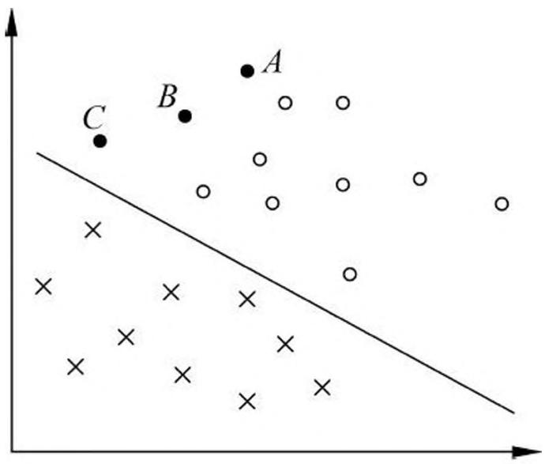
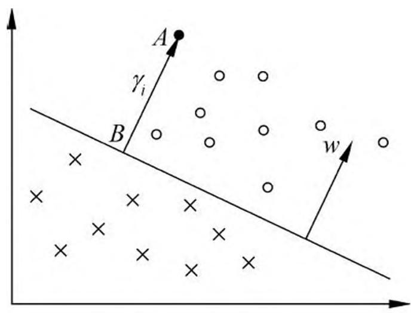
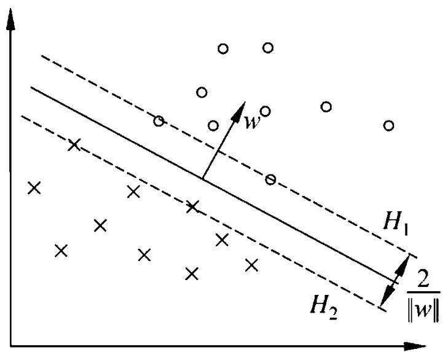
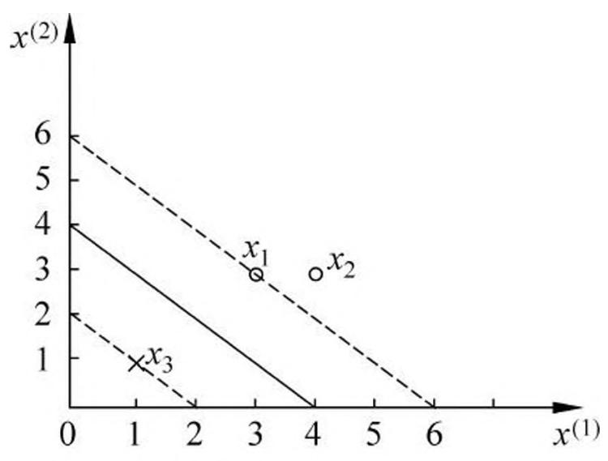
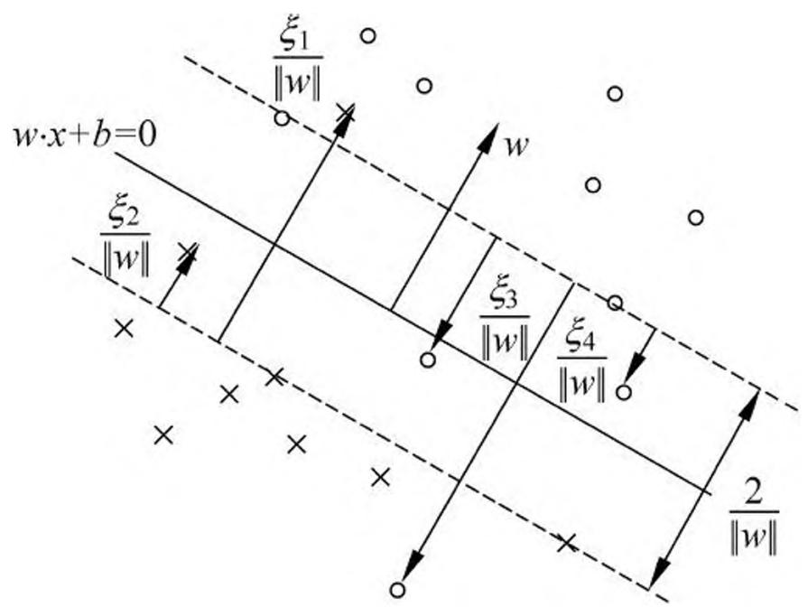
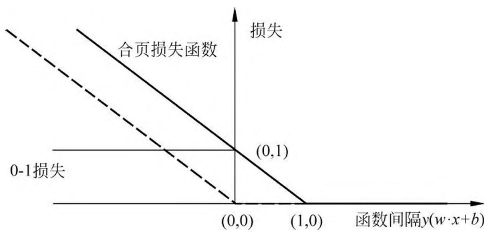
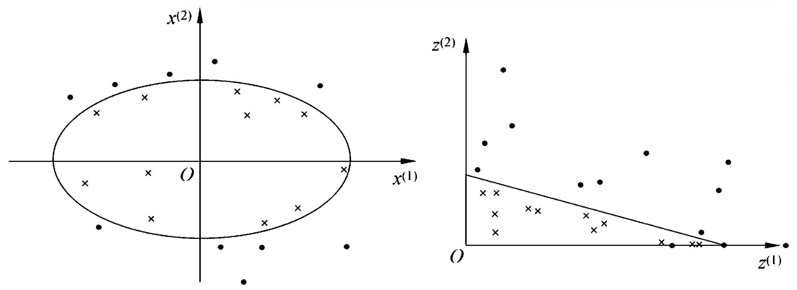
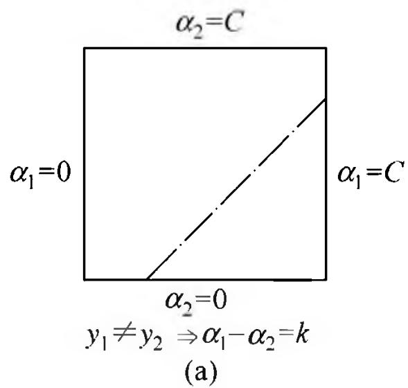
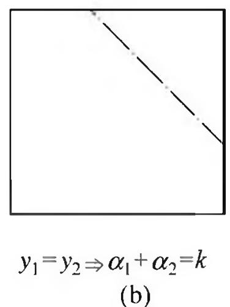

# 第 7 章 支持向量机

支持向量机（support vector machines，SVM）是一种二类分类模型。它的基本模型是定义在特征空间上的间隔最大的线性分类器，间隔最大使它有别于感知机；支持向量机还包括核技巧，这使它成为实质上的非线性分类器。支持向量机的学习策略就是间隔最大化，可形式化为一个求解凸二次规划（convex quadratic programming）的问题，也等价于正则化的合页损失函数的最小化问题。支持向量机的学习算法是求解凸二次规划的最优化算法。

支持向量机学习方法包含构建由简至繁的模型：线性可分支持向量机（linear support vector machine in linearly separable case）、线性支持向量机（linear support vector machine）以及非线性支持向量机（non-linear support vector machine）。简单模型是复杂模型的基础，也是复杂模型的特殊情况。当训练数据线性可分时，通过硬间隔最大化（hard margin maximization），学习一个线性的分类器，即线性可分支持向量机，又称为硬间隔支持向量机；当训练数据近似线性可分时，通过软间隔最大化（soft margin maximization），也学习一个线性的分类器，即线性支持向量机，又称为软间隔支持向量机；当训练数据线性不可分时，通过使用核技巧（kernel trick）及软间隔最大化，学习非线性支持向量机。

当输入空间为欧氏空间或离散集合、特征空间为希尔伯特空间时，核函数（kernel function）表示将输入从输入空间映射到特征空间得到的特征向量之间的内积。通过使用核函数可以学习非线性支持向量机，等价于隐式地在高维的特征空间中学习线性支持向量机。这样的方法称为核技巧。核方法（kernel method）是比支持向量机更为一般的机器学习方法。

Cortes 与 Vapnik 提出线性支持向量机，Boser、Guyon 与 Vapnik 又引入核技巧，提出非线性支持向量机。

本章按照上述思路介绍 3 类支持向量机、核函数及一种快速学习算法——序列最小最优化算法（SMO）。

## 7.1 线性可分支持向量机与硬间隔最大化

## 7.1.1 线性可分支持向量机

考虑一个二类分类问题。假设输入空间与特征空间为两个不同的空间。输入空间为欧氏空间或离散集合，特征空间为欧氏空间或希尔伯特空间。线性可分支持向量机、线性支持向量机假设这两个空间的元素一一对应，并将输入空间中的输入映射为特征空间中的特征向量。非线性支持向量机利用一个从输入空间到特征空间的非线性映射将输入映射为特征向量。所以，输入都由输入空间转换到特征空间，支持向量机的学习是在特征空间进行的。

假设给定一个特征空间上的训练数据集

$$
T = \left\{\left(x _ {1}, y _ {1}\right), \left(x _ {2}, y _ {2}\right), \dots , \left(x _ {N}, y _ {N}\right) \right\}
$$

其中， $x_{i}\in \mathcal{X} = \mathbf{R}^{n}$ ， $y_{i}\in \mathcal{V} = \{+1, - 1\}$ ， $i = 1,2,\dots ,N$ 。 $x_{i}$ 为第 $i$ 个特征向量，也称为实例， $y_{i}$ 为 $x_{i}$ 的类标记。当 $y_{i} = +1$ 时，称 $x_{i}$ 为正例；当 $y_{i} = -1$ 时，称 $x_{i}$ 为负例。( $x_{i},y_{i})$ 称为样本点。再假设训练数据集是线性可分的（见定义 2.2）。

学习的目标是在特征空间中找到一个分离超平面，能将实例分到不同的类。分离超平面对应于方程 $w \cdot x + b = 0$ ，它由法向量 $w$ 和截距 $b$ 决定，可用 $(w, b)$ 来表示。分离超平面将特征空间划分为两部分，一部分是正类，一部分是负类。法向量指向的一侧为正类，另一侧为负类。

一般地，当训练数据集线性可分时，存在无穷个分离超平面可将两类数据正确分开。感知机利用误分类最小的策略，求得分离超平面，不过这时的解有无穷多个。线性可分支持向量机利用间隔最大化求最优分离超平面，这时，解是唯一的。

定义 7.1（线性可分支持向量机）给定线性可分训练数据集，通过间隔最大化或等价地求解相应的凸二次规划问题学习得到的分离超平面为

$$
w ^ {*} \cdot x + b ^ {*} = 0 \tag {7.1}
$$

以及相应的分类决策函数

$$
f (x) = \operatorname {s i g n} \left(w ^ {*} \cdot x + b ^ {*}\right) \tag {7.2}
$$

称为线性可分支持向量机。

考虑如图 7.1 所示的二维特征空间中的分类问题。图中“o”表示正例，“×”表示负例。训练数据集线性可分，这时有许多直线能将两类数据正确划分。线性可分支持向量机对应着将两类数据正确划分并且间隔最大的直线，如图 7.1 所示。

> 图 7.1 二类分类问题

间隔最大及相应的约束最优化问题将在下面叙述。这里先介绍函数间隔和几何间隔的概念。

## 7.1.2 函数间隔和几何间隔

在图 7.1 中，有 $A, B, C$ 三个点，表示 3 个实例，均在分离超平面的正类一侧，预测它们的类。点 $A$ 距分离超平面较远，若预测该点为正类，就比较确信预测是正确的；点 $C$ 距分离超平面较近，若预测该点为正类就不那么确信；点 $B$ 介于点 $A$ 与 $C$ 之间，预测其为正类的确信度也在 $A$ 与 $C$ 之间。

一般来说，一个点距离分离超平面的远近可以表示分类预测的确信程度。在超平面 $w \cdot x + b = 0$ 确定的情况下， $|w \cdot x + b|$ 能够相对地表示点 $x$ 距离超平面的远近。而 $w \cdot x + b$ 的符号与类标记 $y$ 的符号是否一致能够表示分类是否正确。所以可用量 $y(w \cdot x + b)$ 来表示分类的正确性及确信度，这就是函数间隔（functional margin）的概念。

定义 7.2（函数间隔）对于给定的训练数据集 $T$ 和超平面 $(w,b)$ ，定义超平面 $(w,b)$ 关于样本点 $(x_{i},y_{i})$ 的函数间隔为

$$
\hat {\gamma} _ {i} = y _ {i} (w \cdot x _ {i} + b) \tag {7.3}
$$

定义超平面 $(w, b)$ 关于训练数据集 $T$ 的函数间隔为超平面 $(w, b)$ 关于 $T$ 中所有样本点 $(x_i, y_i)$ 的函数间隔之最小值，即

$$
\hat {\gamma} = \min  _ {i = 1, \dots , N} \hat {\gamma} _ {i} \tag {7.4}
$$

函数间隔可以表示分类预测的正确性及确信度。但是选择分离超平面时，只有函数间隔还不够。因为只要成比例地改变 $w$ 和 $b$ ，例如将它们改为 $2w$ 和 $2b$ ，超平面并没有改变，但函数间隔却成为原来的 2 倍。这一事实启示我们，可以对分离超平面的法向量 $w$ 加某些约束，如规范化， $\| w \| = 1$ ，使得间隔是确定的。这时函数间隔成为几何间隔（geometric margin）。

图 7.2 给出了超平面 $(w,b)$ 及其法向量 $w$ 。点 $A$ 表示某一实例 $x_{i}$ ，其类标记为 $y_{i} = +1$ 。点 $A$ 与超平面 $(w,b)$ 的距离由线段 $AB$ 给出，记作 $\gamma_{i}$ 。

$$
\gamma_ {i} = \frac {w}{\| w \|} \cdot x _ {i} + \frac {b}{\| w \|}
$$

其中， $\| w\|$ 为 $w$ 的 $L_{2}$ 范数。这是点 $A$ 在超平面正的一侧的情形。如果点 $A$ 在超平面负的一侧，即 $y_{i} = -1$ ，那么点与超平面的距离为

$$
\gamma_ {i} = - \left(\frac {w}{\| w \|} \cdot x _ {i} + \frac {b}{\| w \|}\right)
$$

一般地，当样本点 $(x_{i},y_{i})$ 被超平面 $(w,b)$ 正确分类时，点 $x_{i}$ 与超平面 $(w,b)$ 的距离是

$$
\gamma_ {i} = y _ {i} \left(\frac {w}{\| w \|} \cdot x _ {i} + \frac {b}{\| w \|}\right)
$$

由这一事实导出几何间隔的概念。

> 图 7.2 几何间隔

定义 7.3（几何间隔）对于给定的训练数据集 $T$ 和超平面 $(w,b)$ ，定义超平面 $(w,b)$ 关于样本点 $(x_i,y_i)$ 的几何间隔为

$$
\gamma_ {i} = y _ {i} \left(\frac {w}{\| w \|} \cdot x _ {i} + \frac {b}{\| w \|}\right) \tag {7.5}
$$

定义超平面 $(w, b)$ 关于训练数据集 $T$ 的几何间隔为超平面 $(w, b)$ 关于 $T$ 中所有样本点 $(x_i, y_i)$ 的几何间隔之最小值，即

$$
\gamma = \min  _ {i = 1, \dots , N} \gamma_ {i} \tag {7.6}
$$

超平面 $(w, b)$ 关于样本点 $(x_i, y_i)$ 的几何间隔一般是实例点到超平面的带符号的距离（signed distance），当样本点被超平面正确分类时就是实例点到超平面的距离。

从函数间隔和几何间隔的定义（式 (7.3)~式 (7.6)）可知，函数间隔和几何间隔有下面的关系：

$$
\gamma_ {i} = \frac {\hat {\gamma} _ {i}}{\| w \|} \tag {7.7}
$$

$$
\gamma = \frac {\hat {\gamma}}{\| w \|} \tag {7.8}
$$

如果 $\| w\| = 1$ ，那么函数间隔和几何间隔相等。如果超平面参数 $w$ 和 $b$ 成比例地改变（超平面没有改变），函数间隔也按此比例改变，而几何间隔不变。

## 7.1.3 间隔最大化

支持向量机学习的基本想法是求解能够正确划分训练数据集并且几何间隔最大的分离超平面。对线性可分的训练数据集而言，线性可分分离超平面有无穷多个（等价于感知机），但是几何间隔最大的分离超平面是唯一的。这里的间隔最大化又称为硬间隔最大化（与将要讨论的训练数据集近似线性可分时的软间隔最大化相对应）。

间隔最大化的直观解释是：对训练数据集找到几何间隔最大的超平面意味着以充分大的确信度对训练数据进行分类。也就是说，不仅将正负实例点分开，而且对最难分的实例点（离超平面最近的点）也有足够大的确信度将它们分开。这样的超平面应该对未知的新实例有很好的分类预测能力。

## 1. 最大间隔分离超平面

下面考虑如何求得一个几何间隔最大的分离超平面，即最大间隔分离超平面。具体地，这个问题可以表示为下面的约束最优化问题：

$$
\max  _ {w, b} \gamma \tag {7.9}
$$

$$
\text {s . t .} \quad y _ {i} \left(\frac {w}{\| w \|} \cdot x _ {i} + \frac {b}{\| w \|}\right) \geqslant \gamma , \quad i = 1, 2, \dots , N \tag {7.10}
$$

即我们希望最大化超平面 $(w, b)$ 关于训练数据集的几何间隔 $\gamma$ ，约束条件表示的是超平面 $(w, b)$ 关于每个训练样本点的几何间隔至少是 $\gamma$ 。

考虑几何间隔和函数间隔的关系式(7.8)，可将这个问题改写为

$$
\max  _ {w, b} \frac {\hat {\gamma}}{\| w \|} \tag {7.11}
$$

$$
\text {s . t .} \quad y _ {i} (w \cdot x _ {i} + b) \geqslant \hat {\gamma}, \quad i = 1, 2, \dots , N \tag {7.12}
$$

函数间隔 $\hat{\gamma}$ 的取值并不影响最优化问题的解。事实上，假设将 $w$ 和 $b$ 按比例改变为 $\lambda w$ 和 $\lambda b$ ，这时函数间隔成为 $\lambda \hat{\gamma}$ 。函数间隔的这一改变对上面最优化问题的不等式约束没有影响，对目标函数的优化也没有影响，也就是说，它产生一个等价的最优化问题。这样，就可以取 $\hat{\gamma} = 1$ 。将 $\hat{\gamma} = 1$ 代入上面的最优化问题，注意到最大化 $\frac{1}{\|w\|}$ 和最小化 $\frac{1}{2}\|w\|^2$ 是等价的，于是就得到下面的线性可分支持向量机学习的最优化问题：

$$
\min  _ {w, b} \quad \frac {1}{2} \| w \| ^ {2} \tag {7.13}
$$

$$
\text {s . t .} \quad y _ {i} (w \cdot x _ {i} + b) - 1 \geqslant 0, \quad i = 1, 2, \dots , N \tag {7.14}
$$

这是一个凸二次规划（convex quadratic programming）问题。

凸优化问题是指约束最优化问题

$$
\min  _ {w} f (w) \tag {7.15}
$$

$$
\text {s . t .} \quad g _ {i} (w) \leqslant 0, \quad i = 1, 2, \dots , k \tag {7.16}
$$

$$
h _ {i} (w) = 0, \quad i = 1, 2, \dots , l \tag {7.17}
$$

其中，目标函数 $f(w)$ 和约束函数 $g_{i}(w)$ 都是 $\mathbf{R}^n$ 上的连续可微的凸函数，约束函数 $h_i(w)$ 是 $\mathbf{R}^n$ 上的仿射函数 ①。

> - ① $f(x)$ 称为仿射函数，如果它满足 $f(x) = a \cdot x + b$ ， $a \in \mathbf{R}^n$ ， $b \in \mathbf{R}$ ， $x \in \mathbf{R}^n$ 。

当目标函数 $f(w)$ 是二次函数且约束函数 $g_{i}(w)$ 是仿射函数时，上述凸最优化问题成为凸二次规划问题。

如果求出了约束最优化问题 (7.13)~(7.14) 的解 $w^{*}, b^{*}$ , 那么就可以得到最大间隔分离超平面 $w^{*} \cdot x + b^{*} = 0$ 及分类决策函数 $f(x) = \operatorname{sign}(w^{*} \cdot x + b^{*})$ , 即线性可分支持向量机模型。

综上所述，就有下面的线性可分支持向量机的学习算法——最大间隔法（maximum margin method）。

## 算法 7.1（线性可分支持向量机学习算法——最大间隔法）

输入：线性可分训练数据集 $T = \{(x_{1},y_{1}),(x_{2},y_{2}),\dots ,(x_{N},y_{N})\}$ ，其中， $x_{i}\in$ $\mathcal{X} = \mathbf{R}^n$ ， $y_{i}\in \mathcal{V} = \{-1, + 1\}$ ， $i = 1,2,\dots ,N;$输出：最大间隔分离超平面和分类决策函数。

（1）构造并求解约束最优化问题：

$$
\begin{array}{l} \min  _ {w, b} \frac {1}{2} \| w \| ^ {2} \\ \text {s . t .} \quad y _ {i} (w \cdot x _ {i} + b) - 1 \geqslant 0, \quad i = 1, 2, \dots , N \\ \end{array}
$$

求得最优解 $w^{*}, b^{*}$ 。

（2）由此得到分离超平面：

$$
w ^ {*} \cdot x + b ^ {*} = 0
$$

分类决策函数

$$
f (x) = \operatorname {s i g n} \left(w ^ {*} \cdot x + b ^ {*}\right)
$$

## 2. 最大间隔分离超平面的存在唯一性

线性可分训练数据集的最大间隔分离超平面是存在且唯一的。

定理 7.1（最大间隔分离超平面的存在唯一性）若训练数据集 $T$ 线性可分，则可将训练数据集中的样本点完全正确分开的最大间隔分离超平面存在且唯一。

## 证明 (1) 存在性

由于训练数据集线性可分，所以算法 7.1 中的最优化问题(7.13)~(7.14）一定存在可行解。又由于目标函数有下界，所以最优化问题(7.13)~(7.14）必有解，记作 $(w^{*},b^{*})$ 。由于训练数据集中既有正类点又有负类点，所以 $(w,b) = (0,b)$ 不是最优化的可行解，因而最优解 $(w^{*},b^{*})$ 必满足 $w^{*}\neq 0$ 。由此得知分离超平面的存在性。

## (2）唯一性

首先证明最优化问题 (7.13)~(7.14) 解中 $w^{*}$ 的唯一性。假设问题 (7.13)~(7.14) 存在两个最优解 $(w_{1}^{*}, b_{1}^{*})$ 和 $(w_{2}^{*}, b_{2}^{*})$ 。显然 $\| w_{1}^{*} \| = \| w_{2}^{*} \| = c$ ，其中 $c$ 是一个常数。令 $w = \frac{w_{1}^{*} + w_{2}^{*}}{2}$ ， $b = \frac{b_{1}^{*} + b_{2}^{*}}{2}$ ，易知 $(w, b)$ 是问题 (7.13)~(7.14) 的可行解，从而有

$$
c \leqslant \| w \| \leqslant \frac {1}{2} \| w _ {1} ^ {*} \| + \frac {1}{2} \| w _ {2} ^ {*} \| = c
$$

上式表明，式中的不等号可变为等号，即 $\| w\| = \frac{1}{2}\| w_1^*\| +\frac{1}{2}\| w_2^*\|$ ，从而有 $w_{1}^{*} = \lambda w_{2}^{*},|\lambda | = 1$ 。若 $\lambda = -1$ ，则 $w = 0$ ， $(w,b)$ 不是问题(7.13) $\sim$ (7.14）的可行解，矛盾。因此必有 $\lambda = 1$ ，即

$$
w _ {1} ^ {*} = w _ {2} ^ {*}
$$

由此可以把两个最优解 $(w_{1}^{*}, b_{1}^{*})$ 和 $(w_{2}^{*}, b_{2}^{*})$ 分别写成 $(w^{*}, b_{1}^{*})$ 和 $(w^{*}, b_{2}^{*})$ 。再证 $b_{1}^{*} = b_{2}^{*}$ 。设 $x_{1}^{\prime}$ 和 $x_{2}^{\prime}$ 是集合 $\{x_{i}|y_{i} = +1\}$ 中分别对应于 $(w^{*}, b_{1}^{*})$ 和 $(w^{*}, b_{2}^{*})$ 使得问题的不等式等号成立的点， $x_{1}^{\prime \prime}$ 和 $x_{2}^{\prime \prime}$ 是集合 $\{x_{i}|y_{i} = -1\}$ 中分别对应于 $(w^{*},b_{1}^{*})$ 和 $(w^{*},b_{2}^{*})$ 使得问题的不等式等号成立的点，则由 $b_{1}^{*} = -\frac{1}{2} (w^{*}\bullet x_{1}^{\prime} + w^{*}\bullet x_{1}^{\prime \prime})$ ， $b_{2}^{*} = -\frac{1}{2} (w^{*}\bullet x_{2}^{\prime} + w^{*}\bullet x_{2}^{\prime \prime})$ ，得

$$
b _ {1} ^ {*} - b _ {2} ^ {*} = - \frac {1}{2} \left[ w ^ {*} \cdot \left(x _ {1} ^ {\prime} - x _ {2} ^ {\prime}\right) + w ^ {*} \cdot \left(x _ {1} ^ {\prime \prime} - x _ {2} ^ {\prime \prime}\right) \right]
$$

又因为

$$
w ^ {*} \cdot x _ {2} ^ {\prime} + b _ {1} ^ {*} \geqslant 1 = w ^ {*} \cdot x _ {1} ^ {\prime} + b _ {1} ^ {*}
$$

$$
w ^ {*} \cdot x _ {1} ^ {\prime} + b _ {2} ^ {*} \geqslant 1 = w ^ {*} \cdot x _ {2} ^ {\prime} + b _ {2} ^ {*}
$$

所以， $w^{*}\bullet (x_{1}^{\prime} - x_{2}^{\prime}) = 0$ 。同理有 $w^{*}\bullet (x_{1}^{\prime \prime} - x_{2}^{\prime \prime}) = 0$ 。因此，

$$
b _ {1} ^ {*} - b _ {2} ^ {*} = 0
$$

由 $w_{1}^{*} = w_{2}^{*}$ 和 $b_{1}^{*} = b_{2}^{*}$ 可知，两个最优解 $(w_{1}^{*},b_{1}^{*})$ 和 $(w_{2}^{*},b_{2}^{*})$ 是相同的，解的唯一性得证。

由问题 (7.13)~(7.14) 解的唯一性即得分离超平面是唯一的。

(3) 分离超平面能将训练数据集中的两类点完全正确地分开。

由解满足问题的约束条件即可得知。

## 3. 支持向量和间隔边界

在线性可分情况下，训练数据集的样本点中与分离超平面距离最近的样本点的实例称为支持向量（support vector）。支持向量是使约束条件式(7.14)等号成立的点，即

$$
y _ {i} (w \cdot x _ {i} + b) - 1 = 0
$$

对 $y_{i} = +1$ 的正例点，支持向量在超平面

$$
H _ {1}: w \cdot x + b = 1
$$

上，对 $y_{i} = -1$ 的负例点，支持向量在超平面

$$
H _ {2}: w \cdot x + b = - 1
$$

上。如图 7.3 所示，在 $H_{1}$ 和 $H_{2}$ 上的点就是支持向量。

注意到 $H_{1}$ 和 $H_{2}$ 平行，并且没有实例点落在它们中间。在 $H_{1}$ 与 $H_{2}$ 之间形成一条长带，分离超平面与它们平行且位于它们中央。长带的宽度，即 $H_{1}$ 与 $H_{2}$ 之间的距

> 图 7.3 支持向量

离称为间隔（margin）。间隔依赖于分离超平面的法向量 $w$ ，等于 $\frac{2}{\|w\|}$ 。 $H_1$ 和 $H_2$ 称为间隔边界。

在决定分离超平面时只有支持向量起作用，而其他实例点并不起作用。如果移动支持向量将改变所求的解；但是如果在间隔边界以外移动其他实例点，甚至去掉这些点，则解是不会改变的。由于支持向量在确定分离超平面中起着决定性作用，所以将这种分类模型称为支持向量机。支持向量的个数一般很少，所以支持向量机由很少的“重要的”训练样本确定。

例 7.1 数据与例 2.1 相同。已知一个如图 7.4 所示的训练数据集，其正例点是 $x_{1} = (3,3)^{\mathrm{T}}$ ， $x_{2} = (4,3)^{\mathrm{T}}$ ，负例点是 $x_{3} = (1,1)^{\mathrm{T}}$ ，试求最大间隔分离超平面。

> 图 7.4 间隔最大分离超平面示例

解 按照算法 7.1，根据训练数据集构造约束最优化问题：

$$
\begin{array}{l} \min _ {w, b} \frac {1}{2} (w _ {1} ^ {2} + w _ {2} ^ {2}) \\ \begin{array}{l l} \text {s . t .} & 3 w _ {1} + 3 w _ {2} + b \geqslant 1 \end{array} \\ 4 w _ {1} + 3 w _ {2} + b \geqslant 1 \\ - w _ {1} - w _ {2} - b \geqslant 1 \\ \end{array}
$$

求得此最优化问题的解 $w_{1} = w_{2} = \frac{1}{2}, b = -2$ 。于是最大间隔分离超平面为

$$
\frac {1}{2} x ^ {(1)} + \frac {1}{2} x ^ {(2)} - 2 = 0
$$

其中， $x_{1} = (3,3)^{\mathrm{T}}$ 与 $x_{3} = (1,1)^{\mathrm{T}}$ 为支持向量。

## 7.1.4 学习的对偶算法

为了求解线性可分支持向量机的最优化问题 (7.13)~(7.14)，将它作为原始最优化问题，应用拉格朗日对偶性（参阅附录 C），通过求解对偶问题（dual problem）得到原始问题（primal problem）的最优解，这就是线性可分支持向量机的对偶算法（dual algorithm）。这样做的优点，一是对偶问题往往更容易求解；二是自然引入核函数，进而推广到非线性分类问题。

首先构建拉格朗日函数（Lagrange function）。为此，对每一个不等式约束 (7.14) 引进拉格朗日乘子（Lagrange multiplier） $\alpha_{i} \geqslant 0, i = 1,2,\dots ,N$ ，定义拉格朗日函数：

$$
L (w, b, \alpha) = \frac {1}{2} \| w \| ^ {2} - \sum_ {i = 1} ^ {N} \alpha_ {i} y _ {i} (w \cdot x _ {i} + b) + \sum_ {i = 1} ^ {N} \alpha_ {i} \tag {7.18}
$$

其中， $\alpha = (\alpha_{1},\alpha_{2},\dots ,\alpha_{N})^{\mathrm{T}}$ 为拉格朗日乘子向量。

根据拉格朗日对偶性，原始问题的对偶问题是极大极小问题：

$$
\max _ {\alpha} \min _ {w, b} L (w, b, \alpha)
$$

所以，为了得到对偶问题的解，需要先求 $L(w,b,\alpha)$ 对 $w,b$ 的极小，再求对 $\alpha$ 的极大。

(1) 求 $\min_{w, b} L(w, b, \alpha)$将拉格朗日函数 $L(w,b,\alpha)$ 分别对 $\pmb{w},\pmb{b}$ 求偏导数并令其等于 0。

$$
\begin{array}{l} \nabla_ {w} L (w, b, \alpha) = w - \sum_ {i = 1} ^ {N} \alpha_ {i} y _ {i} x _ {i} = 0 \\ \nabla_ {b} L (w, b, \alpha) = - \sum_ {i = 1} ^ {N} \alpha_ {i} y _ {i} = 0 \\ \end{array}
$$

得

$$
w = \sum_ {i = 1} ^ {N} \alpha_ {i} y _ {i} x _ {i} \tag {7.19}
$$

$$
\sum_ {i = 1} ^ {N} \alpha_ {i} y _ {i} = 0 \tag {7.20}
$$

将式 (7.19) 代入拉格朗日函数 (7.18)，并利用式 (7.20)，即得

$$
\begin{array}{l} L (w, b, \alpha) = \frac {1}{2} \sum_ {i = 1} ^ {N} \sum_ {j = 1} ^ {N} \alpha_ {i} \alpha_ {j} y _ {i} y _ {j} \left(x _ {i} \cdot x _ {j}\right) - \sum_ {i = 1} ^ {N} \alpha_ {i} y _ {i} \left(\left(\sum_ {j = 1} ^ {N} \alpha_ {j} y _ {j} x _ {j}\right) \cdot x _ {i} + b\right) + \sum_ {i = 1} ^ {N} \alpha_ {i} \\ = - \frac {1}{2} \sum_ {i = 1} ^ {N} \sum_ {j = 1} ^ {N} \alpha_ {i} \alpha_ {j} y _ {i} y _ {j} \left(x _ {i} \cdot x _ {j}\right) + \sum_ {i = 1} ^ {N} \alpha_ {i} \\ \end{array}
$$

即

$$
\min  _ {w, b} L (w, b, \alpha) = - \frac {1}{2} \sum_ {i = 1} ^ {N} \sum_ {j = 1} ^ {N} \alpha_ {i} \alpha_ {j} y _ {i} y _ {j} \left(x _ {i} \cdot x _ {j}\right) + \sum_ {i = 1} ^ {N} \alpha_ {i}
$$

(2) 求 $\min_{w, b} L(w, b, \alpha)$ 对 $\alpha$ 的极大，即是对偶问题

$$
\max  _ {\alpha} - \frac {1}{2} \sum_ {i = 1} ^ {N} \sum_ {j = 1} ^ {N} \alpha_ {i} \alpha_ {j} y _ {i} y _ {j} \left(x _ {i} \cdot x _ {j}\right) + \sum_ {i = 1} ^ {N} \alpha_ {i} \tag {7.21}
$$

$$
\begin{array}{l} \text {s . t .} \quad \sum_ {i = 1} ^ {N} \alpha_ {i} y _ {i} = 0 \\ \alpha_ {i} \geqslant 0, \quad i = 1, 2, \dots , N \\ \end{array}
$$

将式 (7.21) 的目标函数由求极大转换成求极小，就得到下面与之等价的对偶最优化问题：

$$
\begin{array}{l} \min  _ {\alpha} \frac {1}{2} \sum_ {i = 1} ^ {N} \sum_ {j = 1} ^ {N} \alpha_ {i} \alpha_ {j} y _ {i} y _ {j} \left(x _ {i} \cdot x _ {j}\right) - \sum_ {i = 1} ^ {N} \alpha_ {i} (7.22) \\ s. t. \quad \sum_ {i = 1} ^ {N} \alpha_ {i} y _ {i} = 0 (7.23) \\ \alpha_ {i} \geqslant 0, \quad i = 1, 2, \dots , N (7.24) \\ \end{array}
$$

考虑原始最优化问题 (7.13)~(7.14) 和对偶最优化问题 (7.22)~(7.24)，原始问题满足定理 C.2 的条件，所以存在 $w^{*}, \alpha^{*}, \beta^{*}$ ，使 $w^{*}$ 是原始问题的解， $\alpha^{*}, \beta^{*}$ 是对偶问题的解。这意味着求解原始问题 (7.13)~(7.14) 可以转换为求解对偶问题 (7.22)~(7.24)。

对线性可分训练数据集，假设对偶最优化问题 (7.22)~(7.24) 对 $\alpha$ 的解为 $\alpha^{*} = (\alpha_{1}^{*},\alpha_{2}^{*},\dots ,\alpha_{N}^{*})^{\mathrm{T}}$ ，可以由 $\alpha^{*}$ 求得原始最优化问题 (7.13)~(7.14) 对 $(w,b)$ 的解 $w^{*},b^{*}$ 。有下面的定理。

定理 7.2 设 $\alpha^{*} = (\alpha_{1}^{*},\alpha_{2}^{*},\dots ,\alpha_{l}^{*})^{\mathrm{T}}$ 是对偶最优化问题(7.22)~(7.24）的解，则存在下标 $j$ ，使得 $\alpha_j^* >0$ ，并可按下式求得原始最优化问题(7.13)~(7.14）的解 $w^{*},b^{*}$

$$
w ^ {*} = \sum_ {i = 1} ^ {N} \alpha_ {i} ^ {*} y _ {i} x _ {i} \tag {7.25}
$$

$$
b ^ {*} = y _ {j} - \sum_ {i = 1} ^ {N} \alpha_ {i} ^ {*} y _ {i} \left(x _ {i} \cdot x _ {j}\right) \tag {7.26}
$$

证明 根据定理 C.3，KKT 条件成立，即得

$$
\nabla_ {w} L \left(w ^ {*}, b ^ {*}, \alpha^ {*}\right) = w ^ {*} - \sum_ {i = 1} ^ {N} \alpha_ {i} ^ {*} y _ {i} x _ {i} = 0 \tag {7.27}
$$

$$
\nabla_ {b} L (w ^ {*}, b ^ {*}, \alpha^ {*}) = - \sum_ {i = 1} ^ {N} \alpha_ {i} ^ {*} y _ {i} = 0
$$

$$
\alpha_ {i} ^ {*} \left(y _ {i} \left(w ^ {*} \cdot x _ {i} + b ^ {*}\right) - 1\right) = 0, \quad i = 1, 2, \dots , N
$$

$$
y _ {i} \left(w ^ {*} \cdot x _ {i} + b ^ {*}\right) - 1 \geqslant 0, \quad i = 1, 2, \dots , N
$$

$$
\alpha_ {i} ^ {*} \geqslant 0, \quad i = 1, 2, \dots , N
$$

由此得

$$
w ^ {*} = \sum_ {i} \alpha_ {i} ^ {*} y _ {i} x _ {i}
$$

其中至少有一个 $\alpha_{j}^{*} > 0$ （用反证法，假设 $\alpha^{*} = 0$ ，由式(7.27)可知 $w^{*} = 0$ ，而 $w^{*} = 0$ 不是原始最优化问题(7.13)~(7.14)的解，产生矛盾)，对此 $j$ 有

$$
y _ {j} \left(w ^ {*} \cdot x _ {j} + b ^ {*}\right) - 1 = 0 \tag {7.28}
$$

将式 (7.25) 代入式 (7.28) 并注意到 $y_{j}^{2} = 1$ ，即得

$$
b ^ {*} = y _ {j} - \sum_ {i = 1} ^ {N} \alpha_ {i} ^ {*} y _ {i} \left(x _ {i} \cdot x _ {j}\right)
$$

由此定理可知，分离超平面可以写成

$$
\sum_ {i = 1} ^ {N} \alpha_ {i} ^ {*} y _ {i} (x \cdot x _ {i}) + b ^ {*} = 0 \tag {7.29}
$$

分类决策函数可以写成

$$
f (x) = \operatorname {s i g n} \left(\sum_ {i = 1} ^ {N} \alpha_ {i} ^ {*} y _ {i} \left(x \cdot x _ {i}\right) + b ^ {*}\right) \tag {7.30}
$$

这就是说，分类决策函数只依赖于输入 $x$ 和训练样本输入的内积。式 (7.30) 称为线性可分支持向量机的对偶形式。

综上所述，对于给定的线性可分训练数据集，可以首先求对偶问题 $(7.22) \sim (7.24)$ 的解 $\alpha^{*}$ ；再利用式(7.25)和式(7.26)求得原始问题的解 $w^{*}, b^{*}$ ；从而得到分离超平面及分类决策函数。这种算法称为线性可分支持向量机的对偶学习算法，是线性可分支持向量机学习的基本算法。

## 算法 7.2（线性可分支持向量机学习算法）

输入：线性可分训练集 $T = \{(x_{1},y_{1}),(x_{2},y_{2}),\dots ,(x_{N},y_{N})\}$ ，其中 $x_{i}\in \mathcal{X} = \mathbf{R}^{n}$ $y_{i}\in \mathcal{V} = \{-1, + 1\}$ ， $i = 1,2,\dots ,N$输出: 分离超平面和分类决策函数。

(1) 构造并求解约束最优化问题

$$
\min  _ {\alpha} \frac {1}{2} \sum_ {i = 1} ^ {N} \sum_ {j = 1} ^ {N} \alpha_ {i} \alpha_ {j} y _ {i} y _ {j} \left(x _ {i} \cdot x _ {j}\right) - \sum_ {i = 1} ^ {N} \alpha_ {i}
$$

$$
\text {s . t .} \quad \sum_ {i = 1} ^ {N} \alpha_ {i} y _ {i} = 0
$$

$$
\alpha_ {i} \geqslant 0, \quad i = 1, 2, \dots , N
$$

求得最优解 $\alpha^{*} = (\alpha_{1}^{*},\alpha_{2}^{*},\dots ,\alpha_{N}^{*})^{\mathrm{T}}$ 。

(2) 计算

$$
w ^ {*} = \sum_ {i = 1} ^ {N} \alpha_ {i} ^ {*} y _ {i} x _ {i}
$$

并选择 $\alpha^{*}$ 的一个正分量 $\alpha_{j}^{*} > 0$ ，计算

$$
b ^ {*} = y _ {j} - \sum_ {i = 1} ^ {N} \alpha_ {i} ^ {*} y _ {i} \left(x _ {i} \cdot x _ {j}\right)
$$

(3) 求得分离超平面

$$
w ^ {*} \cdot x + b ^ {*} = 0
$$

分类决策函数：

$$
f (x) = \operatorname {s i g n} \left(w ^ {*} \cdot x + b ^ {*}\right)
$$

在线性可分支持向量机中，由式(7.25)、式(7.26)可知， $w^{*}$ 和 $b^{*}$ 只依赖于训练数据中对应于 $\alpha_{i}^{*} > 0$ 的样本点 $(x_{i},y_{i})$ ，而其他样本点对 $w^{*}$ 和 $b^{*}$ 没有影响。我们将训练数据中对应于 $\alpha_{i}^{*} > 0$ 的实例点 $x_{i}\in \mathbf{R}^{n}$ 称为支持向量。

定义 7.4（支持向量）考虑原始最优化问题(7.13)~(7.14)及对偶最优化问题(7.22)~(7.24)，将训练数据集中对应于 $\alpha_{i}^{*} > 0$ 的样本点 $(x_{i},y_{i})$ 的实例 $x_{i}\in \mathbf{R}^{n}$ 称为支持向量。

根据这一定义，支持向量一定在间隔边界上。由 KKT 互补条件可知，

$$
\alpha_ {i} ^ {*} \left(y _ {i} \left(w ^ {*} \cdot x _ {i} + b ^ {*}\right) - 1\right) = 0, \quad i = 1, 2, \dots , N
$$

对应于 $\alpha_{i}^{*} > 0$ 的实例 $x_{i}$ ，有

$$
y _ {i} \left(w ^ {*} \cdot x _ {i} + b ^ {*}\right) - 1 = 0
$$

或

$$
w ^ {*} \cdot x _ {i} + b ^ {*} = \pm 1
$$

即 $x_{i}$ 一定在间隔边界上。这里的支持向量的定义与前面给出的支持向量的定义是一致的。

例 7.2 训练数据与例 7.1 相同。如图 7.4 所示，正例点是 $x_{1} = (3,3)^{\mathrm{T}}$ ， $x_{2} = (4,3)^{\mathrm{T}}$ ，负例点是 $x_{3} = (1,1)^{\mathrm{T}}$ ，试用算法 7.2 求线性可分支持向量机。

解 根据所给数据，对偶问题是

$$
\begin{array}{l} \min  _ {\alpha} \frac {1}{2} \sum_ {i = 1} ^ {N} \sum_ {j = 1} ^ {N} \alpha_ {i} \alpha_ {j} y _ {i} y _ {j} \left(x _ {i} \cdot x _ {j}\right) - \sum_ {i = 1} ^ {N} \alpha_ {i} \\ = \frac {1}{2} \left(1 8 \alpha_ {1} ^ {2} + 2 5 \alpha_ {2} ^ {2} + 2 \alpha_ {3} ^ {2} + 4 2 \alpha_ {1} \alpha_ {2} - 1 2 \alpha_ {1} \alpha_ {3} - 1 4 \alpha_ {2} \alpha_ {3}\right) - \alpha_ {1} - \alpha_ {2} - \alpha_ {3} \\ \end{array}
$$

$$
\begin{array}{l} \begin{array}{l l} \text {s . t .} & \alpha_ {1} + \alpha_ {2} - \alpha_ {3} = 0 \end{array} \\ \alpha_ {i} \geqslant 0, \quad i = 1, 2, 3 \\ \end{array}
$$

解这一最优化问题。将 $\alpha_{3} = \alpha_{1} + \alpha_{2}$ 代入目标函数并记为

$$
s (\alpha_ {1}, \alpha_ {2}) = 4 \alpha_ {1} ^ {2} + \frac {1 3}{2} \alpha_ {2} ^ {2} + 1 0 \alpha_ {1} \alpha_ {2} - 2 \alpha_ {1} - 2 \alpha_ {2}
$$

对 $\alpha_{1},\alpha_{2}$ 求偏导数并令其为 0，易知 $s(\alpha_1,\alpha_2)$ 在点 $\left(\frac{3}{2}, - 1\right)^{\mathrm{T}}$ 取极值，但该点不满足约束条件 $\alpha_{2}\geqslant 0$ ，所以最小值应在边界上达到。

当 $\alpha_{1} = 0$ 时，最小值 $s\left(0,\frac{2}{13}\right) = -\frac{2}{13}$ ；当 $\alpha_{2} = 0$ 时，最小值 $s\left(\frac{1}{4},0\right) = -\frac{1}{4}$ 。于是 $s(\alpha_1,\alpha_2)$ 在 $\alpha_{1} = \frac{1}{4},\alpha_{2} = 0$ 达到最小，此时 $\alpha_{3} = \alpha_{1} + \alpha_{2} = \frac{1}{4}$ 。

这样， $\alpha_{1}^{*} = \alpha_{3}^{*} = \frac{1}{4}$ 对应的实例点 $x_{1}, x_{3}$ 是支持向量。根据式 (7.25) 和式 (7.26) 计算得

$$
w _ {1} ^ {*} = w _ {2} ^ {*} = \frac {1}{2}
$$

$$
b ^ {*} = - 2
$$

分离超平面为

$$
\frac {1}{2} x ^ {(1)} + \frac {1}{2} x ^ {(2)} - 2 = 0
$$

分类决策函数为

$$
f (x) = \mathrm {s i g n} \left(\frac {1}{2} x ^ {(1)} + \frac {1}{2} x ^ {(2)} - 2\right)
$$

对于线性可分问题，上述线性可分支持向量机的学习（硬间隔最大化）算法是完美的。但是，训练数据集线性可分是理想的情形。在现实问题中，训练数据集往往是线性不可分的，即在样本中出现噪声或特异点。此时，有更一般的学习算法。

## 7.2 线性支持向量机与软间隔最大化

## 7.2.1 线性支持向量机

线性可分问题的支持向量机学习方法，对线性不可分训练数据是不适用的，因为这时上述方法中的不等式约束并不能都成立。怎么才能将它扩展到线性不可分问题呢？这就需要修改硬间隔最大化，使其成为软间隔最大化。

假设给定一个特征空间上的训练数据集

$$
T = \left\{\left(x _ {1}, y _ {1}\right), \left(x _ {2}, y _ {2}\right), \dots , \left(x _ {N}, y _ {N}\right) \right\}
$$

其中， $x_{i} \in \mathcal{X} = \mathbf{R}^{n}$ ， $y_{i} \in \mathcal{Y} = \{+1, -1\}$ ， $i = 1,2,\dots,N$ ， $x_{i}$ 为第 $i$ 个特征向量， $y_{i}$ 为 $x_{i}$ 的类标记。再假设训练数据集不是线性可分的。通常情况是，训练数据中有一些特异点（outlier），将这些特异点除去后，剩下大部分的样本点组成的集合是线性可分的。

线性不可分意味着某些样本点 $(x_{i},y_{i})$ 不能满足函数间隔大于等于 1 的约束条件(7.14)。为了解决这个问题，可以对每个样本点 $(x_{i},y_{i})$ 引进一个松弛变量 $\xi_{i}\geqslant 0$ ，使函数间隔加上松弛变量大于等于 1。这样，约束条件变为

$$
y _ {i} (w \cdot x _ {i} + b) \geqslant 1 - \xi_ {i}
$$

同时，对每个松弛变量 $\xi_{i}$ ，支付一个代价 $\xi_{i}$ 。目标函数由原来的 $\frac{1}{2} \| w\|^2$ 变成

$$
\frac {1}{2} \| w \| ^ {2} + C \sum_ {i = 1} ^ {N} \xi_ {i} \tag {7.31}
$$

这里， $C > 0$ 称为惩罚参数，一般由应用问题决定， $C$ 值大时对误分类的惩罚增大， $C$ 值小时对误分类的惩罚减小。最小化目标函数 (7.31) 包含两层含义：使 $\frac{1}{2} \| w \|^2$ 尽量小即间隔尽量大，同时使误分类点的个数尽量小， $C$ 是调和二者的系数。

有了上面的思路，可以和训练数据集线性可分时一样来考虑训练数据集线性不可分时的线性支持向量机学习问题。相应于硬间隔最大化，它称为软间隔最大化。

线性不可分的线性支持向量机的学习问题变成如下凸二次规划（convex quadratic programming）问题（原始问题）：

$$
\min  _ {w, b, \xi} \frac {1}{2} \| w \| ^ {2} + C \sum_ {i = 1} ^ {N} \xi_ {i} \tag {7.32}
$$

$$
\text {s . t .} y _ {i} (w \cdot x _ {i} + b) \geqslant 1 - \xi_ {i}, i = 1, 2, \dots , N \tag {7.33}
$$

$$
\xi_ {i} \geqslant 0, \quad i = 1, 2, \dots , N \tag {7.34}
$$

原始问题 (7.32)~(7.34) 是一个凸二次规划问题，因而关于 $(w, b, \xi)$ 的解是存在的。可以证明 $w$ 的解是唯一的，但 $b$ 的解可能不唯一，而是存在于一个区间 [11]。

设问题 (7.32)~(7.34) 的解是 $w^{*}, b^{*}$ , 于是可以得到分离超平面 $w^{*} \cdot x + b^{*} = 0$ 及分类决策函数 $f(x) = \mathrm{sign}(w^{*} \cdot x + b^{*})$ 。称这样的模型为训练样本线性不可分时的线性支持向量机, 简称为线性支持向量机。显然, 线性支持向量机包含线性可分支持向量机。由于现实中训练数据集往往是线性不可分的, 线性支持向量机具有更广的适用性。

下面给出线性支持向量机的定义。

定义 7.5（线性支持向量机）对于给定的线性不可分的训练数据集，通过求解凸二次规划问题，即软间隔最大化问题 $(7.32) \sim (7.34)$ ，得到的分离超平面为

$$
w ^ {*} \cdot x + b ^ {*} = 0 \tag {7.35}
$$

以及相应的分类决策函数

$$
f (x) = \operatorname {s i g n} \left(w ^ {*} \cdot x + b ^ {*}\right) \tag {7.36}
$$

称为线性支持向量机。

## 7.2.2 学习的对偶算法

原始问题 $(7.32) \sim (7.34)$ 的对偶问题是

$$
\min  _ {\alpha} \frac {1}{2} \sum_ {i = 1} ^ {N} \sum_ {j = 1} ^ {N} \alpha_ {i} \alpha_ {j} y _ {i} y _ {j} \left(x _ {i} \cdot x _ {j}\right) - \sum_ {i = 1} ^ {N} \alpha_ {i} \tag {7.37}
$$

$$
\text {s . t .} \quad \sum_ {i = 1} ^ {N} \alpha_ {i} y _ {i} = 0 \tag {7.38}
$$

$$
0 \leqslant \alpha_ {i} \leqslant C, \quad i = 1, 2, \dots , N \tag {7.39}
$$

原始最优化问题 (7.32)~(7.34) 的拉格朗日函数是

$$
L (w, b, \xi , \alpha , \mu) \equiv \frac {1}{2} \| w \| ^ {2} + C \sum_ {i = 1} ^ {N} \xi_ {i} - \sum_ {i = 1} ^ {N} \alpha_ {i} \left(y _ {i} \left(w \cdot x _ {i} + b\right) - 1 + \xi_ {i}\right) - \sum_ {i = 1} ^ {N} \mu_ {i} \xi_ {i} \tag {7.40}
$$

其中， $\alpha_{i}\geqslant 0,\mu_{i}\geqslant 0$ 。

对偶问题是拉格朗日函数的极大极小问题。首先求 $L(w, b, \xi, \alpha, \mu)$ 对 $w, b, \xi$ 的极小，由

$$
\nabla_ {w} L (w, b, \xi , \alpha , \mu) = w - \sum_ {i = 1} ^ {N} \alpha_ {i} y _ {i} x _ {i} = 0
$$

$$
\nabla_ {b} L (w, b, \xi , \alpha , \mu) = - \sum_ {i = 1} ^ {N} \alpha_ {i} y _ {i} = 0
$$

$$
\nabla_ {\xi_ {i}} L (w, b, \xi , \alpha , \mu) = C - \alpha_ {i} - \mu_ {i} = 0
$$

得

$$
w = \sum_ {i = 1} ^ {N} \alpha_ {i} y _ {i} x _ {i} \tag {7.41}
$$

$$
\sum_ {i = 1} ^ {N} \alpha_ {i} y _ {i} = 0 \tag {7.42}
$$

$$
C - \alpha_ {i} - \mu_ {i} = 0 \tag {7.43}
$$

将式 $(7.41)\sim (7.43)$ 代入式(7.40)，得

$$
\operatorname * {m i n} _ {w, b, \xi} L (w, b, \xi , \alpha , \mu) = - \frac {1}{2} \sum_ {i = 1} ^ {N} \sum_ {j = 1} ^ {N} \alpha_ {i} \alpha_ {j} y _ {i} y _ {j} (x _ {i} \bullet x _ {j}) + \sum_ {i = 1} ^ {N} \alpha_ {i}
$$

再对 $\min_{w,b,\xi}L(w,b,\xi ,\alpha ,\mu)$ 求 $\alpha$ 的极大，即得对偶问题：

$$
\max  _ {\alpha} - \frac {1}{2} \sum_ {i = 1} ^ {N} \sum_ {j = 1} ^ {N} \alpha_ {i} \alpha_ {j} y _ {i} y _ {j} \left(x _ {i} \cdot x _ {j}\right) + \sum_ {i = 1} ^ {N} \alpha_ {i} \tag {7.44}
$$

$$
s. t. \quad \sum_ {i = 1} ^ {N} \alpha_ {i} y _ {i} = 0 \tag {7.45}
$$

$$
C - \alpha_ {i} - \mu_ {i} = 0 \tag {7.46}
$$

$$
\alpha_ {i} \geqslant 0 \tag {7.47}
$$

$$
\mu_ {i} \geqslant 0, \quad i = 1, 2, \dots , N \tag {7.48}
$$

将对偶最优化问题 $(7.44) \sim (7.48)$ 进行变换：利用等式约束 (7.46) 消去 $\mu_{i}$ ，从而只留下变量 $\alpha_{i}$ ，并将约束 $(7.46) \sim (7.48)$ 写成

$$
0 \leqslant \alpha_ {i} \leqslant C \tag {7.49}
$$

再将对目标函数求极大转换为求极小，于是得到对偶问题 $(7.37) \sim (7.39)$ 。

可以通过求解对偶问题而得到原始问题的解，进而确定分离超平面和决策函数。为此，就可以定理的形式叙述原始问题的最优解和对偶问题的最优解的关系。

定理 7.3 设 $\alpha^{*} = (\alpha_{1}^{*},\alpha_{2}^{*},\dots ,\alpha_{N}^{*})^{\mathrm{T}}$ 是对偶问题(7.37)~(7.39)的一个解，若存在 $\alpha^{*}$ 的一个分量 $\alpha_{j}^{*}$ ， $0 < \alpha_{j}^{*} < C$ ，则原始问题(7.32)~(7.34)的解 $w^{*}, b^{*}$ 可按下式求得：

$$
w ^ {*} = \sum_ {i = 1} ^ {N} \alpha_ {i} ^ {*} y _ {i} x _ {i} \tag {7.50}
$$

$$
b ^ {*} = y _ {j} - \sum_ {i = 1} ^ {N} y _ {i} \alpha_ {i} ^ {*} \left(x _ {i} \cdot x _ {j}\right) \tag {7.51}
$$

证明 原始问题是凸二次规划问题，解满足 KKT 条件。即得

$$
\nabla_ {w} L \left(w ^ {*}, b ^ {*}, \xi^ {*}, \alpha^ {*}, \mu^ {*}\right) = w ^ {*} - \sum_ {i = 1} ^ {N} \alpha_ {i} ^ {*} y _ {i} x _ {i} = 0 \tag {7.52}
$$

$$
\nabla_ {b} L \left(w ^ {*}, b ^ {*}, \xi^ {*}, \alpha^ {*}, \mu^ {*}\right) = - \sum_ {i = 1} ^ {N} \alpha_ {i} ^ {*} y _ {i} = 0
$$

$$
\nabla_ {\xi} L (w ^ {*}, b ^ {*}, \xi^ {*}, \alpha^ {*}, \mu^ {*}) = C - \alpha^ {*} - \mu^ {*} = 0
$$

$$
\alpha_ {i} ^ {*} \left(y _ {i} \left(w ^ {*} \cdot x _ {i} + b ^ {*}\right) - 1 + \xi_ {i} ^ {*}\right) = 0 \tag {7.53}
$$

$$
\mu_ {i} ^ {*} \xi_ {i} ^ {*} = 0 \tag {7.54}
$$

$$
\begin{array}{l} y _ {i} \left(w ^ {*} \cdot x _ {i} + b ^ {*}\right) - 1 + \xi_ {i} ^ {*} \geqslant 0 \\ \xi_ {i} ^ {*} \geqslant 0 \\ \alpha_ {i} ^ {*} \geqslant 0 \\ \mu_ {i} ^ {*} \geqslant 0, \quad i = 1, 2, \dots , N \\ \end{array}
$$

由式 (7.52) 易知式 (7.50) 成立。再由式 (7.53)~(7.54) 可知, 若存在 $\alpha_{j}^{*}, 0 < \alpha_{j}^{*} < C$ , 则 $y_{i}(w^{*} \cdot x_{i} + b^{*}) - 1 = 0$ 。由此即得式 (7.51)。

由此定理可知，分离超平面可以写成

$$
\sum_ {i = 1} ^ {N} \alpha_ {i} ^ {*} y _ {i} \left(x \cdot x _ {i}\right) + b ^ {*} = 0 \tag {7.55}
$$

分类决策函数可以写成

$$
f (x) = \operatorname {s i g n} \left(\sum_ {i = 1} ^ {N} \alpha_ {i} ^ {*} y _ {i} \left(x \cdot x _ {i}\right) + b ^ {*}\right) \tag {7.56}
$$

式 (7.56) 为线性支持向量机的对偶形式。

综合前面的结果，有下面的算法。

## 算法 7.3（线性支持向量机学习算法）

输入：训练数据集 $T = \{(x_{1},y_{1}),(x_{2},y_{2}),\dots ,(x_{N},y_{N})\}$ ，其中， $x_{i}\in \mathcal{X} = \mathbf{R}^{n}$ $y_{i}\in \mathcal{V} = \{-1, + 1\}$ ， $i = 1,2,\dots ,N$输出：分离超平面和分类决策函数。

（1）选择惩罚参数 $C > 0$ ，构造并求解凸二次规划问题

$$
\begin{array}{l} \underset {\alpha} {\min } \quad \frac {1}{2} \sum_ {i = 1} ^ {N} \sum_ {j = 1} ^ {N} \alpha_ {i} \alpha_ {j} y _ {i} y _ {j} (x _ {i} \cdot x _ {j}) - \sum_ {i = 1} ^ {N} \alpha_ {i} \\ s. t. \quad \sum_ {i = 1} ^ {N} \alpha_ {i} y _ {i} = 0 \\ 0 \leqslant \alpha_ {i} \leqslant C, \quad i = 1, 2, \dots , N \\ \end{array}
$$

求得最优解 $\alpha^{*} = (\alpha_{1}^{*},\alpha_{2}^{*},\dots ,\alpha_{N}^{*})^{\mathrm{T}}$ 。

(2) 计算 $w^{*} = \sum_{i=1}^{N} \alpha_{i}^{*} y_{i} x_{i}$选择 $\alpha^{*}$ 的一个分量 $\alpha_{j}^{*}$ 适合条件 $0 < \alpha_{j}^{*} < C$ ，计算

$$
b ^ {*} = y _ {j} - \sum_ {i = 1} ^ {N} y _ {i} \alpha_ {i} ^ {*} (x _ {i} \bullet x _ {j})
$$

（3）求得分离超平面

$$
w ^ {*} \cdot x + b ^ {*} = 0
$$

分类决策函数：

$$
f (x) = \operatorname {s i g n} \left(w ^ {*} \cdot x + b ^ {*}\right)
$$

步骤 (2) 中, 对任一适合条件 $0 < \alpha_{j}^{*} < C$ 的 $\alpha_{j}^{*}$ , 按式 (7.51) 都可求出 $b^{*}$ , 从理论上, 原始问题 (7.32)~(7.34) 对 $b$ 的解可能不唯一[11], 然而在实际应用中, 往往只会出现算法叙述的情况。

## 7.2.3 支持向量

在线性不可分的情况下，将对偶问题 (7.37)~(7.39) 的解 $\alpha^{*} = (\alpha_{1}^{*},\alpha_{2}^{*},\dots ,\alpha_{N}^{*})^{\mathrm{T}}$ 中对应于 $\alpha_{i}^{*} > 0$ 的样本点 $(x_{i},y_{i})$ 的实例 $x_{i}$ 称为支持向量（软间隔的支持向量）。如图 7.5 所示，这时的支持向量要比线性可分时的情况复杂一些。图中，分离超平面由实线表示，间隔边界由虚线表示，正例点由“○”表示，负例点由“×”表示。图中还标出了实例 $x_{i}$ 到间隔边界的距离 $\frac{\xi_i}{\|w\|}$ 。

> 图 7.5 软间隔的支持向量

软间隔的支持向量 $x_{i}$ 或者在间隔边界上，或者在间隔边界与分离超平面之间，或者在分离超平面误分一侧。若 $\alpha_{i}^{*} < C$ ，则 $\xi_{i} = 0$ ，支持向量 $x_{i}$ 恰好落在间隔边界上；若 $\alpha_{i}^{*} = C$ ， $0 < \xi_{i} < 1$ ，则分类正确， $x_{i}$ 在间隔边界与分离超平面之间；若 $\alpha_{i}^{*} = C$ ， $\xi_{i} = 1$ ，则 $x_{i}$ 在分离超平面上；若 $\alpha_{i}^{*} = C$ ， $\xi_{i} > 1$ ，则 $x_{i}$ 位于分离超平面误分一侧。

## 7.2.4 合页损失函数

对于线性支持向量机学习来说，其模型为分离超平面 $w^{*} \cdot x + b^{*} = 0$ 及决策函数 $f(x) = \mathrm{sign}(w^{*} \cdot x + b^{*})$ ，其学习策略为软间隔最大化，学习算法为凸二次规划。

线性支持向量机学习还有另外一种解释，就是最小化以下目标函数：

$$
\sum_ {i = 1} ^ {N} \left[ 1 - y _ {i} \left(w \cdot x _ {i} + b\right) \right] _ {+} + \lambda \| w \| ^ {2} \tag {7.57}
$$

目标函数的第 1 项是经验损失或经验风险，函数

$$
L \left(y \left(w \cdot x + b\right)\right) = \left[ 1 - y \left(w \cdot x + b\right) \right] _ {+} \tag {7.58}
$$

称为合页损失函数（hinge loss function）。下标“+”表示以下取正值的函数。

$$
[ z ] _ {+} = \left\{ \begin{array}{l l} z, & z > 0 \\ 0, & z \leqslant 0 \end{array} \right. \tag {7.59}
$$

这就是说，当样本点 $(x_{i},y_{i})$ 被正确分类且函数间隔（确信度） $y_{i}(w\bullet x_{i} + b)$ 大于 1 时，损失是 0，否则损失是 $1 - y_{i}(w\bullet x_{i} + b)$ 。注意到在图 7.5 中的实例点 $x_{4}$ 被正确分类，但损失不是 0。目标函数的第 2 项是系数为 $\lambda$ 的 $w$ 的 $L_{2}$ 范数，是正则化项。

定理 7.4 线性支持向量机原始最优化问题：

$$
\min  _ {w, b, \xi} \frac {1}{2} \| w \| ^ {2} + C \sum_ {i = 1} ^ {N} \xi_ {i} \tag {7.60}
$$

$$
\text {s . t .} \quad y _ {i} (w \cdot x _ {i} + b) \geqslant 1 - \xi_ {i}, \quad i = 1, 2, \dots , N \tag {7.61}
$$

$$
\xi_ {i} \geqslant 0, \quad i = 1, 2, \dots , N \tag {7.62}
$$

等价于最优化问题

$$
\min  _ {w, b} \quad \sum_ {i = 1} ^ {N} [ 1 - y _ {i} (w \cdot x _ {i} + b) ] _ {+} + \lambda \| w \| ^ {2} \tag {7.63}
$$

证明 可将最优化问题 (7.63) 写成问题 $(7.60) \sim (7.62)$ 。令

$$
[ 1 - y _ {i} (w \cdot x _ {i} + b) ] _ {+} = \xi_ {i} \tag {7.64}
$$

则 $\xi_{i} \geqslant 0$ , 式 (7.62) 成立。由式 (7.64), 当 $1 - y_{i}(w \cdot x_{i} + b) > 0$ 时, 有 $y_{i}(w \cdot x_{i} + b) = 1 - \xi_{i}$ ; 当 $1 - y_{i}(w \cdot x_{i} + b) \leqslant 0$ 时, $\xi_{i} = 0$ , 有 $y_{i}(w \cdot x_{i} + b) \geqslant 1 - \xi_{i}$ 。故式 (7.61) 成立。于是 $w, b, \xi_{i}$ 满足约束条件 (7.61)~(7.62)。所以最优化问题 (7.63) 可写成

$$
\underset {w, b} {\operatorname * {m i n}} \quad \sum_ {i = 1} ^ {N} \xi_ {i} + \lambda \| w \| ^ {2}
$$

若取 $\lambda = \frac{1}{2C}$ 则

$$
\min _ {w, b} \quad \frac {1}{C} \left(\frac {1}{2} \| w \| ^ {2} + C \sum_ {i = 1} ^ {N} \xi_ {i}\right)
$$

与式 (7.60) 等价。

反之，也可将最优化问题 $(7.60) \sim (7.62)$ 表示成问题 (7.63)。

合页损失函数的图形如图 7.6 所示，横轴是函数间隔 $y(w \cdot x + b)$ ，纵轴是损失。由于函数形状像一个合页，故名合页损失函数。

图中还画出 0-1 损失函数，可以认为它是二类分类问题的真正的损失函数，而合页损失函数是 0-1 损失函数的上界。由于 0-1 损失函数不是连续可导的，直接优化由其构成的目标函数比较困难，可以认为线性支持向量机是优化由 0-1 损失函数的上界（合页损失函数）构成的目标函数。这时的上界损失函数又称为代理损失函数（surrogate loss function）。

> 图 7.6 合页损失函数

图 7.6 中虚线显示的是感知机的损失函数 $[-y_{i}(w\bullet x_{i} + b)]_{+}$ 。这时，当样本点 $(x_{i},y_{i})$ 被正确分类时，损失是 0，否则损失是 $-y_{i}(w\bullet x_{i} + b)$ 。相比之下，合页损失函数不仅要分类正确，而且确信度足够高时损失才是 0。也就是说，合页损失函数对学习有更高的要求。

## 7.3 非线性支持向量机与核函数

对解线性分类问题，线性分类支持向量机是一种非常有效的方法。但是，有时分类问题是非线性的，这时可以使用非线性支持向量机。本节叙述非线性支持向量机，其主要特点是利用核技巧（kernel trick）。为此，先要介绍核技巧。核技巧不仅应用于支持向量机，而且应用于其他统计学习问题。

## 7.3.1 核技巧

## 1. 非线性分类问题

非线性分类问题是指通过利用非线性模型才能很好地进行分类的问题。先看一个例子：如图 7.7 左图，是一个分类问题，图中“·”表示正实例点，“×”表示负实例点。由图可见，无法用直线（线性模型）将正负实例正确分开，但可以用一条椭圆曲线（非线性模型）将它们正确分开。

一般来说，对给定的一个训练数据集 $T = \{(x_{1},y_{1}),(x_{2},y_{2}),\dots ,(x_{N},y_{N})\}$ ，其中，实例 $x_{i}$ 属于输入空间， $x_{i}\in \mathcal{X} = \mathbf{R}^{n}$ ，对应的标记有两类 $y_{i}\in \mathcal{V} = \{-1, + 1\}$ ， $i =$ $1,2,\dots ,N$ 。如果能用 $\mathbf{R}^n$ 中的一个超曲面将正负例正确分开，则称这个问题为非线性可分问题。

> 图 7.7 非线性分类问题与核技巧示例

非线性问题往往不好求解，所以希望能用解线性分类问题的方法解决这个问题。所采取的方法是进行一个非线性变换，将非线性问题变换为线性问题，通过解变换后的线性问题的方法求解原来的非线性问题。对图 7.7 所示的例子，通过变换，将左图中椭圆变换成右图中的直线，将非线性分类问题变换为线性分类问题。

设原空间为 $\mathcal{X} \subset \mathbf{R}^2, x = (x^{(1)}, x^{(2)})^{\mathrm{T}} \in \mathcal{X}$ , 新空间为 $\mathcal{Z} \subset \mathbf{R}^2, z = (z^{(1)}, z^{(2)})^{\mathrm{T}} \in$$\mathcal{Z}$ ，定义从原空间到新空间的变换（映射）：

$$
z = \phi (x) = ((x ^ {(1)}) ^ {2}, (x ^ {(2)}) ^ {2}) ^ {\mathrm {T}}
$$

经过变换 $z = \phi (x)$ ，原空间 $\mathcal{X}\subset \mathbf{R}^2$ 变换为新空间 $\mathcal{Z}\subset \mathbf{R}^2$ ，原空间中的点相应地变换为新空间中的点，原空间中的椭圆

$$
w _ {1} (x ^ {(1)}) ^ {2} + w _ {2} (x ^ {(2)}) ^ {2} + b = 0
$$

变换成为新空间中的直线

$$
w _ {1} z ^ {(1)} + w _ {2} z ^ {(2)} + b = 0
$$

在变换后的新空间里，直线 $w_{1}z^{(1)} + w_{2}z^{(2)} + b = 0$ 可以将变换后的正负实例点正确分开。这样，原空间的非线性可分问题就变成了新空间的线性可分问题。

上面的例子说明，用线性分类方法求解非线性分类问题分为两步：首先使用一个变换将原空间的数据映射到新空间；然后在新空间里用线性分类学习方法从训练数据中学习分类模型。核技巧就属于这样的方法。

核技巧应用到支持向量机，其基本想法就是通过一个非线性变换将输入空间（欧氏空间 $\mathbf{R}^n$ 或离散集合）对应于一个特征空间（希尔伯特空间 $\mathcal{H}$ ），使得在输入空间 $\mathbf{R}^n$ 中的超曲面模型对应于特征空间 $\mathcal{H}$ 中的超平面模型（支持向量机）。这样，分类问题的学习任务通过在特征空间中求解线性支持向量机就可以完成。

## 2. 核函数的定义

定义 7.6（核函数）设 $\mathcal{X}$ 是输入空间（欧氏空间 $\mathbf{R}^n$ 的子集或离散集合），又设 $\mathcal{H}$ 为特征空间（希尔伯特空间），如果存在一个从 $\mathcal{X}$ 到 $\mathcal{H}$ 的映射

$$
\phi (x): \mathcal {X} \rightarrow \mathcal {H} \tag {7.65}
$$

使得对所有 $x, z \in \mathcal{X}$ , 函数 $K(x, z)$ 满足条件

$$
K (x, z) = \phi (x) \cdot \phi (z) \tag {7.66}
$$

则称 $K(x,z)$ 为核函数， $\phi (x)$ 为映射函数，式中 $\phi (x)\bullet \phi (z)$ 为 $\phi (x)$ 和 $\phi (z)$ 的内积。

核技巧的想法是，在学习与预测中只定义核函数 $K(x,z)$ ，而不显式地定义映射函数 $\phi$ 。通常，直接计算 $K(x,z)$ 比较容易，而通过 $\phi(x)$ 和 $\phi(z)$ 计算 $K(x,z)$ 并不容易。注意， $\phi$ 是输入空间 $\mathbf{R}^n$ 到特征空间 $\mathcal{H}$ 的映射，特征空间 $\mathcal{H}$ 一般是高维的，甚至是无穷维的。可以看到，对于给定的核 $K(x,z)$ ，特征空间 $\mathcal{H}$ 和映射函数 $\phi$ 的取法并不唯一，可以取不同的特征空间，即便是在同一特征空间里也可以取不同的映射。

下面举一个简单的例子来说明核函数和映射函数的关系。

例 7.3 假设输入空间是 $\mathbf{R}^2$ ，核函数是 $K(x,z) = (x\cdot z)^2$ ，试找出其相关的特征空间 $\mathcal{H}$ 和映射 $\phi (x):\mathbf{R}^2\to \mathcal{H}$ 。

解 取特征空间 $\mathcal{H} = \mathbf{R}^3$ ，记 $x = (x^{(1)}, x^{(2)})^{\mathrm{T}}$ ， $z = (z^{(1)}, z^{(2)})^{\mathrm{T}}$ ，由于

$$
(x \bullet z) ^ {2} = (x ^ {(1)} z ^ {(1)} + x ^ {(2)} z ^ {(2)}) ^ {2} = (x ^ {(1)} z ^ {(1)}) ^ {2} + 2 x ^ {(1)} z ^ {(1)} x ^ {(2)} z ^ {(2)} + (x ^ {(2)} z ^ {(2)}) ^ {2}
$$

所以可以取映射

$$
\phi (x) = ((x ^ {(1)}) ^ {2}, \sqrt {2} x ^ {(1)} x ^ {(2)}, (x ^ {(2)}) ^ {2}) ^ {\mathrm {T}}
$$

容易验证 $\phi (x)\bullet \phi (z) = (x\bullet z)^2 = K(x,z)$仍取 $\mathcal{H} = \mathbf{R}^3$ 以及

$$
\phi (x) = \frac {1}{\sqrt {2}} ((x ^ {(1)}) ^ {2} - (x ^ {(2)}) ^ {2}, 2 x ^ {(1)} x ^ {(2)}, (x ^ {(1)}) ^ {2} + (x ^ {(2)}) ^ {2}) ^ {\mathrm {T}}
$$

同样有 $\phi (x)\bullet \phi (z) = (x\bullet z)^2 = K(x,z)$还可以取 $\mathcal{H} = \mathbf{R}^4$ 和

$$
\phi (x) = \left(\left(x ^ {(1)}\right) ^ {2}, x ^ {(1)} x ^ {(2)}, x ^ {(1)} x ^ {(2)}, \left(x ^ {(2)}\right) ^ {2}\right) ^ {\mathrm {T}}
$$

## 3. 核技巧在支持向量机中的应用

我们注意到在线性支持向量机的对偶问题中，无论是目标函数还是决策函数（分离超平面）都只涉及输入实例与实例之间的内积。在对偶问题的目标函数 (7.37) 中的内积 $x_{i} \cdot x_{j}$ 可以用核函数 $K(x_{i}, x_{j}) = \phi(x_{i}) \cdot \phi(x_{j})$ 来代替。此时对偶问题的目标函数成为

$$
W (\alpha) = \frac {1}{2} \sum_ {i = 1} ^ {N} \sum_ {j = 1} ^ {N} \alpha_ {i} \alpha_ {j} y _ {i} y _ {j} K \left(x _ {i}, x _ {j}\right) - \sum_ {i = 1} ^ {N} \alpha_ {i} \tag {7.67}
$$

同样，分类决策函数中的内积也可以用核函数代替，而分类决策函数式成为

$$
\begin{array}{l} f (x) = \operatorname {s i g n} \left(\sum_ {i = 1} ^ {N _ {s}} a _ {i} ^ {*} y _ {i} \phi \left(x _ {i}\right) \cdot \phi (x) + b ^ {*}\right) \\ = \operatorname {s i g n} \left(\sum_ {i = 1} ^ {N _ {s}} a _ {i} ^ {*} y _ {i} K \left(x _ {i}, x\right) + b ^ {*}\right) \tag {7.68} \\ \end{array}
$$

这等价于经过映射函数 $\phi$ 将原来的输入空间变换到一个新的特征空间，将输入空间中的内积 $x_{i} \cdot x_{j}$ 变换为特征空间中的内积 $\phi(x_{i}) \cdot \phi(x_{j})$ ，在新的特征空间里从训练样本中学习线性支持向量机。当映射函数是非线性函数时，学习到的含有核函数的支持向量机是非线性分类模型。

也就是说，在核函数 $K(x,z)$ 给定的条件下，可以利用解线性分类问题的方法求解非线性分类问题的支持向量机。学习是隐式地在特征空间进行的，不需要显式地定义特征空间和映射函数。这样的技巧称为核技巧，它是巧妙地利用线性分类学习方法与核函数解决非线性问题的技术。在实际应用中，往往依赖领域知识直接选择核函数，核函数选择的有效性需要通过实验验证。

## 7.3.2 正定核

已知映射函数 $\phi$ ，可以通过 $\phi (x)$ 和 $\phi (z)$ 的内积求得核函数 $K(x,z)$ 。不用构造映射 $\phi (x)$ 能否直接判断一个给定的函数 $K(x,z)$ 是不是核函数？或者说，函数 $K(x,z)$ 满足什么条件才能成为核函数？

本节叙述正定核的充要条件。通常所说的核函数就是正定核函数（positive definite kernel function）。为证明此定理先介绍有关的预备知识。

假设 $K(x,z)$ 是定义在 $\mathcal{X} \times \mathcal{X}$ 上的对称函数，并且对任意的 $x_1, x_2, \dots, x_m \in \mathcal{X}, K(x,z)$ 关于 $x_1, x_2, \dots, x_m$ 的 Gram 矩阵是半正定的。可以依据函数 $K(x,z)$ ，构成一个希尔伯特空间（Hilbert space），其步骤是：首先定义映射 $\phi$ 并构成向量空间 $S$ ；然后在 $S$ 上定义内积构成内积空间；最后将 $S$ 完备化构成希尔伯特空间。

1. 定义映射，构成向量空间 $S$先定义映射

$$
\phi : x \rightarrow K (\cdot , x) \tag {7.69}
$$

根据这一映射，对任意 $x_{i}\in \mathcal{X}$ ， $\alpha_{i}\in \mathbf{R}$ ， $i = 1,2,\dots ,m$ ，定义线性组合

$$
f (\bullet) = \sum_ {i = 1} ^ {m} \alpha_ {i} K (\bullet , x _ {i}) \tag {7.70}
$$

考虑由线性组合为元素的集合 $S$ 。由于集合 $S$ 对加法和数乘运算是封闭的，所以 $S$ 构成一个向量空间。

2. 在 $S$ 上定义内积，使其成为内积空间在 $\mathcal{S}$ 上定义一个运算 $*$ ：对任意 $f,g\in \mathcal{S}$

$$
f (\bullet) = \sum_ {i = 1} ^ {m} \alpha_ {i} K (\bullet , x _ {i}) \tag {7.71}
$$

$$
g (\bullet) = \sum_ {j = 1} ^ {l} \beta_ {j} K (\bullet , z _ {j}) \tag {7.72}
$$

定义运算 $\ast$

$$
f * g = \sum_ {i = 1} ^ {m} \sum_ {j = 1} ^ {l} \alpha_ {i} \beta_ {j} K \left(x _ {i}, z _ {j}\right) \tag {7.73}
$$

证明运算 $\ast$ 是空间 $S$ 的内积。为此要证：

- (1) $(cf)*g = c(f*g), c\in \mathbf{R}$ (7.74)
- (2) $(f + g)*h = f*h + g*h$ ， $h\in S$ (7.75)
- (3) $f*g = g*f$ (7.76)
- (4) $f * f \geqslant 0,$ (7.77)

$$
f * f = 0 \Leftrightarrow f = 0 \tag {7.78}
$$

其中， $(1)\sim (3)$ 由式 $(7.70)\sim$ 式(7.72）及 $K(x,z)$ 的对称性容易得到。现证(4)之式(7.77)。由式(7.70)及式(7.73）可得：

$$
f * f = \sum_ {i, j = 1} ^ {m} \alpha_ {i} \alpha_ {j} K (x _ {i}, x _ {j})
$$

由 Gram 矩阵的半正定性知上式右端非负，即 $f*f\geqslant 0$再证 (4) 之式 (7.78)。充分性显然。为证必要性，首先证明不等式：

$$
\left| f * g \right| ^ {2} \leqslant (f * f) (g * g) \tag {7.79}
$$

设 $f, g \in S$ ， $\lambda \in \mathbf{R}$ ，则 $f + \lambda g \in S$ ，于是，

$$
(f + \lambda g) * (f + \lambda g) \geqslant 0
$$

$$
f * f + 2 \lambda (f * g) + \lambda^ {2} (g * g) \geqslant 0
$$

其左端是 $\lambda$ 的二次三项式，非负，其判别式小于等于 0，即

$$
(f * g) ^ {2} - (f * f) (g * g) \leqslant 0
$$

于是式 (7.79) 得证。现证若 $f * f = 0$ ，则 $f = 0$ 。事实上，若

$$
f (\bullet) = \sum_ {i = 1} ^ {m} \alpha_ {i} K (\bullet , x _ {i})
$$

则按运算 $\ast$ 的定义式(7.73)，对任意的 $x\in \mathcal{X}$ ，有

$$
K (\bullet , x) * f = \sum_ {i = 1} ^ {m} \alpha_ {i} K (x, x _ {i}) = f (x)
$$

于是，

$$
| f (x) | ^ {2} = \left| K (\cdot , x) * f \right| ^ {2} \tag {7.80}
$$

由式 (7.79) 和式 (7.77) 有

$$
\begin{array}{l} \left| K (\bullet , x) * f \right| ^ {2} \leqslant \left(K (\bullet , x) * K (\bullet , x)\right) (f * f) \\ = K (x, x) (f * f) \\ \end{array}
$$

由式 (7.80) 有

$$
| f (x) | ^ {2} \leqslant K (x, x) (f * f)
$$

此式表明，当 $f * f = 0$ 时，对任意的 $x$ 都有 $|f(x)| = 0$ 。

至此，证明了 $*$ 为向量空间 $S$ 的内积。赋予内积的向量空间为内积空间。因此 $S$ 是一个内积空间。既然 $*$ 为 $S$ 的内积运算，那么仍然用 $\cdot$ 表示，即若

$$
f (\bullet) = \sum_ {i = 1} ^ {m} \alpha_ {i} K (\bullet , x _ {i}), \quad g (\bullet) = \sum_ {i = 1} ^ {l} \beta_ {j} K (\bullet , z _ {j})
$$

则

$$
f \cdot g = \sum_ {i = 1} ^ {m} \sum_ {j = 1} ^ {l} \alpha_ {i} \beta_ {j} K \left(x _ {i}, z _ {j}\right) \tag {7.81}
$$

## 3. 将内积空间 $S$ 完备化为希尔伯特空间

现在将内积空间 $S$ 完备化。由式 (7.81) 定义的内积可以得到范数

$$
\| f \| = \sqrt {f \cdot f} \tag {7.82}
$$

因此， $S$ 是一个赋范向量空间。根据泛函分析理论，对于不完备的赋范向量空间 $S$ ，一定可以使之完备化，得到完备的赋范向量空间 $\mathcal{H}$ 。一个内积空间，当作为一个赋范向量空间是完备的时候，就是希尔伯特空间。这样，就得到了希尔伯特空间 $\mathcal{H}$ 。

这一希尔伯特空间 $\mathcal{H}$ 称为再生核希尔伯特空间（reproducing kernel Hilbert space, RKHS）。这是由于核 $K$ 具有再生性，即满足

$$
K (\bullet , x) \bullet f = f (x) \tag {7.83}
$$

及

$$
K (\bullet , x) \cdot K (\bullet , z) = K (x, z) \tag {7.84}
$$

称为再生核。

## 4. 正定核的充要条件

定理 7.5（正定核的充要条件）设 $K:\mathcal{X}\times \mathcal{X}\to \mathbf{R}$ 是对称函数，则 $K(x,z)$ 为正定核函数的充要条件是对任意 $x_{i}\in \mathcal{X},i = 1,2,\dots ,m,K(x,z)$ 对应的 Gram 矩阵：

$$
K = \left[ K \left(x _ {i}, x _ {j}\right) \right] _ {m \times m} \tag {7.85}
$$

是半正定矩阵。

证明 必要性。由于 $K(x,z)$ 是 $\mathcal{X} \times \mathcal{X}$ 上的正定核，所以存在从 $\mathcal{X}$ 到希尔伯特空间 $\mathcal{H}$ 的映射 $\phi$ ，使得

$$
K (x, z) = \phi (x) \cdot \phi (z)
$$

于是，对任意 $x_{1}, x_{2}, \dots, x_{m}$ ，构造 $K(x,z)$ 关于 $x_{1}, x_{2}, \dots, x_{m}$ 的 Gram 矩阵

$$
\left[ K _ {i j} \right] _ {m \times m} = \left[ K \left(x _ {i}, x _ {j}\right) \right] _ {m \times m}
$$

对任意 $c_{1}, c_{2}, \dots, c_{m} \in \mathbf{R}$ , 有

$$
\begin{array}{l} \sum_ {i, j = 1} ^ {m} c _ {i} c _ {j} K \left(x _ {i}, x _ {j}\right) = \sum_ {i, j = 1} ^ {m} c _ {i} c _ {j} \left(\phi \left(x _ {i}\right) \cdot \phi \left(x _ {j}\right)\right) \\ = \left(\sum_ {i} c _ {i} \phi \left(x _ {i}\right)\right) \cdot \left(\sum_ {j} c _ {j} \phi \left(x _ {j}\right)\right) \\ = \left\| \sum_ {i} c _ {i} \phi \left(x _ {i}\right) \right\| ^ {2} \geqslant 0 \\ \end{array}
$$

表明 $K(x,z)$ 关于 $x_{1},x_{2},\dots ,x_{m}$ 的 Gram 矩阵是半正定的。

充分性。已知对称函数 $K(x,z)$ 对任意 $x_{1},x_{2},\dots ,x_{m}\in \mathcal{X}$ ， $K(x,z)$ 关于 $x_{1},x_{2},\dots ,x_{m}$ 的 Gram 矩阵是半正定的。根据前面的结果，对给定的 $K(x,z)$ ，可以构造从 $\mathcal{X}$ 到某个希尔伯特空间 $\mathcal{H}$ 的映射：

$$
\phi : x \rightarrow K (\bullet , x) \tag {7.86}
$$

由式 (7.83) 可知,

$$
K (\bullet , x) \bullet f = f (x)
$$

并且

$$
K (\bullet , x) \bullet K (\bullet , z) = K (x, z)
$$

由式 (7.86) 即得

$$
K (x, z) = \phi (x) \cdot \phi (z)
$$

表明 $K(x,z)$ 是 $\mathcal{X}\times \mathcal{X}$ 上的核函数。

定理给出了正定核的充要条件，因此可以作为正定核，即核函数的另一定义。

定义 7.7（正定核的等价定义）设 $\mathcal{X} \subset \mathbf{R}^n$ ， $K(x, z)$ 是定义在 $\mathcal{X} \times \mathcal{X}$ 上的对称函数，如果对任意 $x_i \in \mathcal{X}$ ， $i = 1, 2, \dots, m$ ， $K(x, z)$ 对应的 Gram 矩阵

$$
K = \left[ K \left(x _ {i}, x _ {j}\right) \right] _ {m \times m} \tag {7.87}
$$

是半正定矩阵，则称 $K(x,z)$ 是正定核。

这一定义在构造核函数时很有用。但对于一个具体函数 $K(x,z)$ 来说，检验它是否为正定核函数并不容易，因为要求对任意有限输入集 $\{x_1,x_2,\dots ,x_m\}$ 验证 $K$ 对应的 Gram 矩阵是否为半正定的。在实际问题中往往应用已有的核函数。另外，由 Mercer 定理可以得到 Mercer 核（Mercer kernel）[11]，正定核比 Mercer 核更具一般性。下面介绍一些常用的核函数。

## 7.3.3 常用核函数

1. 多项式核函数（polynomial kernel function）

$$
K (x, z) = (x \cdot z + 1) ^ {p} \tag {7.88}
$$

对应的支持向量机是一个 $p$ 次多项式分类器。在此情形下，分类决策函数成为

$$
f (x) = \operatorname {s i g n} \left(\sum_ {i = 1} ^ {N _ {s}} a _ {i} ^ {*} y _ {i} \left(x _ {i} \cdot x + 1\right) ^ {p} + b ^ {*}\right) \tag {7.89}
$$

2. 高斯核函数（Gaussian kernel function）

$$
K (x, z) = \exp \left(- \frac {\| x - z \| ^ {2}}{2 \sigma^ {2}}\right) \tag {7.90}
$$

对应的支持向量机是高斯径向基函数（radial basis function）分类器。在此情形下，分类决策函数成为

$$
f (x) = \operatorname {s i g n} \left(\sum_ {i = 1} ^ {N _ {s}} a _ {i} ^ {*} y _ {i} \exp \left(- \frac {\| x - x _ {i} \| ^ {2}}{2 \sigma^ {2}}\right) + b ^ {*}\right) \tag {7.91}
$$

3. 字符串核函数 (string kernel function)核函数不仅可以定义在欧氏空间上，还可以定义在离散数据的集合上。比如，字符串核是定义在字符串集合上的核函数。字符串核函数在文本分类、信息检索、生物信息学等方面都有应用。

考虑一个有限字符表 $\Sigma$ 。字符串 $s$ 是从 $\Sigma$ 中取出的有限个字符的序列，包括空字符串。字符串 $s$ 的长度用 $|s|$ 表示，它的元素记作 $s(1)s(2)\dots s(|s|)$ 。两个字符串 $s$ 和 $t$ 的连接记作 $st$ 。所有长度为 $n$ 的字符串的集合记作 $\Sigma^n$ ，所有字符串的集合记作 $\Sigma^* = \bigcup_{n=0}^{\infty}\Sigma^n$ 。

考虑字符串 $s$ 的子串 $u$ 。给定一个指标序列 $i = (i_1, i_2, \dots, i_{|u|})$ ， $1 \leqslant i_1 < i_2 < \dots < i_{|u|} \leqslant |s|$ ， $s$ 的子串定义为 $u = s(i) = s(i_1)s(i_2)\dots s(i_{|u|})$ ，其长度记作 $l(i) = i_{|u|} - i_1 + 1$ 。如果 $i$ 是连续的，则 $l(i) = |u|$ ；否则， $l(i) > |u|$ 。

假设 $S$ 是长度大于或等于 $n$ 的字符串的集合， $s$ 是 $S$ 的元素。现在建立字符串集合 $S$ 到特征空间 $\mathcal{H}_n = R^{\Sigma^n}$ 的映射 $\phi_n(s)$ 。 $R^{\Sigma^n}$ 表示定义在 $\Sigma^n$ 上的实数空间，其每一维对应一个字符串 $u \in \Sigma^n$ ，映射 $\phi_n(s)$ 将字符串 $s$ 对应于空间 $R^{\Sigma^n}$ 的一个向量，其在 $u$ 维上的取值为

$$
\left[ \phi_ {n} (s) \right] _ {u} = \sum_ {i: s (i) = u} \lambda^ {l (i)} \tag {7.92}
$$

这里， $0 < \lambda \leqslant 1$ 是一个衰减参数， $l(i)$ 表示字符串 $i$ 的长度，求和在 $s$ 中所有与 $u$ 相同的子串上进行。

例如，假设 $\Sigma$ 为英文字符集， $n$ 为 3， $S$ 为长度大于或等于 3 的字符串的集合。考虑将字符集 $S$ 映射到特征空间 $H_{3}$ 。 $H_{3}$ 的一维对应于字符串 $\operatorname{asd}$ 。这时，字符串“Nasdaq”与“lass das”在这一维上的值分别是 $[\phi_{3}(\mathrm{Nasdaq})]_{\mathrm{asd}} = \lambda^{3}$ 和 $[\phi_{3}(\mathrm{lass\square das})]_{\mathrm{asd}} = 2\lambda^{5}$ （□ 为空格）。在第 1 个字符串里， $\operatorname{asd}$ 是连续的子串。在第 2 个字符串里， $\operatorname{asd}$ 是长度为 5 的不连续子串，共出现 2 次。

两个字符串 $s$ 和 $t$ 上的字符串核函数是基于映射 $\phi_{n}$ 的特征空间中的内积：

$$
\begin{array}{l} k _ {n} (s, t) = \sum_ {u \in \Sigma^ {n}} [ \phi_ {n} (s) ] _ {u} [ \phi_ {n} (t) ] _ {u} \\ = \sum_ {u \in \Sigma^ {n}} \sum_ {(i, j): s (i) = t (j) = u} \lambda^ {l (i)} \lambda^ {l (j)} \tag {7.93} \\ \end{array}
$$

字符串核函数 $k_{n}(s,t)$ 给出了字符串 $s$ 和 $t$ 中长度等于 $n$ 的所有子串组成的特征向量的余弦相似度（cosine similarity）。直观上，两个字符串相同的子串越多，它们就越相似，字符串核函数的值就越大。字符串核函数可以由动态规划快速地计算。

## 7.3.4 非线性支持向量分类机

如上所述，利用核技巧，可以将线性分类的学习方法应用到非线性分类问题中去。将线性支持向量机扩展到非线性支持向量机，只需将线性支持向量机对偶形式中的内积换成核函数。

定义 7.8（非线性支持向量机）从非线性分类训练集，通过核函数与软间隔最大化，或凸二次规划 $(7.95)\sim (7.97)$ ，学习得到的分类决策函数

$$
f (x) = \operatorname {s i g n} \left(\sum_ {i = 1} ^ {N} \alpha_ {i} ^ {*} y _ {i} K \left(x, x _ {i}\right) + b ^ {*}\right) \tag {7.94}
$$

称为非线性支持向量机， $K(x,z)$ 是正定核函数。

下面叙述非线性支持向量机学习算法。

## 算法 7.4（非线性支持向量机学习算法）

输入：训练数据集 $T = \{(x_{1},y_{1}),(x_{2},y_{2}),\dots ,(x_{N},y_{N})\}$ ，其中 $x_{i}\in \mathcal{X} = \mathbf{R}^{n}$ ， $y_{i}\in$ $\mathcal{V} = \{-1, + 1\}$ ， $i = 1,2,\dots ,N$输出：分类决策函数。

（1）选取适当的核函数 $K(x,z)$ 和适当的参数 $C$ ，构造并求解最优化问题

$$
\begin{array}{l} \min  _ {\alpha} \frac {1}{2} \sum_ {i = 1} ^ {N} \sum_ {j = 1} ^ {N} \alpha_ {i} \alpha_ {j} y _ {i} y _ {j} K \left(x _ {i}, x _ {j}\right) - \sum_ {i = 1} ^ {N} \alpha_ {i} (7.95) \\ s. t. \quad \sum_ {i = 1} ^ {N} \alpha_ {i} y _ {i} = 0 (7.96) \\ 0 \leqslant \alpha_ {i} \leqslant C, \quad i = 1, 2, \dots , N (7.97) \\ \end{array}
$$

求得最优解 $\alpha^{*} = (\alpha_{1}^{*},\alpha_{2}^{*},\dots ,\alpha_{N}^{*})^{\mathrm{T}}$ 。

（2）选择 $\alpha^{*}$ 的一个正分量 $0 < \alpha_{j}^{*} < C$ ，计算

$$
b ^ {*} = y _ {j} - \sum_ {i = 1} ^ {N} \alpha_ {i} ^ {*} y _ {i} K (x _ {i}, x _ {j})
$$

（3）构造决策函数：

$$
f (x) = \operatorname {s i g n} \left(\sum_ {i = 1} ^ {N} \alpha_ {i} ^ {*} y _ {i} K (x, x _ {i}) + b ^ {*}\right)
$$

当 $K(x,z)$ 是正定核函数时，问题 $(7.95)\sim (7.97)$ 是凸二次规划问题，解是存在的。

## 7.4 序列最小最优化算法

本节讨论支持向量机学习的实现问题。我们知道，支持向量机的学习问题可以形式化为求解凸二次规划问题。这样的凸二次规划问题具有全局最优解，并且有许多最优化算法可以用于这一问题的求解。但是当训练样本容量很大时，这些算法往往变得非常低效，以致无法使用。所以，如何高效地实现支持向量机学习就成为一个重要的问题。目前人们已提出许多快速实现算法。本节讲述其中的序列最小最优化（sequential minimal optimization，SMO）算法，这种算法 1998 年由 Platt 提出。

SMO 算法要解如下凸二次规划的对偶问题：

$$
\min  _ {\alpha} \frac {1}{2} \sum_ {i = 1} ^ {N} \sum_ {j = 1} ^ {N} \alpha_ {i} \alpha_ {j} y _ {i} y _ {j} K \left(x _ {i}, x _ {j}\right) - \sum_ {i = 1} ^ {N} \alpha_ {i} \tag {7.98}
$$

$$
\begin{array}{l} s. t. \quad \sum_ {i = 1} ^ {N} \alpha_ {i} y _ {i} = 0 (7.99) \\ 0 \leqslant \alpha_ {i} \leqslant C, \quad i = 1, 2, \dots , N (7.100) \\ \end{array}
$$

在这个问题中，变量是拉格朗日乘子，一个变量 $\alpha_{i}$ 对应于一个样本点 $(x_{i},y_{i})$ ；变量的总数等于训练样本容量 $N$ 。

SMO 算法是一种启发式算法，其基本思路是：如果所有变量的解都满足此最优化问题的 KKT 条件（Karush-Kuhn-Tucker conditions），那么这个最优化问题的解就得到了。因为 KKT 条件是该最优化问题的充分必要条件。否则，选择两个变量，固定其他变量，针对这两个变量构建一个二次规划问题。这个二次规划问题关于这两个变量的解应该更接近原始二次规划问题的解，因为这会使得原始二次规划问题的目标函数值变得更小。重要的是，这时子问题可以通过解析方法求解，这样就可以大大提高整个算法的计算速度。子问题有两个变量，一个是违反 KKT 条件最严重的那一个，另一个由约束条件自动确定。如此，SMO 算法将原问题不断分解为子问题并对子问题求解，进而达到求解原问题的目的。

注意，子问题的两个变量中只有一个是自由变量。假设 $\alpha_{1},\alpha_{2}$ 为两个变量， $\alpha_{3},\alpha_{4},\dots ,\alpha_{N}$ 固定，那么由等式约束(7.99)可知

$$
\alpha_ {1} = - y _ {1} \sum_ {i = 2} ^ {N} \alpha_ {i} y _ {i}
$$

如果 $\alpha_{2}$ 确定，那么 $\alpha_{1}$ 也随之确定。所以子问题中同时更新两个变量。

整个 SMO 算法包括两个部分：求解两个变量二次规划的解析方法和选择变量的启发式方法。

## 7.4.1 两个变量二次规划的求解方法

不失一般性，假设选择的两个变量是 $\alpha_{1},\alpha_{2}$ ，其他变量 $\alpha_{i}(i = 3,4,\dots ,N)$ 是固定的。于是 SMO 的最优化问题 $(7.98)\sim (7.100)$ 的子问题可以写成：

$$
\begin{array}{l} \min  _ {\alpha_ {1}, \alpha_ {2}} \quad W (\alpha_ {1}, \alpha_ {2}) = \frac {1}{2} K _ {1 1} \alpha_ {1} ^ {2} + \frac {1}{2} K _ {2 2} \alpha_ {2} ^ {2} + y _ {1} y _ {2} K _ {1 2} \alpha_ {1} \alpha_ {2} - \\ \left(\alpha_ {1} + \alpha_ {2}\right) + y _ {1} \alpha_ {1} \sum_ {i = 3} ^ {N} y _ {i} \alpha_ {i} K _ {i 1} + y _ {2} \alpha_ {2} \sum_ {i = 3} ^ {N} y _ {i} \alpha_ {i} K _ {i 2} \tag {7.101} \\ \end{array}
$$

$$
\begin{array}{l} \alpha_ {1} y _ {1} + \alpha_ {2} y _ {2} = - \sum_ {i = 3} ^ {N} y _ {i} \alpha_ {i} = \varsigma (7.102) \\ 0 \leqslant \alpha_ {i} \leqslant C, \quad i = 1, 2 (7.103) \\ \end{array}
$$

其中， $K_{ij} = K(x_i,x_j),i,j = 1,2,\dots ,N,\varsigma$ 是常数，目标函数式(7.101）中省略了不含 $\alpha_{1},\alpha_{2}$ 的常数项。

为了求解两个变量的二次规划问题 (7.101)~(7.103)，首先分析约束条件，然后在此约束条件下求极小。

由于只有两个变量 $(\alpha_{1},\alpha_{2})$ ，约束可以用二维空间中的图形表示（如图 7.8 所示）。

> 图 7.8 二变量优化问题图示

不等式约束 (7.103) 使得 $(\alpha_{1}, \alpha_{2})$ 在盒子 $[0, C] \times [0, C]$ 内，等式约束 (7.102) 使 $(\alpha_{1}, \alpha_{2})$ 在平行于盒子 $[0, C] \times [0, C]$ 的对角线的直线上。因此要求的是目标函数在一条平行于对角线的线段上的最优值。这使得两个变量的最优化问题成为实质上的单变量的最优化问题，不妨考虑为变量 $\alpha_{2}$ 的最优化问题。

假设问题 (7.101)~(7.103) 的初始可行解为 $\alpha_{1}^{\mathrm{old}},\alpha_{2}^{\mathrm{old}}$ ，最优解为 $\alpha_{1}^{\mathrm{new}},\alpha_{2}^{\mathrm{new}}$ ，并且假设在沿着约束方向未经剪辑时 $\alpha_{2}$ 的最优解为 $\alpha_{2}^{\mathrm{new,unc}}$ 。

由于 $\alpha_{2}^{\mathrm{new}}$ 需满足不等式约束(7.103)，所以最优值 $\alpha_{2}^{\mathrm{new}}$ 的取值范围必须满足条件

$$
L \leqslant \alpha_ {2} ^ {\mathrm {n e w}} \leqslant H
$$

其中， $L$ 与 $H$ 是 $\alpha_{2}^{\mathrm{new}}$ 所在的对角线段端点的界。如果 $y_{1}\neq y_{2}$ （如图 7.8(a）所示），则

$$
L = \max  \left(0, \alpha_ {2} ^ {\text {o l d}} - \alpha_ {1} ^ {\text {o l d}}\right), \quad H = \min  \left(C, C + \alpha_ {2} ^ {\text {o l d}} - \alpha_ {1} ^ {\text {o l d}}\right)
$$

如果 $y_{1} = y_{2}$ （如图 7.8(b)所示），则

$$
L = \max (0, \alpha_ {2} ^ {\mathrm {o l d}} + \alpha_ {1} ^ {\mathrm {o l d}} - C), H = \min (C, \alpha_ {2} ^ {\mathrm {o l d}} + \alpha_ {1} ^ {\mathrm {o l d}})
$$

下面，首先求沿着约束方向未经剪辑即未考虑不等式约束 (7.103) 时 $\alpha_{2}$ 的最优解 $\alpha_{2}^{\mathrm{new,unc}}$ ；然后再求剪辑后 $\alpha_{2}$ 的解 $\alpha_{2}^{\mathrm{new}}$ 。我们用定理来叙述这个结果。为了叙述简单，记

$$
g (x) = \sum_ {i = 1} ^ {N} \alpha_ {i} y _ {i} K \left(x _ {i}, x\right) + b \tag {7.104}
$$

令

$$
E _ {i} = g \left(x _ {i}\right) - y _ {i} = \left(\sum_ {j = 1} ^ {N} \alpha_ {j} y _ {j} K \left(x _ {j}, x _ {i}\right) + b\right) - y _ {i}, \quad i = 1, 2 \tag {7.105}
$$

当 $i = 1,2$ 时， $E_{i}$ 为函数 $g(x)$ 对输入 $x_{i}$ 的预测值与真实输出 $y_{i}$ 之差。

定理 7.6 最优化问题(7.101) $\sim$ (7.103)沿着约束方向未经剪辑时的解是

$$
\alpha_ {2} ^ {\text {n e w , u n c}} = \alpha_ {2} ^ {\text {o l d}} + \frac {y _ {2} \left(E _ {1} - E _ {2}\right)}{\eta} \tag {7.106}
$$

其中，

$$
\eta = K _ {1 1} + K _ {2 2} - 2 K _ {1 2} = \left\| \Phi \left(x _ {1}\right) - \Phi \left(x _ {2}\right) \right\| ^ {2} \tag {7.107}
$$

$\Phi (x)$ 是输入空间到特征空间的映射， $E_{i}$ ， $i = 1,2$ ，由式(7.105)给出。

经剪辑后 $\alpha_{2}$ 的解是

$$
\alpha_ {2} ^ {\text {n e w}} = \left\{ \begin{array}{l l} H, & \alpha_ {2} ^ {\text {n e w , u n c}} > H \\ \alpha_ {2} ^ {\text {n e w , u n c}}, & L \leqslant \alpha_ {2} ^ {\text {n e w , u n c}} \leqslant H \\ L, & \alpha_ {2} ^ {\text {n e w , u n c}} <   L \end{array} \right. \tag {7.108}
$$

由 $\alpha_{2}^{\mathrm{new}}$ 求得 $\alpha_{1}^{\mathrm{new}}$ 是

$$
\alpha_ {1} ^ {\text {n e w}} = \alpha_ {1} ^ {\text {o l d}} + y _ {1} y _ {2} \left(\alpha_ {2} ^ {\text {o l d}} - \alpha_ {2} ^ {\text {n e w}}\right) \tag {7.109}
$$

证明 引进记号

$$
v _ {i} = \sum_ {j = 3} ^ {N} \alpha_ {j} y _ {j} K (x _ {i}, x _ {j}) = g (x _ {i}) - \sum_ {j = 1} ^ {2} \alpha_ {j} y _ {j} K (x _ {i}, x _ {j}) - b, \quad i = 1, 2
$$

目标函数可写成

$$
\begin{array}{l} W \left(\alpha_ {1}, \alpha_ {2}\right) = \frac {1}{2} K _ {1 1} \alpha_ {1} ^ {2} + \frac {1}{2} K _ {2 2} \alpha_ {2} ^ {2} + y _ {1} y _ {2} K _ {1 2} \alpha_ {1} \alpha_ {2} - \\ \left(\alpha_ {1} + \alpha_ {2}\right) + y _ {1} v _ {1} \alpha_ {1} + y _ {2} v _ {2} \alpha_ {2} \tag {7.110} \\ \end{array}
$$

由 $\alpha_{1}y_{1} = \varsigma -\alpha_{2}y_{2}$ 及 $y_{i}^{2} = 1$ ，可将 $\alpha_{1}$ 表示为

$$
\alpha_ {1} = (\varsigma - y _ {2} \alpha_ {2}) y _ {1}
$$

代入式(7.110)，得到只是 $\alpha_{2}$ 的函数的目标函数：

$$
\begin{array}{l} W \left(\alpha_ {2}\right) = \frac {1}{2} K _ {1 1} \left(\varsigma - \alpha_ {2} y _ {2}\right) ^ {2} + \frac {1}{2} K _ {2 2} \alpha_ {2} ^ {2} + y _ {2} K _ {1 2} \left(\varsigma - \alpha_ {2} y _ {2}\right) \alpha_ {2} - \\ (\varsigma - \alpha_ {2} y _ {2}) y _ {1} - \alpha_ {2} + v _ {1} (\varsigma - \alpha_ {2} y _ {2}) + y _ {2} v _ {2} \alpha_ {2} \\ \end{array}
$$

对 $\alpha_{2}$ 求导数

$$
\begin{array}{l} \frac {\partial W}{\partial \alpha_ {2}} = K _ {1 1} \alpha_ {2} + K _ {2 2} \alpha_ {2} - 2 K _ {1 2} \alpha_ {2} - \\ K _ {1 1} \varsigma y _ {2} + K _ {1 2} \varsigma y _ {2} + y _ {1} y _ {2} - 1 - v _ {1} y _ {2} + y _ {2} v _ {2} \\ \end{array}
$$

令其为 0，得到

$$
\begin{array}{l} \left(K _ {1 1} + K _ {2 2} - 2 K _ {1 2}\right) \alpha_ {2} = y _ {2} \left(y _ {2} - y _ {1} + \varsigma K _ {1 1} - \varsigma K _ {1 2} + v _ {1} - v _ {2}\right) \\ = y _ {2} \left[ y _ {2} - y _ {1} + \varsigma K _ {1 1} - \varsigma K _ {1 2} + \left(g \left(x _ {1}\right) - \sum_ {j = 1} ^ {2} y _ {j} \alpha_ {j} K _ {1 j} - b\right) - \right. \\ \left. \left(g \left(x _ {2}\right) - \sum_ {j = 1} ^ {2} y _ {j} \alpha_ {j} K _ {2 j} - b\right) \right] \\ \end{array}
$$

将 $\varsigma = \alpha_{1}^{\mathrm{old}}y_{1} + \alpha_{2}^{\mathrm{old}}y_{2}$ 代入，得到

$$
\begin{array}{l} \left(K _ {1 1} + K _ {2 2} - 2 K _ {1 2}\right) \alpha_ {2} ^ {\text {n e w , u n c}} = y _ {2} \left(\left(K _ {1 1} + K _ {2 2} - 2 K _ {1 2}\right) \alpha_ {2} ^ {\text {o l d}} y _ {2} + y _ {2} - y _ {1} + g \left(x _ {1}\right) - g \left(x _ {2}\right)\right) \\ = \left(K _ {1 1} + K _ {2 2} - 2 K _ {1 2}\right) \alpha_ {2} ^ {\text {o l d}} + y _ {2} \left(E _ {1} - E _ {2}\right) \\ \end{array}
$$

将 $\eta = K_{11} + K_{22} - 2K_{12}$ 代入，于是得到

$$
\alpha_ {2} ^ {\mathrm {n e w , u n c}} = \alpha_ {2} ^ {\mathrm {o l d}} + \frac {y _ {2} (E _ {1} - E _ {2})}{\eta}
$$

要使其满足不等式约束必须将其限制在区间 $[L, H]$ 内，从而得到 $\alpha_{2}^{\mathrm{new}}$ 的表达式 (7.108)。由等式约束 (7.102)，得到 $\alpha_{1}^{\mathrm{new}}$ 的表达式 (7.109)。于是得到最优化问题(7.101)~(7.103)的解 $(\alpha_{1}^{\mathrm{new}}, \alpha_{2}^{\mathrm{new}})$ 。

## 7.4.2 变量的选择方法

SMO 算法在每个子问题中选择两个变量优化，其中至少一个变量是违反 KKT 条件的。

## 1. 第 1 个变量的选择

SMO 称选择第 1 个变量的过程为外层循环。外层循环在训练样本中选取违反 KKT 条件最严重的样本点，并将其对应的变量作为第 1 个变量。具体地，检验训练样本点 $(x_{i},y_{i})$ 是否满足 KKT 条件，即

$$
\alpha_ {i} = 0 \Leftrightarrow y _ {i} g \left(x _ {i}\right) \geqslant 1 \tag {7.111}
$$

$$
0 <   \alpha_ {i} <   C \Leftrightarrow y _ {i} g \left(x _ {i}\right) = 1 \tag {7.112}
$$

$$
\alpha_ {i} = C \Leftrightarrow y _ {i} g \left(x _ {i}\right) \leqslant 1 \tag {7.113}
$$

其中， $g(x_{i}) = \sum_{j = 1}^{N}\alpha_{j}y_{j}K(x_{i},x_{j}) + b_{\circ}$该检验是在 $\varepsilon$ 范围内进行的。在检验过程中，外层循环首先遍历所有满足条件 $0 < \alpha_{i} < C$ 的样本点，即在间隔边界上的支持向量点，检验它们是否满足 KKT 条件。如果这些样本点都满足 KKT 条件，那么遍历整个训练集，检验它们是否满足 KKT 条件。

## 2. 第 2 个变量的选择

SMO 称选择第 2 个变量的过程为内层循环。假设在外层循环中已经找到第 1 个变量 $\alpha_{1}$ ，现在要在内层循环中找第 2 个变量 $\alpha_{2}$ 。第 2 个变量选择的标准是希望能使 $\alpha_{2}$ 有足够大的变化。

由式 (7.106) 和式 (7.108) 可知, $\alpha_{2}^{\mathrm{new}}$ 是依赖于 $|E_{1} - E_{2}|$ 的, 为了加快计算速度, 一种简单的做法是选择 $\alpha_{2}$ , 使其对应的 $|E_{1} - E_{2}|$ 最大。因为 $\alpha_{1}$ 已定, $E_{1}$ 也确定了。如果 $E_{1}$ 是正的, 那么选择最小的 $E_{i}$ 作为 $E_{2}$ ; 如果 $E_{1}$ 是负的, 那么选择最大的 $E_{i}$ 作为 $E_{2}$ 。为了节省计算时间, 将所有 $E_{i}$ 值保存在一个列表中。

在特殊情况下，如果内层循环通过以上方法选择的 $\alpha_{2}$ 不能使目标函数有足够的下降，那么采用以下启发式规则继续选择 $\alpha_{2}$ 。遍历在间隔边界上的支持向量点，依次将其对应的变量作为 $\alpha_{2}$ 试用，直到目标函数有足够的下降。若找不到合适的 $\alpha_{2}$ ，那么遍历训练数据集; 若仍找不到合适的 $\alpha_{2}$ , 则放弃第 1 个 $\alpha_{1}$ , 再通过外层循环寻求另外的 $\alpha_{1}$ 。

## 3. 计算阈值 $b$ 和差值 $E_{i}$

在每次完成两个变量的优化后，都要重新计算阈值 $b$ 。当 $0 < \alpha_{1}^{\mathrm{new}} < C$ 时，由 KKT 条件(7.112）可知：

$$
\sum_ {i = 1} ^ {N} \alpha_ {i} y _ {i} K _ {i 1} + b = y _ {1}
$$

于是，

$$
b _ {1} ^ {\mathrm {n e w}} = y _ {1} - \sum_ {i = 3} ^ {N} \alpha_ {i} y _ {i} K _ {i 1} - \alpha_ {1} ^ {\mathrm {n e w}} y _ {1} K _ {1 1} - \alpha_ {2} ^ {\mathrm {n e w}} y _ {2} K _ {2 1} \tag {7.114}
$$

由 $E_{1}$ 的定义式(7.105)有

$$
E _ {1} = \sum_ {i = 3} ^ {N} \alpha_ {i} y _ {i} K _ {i 1} + \alpha_ {1} ^ {\mathrm {o l d}} y _ {1} K _ {1 1} + \alpha_ {2} ^ {\mathrm {o l d}} y _ {2} K _ {2 1} + b ^ {\mathrm {o l d}} - y _ {1}
$$

式 (7.114) 的前两项可写成:

$$
y _ {1} - \sum_ {i = 3} ^ {N} \alpha_ {i} y _ {i} K _ {i 1} = - E _ {1} + \alpha_ {1} ^ {\mathrm {o l d}} y _ {1} K _ {1 1} + \alpha_ {2} ^ {\mathrm {o l d}} y _ {2} K _ {2 1} + b ^ {\mathrm {o l d}}
$$

代入式(7.114)，可得

$$
b _ {1} ^ {\mathrm {n e w}} = - E _ {1} - y _ {1} K _ {1 1} (\alpha_ {1} ^ {\mathrm {n e w}} - \alpha_ {1} ^ {\mathrm {o l d}}) - y _ {2} K _ {2 1} (\alpha_ {2} ^ {\mathrm {n e w}} - \alpha_ {2} ^ {\mathrm {o l d}}) + b ^ {\mathrm {o l d}} \qquad (7. 1 1 5)
$$

同样，如果 $0 < \alpha_{2}^{\mathrm{new}} < C$ ，那么，

$$
b _ {2} ^ {\mathrm {n e w}} = - E _ {2} - y _ {1} K _ {1 2} (\alpha_ {1} ^ {\mathrm {n e w}} - \alpha_ {1} ^ {\mathrm {o l d}}) - y _ {2} K _ {2 2} (\alpha_ {2} ^ {\mathrm {n e w}} - \alpha_ {2} ^ {\mathrm {o l d}}) + b ^ {\mathrm {o l d}} \qquad (7. 1 1 6)
$$

如果 $\alpha_{1}^{\mathrm{new}},\alpha_{2}^{\mathrm{new}}$ 同时满足条件 $0 < \alpha_{i}^{\mathrm{new}} < C, i = 1,2,$ 那么 $b_{1}^{\mathrm{new}} = b_{2}^{\mathrm{new}}$ 。如果 $\alpha_{1}^{\mathrm{new}},\alpha_{2}^{\mathrm{new}}$ 是 0 或者 $C$ ，那么 $b_{1}^{\mathrm{new}}$ 和 $b_{2}^{\mathrm{new}}$ 以及它们之间的数都是符合 KKT 条件的阈值，这时选择它们的中点作为 $b^{\mathrm{new}}$ 。

在每次完成两个变量的优化之后，还必须更新对应的 $E_{i}$ 值，并将它们保存在列表中。 $E_{i}$ 值的更新要用到 $b^{\mathrm{new}}$ 值，以及所有支持向量对应的 $\alpha_{j}$ ：

$$
E _ {i} ^ {\text {n e w}} = \sum_ {S} y _ {j} \alpha_ {j} K \left(x _ {i}, x _ {j}\right) + b ^ {\text {n e w}} - y _ {i} \tag {7.117}
$$

其中， $S$ 是所有支持向量 $x_{j}$ 的集合。

## 7.4.3 SMO 算法

## 算法 7.5（SMO 算法）

输入：训练数据集 $T = \{(x_{1},y_{1}),(x_{2},y_{2}),\dots ,(x_{N},y_{N})\}$ ，其中， $x_{i}\in \mathcal{X} = \mathbf{R}^{n}$ $y_{i}\in \mathcal{V} = \{-1, + 1\}$ ， $i = 1,2,\dots ,N$ ，精度 $\varepsilon$输出：近似解 $\hat{\alpha}$ 。

- （1）取初值 $\alpha^{(0)} = 0$ ，令 $k = 0$
- （2）选取优化变量 $\alpha_{1}^{(k)},\alpha_{2}^{(k)}$ ，解析求解两个变量的最优化问题(7.101)~(7.103)，求得最优解 $\alpha_{1}^{(k + 1)},\alpha_{2}^{(k + 1)}$ ，更新 $\alpha$ 为 $\alpha^{(k + 1)}$
- （3）若在精度 $\varepsilon$ 范围内满足停机条件

$$
\begin{array}{l} \sum_ {i = 1} ^ {N} \alpha_ {i} y _ {i} = 0, \quad 0 \leqslant \alpha_ {i} \leqslant C, \quad i = 1, 2, \dots , N \\ y _ {i} \cdot g (x _ {i}) \left\{ \begin{array}{l l} \geqslant 1, & \left\{x _ {i} \mid \alpha_ {i} = 0 \right\} \\ = 1, & \left\{x _ {i} \mid 0 <   \alpha_ {i} <   C \right\} \\ \leqslant 1, & \left\{x _ {i} \mid \alpha_ {i} = C \right\} \end{array} \right. \\ \end{array}
$$

其中，

$$
g (x _ {i}) = \sum_ {j = 1} ^ {N} \alpha_ {j} y _ {j} K (x _ {j}, x _ {i}) + b
$$

则转 (4); 否则令 $k = k + 1$ , 转 (2);（4）取 $\hat{\alpha} = \alpha^{(k + 1)}$ 。

## 本章概要

1. 支持向量机最简单的情况是线性可分支持向量机，或硬间隔支持向量机。构建它的条件是训练数据线性可分。其学习策略是最大间隔法。可以表示为凸二次规划问题，其原始最优化问题为

$$
\begin{array}{l} \min  _ {w, b} \frac {1}{2} \| w \| ^ {2} \\ \begin{array}{r l} \text {s . t .} & y _ {i} (w \bullet x _ {i} + b) - 1 \geqslant 0, i = 1, 2, \dots , N \end{array} \\ \end{array}
$$

求得最优化问题的解为 $w^{*}, b^{*}$ ，得到线性可分支持向量机，分离超平面是：

$$
w ^ {*} \cdot x + b ^ {*} = 0
$$

分类决策函数是：

$$
f (x) = \operatorname {s i g n} \left(w ^ {*} \cdot x + b ^ {*}\right)
$$

最大间隔法中，函数间隔与几何间隔是重要的概念。

线性可分支持向量机的最优解存在且唯一。位于间隔边界上的实例点为支持向量。最优分离超平面由支持向量完全决定。

二次规划问题的对偶问题是：

$$
\min  \quad \frac {1}{2} \sum_ {i = 1} ^ {N} \sum_ {j = 1} ^ {N} \alpha_ {i} \alpha_ {j} y _ {i} y _ {j} (x _ {i} \bullet x _ {j}) - \sum_ {i = 1} ^ {N} \alpha_ {i}
$$

$$
\begin{array}{l} \begin{array}{l l} \text {s . t .} & \sum_ {i = 1} ^ {N} \alpha_ {i} y _ {i} = 0 \end{array} \\ \alpha_ {i} \geqslant 0, \quad i = 1, 2, \dots , N \\ \end{array}
$$

通常，通过求解对偶问题学习线性可分支持向量机，即首先求解对偶问题的最优值 $\alpha^{*}$ ，然后求最优值 $w^{*}$ 和 $b^{*}$ ，得出分离超平面和分类决策函数。

2. 现实中训练数据是线性可分的情形较少，训练数据往往是近似线性可分的，这时使用线性支持向量机，或软间隔支持向量机。线性支持向量机是最基本的支持向量机。

对于噪声或例外，通过引入松弛变量 $\xi_{i}$ ，使其“可分”，得到线性支持向量机学习的凸二次规划问题，其原始最优化问题是：

$$
\begin{array}{l} \min _ {w, b, \xi} \frac {1}{2} \left\| w \right\| ^ {2} + C \sum_ {i = 1} ^ {N} \xi_ {i} \\ \text {s . t .} \quad y _ {i} (w \cdot x _ {i} + b) \geqslant 1 - \xi_ {i}, \quad i = 1, 2, \dots , N \\ \xi_ {i} \geqslant 0, \quad i = 1, 2, \dots , N \\ \end{array}
$$

求解原始最优化问题的解 $w^{*}, b^{*}$ ，得到线性支持向量机，其分离超平面为

$$
w ^ {*} \cdot x + b ^ {*} = 0
$$

分类决策函数为：

$$
f (x) = \operatorname {s i g n} \left(w ^ {*} \cdot x + b ^ {*}\right)
$$

线性支持向量机的解 $w^{*}$ 唯一但 $b^{*}$ 不一定唯一。

对偶问题是：

$$
\begin{array}{l} \min  _ {\alpha} \frac {1}{2} \sum_ {i = 1} ^ {N} \sum_ {j = 1} ^ {N} \alpha_ {i} \alpha_ {j} y _ {i} y _ {j} \left(x _ {i} \cdot x _ {j}\right) - \sum_ {i = 1} ^ {N} \alpha_ {i} \\ s. t. \quad \sum_ {i = 1} ^ {N} \alpha_ {i} y _ {i} = 0 \\ 0 \leqslant \alpha_ {i} \leqslant C, \quad i = 1, 2, \dots , N \\ \end{array}
$$

线性支持向量机的对偶学习算法，首先求解对偶问题得到最优解 $\alpha^{*}$ ，然后求原始问题最优解 $w^{*}$ 和 $b^{*}$ ，得出分离超平面和分类决策函数。

对偶问题的解 $\alpha^{*}$ 中满足 $\alpha_{i}^{*} > 0$ 的实例点 $x_{i}$ 称为支持向量。支持向量可在间隔边界上，也可在间隔边界与分离超平面之间，或者在分离超平面误分一侧。最优分离超平面由支持向量完全决定。

线性支持向量机学习等价于最小化二阶范数正则化的合页函数

$$
\sum_ {i = 1} ^ {N} \left[ 1 - y _ {i} (w \bullet x _ {i} + b) \right] _ {+} + \lambda \| w \| ^ {2}
$$

## 3. 非线性支持向量机

对于输入空间中的非线性分类问题，可以通过非线性变换将它转化为某个高维特征空间中的线性分类问题，在高维特征空间中学习线性支持向量机。由于在线性支持向量机学习的对偶问题里，目标函数和分类决策函数都只涉及实例与实例之间的内积，所以不需要显式地指定非线性变换，而是用核函数来替换当中的内积。核函数表示，通过一个非线性转换后的两个实例间的内积。具体地， $K(x,z)$ 是一个核函数，或正定核，意味着存在一个从输入空间 $\mathcal{X}$ 到特征空间 $\mathcal{H}$ 的映射 $\phi (x):\mathcal{X}\to \mathcal{H}$ ，对任意 $x,z\in \mathcal{X}$ ，有

$$
K (x, z) = \phi (x) \cdot \phi (z)
$$

对称函数 $K(x,z)$ 为正定核的充要条件如下：对任意 $x_{i}\in \mathcal{X},i = 1,2,\dots ,m$ ，任意正整数 $m$ ，对称函数 $K(x,z)$ 对应的 Gram 矩阵是半正定的。

所以，在线性支持向量机学习的对偶问题中，用核函数 $K(x,z)$ 替代内积，求解得到的就是非线性支持向量机

$$
f (x) = \mathrm {s i g n} \left(\sum_ {i = 1} ^ {N} \alpha_ {i} ^ {*} y _ {i} K (x, x _ {i}) + b ^ {*}\right)
$$

## 4. SMO 算法

SMO 算法是支持向量机学习的一种快速算法，其特点是不断地将原二次规划问题分解为只有两个变量的二次规划子问题，并对子问题进行解析求解，直到所有变量满足 KKT 条件为止。这样通过启发式的方法得到原二次规划问题的最优解。因为子问题有解析解，所以每次计算子问题都很快，虽然计算子问题次数很多，但在总体上还是高效的。

## 继续阅读

线性支持向量机（软间隔）由 Cortes 与 Vapnik 提出[1]。同时，Boser, Guyon 与 Vapnik 又引入核技巧，提出非线性支持向量机[2]。Drucker 等人将其扩展到支持向量回归[3]。Vapnik Vladimir 在他的统计学习理论[4]一书中对支持向量机的泛化能力进行了论述。

Platt 提出了支持向量机的快速学习算法 $\mathrm{SMO}^{[5]}$ , Joachims 实现的 SVM Light, 以及 Chang 与 Lin 实现的 LIBSVM 软件包被广泛使用。① 原始的支持向量机是二类分类模型，又被推广到多类分类支持向量机[6,7]，以及用于结构预测的结构支持向量机[8]。

> - ① SVM Light: http://svmlight.joachims.org/. LIBSVM: http://www.csie.ntu.edu.tw/~cjlin/libsvm/.

关于支持向量机的文献很多。支持向量机的介绍可参照文献[9~12]。核方法被认为是比支持向量机更具一般性的机器学习方法。核方法的介绍可参考文献[13~15]。

## 习题

7.1 比较感知机的对偶形式与线性可分支持向量机的对偶形式。

7.2 已知正例点 $x_{1} = (1,2)^{\mathrm{T}}$ ， $x_{2} = (2,3)^{\mathrm{T}}$ ， $x_{3} = (3,3)^{\mathrm{T}}$ ，负例点 $x_{4} = (2,1)^{\mathrm{T}}$ $x_{5} = (3,2)^{\mathrm{T}}$ ，试求最大间隔分离超平面和分类决策函数，并在图上画出分离超平面、间隔边界及支持向量。

7.3 线性支持向量机还可以定义为以下形式：

$$
\begin{array}{l} \min _ {w, b, \xi} \frac {1}{2} \| w \| ^ {2} + C \sum_ {i = 1} ^ {N} \xi_ {i} ^ {2} \\ \text {s . t .} \quad y _ {i} (w \cdot x _ {i} + b) \geqslant 1 - \xi_ {i}, \quad i = 1, 2, \dots , N \\ \xi_ {i} \geqslant 0, \quad i = 1, 2, \dots , N \\ \end{array}
$$

试求其对偶形式。

7.4 证明内积的正整数幂函数：

$$
K (x, z) = (x \cdot z) ^ {p}
$$

是正定核函数，这里 $p$ 是正整数， $x, z \in \mathbf{R}^n$ 。

## 参考文献

- [1] Cortes C, Vapnik V. Support-vector networks. Machine Learning, 1995, 20(3): 273-297.
- [2] Boser B E, Guyon I M, Vapnik V N. A training algorithm for optimal margin classifiers. In: Haussler D, ed. Proc of the 5th Annual ACM Workshop on COLT. Pittsburgh, PA, 1992, 144-152.
- [3] Drucker H, Burges C J C, Kaufman L, et al. Support vector regression machines. In: Advances in Neural Information Processing Systems 9, NIPS 1996. MIT Press, 155-161.
- [4] Vapnik Vladimir N. The nature of statistical learning theory. Berlin: Springer-Verlag, 1995. (中译本: 统计学习理论的本质. 张学工译. 北京: 清华大学出版社, 2000.)
- [5] Platt J C. Fast training of support vector machines using sequential minimal optimization. Microsoft Research, http://research.microsoft.com/apps/pubs/?id=68391.
- [6] Weston J A E, Watkins C. Support vector machines for multi-class pattern recognition. In: Proceedings of the 7th European Symposium on Artificial Neural Networks. 1999.
- [7] Crammer K, Singer Y. On the algorithmic implementation of multiclass kernel-based machines. Journal of Machine Learning Research, 2001, 2 (Dec): 265-292.
- [8] Tsochantaridis I, Joachims T, Hofmann T, et al. Large margin methods for structured and interdependent output variables. JMLR, 2005, 6: 1453-1484.
- [9] Burges J C. A tutorial on support vector machines for pattern recognition. Bell Laboratories, Lucent Technologies. 1997.
- [10] Cristianini N, Shawe-Taylor J. An introduction to support vector machines and other kernel-based learning methods. Cambridge University Press, 2000. (中译本: 李国正, 王猛, 曾华军译. 支持向量机导论. 北京: 电子工业出版社, 2004.)

- [11] 邓乃扬，田英杰. 数据挖掘中的新方法——支持向量机. 北京：科学出版社，2004.
- [12] 邓乃扬，田英杰. 支持向量机——理论，算法与拓展. 北京：科学出版社，2009.
- [13] Scholkpf B, Smola A J. Learning with kernels: support vector machines, regularization, optimization, and beyond. MIT Press, 2002.
- [14] Herbrich R. Learning kernel classifiers: theory and algorithms. The MIT Press, 2002.
- [15] Hofmann T, Scholkopf B, Smola A J. Kernel methods in machine learning. The Annals of Statistics, 2008, 36(3): 1171-1220.