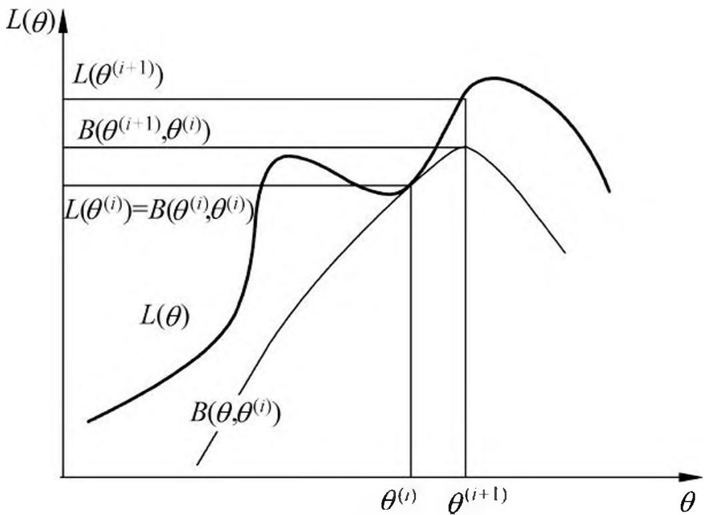

# 第 9 章 EM 算法及其推广

EM 算法是一种迭代算法，1977 年由 Dempster 等人总结提出，用于含有隐变量（hidden variable）的概率模型参数的极大似然估计，或极大后验概率估计。EM 算法的每次迭代由两步组成：E 步，求期望（expectation）；M 步，求极大（maximization）。所以这一算法称为期望极大算法（expectation maximization algorithm），简称 EM 算法。本章首先叙述 EM 算法，然后讨论 EM 算法的收敛性；作为 EM 算法的应用，介绍高斯混合模型的学习；最后叙述 EM 算法的推广——GEM 算法。

## 9.1 EM 算法的引入

概率模型有时既含有观测变量（observable variable），又含有隐变量或潜在变量（latent variable）。如果概率模型的变量都是观测变量，那么给定数据，可以直接用极大似然估计法，或贝叶斯估计法估计模型参数。但是，当模型含有隐变量时，就不能简单地使用这些估计方法。EM 算法就是含有隐变量的概率模型参数的极大似然估计法，或极大后验概率估计法。我们仅讨论极大似然估计，极大后验概率估计与其类似。

### 9.1.1 EM 算法

首先介绍一个使用 EM 算法的例子。

例 9.1（三硬币模型）假设有 3 枚硬币，分别记作 A，B，C。这些硬币正面出现的概率分别是 $\pi, p$ 和 $q$ 。进行如下掷硬币试验：先掷硬币 A，根据其结果选出硬币 B 或硬币 C，正面选硬币 B，反面选硬币 C；然后掷选出的硬币，掷硬币的结果，出现正面记作 1，出现反面记作 0；独立地重复 $n$ 次试验（这里， $n = 10$ ），观测结果如下：

$$
1, 1, 0, 1, 0, 0, 1, 0, 1, 1
$$

假设只能观测到掷硬币的结果，不能观测掷硬币的过程。问如何估计三硬币正面出现的概率，即三硬币模型的参数。

解 三硬币模型可以写作

$$
\begin{array}{l} P (y | \theta) = \sum_ {z} P (y, z | \theta) = \sum_ {z} P (z | \theta) P (y | z, \theta) \\ = \pi p ^ {y} (1 - p) ^ {1 - y} + (1 - \pi) q ^ {y} (1 - q) ^ {1 - y} \tag {9.1} \\ \end{array}
$$

这里，随机变量 $y$ 是观测变量，表示一次试验观测的结果是 1 或 0；随机变量 $z$ 是隐变量，表示未观测到的掷硬币 A 的结果； $\theta = (\pi ,p,q)$ 是模型参数。这一模型是以上数据的生成模型。注意，随机变量 $y$ 的数据可以观测，随机变量 $z$ 的数据不可观测。

将观测数据表示为 $Y = (Y_{1},Y_{2},\dots ,Y_{n})^{\mathrm{T}}$ ，未观测数据表示为 $Z = (Z_{1},Z_{2},\dots ,Z_{n})^{\mathrm{T}}$ 则观测数据的似然函数为

$$
P (Y | \theta) = \sum_ {Z} P (Z | \theta) P (Y | Z, \theta) \tag {9.2}
$$

即

$$
P (Y | \theta) = \prod_ {j = 1} ^ {n} \left[ \pi p ^ {y _ {j}} (1 - p) ^ {1 - y _ {j}} + (1 - \pi) q ^ {y _ {j}} (1 - q) ^ {1 - y _ {j}} \right] \tag {9.3}
$$

考虑求模型参数 $\theta = (\pi, p, q)$ 的极大似然估计，即

$$
\hat {\theta} = \arg \max  _ {\theta} \log P (Y | \theta) \tag {9.4}
$$

这个问题没有解析解，只有通过迭代的方法求解。EM 算法就是可以用于求解这个问题的一种迭代算法。下面给出针对以上问题的 EM 算法，其推导过程省略。

EM 算法首先选取参数的初值，记作 $\theta^{(0)} = (\pi^{(0)},p^{(0)},q^{(0)})$ ，然后通过下面的步骤迭代计算参数的估计值，直至收敛为止。第 $i$ 次迭代参数的估计值为 $\theta^{(i)} = (\pi^{(i)},p^{(i)},q^{(i)})$ 。EM 算法的第 $i + 1$ 次迭代如下。

E 步：计算在模型参数 $\pi^{(i)},p^{(i)},q^{(i)}$ 下观测数据 $y_{j}$ 来自掷硬币 B 的概率

$$
\mu_ {j} ^ {(i + 1)} = \frac {\pi^ {(i)} \left(p ^ {(i)}\right) ^ {y _ {j}} \left(1 - p ^ {(i)}\right) ^ {1 - y _ {j}}}{\pi^ {(i)} \left(p ^ {(i)}\right) ^ {y _ {j}} \left(1 - p ^ {(i)}\right) ^ {1 - y _ {j}} + \left(1 - \pi^ {(i)}\right) \left(q ^ {(i)}\right) ^ {y _ {j}} \left(1 - q ^ {(i)}\right) ^ {1 - y _ {j}}} \tag {9.5}
$$

M 步：计算模型参数的新估计值

$$
\pi^ {(i + 1)} = \frac {1}{n} \sum_ {j = 1} ^ {n} \mu_ {j} ^ {(i + 1)} \tag {9.6}
$$

$$
p ^ {(i + 1)} = \frac {\sum_ {j = 1} ^ {n} \mu_ {j} ^ {(i + 1)} y _ {j}}{\sum_ {j = 1} ^ {n} \mu_ {j} ^ {(i + 1)}} \tag {9.7}
$$

$$
q ^ {(i + 1)} = \frac {\sum_ {j = 1} ^ {n} \left(1 - \mu_ {j} ^ {(i + 1)}\right) y _ {j}}{\sum_ {j = 1} ^ {n} \left(1 - \mu_ {j} ^ {(i + 1)}\right)} \tag {9.8}
$$

进行数值计算。假设模型参数的初值取为

$$
\pi^ {(0)} = 0. 5, \quad p ^ {(0)} = 0. 5, \quad q ^ {(0)} = 0. 5
$$

由式 (9.5)，对 $y_{j} = 1$ 与 $y_{j} = 0$ 均有 $\mu_j^{(1)} = 0.5$ 。

利用迭代公式 (9.6)~公式 (9.8)，得到

$$
\pi^ {(1)} = 0. 5, \quad p ^ {(1)} = 0. 6, \quad q ^ {(1)} = 0. 6
$$

由式 (9.5),

$$
\mu_ {j} ^ {(2)} = 0. 5, \quad j = 1, 2, \dots , 1 0
$$

继续迭代，得

$$
\pi^ {(2)} = 0. 5, \quad p ^ {(2)} = 0. 6, \quad q ^ {(2)} = 0. 6
$$

于是得到模型参数 $\theta$ 的极大似然估计：

$$
\hat {\pi} = 0. 5, \quad \hat {p} = 0. 6, \quad \hat {q} = 0. 6
$$

$\pi = 0.5$ 表示硬币 A 是均匀的，这一结果容易理解。

如果取初值 $\pi^{(0)} = 0.4$ ， $p^{(0)} = 0.6$ ， $q^{(0)} = 0.7$ ，那么得到的模型参数的极大似然估计是 $\hat{\pi} = 0.4064$ ， $\hat{p} = 0.5368$ ， $\hat{q} = 0.6432$ 。这就是说，EM 算法与初值的选择有关，选择不同的初值可能得到不同的参数估计值。

一般地，用 $Y$ 表示观测随机变量的数据， $Z$ 表示隐随机变量的数据。 $Y$ 和 $Z$ 连在一起称为完全数据（complete-data），观测数据 $Y$ 又称为不完全数据（incomplete-data）。假设给定观测数据 $Y$ ，其概率分布是 $P(Y|\theta)$ ，其中 $\theta$ 是需要估计的模型参数，那么不完全数据 $Y$ 的似然函数是 $P(Y|\theta)$ ，对数似然函数 $L(\theta) = \log P(Y|\theta)$ ；假设 $Y$ 和 $Z$ 的联合概率分布是 $P(Y,Z|\theta)$ ，那么完全数据的对数似然函数是 $\log P(Y,Z|\theta)$ 。

EM 算法通过迭代求 $L(\theta) = \log P(Y|\theta)$ 的极大似然估计。每次迭代包含两步：E 步，求期望；M 步，求极大化。下面来介绍 EM 算法。

#### 算法 9.1（EM 算法）

输入：观测变量数据 $Y$ ，隐变量数据 $Z$ ，联合分布 $P(Y,Z|\theta)$ ，条件分布 $P(Z|Y,\theta)$ 输出：模型参数 $\theta$ 。

- (1) 选择参数的初值 $\theta^{(0)}$ , 开始迭代;
- (2) E 步: 记 $\theta^{(i)}$ 为第 $i$ 次迭代参数 $\theta$ 的估计值, 在第 $i + 1$ 次迭代的 E 步, 计算

$$
\begin{array}{l} Q (\theta , \theta^ {(i)}) = E _ {Z} [ \log P (Y, Z | \theta) | Y, \theta^ {(i)} ] \\ = \sum_ {Z} \log P (Y, Z | \theta) P (Z | Y, \theta^ {(i)}) \tag {9.9} \\ \end{array}
$$

这里， $P(Z|Y, \theta^{(i)})$ 是在给定观测数据 $Y$ 和当前的参数估计 $\theta^{(i)}$ 下隐变量数据 $Z$ 的条件概率分布；

(3) M 步: 求使 $Q(\theta, \theta^{(i)})$ 极大化的 $\theta$ , 确定第 $i + 1$ 次迭代的参数的估计值 $\theta^{(i + 1)}$

$$
\theta^ {(i + 1)} = \arg \max  _ {\theta} Q (\theta , \theta^ {(i)}) \tag {9.10}
$$

（4）重复第(2)步和第(3)步，直到收敛。

式(9.9)的函数 $Q(\theta ,\theta^{(i)})$ 是 EM 算法的核心，称为 $Q$ 函数（ $Q$ function）。

定义 9.1（ $Q$ 函数）完全数据的对数似然函数 $\log P(Y,Z|\theta)$ 关于在给定观测数据 $Y$ 和当前参数 $\theta^{(i)}$ 下对未观测数据 $Z$ 的条件概率分布 $P(Z|Y,\theta^{(i)})$ 的期望称为 $Q$ 函数，即

$$
Q (\theta , \theta^ {(i)}) = E _ {Z} [ \log P (Y, Z | \theta) | Y, \theta^ {(i)} ] \tag {9.11}
$$

下面关于 EM 算法作几点说明：

步骤（1）参数的初值可以任意选择，但需注意 EM 算法对初值是敏感的。

步骤（2）E 步求 $Q(\theta, \theta^{(i)})$ 。 $Q$ 函数式中 $Z$ 是未观测数据， $Y$ 是观测数据。注意， $Q(\theta, \theta^{(i)})$ 的第 1 个变元表示要极大化的参数，第 2 个变元表示参数的当前估计值。每次迭代实际在求 $Q$ 函数及其极大。

步骤（3）M 步求 $Q(\theta, \theta^{(i)})$ 的极大化，得到 $\theta^{(i+1)}$ ，完成一次迭代 $\theta^{(i)} \to \theta^{(i+1)}$ 。后面将证明每次迭代使似然函数增大或达到局部极值。

步骤（4）给出停止迭代的条件，一般是对较小的正数 $\varepsilon_1, \varepsilon_2$ ，若满足

$$
\| \theta^ {(i + 1)} - \theta^ {(i)} \| <   \varepsilon_ {1} \quad {\text {或}} \quad \| Q (\theta^ {(i + 1)}, \theta^ {(i)}) - Q (\theta^ {(i)}, \theta^ {(i)}) \| <   \varepsilon_ {2}
$$

则停止迭代。

### 9.1.2 EM 算法的导出

上面叙述了 EM 算法。为什么 EM 算法能近似实现对观测数据的极大似然估计呢？下面通过近似求解观测数据的对数似然函数的极大化问题来导出 EM 算法，由此可以清楚地看出 EM 算法的作用。

我们面对一个含有隐变量的概率模型，目标是极大化观测数据（不完全数据） $Y$ 关于参数 $\theta$ 的对数似然函数，即极大化

$$
\begin{array}{l} L (\theta) = \log P (Y | \theta) = \log \sum_ {Z} P (Y, Z | \theta) \\ = \log \left(\sum_ {Z} P (Y | Z, \theta) P (Z | \theta)\right) \tag {9.12} \\ \end{array}
$$

注意到这一极大化的主要困难是式 (9.12) 中有未观测数据并有包含和（或积分）的对数。

事实上，EM 算法是通过迭代逐步近似极大化 $L(\theta)$ 的。假设在第 $i$ 次迭代后 $\theta$ 的估计值是 $\theta^{(i)}$ 。我们希望新估计值 $\theta$ 能使 $L(\theta)$ 增加，即 $L(\theta) > L(\theta^{(i)})$ ，并逐步达到极大值。为此，考虑两者的差：

$$
L (\theta) - L \left(\theta^ {(i)}\right) = \log \left(\sum_ {Z} P (Y | Z, \theta) P (Z | \theta)\right) - \log P (Y | \theta^ {(i)})
$$

利用 Jensen 不等式（Jensen inequality）① 得到其下界：

> - ① 这里用到的是 $\log \sum_{j} \lambda_{j} y_{j} \geqslant \sum_{j} \lambda_{j} \log y_{j}$ ，其中 $\lambda_{j} \geqslant 0, \sum_{j} \lambda_{j} = 1$ 。

$$
\begin{array}{l} L (\theta) - L \left(\theta^ {(i)}\right) = \log \left(\sum_ {Z} P (Z | Y, \theta^ {(i)}) \frac {P (Y | Z , \theta) P (Z | \theta)}{P (Z | Y , \theta^ {(i)})}\right) - \log P (Y | \theta^ {(i)}) \\ \geqslant \sum_ {Z} P (Z | Y, \theta^ {(i)}) \log \frac {P (Y | Z , \theta) P (Z | \theta)}{P (Z | Y , \theta^ {(i)})} - \log P (Y | \theta^ {(i)}) \\ = \sum_ {Z} P (Z | Y, \theta^ {(i)}) \log \frac {P (Y | Z , \theta) P (Z | \theta)}{P (Z | Y , \theta^ {(i)}) P (Y | \theta^ {(i)})} \\ \end{array}
$$

令

$$
B \left(\theta , \theta^ {(i)}\right) \hat {=} L \left(\theta^ {(i)}\right) + \sum_ {Z} P (Z | Y, \theta^ {(i)}) \log \frac {P (Y | Z , \theta) P (Z | \theta)}{P (Z | Y , \theta^ {(i)}) P (Y | \theta^ {(i)})} \tag {9.13}
$$

则

$$
L (\theta) \geqslant B \left(\theta , \theta^ {(i)}\right) \tag {9.14}
$$

即函数 $B(\theta, \theta^{(i)})$ 是 $L(\theta)$ 的一个下界，而且由式 (9.13) 可知，

$$
L \left(\theta^ {(i)}\right) = B \left(\theta^ {(i)}, \theta^ {(i)}\right) \tag {9.15}
$$

因此，任何可以使 $B(\theta, \theta^{(i)})$ 增大的 $\theta$ ，也可以使 $L(\theta)$ 增大。为了使 $L(\theta)$ 有尽可能大的增长，选择 $\theta^{(i+1)}$ 使 $B(\theta, \theta^{(i)})$ 达到极大，即

$$
\theta^ {(i + 1)} = \arg \max  _ {\theta} B (\theta , \theta^ {(i)}) \tag {9.16}
$$

现在求 $\theta^{(i + 1)}$ 的表达式。省去对 $\theta$ 的极大化而言是常数的项，由式 (9.16)、式 (9.13) 及式 (9.10)，有

$$
\begin{array}{l} \theta^ {(i + 1)} = \arg \operatorname * {m a x} _ {\theta} \left(L (\theta^ {(i)}) + \sum_ {Z} P (Z | Y, \theta^ {(i)}) \log \frac {P (Y | Z , \theta) P (Z | \theta)}{P (Z | Y , \theta^ {(i)}) P (Y | \theta^ {(i)})}\right) \\ = \arg \max  _ {\theta} \left(\sum_ {Z} P (Z | Y, \theta^ {(i)}) \log (P (Y | Z, \theta) P (Z | \theta))\right) \\ = \arg \max  _ {\theta} \left(\sum_ {Z} P (Z | Y, \theta^ {(i)}) \log P (Y, Z | \theta)\right) \\ = \arg \max  _ {\theta} Q \left(\theta , \theta^ {(i)}\right) \tag {9.17} \\ \end{array}
$$

式 (9.17) 等价于 EM 算法的一次迭代，即求 $Q$ 函数及其极大化。EM 算法是通过不断求解下界的极大化逼近求解对数似然函数极大化的算法。

图 9.1 给出 EM 算法的直观解释。图中上方曲线为 $L(\theta)$ ，下方曲线为 $B(\theta, \theta^{(i)})$ 。由式(9.14)， $B(\theta, \theta^{(i)})$ 为对数似然函数 $L(\theta)$ 的下界。由式(9.15)，两个函数在点 $\theta = \theta^{(i)}$

> 图 9.1 EM 算法的解释

处相等。由式 (9.16) 和式 (9.17), EM 算法找到下一个点 $\theta^{(i+1)}$ 使函数 $B(\theta, \theta^{(i)})$ 极大化, 也使函数 $Q(\theta, \theta^{(i)})$ 极大化。这时由于 $L(\theta) \geqslant B(\theta, \theta^{(i)})$ , 函数 $B(\theta, \theta^{(i)})$ 的增加, 保证对数似然函数 $L(\theta)$ 在每次迭代中也是增加的。EM 算法在点 $\theta^{(i+1)}$ 重新计算 $Q$ 函数值, 进行下一次迭代。在这个过程中, 对数似然函数 $L(\theta)$ 不断增大。从图可以推断出 EM 算法不能保证找到全局最优值。

### 9.1.3 EM 算法在无监督学习中的应用

监督学习是由训练数据 $\{(x_1, y_1), (x_2, y_2), \dots, (x_N, y_N)\}$ 学习条件概率分布 $P(Y|X)$ 或决策函数 $Y = f(X)$ 作为模型，用于分类、回归、标注等任务。这时训练数据中的每个样本点由输入和输出对组成。

有时训练数据只有输入没有对应的输出 $\{(x_{1},\bullet),(x_{2},\bullet),\dots ,(x_{N},\bullet)\}$ ，从这样的数据学习模型称为无监督学习问题。EM 算法可以用于生成模型的无监督学习。生成模型由联合概率分布 $P(X,Y)$ 表示，可以认为无监督学习训练数据是联合概率分布产生的数据。 $X$ 为观测数据， $Y$ 为未观测数据。

## 9.2 EM 算法的收敛性

EM 算法提供一种近似计算含有隐变量概率模型的极大似然估计的方法。EM 算法的最大优点是简单性和普适性。我们很自然地要问：EM 算法得到的估计序列是否收敛？如果收敛，是否收敛到全局最大值或局部极大值？下面给出关于 EM 算法收敛性的两个定理。

定理 9.1 设 $P(Y|\theta)$ 为观测数据的似然函数， $\theta^{(i)}(i = 1,2,\dots)$ 为 EM 算法得到的参数估计序列， $P(Y|\theta^{(i)}) (i = 1,2,\dots)$ 为对应的似然函数序列，则 $P(Y|\theta^{(i)})$ 是单调递增的，即

$$
P (Y | \theta^ {(i + 1)}) \geqslant P (Y | \theta^ {(i)}) \tag {9.18}
$$

证明 由于

$$
P (Y | \theta) = \frac {P (Y , Z | \theta)}{P (Z | Y , \theta)}
$$

取对数有

$$
\log P (Y | \theta) = \log P (Y, Z | \theta) - \log P (Z | Y, \theta)
$$

由式 (9.11)

$$
Q (\theta , \theta^ {(i)}) = \sum_ {Z} \log P (Y, Z | \theta) P (Z | Y, \theta^ {(i)})
$$

令

$$
H (\theta , \theta^ {(i)}) = \sum_ {Z} \log P (Z | Y, \theta) P (Z | Y, \theta^ {(i)}) \tag {9.19}
$$

于是对数似然函数可以写成

$$
\log P (Y | \theta) = Q (\theta , \theta^ {(i)}) - H (\theta , \theta^ {(i)}) \tag {9.20}
$$

在式 (9.20) 中分别取 $\theta$ 为 $\theta^{(i)}$ 和 $\theta^{(i+1)}$ 并相减，有

$$
\begin{array}{l} \log P (Y | \theta^ {(i + 1)}) - \log P (Y | \theta^ {(i)}) \\ = \left[ Q \left(\theta^ {(i + 1)}, \theta^ {(i)}\right) - Q \left(\theta^ {(i)}, \theta^ {(i)}\right) \right] - \left[ H \left(\theta^ {(i + 1)}, \theta^ {(i)}\right) - H \left(\theta^ {(i)}, \theta^ {(i)}\right) \right] \tag {9.21} \\ \end{array}
$$

为证式 (9.18)，只需证式 (9.21) 右端是非负的。式 (9.21) 右端的第 1 项，由于 $\theta^{(i + 1)}$ 使 $Q(\theta, \theta^{(i)})$ 达到极大，所以有

$$
Q \left(\theta^ {(i + 1)}, \theta^ {(i)}\right) - Q \left(\theta^ {(i)}, \theta^ {(i)}\right) \geqslant 0 \tag {9.22}
$$

其第 2 项，由式(9.19)可得：

$$
\begin{array}{l} H \left(\theta^ {(i + 1)}, \theta^ {(i)}\right) - H \left(\theta^ {(i)}, \theta^ {(i)}\right) = \sum_ {Z} \left(\log \frac {P \left(Z \mid Y , \theta^ {(i + 1)}\right)}{P \left(Z \mid Y , \theta^ {(i)}\right)}\right) P \left(Z \mid Y, \theta^ {(i)}\right) \\ \leqslant \log \left(\sum_ {Z} \frac {P (Z | Y , \theta^ {(i + 1)})}{P (Z | Y , \theta^ {(i)})} P (Z | Y, \theta^ {(i)})\right) \\ = \log \left(\sum_ {Z} P (Z | Y, \theta^ {(i + 1)})\right) = 0 \tag {9.23} \\ \end{array}
$$

这里的不等号由 Jensen 不等式得到。

由式 (9.22) 和式 (9.23) 即知式 (9.21) 右端是非负的。

定理 9.2 设 $L(\theta) = \log P(Y|\theta)$ 为观测数据的对数似然函数， $\theta^{(i)} (i = 1,2,\dots)$ 为 EM 算法得到的参数估计序列， $L(\theta^{(i)}) (i = 1,2,\dots)$ 为对应的对数似然函数序列。

（1）如果 $P(Y|\theta)$ 有上界，则 $L(\theta^{(i)}) = \log P(Y|\theta^{(i)})$ 收敛到某一值 $L^{*}$（2）在函数 $Q(\theta, \theta')$ 与 $L(\theta)$ 满足一定条件下，由 EM 算法得到的参数估计序列 $\theta^{(i)}$ 的收敛值 $\theta^*$ 是 $L(\theta)$ 的稳定点。

证明 (1) 由 $L(\theta) = \log P(Y|\theta^{(i)})$ 的单调性及 $P(Y|\theta)$ 的有界性立即得到。

（2）证明从略，参阅文献[5]。

定理 9.2 关于函数 $Q(\theta, \theta')$ 与 $L(\theta)$ 的条件在大多数情况下都是满足的。EM 算法的收敛性包含关于对数似然函数序列 $L(\theta^{(i)})$ 的收敛性和关于参数估计序列 $\theta^{(i)}$ 的收敛性两层意思，前者并不蕴涵后者。此外，定理只能保证参数估计序列收敛到对数似然函数序列的稳定点，不能保证收敛到极大值点。所以在应用中，初值的选择变得非常重要，常用的办法是选取几个不同的初值进行迭代，然后对得到的各个估计值加以比较，从中选择最好的。

## 9.3 EM 算法在高斯混合模型学习中的应用

EM 算法的一个重要应用是高斯混合模型的参数估计。高斯混合模型应用广泛，在许多情况下，EM 算法是学习高斯混合模型（Gaussian mixture model）的有效方法。

### 9.3.1 高斯混合模型

定义 9.2（高斯混合模型） 高斯混合模型是指具有如下形式的概率分布模型：

$$
P (y | \theta) = \sum_ {k = 1} ^ {K} \alpha_ {k} \phi (y | \theta_ {k}) \tag {9.24}
$$

其中， $\alpha_{k}$ 是系数， $\alpha_{k} \geqslant 0$ ， $\sum_{k=1}^{K} \alpha_{k} = 1$ ； $\phi(y|\theta_{k})$ 是高斯分布密度， $\theta_{k} = (\mu_{k}, \sigma_{k}^{2})$

$$
\phi (y | \theta_ {k}) = \frac {1}{\sqrt {2 \pi} \sigma_ {k}} \exp \left(- \frac {\left(y - \mu_ {k}\right) ^ {2}}{2 \sigma_ {k} ^ {2}}\right) \tag {9.25}
$$

称为第 $k$ 个分模型。

一般混合模型可以由任意概率分布密度代替式 (9.25) 中的高斯分布密度，我们只介绍最常用的高斯混合模型。

### 9.3.2 高斯混合模型参数估计的 EM 算法

假设观测数据 $y_{1},y_{2},\dots ,y_{N}$ 由高斯混合模型生成，

$$
P (y | \theta) = \sum_ {k = 1} ^ {K} \alpha_ {k} \phi (y | \theta_ {k}) \tag {9.26}
$$

其中， $\theta = (\alpha_{1}, \alpha_{2}, \dots, \alpha_{K}; \theta_{1}, \theta_{2}, \dots, \theta_{K})$ 。我们用 EM 算法估计高斯混合模型的参数 $\theta$ 。

#### 1. 明确隐变量，写出完全数据的对数似然函数

可以设想观测数据 $y_{j}$ ， $j = 1,2,\dots ,N$ ，是这样产生的：首先依概率 $\alpha_{k}$ 选择第 $k$ 个高斯分布分模型 $\phi (y|\theta_k)$ ，然后依第 $k$ 个分模型的概率分布 $\phi (y|\theta_k)$ 生成观测数据 $y_{j}$ 。这时观测数据 $y_{j}$ ， $j = 1,2,\dots ,N$ ，是已知的；反映观测数据 $y_{j}$ 来自第 $k$ 个分模型的数据是未知的， $k = 1,2,\dots ,K$ ，以隐变量 $\gamma_{jk}$ 表示，其定义如下：

$$
\gamma_ {j k} = \left\{ \begin{array}{l l} 1, & \text {第} j \text {个 观 测 来 自 第} k \text {个 分 模 型} \\ 0, & \text {否 则} \end{array} \right.
$$

$$
j = 1, 2, \dots , N; k = 1, 2, \dots , K \tag {9.27}
$$

$\gamma_{jk}$ 是 0-1 随机变量。

有了观测数据 $y_{j}$ 及未观测数据 $\gamma_{jk}$ ，那么完全数据是

$$
\left(y _ {j}, \gamma_ {j 1}, \gamma_ {j 2}, \dots , \gamma_ {j K}\right), \quad j = 1, 2, \dots , N
$$

于是，可以写出完全数据的似然函数：

$$
\begin{array}{l} P (y, \gamma | \theta) = \prod_ {j = 1} ^ {N} P (y _ {j}, \gamma_ {j 1}, \gamma_ {j 2}, \dots , \gamma_ {j K} | \theta) \\ = \prod_ {k = 1} ^ {K} \prod_ {j = 1} ^ {N} \left\{\alpha_ {k} \phi \left(y _ {j} \mid \theta_ {k}\right) \right] ^ {\gamma_ {j k}} \\ = \prod_ {k = 1} ^ {K} \alpha_ {k} ^ {n _ {k}} \prod_ {j = 1} ^ {N} [ \phi (y _ {j} | \theta_ {k}) ] ^ {\gamma_ {j k}} \\ = \prod_ {k = 1} ^ {K} \alpha_ {k} ^ {n _ {k}} \prod_ {j = 1} ^ {N} \left[ \frac {1}{\sqrt {2 \pi} \sigma_ {k}} \exp \left(- \frac {(y _ {j} - \mu_ {k}) ^ {2}}{2 \sigma_ {k} ^ {2}}\right) \right] ^ {\gamma_ {j k}} \\ \end{array}
$$

式中， $n_k = \sum_{j=1}^{N} \gamma_{jk}, \sum_{k=1}^{K} n_k = N$ 。

那么，完全数据的对数似然函数为

$$
\log P (y, \gamma | \theta) = \sum_ {k = 1} ^ {K} \left\{n _ {k} \log \alpha_ {k} + \sum_ {j = 1} ^ {N} \gamma_ {j k} \left[ \log \left(\frac {1}{\sqrt {2 \pi}}\right) - \log \sigma_ {k} - \frac {1}{2 \sigma_ {k} ^ {2}} (y _ {j} - \mu_ {k}) ^ {2} \right] \right\}
$$

2. EM 算法的 E 步：确定 $Q$ 函数

$$
\begin{array}{l} Q (\theta , \theta^ {(i)}) = E [ \log P (y, \gamma | \theta) | y, \theta^ {(i)} ] \\ = E \left\{\sum_ {k = 1} ^ {K} \left\{n _ {k} \log \alpha_ {k} + \sum_ {j = 1} ^ {N} \gamma_ {j k} \left[ \log \left(\frac {1}{\sqrt {2 \pi}}\right) - \log \sigma_ {k} - \frac {1}{2 \sigma_ {k} ^ {2}} (y _ {j} - \mu_ {k}) ^ {2} \right] \right\} \right\} \\ = \sum_ {k = 1} ^ {K} \left\{\sum_ {j = 1} ^ {N} \left(E \gamma_ {j k}\right) \log \alpha_ {k} + \sum_ {j = 1} ^ {N} \left(E \gamma_ {j k}\right) \left[ \log \left(\frac {1}{\sqrt {2 \pi}}\right) - \log \sigma_ {k} - \frac {1}{2 \sigma_ {k} ^ {2}} \left(y _ {j} - \mu_ {k}\right) ^ {2} \right] \right\} \tag {9.28} \\ \end{array}
$$

这里需要计算 $E(\gamma_{jk}|y,\theta)$ ，记为 $\hat{\gamma}_{jk}$ 。

$$
\begin{array}{l} \hat {\gamma} _ {j k} = E \left(\gamma_ {j k} | y, \theta\right) = P \left(\gamma_ {j k} = 1 | y, \theta\right) \\ = \frac {P (\gamma_ {j k} = 1 , y _ {j} | \theta)}{\sum_ {k = 1} ^ {K} P (\gamma_ {j k} = 1 , y _ {j} | \theta)} \\ = \frac {P \left(y _ {j} \mid \gamma_ {j k} = 1 , \theta\right) P \left(\gamma_ {j k} = 1 \mid \theta\right)}{\sum_ {k = 1} ^ {K} P \left(y _ {j} \mid \gamma_ {j k} = 1 , \theta\right) P \left(\gamma_ {j k} = 1 \mid \theta\right)} \\ = \frac {\alpha_ {k} \phi (y _ {j} | \theta_ {k})}{\sum_ {k = 1} ^ {K} \alpha_ {k} \phi (y _ {j} | \theta_ {k})}, \quad j = 1, 2, \dots , N; \quad k = 1, 2, \dots , K \\ \end{array}
$$

$\hat{\gamma}_{jk}$ 是在当前模型参数下第 $j$ 个观测数据来自第 $k$ 个分模型的概率，称为分模型 $k$ 对观测数据 $y_{j}$ 的响应度。

将 $\hat{\gamma}_{jk} = E\gamma_{jk}$ 及 $n_k = \sum_{j=1}^{N}E\gamma_{jk}$ 代入式 (9.28)，即得

$$
Q (\theta , \theta^ {(i)}) = \sum_ {k = 1} ^ {K} \left\{n _ {k} \log \alpha_ {k} + \sum_ {j = 1} ^ {N} \hat {\gamma} _ {j k} \left[ \log \left(\frac {1}{\sqrt {2 \pi}}\right) - \log \sigma_ {k} - \frac {1}{2 \sigma_ {k} ^ {2}} (y _ {j} - \mu_ {k}) ^ {2} \right] \right\} \tag {9.29}
$$

#### 3. 确定 EM 算法的 M 步

迭代的 M 步是求函数 $Q(\theta ,\theta^{(i)})$ 对 $\theta$ 的极大值，即求新一轮迭代的模型参数：

$$
\theta^ {(i + 1)} = \arg \operatorname * {m a x} _ {\theta} Q (\theta , \theta^ {(i)})
$$

用 $\hat{\mu}_k$ ， $\hat{\sigma}_k^2$ 及 $\hat{\alpha}_k$ ， $k = 1,2,\dots,K$ ，表示 $\theta^{(i+1)}$ 的各参数。求 $\hat{\mu}_k$ ， $\hat{\sigma}_k^2$ 只需将式 (9.29) 分别对 $\mu_k$ ， $\sigma_k^2$ 求偏导数并令其为 0，即可得到；求 $\hat{\alpha}_k$ 是在 $\sum_{k=1}^{K}\alpha_k = 1$ 条件下求偏导数并令其为 0 得到的。结果如下：

$$
\hat {\mu} _ {k} = \frac {\sum_ {j = 1} ^ {N} \hat {\gamma} _ {j k} y _ {j}}{\sum_ {j = 1} ^ {N} \hat {\gamma} _ {j k}}, \quad k = 1, 2, \dots , K \tag {9.30}
$$

$$
\hat {\sigma} _ {k} ^ {2} = \frac {\sum_ {j = 1} ^ {N} \hat {\gamma} _ {j k} \left(y _ {j} - \mu_ {k}\right) ^ {2}}{\sum_ {j = 1} ^ {N} \hat {\gamma} _ {j k}}, \quad k = 1, 2, \dots , K \tag {9.31}
$$

$$
\hat {\alpha} _ {k} = \frac {n _ {k}}{N} = \frac {\sum_ {j = 1} ^ {N} \hat {\gamma} _ {j k}}{N}, \quad k = 1, 2, \dots , K \tag {9.32}
$$

重复以上计算，直到对数似然函数值不再有明显的变化为止。

现将估计高斯混合模型参数的 EM 算法总结如下。

#### 算法 9.2（高斯混合模型参数估计的 EM 算法）

输入：观测数据 $y_{1},y_{2},\dots ,y_{N}$ ，高斯混合模型；

输出：高斯混合模型参数。

- （1）取参数的初始值开始迭代；
- (2) E 步: 依据当前模型参数, 计算分模型 $k$ 对观测数据 $y_{j}$ 的响应度

$$
\hat {\gamma} _ {j k} = \frac {\alpha_ {k} \phi (y _ {j} | \theta_ {k})}{\sum_ {k = 1} ^ {K} \alpha_ {k} \phi (y _ {j} | \theta_ {k})}, \quad j = 1, 2, \dots , N; \quad k = 1, 2, \dots , K
$$

(3) M 步: 计算新一轮迭代的模型参数

$$
\hat {\mu} _ {k} = \frac {\sum_ {j = 1} ^ {N} \hat {\gamma} _ {j k} y _ {j}}{\sum_ {j = 1} ^ {N} \hat {\gamma} _ {j k}}, \quad k = 1, 2, \dots , K
$$

$$
\begin{array}{l} \hat {\sigma} _ {k} ^ {2} = \frac {\sum_ {j = 1} ^ {N} \hat {\gamma} _ {j k} (y _ {j} - \mu_ {k}) ^ {2}}{\sum_ {j = 1} ^ {N} \hat {\gamma} _ {j k}}, \quad k = 1, 2, \dots , K \\ \hat {\alpha} _ {k} = \frac {\sum_ {j = 1} ^ {N} \hat {\gamma} _ {j k}}{N}, \quad k = 1, 2, \dots , K \\ \end{array}
$$

（4）重复第（2）步和第（3）步，直到收敛。

## 9.4 EM 算法的推广

EM 算法还可以解释为 $F$ 函数（ $F$ function）的极大-极大算法（maximization maximization algorithm），基于这个解释有若干变形与推广，如广义期望极大（generalized expectation maximization，GEM）算法。下面予以介绍。

### 9.4.1 $F$ 函数的极大-极大算法

首先引进 $F$ 函数并讨论其性质。

定义 9.3（ $\pmb{F}$ 函数）假设隐变量数据 $Z$ 的概率分布为 $\tilde{P}(Z)$ ，定义分布 $\tilde{P}$ 与参数 $\theta$ 的函数 $F(\tilde{P}, \theta)$ 如下：

$$
F (\tilde {P}, \theta) = E _ {\tilde {P}} [ \log P (Y, Z | \theta) ] + H (\tilde {P}) \tag {9.33}
$$

称为 $F$ 函数。式中 $H(\tilde{P}) = -E_{\tilde{P}}\log \tilde{P} (Z)$ 是分布 $\tilde{P} (Z)$ 的熵。

在定义 9.3 中，通常假设 $P(Y,Z|\theta)$ 是 $\theta$ 的连续函数，因而 $F(\tilde{P},\theta)$ 是 $\tilde{P}$ 和 $\theta$ 的连续函数。函数 $F(\tilde{P},\theta)$ 还有以下重要性质。

引理 9.1 对于固定的 $\theta$ ，存在唯一的分布 $\tilde{P}_{\theta}$ 极大化 $F(\tilde{P},\theta)$ ，这时 $\tilde{P}_{\theta}$ 由下式给出：

$$
\tilde {P} _ {\theta} (Z) = P (Z | Y, \theta) \tag {9.34}
$$

并且 $\tilde{P}_{\theta}$ 随 $\theta$ 连续变化。

证明 对于固定的 $\theta$ ，可以求得使 $F(\tilde{P},\theta)$ 达到极大的分布 $\tilde{P}_{\theta}(Z)$ 。为此，引进拉格朗日乘子 $\lambda$ ，拉格朗日函数为

$$
L = E _ {\tilde {P}} \log P (Y, Z | \theta) - E _ {\tilde {P}} \log \tilde {P} (Z) + \lambda \left(1 - \sum_ {Z} \tilde {P} (Z)\right) \tag {9.35}
$$

将其对 $\tilde{P}$ 求偏导数：

$$
\frac {\partial L}{\partial \tilde {P} (Z)} = \log P (Y, Z | \theta) - \log \tilde {P} (Z) - 1 - \lambda
$$

令偏导数等于 0，得出

$$
\lambda = \log P (Y, Z | \theta) - \log \tilde {P} _ {\theta} (Z) - 1
$$

由此推出 $\tilde{P}_{\theta}(Z)$ 与 $P(Y,Z|\theta)$ 成比例

$$
\frac {P (Y , Z | \theta)}{\tilde {P} _ {\theta} (Z)} = \mathrm {e} ^ {1 + \lambda}
$$

再从约束条件 $\sum_{Z} \tilde{P}_{\theta}(Z) = 1$ 得式 (9.34)。

由假设 $P(Y,Z|\theta)$ 是 $\theta$ 的连续函数，得到 $\tilde{P}_{\theta}$ 是 $\theta$ 的连续函数。

引理 9.2 若 $\tilde{P}_{\theta}(Z) = P(Z|Y,\theta)$ ，则

$$
F (\tilde {P}, \theta) = \log P (Y | \theta) \tag {9.36}
$$

证明作为习题，留给读者。

由以上引理，可以得到关于 EM 算法用 $F$ 函数的极大-极大算法的解释。

定理 9.3 设 $L(\theta) = \log P(Y|\theta)$ 为观测数据的对数似然函数， $\theta^{(i)}, i = 1,2,\dots$ ，为 EM 算法得到的参数估计序列，函数 $F(\tilde{P},\theta)$ 由式(9.33)定义。如果 $F(\tilde{P},\theta)$ 在 $\tilde{P}^*$ 和 $\theta^*$ 有局部极大值，那么 $L(\theta)$ 也在 $\theta^*$ 有局部极大值。类似地，如果 $F(\tilde{P},\theta)$ 在 $\tilde{P}^*$ 和 $\theta^*$ 达到全局最大值，那么 $L(\theta)$ 也在 $\theta^*$ 达到全局最大值。

证明 由引理 9.1 和引理 9.2 可知， $L(\theta) = \log P(Y|\theta) = F(\tilde{P}_{\theta},\theta)$ 对任意 $\theta$ 成立。特别地，对于使 $F(\tilde{P},\theta)$ 达到极大的参数 $\theta^{*}$ ，有

$$
L \left(\theta^ {*}\right) = F \left(\tilde {P} _ {\theta^ {*}}, \theta^ {*}\right) = F \left(\tilde {P} ^ {*}, \theta^ {*}\right) \tag {9.37}
$$

为了证明 $\theta^{*}$ 是 $L(\theta)$ 的极大点，需要证明不存在接近 $\theta^{*}$ 的点 $\theta^{**}$ ，使 $L(\theta^{**}) > L(\theta^{*})$ 。假如存在这样的点 $\theta^{**}$ ，那么应有 $F(\tilde{P}^{**},\theta^{**}) > F(\tilde{P}^{*},\theta^{*})$ ，这里 $\tilde{P}^{**} = \tilde{P}_{\theta^{**}}$ 。但因 $\tilde{P}_{\theta}$是随 $\theta$ 连续变化的， $\tilde{P}^{**}$ 应接近 $\tilde{P}^*$ ，这与 $\tilde{P}^*$ 和 $\theta^*$ 是 $F(\tilde{P},\theta)$ 的局部极大点的假设矛盾。

类似可以证明关于全局最大值的结论。

定理 9.4 EM 算法的一次迭代可由 $F$ 函数的极大-极大算法实现。

设 $\theta^{(i)}$ 为第 $i$ 次迭代参数 $\theta$ 的估计， $\tilde{P}^{(i)}$ 为第 $i$ 次迭代函数 $\tilde{P}$ 的估计。在第 $i + 1$ 次迭代的两步为：

- (1) 对固定的 $\theta^{(i)}$ , 求 $\tilde{P}^{(i+1)}$ 使 $F(\tilde{P}, \theta^{(i)})$ 极大化;
- (2) 对固定的 $\tilde{P}^{(i+1)}$ , 求 $\theta^{(i+1)}$ 使 $F(\tilde{P}^{(i+1)}, \theta)$ 极大化。

证明 （1）由引理 9.1，对于固定的 $\theta^{(i)}$

$$
\tilde {P} ^ {(i + 1)} (Z) = \tilde {P} _ {\theta^ {(i)}} (Z) = P (Z | Y, \theta^ {(i)})
$$

使 $F(\tilde{P},\theta^{(i)})$ 极大化。此时，

$$
\begin{array}{l} F (\tilde {P} ^ {(i + 1)}, \theta) = E _ {\tilde {P} ^ {(i + 1)}} [ \log P (Y, Z | \theta) ] + H (\tilde {P} ^ {(i + 1)}) \\ = \sum_ {Z} \log P (Y, Z | \theta) P (Z | Y, \theta^ {(i)}) + H (\tilde {P} ^ {(i + 1)}) \\ \end{array}
$$

由 $Q(\theta, \theta^{(i)})$ 的定义式 (9.11) 有

$$
F (\tilde {P} ^ {(i + 1)}, \theta) = Q (\theta , \theta^ {(i)}) + H (\tilde {P} ^ {(i + 1)})
$$

(2) 固定 $\tilde{P}^{(i+1)}$ , 求 $\theta^{(i+1)}$ 使 $F(\tilde{P}^{(i+1)}, \theta)$ 极大化。得到

$$
\theta^ {(i + 1)} = \arg \max  _ {\theta} F (\tilde {P} ^ {(i + 1)}, \theta) = \arg \max  _ {\theta} Q (\theta , \theta^ {(i)})
$$

通过以上两步完成了 EM 算法的一次迭代。由此可知，由 EM 算法与 $F$ 函数的极大-极大算法得到的参数估计序列 $\theta^{(i)}, i = 1,2,\dots$ ，是一致的。

这样，就有 EM 算法的推广。

### 9.4.2 GEM 算法

#### 算法 9.3（GEM 算法 1）

输入：观测数据， $F$ 函数；

输出：模型参数。

(1) 初始化参数 $\theta^{(0)}$ , 开始迭代;（2）第 $i + 1$ 次迭代，第 1 步：记 $\theta^{(i)}$ 为参数 $\theta$ 的估计值， $\tilde{P}^{(i)}$ 为函数 $\tilde{P}$ 的估计，求 $\tilde{P}^{(i + 1)}$ 使 $\tilde{P}$ 极大化 $F(\tilde{P},\theta^{(i)})$ ；

(3) 第 2 步：求 $\theta^{(i + 1)}$ 使 $F(\tilde{P}^{(i + 1)},\theta)$ 极大化；

(4) 重复 (2) 和 (3), 直到收敛。

在 GEM 算法 1 中，有时求 $Q(\theta, \theta^{(i)})$ 的极大化是很困难的。下面介绍的 GEM 算法 2 和 GEM 算法 3 并不是直接求 $\theta^{(i+1)}$ 使 $Q(\theta, \theta^{(i)})$ 达到极大的 $\theta$ ，而是找一个 $\theta^{(i+1)}$ 使得 $Q(\theta^{(i+1)}, \theta^{(i)}) > Q(\theta^{(i)}, \theta^{(i)})$ 。

算法 9.4（GEM 算法 2）输入：观测数据， $Q$ 函数；

输出：模型参数。

- (1) 初始化参数 $\theta^{(0)}$ , 开始迭代;
- （2）第 $i + 1$ 次迭代，第 1 步：记 $\theta^{(i)}$ 为参数 $\theta$ 的估计值，计算

$$
\begin{array}{l} Q (\theta , \theta^ {(i)}) = E _ {Z} [ \log P (Y, Z | \theta) | Y, \theta^ {(i)} ] \\ = \sum_ {Z} P (Z | Y, \theta^ {(i)}) \log P (Y, Z | \theta) \\ \end{array}
$$

(3) 第 2 步：求 $\theta^{(i + 1)}$ 使

$$
Q (\theta^ {(i + 1)}, \theta^ {(i)}) > Q (\theta^ {(i)}, \theta^ {(i)})
$$

(4) 重复 (2) 和 (3), 直到收敛。

当参数 $\theta$ 的维数为 $d(d\geqslant 2)$ 时，可采用一种特殊的 GEM 算法，它将 EM 算法的 M 步分解为 $d$ 次条件极大化，每次只改变参数向量的一个分量，其余分量不改变。

算法 9.5（GEM 算法 3）输入：观测数据， $Q$ 函数；

输出：模型参数。

（1）初始化参数 $\theta^{(0)} = (\theta_{1}^{(0)},\theta_{2}^{(0)},\dots ,\theta_{d}^{(0)})$ ，开始迭代；

(2) 第 $i + 1$ 次迭代, 第 1 步: 记 $\theta^{(i)} = (\theta_{1}^{(i)}, \theta_{2}^{(i)}, \dots, \theta_{d}^{(i)})$ 为参数 $\theta = (\theta_{1}, \theta_{2}, \dots, \theta_{d})$ 的估计值, 计算

$$
\begin{array}{l} Q (\theta , \theta^ {(i)}) = E _ {Z} [ \log P (Y, Z | \theta) | Y, \theta^ {(i)} ] \\ = \sum_ {Z} P (Z | y, \theta^ {(i)}) \log P (Y, Z | \theta) \\ \end{array}
$$

(3) 第 2 步：进行 $d$ 次条件极大化：

首先，在 $\theta_2^{(i)},\dots ,\theta_d^{(i)}$ 保持不变的条件下求使 $Q(\theta ,\theta^{(i)})$ 达到极大的 $\theta_1^{(i + 1)}$然后，在 $\theta_{1} = \theta_{1}^{(i + 1)}$ ， $\theta_{j} = \theta_{j}^{(i)}$ ， $j = 3,4,\dots ,d$ 的条件下求使 $Q(\theta ,\theta^{(i)})$ 达到极大的 $\theta_2^{(i + 1)}$如此继续，经过 $d$ 次条件极大化，得到 $\theta^{(i + 1)} = (\theta_1^{(i + 1)},\theta_2^{(i + 1)},\dots ,\theta_d^{(i + 1)})$ 使得

$$
Q \left(\theta^ {(i + 1)}, \theta^ {(i)}\right) > Q \left(\theta^ {(i)}, \theta^ {(i)}\right)
$$

(4) 重复 (2) 和 (3)，直到收敛。

# 本章概要

1. EM 算法是含有隐变量的概率模型极大似然估计或极大后验概率估计的迭代算法。含有隐变量的概率模型的数据表示为 $P(Y,Z|\theta)$ 。这里， $Y$ 是观测变量的数据， $Z$ 是隐变量的数据， $\theta$ 是模型参数。EM 算法通过迭代求解观测数据的对数似然函数 $L(\theta) = \log P(Y|\theta)$ 的极大化，实现极大似然估计。每次迭代包括两步：E 步，求期望，即求 $\log P(Y,Z|\theta)$ 关于 $P(Z|Y,\theta^{(i)})$ 的期望：

$$
Q (\theta , \theta^ {(i)}) = \sum_ {Z} \log P (Y, Z | \theta) P (Z | Y, \theta^ {(i)})
$$

称为 $Q$ 函数，这里 $\theta^{(i)}$ 是参数的现估计值；M 步，求极大，即极大化 $Q$ 函数得到参数的新估计值：

$$
\theta^ {(i + 1)} = \arg \max  _ {\theta} Q (\theta , \theta^ {(i)})
$$

在构建具体的 EM 算法时，重要的是定义 $Q$ 函数。每次迭代中，EM 算法通过极大化 $Q$ 函数来增大对数似然函数 $L(\theta)$ 。

2. EM 算法在每次迭代后均提高观测数据的似然函数值，即

$$
P (Y | \theta^ {(i + 1)}) \geqslant P (Y | \theta^ {(i)})
$$

在一般条件下 EM 算法是收敛的，但不能保证收敛到全局最优。

3. EM 算法应用极其广泛，主要应用于含有隐变量的概率模型的学习。高斯混合模型的参数估计是 EM 算法的一个重要应用，下一章将要介绍的隐马尔可夫模型的无监督学习也是 EM 算法的一个重要应用。

4. EM 算法还可以解释为 $F$ 函数的极大-极大算法。EM 算法有许多变形，如 GEM 算法。GEM 算法的特点是每次迭代增加 $F$ 函数值（并不一定是极大化 $F$ 函数），从而增加似然函数值。

# 继续阅读

EM 算法由 Dempster 等人总结提出[1]。类似的算法之前已被提出，如 Baum-Welch 算法，但是都没有 EM 算法那么广泛。EM 算法的介绍可参见文献 $[2\sim 4]$ 。EM 算法收敛性定理的有关证明见文献[5]。GEM 是由 Neal 与 Hinton 提出的[6]。

# 习题

9.1 如例 9.1 的三硬币模型。假设观测数据不变, 试选择不同的初值, 例如, $\pi^{(0)} = 0.46$ , $p^{(0)} = 0.55$ , $q^{(0)} = 0.67$ , 求模型参数 $\theta = (\pi, p, q)$ 的极大似然估计。

9.2 证明引理 9.2。

9.3 已知观测数据 $-67, -48, 6, 8, 14, 16, 23, 24, 28, 29, 41, 49, 56, 60, 75$ 试估计两个分量的高斯混合模型的 5 个参数。

9.4 EM 算法可以用到朴素贝叶斯法的无监督学习。试写出其算法。

# 参考文献

- [1] Dempster A P, Laird N M, Rubin D B. Maximum-likelihood from incomplete data via the EM algorithm. Journal of the Royal Statistic Society (Series B), 1977, 39(1): 1-38.
- [2] Hastie T, Tibshirani R, Friedman J. The elements of statistical learning: data mining, inference, and prediction. Springer-Verlag, 2001. (中译本：统计学习基础——数据挖掘、推理与预测. 范明，柴玉梅，咎红英等译. 北京：电子工业出版社，2004.)
- [3] McLachlan G, Krishnan T. The EM algorithm and extensions. New York: John Wiley & Sons, 1996.
- [4] 苟诗松，王静龙，濮晓龙．高等数理统计．北京：高等教育出版社；海登堡：斯普林格出版社，1998.
- [5] Wu C F J. On the convergence properties of the EM algorithm. The Annals of Statistics, 1983, 11: 95-103.
- [6] Radford N, Geoffrey H, Jordan M I. A view of the EM algorithm that justifies incremental, sparse, and other variants. In: Learning in Graphical Models. Cambridge, MA: MIT Press, 1999, 355-368.