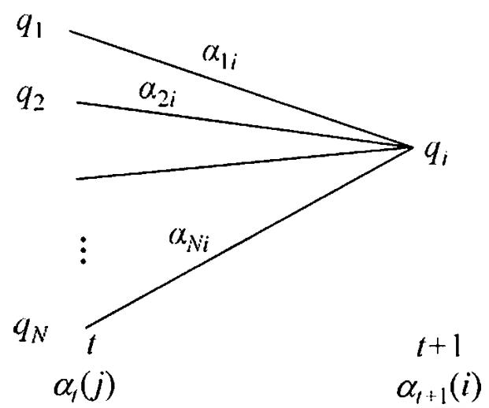
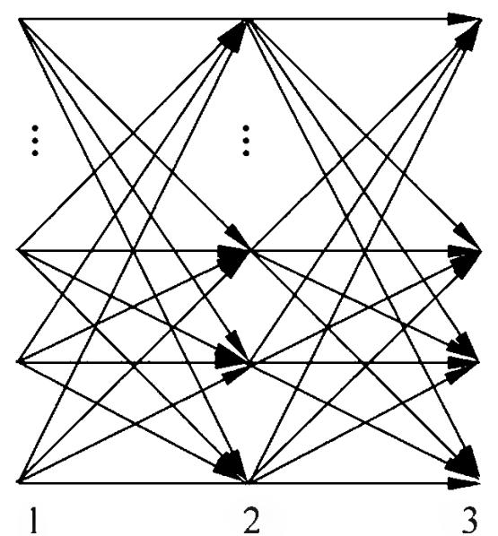
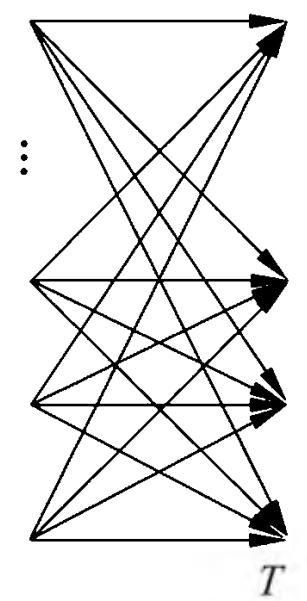
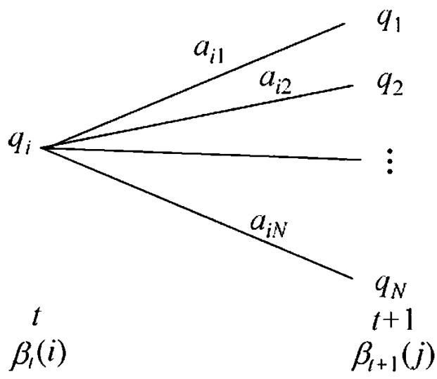
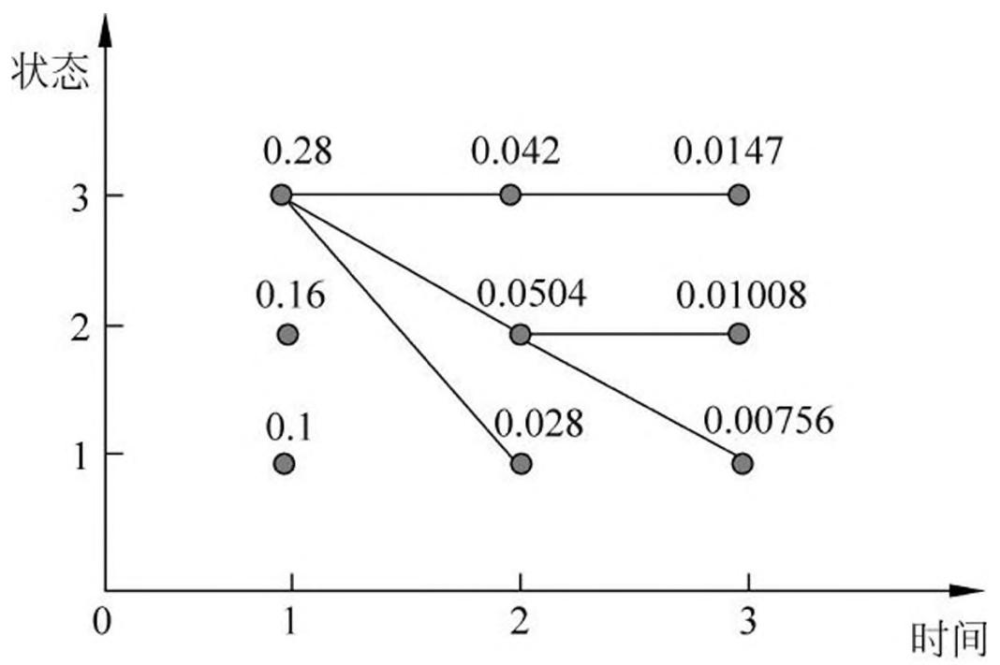

# 第 10 章 隐马尔可夫模型

隐马尔可夫模型（hidden Markov model, HMM）是可用于标注问题的统计学习模型，描述由隐藏的马尔可夫链随机生成观测序列的过程，属于生成模型。本章首先介绍隐马尔可夫模型的基本概念，然后分别叙述隐马尔可夫模型的概率计算算法、学习算法以及预测算法。隐马尔可夫模型在语音识别、自然语言处理、生物信息、模式识别等领域有着广泛的应用。

## 10.1 隐马尔可夫模型的基本概念

### 10.1.1 隐马尔可夫模型的定义

定义 10.1（隐马尔可夫模型）隐马尔可夫模型是关于时序的概率模型，描述由一个隐藏的马尔可夫链随机生成不可观测的状态随机序列，再由各个状态生成一个观测从而产生观测随机序列的过程。隐藏的马尔可夫链随机生成的状态的序列，称为状态序列(state sequence)；每个状态生成一个观测，而由此产生的观测的随机序列，称为观测序列(observation sequence)。序列的每一个位置又可以看作是一个时刻。

隐马尔可夫模型由初始概率分布、状态转移概率分布以及观测概率分布确定。隐马尔可夫模型的形式定义如下：

设 $Q$ 是所有可能的状态的集合， $V$ 是所有可能的观测的集合：

$$
Q = \left\{q _ {1}, q _ {2}, \dots , q _ {N} \right\}, \quad V = \left\{v _ {1}, v _ {2}, \dots , v _ {M} \right\}
$$

其中， $N$ 是可能的状态数， $M$ 是可能的观测数。

$I$ 是长度为 $T$ 的状态序列， $O$ 是对应的观测序列：

$$
I = \left(i _ {1}, i _ {2}, \dots , i _ {T}\right), \quad O = \left(o _ {1}, o _ {2}, \dots , o _ {T}\right)
$$

$A$ 是状态转移概率矩阵：

$$
A = \left[ a _ {i j} \right] _ {N \times N} \tag {10.1}
$$

其中，

$$
a _ {i j} = P \left(i _ {t + 1} = q _ {j} \mid i _ {t} = q _ {i}\right), \quad i = 1, 2, \dots , N; \quad j = 1, 2, \dots , N \tag {10.2}
$$

是在时刻 $t$ 处于状态 $q_{i}$ 的条件下在时刻 $t + 1$ 转移到状态 $q_{j}$ 的概率。

$B$ 是观测概率矩阵：

$$
B = \left[ b _ {j} (k) \right] _ {N \times M} \tag {10.3}
$$

其中，

$$
b _ {j} (k) = P \left(o _ {t} = v _ {k} \mid i _ {t} = q _ {j}\right), \quad k = 1, 2, \dots , M; \quad j = 1, 2, \dots , N \tag {10.4}
$$

是在时刻 $t$ 处于状态 $q_{j}$ 的条件下生成观测 $\upsilon_{k}$ 的概率。

$\pi$ 是初始状态概率向量：

$$
\pi = \left(\pi_ {i}\right) \tag {10.5}
$$

其中，

$$
\pi_ {i} = P \left(i _ {1} = q _ {i}\right), \quad i = 1, 2, \dots , N \tag {10.6}
$$

是时刻 $t = 1$ 处于状态 $q_{i}$ 的概率。

隐马尔可夫模型由初始状态概率向量 $\pi$ 、状态转移概率矩阵 $A$ 和观测概率矩阵 $B$ 决定。 $\pi$ 和 $A$ 决定状态序列， $B$ 决定观测序列。因此，隐马尔可夫模型 $\lambda$ 可以用三元符号表示，即

$$
\lambda = (A, B, \pi) \tag {10.7}
$$

$A, B, \pi$ 称为隐马尔可夫模型的三要素。

状态转移概率矩阵 $A$ 与初始状态概率向量 $\pi$ 确定了隐藏的马尔可夫链，生成不可观测的状态序列。观测概率矩阵 $B$ 确定了如何从状态生成观测，与状态序列综合确定了如何产生观测序列。

从定义可知，隐马尔可夫模型作了两个基本假设：

（1）齐次马尔可夫性假设，即假设隐藏的马尔可夫链在任意时刻 $t$ 的状态只依赖于其前一时刻的状态，与其他时刻的状态及观测无关，也与时刻 $t$ 无关：

$$
P \left(i _ {t} \mid i _ {t - 1}, o _ {t - 1}, \dots , i _ {1}, o _ {1}\right) = P \left(i _ {t} \mid i _ {t - 1}\right), \quad t = 1, 2, \dots , T \tag {10.8}
$$

（2）观测独立性假设，即假设任意时刻的观测只依赖于该时刻的马尔可夫链的状态，与其他观测及状态无关：

$$
P \left(o _ {t} \mid i _ {T}, o _ {T}, i _ {T - 1}, o _ {T - 1}, \dots , i _ {t + 1}, o _ {t + 1}, i _ {t}, i _ {t - 1}, o _ {t - 1}, \dots , i _ {1}, o _ {1}\right) = P \left(o _ {t} \mid i _ {t}\right) \tag {10.9}
$$

隐马尔可夫模型可以用于标注，这时状态对应着标记。标注问题是给定观测的序列预测其对应的标记序列。可以假设标注问题的数据是由隐马尔可夫模型生成的。这样我们可以利用隐马尔可夫模型的学习与预测算法进行标注。

下面看一个隐马尔可夫模型的例子。

例 10.1（盒子和球模型）假设有 4 个盒子，每个盒子里都装有红、白两种颜色的球，盒子里的红、白球数由表 10.1 列出。

**表 10.1 各盒子的红、白球数**

<table><tr><td></td><td colspan="4">盒子</td></tr><tr><td></td><td>1</td><td>2</td><td>3</td><td>4</td></tr><tr><td>红球数</td><td>5</td><td>3</td><td>6</td><td>8</td></tr><tr><td>白球数</td><td>5</td><td>7</td><td>4</td><td>2</td></tr></table>

按照下面的方法抽球，产生一个球的颜色的观测序列：

- - 开始，从 4 个盒子里以等概率随机选取 1 个盒子，从这个盒子里随机抽出 1 个球，记录其颜色后，放回；
- - 然后，从当前盒子随机转移到下一个盒子，规则是：如果当前盒子是盒子 1，那么下一盒子一定是盒子 2；如果当前是盒子 2 或 3，那么分别以概率 0.4 和 0.6 转移到左边或右边的盒子；如果当前是盒子 4，那么各以 0.5 的概率停留在盒子 4 或转移到盒子 3；
- - 确定转移的盒子后，再从这个盒子里随机抽出 1 个球，记录其颜色，放回；
- - 如此下去，重复进行 5 次，得到一个球的颜色的观测序列：

$$
O = (\text {红}, \text {红}, \text {白}, \text {白}, \text {红})
$$

在这个过程中，观察者只能观测到球的颜色的序列，观测不到球是从哪个盒子取出的，即观测不到盒子的序列。

在这个例子中有两个随机序列，一个是盒子的序列（状态序列），一个是球的颜色的观测序列（观测序列）。前者是隐藏的，只有后者是可观测的。这是一个隐马尔可夫模型的例子。根据所给条件，可以明确状态集合、观测集合、序列长度以及模型的三要素。

盒子对应状态，状态的集合是：

$$
Q = \{\text {盒 子} 1, \text {盒 子} 2, \text {盒 子} 3, \text {盒 子} 4 \}, \quad N = 4
$$

球的颜色对应观测。观测的集合是:

$$
V = \{\text {红}, \text {白} \}, \quad M = 2
$$

状态序列和观测序列长度 $T = 5$ 。

初始概率分布为

$$
\pi = (0. 2 5, 0. 2 5, 0. 2 5, 0. 2 5) ^ {\mathrm {T}}
$$

状态转移概率分布为

$$
A = \left[ \begin{array}{c c c c} 0 & 1 & 0 & 0 \\ 0. 4 & 0 & 0. 6 & 0 \\ 0 & 0. 4 & 0 & 0. 6 \\ 0 & 0 & 0. 5 & 0. 5 \end{array} \right]
$$

观测概率分布为

$$
B = \left[ \begin{array}{l l} 0. 5 & 0. 5 \\ 0. 3 & 0. 7 \\ 0. 6 & 0. 4 \\ 0. 8 & 0. 2 \end{array} \right]
$$

### 10.1.2 观测序列的生成过程

根据隐马尔可夫模型定义，可以将一个长度为 $T$ 的观测序列 $O = (o_{1}, o_{2}, \dots, o_{T})$ 的生成过程描述如下。

#### 算法 10.1（观测序列的生成）

输入：隐马尔可夫模型 $\lambda = (A,B,\pi)$ ，观测序列长度 $T$输出：观测序列 $O = (o_1,o_2,\dots ,o_T)$ 。

- （1）按照初始状态分布 $\pi$ 产生状态 $i_1$
- (2) 令 $t = 1$ ;
- （3）按照状态 $i_t$ 的观测概率分布 $b_{i_t}(k)$ 生成 $o_t$
- （4）按照状态 $i_t$ 的状态转移概率分布 $\{a_{i_t i_{t+1}}\}$ 产生状态 $i_{t+1}, i_{t+1} = 1, 2, \dots, N$ ；
- （5）令 $t = t + 1$ ；如果 $t < T$ ，转步 (3)；否则，终止。

### 10.1.3 隐马尔可夫模型的 3 个基本问题

隐马尔可夫模型有 3 个基本问题：

（1）概率计算问题。给定模型 $\lambda = (A,B,\pi)$ 和观测序列 $O = (o_{1},o_{2},\dots ,o_{T})$ ，计算在模型 $\lambda$ 下观测序列 $O$ 出现的概率 $P(O|\lambda)$ 。

（2）学习问题。已知观测序列 $O = (o_1, o_2, \dots, o_T)$ ，估计模型 $\lambda = (A, B, \pi)$ 参数，使得在该模型下观测序列概率 $P(O|\lambda)$ 最大。即用极大似然估计的方法估计参数。

（3）预测问题，也称为解码（decoding）问题。已知模型 $\lambda = (A, B, \pi)$ 和观测序列 $O = (o_1, o_2, \dots, o_T)$ ，求对给定观测序列条件概率 $P(I|O)$ 最大的状态序列 $I = (i_1, i_2, \dots, i_T)$ 。即给定观测序列，求最有可能的对应的状态序列。

下面各节将逐一介绍这些基本问题的解法。

## 10.2 概率计算算法

本节介绍计算观测序列概率 $P(O|\lambda)$ 的前向（forward）与后向（backward）算法。先介绍概念上可行但计算上不可行的直接计算法。

### 10.2.1 直接计算法

给定模型 $\lambda = (A, B, \pi)$ 和观测序列 $O = (o_1, o_2, \dots, o_T)$ ，计算观测序列 $O$ 出现的概率 $P(O|\lambda)$ 。最直接的方法是按概率公式直接计算。通过列举所有可能的长度为 $T$ 的状态序列 $I = (i_1, i_2, \dots, i_T)$ ，求各个状态序列 $I$ 与观测序列 $O = (o_1, o_2, \dots, o_T)$ 的联合概率 $P(O, I|\lambda)$ ，然后对所有可能的状态序列求和，得到 $P(O|\lambda)$ 。

状态序列 $I = (i_{1}, i_{2}, \dots, i_{T})$ 的概率是：

$$
P (I | \lambda) = \pi_ {i _ {1}} a _ {i _ {1} i _ {2}} a _ {i _ {2} i _ {3}} \dots a _ {i _ {T - 1} i _ {T}} \tag {10.10}
$$

对固定的状态序列 $I = (i_{1}, i_{2}, \dots, i_{T})$ ，观测序列 $O = (o_{1}, o_{2}, \dots, o_{T})$ 的概率是：

$$
P (O \mid I, \lambda) = b _ {i _ {1}} \left(o _ {1}\right) b _ {i _ {2}} \left(o _ {2}\right) \dots b _ {i _ {T}} \left(o _ {T}\right) \tag {10.11}
$$

$O$ 和 $I$ 同时出现的联合概率为

$$
\begin{array}{l} P (O, I | \lambda) = P (O | I, \lambda) P (I | \lambda) \\ = \pi_ {i _ {1}} b _ {i _ {1}} \left(o _ {1}\right) a _ {i _ {1} i _ {2}} b _ {i _ {2}} \left(o _ {2}\right) \dots a _ {i _ {T - 1} i _ {T}} b _ {i _ {T}} \left(o _ {T}\right) \tag {10.12} \\ \end{array}
$$

然后，对所有可能的状态序列 $I$ 求和，得到观测序列 $O$ 的概率 $P(O|\lambda)$ ，即

$$
\begin{array}{l} P (O | \lambda) = \sum_ {I} P (O | I, \lambda) P (I | \lambda) \\ = \sum_ {i _ {1}, i _ {2}, \dots , i _ {T}} \pi_ {i _ {1}} b _ {i _ {1}} \left(o _ {1}\right) a _ {i _ {1} i _ {2}} b _ {i _ {2}} \left(o _ {2}\right) \dots a _ {i _ {T - 1} i _ {T}} b _ {i _ {T}} \left(o _ {T}\right) \tag {10.13} \\ \end{array}
$$

但是，利用公式(10.13)计算量很大，是 $O(TN^{\mathrm{T}})$ 阶的，这种算法不可行。

下面介绍计算观测序列概率 $P(O|\lambda)$ 的有效算法：前向-后向算法（forward-backward algorithm）。

### 10.2.2 前向算法

首先定义前向概率。

定义 10.2（前向概率）给定隐马尔可夫模型 $\lambda$ ，定义到时刻 $t$ 部分观测序列为 $o_1,o_2,\dots ,o_t$ 且状态为 $q_{i}$ 的概率为前向概率，记作

$$
\alpha_ {t} (i) = P \left(o _ {1}, o _ {2}, \dots , o _ {t}, i _ {t} = q _ {i} \mid \lambda\right) \tag {10.14}
$$

可以递推地求得前向概率 $\alpha_{t}(i)$ 及观测序列概率 $P(O|\lambda)$ 。

算法 10.2（观测序列概率的前向算法）输入：隐马尔可夫模型 $\lambda$ ，观测序列 $O$输出：观测序列概率 $P(O|\lambda)$ 。

(1) 初值

$$
\alpha_ {1} (i) = \pi_ {i} b _ {i} \left(o _ {1}\right), \quad i = 1, 2, \dots , N \tag {10.15}
$$

(2) 递推 对 $t = 1, 2, \dots, T - 1$

$$
\alpha_ {t + 1} (i) = \left[ \sum_ {j = 1} ^ {N} \alpha_ {t} (j) a _ {j i} \right] b _ {i} \left(o _ {t + 1}\right), \quad i = 1, 2, \dots , N \tag {10.16}
$$

(3) 终止

$$
P (O | \lambda) = \sum_ {i = 1} ^ {N} \alpha_ {T} (i) \tag {10.17}
$$

前向算法，步骤（1）初始化前向概率，是初始时刻的状态 $i_1 = q_i$ 和观测 $o_1$ 的联合概率。步骤（2）是前向概率的递推公式，计算到时刻 $t + 1$ 部分观测序列为 $o_1, o_2, \dots, o_t, o_{t+1}$ 且在时刻 $t + 1$ 处于状态 $q_i$ 的前向概率，如图 10.1 所示。在式 (10.16) 的方括弧里，既然 $\alpha_t(j)$ 是到时刻 $t$ 观测到 $o_1, o_2, \dots, o_t$ 并在时刻 $t$ 处于状态 $q_j$ 的前向概率，那么乘积 $\alpha_t(j)a_{ji}$ 就是到时刻 $t$ 观测到 $o_1, o_2, \dots, o_t$ 并在时刻 $t$ 处于状态 $q_j$ 而在时刻 $t + 1$ 到达状态 $q_i$ 的联合概率。对这个乘积在时刻 $t$ 的所有可能的$N$ 个状态 $q_{j}$ 求和，其结果就是到时刻 $t$ 观测为 $o_1,o_2,\dots ,o_t$ 并在时刻 $t + 1$ 处于状态 $q_{i}$ 的联合概率。方括弧里的值与观测概率 $b_{i}(o_{t + 1})$ 的乘积恰好是到时刻 $t + 1$ 观测到 $o_1,o_2,\dots ,o_t,o_{t + 1}$ 并在时刻 $t + 1$ 处于状态 $q_{i}$ 的前向概率 $\alpha_{t + 1}(i)$ 。步骤（3）给出 $P(O|\lambda)$ 的计算公式。因为

$$
\alpha_ {T} (i) = P \left(o _ {1}, o _ {2}, \dots , o _ {T}, i _ {T} = q _ {i} | \lambda\right)
$$

所以

$$
P (O | \lambda) = \sum_ {i = 1} ^ {N} \alpha_ {T} (i)
$$

> 图 10.1 前向概率的递推公式

如图 10.2 所示，前向算法实际是基于“状态序列的路径结构”递推计算 $P(O|\lambda)$ 的算法。前向算法高效的关键是其局部计算前向概率，然后利用路径结构将前向概率“递推”到全局，得到 $P(O|\lambda)$ 。具体地，在时刻 $t = 1$ ，计算 $\alpha_{1}(i)$ 的 $N$ 个值 $(i = 1,2,\dots ,N)$ ；在各个时刻 $t = 1,2,\dots ,T - 1$ ，计算 $\alpha_{t + 1}(i)$ 的 $N$ 个值 $(i = 1,2,\dots ,N)$ ，而且每个 $\alpha_{t + 1}(i)$ 的计算利用前一时刻 $N$ 个 $\alpha_{t}(j)$ 。减少计算量的原因在于每一次计算直接引用前一个时刻的计算结果，避免重复计算。这样，利用前向概率计算 $P(O|\lambda)$ 的计算量是 $O(N^{2}T)$ 阶的，而不是直接计算的 $O(TN^T)$ 阶。

> 图 10.2 观测序列路径结构

例 10.2 考虑盒子和球模型 $\lambda = (A, B, \pi)$ ，状态集合 $Q = \{1, 2, 3\}$ ，观测集合 $V = \{\text{红，白}\}$

$$
A = \left[ \begin{array}{l l l} 0. 5 & 0. 2 & 0. 3 \\ 0. 3 & 0. 5 & 0. 2 \\ 0. 2 & 0. 3 & 0. 5 \end{array} \right], \quad B = \left[ \begin{array}{l l} 0. 5 & 0. 5 \\ 0. 4 & 0. 6 \\ 0. 7 & 0. 3 \end{array} \right], \quad \pi = \left[ \begin{array}{l} 0. 2 \\ 0. 4 \\ 0. 4 \end{array} \right]
$$

设 $T = 3$ ， $O =$ (红，白，红)，试用前向算法计算 $P(O|\lambda)$ 。

解 按照算法 10.2(1) 计算初值

$$
\alpha_ {1} (1) = \pi_ {1} b _ {1} (o _ {1}) = 0. 1 0
$$

$$
\alpha_ {1} (2) = \pi_ {2} b _ {2} \left(o _ {1}\right) = 0. 1 6
$$

$$
\alpha_ {1} (3) = \pi_ {3} b _ {3} (o _ {1}) = 0. 2 8
$$

(2) 递推计算

$$
\alpha_ {2} (1) = \left[ \sum_ {i = 1} ^ {3} \alpha_ {1} (i) a _ {i 1} \right] b _ {1} (o _ {2}) = 0. 1 5 4 \times 0. 5 = 0. 0 7 7
$$

$$
\alpha_ {2} (2) = \left[ \sum_ {i = 1} ^ {3} \alpha_ {1} (i) a _ {i 2} \right] b _ {2} (o _ {2}) = 0. 1 8 4 \times 0. 6 = 0. 1 1 0 4
$$

$$
\alpha_ {2} (3) = \left[ \sum_ {i = 1} ^ {3} \alpha_ {1} (i) a _ {i 3} \right] b _ {3} (o _ {2}) = 0. 2 0 2 \times 0. 3 = 0. 0 6 0 6
$$

$$
\alpha_ {3} (1) = \left[ \sum_ {i = 1} ^ {3} \alpha_ {2} (i) a _ {i 1} \right] b _ {1} \left(o _ {3}\right) = 0. 0 4 1 8 7
$$

$$
\alpha_ {3} (2) = \left[ \sum_ {i = 1} ^ {3} \alpha_ {2} (i) a _ {i 2} \right] b _ {2} \left(o _ {3}\right) = 0. 0 3 5 5 1
$$

$$
\alpha_ {3} (3) = \left[ \sum_ {i = 1} ^ {3} \alpha_ {2} (i) a _ {i 3} \right] b _ {3} (o _ {3}) = 0. 0 5 2 8 4
$$

(3) 终止

$$
P (O | \lambda) = \sum_ {i = 1} ^ {3} \alpha_ {3} (i) = 0. 1 3 0 2 2
$$

### 10.2.3 后向算法

定义 10.3（后向概率）给定隐马尔可夫模型 $\lambda$ ，定义在时刻 $t$ 状态为 $q_{i}$ 的条件下，从 $t + 1$ 到 $T$ 的部分观测序列为 $o_{t + 1}, o_{t + 2}, \dots, o_{T}$ 的概率为后向概率，记作

$$
\beta_ {t} (i) = P \left(o _ {t + 1}, o _ {t + 2}, \dots , o _ {T} \mid i _ {t} = q _ {i}, \lambda\right) \tag {10.18}
$$

可以用递推的方法求得后向概率 $\beta_{t}(i)$ 及观测序列概率 $P(O|\lambda)$ 。

算法 10.3（观测序列概率的后向算法）输入：隐马尔可夫模型 $\lambda$ ，观测序列 $O$输出：观测序列概率 $P(O|\lambda)$ 。

(1)

$$
\beta_ {T} (i) = 1, \quad i = 1, 2, \dots , N \tag {10.19}
$$

(2) 对 $t = T - 1, T - 2, \dots, 1$

$$
\beta_ {t} (i) = \sum_ {j = 1} ^ {N} a _ {i j} b _ {j} \left(o _ {t + 1}\right) \beta_ {t + 1} (j), \quad i = 1, 2, \dots , N \tag {10.20}
$$

(3)

$$
P (O | \lambda) = \sum_ {i = 1} ^ {N} \pi_ {i} b _ {i} \left(o _ {1}\right) \beta_ {1} (i) \tag {10.21}
$$

步骤（1）初始化后向概率，对最终时刻的所有状态 $q_{i}$ 规定 $\beta_{T}(i) = 1$ 。步骤（2）是后向概率的递推公式。如图 10.3 所示，为了计算在时刻 $t$ 状态为 $q_{i}$ 条件下时刻 $t + 1$ 之后的观测序列为 $o_{t + 1},o_{t + 2},\dots ,o_{T}$ 的后向概率 $\beta_{t}(i)$ ，只需考虑在时刻 $t + 1$ 所有可能的 $N$ 个状态 $q_{j}$ 的转移概率（即 $a_{ij}$ 项)，以及在此状态下的观测 $o_{t + 1}$ 的观测

> 图 10.3 后向概率递推公式

概率（即 $b_{j}(o_{t + 1})$ 项），然后考虑状态 $q_{j}$ 之后的观测序列的后向概率（即 $\beta_{t + 1}(j)$ 项）。步骤（3）求 $P(O|\lambda)$ 的思路与步骤（2）一致，只是初始概率 $\pi_{i}$ 代替转移概率。

利用前向概率和后向概率的定义可以将观测序列概率 $P(O|\lambda)$ 统一写成

$$
P (O | \lambda) = \sum_ {i = 1} ^ {N} \sum_ {j = 1} ^ {N} \alpha_ {t} (i) a _ {i j} b _ {j} \left(o _ {t + 1}\right) \beta_ {t + 1} (j), \quad t = 1, 2, \dots , T - 1 \tag {10.22}
$$

### 10.2.4 一些概率与期望值的计算

利用前向概率和后向概率，可以得到关于单个状态和两个状态概率的计算公式。

1. 给定模型 $\lambda$ 和观测 $O$ ，在时刻 $t$ 处于状态 $q_{i}$ 的概率。记

$$
\gamma_ {t} (i) = P (i _ {t} = q _ {i} | O, \lambda) \tag {10.23}
$$

可以通过前向后向概率计算。事实上，

$$
\gamma_ {t} (i) = P (i _ {t} = q _ {i} | O, \lambda) = \frac {P (i _ {t} = q _ {i} , O | \lambda)}{P (O | \lambda)}
$$

由前向概率 $\alpha_{t}(i)$ 和后向概率 $\beta_{t}(i)$ 定义可知：

$$
\alpha_ {t} (i) \beta_ {t} (i) = P (i _ {t} = q _ {i}, O | \lambda)
$$

于是得到：

$$
\gamma_ {t} (i) = \frac {\alpha_ {t} (i) \beta_ {t} (i)}{P (O | \lambda)} = \frac {\alpha_ {t} (i) \beta_ {t} (i)}{\sum_ {j = 1} ^ {N} \alpha_ {t} (j) \beta_ {t} (j)} \tag {10.24}
$$

2. 给定模型 $\lambda$ 和观测 $O$ , 在时刻 $t$ 处于状态 $q_{i}$ 且在时刻 $t + 1$ 处于状态 $q_{j}$ 的概率。记

$$
\xi_ {t} (i, j) = P (i _ {t} = q _ {i}, i _ {t + 1} = q _ {j} | O, \lambda) \tag {10.25}
$$

可以通过前向后向概率计算：

$$
\xi_ {t} (i, j) = \frac {P (i _ {t} = q _ {i} , i _ {t + 1} = q _ {j} , O | \lambda)}{P (O | \lambda)} = \frac {P (i _ {t} = q _ {i} , i _ {t + 1} = q _ {j} , O | \lambda)}{\sum_ {i = 1} ^ {N} \sum_ {j = 1} ^ {N} P (i _ {t} = q _ {i} , i _ {t + 1} = q _ {j} , O | \lambda)}
$$

而

$$
P (i _ {t} = q _ {i}, i _ {t + 1} = q _ {j}, O | \lambda) = \alpha_ {t} (i) a _ {i j} b _ {j} (o _ {t + 1}) \beta_ {t + 1} (j)
$$

所以

$$
\xi_ {t} (i, j) = \frac {\alpha_ {t} (i) a _ {i j} b _ {j} \left(o _ {t + 1}\right) \beta_ {t + 1} (j)}{\sum_ {i = 1} ^ {N} \sum_ {j = 1} ^ {N} \alpha_ {t} (i) a _ {i j} b _ {j} \left(o _ {t + 1}\right) \beta_ {t + 1} (j)} \tag {10.26}
$$

3. 将 $\gamma_{t}(i)$ 和 $\xi_{t}(i,j)$ 对各个时刻 $t$ 求和，可以得到一些有用的期望值。

（1）在观测 $O$ 下状态 $i$ 出现的期望值：

$$
\sum_ {t = 1} ^ {T} \gamma_ {t} (i) \tag {10.27}
$$

(2) 在观测 $O$ 下由状态 $i$ 转移的期望值:

$$
\sum_ {t = 1} ^ {T - 1} \gamma_ {t} (i) \tag {10.28}
$$

（3）在观测 $O$ 下由状态 $i$ 转移到状态 $j$ 的期望值：

$$
\sum_ {t = 1} ^ {T - 1} \xi_ {t} (i, j) \tag {10.29}
$$

## 10.3 学习算法

隐马尔可夫模型的学习，根据训练数据是包括观测序列和对应的状态序列还是只有观测序列，可以分别由监督学习与无监督学习实现。本节首先介绍监督学习算法，而后介绍无监督学习算法——Baum-Welch 算法（也就是 EM 算法）。

### 10.3.1 监督学习方法

假设已给训练数据包含 $S$ 个长度相同的观测序列和对应的状态序列 $\{(O_1, I_1), (O_2, I_2), \dots, (O_S, I_S)\}$ ，那么可以利用极大似然估计法来估计隐马尔可夫模型的参数。具体方法如下。

#### 1. 转移概率 $a_{ij}$ 的估计

设样本中时刻 $t$ 处于状态 $i$ 时刻 $t + 1$ 转移到状态 $j$ 的频数为 $A_{ij}$ ，那么状态转移概率 $a_{ij}$ 的估计是

$$
\hat {a} _ {i j} = \frac {A _ {i j}}{N}, \quad i = 1, 2, \dots , N; \quad j = 1, 2, \dots , N \tag {10.30}
$$

#### 2.观测概率 $b_{j}(k)$ 的估计

设样本中状态为 $j$ 并观测为 $k$ 的频数是 $B_{jk}$ ，那么状态为 $j$ 观测为 $k$ 的概率 $b_{j}(k)$ 的估计是

$$
\hat {b} _ {j} (k) = \frac {B _ {j k}}{\sum_ {k = 1} ^ {M} B _ {j k}}, \quad j = 1, 2, \dots , N; \quad k = 1, 2, \dots , M \tag {10.31}
$$

#### 3. 初始状态概率 $\pi_{i}$ 的估计 $\hat{\pi}_i$ 为 $S$ 个样本中初始状态为 $q_{i}$ 的频率

由于监督学习需要使用标注的训练数据，而人工标注训练数据往往代价很高，有时就会利用无监督学习的方法。

### 10.3.2 Baum-Welch 算法

假设给定训练数据只包含 $S$ 个长度为 $T$ 的观测序列 $\{O_1,O_2,\dots ,O_S\}$ 而没有对应的状态序列，目标是学习隐马尔可夫模型 $\lambda = (A,B,\pi)$ 的参数。我们将观测序列数据看作观测数据 $O$ ，状态序列数据看作不可观测的隐数据 $I$ ，那么隐马尔可夫模型事实上是一个含有隐变量的概率模型

$$
P (O | \lambda) = \sum_ {I} P (O | I, \lambda) P (I | \lambda) \tag {10.32}
$$

它的参数学习可以由 EM 算法实现。

#### 1. 确定完全数据的对数似然函数

所有观测数据写成 $O = (o_{1}, o_{2}, \dots, o_{T})$ ，所有隐数据写成 $I = (i_{1}, i_{2}, \dots, i_{T})$ ，完全数据是 $(O, I) = (o_{1}, o_{2}, \dots, o_{T}, i_{1}, i_{2}, \dots, i_{T})$ 。完全数据的对数似然函数是 $\log P(O, I|\lambda)$ 。

#### 2. EM 算法的 E 步：求 $Q$ 函数 $Q(\lambda, \overline{\lambda})$ ①

> - ① 按照 $Q$ 函数的定义

$$
Q (\lambda , \bar {\lambda}) = \sum_ {I} \log P (O, I | \lambda) P (O, I | \bar {\lambda}) \tag {10.33}
$$

其中， $\bar{\lambda}$ 是隐马尔可夫模型参数的当前估计值， $\lambda$ 是要极大化的隐马尔可夫模型参数。

$$
P (O, I | \lambda) = \pi_ {i _ {1}} b _ {i _ {1}} (o _ {1}) a _ {i _ {1} i _ {2}} b _ {i _ {2}} (o _ {2}) \dots a _ {i _ {T - 1} i _ {T}} b _ {i _ {T}} (o _ {T})
$$

于是函数 $Q(\lambda, \overline{\lambda})$ 可以写成：

$$
\begin{array}{l} Q (\lambda , \bar {\lambda}) = \sum_ {I} \log \pi_ {i _ {1}} P (O, I | \bar {\lambda}) + \sum_ {I} \left(\sum_ {t = 1} ^ {T - 1} \log a _ {i _ {t} i _ {t + 1}}\right) P (O, I | \bar {\lambda}) + \\ \sum_ {I} \left(\sum_ {t = 1} ^ {T} \log b _ {i _ {t}} \left(o _ {t}\right)\right) P (O, I | \bar {\lambda}) \tag {10.34} \\ \end{array}
$$

式中求和都是对所有数据的序列总长度 $T$ 进行的。

#### 3. EM 算法的 M 步：极大化 $Q$ 函数 $Q(\lambda, \bar{\lambda})$ 求模型参数 $A, B, \pi$

由于要极大化的参数在式 (10.34) 中单独地出现在 3 个项中，所以只需对各项分别极大化。

（1）式(10.34)的第 1 项可以写成：

$$
\sum_ {I} \log \pi_ {i _ {1}} P (O, I | \bar {\lambda}) = \sum_ {i = 1} ^ {N} \log \pi_ {i} P (O, i _ {1} = i | \bar {\lambda})
$$

注意到 $\pi_{i}$ 满足约束条件 $\sum_{i=1}^{N} \pi_{i} = 1$ ，利用拉格朗日乘子法，写出拉格朗日函数：

$$
\sum_ {i = 1} ^ {N} \log \pi_ {i} P (O, i _ {1} = i | \bar {\lambda}) + \gamma \left(\sum_ {i = 1} ^ {N} \pi_ {i} - 1\right)
$$

对其求偏导数并令结果为 0

$$
\frac {\partial}{\partial \pi_ {i}} \left[ \sum_ {i = 1} ^ {N} \log \pi_ {i} P (O, i _ {1} = i | \bar {\lambda}) + \gamma \left(\sum_ {i = 1} ^ {N} \pi_ {i} - 1\right) \right] = 0 \tag {10.35}
$$

得

$$
P (O, i _ {1} = i | \bar {\lambda}) + \gamma \pi_ {i} = 0
$$

对 $i$ 求和得到 $\gamma$

$$
\gamma = - P (O | \bar {\lambda})
$$

代入式 (10.35) 即得

$$
\pi_ {i} = \frac {P (O , i _ {1} = i | \bar {\lambda})}{P (O | \bar {\lambda})} \tag {10.36}
$$

(2) 式 (10.34) 的第 2 项可以写成

$$
\sum_ {I} \left(\sum_ {t = 1} ^ {T - 1} \log a _ {i _ {t} i _ {t + 1}}\right) P (O, I | \bar {\lambda}) = \sum_ {i = 1} ^ {N} \sum_ {j = 1} ^ {N} \sum_ {t = 1} ^ {T - 1} \log a _ {i j} P (O, i _ {t} = i, i _ {t + 1} = j | \bar {\lambda})
$$

类似第 1 项，应用具有约束条件 $\sum_{j=1}^{N} a_{ij} = 1$ 的拉格朗日乘子法可以求出

$$
a _ {i j} = \frac {\sum_ {t = 1} ^ {T - 1} P \left(O , i _ {t} = i , i _ {t + 1} = j \mid \bar {\lambda}\right)}{\sum_ {t = 1} ^ {T - 1} P \left(O , i _ {t} = i \mid \bar {\lambda}\right)} \tag {10.37}
$$

（3）式(10.34)的第 3 项为

$$
\sum_ {I} \left(\sum_ {t = 1} ^ {T} \log b _ {i _ {t}} (o _ {t})\right) P (O, I | \bar {\lambda}) = \sum_ {j = 1} ^ {N} \sum_ {t = 1} ^ {T} \log b _ {j} (o _ {t}) P (O, i _ {t} = j | \bar {\lambda})
$$

同样用拉格朗日乘子法，约束条件是 $\sum_{k=1}^{M} b_{j}(k) = 1$ 。注意，只有在 $o_{t} = v_{k}$ 时 $b_{j}(o_{t})$ 对 $b_{j}(k)$ 的偏导数才不为 0，以 $I(o_{t} = v_{k})$ 表示。求得

$$
b _ {j} (k) = \frac {\sum_ {t = 1} ^ {T} P \left(O , i _ {t} = j \mid \bar {\lambda}\right) I \left(o _ {t} = v _ {k}\right)}{\sum_ {t = 1} ^ {T} P \left(O , i _ {t} = j \mid \bar {\lambda}\right)} \tag {10.38}
$$

### 10.3.3 Baum-Welch 模型参数估计公式

将式 $(10.36) \sim$ 式 (10.38) 中的各概率分别用 $\gamma_{t}(i), \xi_{t}(i,j)$ 表示，则可将相应的公式写成：

$$
a _ {i j} = \frac {\sum_ {t = 1} ^ {T - 1} \xi_ {t} (i , j)}{\sum_ {t = 1} ^ {T - 1} \gamma_ {t} (i)} \tag {10.39}
$$

$$
b _ {j} (k) = \frac {\sum_ {t = 1 , o _ {t} = v _ {k}} ^ {T} \gamma_ {t} (j)}{\sum_ {t = 1} ^ {T} \gamma_ {t} (j)} \tag {10.40}
$$

$$
\pi_ {i} = \gamma_ {1} (i) \tag {10.41}
$$

其中， $\gamma_t(i), \xi_t(i, j)$ 分别由式 (10.24) 及式 (10.26) 给出。式 (10.39)~式 (10.41) 就是 Baum-Welch 算法（Baum-Welch algorithm），它是 EM 算法在隐马尔可夫模型学习中的具体实现，由 Baum 和 Welch 提出。

#### 算法 10.4（Baum-Welch 算法）

输入：观测数据 $O = (o_{1}, o_{2}, \dots, o_{T})$输出: 隐马尔可夫模型参数。

(1) 初始化。对 $n = 0$ ，选取 $a_{ij}^{(0)}, b_j(k)^{(0)}, \pi_i^{(0)}$ ，得到模型 $\lambda^{(0)} = (A^{(0)}, B^{(0)}, \pi^{(0)})$ 。

(2) 递推。对 $n = 1, 2, \dots$

$$
a _ {i j} ^ {(n + 1)} = \frac {\sum_ {t = 1} ^ {T - 1} \xi_ {t} (i , j)}{\sum_ {t = 1} ^ {T - 1} \gamma_ {t} (i)}
$$

$$
b _ {j} (k) ^ {(n + 1)} = \frac {\sum_ {t = 1 , o _ {t} = v _ {k}} ^ {T} \gamma_ {t} (j)}{\sum_ {t = 1} ^ {T} \gamma_ {t} (j)}
$$

$$
\pi_ {i} ^ {(n + 1)} = \gamma_ {1} (i)
$$

右端各值按观测 $O = (o_{1}, o_{2}, \dots, o_{T})$ 和模型 $\lambda^{(n)} = (A^{(n)}, B^{(n)}, \pi^{(n)})$ 计算。式中 $\gamma_{t}(i), \xi_{t}(i,j)$ 由式 (10.24) 和式 (10.26) 给出。

（3）终止。得到模型参数 $\lambda^{(n + 1)} = (A^{(n + 1)},B^{(n + 1)},\pi^{(n + 1)})$

## 10.4 预测算法

下面介绍隐马尔可夫模型预测的两种算法：近似算法与维特比算法（Viterbi algorithm）。

### 10.4.1 近似算法

近似算法的想法是，在每个时刻 $t$ 选择在该时刻最有可能出现的状态 $i_t^*$ ，从而得到一个状态序列 $I^* = (i_1^*, i_2^*, \dots, i_T^*)$ ，将它作为预测的结果。

给定隐马尔可夫模型 $\lambda$ 和观测序列 $O$ ，在时刻 $t$ 处于状态 $q_{i}$ 的概率 $\gamma_{t}(i)$ 是

$$
\gamma_ {t} (i) = \frac {\alpha_ {t} (i) \beta_ {t} (i)}{P (O | \lambda)} = \frac {\alpha_ {t} (i) \beta_ {t} (i)}{\sum_ {j = 1} ^ {N} \alpha_ {t} (j) \beta_ {t} (j)} \tag {10.42}
$$

在每一时刻 $t$ 最有可能的状态 $i_t^*$ 是

$$
i _ {t} ^ {*} = \arg \max  _ {1 \leqslant i \leqslant N} [ \gamma_ {t} (i) ], \quad t = 1, 2, \dots , T \tag {10.43}
$$

从而得到状态序列 $I^{*} = \left(i_{1}^{*},i_{2}^{*},\dots ,i_{T}^{*}\right)$近似算法的优点是计算简单，其缺点是不能保证预测的状态序列整体是最有可能的状态序列，因为预测的状态序列可能有实际不发生的部分。事实上，上述方法得到的状态序列中有可能存在转移概率为 0 的相邻状态，即对某些 $i,j,a_{ij} = 0$ 时。尽管如此，近似算法仍然是有用的。

### 10.4.2 维特比算法

维特比算法实际是用动态规划（dynamic programming）解隐马尔可夫模型预测问题，即用动态规划求概率最大路径（最优路径）。这时一条路径对应着一个状态序列。

根据动态规划原理，最优路径具有这样的特性：如果最优路径在时刻 $t$ 通过结点 $i_{t}^{*}$ ，那么这一路径从结点 $i_{t}^{*}$ 到终点 $i_{T}^{*}$ 的部分路径，对于从 $i_{t}^{*}$ 到 $i_{T}^{*}$ 的所有可能的部分路径来说，必须是最优的。因为假如不是这样，那么从 $i_{t}^{*}$ 到 $i_{T}^{*}$ 就有另一条更好的部分路径存在，如果把它和从 $i_{1}^{*}$ 到达 $i_{t}^{*}$ 的部分路径连接起来，就会形成一条比原来的路径更优的路径，这是矛盾的。依据这一原理，我们只需从时刻 $t = 1$ 开始，递推地计算在时刻 $t$ 状态为 $i$ 的各条部分路径的最大概率，直至得到时刻 $t = T$ 状态为 $i$ 的各条路径的最大概率。时刻 $t = T$ 的最大概率即为最优路径的概率 $P^{*}$ ，最优路径的终结点 $i_{T}^{*}$ 也同时得到。之后，为了找出最优路径的各个结点，从终结点 $i_{T}^{*}$ 开始，由后向前逐步求得结点 $i_{T - 1}^{*}, \dots, i_{1}^{*}$ ，得到最优路径 $I^{*} = (i_{1}^{*}, i_{2}^{*}, \dots, i_{T}^{*})$ 。这就是维特比算法。

首先导入两个变量 $\delta$ 和 $\Psi$ 。定义在时刻 $t$ 状态为 $i$ 的所有单个路径 $(i_1, i_2, \dots, i_t)$ 中概率最大值为

$$
\delta_ {t} (i) = \max  _ {i _ {1}, i _ {2}, \dots , i _ {t - 1}} P \left(i _ {t} = i, i _ {t - 1}, \dots , i _ {1}, o _ {t}, \dots , o _ {1} \mid \lambda\right), \quad i = 1, 2, \dots , N \tag {10.44}
$$

由定义可得变量 $\delta$ 的递推公式：

$$
\begin{array}{l} \delta_ {t + 1} (i) = \max  _ {i _ {1}, i _ {2}, \dots , i _ {t}} P (i _ {t + 1} = i, i _ {t}, \dots , i _ {1}, o _ {t + 1}, \dots , o _ {1} | \lambda) \\ = \max  _ {1 \leqslant j \leqslant N} [ \delta_ {t} (j) a _ {j i} ] b _ {i} \left(o _ {t + 1}\right), \quad i = 1, 2, \dots , N; t = 1, 2, \dots , T - 1 \tag {10.45} \\ \end{array}
$$

定义在时刻 $t$ 状态为 $i$ 的所有单个路径 $(i_1, i_2, \dots, i_{t-1}, i)$ 中概率最大的路径的第 $t-1$ 个结点为

$$
\psi_ {t} (i) = \arg \max  _ {1 \leqslant j \leqslant N} [ \delta_ {t - 1} (j) a _ {j i} ], \quad i = 1, 2, \dots , N \tag {10.46}
$$

下面介绍维特比算法。

#### 算法 10.5（维特比算法）

输入：模型 $\lambda = (A,B,\pi)$ 和观测 $O = (o_{1},o_{2},\dots ,o_{T})$输出：最优路径 $I^{*} = (i_{1}^{*},i_{2}^{*},\dots ,i_{T}^{*})$ 。

(1) 初始化

$$
\begin{array}{l} \delta_ {1} (i) = \pi_ {i} b _ {i} (o _ {1}), \quad i = 1, 2, \dots , N \\ \varPsi_ {1} (i) = 0, \quad i = 1, 2, \dots , N \\ \end{array}
$$

(2) 递推。对 $t = 2,3,\dots ,T$

$$
\begin{array}{l} \delta_ {t} (i) = \max  _ {1 \leqslant j \leqslant N} [ \delta_ {t - 1} (j) a _ {j i} ] b _ {i} \left(o _ {t}\right), \quad i = 1, 2, \dots , N \\ \varPsi_ {t} (i) = \arg \max  _ {1 \leqslant j \leqslant N} [ \delta_ {t - 1} (j) a _ {j i} ], \quad i = 1, 2, \dots , N \\ \end{array}
$$

(3) 终止

$$
\begin{array}{l} P ^ {*} = \max  _ {1 \leqslant i \leqslant N} \delta_ {T} (i) \\ i _ {T} ^ {*} = \arg \max  _ {1 \leqslant i \leqslant N} [ \delta_ {T} (i) ] \\ \end{array}
$$

（4）最优路径回溯。对 $t = T - 1, T - 2, \dots, 1$

$$
i _ {t} ^ {*} = \Psi_ {t + 1} \left(i _ {t + 1} ^ {*}\right)
$$

求得最优路径 $I^{*} = (i_{1}^{*},i_{2}^{*},\dots ,i_{T}^{*})$ 。

下面通过一个例子来说明维特比算法。

例 10.3 例 10.2 的模型 $\lambda = (A,B,\pi)$

$$
A = \left[ \begin{array}{l l l} 0. 5 & 0. 2 & 0. 3 \\ 0. 3 & 0. 5 & 0. 2 \\ 0. 2 & 0. 3 & 0. 5 \end{array} \right], \quad B = \left[ \begin{array}{l l} 0. 5 & 0. 5 \\ 0. 4 & 0. 6 \\ 0. 7 & 0. 3 \end{array} \right], \quad \pi = \left[ \begin{array}{l} 0. 2 \\ 0. 4 \\ 0. 4 \end{array} \right]
$$

已知观测序列 $O = (\text{红}, \text{白}, \text{红})$ ，试求最优状态序列，即最优路径 $I^{*} = (i_{1}^{*}, i_{2}^{*}, i_{3}^{*})$ 。

解 如图 10.4 所示，要在所有可能的路径中选择一条最优路径，按照以下步骤处理：

（1）初始化。在 $t = 1$ 时，对每一个状态 $i, i = 1,2,3$ ，求状态为 $i$ 观测 $o_1$ 为红的概率，记此概率为 $\delta_{1}(i)$ ，则

$$
\delta_ {1} (i) = \pi_ {i} b _ {i} (o _ {1}) = \pi_ {i} b _ {i} (\mathrm {红}), \quad i = 1, 2, 3
$$

代入实际数据

$$
\delta_ {1} (1) = 0. 1 0, \quad \delta_ {1} (2) = 0. 1 6, \quad \delta_ {1} (3) = 0. 2 8
$$

记 $\varPsi_{1}(i)=0, i=1,2,3$ 。

> 图 10.4 求最优路径

（2）在 $t = 2$ 时，对每个状态 $i, i = 1, 2, 3$ ，求在 $t = 1$ 时状态为 $j$ 观测为红并在 $t = 2$ 时状态为 $i$ 观测 $o_2$ 为白的路径的最大概率，记此最大概率为 $\delta_2(i)$ ，则

$$
\delta_ {2} (i) = \operatorname * {m a x} _ {1 \leqslant j \leqslant 3} \left[ \delta_ {1} (j) a _ {j i} \right] b _ {i} (o _ {2})
$$

同时，对每个状态 $i$ ， $i = 1,2,3$ ，记录概率最大路径的前一个状态 $j$

$$
\varPsi_ {2} (i) = \arg \operatorname * {m a x} _ {1 \leqslant j \leqslant 3} \left[ \delta_ {1} (j) a _ {j i} \right], \quad i = 1, 2, 3
$$

计算:

$$
\begin{array}{l} \delta_ {2} (1) = \max  _ {1 \leqslant j \leqslant 3} [ \delta_ {1} (j) a _ {j 1} ] b _ {1} (o _ {2}) \\ = \max  _ {j} \left\{0. 1 0 \times 0. 5, 0. 1 6 \times 0. 3, 0. 2 8 \times 0. 2 \right\} \times 0. 5 \\ = 0. 0 2 8 \\ \end{array}
$$

$$
\begin{array}{l} \psi_ {2} (1) = 3 \\ \delta_ {2} (2) = 0. 0 5 0 4 \\ \psi_ {2} (2) = 3 \\ \delta_ {2} (3) = 0. 0 4 2 \\ \psi_ {2} (3) = 3 \\ \end{array}
$$

同样，在 $t = 3$ 时，

$$
\begin{array}{l} \delta_ {3} (i) = \max  _ {1 \leqslant j \leqslant 3} [ \delta_ {2} (j) a _ {j i} ] b _ {i} (o _ {3}) \\ \Psi_ {3} (i) = \arg \operatorname * {m a x} _ {1 \leqslant j \leqslant 3} \left[ \delta_ {2} (j) a _ {j i} \right] \\ \delta_ {3} (1) = 0. 0 0 7 5 6 \\ \psi_ {3} (1) = 2 \\ \delta_ {3} (2) = 0. 0 1 0 0 8 \\ \psi_ {3} (2) = 2 \\ \delta_ {3} (3) = 0. 0 1 4 7 \\ \psi_ {3} (3) = 3 \\ \end{array}
$$

（3）以 $P^{*}$ 表示最优路径的概率，则

$$
P ^ {*} = \max  _ {1 \leqslant i \leqslant 3} \delta_ {3} (i) = 0. 0 1 4 7
$$

最优路径的终点是 $i_3^*$ :

$$
i _ {3} ^ {*} = \operatorname * {a r g m a x} _ {i} [ \delta_ {3} (i) ] = 3
$$

（4）由最优路径的终点 $i_3^*$ ，逆向找到 $i_2^*, i_1^*$

$$
\text {在} t = 2 \text {时}, \quad i _ {2} ^ {*} = \varPsi_ {3} (i _ {3} ^ {*}) = \varPsi_ {3} (3) = 3
$$

$$
\text {在} t = 1 \text {时}, \quad i _ {1} ^ {*} = \Psi_ {2} (i _ {2} ^ {*}) = \Psi_ {2} (3) = 3
$$

于是求得最优路径，即最优状态序列 $I^{*} = (i_{1}^{*}, i_{2}^{*}, i_{3}^{*}) = (3, 3, 3)$ 。

## 本章概要

1. 隐马尔可夫模型是关于时序的概率模型，描述由一个隐藏的马尔可夫链随机生成不可观测的状态的序列，再由各个状态随机生成一个观测从而产生观测序列的过程。

隐马尔可夫模型由初始状态概率向量 $\pi$ 、状态转移概率矩阵 $A$ 和观测概率矩阵 $B$ 决定。因此，隐马尔可夫模型可以写成 $\lambda = (A, B, \pi)$ 。

隐马尔可夫模型是一个生成模型，表示状态序列和观测序列的联合分布，但是状态序列是隐藏的，不可观测的。

隐马尔可夫模型可以用于标注，这时状态对应着标记。标注问题是给定观测序列预测其对应的标记序列。

- 2. 概率计算问题。给定模型 $\lambda = (A, B, \pi)$ 和观测序列 $O = (o_1, o_2, \dots, o_T)$ ，计算在模型 $\lambda$ 下观测序列 $O$ 出现的概率 $P(O|\lambda)$ 。前向-后向算法通过递推地计算前向-后向概率可以高效地进行隐马尔可夫模型的概率计算。
- 3. 学习问题。已知观测序列 $O = (o_1, o_2, \dots, o_T)$ ，估计模型 $\lambda = (A, B, \pi)$ 参数，使得在该模型下观测序列概率 $P(O|\lambda)$ 最大。即用极大似然估计的方法估计参数。Baum-Welch 算法，也就是 EM 算法可以高效地对隐马尔可夫模型进行训练。它是一种无监督学习算法。
- 4. 预测问题。已知模型 $\lambda = (A, B, \pi)$ 和观测序列 $O = (o_1, o_2, \dots, o_T)$ ，求对给定观测序列条件概率 $P(I|O)$ 最大的状态序列 $I = (i_1, i_2, \dots, i_T)$ 。维特比算法应用动态规划高效地求解最优路径，即概率最大的状态序列。

## 继续阅读

隐马尔可夫模型的介绍可见文献[1,2]，特别地，文献[1]是经典的介绍性论文。关于 Baum-Welch 算法可见文献[3,4]。可以认为概率上下文无关文法（probabilistic context-free grammar）是隐马尔可夫模型的一种推广，隐马尔可夫模型的不可观测数据是状态序列，而概率上下文无关文法的不可观测数据是上下文无关文法树[5]。动态贝叶斯网络（dynamic Bayesian network）是定义在时序数据上的贝叶斯网络，它包含隐马尔可夫模型，是一种特例[6]。

## 习题

10.1 给定盒子和球组成的隐马尔可夫模型 $\lambda = (A, B, \pi)$ ，其中，

$$
A = \left[ \begin{array}{l l l} 0. 5 & 0. 2 & 0. 3 \\ 0. 3 & 0. 5 & 0. 2 \\ 0. 2 & 0. 3 & 0. 5 \end{array} \right], \quad B = \left[ \begin{array}{l l} 0. 5 & 0. 5 \\ 0. 4 & 0. 6 \\ 0. 7 & 0. 3 \end{array} \right], \quad \pi = (0. 2, 0. 4, 0. 4) ^ {\mathrm {T}}
$$

设 $T = 4$ ， $O =$ (红，白，红，白)，试用后向算法计算 $P(O|\lambda)$ 。

10.2 考虑盒子和球组成的隐马尔可夫模型 $\lambda = (A, B, \pi)$ ，其中，

$$
A = \left[ \begin{array}{c c c} 0. 5 & 0. 1 & 0. 4 \\ 0. 3 & 0. 5 & 0. 2 \\ 0. 2 & 0. 2 & 0. 6 \end{array} \right], \quad B = \left[ \begin{array}{c c} 0. 5 & 0. 5 \\ 0. 4 & 0. 6 \\ 0. 7 & 0. 3 \end{array} \right], \quad \pi = (0. 2,   0. 3,   0. 5) ^ {\mathrm {T}}
$$

设 $T = 8$ ， $O = (\text{红}, \text{白}, \text{红}, \text{红}, \text{红}, \text{红}, \text{白})$ ，用前向后向概率计算 $P(i_4 = q_3 | O, \lambda)$ 。

10.3 在习题 10.1 中, 试用维特比算法求最优路径 $I^{*} = (i_{1}^{*}, i_{2}^{*}, i_{3}^{*}, i_{4}^{*})$ 。

10.4 试用前向概率和后向概率推导

$$
P (O | \lambda) = \sum_ {i = 1} ^ {N} \sum_ {j = 1} ^ {N} \alpha_ {t} (i) a _ {i j} b _ {j} (o _ {t + 1}) \beta_ {t + 1} (j), \quad t = 1, 2, \dots , T - 1
$$

10.5 比较维特比算法中变量 $\delta$ 的计算和前向算法中变量 $\alpha$ 的计算的主要区别。

## 参考文献

- [1] Rabiner L, Juang B. An introduction to hidden Markov Models. IEEE ASSP Magazine, 1986, 3(1): 4-16.
- [2] Rabiner L. A tutorial on hidden Markov models and selected applications in speech recognition. Proceedings of IEEE, 1989, 77(2): 257-286.

- [3] Baum L, et al. A maximization technique occurring in the statistical analysis of probabilistic functions of Markov chains. Annals of Mathematical Statistics, 1970, 41: 164-171.
- [4] Bilmes J A. A gentle tutorial of the EM algorithm and its application to parameter estimation for Gaussian mixture and hidden Markov models. http://ssli.ee.washington.edu/~bilmes/mypubs/bilmes1997-em.pdf.
- [5] Lari K, Young S J. Applications of stochastic context-free grammars using the Inside-Outside algorithm. Computer Speech & Language, 1991, 5(3): 237-257.
- [6] Ghahramani Z. Learning dynamic Bayesian networks. Lecture Notes in Computer Science, Vol. 1387, Springer, 1997, 168-197.