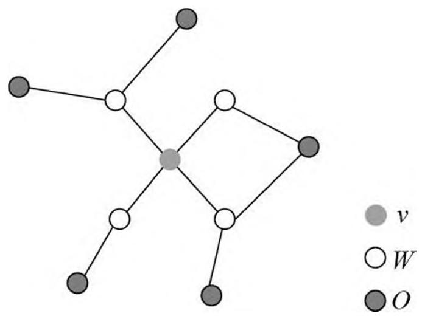
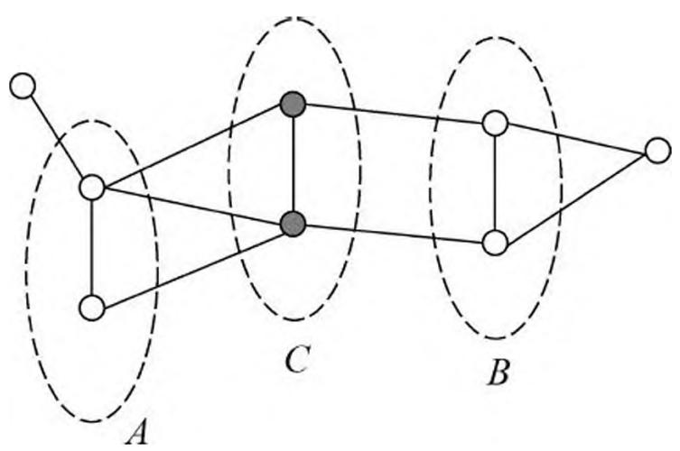
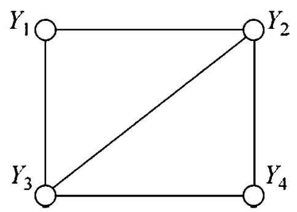
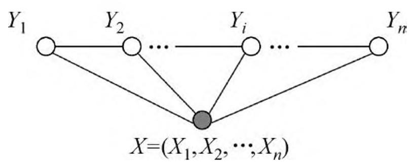
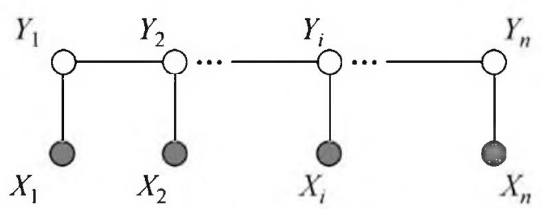
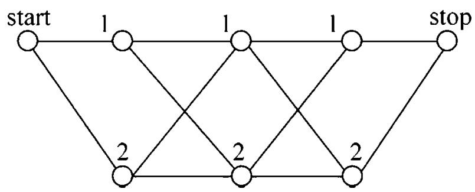

# 第 11 章 条件随机场

条件随机场（conditional random field, CRF）是给定一组输入随机变量条件下另一组输出随机变量的条件概率分布模型，其特点是假设输出随机变量构成马尔可夫随机场。条件随机场可以用于不同的预测问题，本书仅论及它在标注问题的应用。因此主要讲述线性链（linear chain）条件随机场，这时，问题变成了由输入序列对输出序列预测的判别模型，形式为对数线性模型，其学习方法通常是极大似然估计或正则化的极大似然估计。线性链条件随机场应用于标注问题是由 Lafferty 等人于 2001 年提出的。

本章首先介绍概率无向图模型，然后叙述条件随机场的定义和各种表示方法，最后介绍条件随机场的 3 个基本问题：概率计算问题、学习问题和预测问题。

## 11.1 概率无向图模型

概率无向图模型（probabilistic undirected graphical model），又称为马尔可夫随机场（Markov random field），是一个可以由无向图表示的联合概率分布。本节首先叙述概率无向图模型的定义，然后介绍概率无向图模型的因子分解。

### 11.1.1 模型定义

图（graph）是由结点（node）及连接结点的边（edge）组成的集合。结点和边分别记作 $v$ 和 $e$ ，结点和边的集合分别记作 $V$ 和 $E$ ，图记作 $G = (V, E)$ 。无向图是指边没有方向的图。

概率图模型（probabilistic graphical model）是由图表示的概率分布。设有联合概率分布 $P(Y), Y \in \mathcal{Y}$ 是一组随机变量。由无向图 $G = (V, E)$ 表示概率分布 $P(Y)$ ，即在图 $G$ 中，结点 $v \in V$ 表示一个随机变量 $Y_v, Y = (Y_v)_{v \in V}$ ；边 $e \in E$ 表示随机变量之间的概率依赖关系。

给定一个联合概率分布 $P(Y)$ 和表示它的无向图 $G$ 。首先定义无向图表示的随机变量之间存在的成对马尔可夫性（pairwise Markov property）、局部马尔可夫性（local Markov property）和全局马尔可夫性（global Markov property）。

成对马尔可夫性：设 $u$ 和 $v$ 是无向图 $G$ 中任意两个没有边连接的结点，结点 $u$ 和 $v$ 分别对应随机变量 $Y_{u}$ 和 $Y_{v}$ 。其他所有结点为 $O$ ，对应的随机变量组是 $Y_{O}$ 。成对马尔可夫性是指给定随机变量组 $Y_{O}$ 的条件下随机变量 $Y_{u}$ 和 $Y_{v}$ 是条件独立的，即

$$
P \left(Y _ {u}, Y _ {v} \mid Y _ {O}\right) = P \left(Y _ {u} \mid Y _ {O}\right) P \left(Y _ {v} \mid Y _ {O}\right) \tag {11.1}
$$

局部马尔可夫性：设 $v \in V$ 是无向图 $G$ 中任意一个结点， $W$ 是与 $v$ 有边连接的所有结点， $O$ 是 $v$ 和 $W$ 以外的其他所有结点。 $v$ 表示的随机变量是 $Y_v$ ， $W$ 表示的随机变量组是 $Y_W$ ， $O$ 表示的随机变量组是 $Y_O$ 。局部马尔可夫性是指在给定随机变量组 $Y_W$ 的条件下随机变量 $Y_v$ 与随机变量组 $Y_O$ 是独立的，即

$$
P \left(Y _ {v}, Y _ {O} \mid Y _ {W}\right) = P \left(Y _ {v} \mid Y _ {W}\right) P \left(Y _ {O} \mid Y _ {W}\right) \tag {11.2}
$$

在 $P(Y_{O}|Y_{W}) > 0$ 时，等价地，

$$
P \left(Y _ {v} \mid Y _ {W}\right) = P \left(Y _ {v} \mid Y _ {W}, Y _ {O}\right) \tag {11.3}
$$

图 11.1 表示由式(11.2)或式(11.3)所示的局部马尔可夫性。

> 图 11.1 局部马尔可夫性

全局马尔可夫性：设结点集合 $A$ ， $B$ 是在无向图 $G$ 中被结点集合 $C$ 分开的任意结点集合，如图 11.2 所示。结点集合 $A$ ， $B$ 和 $C$ 所对应的随机变量组分别是 $Y_A$ ， $Y_B$ 和 $Y_C$ 。全局马尔可夫性是指给定随机变量组 $Y_C$ 条件下随机变量组 $Y_A$ 和 $Y_B$ 是条件独立的，即

$$
P \left(Y _ {A}, Y _ {B} \mid Y _ {C}\right) = P \left(Y _ {A} \mid Y _ {C}\right) P \left(Y _ {B} \mid Y _ {C}\right) \tag {11.4}
$$

上述成对的、局部的、全局的马尔可夫性定义是等价的[2]。

> 图 11.2 全局马尔可夫性

下面定义概率无向图模型。

定义 11.1（概率无向图模型）设有联合概率分布 $P(Y)$ ，由无向图 $G = (V, E)$ 表示，在图 $G$ 中，结点表示随机变量，边表示随机变量之间的依赖关系。如果联合概率分布 $P(Y)$ 满足成对、局部或全局马尔可夫性，就称此联合概率分布为概率无向图模型（probabilistic undirected graphical model），或马尔可夫随机场（Markov random field）。

以上是概率无向图模型的定义，实际上，我们更关心的是如何求其联合概率分布。对给定的概率无向图模型，我们希望将整体的联合概率写成若干子联合概率的乘积的形式，也就是将联合概率进行因子分解，这样便于模型的学习与计算。事实上，概率无向图模型的最大特点就是易于因子分解。下面介绍这一结果。

### 11.1.2 概率无向图模型的因子分解

首先给出无向图中的团与最大团的定义。

定义 11.2（团与最大团）无向图 $G$ 中任何两个结点均有边连接的结点子集称为团（clique）。若 $C$ 是无向图 $G$ 的一个团，并且不能再加进任何一个 $G$ 的结点使其成为一个更大的团，则称此 $C$ 为最大团（maximal clique）。

图 11.3 表示由 4 个结点组成的无向图。图中由 2 个结点组成的团有 5 个： $\{Y_1,Y_2\}$ ， $\{Y_{2},Y_{3}\}$ ， $\{Y_{3},Y_{4}\}$ ， $\{Y_4,Y_2\}$ 和 $\{Y_1,Y_3\}$ 。有 2 个最大团： $\{Y_1,Y_2,Y_3\}$ 和 $\{Y_2,Y_3,Y_4\}$ 。而 $\{Y_1,Y_2,Y_3,Y_4\}$ 不是一个团，因为 $Y_{1}$ 和 $Y_{4}$ 没有边连接。

> 图 11.3 无向图的团和最大团

将概率无向图模型的联合概率分布表示为其最大团上的随机变量的函数的乘积形式的操作，称为概率无向图模型的因子分解（factorization）。

给定概率无向图模型，设其无向图为 $G$ ， $C$ 为 $G$ 上的最大团， $Y_{C}$ 表示 $C$ 对应的随机变量。那么概率无向图模型的联合概率分布 $P(Y)$ 可写作图中所有最大团 $C$ 上的函数 $\Psi_C(Y_C)$ 的乘积形式，即

$$
P (Y) = \frac {1}{Z} \prod_ {C} \Psi_ {C} \left(Y _ {C}\right) \tag {11.5}
$$

其中， $Z$ 是规范化因子（normalization factor），由式

$$
Z = \sum_ {Y} \prod_ {C} \Psi_ {C} \left(Y _ {C}\right) \tag {11.6}
$$

给出。规范化因子保证 $P(Y)$ 构成一个概率分布。函数 $\Psi_C(Y_C)$ 称为势函数（potential function）。这里要求势函数 $\Psi_C(Y_C)$ 是严格正的，通常定义为指数函数：

$$
\varPsi_ {C} \left(Y _ {C}\right) = \exp \{- E \left(Y _ {C}\right) \} \tag {11.7}
$$

概率无向图模型的因子分解由下述定理来保证。

定理 11.1（Hammersley-Clifford 定理）概率无向图模型的联合概率分布 $P(Y)$ 可以表示为如下形式：

$$
\begin{array}{l} P (Y) = \frac {1}{Z} \prod_ {C} \Psi_ {C} (Y _ {C}) \\ Z = \sum_ {Y} \prod_ {C} \Psi_ {C} (Y _ {C}) \\ \end{array}
$$

其中， $C$ 是无向图的最大团， $Y_{C}$ 是 $C$ 的结点对应的随机变量， $\Psi_C(Y_C)$ 是 $C$ 上定义的严格正函数，乘积是在无向图所有的最大团上进行的。

## 11.2 条件随机场的定义与形式

### 11.2.1 条件随机场的定义

条件随机场（conditional random field）是给定随机变量 $X$ 条件下，随机变量 $Y$ 的马尔可夫随机场。这里主要介绍定义在线性链上的特殊的条件随机场，称为线性链条件随机场（linear chain conditional random field）。线性链条件随机场可以用于标注等问题。这时，在条件概率模型 $P(Y|X)$ 中， $Y$ 是输出变量，表示标记序列， $X$ 是输入变量，表示需要标注的观测序列。也把标记序列称为状态序列（参见隐马尔可夫模型）。学习时，利用训练数据集通过极大似然估计或正则化的极大似然估计得到条件概率模型 $\hat{P}(Y|X)$ ；预测时，对于给定的输入序列 $x$ ，求出条件概率 $\hat{P}(y|x)$ 最大的输出序列 $\hat{y}$ 。

首先定义一般的条件随机场，然后定义线性链条件随机场。

定义 11.3（条件随机场）设 $X$ 与 $Y$ 是随机变量， $P(Y|X)$ 是在给定 $X$ 的条件下 $Y$ 的条件概率分布。若随机变量 $Y$ 构成一个由无向图 $G = (V, E)$ 表示的马尔可夫随机场，即

$$
P \left(Y _ {v} \mid X, Y _ {w}, w \neq v\right) = P \left(Y _ {v} \mid X, Y _ {w}, w \sim v\right) \tag {11.8}
$$

对任意结点 $v$ 成立，则称条件概率分布 $P(Y|X)$ 为条件随机场。式中 $w \sim v$ 表示在图 $G = (V, E)$ 中与结点 $v$ 有边连接的所有结点 $w$ ， $w \neq v$ 表示结点 $v$ 以外的所有结点， $Y_v, Y_u$ 与 $Y_w$ 为结点 $v$ ， $u$ 与 $w$ 对应的随机变量。

在定义中并没有要求 $X$ 和 $Y$ 具有相同的结构。现实中，一般假设 $X$ 和 $Y$ 有相同的图结构。本书主要考虑无向图为如图 11.4 与图 11.5 所示的线性链的情况，即

$$
G = (V = \{1, 2, \cdot \cdot \cdot , n \}, E = \{(i, i + 1) \}), i = 1, 2, \cdot \cdot \cdot , n - 1
$$

在此情况下， $X = (X_{1},X_{2},\dots ,X_{n})$ ， $Y = (Y_{1},Y_{2},\dots ,Y_{n})$ ，最大团是相邻两个结点的集合。线性链条件随机场有下面的定义。

> 图 11.4 线性链条件随机场

> 图 11.5 $X$ 和 $Y$ 有相同的图结构的线性链条件随机场

定义 11.4（线性链条件随机场）设 $X = (X_{1},X_{2},\dots ,X_{n})$ ， $Y = (Y_{1},Y_{2},\dots ,Y_{n})$ 均为线性链表示的随机变量序列，若在给定随机变量序列 $X$ 的条件下，随机变量序列$Y$ 的条件概率分布 $P(Y|X)$ 构成条件随机场，即满足马尔可夫性

$$
\begin{array}{l} P \left(Y _ {i} \mid X, Y _ {1}, \dots , Y _ {i - 1}, Y _ {i + 1}, \dots , Y _ {n}\right) = P \left(Y _ {i} \mid X, Y _ {i - 1}, Y _ {i + 1}\right) \\ i = 1, 2, \dots , n (\text {在} i = 1 \text {和} n \text {时 只 考 虑 单 边}) \tag {11.9} \\ \end{array}
$$

则称 $P(Y|X)$ 为线性链条件随机场。在标注问题中， $X$ 表示输入观测序列， $Y$ 表示对应的输出标记序列或状态序列。

### 11.2.2 条件随机场的参数化形式

根据定理 11.1，可以给出线性链条件随机场 $P(Y|X)$ 的因子分解式，各因子是定义在相邻两个结点（最大团）上的势函数。

定理 11.2（线性链条件随机场的参数化形式）设 $P(Y|X)$ 为线性链条件随机场，则在随机变量 $X$ 取值为 $\pmb{x}$ 的条件下，随机变量 $Y$ 取值为 $\pmb{y}$ 的条件概率具有如下形式：

$$
P (y | x) = \frac {1}{Z (x)} \exp \left(\sum_ {i, k} \lambda_ {k} t _ {k} \left(y _ {i - 1}, y _ {i}, x, i\right) + \sum_ {i, l} \mu_ {l} s _ {l} \left(y _ {i}, x, i\right)\right) \tag {11.10}
$$

其中，

$$
Z (x) = \sum_ {y} \exp \left(\sum_ {i, k} \lambda_ {k} t _ {k} \left(y _ {i - 1}, y _ {i}, x, i\right) + \sum_ {i, l} \mu_ {l} s _ {l} \left(y _ {i}, x, i\right)\right) \tag {11.11}
$$

式中， $t_k$ 和 $s_l$ 是特征函数， $\lambda_k$ 和 $\mu_l$ 是对应的权值。 $Z(x)$ 是规范化因子，求和是在所有可能的输出序列上进行的。

式 (11.10) 和式 (11.11) 是线性链条件随机场模型的基本形式，表示给定输入序列 $x$ ，对输出序列 $y$ 预测的条件概率。式 (11.10) 和式 (11.11) 中， $t_k$ 是定义在边上的特征函数，称为转移特征，依赖于当前和前一个位置； $s_l$ 是定义在结点上的特征函数，称为状态特征，依赖于当前位置。 $t_k$ 和 $s_l$ 都依赖于位置，是局部特征函数。通常，特征函数 $t_k$ 和 $s_l$ 取值为 1 或 0；当满足特征条件时取值为 1，否则为 0。条件随机场完全由特征函数 $t_k$ ， $s_l$ 和对应的权值 $\lambda_k$ ， $\mu_l$ 确定。

线性链条件随机场也是对数线性模型（log linear model）。

下面看一个简单的例子。

例 11.1 设有一标注问题：输入观测序列为 $X = (X_{1}, X_{2}, X_{3})$ ，输出标记序列为 $Y = (Y_{1}, Y_{2}, Y_{3})$ ， $Y_{1}, Y_{2}, Y_{3}$ 取值于 $\mathcal{V} = \{1, 2\}$ 。

假设特征 $t_k, s_l$ 和对应的权值 $\lambda_k, \mu_l$ 如下：

$$
t _ {1} = t _ {1} \left(y _ {i - 1} = 1, y _ {i} = 2, x, i\right), \quad i = 2, 3, \quad \lambda_ {1} = 1
$$

这里只注明特征取值为 1 的条件，取值为 0 的条件省略，即

$$
t _ {1} (y _ {i - 1}, y _ {i}, x, i) = \left\{ \begin{array}{l l} {1,} & {y _ {i - 1} = 1, y _ {i} = 2, x, i, (i = 2, 3)} \\ {0,} & {\text {其 他}} \end{array} \right.
$$

下同。

$$
\begin{array}{l} t _ {2} = t _ {2} \left(y _ {1} = 1, y _ {2} = 1, x, 2\right) \quad \lambda_ {2} = 0. 6 \\ t _ {3} = t _ {3} \left(y _ {2} = 2, y _ {3} = 1, x, 3\right) \quad \lambda_ {3} = 1 \\ t _ {4} = t _ {4} \left(y _ {1} = 2, y _ {2} = 1, x, 2\right), \quad \lambda_ {4} = 1 \\ t _ {5} = t _ {5} \left(y _ {2} = 2, y _ {3} = 2, x, 3\right), \quad \lambda_ {5} = 0. 2 \\ s _ {1} = s _ {1} \left(y _ {1} = 1, x, 1\right), \quad \mu_ {1} = 1 \\ s _ {2} = s _ {2} \left(y _ {i} = 2, x, i\right), i = 1, 2 \quad \mu_ {2} = 0. 5 \\ s _ {3} = s _ {3} \left(y _ {i} = 1, x, i\right), i = 2, 3 \quad \mu_ {3} = 0. 8 \\ s _ {4} = s _ {4} \left(y _ {3} = 2, x, 3\right), \quad \mu_ {4} = 0. 5 \\ \end{array}
$$

对给定的观测序列 $x$ ，求标记序列为 $y = (y_{1},y_{2},y_{3}) = (1,2,2)$ 的非规范化条件概率（即没有除以规范化因子的条件概率）。

解 由式(11.10)，线性链条件随机场模型为

$$
P (y | x) \propto \exp \left[ \sum_ {k = 1} ^ {5} \lambda_ {k} \sum_ {i = 2} ^ {3} t _ {k} (y _ {i - 1}, y _ {i}, x, i) + \sum_ {k = 1} ^ {4} \mu_ {k} \sum_ {i = 1} ^ {3} s _ {k} (y _ {i}, x, i) \right]
$$

对给定的观测序列 $x$ ，标记序列 $y = (1,2,2)$ 的非规范化条件概率为

$$
P (y _ {1} = 1, y _ {2} = 2, y _ {3} = 2 | x) \propto \exp (3. 2)
$$

### 11.2.3 条件随机场的简化形式

条件随机场还可以由简化形式表示。注意到条件随机场式 (11.10) 中同一特征在各个位置都有定义，可以对同一个特征在各个位置求和，将局部特征函数转化为一个全局特征函数，这样就可以将条件随机场写成权值向量和特征向量的内积形式，即条件随机场的简化形式。

为简便起见，首先将转移特征和状态特征及其权值用统一的符号表示。设有 $K_{1}$ 个转移特征， $K_{2}$ 个状态特征， $K = K_{1} + K_{2}$ ，记

$$
f _ {k} \left(y _ {i - 1}, y _ {i}, x, i\right) = \left\{ \begin{array}{l l} t _ {k} \left(y _ {i - 1}, y _ {i}, x, i\right), & k = 1, 2, \dots , K _ {1} \\ s _ {l} \left(y _ {i}, x, i\right), & k = K _ {1} + l; l = 1, 2, \dots , K _ {2} \end{array} \right. \tag {11.12}
$$

然后，对转移与状态特征在各个位置 $i$ 求和，记作

$$
f _ {k} (y, x) = \sum_ {i = 1} ^ {n} f _ {k} \left(y _ {i - 1}, y _ {i}, x, i\right), \quad k = 1, 2, \dots , K \tag {11.13}
$$

用 $w_{k}$ 表示特征 $f_{k}(y,x)$ 的权值，即

$$
w _ {k} = \left\{ \begin{array}{l l} \lambda_ {k}, & k = 1, 2, \dots , K _ {1} \\ \mu_ {l}, & k = K _ {1} + l; l = 1, 2, \dots , K _ {2} \end{array} \right. \tag {11.14}
$$

于是，条件随机场 $(11.10)\sim (11.11)$ 可表示为

$$
P (y | x) = \frac {1}{Z (x)} \exp \sum_ {k = 1} ^ {K} w _ {k} f _ {k} (y, x) \tag {11.15}
$$

$$
Z (x) = \sum_ {y} \exp \sum_ {k = 1} ^ {K} w _ {k} f _ {k} (y, x) \tag {11.16}
$$

若以 $w$ 表示权值向量，即

$$
w = \left(w _ {1}, w _ {2}, \dots , w _ {K}\right) ^ {\mathrm {T}} \tag {11.17}
$$

以 $F(y, x)$ 表示全局特征向量，即

$$
F (y, x) = \left(f _ {1} (y, x), f _ {2} (y, x), \dots , f _ {K} (y, x)\right) ^ {\mathrm {T}} \tag {11.18}
$$

则条件随机场可以写成向量 $\pmb{w}$ 与 $F(y, x)$ 的内积的形式：

$$
P _ {w} (y | x) = \frac {\exp (w \cdot F (y , x))}{Z _ {w} (x)} \tag {11.19}
$$

其中，

$$
Z _ {w} (x) = \sum_ {y} \exp (w \cdot F (y, x)) \tag {11.20}
$$

### 11.2.4 条件随机场的矩阵形式

条件随机场还可以由矩阵表示。假设 $P_{w}(y|x)$ 是由式 (11.15)~式 (11.16) 给出的线性链条件随机场，表示对给定观测序列 $x$ ，相应的标记序列 $y$ 的条件概率。对每个标记序列引进特殊的起点和终点状态标记 $y_0 = \text{start}$ 和 $y_{n+1} = \text{stop}$ ，这时标注序列的概率 $P_{w}(y|x)$ 可以通过矩阵形式表示并有效计算。

对观测序列 $x$ 的每一个位置 $i = 1,2,\dots ,n + 1$ ，由于 $y_{i - 1}$ 和 $y_{i}$ 在 $m$ 个标记中取值，可以定义一个 $m$ 阶矩阵随机变量

$$
M _ {i} (x) = \left[ M _ {i} \left(y _ {i - 1}, y _ {i} \mid x\right) \right] \tag {11.21}
$$

矩阵随机变量的元素为

$$
M _ {i} \left(y _ {i - 1}, y _ {i} \mid x\right) = \exp \left(W _ {i} \left(y _ {i - 1}, y _ {i} \mid x\right)\right) \tag {11.22}
$$

$$
W _ {i} \left(y _ {i - 1}, y _ {i} \mid x\right) = \sum_ {k = 1} ^ {K} w _ {k} f _ {k} \left(y _ {i - 1}, y _ {i}, x, i\right) \tag {11.23}
$$

这里 $w_{k}$ 和 $f_{k}$ 分别由式(11.14)和式(11.12)给出， $y_{i-1}$ 和 $y_{i}$ 是标记随机变量 $Y_{i-1}$ 和 $Y_{i}$ 的取值。

这样，给定观测序列 $x$ ，相应标记序列 $\pmb{y}$ 的非规范化概率可以通过该序列 $n + 1$ 个矩阵的适当元素的乘积 $\prod_{i = 1}^{n + 1}M_i(y_{i - 1},y_i|x)$ 表示。于是，条件概率 $P_{w}(y|x)$ 是

$$
P _ {w} (y | x) = \frac {1}{Z _ {w} (x)} \prod_ {i = 1} ^ {n + 1} M _ {i} \left(y _ {i - 1}, y _ {i} | x\right) \tag {11.24}
$$

其中， $Z_{w}(x)$ 为规范化因子，是 $n + 1$ 个矩阵的乘积的（start,stop）元素，即

$$
Z _ {w} (x) = \left[ M _ {1} (x) M _ {2} (x) \dots M _ {n + 1} (x) \right] _ {\mathrm {s t a r t , s t o p}} \tag {11.25}
$$

注意， $y_0 = \text{start}$ 与 $y_{n+1} = \text{stop}$ 表示开始状态与终止状态，规范化因子 $Z_w(x)$ 是以 start 为起点 stop 为终点通过状态的所有路径 $y_1y_2 \cdots y_n$ 的非规范化概率 $\prod_{i=1}^{n+1} M_i(y_{i-1}, y_i|x)$ 之和。下面的例子说明了这一事实。

例 11.2 给定一个由图 11.6 所示的线性链条件随机场，观测序列 $x$ ，状态序列 $y,i = 1,2,3,n = 3$ ，标记 $y_{i}\in \{1,2\}$ ，假设 $y_0 = \mathrm{start} = 1$ ， $y_{4} = \mathrm{stop} = 1$ ，各个位置的随机矩阵 $M_{1}(x)$ ， $M_2(x)$ ， $M_3(x)$ ， $M_4(x)$ 分别是

$$
M _ {1} (x) = \left[ \begin{array}{c c} a _ {0 1} & a _ {0 2} \\ 0 & 0 \end{array} \right], \quad M _ {2} (x) = \left[ \begin{array}{c c} b _ {1 1} & b _ {1 2} \\ b _ {2 1} & b _ {2 2} \end{array} \right]
$$

$$
M _ {3} (x) = \left[ \begin{array}{c c} c _ {1 1} & c _ {1 2} \\ c _ {2 1} & c _ {2 2} \end{array} \right], \quad M _ {4} (x) = \left[ \begin{array}{c c} 1 & 0 \\ 1 & 0 \end{array} \right]
$$

试求状态序列 $y$ 以 start 为起点 stop 为终点所有路径的非规范化概率及规范化因子。

解 首先计算图 11.6 中从 start 到 stop 对应于 $y = (1,1,1)$ ， $y = (1,1,2)$ ， $\cdots$ ， $y = (2,2,2)$ 各路径的非规范化概率分别是

$$
a _ {0 1} b _ {1 1} c _ {1 1}, \quad a _ {0 1} b _ {1 1} c _ {1 2}, \quad a _ {0 1} b _ {1 2} c _ {2 1}, \quad a _ {0 1} b _ {1 2} c _ {2 2}
$$

$$
a _ {0 2} b _ {2 1} c _ {1 1}, \quad a _ {0 2} b _ {2 1} c _ {1 2}, \quad a _ {0 2} b _ {2 2} c _ {2 1}, \quad a _ {0 2} b _ {2 2} c _ {2 2}
$$

> 图 11.6 状态路径

然后按式 (11.25) 求规范化因子。通过计算矩阵乘积 $M_{1}(x)M_{2}(x)M_{3}(x)M_{4}(x)$ 可知，其第 1 行第 1 列的元素为

$$
\begin{array}{l} a _ {0 1} b _ {1 1} c _ {1 1} + a _ {0 2} b _ {2 1} c _ {1 1} + a _ {0 1} b _ {1 2} c _ {2 1} + a _ {0 2} b _ {2 2} c _ {2 2} \\ + a _ {0 1} b _ {1 1} c _ {1 2} + a _ {0 2} b _ {2 1} c _ {1 2} + a _ {0 1} b _ {1 2} c _ {2 2} + a _ {0 2} b _ {2 2} c _ {2 1} \\ \end{array}
$$

恰好等于从 start 到 stop 的所有路径的非规范化概率之和，即规范化因子 $Z(x)$ 。

## 11.3 条件随机场的概率计算问题

条件随机场的概率计算问题是给定条件随机场 $P(Y|X)$ ，输入序列 $x$ 和输出序列 $y$ ，计算条件概率 $P(Y_{i} = y_{i}|x)$ ， $P(Y_{i-1} = y_{i-1}, Y_{i} = y_{i}|x)$ 以及相应的数学期望的问题。为了方便起见，像隐马尔可夫模型那样，引进前向-后向向量，递归地计算以上概率及期望值。这样的算法也称为前向-后向算法。

### 11.3.1 前向-后向算法

对每个指标 $i = 0,1,\dots ,n + 1$ ，定义前向向量 $\alpha_{i}(x)$

$$
\alpha_ {0} (y | x) = \left\{ \begin{array}{l l} 1, & y = \mathrm {s t a r t} \\ 0, & \text {否 则} \end{array} \right. \tag {11.26}
$$

递推公式为

$$
\alpha_ {i} ^ {\mathrm {T}} \left(y _ {i} | x\right) = \alpha_ {i - 1} ^ {\mathrm {T}} \left(y _ {i - 1} | x\right) \left[ M _ {i} \left(y _ {i - 1}, y _ {i} | x\right) \right], \quad i = 1, 2, \dots , n + 1 \tag {11.27}
$$

又可表示为

$$
\alpha_ {i} ^ {\mathrm {T}} (x) = \alpha_ {i - 1} ^ {\mathrm {T}} (x) M _ {i} (x) \tag {11.28}
$$

$\alpha_{i}(y_{i}|x)$ 表示在位置 $i$ 的标记是 $y_{i}$ 并且从 1 到 $i$ 的前部分标记序列的非规范化概率， $y_{i}$ 可取的值有 $m$ 个，所以 $\alpha_{i}(x)$ 是 $m$ 维列向量。

同样，对每个指标 $i = 0,1,\dots ,n + 1$ ，定义后向向量 $\beta_{i}(x)$

$$
\beta_ {n + 1} (y _ {n + 1} | x) = \left\{ \begin{array}{l l} {1,} & {y _ {n + 1} = \mathrm {s t o p}} \\ {0,} & {\text {否 则}} \end{array} \right. \tag {11.29}
$$

$$
\beta_ {i} \left(y _ {i} \mid x\right) = \left[ M _ {i + 1} \left(y _ {i}, y _ {i + 1} \mid x\right) \right] \beta_ {i + 1} \left(y _ {i + 1} \mid x\right) \tag {11.30}
$$

又可表示为

$$
\beta_ {i} (x) = M _ {i + 1} (x) \beta_ {i + 1} (x) \tag {11.31}
$$

$\beta_{i}(y_{i}|x)$ 表示在位置 $i$ 的标记为 $y_{i}$ 并且从 $i + 1$ 到 $n$ 的后部分标记序列的非规范化概率。

### 11.3.2 概率计算

按照前向-后向向量的定义，很容易计算标记序列在位置 $i$ 是标记 $y_{i}$ 的条件概率和在位置 $i - 1$ 与 $i$ 是标记 $y_{i - 1}$ 和 $y_{i}$ 的条件概率：

$$
P \left(Y _ {i} = y _ {i} \mid x\right) = \frac {\alpha_ {i} ^ {\mathrm {T}} \left(y _ {i} \mid x\right) \beta_ {i} \left(y _ {i} \mid x\right)}{Z (x)} \tag {11.32}
$$

$$
P \left(Y _ {i - 1} = y _ {i - 1}, Y _ {i} = y _ {i} \mid x\right) = \frac {\alpha_ {i - 1} ^ {\mathrm {T}} \left(y _ {i - 1} \mid x\right) M _ {i} \left(y _ {i - 1} , y _ {i} \mid x\right) \beta_ {i} \left(y _ {i} \mid x\right)}{Z (x)} \tag {11.33}
$$

其中，

$$
Z (x) = \alpha_ {n} ^ {\mathrm {T}} (x) \mathbf {1} = \mathbf {1} \beta_ {1} (x)
$$

1 是元素均为 1 的 $m$ 维列向量。

### 11.3.3 期望值的计算

利用前向-后向向量，可以计算特征函数关于联合分布 $P(X,Y)$ 和条件分布 $P(Y|X)$ 的数学期望。

特征函数 $f_{k}$ 关于条件分布 $P(Y|X)$ 的数学期望是

$$
\begin{array}{l} E _ {P (Y \mid X)} [ f _ {k} ] = \sum_ {y} P (y \mid x) f _ {k} (y, x) \\ = \sum_ {i = 1} ^ {n + 1} \sum_ {y _ {i - 1} y _ {i}} f _ {k} \left(y _ {i - 1}, y _ {i}, x, i\right) \frac {\alpha_ {i - 1} ^ {\mathrm {T}} \left(y _ {i - 1} \mid x\right) M _ {i} \left(y _ {i - 1} , y _ {i} \mid x\right) \beta_ {i} \left(y _ {i} \mid x\right)}{Z (x)} \\ k = 1, 2, \dots , K \tag {11.34} \\ \end{array}
$$

其中，

$$
Z (\boldsymbol {x}) = \alpha_ {n} ^ {\mathrm {T}} (\boldsymbol {x}) \mathbf {1}
$$

假设经验分布为 $\tilde{P}(X)$ ，特征函数 $f_{k}$ 关于联合分布 $P(X,Y)$ 的数学期望是

$$
\begin{array}{l} E _ {P (X, Y)} [ f _ {k} ] = \sum_ {x, y} P (x, y) \sum_ {i = 1} ^ {n + 1} f _ {k} \left(y _ {i - 1}, y _ {i}, x, i\right) \\ = \sum_ {x} \tilde {P} (x) \sum_ {y} P (y | x) \sum_ {i = 1} ^ {n + 1} f _ {k} \left(y _ {i - 1}, y _ {i}, x, i\right) \\ = \sum_ {x} \tilde {P} (x) \sum_ {i = 1} ^ {n + 1} \sum_ {y _ {i - 1} y _ {i}} f _ {k} \left(y _ {i - 1}, y _ {i}, x, i\right) \frac {\alpha_ {i - 1} ^ {\mathrm {T}} \left(y _ {i - 1} | x\right) M _ {i} \left(y _ {i - 1} , y _ {i} | x\right) \beta_ {i} \left(y _ {i} | x\right)}{Z (x)} \\ \end{array}
$$

$$
k = 1, 2, \dots , K \tag {11.35}
$$

其中，

$$
Z (x) = \alpha_ {n} ^ {\mathrm {T}} (x) \mathbf {1}
$$

式 (11.34) 和式 (11.35) 是特征函数数学期望的一般计算公式。对于转移特征 $t_k(y_{i-1}, y_i, x, i)$ , $k = 1, 2, \dots, K_1$ , 可以将式中的 $f_k$ 换成 $t_k$ ; 对于状态特征, 可以将式中的 $f_k$ 换成 $s_i$ , 表示为 $s_l(y_i, x, i)$ , $k = K_1 + l$ , $l = 1, 2, \dots, K_2$ 。

有了式 (11.32)~式 (11.35)，对于给定的观测序列 $x$ 与标记序列 $y$ ，可以通过一次前向扫描计算 $\alpha_{i}$ 及 $Z(x)$ ，通过一次后向扫描计算 $\beta_{i}$ ，从而计算所有的概率和特征的期望。

## 11.4 条件随机场的学习算法

本节讨论给定训练数据集估计条件随机场模型参数的问题，即条件随机场的学习问题。条件随机场模型实际上是定义在时序数据上的对数线性模型，其学习方法包括极大似然估计和正则化的极大似然估计。具体的优化实现算法有改进的迭代尺度法 IIS、梯度下降法以及拟牛顿法（参阅附录 A 和附录 B）。

### 11.4.1 改进的迭代尺度法

已知训练数据集，由此可知经验概率分布 $\tilde{P}(X,Y)$ 。可以通过极大化训练数据的对数似然函数来求模型参数。

训练数据的对数似然函数为

$$
L (w) = L _ {\tilde {P}} (P _ {w}) = \log \prod_ {x, y} P _ {w} (y | x) ^ {\tilde {P} (x, y)} = \sum_ {x, y} \tilde {P} (x, y) \log P _ {w} (y | x)
$$

当 $P_{w}$ 是一个由式(11.15)和式(11.16)给出的条件随机场模型时，对数似然函数为

$$
\begin{array}{l} L (w) = \sum_ {x, y} \tilde {P} (x, y) \log P _ {w} (y | x) \\ = \sum_ {x, y} \left[ \tilde {P} (x, y) \sum_ {k = 1} ^ {K} w _ {k} f _ {k} (y, x) - \tilde {P} (x, y) \log Z _ {w} (x) \right] \\ = \sum_ {j = 1} ^ {N} \sum_ {k = 1} ^ {K} w _ {k} f _ {k} \left(y _ {j}, x _ {j}\right) - \sum_ {j = 1} ^ {N} \log Z _ {w} \left(x _ {j}\right) \\ \end{array}
$$

改进的迭代尺度法通过迭代的方法不断优化对数似然函数改变量的下界，达到极大化对数似然函数的目的。假设模型的当前参数向量为 $w = (w_{1}, w_{2}, \dots, w_{K})^{\mathrm{T}}$ ，向量的增量为 $\delta = (\delta_{1}, \delta_{2}, \dots, \delta_{K})^{\mathrm{T}}$ ，更新参数向量为 $w + \delta = (w_{1} + \delta_{1}, w_{2} + \delta_{2}, \dots, w_{K} +$$\delta_K)^{\mathrm{T}}$ 。在每步迭代过程中，改进的迭代尺度法通过依次求解式 (11.36) 和式 (11.37)，得到 $\delta = (\delta_1, \delta_2, \dots, \delta_K)^{\mathrm{T}}$ 。推导可参考本书 6.3.1 节。

关于转移特征 $t_k$ 的更新方程为

$$
\begin{array}{l} E _ {\tilde {P}} [ t _ {k} ] = \sum_ {x, y} \tilde {P} (x, y) \sum_ {i = 1} ^ {n + 1} t _ {k} \left(y _ {i - 1}, y _ {i}, x, i\right) \\ = \sum_ {x, y} \tilde {P} (x) P (y | x) \sum_ {i = 1} ^ {n + 1} t _ {k} \left(y _ {i - 1}, y _ {i}, x, i\right) \exp \left(\delta_ {k} T (x, y)\right) \\ k = 1, 2, \dots , K _ {1} \tag {11.36} \\ \end{array}
$$

关于状态特征 $s_l$ 的更新方程为

$$
\begin{array}{l} E _ {\tilde {P}} [ s _ {l} ] = \sum_ {x, y} \tilde {P} (x, y) \sum_ {i = 1} ^ {n + 1} s _ {l} \left(y _ {i}, x, i\right) \\ = \sum_ {x, y} \tilde {P} (x) P (y | x) \sum_ {i = 1} ^ {n} s _ {l} \left(y _ {i}, x, i\right) \exp \left(\delta_ {K _ {1} + l} T (x, y)\right) \\ l = 1, 2, \dots , K _ {2} \tag {11.37} \\ \end{array}
$$

这里， $T(x,y)$ 是在数据 $(x,y)$ 中出现所有特征数的总和：

$$
T (x, y) = \sum_ {k} f _ {k} (y, x) = \sum_ {k = 1} ^ {K} \sum_ {i = 1} ^ {n + 1} f _ {k} \left(y _ {i - 1}, y _ {i}, x, i\right) \tag {11.38}
$$

#### 算法 11.1（条件随机场模型学习的改进的迭代尺度法）

输入：特征函数 $t_1, t_2, \dots, t_{K_1}, s_1, s_2, \dots, s_{K_2}$ ；经验分布 $\tilde{P}(x, y)$ ；

输出：参数估计值 $\hat{w}$ ；模型 $P_{\hat{w}}$ 。

- （1）对所有 $k \in \{1, 2, \dots, K\}$ ，取初值 $w_k = 0$
- (2) 对每一 $k \in \{1, 2, \dots, K\}$ :

(a) 当 $k = 1,2,\dots ,K_{1}$ 时，令 $\delta_{k}$ 是方程

$$
\sum_ {x, y} \tilde {P} (x) P (y | x) \sum_ {i = 1} ^ {n + 1} t _ {k} \left(y _ {i - 1}, y _ {i}, x, i\right) \exp \left(\delta_ {k} T (x, y)\right) = E _ {\bar {P}} [ t _ {k} ]
$$

的解；

当 $k = K_{1} + l, l = 1,2,\dots ,K_{2}$ 时，令 $\delta_{K_1 + l}$ 是方程

$$
\sum_ {x, y} \tilde {P} (x) P (y | x) \sum_ {i = 1} ^ {n} s _ {l} \left(y _ {i}, x, i\right) \exp \left(\delta_ {K _ {1} + l} T (x, y)\right) = E _ {\tilde {P}} [ s _ {l} ]
$$

的解，式中 $T(x,y)$ 由式(11.38)给出。

(b) 更新 $w_{k}$ 值: $w_{k} \gets w_{k} + \delta_{k}$（3）如果不是所有 $w_{k}$ 都收敛，重复步骤(2)。

在式 (11.36) 和式 (11.37) 中, $T(x,y)$ 表示数据 $(x,y)$ 中的特征总数, 对不同的数据 $(x,y)$ 取值可能不同。为了处理这个问题, 定义松弛特征

$$
s (x, y) = S - \sum_ {i = 1} ^ {n + 1} \sum_ {k = 1} ^ {K} f _ {k} \left(y _ {i - 1}, y _ {i}, x, i\right) \tag {11.39}
$$

式中 $S$ 是一个常数。选择足够大的常数 $S$ 使得对训练数据集的所有数据 $(x, y)$ ， $s(x, y) \geqslant 0$ 成立。这时特征总数可取 $S$ 。

由式 (11.36)，对于转移特征 $t_k$ ， $\delta_k$ 的更新方程是

$$
\sum_ {x, y} \tilde {P} (x) P (y | x) \sum_ {i = 1} ^ {n + 1} t _ {k} \left(y _ {i - 1}, y _ {i}, x, i\right) \exp \left(\delta_ {k} S\right) = E _ {\tilde {P}} \left[ t _ {k} \right] \tag {11.40}
$$

$$
\delta_ {k} = \frac {1}{S} \log \frac {E _ {\tilde {P}} [ t _ {k} ]}{E _ {P} [ t _ {k} ]} \tag {11.41}
$$

其中，

$$
E _ {P} \left(t _ {k}\right) = \sum_ {x} \tilde {P} (x) \sum_ {i = 1} ^ {n + 1} \sum_ {y _ {i - 1}, y _ {i}} t _ {k} \left(y _ {i - 1}, y _ {i}, x, i\right) \frac {\alpha_ {i - 1} ^ {\mathrm {T}} \left(y _ {i - 1} \mid x\right) M _ {i} \left(y _ {i - 1} , y _ {i} \mid x\right) \beta_ {i} \left(y _ {i} \mid x\right)}{Z (x)} \tag {11.42}
$$

同样由式(11.37)，对于状态特征 $s_l$ ， $\delta_{k}$ 的更新方程是

$$
\sum_ {x, y} \tilde {P} (x) P (y | x) \sum_ {i = 1} ^ {n} s _ {l} \left(y _ {i}, x, i\right) \exp \left(\delta_ {K _ {1} + l} S\right) = E _ {\tilde {P}} \left[ s _ {l} \right] \tag {11.43}
$$

$$
\delta_ {K _ {1} + l} = \frac {1}{S} \log \frac {E _ {\tilde {P}} [ s _ {l} ]}{E _ {P} [ s _ {l} ]} \tag {11.44}
$$

其中，

$$
E _ {P} \left(s _ {l}\right) = \sum_ {x} \tilde {P} (x) \sum_ {i = 1} ^ {n} \sum_ {y _ {i}} s _ {l} \left(y _ {i}, x, i\right) \frac {\alpha_ {i} ^ {\mathrm {T}} \left(y _ {i} \mid x\right) \beta_ {i} \left(y _ {i} \mid x\right)}{Z (x)} \tag {11.45}
$$

以上算法称为算法 S。在算法 S 中需要使常数 $S$ 取足够大，这样一来，每步迭代的增量向量会变大，算法收敛会变慢。算法 T 试图解决这个问题。算法 T 对每个观测序列 $x$ 计算其特征总数最大值 $T(x)$ ：

$$
T (x) = \max  _ {y} T (x, y) \tag {11.46}
$$

利用前向-后向递推公式，可以很容易地计算 $T(x) = t$ 。

这时，关于转移特征参数的更新方程可以写成：

$$
\begin{array}{l} E _ {\tilde {P}} [ t _ {k} ] = \sum_ {x, y} \tilde {P} (x) P (y | x) \sum_ {i = 1} ^ {n + 1} t _ {k} \left(y _ {i - 1}, y _ {i}, x, i\right) \exp \left(\delta_ {k} T (x)\right) \\ = \sum_ {x} \tilde {P} (x) \sum_ {y} P (y | x) \sum_ {i = 1} ^ {n + 1} t _ {k} \left(y _ {i - 1}, y _ {i}, x, i\right) \exp \left(\delta_ {k} T (x)\right) \\ = \sum_ {x} \tilde {P} (x) a _ {k, t} \exp (\delta_ {k} t) \\ = \sum_ {t = 0} ^ {T _ {\max }} a _ {k, t} \beta_ {k} ^ {t} \tag {11.47} \\ \end{array}
$$

这里， $a_{k,t}$ 是特征 $t_k$ 的期待值， $\delta_k = \log \beta_k$ 。 $\beta_k$ 是多项式方程 (11.47) 唯一的实根，可以用牛顿法求得。从而求得相关的 $\delta_k$ 。

同样，关于状态特征的参数更新方程可以写成：

$$
\begin{array}{l} E _ {\tilde {P}} [ s _ {l} ] = \sum_ {x, y} \tilde {P} (x) P (y | x) \sum_ {i = 1} ^ {n} s _ {l} \left(y _ {i}, x, i\right) \exp \left(\delta_ {K _ {1} + l} T (x)\right) \\ = \sum_ {x} \tilde {P} (x) \sum_ {y} P (y | x) \sum_ {i = 1} ^ {n} s _ {l} \left(y _ {i}, x, i\right) \exp \left(\delta_ {K _ {1} + l} T (x)\right) \\ = \sum_ {x} \tilde {P} (x) b _ {l, t} \exp (\delta_ {k} t) \\ = \sum_ {t = 0} ^ {T _ {\max }} b _ {l, t} \gamma_ {l} ^ {t} \tag {11.48} \\ \end{array}
$$

这里， $b_{l,t}$ 是特征 $s_l$ 的期望值， $\delta_l = \log \gamma_l$ ， $\gamma_l$ 是多项式方程 (11.48) 唯一的实根，也可以用牛顿法求得。

### 11.4.2 拟牛顿法

条件随机场模型学习还可以应用牛顿法或拟牛顿法（参阅附录 B）。对于条件随机场模型

$$
P _ {w} (y | x) = \frac {\exp \left(\sum_ {i = 1} ^ {n} w _ {i} f _ {i} (x , y)\right)}{\sum_ {y} \exp \left(\sum_ {i = 1} ^ {n} w _ {i} f _ {i} (x , y)\right)} \tag {11.49}
$$

学习的优化目标函数是

$$
\min  _ {w \in \mathbf {R} ^ {n}} f (w) = \sum_ {x} \tilde {P} (x) \log \sum_ {y} \exp \left(\sum_ {i = 1} ^ {n} w _ {i} f _ {i} (x, y)\right) - \sum_ {x, y} \tilde {P} (x, y) \sum_ {i = 1} ^ {n} w _ {i} f _ {i} (x, y) \tag {11.50}
$$

其梯度函数是

$$
g (w) = \sum_ {x, y} \tilde {P} (x) P _ {w} (y | x) f (x, y) - E _ {\tilde {P}} (f) \tag {11.51}
$$

拟牛顿法的 BFGS 算法如下。

算法 11.2（条件随机场模型学习的 BFGS 算法）输入：特征函数 $f_{1},f_{2},\dots ,f_{n}$ ；经验分布 $\tilde{P} (X,Y)$输出：最优参数值 $\hat{w}$ ；最优模型 $P_{\hat{w}}(y|x)$ 。

- （1）选定初始点 $w^{(0)}$ ，取 $B_{0}$ 为正定对称矩阵，置 $k = 0$ 。
- （2）计算 $g_{k} = g(w^{(k)})$ 。若 $g_{k} = 0$ ，则停止计算；否则转 (3)。
- (3) 由 $B_{k}p_{k} = -g_{k}$ 求出 $p_k$ 。
- （4）一维搜索：求 $\lambda_{k}$ 使得

$$
f \left(w ^ {(k)} + \lambda_ {k} p _ {k}\right) = \min  _ {\lambda \geqslant 0} f \left(w ^ {(k)} + \lambda p _ {k}\right)
$$

- (5) 置 $w^{(k + 1)} = w^{(k)} + \lambda_k p_k$ 。
- (6) 计算 $g_{k+1} = g(w^{(k+1)})$ ，若 $g_{k+1} = 0$ ，则停止计算；否则，按下式求出 $B_{k+1}$ ：

$$
B _ {k + 1} = B _ {k} + \frac {y _ {k} y _ {k} ^ {\mathrm {T}}}{y _ {k} ^ {\mathrm {T}} \delta_ {k}} - \frac {B _ {k} \delta_ {k} \delta_ {k} ^ {\mathrm {T}} B _ {k}}{\delta_ {k} ^ {\mathrm {T}} B _ {k} \delta_ {k}}
$$

其中，

$$
y _ {k} = g _ {k + 1} - g _ {k}, \quad \delta_ {k} = w ^ {(k + 1)} - w ^ {(k)}
$$

（7）置 $k = k + 1$ ，转(3)。

## 11.5 条件随机场的预测算法

条件随机场的预测问题是给定条件随机场 $P(Y|X)$ 和输入序列（观测序列） $\mathcal{X}$ ，求条件概率最大的输出序列（标记序列） $y^{*}$ ，即对观测序列进行标注。条件随机场的预测算法是著名的维特比算法（参阅本书 10.4 节）。

由式 (11.19) 可得:

$$
\begin{array}{l} y ^ {*} = \arg \max  _ {y} P _ {w} (y | x) \\ = \arg \max  _ {y} \frac {\exp (w \cdot F (y , x))}{Z _ {w} (x)} \\ = \arg \max  _ {y} \exp (w \cdot F (y, x)) \\ = \arg \max  _ {y} (w \cdot F (y, x)) \\ \end{array}
$$

于是，条件随机场的预测问题成为求非规范化概率最大的最优路径问题

$$
\max  _ {y} (w \cdot F (y, x)) \tag {11.52}
$$

这里，路径表示标记序列。其中，

$$
\begin{array}{l} w = \left(w _ {1}, w _ {2}, \dots , w _ {K}\right) ^ {\mathrm {T}} \\ F (y, x) = \left(f _ {1} (y, x), f _ {2} (y, x), \dots , f _ {K} (y, x)\right) ^ {\mathrm {T}} \\ f _ {k} (y, x) = \sum_ {i = 1} ^ {n} f _ {k} \left(y _ {i - 1}, y _ {i}, x, i\right), \quad k = 1, 2, \dots , K \\ \end{array}
$$

注意，这时只需计算非规范化概率，而不必计算概率，可以大大提高效率。为了求解最优路径，将式 (11.52) 写成如下形式：

$$
\max  _ {y} \sum_ {i = 1} ^ {n} w \cdot F _ {i} \left(y _ {i - 1}, y _ {i}, x\right) \tag {11.53}
$$

其中，

$$
F _ {i} (y _ {i - 1}, y _ {i}, x) = \left(f _ {1} (y _ {i - 1}, y _ {i}, x, i), f _ {2} (y _ {i - 1}, y _ {i}, x, i), \dots , f _ {K} (y _ {i - 1}, y _ {i}, x, i)\right) ^ {\mathrm {T}}
$$

是局部特征向量。

下面叙述维特比算法。首先求出位置 1 的各个标记 $j = 1,2,\dots ,m$ 的非规范化概率：

$$
\delta_ {1} (j) = w \cdot F _ {1} \left(y _ {0} = \operatorname {s t a r t}, y _ {1} = j, x\right), \quad j = 1, 2, \dots , m \tag {11.54}
$$

一般地，由递推公式，求出到位置 $i$ 的各个标记 $l = 1,2,\dots ,m$ 的非规范化概率的最大值，同时记录非规范化概率最大值的路径

$$
\delta_ {i} (l) = \max  _ {1 \leqslant j \leqslant m} \left\{\delta_ {i - 1} (j) + w \cdot F _ {i} \left(y _ {i - 1} = j, y _ {i} = l, x\right) \right\}, \quad l = 1, 2, \dots , m \tag {11.55}
$$

$$
\varPsi_ {i} (l) = \arg \max  _ {1 \leqslant j \leqslant m} \left\{\delta_ {i - 1} (j) + w \cdot F _ {i} \left(y _ {i - 1} = j, y _ {i} = l, x\right) \right\}, \quad l = 1, 2, \dots , m \tag {11.56}
$$

直到 $i = n$ 时终止。这时求得非规范化概率的最大值为

$$
\max  _ {y} (w \cdot F (y, x)) = \max  _ {1 \leqslant j \leqslant m} \delta_ {n} (j) \tag {11.57}
$$

及最优路径的终点

$$
y _ {n} ^ {*} = \arg \max  _ {1 \leqslant j \leqslant m} \delta_ {n} (j) \tag {11.58}
$$

由此最优路径终点返回，

$$
y _ {i} ^ {*} = \Psi_ {i + 1} \left(y _ {i + 1} ^ {*}\right), \quad i = n - 1, n - 2, \dots , 1 \tag {11.59}
$$

求得最优路径 $y^{*} = (y_{1}^{*},y_{2}^{*},\dots ,y_{n}^{*})^{\mathrm{T}}$ 。

综上所述，得到条件随机场预测的维特比算法。

#### 算法 11.3（条件随机场预测的维特比算法）

输入：模型特征向量 $F(y,x)$ 和权值向量 $\pmb{w}$ ，观测序列 $x = (x_{1},x_{2},\dots ,x_{n})$ ；

输出：最优路径 $y^{*} = (y_{1}^{*},y_{2}^{*},\dots ,y_{n}^{*})$ 。

（1）初始化

$$
\delta_ {1} (j) = w \cdot F _ {1} \left(y _ {0} = \operatorname {s t a r t}, y _ {1} = j, x\right), \quad j = 1, 2, \dots , m
$$

(2) 递推。对 $i = 2,3,\dots ,n$

$$
\delta_ {i} (l) = \max  _ {1 \leqslant j \leqslant m} \left\{\delta_ {i - 1} (j) + w \cdot F _ {i} \left(y _ {i - 1} = j, y _ {i} = l, x\right) \right\}, \quad l = 1, 2, \dots , m
$$

$$
\Psi_ {i} (l) = \arg \max  _ {1 \leqslant j \leqslant m} \left\{\delta_ {i - 1} (j) + w \cdot F _ {i} \left(y _ {i - 1} = j, y _ {i} = l, x\right) \right\}, \quad l = 1, 2, \dots , m
$$

(3) 终止

$$
\max  _ {y} (w \cdot F (y, x)) = \max  _ {1 \leqslant j \leqslant m} \delta_ {n} (j)
$$

$$
y _ {n} ^ {*} = \arg \max  _ {1 \leqslant j \leqslant m} \delta_ {n} (j)
$$

(4) 返回路径

$$
y _ {i} ^ {*} = \Psi_ {i + 1} \left(y _ {i + 1} ^ {*}\right), \quad i = n - 1, n - 2, \dots , 1
$$

求得最优路径 $y^{*} = (y_{1}^{*},y_{2}^{*},\dots ,y_{n}^{*})$ 。

下面通过一个例子说明维特比算法。

例 11.3 在例 11.1 中，用维特比算法求给定的输入序列（观测序列） $x$ 对应的最优输出序列（标记序列） $y^{*} = (y_{1}^{*}, y_{2}^{*}, y_{3}^{*})$ 。

解 特征函数及对应的权值均在例 11.1 中给出。

现在利用维特比算法求最优路径问题：

$$
\max  \sum_ {i = 1} ^ {3} w \cdot F _ {i} (y _ {i - 1}, y _ {i}, x)
$$

(1) 初始化

$$
\begin{array}{l} \delta_ {1} (j) = w \cdot F _ {1} (y _ {0} = \mathrm {s t a r t}, y _ {1} = j, x), \quad j = 1, 2 \\ i = 1, \quad \delta_ {1} (1) = 1, \quad \delta_ {1} (2) = 0. 5 。 \\ \end{array}
$$

(2）递推

$$
\begin{array}{l} i = 2 \qquad \delta_ {2} (l) = \max _ {j} \{\delta_ {1} (j) + w \bullet F _ {2} (j, l, x) \} \\ \delta_ {2} (1) = \max \{1 + \lambda_ {2} t _ {2} + \mu_ {3} s _ {3}, 0. 5 + \lambda_ {4} t _ {4} + \mu_ {3} s _ {3} \} = 2. 4, \quad \Psi_ {2} (1) = 1 \\ \delta_ {2} (2) = \max \{1 + \lambda_ {1} t _ {1} + \mu_ {2} s _ {2}, 0. 5 + \mu_ {2} s _ {2} \} = 2. 5, \quad \Psi_ {2} (2) = 1 \\ \end{array}
$$

$$
\begin{array}{l} i = 3 \qquad \delta_ {3} (l) = \max  _ {j} \{\delta_ {2} (j) + w \cdot F _ {3} (j, l, x) \} \\ \delta_ {3} (1) = \max \{2. 4 + \mu_ {3} s _ {3}, 2. 5 + \lambda_ {3} t _ {3} + \mu_ {3} s _ {3} \} = 4. 3, \quad \Psi_ {3} (1) = 2 \\ \delta_ {3} (2) = \max \{2. 4 + \lambda_ {1} t _ {1} + \mu_ {4} s _ {4}, 2. 5 + \lambda_ {5} t _ {5} + \mu_ {4} s _ {4} \} = 3. 9, \quad \Psi_ {3} (2) = 1 \\ \end{array}
$$

(3) 终止

$$
\max  _ {y} (w \bullet F (y, x)) = \max  _ {\delta_ {3}} (\delta_ {3} (l) = \delta_ {3} (1) = 4. 3
$$

$$
y _ {3} ^ {*} = \arg \max  _ {l} \delta_ {3} (l) = 1
$$

(4) 返回

$$
y _ {2} ^ {*} = \Psi_ {3} (y _ {3} ^ {*}) = \Psi_ {3} (1) = 2
$$

$$
y _ {1} ^ {*} = \Psi_ {2} \left(y _ {2} ^ {*}\right) = \Psi_ {2} (2) = 1
$$

最优标记序列

$$
y ^ {*} = (y _ {1} ^ {*}, y _ {2} ^ {*}, y _ {3} ^ {*}) = (1, 2, 1)
$$

## 本章概要

1. 概率无向图模型是由无向图表示的联合概率分布。无向图上的结点之间的连接关系表示了联合分布的随机变量集合之间的条件独立性，即马尔可夫性。因此，概率无向图模型也称为马尔可夫随机场。

概率无向图模型或马尔可夫随机场的联合概率分布可以分解为无向图最大团上的正值函数的乘积的形式。

- 2. 条件随机场是给定输入随机变量 $X$ 条件下，输出随机变量 $Y$ 的条件概率分布模型，其形式为参数化的对数线性模型。条件随机场的最大特点是假设输出变量之间的联合概率分布构成概率无向图模型，即马尔可夫随机场。条件随机场是判别模型。
- 3. 线性链条件随机场是定义在观测序列与标记序列上的条件随机场。线性链条件随机场一般表示为给定观测序列条件下的标记序列的条件概率分布，由参数化的对数线性模型表示。模型包含特征及相应的权值，特征是定义在线性链的边与结点上的。线性链条件随机场模型的参数形式是最基本的形式，其他形式是其简化与变形，参数形式的数学表达式是

$$
P (y | x) = \frac {1}{Z (x)} \exp \left(\sum_ {i, k} \lambda_ {k} t _ {k} \left(y _ {i - 1}, y _ {i}, x, i\right) + \sum_ {i, l} \mu_ {l} s _ {l} \left(y _ {i}, x, i\right)\right)
$$

其中，

$$
Z (x) = \sum_ {y} \exp \left(\sum_ {i, k} \lambda_ {k} t _ {k} \left(y _ {i - 1}, y _ {i}, x, i\right) + \sum_ {i, l} \mu_ {l} s _ {l} \left(y _ {i}, x, i\right)\right)
$$

- 4. 线性链条件随机场的概率计算通常利用前向-后向算法。
- 5. 条件随机场的学习方法通常是极大似然估计方法或正则化的极大似然估计，即在给定训练数据下，通过极大化训练数据的对数似然函数估计模型参数。具体的算法有改进的迭代尺度算法、梯度下降法、拟牛顿法等。
- 6. 线性链条件随机场的一个重要应用是标注。维特比算法是给定观测序列求条件概率最大的标记序列的方法。

## 继续阅读

关于概率无向图模型可以参阅文献[1,2]。关于条件随机场可以参阅文献[3,4]。在条件随机场提出之前已有最大熵马尔可夫模型等模型被提出[5]。条件随机场可以看作是最大熵马尔可夫模型在标注问题上的推广。支持向量机模型也被推广到标注问题上[6,7]。

## 习题

- 11.1 写出图 11.3 中无向图描述的概率图模型的因子分解式。
- 11.2 证明 $Z(x) = \alpha_{n}^{\mathrm{T}}(x)\mathbf{1} = \mathbf{1}^{\mathrm{T}}\beta_{1}(x)$ ，其中 $\mathbf{1}$ 是元素均为 1 的 $m$ 维列向量。
- 11.3 写出条件随机场模型学习的梯度下降法。
- 11.4 参考图 11.6 的状态路径图，假设随机矩阵 $M_{1}(x)$ ， $M_{2}(x)$ ， $M_{3}(x)$ ， $M_{4}(x)$ 分别是

$$
M _ {1} (x) = \left[ \begin{array}{c c} 0 & 0 \\ 0. 5 & 0. 5 \end{array} \right], \quad M _ {2} (x) = \left[ \begin{array}{c c} 0. 3 & 0. 7 \\ 0. 7 & 0. 3 \end{array} \right]
$$

$$
M _ {3} (x) = \left[ \begin{array}{l l} 0. 5 & 0. 5 \\ 0. 6 & 0. 4 \end{array} \right], \quad M _ {4} (x) = \left[ \begin{array}{l l} 0 & 1 \\ 0 & 1 \end{array} \right]
$$

求以 $\mathrm{start} = 2$ 为起点，以 $\mathrm{stop} = 2$ 为终点的所有路径的状态序列 $y$ 的概率及概率最大的状态序列。

## 参考文献

- [1] Bishop M. Pattern recognition and machine learning. Springer-Verlag, 2006.
- [2] Koller D, Friedman N. Probabilistic graphical models: principles and techniques. MIT Press, 2009.
- [3] Lafferty J, McCallum A, Pereira F. Conditional random fields: probabilistic models for segmenting and labeling sequence data. In: International Conference on Machine Learning, 2001.
- [4] Sha F, Pereira F. Shallow parsing with conditional random fields. In: Proceedings of the 2003 Conference of the North American Chapter of Association for Computational Linguistics on Human Language Technology, Vol.1, 2003.
- [5] McCallum A, Freitag D, Pereira F. Maximum entropy Markov models for information extraction and segmentation. In: Proc of the International Conference on Machine Learning, 2000.
- [6] Taskar B, Guestrin C, Koller D. Max-margin Markov networks. In: Proc of the NIPS 2003, 2003.
- [7] Tsochantaridis I, Hofmann T, Joachims T. Support vector machine learning for interdependent and structured output spaces. In: ICML, 2004.