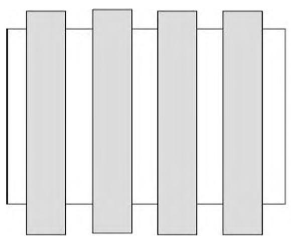
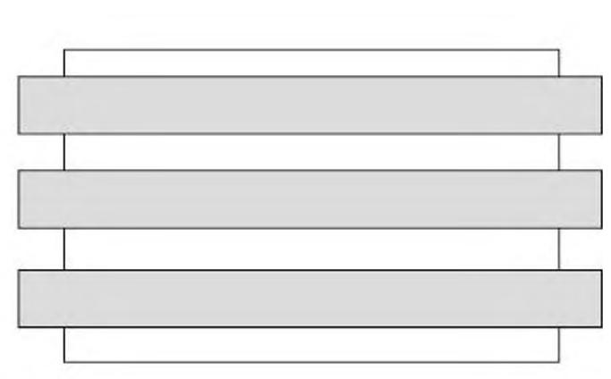
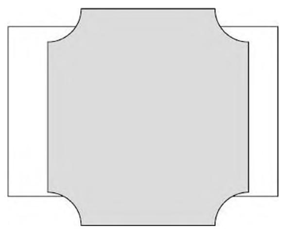
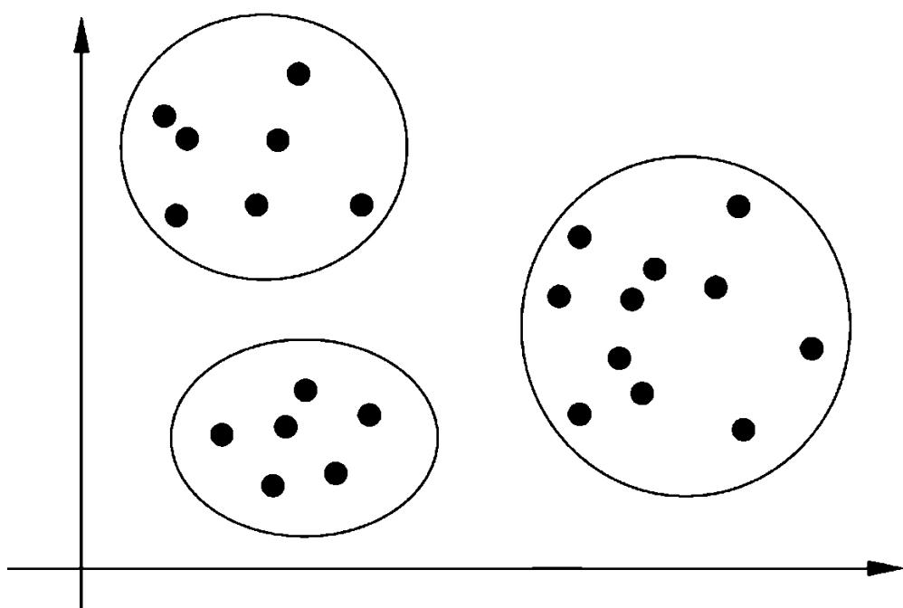
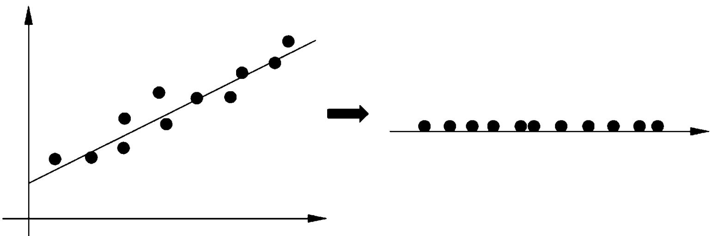
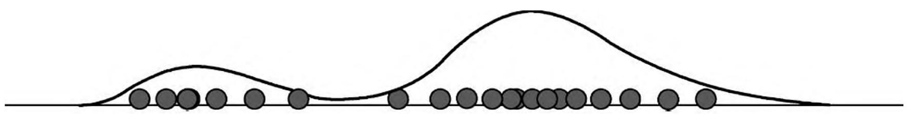
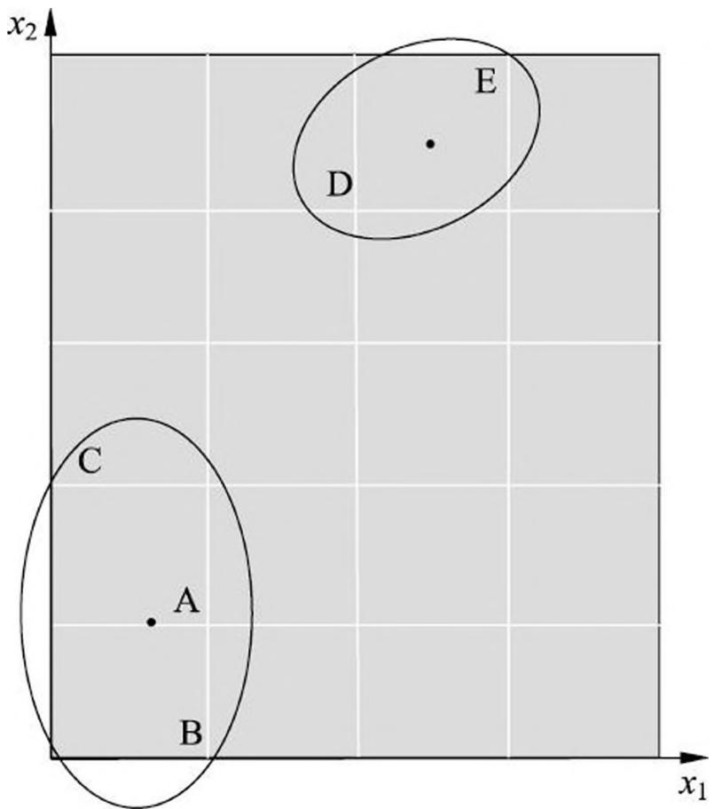
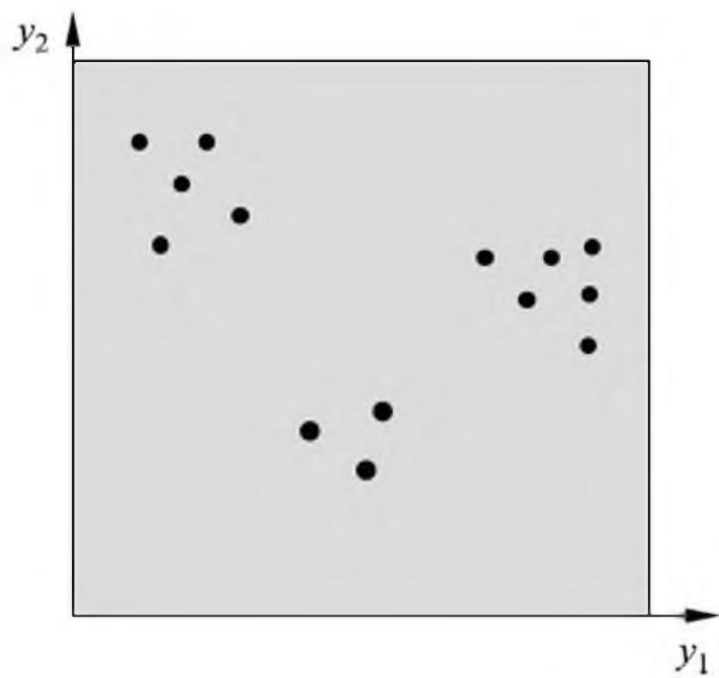
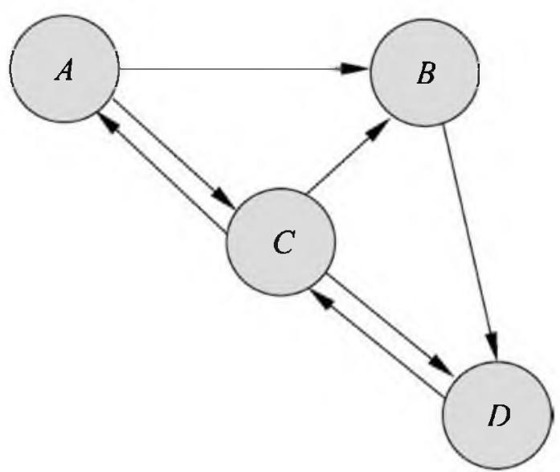

# 第 13 章 无监督学习概论

第 2 篇讲述统计学习或机器学习中的无监督学习方法。无监督学习是从无标注数据中学习模型的机器学习问题，是机器学习的重要组成部分。

本章是无监督学习的概述，首先叙述无监督学习的基本原理，之后介绍无监督学习的基本问题和基本方法。基本问题包括聚类、降维、话题分析和图分析。

## 13.1 无监督学习基本原理

无监督学习是从无标注的数据中学习数据的统计规律或者说内在结构的机器学习，主要包括聚类、降维、概率估计。无监督学习可以用于数据分析或者监督学习的前处理。

无监督学习使用无标注数据 $U = \{x_{1}, x_{2}, \dots, x_{N}\}$ 学习或训练，其中 $x_{i}, i = 1, 2, \dots, N$ ，是样本（实例），由特征向量组成。无监督学习的模型是函数 $z = g_{\theta}(x)$ ，条件概率分布 $P_{\theta}(z|x)$ ，或条件概率分布 $P_{\theta}(x|z)$ 。其中 $x \in X$ 是输入，表示样本； $z \in Z$ 是输出，表示对样本的分析结果，可以是类别、转换、概率； $\theta$ 是参数。

假设训练数据集由 $N$ 个样本组成，每个样本是一个 $M$ 维向量。训练数据可以由一个矩阵表示，每一行对应一个特征，每一列对应一个样本。

$$
X = \left[ \begin{array}{c c c} x _ {1 1} & \dots & x _ {1 N} \\ \vdots & & \vdots \\ x _ {M 1} & \dots & x _ {M N} \end{array} \right]
$$

其中， $x_{ij}$ 是第 $j$ 个向量的第 $i$ 维； $i = 1,2,\dots ,M;j = 1,2,\dots ,N_{\circ}$无监督学习是一个困难的任务，因为数据没有标注，也就是没有人的指导，机器需要自己从数据中找出规律。模型的输入 $x$ 在数据中可以观测，而输出 $z$ 隐藏在数据中。无监督学习通常需要大量的数据，因为对数据隐藏的规律的发现需要足够的观测。

无监督学习的基本想法是对给定数据（矩阵数据）进行某种“压缩”，从而找到数据的潜在结构。假定损失最小的压缩得到的结果就是最本质的结构。图 13.1 是这种想法的一个示意图。可以考虑发掘数据的纵向结构，把相似的样本聚到同类，即对数据进行聚类。还可以考虑发掘数据的横向结构，把高维空间的向量转换为低维空间的向量，即对数据进行降维。也可以同时考虑发掘数据的纵向与横向结构，假设数据由含有隐式结构的概率模型生成得到，从数据中学习该概率模型。

> (a) 数据纵向结构

> (b) 数据横向结构

> (c) 数据横向纵向结构 图 13.1 无监督学习的基本想法

## 13.2 基本问题

## 1. 聚类

聚类（clustering）是将样本集合中相似的样本（实例）分配到相同的类，不相似的样本分配到不同的类。聚类时，样本通常是欧氏空间中的向量，类别不是事先给定，而是从数据中自动发现，但类别的个数通常是事先给定的。样本之间的相似度或距离由应用决定。如果一个样本只能属于一个类，则称为硬聚类（hard clustering）；如果一个样本可以属于多个类，则称为软聚类（soft clustering）。图 13.2 给出聚类（硬聚类）的例子。二维空间的样本被分到三个不同的类中。

假设输入空间是欧氏空间 $X \subseteq \mathbf{R}^d$ ，输出空间是类别集合 $Z = \{1,2,\dots,k\}$ 。聚类的模型是函数 $z = g_{\theta}(x)$ 或者条件概率分布 $P_{\theta}(z|x)$ ，其中 $x \in X$ 是样本的向量， $z \in Z$ 是样本的类别， $\theta$ 是参数。前者的函数是硬聚类模型，后者的条件概率分布是软聚类模型。

聚类的过程就是学习聚类模型的过程。硬聚类时，每一个样本属于某一类 $z_{i} = g_{\theta}(x_{i}), i = 1,2,\dots ,N$ ；软聚类时，每一个样本依概率属于每一个类 $P_{\theta}(z_i|x_i), i = 1,2,\dots ,N$ 。如图 13.1 所示，聚类可以帮助发现数据中隐藏的纵向结构。（也有例

> 图 13.2 聚类的例子

外，co-clustering 是聚类算法，对样本和特征都进行聚类，同时发现数据中的纵向横向结构。）

## 2. 降维

降维（dimensionality reduction）是将训练数据中的样本（实例）从高维空间转换到低维空间。假设样本原本存在于低维空间，或者近似地存在于低维空间，通过降维则可以更好地表示样本数据的结构，即更好地表示样本之间的关系。高维空间通常是高维的欧氏空间，而低维空间是低维的欧氏空间或者流形（manifold）。低维空间不是事先给定，而是从数据中自动发现，其维数通常是事先给定的。从高维到低维的降维中，要保证样本中的信息损失最小。降维有线性的降维和非线性的降维。图 13.3 给出降维的例子。二维空间的样本存在于一条直线的附近，可以将样本从二维空间转换到一维空间。通过降维可以更好地表示样本之间的关系。

> 图 13.3 降维的例子

假设输入空间是欧氏空间 $X \subseteq \mathbf{R}^d$ ，输出空间也是欧氏空间 $Z \subseteq \mathbf{R}^{d'}$ ， $d' \ll d$ ，后者的维数低于前者的维数。降维的模型是函数 $z = g_{\theta}(x)$ ，其中 $x \in X$ 是样本的高维向量， $z \in Z$ 是样本的低维向量， $\theta$ 是参数。函数可以是线性函数也可以是非线性函数。

降维的过程就是学习降维模型的过程。降维时，每一个样本从高维向量转换为低维向量 $z_{i} = g_{\theta}(x_{i})$ ， $i = 1,2,\dots ,N$ 。如图 13.1 所示，降维可以帮助发现数据中隐藏的横向结构。

## 3. 概率模型估计

概率模型估计（probability model estimation），简称概率估计，假设训练数据由一个概率模型生成，由训练数据学习概率模型的结构和参数。概率模型的结构类型，或者说概率模型的集合事先给定，而模型的具体结构与参数从数据中自动学习。学习的目标是找到最有可能生成数据的结构和参数。概率模型包括混合模型、概率图模型等。概率图模型又包括有向图模型和无向图模型。图 13.4 给出混合模型估计的例子。假设数据由高斯混合模型生成，学习的目标是估计这个模型的参数。

> 图 13.4 概率模型估计的例子

概率模型表示为条件概率分布 $P_{\theta}(x|z)$ ，其中随机变量 $x$ 表示观测数据，可以是连续变量也可以是离散变量；随机变量 $z$ 表示隐式结构，是离散变量；随机变量 $\theta$ 表示参数。模型是混合模型时， $z$ 表示成分的个数；模型是概率图模型时， $z$ 表示图的结构。

概率模型的一种特殊情况是隐式结构不存在，即满足 $P_{\theta}(x|z) = P_{\theta}(x)$ 。这时条件概率分布估计变成概率分布估计，只要估计分布 $P_{\theta}(x)$ 的参数即可。传统统计学中的概率密度估计，比如高斯分布参数估计，都属于这种情况。

概率模型估计是从给定的训练数据 $U = \{x_{1}, x_{2}, \dots, x_{N}\}$ 中学习模型 $P_{\theta}(x|z)$ 的结构和参数。这样可以计算出模型相关的任意边缘分布和条件分布。注意随机变量 $x$ 是多元变量，甚至是高维多元变量。如图 13.1 所示，概率模型估计可以帮助发现数据中隐藏的横向纵向结构。

软聚类也可以看作是概率模型估计问题。根据贝叶斯公式

$$
P (z | x) = \frac {P (z) P (x | z)}{P (x)} \propto P (z) P (x | z) \tag {13.1}
$$

假设先验概率服从均匀分布，只需要估计条件概率分布 $P_{\theta}(x|z)$ 。这样，可以通过对条件概率分布 $P_{\theta}(x|z)$ 的估计进行软聚类，这里 $z$ 表示类别， $\theta$ 表示参数。

## 13.3 机器学习三要素

同监督学习一样，无监督学习也有三要素：模型、策略、算法。

模型就是函数 $z = g_{\theta}(x)$ ，条件概率分布 $P_{\theta}(z|x)$ ，或条件概率分布 $P_{\theta}(x|z)$ ，在聚类、降维、概率模型估计中拥有不同的形式。比如，聚类中模型的输出是类别；降维中模型的输出是低维向量；概率模型估计中的模型可以是混合概率模型，也可以是有向概率图模型和无向概率图模型。

策略在不同的问题中有不同的形式，但都可以表示为目标函数的优化。比如，聚类中样本与所属类别中心距离的最小化，降维中样本从高维空间转换到低维空间过程中信息损失的最小化，概率模型估计中模型生成数据概率的最大化。

算法通常是迭代算法，通过迭代达到目标函数的最优化，比如，梯度下降法。

层次聚类法、 $k$ 均值聚类是硬聚类方法，高斯混合模型 EM 算法是软聚类方法。主成分分析、潜在语义分析是降维方法。概率潜在语义分析、潜在狄利克雷分配是概率模型估计方法。

## 13.4 无监督学习方法

## 1. 聚类

聚类主要用于数据分析，也可以用于监督学习的前处理。聚类可以帮助发现数据中的统计规律。数据通常是连续变量表示的，也可以是离散变量表示的。第 14 章将讲述聚类方法，包括层次聚类和 $k$ 均值聚类。

表 13.1 给出一个简单的数据集合。有 5 个样本 A、B、C、D、E，每个样本有二维特征 $x_{1}, x_{2}$ 。图 13.5 显示样本在二维实数空间的位置。通过聚类算法，可以将样本分配到两个类别中。假设用 $k$ 均值聚类， $k = 2$ 。开始可以取任意两点作为两个类的中心；依据样本与类中心的欧氏距离的大小将样本分配到两个类中；然后计算两个类中样本的均值，作为两个类的新的类中心；重复以上操作，直到两类不再改变，最后得到聚类结果，A、B、C 为一个类，D、E 为另一个类。

**表 13.1 聚类数据**

<table><tr><td></td><td>A</td><td>B</td><td>C</td><td>D</td><td>E</td></tr><tr><td>x1</td><td>1</td><td>1</td><td>0</td><td>2</td><td>3</td></tr><tr><td>x2</td><td>1</td><td>0</td><td>2</td><td>4</td><td>5</td></tr></table>

> 图 13.5 聚类的结果

## 2. 降维

降维主要用于数据分析，也可以用于监督学习的前处理。降维可以帮助发现高维数据中的统计规律。数据是连续变量表示的。第 16 章介绍降维方法的主成分分析，第 15 章介绍基础的奇异值分解。

表 13.2 给出一个简单的数据集合。有 14 个样本 A、B、C、D 等，每个样本有 9 维特征 $x_{1}, x_{2}, \cdots, x_{9}$ 。由于数据是高维（多变量）数据，很难观察变量的样本区分能力，也很难观察样本之间的关系。比如样本表示细胞，特征表示细胞中的指标。从数据中很难直接观察到哪些变量能帮助区分细胞，哪些细胞相似，哪些细胞不相似。对数据进行降维，如主成分分析，就可以更直接地分析以上问题。图 13.6 显示对样本集

**表 13.2 聚类数据**

<table><tr><td></td><td>A</td><td>B</td><td>C</td><td>D</td><td>...</td></tr><tr><td>x1</td><td>3</td><td>0.25</td><td>2.8</td><td>0.1</td><td>...</td></tr><tr><td>x2</td><td>2.9</td><td>0.8</td><td>2.2</td><td>1.8</td><td>...</td></tr><tr><td>x3</td><td>2.2</td><td>1</td><td>1.5</td><td>3.2</td><td>...</td></tr><tr><td>x4</td><td>2</td><td>1.4</td><td>2</td><td>0.3</td><td>...</td></tr><tr><td>x5</td><td>1.3</td><td>1.6</td><td>1.6</td><td>0</td><td>...</td></tr><tr><td>x6</td><td>1.5</td><td>2</td><td>2.1</td><td>3</td><td>...</td></tr><tr><td>x7</td><td>1.1</td><td>2.2</td><td>1.2</td><td>2.8</td><td>...</td></tr><tr><td>x8</td><td>1</td><td>2.7</td><td>0.9</td><td>0.3</td><td>...</td></tr><tr><td>x9</td><td>0.4</td><td>3</td><td>0.6</td><td>0.1</td><td>...</td></tr></table>

合进行降维（主成分分析）的结果。结果在新的二维实数空间中，有二维新的特征 $y_{1}$ ， $y_{2}$ ，14 个样本分布在不同位置。通过降维，可以发现样本可以分为三个类别。二维新特征由原始特征定义。

> 图 13.6 降维（主成分分析）的结果

## 3. 话题分析

话题分析是文本分析的一种技术。给定一个文本集合，话题分析旨在发现文本集合中每个文本的话题，而话题由单词的集合表示。注意，这里假设有足够数量的文本，如果只有一个文本或几个文本，是不能做话题分析的。话题分析可以形式化为概率模型估计问题，或降维问题。第 17、18、20 章分别介绍话题分析方法的潜在语义分析、概率潜在语义分析、潜在狄利克雷分配。第 19 章介绍基础的马尔可夫链蒙特卡罗法。

表 13.3 给出一个文本数据集合。有 6 个文本, 6 个单词, 表中数字表示单词在文本中的出现次数。对数据进行话题分析, 如 LDA 分析, 得到由单词集合表示的话题,以及由话题集合表示的文本。如表 13.4 所示, 具体地话题表示为单词的概率分布, 文本表示为话题的概率分布。LDA 是含有这些概率分布的模型。直观上, 一个话题包含语义相似的单词。一个文本包含若干个话题。

**表 13.3 话题分析的数据**

<table><tr><td>单词\文本</td><td>doc1</td><td>doc2</td><td>doc3</td><td>doc4</td><td>doc5</td><td>doc6</td></tr><tr><td>word1</td><td>1</td><td>1</td><td></td><td></td><td></td><td></td></tr><tr><td>word2</td><td>1</td><td></td><td>1</td><td></td><td></td><td></td></tr><tr><td>word3</td><td></td><td>1</td><td>1</td><td></td><td></td><td></td></tr><tr><td>word4</td><td></td><td></td><td></td><td>1</td><td>1</td><td></td></tr><tr><td>word5</td><td></td><td></td><td></td><td>1</td><td></td><td>1</td></tr><tr><td>word6</td><td></td><td></td><td></td><td></td><td>1</td><td>1</td></tr></table>

**表 13.4 话题分析 (LDA 分析) 的结果**

<table><tr><td>单词\话题</td><td>topic1</td><td>topic2</td><td>文本\话题</td><td>topic1</td><td>topic2</td></tr><tr><td>word1</td><td>0.33</td><td>0</td><td>doc1</td><td>1</td><td>0</td></tr><tr><td>word2</td><td>0.33</td><td>0</td><td>doc2</td><td>1</td><td>0</td></tr><tr><td>word3</td><td>0.33</td><td>0</td><td>doc3</td><td>1</td><td>0</td></tr><tr><td>word4</td><td>0</td><td>0.33</td><td>doc4</td><td>0</td><td>1</td></tr><tr><td>word5</td><td>0</td><td>0.33</td><td>doc5</td><td>0</td><td>1</td></tr><tr><td>word6</td><td>0</td><td>0.33</td><td>doc6</td><td>0</td><td>1</td></tr></table>

## 4. 图分析

很多应用中的数据是以图的形式存在，图数据表示实体之间的关系，包括有向图、无向图、超图。图分析（graph analytics）的目的是发掘隐藏在图中的统计规律或潜在结构。链接分析（link analysis）是图分析的一种，包括 PageRank 算法，主要是发现有向图中的重要结点。第 21 章介绍 PageRank 算法。

PageRank 算法是无监督学习方法。给定一个有向图，定义在图上的随机游走即马尔可夫链。随机游走者在有向图上随机跳转，到达一个结点后以等概率跳转到链接出去的结点，并不断持续这个过程。PageRank 算法就是求解该马尔可夫链的平稳分布的算法。一个结点上的平稳概率表示该结点的重要性，称为该结点的 PageRank 值。被指向的结点越多，该结点的 PageRank 值就越大；被指向的结点的 PageRank 值越大，该结点的 PageRank 值就越大。直观上 PageRank 值越大结点也就越重要。

这里简单介绍 PageRank 的原理。图 13.7 是一个简单的有向图，有 4 个结点 $A,B,C,D$ 。给定这个图，PageRank 算法通过迭代求出结点的 PageRank 值。首先，对每个结点的概率值初始化，表示各个结点的到达概率，假设是等概率的。下一步，各个结点的概率是上一步各个结点可能跳转到该结点的概率之和，不断迭代，各个结点的到达概率分布趋于平稳分布，也就是 PageRank 值的分布。迭代过程如表 13.5 所示。可以看出结点 $C,D$ 的 PageRank 值更大。

> 图 13.7 有向图数据

**表 13.5 PageRank 计算的结果**

<table><tr><td>结点\步骤</td><td>第1步</td><td>第2步</td><td>第3步</td></tr><tr><td>A</td><td>1/4</td><td>2/24</td><td>3/24</td></tr><tr><td>B</td><td>1/4</td><td>5/24</td><td>4/24</td></tr><tr><td>C</td><td>1/4</td><td>9/24</td><td>9/24</td></tr><tr><td>D</td><td>1/4</td><td>8/24</td><td>8/24</td></tr></table>

PageRank 算法最初是为互联网搜索而提出。可以将互联网看作是一个巨大的有向图，网页是结点，网页的超链接是有向边。PageRank 算法可以算出网页的 PageRank 值，表示其重要度，在搜索引擎的排序中网页的重要度起着重要作用。

## 本章概要

- 1. 机器学习或统计学习一般包括监督学习、无监督学习、强化学习。
- 无监督学习是指从无标注数据中学习模型的机器学习问题。无标注数据是自然得到的数据，模型表示数据的类别、转换或概率。无监督学习的本质是学习数据中的统计规律或潜在结构，主要包括聚类、降维、概率估计。
- 2. 无监督学习可以用于对已有数据的分析，也可以用于对未来数据的预测。学习得到的模型有函数 $z = g(x)$ ，条件概率分布 $P(z|x)$ ，或条件概率分布 $P(x|z)$ 。
- 无监督学习的基本想法是对给定数据（矩阵数据）进行某种“压缩”，从而找到数据的潜在结构，假定损失最小的压缩得到的结果就是最本质的结构。可以考虑发掘数据的纵向结构，对应聚类。也可以考虑发掘数据的横向结构，对应降维。还可以同时考虑发掘数据的纵向与横向结构，对应概率模型估计。
- 3. 聚类是将样本集合中相似的样本（实例）分配到相同的类，不相似的样本分配到不同的类。聚类分硬聚类和软聚类。聚类方法有层次聚类和 $k$ 均值聚类。
- 4. 降维是将样本集合中的样本（实例）从高维空间转换到低维空间。假设样本原本存在于低维空间，或近似地存在于低维空间，通过降维则可以更好地表示样本数据的结构，即更好地表示样本之间的关系。降维有线性降维和非线性降维，降维方法有主成分分析。
- 5. 概率模型估计假设训练数据由一个概率模型生成，同时利用训练数据学习概率模型的结构和参数。概率模型包括混合模型、概率图模型等。概率图模型又包括有向图模型和无向图模型。
- 6. 话题分析是文本分析的一种技术。给定一个文本集合，话题分析旨在发现文本集合中每个文本的话题，而话题由单词的集合表示。话题分析方法有潜在语义分析、

概率潜在语义分析和潜在狄利克雷分配。

7. 图分析的目的是发掘隐藏在图中的统计规律或潜在结构。链接分析是图分析的一种，主要是发现有向图中的重要结点，包括 PageRank 算法。

## 继续阅读

无监督学习在主要的机器学习书籍[1-7]中都有介绍，可以参考。

## 参考文献

- [1] Hastie T, Tibshirani R, Friedman J. The elements of statistical learning: data mining, inference, and prediction. Springer. 2001. (中译本: 统计学习基础——数据挖掘、推理与预测. 范明, 柴玉梅, 管红英等译. 北京: 电子工业出版社, 2004.)
- [2] Bishop M. Pattern Recognition and Machine Learning. Springer, 2006.
- [3] Koller D, Friedman N. Probabilistic graphical models: principles and techniques. Cambridge, MA: MIT Press, 2009.
- [4] Goodfellow I, Bengio Y, Courville A. Deep learning. Cambridge, MA: MIT Press, 2016.
- [5] Michelle T M. Machine Learning. McGraw-Hill Companies, Inc. 1997.(中译本: 机器学习. 北京: 机械工业出版社, 2003.)
- [6] Barber D. Bayesian reasoning and machine learning, Cambridge, UK: Cambridge University Press, 2012.
- [7] 周志华. 机器学习. 北京: 清华大学出版社, 2017.