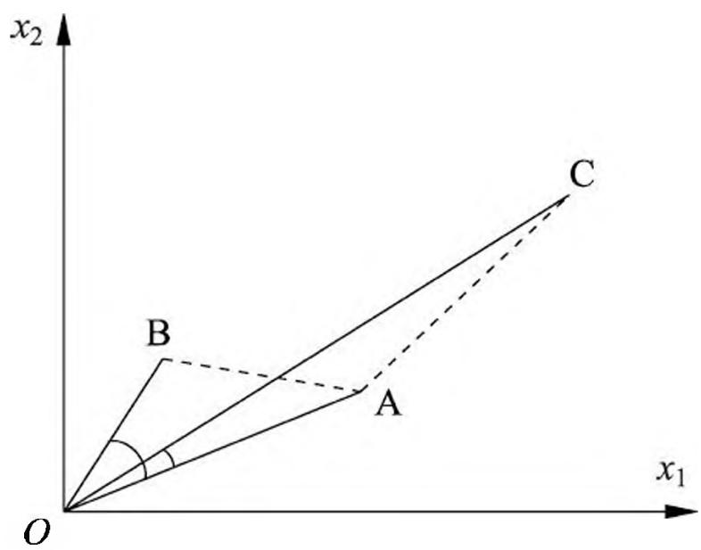
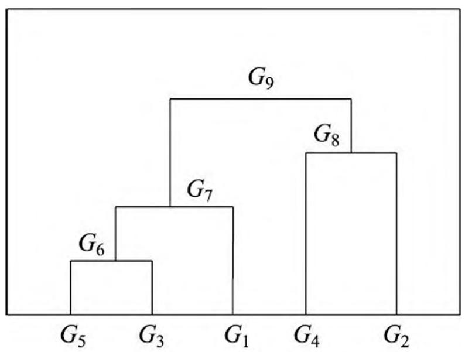
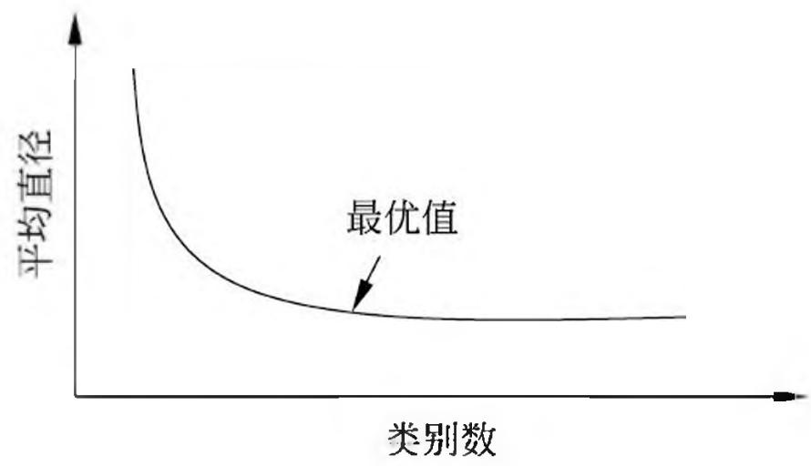

# 第 14 章 聚类方法

聚类是针对给定的样本，依据它们特征的相似度或距离，将其归并到若干个“类”或“簇”的数据分析问题。一个类是给定样本集合的一个子集。直观上，相似的样本聚集在相同的类，不相似的样本分散在不同的类。这里，样本之间的相似度或距离起着重要作用。

聚类的目的是通过得到的类或簇来发现数据的特点或对数据进行处理，在数据挖掘、模式识别等领域有着广泛的应用。聚类属于无监督学习，因为只是根据样本的相似度或距离将其进行归类，而类或簇事先并不知道。

聚类算法很多，本章介绍两种最常用的聚类算法：层次聚类（hierarchical clustering）和 $k$ 均值聚类（ $k$ -means clustering）。层次聚类又有聚合（自下而上）和分裂（自上而下）两种方法。聚合法开始将每个样本各自分到一个类；之后将相距最近的两类合并，建立一个新的类，重复此操作直到满足停止条件；得到层次化的类别。分裂法开始将所有样本分到一个类；之后将已有类中相距最远的样本分到两个新的类，重复此操作直到满足停止条件；得到层次化的类别。 $k$ 均值聚类是基于中心的聚类方法，通过迭代，将样本分到 $k$ 个类中，使得每个样本与其所属类的中心或均值最近；得到 $k$ 个“平坦的”、非层次化的类别，构成对空间的划分。 $k$ 均值聚类的算法 1967 年由 MacQueen 提出。

本章 14.1 节介绍聚类的基本概念，14.2 节和 14.3 节分别叙述层次聚类和 $k$ 均值聚类。

## 14.1 聚类的基本概念

本节介绍聚类的基本概念，包括样本之间的距离或相似度，类或簇，类与类之间的距离。

## 14.1.1 相似度或距离

聚类的对象是观测数据，或样本集合。假设有 $n$ 个样本，每个样本由 $m$ 个属性的特征向量组成。样本集合可以用矩阵 $X$ 表示

$$
X = \left[ x _ {i j} \right] _ {m \times n} = \left[ \begin{array}{c c c c} x _ {1 1} & x _ {1 2} & \dots & x _ {1 n} \\ x _ {2 1} & x _ {2 2} & \dots & x _ {2 n} \\ \vdots & \vdots & & \vdots \\ x _ {m 1} & x _ {m 2} & \dots & x _ {m n} \end{array} \right] \tag {14.1}
$$

矩阵的第 $j$ 列表示第 $j$ 个样本， $j = 1,2,\dots,n$ ；第 $i$ 行表示第 $i$ 个属性， $i = 1,2,\dots,m$ ；矩阵元素 $x_{ij}$ 表示第 $j$ 个样本的第 $i$ 个属性值， $i = 1,2,\dots,m$ ； $j = 1,2,\dots,n$ 。

聚类的核心概念是相似度（similarity）或距离（distance），有多种相似度或距离的定义。因为相似度直接影响聚类的结果，所以其选择是聚类的根本问题。具体哪种相似度更合适取决于应用问题的特性。

## 1. 闵可夫斯基距离 ①

> - ① 在第 3 章叙述了闵可夫斯基距离，现重述，记号有所改变。

在聚类中，可以将样本集合看作是向量空间中点的集合，以该空间的距离表示样本之间的相似度。常用的距离有闵可夫斯基距离，特别是欧氏距离。闵可夫斯基距离越大相似度越小，距离越小相似度越大。

定义 14.1 给定样本集合 $X$ ， $X$ 是 $m$ 维实数向量空间 $\mathbf{R}^m$ 中点的集合，其中 $x_i, x_j \in X$ ， $x_i = (x_{1i}, x_{2i}, \dots, x_{mi})^{\mathrm{T}}$ ， $x_j = (x_{1j}, x_{2j}, \dots, x_{mj})^{\mathrm{T}}$ ，样本 $x_i$ 与样本 $x_j$ 的闵可夫斯基距离（Minkowski distance）定义为

$$
d _ {i j} = \left(\sum_ {k = 1} ^ {m} \left| x _ {k i} - x _ {k j} \right| ^ {p}\right) ^ {\frac {1}{p}} \tag {14.2}
$$

这里 $p \geqslant 1$ 。当 $p = 2$ 时称为欧氏距离（Euclidean distance），即

$$
d _ {i j} = \left(\sum_ {k = 1} ^ {m} \left| x _ {k i} - x _ {k j} \right| ^ {2}\right) ^ {\frac {1}{2}} \tag {14.3}
$$

当 $p = 1$ 时称为曼哈顿距离（Manhattan distance），即

$$
d _ {i j} = \sum_ {k = 1} ^ {m} \left| x _ {k i} - x _ {k j} \right| \tag {14.4}
$$

当 $p = \infty$ 时称为切比雪夫距离（Chebyshev distance），取各个坐标数值差的绝对值的最大值，即

$$
d _ {i j} = \max  _ {k} | x _ {k i} - x _ {k j} | \tag {14.5}
$$

## 2. 马哈拉诺比斯距离

马哈拉诺比斯距离（Mahalanobis distance），简称马氏距离，也是另一种常用的相似度，考虑各个分量（特征）之间的相关性并与各个分量的尺度无关。马哈拉诺比斯距离越大相似度越小，距离越小相似度越大。

定义 14.2 给定一个样本集合 $X$ ， $X = [x_{ij}]_{m \times n}$ ，其协方差矩阵记作 $S$ 。样本 $x_i$ 与样本 $x_j$ 之间的马哈拉诺比斯距离 $d_{ij}$ 定义为

$$
d _ {i j} = \left[ \left(x _ {i} - x _ {j}\right) ^ {\mathrm {T}} S ^ {- 1} \left(x _ {i} - x _ {j}\right) \right] ^ {\frac {1}{2}} \tag {14.6}
$$

其中

$$
x _ {i} = \left(x _ {1 i}, x _ {2 i}, \dots , x _ {m i}\right) ^ {\mathrm {T}}, \quad x _ {j} = \left(x _ {1 j}, x _ {2 j}, \dots , x _ {m j}\right) ^ {\mathrm {T}} \tag {14.7}
$$

当 $S$ 为单位矩阵时，即样本数据的各个分量互相独立且各个分量的方差为 1 时，由式(14.6)知马氏距离就是欧氏距离，所以马氏距离是欧氏距离的推广。

## 3. 相关系数

样本之间的相似度也可以用相关系数（correlation coefficient）来表示。相关系数的绝对值越接近于 1，表示样本越相似；越接近于 0，表示样本越不相似。

定义 14.3 样本 $x_{i}$ 与样本 $x_{j}$ 之间的相关系数定义为

$$
r _ {i j} = \frac {\sum_ {k = 1} ^ {m} \left(x _ {k i} - \bar {x} _ {i}\right) \left(x _ {k j} - \bar {x} _ {j}\right)}{\left[ \sum_ {k = 1} ^ {m} \left(x _ {k i} - \bar {x} _ {i}\right) ^ {2} \sum_ {k = 1} ^ {m} \left(x _ {k j} - \bar {x} _ {j}\right) ^ {2} \right] ^ {\frac {1}{2}}} \tag {14.8}
$$

其中

$$
\bar {x} _ {i} = \frac {1}{m} \sum_ {k = 1} ^ {m} x _ {k i}, \quad \bar {x} _ {j} = \frac {1}{m} \sum_ {k = 1} ^ {m} x _ {k j}
$$

## 4. 夹角余弦

样本之间的相似度也可以用夹角余弦（cosine）来表示。夹角余弦越接近于 1，表示样本越相似；越接近于 0，表示样本越不相似。

定义 14.4 样本 $x_{i}$ 与样本 $x_{j}$ 之间的夹角余弦定义为

$$
s _ {i j} = \frac {\sum_ {k = 1} ^ {m} x _ {k i} x _ {k j}}{\left[ \sum_ {k = 1} ^ {m} x _ {k i} ^ {2} \sum_ {k = 1} ^ {m} x _ {k j} ^ {2} \right] ^ {\frac {1}{2}}} \tag {14.9}
$$

由上述定义看出，用距离度量相似度时，距离越小样本越相似；用相关系数时，相关系数越大样本越相似。注意不同相似度度量得到的结果并不一定一致。请参照图 14.1。

> 图 14.1 距离与相关系数的关系

从图上可以看出，如果从距离的角度看， $A$ 和 $B$ 比 $A$ 和 $C$ 更相似；但从相关系数的角度看， $A$ 和 $C$ 比 $A$ 和 $B$ 更相似。所以，进行聚类时，选择适合的距离或相似度非常重要。

## 14.1.2 类或簇

通过聚类得到的类或簇，本质是样本的子集。如果一个聚类方法假定一个样本只能属于一个类，或类的交集为空集，那么该方法称为硬聚类（hard clustering）方法。否则，如果一个样本可以属于多个类，或类的交集不为空集，那么该方法称为软聚类（soft clustering）方法。本章只考虑硬聚类方法。

用 $G$ 表示类或簇（cluster），用 $x_{i}, x_{j}$ 表示类中的样本，用 $n_{G}$ 表示 $G$ 中样本的个数，用 $d_{ij}$ 表示样本 $x_{i}$ 与样本 $x_{j}$ 之间的距离。类或簇有多种定义，下面给出几个常见的定义。

定义 14.5 设 $T$ 为给定的正数，若集合 $G$ 中任意两个样本 $x_{i}, x_{j}$ ，有

$$
d _ {i j} \leqslant T
$$

则称 $G$ 为一个类或簇。

定义 14.6 设 $T$ 为给定的正数，若对集合 $G$ 的任意样本 $x_{i}$ ，一定存在 $G$ 中的另一个样本 $x_{j}$ ，使得

$$
d _ {i j} \leqslant T
$$

则称 $G$ 为一个类或簇。

定义 14.7 设 $T$ 为给定的正数，若对集合 $G$ 中任意一个样本 $x_{i}$ ， $G$ 中的另一个样本 $x_{j}$ 满足

$$
\frac {1}{n _ {G} - 1} \sum_ {x _ {j} \in G} d _ {i j} \leqslant T
$$

其中 $n_G$ 为 $G$ 中样本的个数，则称 $G$ 为一个类或簇。

定义 14.8 设 $T$ 和 $V$ 为给定的两个正数，如果集合 $G$ 中任意两个样本 $x_{i}, x_{j}$ 的距离 $d_{ij}$ 满足

$$
\begin{array}{l} \frac {1}{n _ {G} \left(n _ {G} - 1\right)} \sum_ {x _ {i} \in G} \sum_ {x _ {j} \in G} d _ {i j} \leqslant T \\ d _ {i j} \leqslant V \\ \end{array}
$$

则称 $G$ 为一个类或簇。

以上四个定义，第一个定义最常用，并且由它可推出其他三个定义。

类的特征可以通过不同角度来刻画，常用的特征有下面三种：

（1）类的均值 $\bar{x}_G$ ，又称为类的中心

$$
\bar {x} _ {G} = \frac {1}{n _ {G}} \sum_ {i = 1} ^ {n _ {G}} x _ {i} \tag {14.10}
$$

式中 $n_G$ 是类 $G$ 的样本个数。

(2) 类的直径（diameter） $D_{G}$类的直径 $D_G$ 是类中任意两个样本之间的最大距离，即

$$
D _ {G} = \max  _ {x _ {i}, x _ {j} \in G} d _ {i j} \tag {14.11}
$$

(3) 类的样本散布矩阵（scatter matrix） $A_G$ 与样本协方差矩阵（covariance matrix） $S_G$类的样本散布矩阵 $A_{G}$ 为

$$
A _ {G} = \sum_ {i = 1} ^ {n _ {G}} \left(x _ {i} - \bar {x} _ {G}\right) \left(x _ {i} - \bar {x} _ {G}\right) ^ {\mathrm {T}} \tag {14.12}
$$

样本协方差矩阵 $S_{G}$ 为

$$
\begin{array}{l} S _ {G} = \frac {1}{m - 1} A _ {G} \\ = \frac {1}{m - 1} \sum_ {i = 1} ^ {n _ {G}} \left(x _ {i} - \bar {x} _ {G}\right) \left(x _ {i} - \bar {x} _ {G}\right) ^ {\mathrm {T}} \tag {14.13} \\ \end{array}
$$

其中 $m$ 为样本的维数（样本属性的个数）。

## 14.1.3 类与类之间的距离

下面考虑类 $G_{p}$ 与类 $G_{q}$ 之间的距离 $D(p,q)$ ，也称为连接（linkage）。类与类之间的距离也有多种定义。

设类 $G_{p}$ 包含 $n_p$ 个样本， $G_{q}$ 包含 $n_q$ 个样本，分别用 $\bar{x}_p$ 和 $\bar{x}_q$ 表示 $G_{p}$ 和 $G_{q}$ 的均值，即类的中心。

（1）最短距离或单连接（single linkage）定义类 $G_{p}$ 的样本与 $G_{q}$ 的样本之间的最短距离为两类之间的距离

$$
D _ {p q} = \min  \left\{d _ {i j} \mid x _ {i} \in G _ {p}, x _ {j} \in G _ {q} \right\} \tag {14.14}
$$

(2) 最长距离或完全连接 (complete linkage)定义类 $G_{p}$ 的样本与 $G_{q}$ 的样本之间的最长距离为两类之间的距离

$$
D _ {p q} = \max  \left\{d _ {i j} \mid x _ {i} \in G _ {p}, x _ {j} \in G _ {q} \right\} \tag {14.15}
$$

(3) 中心距离定义类 $G_{p}$ 与类 $G_{q}$ 的中心 $\bar{x}_p$ 与 $\bar{x}_q$ 之间的距离为两类之间的距离

$$
D _ {p q} = d _ {\bar {x} _ {p} \bar {x} _ {q}} \tag {14.16}
$$

(4) 平均距离定义类 $G_{p}$ 与类 $G_{q}$ 任意两个样本之间距离的平均值为两类之间的距离

$$
D _ {p q} = \frac {1}{n _ {p} n _ {q}} \sum_ {x _ {i} \in G _ {p}} \sum_ {x _ {j} \in G _ {q}} d _ {i j} \tag {14.17}
$$

## 14.2 层次聚类

层次聚类假设类别之间存在层次结构，将样本聚到层次化的类中。层次聚类又有聚合（agglomerative）或自下而上（bottom-up）聚类、分裂（divisive）或自上而下（top-down）聚类两种方法。因为每个样本只属于一个类，所以层次聚类属于硬聚类。

聚合聚类开始将每个样本各自分到一个类；之后将相距最近的两类合并，建立一个新的类，重复此操作直到满足停止条件；得到层次化的类别。分裂聚类开始将所有样本分到一个类；之后将已有类中相距最远的样本分到两个新的类，重复此操作直到满足停止条件；得到层次化的类别。本书只介绍聚合聚类。

聚合聚类的具体过程如下：对于给定的样本集合，开始将每个样本分到一个类；然后按照一定规则，例如类间距离最小，将最满足规则条件的两个类进行合并；如此反复进行，每次减少一个类，直到满足停止条件，如所有样本聚为一类。

由此可知，聚合聚类需要预先确定下面三个要素：

- （1）距离或相似度；
- (2) 合并规则;
- (3) 停止条件。

根据这些要素的不同组合，就可以构成不同的聚类方法。距离或相似度可以是闵可夫斯基距离、马哈拉诺比斯距离、相关系数、夹角余弦。合并规则一般是类间距离最小，类间距离可以是最短距离、最长距离、中心距离、平均距离。停止条件可以是类的个数达到阈值（极端情况类的个数是 1）、类的直径超过阈值。

如果采用欧氏距离为样本之间距离；类间距离最小为合并规则，其中最短距离为类间距离；类的个数是 1，即所有样本聚为一类，为停止条件，那么聚合聚类的算法如下。

## 算法 14.1（聚合聚类算法）

输入： $n$ 个样本组成的样本集合及样本之间的距离；

输出：对样本集合的一个层次化聚类。

- (1) 计算 $n$ 个样本两两之间的欧氏距离 $\{d_{ij}\}$ , 记作矩阵 $D = [d_{ij}]_{n \times n}$ 。
- (2) 构造 $n$ 个类, 每个类只包含一个样本。
- (3) 合并类间距离最小的两个类, 其中最短距离为类间距离, 构建一个新类。
- (4) 计算新类与当前各类的距离。若类的个数为 1, 终止计算, 否则回到步 (3)。

可以看出聚合层次聚类算法的复杂度是 $O(n^{3}m)$ ，其中 $m$ 是样本的维数， $n$ 是样本个数。

下面通过一个例子说明聚合层次聚类算法。

例 14.1 给定 5 个样本的集合，样本之间的欧氏距离由如下矩阵 $D$ 表示：

$$
D = \left[ d _ {i j} \right] _ {5 \times 5} = \left[ \begin{array}{c c c c c} 0 & 7 & 2 & 9 & 3 \\ 7 & 0 & 5 & 4 & 6 \\ 2 & 5 & 0 & 8 & 1 \\ 9 & 4 & 8 & 0 & 5 \\ 3 & 6 & 1 & 5 & 0 \end{array} \right]
$$

其中 $d_{ij}$ 表示第 $i$ 个样本与第 $j$ 个样本之间的欧氏距离。显然 $D$ 为对称矩阵。应用聚合层次聚类法对这 5 个样本进行聚类。

解（1）首先用 5 个样本构建 5 个类， $G_{i} = \{x_{i}\}$ ， $i = 1,2,\dots ,5$ ，这样，样本之间的距离也就变成类之间的距离，所以 5 个类之间的距离矩阵亦为 $D$ 。

（2）由矩阵 $D$ 可以看出， $D_{35} = D_{53} = 1$ 为最小，所以把 $G_{3}$ 和 $G_{5}$ 合并为一个新类，记作 $G_{6} = \{x_{3}, x_{5}\}$ 。

(3) 计算 $G_{6}$ 与 $G_{1}, G_{2}, G_{4}$ 之间的最短距离, 有

$$
D _ {6 1} = 2, \quad D _ {6 2} = 5, \quad D _ {6 4} = 5
$$

又注意到其余两类之间的距离是

$$
D _ {1 2} = 7, \quad D _ {1 4} = 9, \quad D _ {2 4} = 4
$$

显然， $D_{61} = 2$ 最小，所以将 $G_{1}$ 与 $G_{6}$ 合并成一个新类，记作 $G_{7} = \{x_{1},x_{3},x_{5}\}$（4）计算 $G_{7}$ 与 $G_{2}, G_{4}$ 之间的最短距离，

$$
D _ {7 2} = 5, \quad D _ {7 4} = 5
$$

又注意到

$$
D _ {2 4} = 4
$$

显然，其中 $D_{24} = 4$ 最小，所以将 $G_{2}$ 与 $G_{4}$ 合并成一新类，记作 $G_{8} = \{x_{2}, x_{4}\}$ 。

（5）将 $G_{7}$ 与 $G_{8}$ 合并成一个新类，记作 $G_{9} = \{x_{1},x_{2},x_{3},x_{4},x_{5}\}$ ，即将全部样本聚成 1 类，聚类终止。

上述层次聚类过程可以用下面的层次聚类图表示。

> 图 14.2 层次聚类图

## 14.3 $k$ 均值聚类

$k$ 均值聚类是基于样本集合划分的聚类算法。 $k$ 均值聚类将样本集合划分为 $k$ 个子集，构成 $k$ 个类，将 $n$ 个样本分到 $k$ 个类中，每个样本到其所属类的中心的距离最小。每个样本只能属于一个类，所以 $k$ 均值聚类是硬聚类。下面分别介绍 $k$ 均值聚类的模型、策略、算法，讨论算法的特性及相关问题。

## 14.3.1 模型

给定 $n$ 个样本的集合 $X = \{x_{1}, x_{2}, \dots, x_{n}\}$ ，每个样本由一个特征向量表示，特征向量的维数是 $m$ 。 $k$ 均值聚类的目标是将 $n$ 个样本分到 $k$ 个不同的类或簇中，这里假设 $k < n$ 。 $k$ 个类 $G_{1}, G_{2}, \dots, G_{k}$ 形成对样本集合 $X$ 的划分，其中 $G_{i} \cap G_{j} = \emptyset$ ， $\bigcup_{i=1}^{k} G_{i} = X$ 。用 $C$ 表示划分，一个划分对应着一个聚类结果。

划分 $C$ 是一个多对一的函数。事实上，如果把每个样本用一个整数 $i \in \{1, 2, \dots, n\}$ 表示，每个类也用一个整数 $l \in \{1, 2, \dots, k\}$ 表示，那么划分或者聚类可以用函数 $l = C(i)$ 表示，其中 $i \in \{1, 2, \dots, n\}, l \in \{1, 2, \dots, k\}$ 。所以 $k$ 均值聚类的模型是一个从样本到类的函数。

## 14.3.2 策略

$k$ 均值聚类归结为样本集合 $X$ 的划分，或者从样本到类的函数的选择问题。 $k$ 均值聚类的策略是通过损失函数的最小化选取最优的划分或函数 $C^*$ 。

首先，采用欧氏距离平方（squared Euclidean distance）作为样本之间的距离 $d(x_{i},x_{j})$

$$
\begin{array}{l} d (x _ {i}, x _ {j}) = \sum_ {k = 1} ^ {m} \left(x _ {k i} - x _ {k j}\right) ^ {2} \\ = \left\| x _ {i} - x _ {j} \right\| ^ {2} \tag {14.18} \\ \end{array}
$$

然后，定义样本与其所属类的中心之间的距离的总和为损失函数，即

$$
W (C) = \sum_ {l = 1} ^ {k} \sum_ {C (i) = l} \| x _ {i} - \bar {x} _ {l} \| ^ {2} \tag {14.19}
$$

式中 $\bar{x}_l = (\bar{x}_{1l},\bar{x}_{2l},\dots ,\bar{x}_{ml})^{\mathrm{T}}$ 是第 $l$ 个类的均值或中心， $n_l = \sum_{i = 1}^{n}I(C(i) = l)$ $I(C(i) = l)$ 是指示函数，取值为 1 或 0。函数 $W(C)$ 也称为能量，表示相同类中的样本相似的程度。

$k$ 均值聚类就是求解最优化问题：

$$
\begin{array}{l} C ^ {*} = \arg \min  _ {C} W (C) \\ = \arg \min  _ {C} \sum_ {l = 1} ^ {k} \sum_ {C (i) = l} \| x _ {i} - \bar {x} _ {l} \| ^ {2} \tag {14.20} \\ \end{array}
$$

相似的样本被聚到同类时，损失函数值最小，这个目标函数的最优化能达到聚类的目的。但是，这是一个组合优化问题， $n$ 个样本分到 $k$ 类，所有可能分法的数目是：

$$
S (n, k) = \frac {1}{k !} \sum_ {l = 1} ^ {k} (- 1) ^ {k - l} \left( \begin{array}{c} k \\ l \end{array} \right) k ^ {n} \tag {14.21}
$$

这个数字是指数级的。事实上， $k$ 均值聚类的最优解求解问题是 NP 困难问题。现实中采用迭代的方法求解。

## 14.3.3 算法

$k$ 均值聚类的算法是一个迭代的过程，每次迭代包括两个步骤。首先选择 $k$ 个类的中心，将样本逐个指派到与其最近的中心的类中，得到一个聚类结果；然后更新每个类的样本的均值，作为类的新的中心；重复以上步骤，直到收敛为止。具体过程如下。

首先，对于给定的中心值 $(m_1, m_2, \dots, m_k)$ ，求一个划分 $C$ ，使得目标函数极小化：

$$
\min  _ {C} \sum_ {l = 1} ^ {k} \sum_ {C (i) = l} \| x _ {i} - m _ {l} \| ^ {2} \tag {14.22}
$$

就是说在类中心确定的情况下，将每个样本分到一个类中，使样本和其所属类的中心之间的距离总和最小。求解结果，将每个样本指派到与其最近的中心 $m_{l}$ 的类 $G_{l}$ 中。

然后，对给定的划分 $C$ ，再求各个类的中心 $(m_{1},m_{2},\dots ,m_{k})$ ，使得目标函数极小化：

$$
\operatorname * {m i n} _ {m _ {1}, \dots , m _ {k}} \sum_ {l = 1} ^ {k} \sum_ {C (i) = l} | | x _ {i} - m _ {l} | | ^ {2}
$$

就是说在划分确定的情况下，使样本和其所属类的中心之间的距离总和最小。求解结果，对于每个包含 $n_l$ 个样本的类 $G_l$ ，更新其均值 $m_l$ ：

$$
m _ {l} = \frac {1}{n _ {l}} \sum_ {C (i) = l} x _ {i}, \quad l = 1, \dots , k
$$

重复以上两个步骤，直到划分不再改变，得到聚类结果。现将 $k$ 均值聚类算法叙述如下。

## 算法 14.2（ $k$ 均值聚类算法）

输入: $n$ 个样本的集合 $X$ ;输出: 样本集合的聚类 $C^{\bullet}$ 。

（1）初始化。令 $t = 0$ ，随机选择 $k$ 个样本点作为初始聚类中心 $m^{(0)} = (m_1^{(0)},\dots ,m_l^{(0)},\dots ,m_k^{(0)})$ 。

（2）对样本进行聚类。对固定的类中心 $m^{(t)} = (m_1^{(t)},\dots ,m_l^{(t)},\dots ,m_k^{(t)})$ ，其中 $m_{l}^{(t)}$ 为类 $G_{l}$ 的中心，计算每个样本到类中心的距离，将每个样本指派到与其最近的中心的类中，构成聚类结果 $C^{(t)}$ 。

（3）计算新的类中心。对聚类结果 $C^{(t)}$ ，计算当前各个类中的样本的均值，作为新的类中心 $m^{(t + 1)} = (m_1^{(t + 1)},\dots ,m_l^{(t + 1)},\dots ,m_k^{(t + 1)})$ 。

（4）如果迭代收敛或符合停止条件，输出 $C^* = C^{(t)}$ 。

否则，令 $t = t + 1$ ，返回步(2)。

$k$ 均值聚类算法的复杂度是 $O(mnk)$ ，其中 $m$ 是样本维数， $n$ 是样本个数， $k$ 是类别个数。

例 14.2 给定含有 5 个样本的集合

$$
X = \left[ \begin{array}{c c c c c} 0 & 0 & 1 & 5 & 5 \\ 2 & 0 & 0 & 0 & 2 \end{array} \right]
$$

试用 $k$ 均值聚类算法将样本聚到 2 个类中。

解 按照算法 14.2，（1）选择两个样本点作为类的中心。假设选择 $m_1^{(0)} = x_1 = (0,2)^{\mathrm{T}}$ ， $m_2^{(0)} = x_2 = (0,0)^{\mathrm{T}}$ 。

(2) 以 $m_{1}^{(0)}$ , $m_{2}^{(0)}$ 为类 $G_{1}^{(0)}$ , $G_{2}^{(0)}$ 的中心, 计算 $x_{3} = (1,0)^{\mathrm{T}}$ , $x_{4} = (5,0)^{\mathrm{T}}$ , $x_{5} = (5,2)^{\mathrm{T}}$ 与 $m_{1}^{(0)} = (0,2)^{\mathrm{T}}$ , $m_{2}^{(0)} = (0,0)^{\mathrm{T}}$ 的欧氏距离平方。

对 $x_{3} = (1,0)^{\mathrm{T}}$ ， $d(x_{3},m_{1}^{(0)}) = 5$ ， $d(x_{3},m_{2}^{(0)}) = 1$ ，将 $x_{3}$ 分到类 $G_{2}^{(0)}$ 。

对 $x_{4} = (5,0)^{\mathrm{T}}$ ， $d(x_4,m_1^{(0)}) = 29$ ， $d(x_{4},m_{2}^{(0)}) = 25$ ，将 $x_{4}$ 分到类 $G_{2}^{(0)}$ 。

对 $x_{5} = (5,2)^{\mathrm{T}}$ ， $d(x_{5},m_{1}^{(0)}) = 25$ ， $d(x_{5},m_{2}^{(0)}) = 29$ ，将 $x_{5}$ 分到类 $G_1^{(0)}$ 。

(3) 得到新的类 $G_1^{(1)} = \{x_1, x_5\}$ , $G_2^{(1)} = \{x_2, x_3, x_4\}$ , 计算类的中心 $m_1^{(1)}$ , $m_2^{(1)}$ :

$$
m _ {1} ^ {(1)} = (2. 5, 2. 0) ^ {\mathrm {T}}, \quad m _ {2} ^ {(1)} = (2, 0) ^ {\mathrm {T}}
$$

（4）重复步骤(2)和步骤(3)。

将 $x_{1}$ 分到类 $G_{1}^{(1)}$ ，将 $x_{2}$ 分到类 $G_{2}^{(1)}$ ， $x_{3}$ 分到类 $G_{2}^{(1)}$ ， $x_{4}$ 分到类 $G_{2}^{(1)}$ ， $x_{5}$ 分到类 $G_{1}^{(1)}$ 。

得到新的类 $G_1^{(2)} = \{x_1, x_5\}$ , $G_2^{(2)} = \{x_2, x_3, x_4\}$ 。

由于得到的新的类没有改变，聚类停止。得到聚类结果：

$$
G _ {1} ^ {*} = \left\{x _ {1}, x _ {5} \right\}, \quad G _ {2} ^ {*} = \left\{x _ {2}, x _ {3}, x _ {4} \right\}
$$

## 14.3.4 算法特性

## 1. 总体特点

$k$ 均值聚类有以下特点：基于划分的聚类方法；类别数 $k$ 事先指定；以欧氏距离平方表示样本之间的距离，以中心或样本的均值表示类别；以样本和其所属类的中心之间的距离的总和为最优化的目标函数；得到的类别是平坦的、非层次化的；算法是迭代算法，不能保证得到全局最优。

## 2. 收敛性

$k$ 均值聚类属于启发式方法，不能保证收敛到全局最优，初始中心的选择会直接影响聚类结果。注意，类中心在聚类的过程中会发生移动，但是往往不会移动太大，因为在每一步，样本被分到与其最近的中心的类中。

## 3. 初始类的选择

选择不同的初始中心，会得到不同的聚类结果。针对上面的例 14.2，如果改变两个类的初始中心，比如选择 $m_1^{(0)} = x_1$ 和 $m_2^{(0)} = x_5$ ，那么 $x_{2},x_{3}$ 会分到 $G_1^{(0)}$ ， $x_4$ 会分到 $G_2^{(0)}$ ，形成聚类结果 $G_1^{(1)} = \{x_1, x_2, x_3\}$ ， $G_2^{(1)} = \{x_4, x_5\}$ 。中心是 $m_1^{(1)} = (0.33, 0.67)^{\mathrm{T}}$ ， $m_2^{(1)} = (5, 1)^{\mathrm{T}}$ 。继续迭代，聚类结果仍然是 $G_1^{(2)} = \{x_1, x_2, x_3\}$ ， $G_2^{(2)} = \{x_4, x_5\}$ 。聚类停止。

初始中心的选择，比如可以用层次聚类对样本进行聚类，得到 $k$ 个类时停止。然后从每个类中选取一个与中心距离最近的点。

## 4. 类别数 $k$ 的选择

$k$ 均值聚类中的类别数 $k$ 值需要预先指定，而在实际应用中最优的 $k$ 值是不知道的。解决这个问题的一个方法是尝试用不同的 $k$ 值聚类，检验各自得到聚类结果的质量，推测最优的 $k$ 值。聚类结果的质量可以用类的平均直径来衡量。一般地，类别数变小时，平均直径会增加；类别数变大超过某个值以后，平均直径会不变；而这个值正是最优的 $k$ 值。图 14.3 说明类别数与平均直径的关系。实验时，可以采用二分查找，快速找到最优的 $k$ 值。

> 图 14.3 类别数与平均直径的关系

## 本章概要

1. 聚类是针对给定的样本，依据它们属性的相似度或距离，将其归并到若干个“类”或“簇”的数据分析问题。一个类是样本的一个子集。直观上，相似的样本聚集在同类，不相似的样本分散在不同类。

2. 距离或相似度度量在聚类中起着重要作用。

常用的距离度量有闵可夫斯基距离，包括欧氏距离、曼哈顿距离、切比雪夫距离以及马哈拉诺比斯距离。常用的相似度度量有相关系数、夹角余弦。

用距离度量相似度时，距离越小表示样本越相似；用相关系数时，相关系数越大表示样本越相似。

3. 类是样本的子集，比如有如下基本定义：

用 $G$ 表示类或簇，用 $x_{i}, x_{j}$ 等表示类中的样本，用 $d_{ij}$ 表示样本 $x_{i}$ 与样本 $x_{j}$ 之间的距离。如果对任意的 $x_{i}, x_{j} \in G$ ，有

$$
d _ {i j} \leqslant T
$$

则称 $G$ 为一个类或簇。

描述类的特征的指标有中心、直径、散布矩阵、协方差矩阵。

- 4. 聚类过程中用到类与类之间的距离也称为连接。类与类之间的距离包括最短距离、最长距离、中心距离、平均距离。
- 5. 层次聚类假设类别之间存在层次结构，将样本聚到层次化的类中。层次聚类又有聚合或自下而上、分裂或自上而下两种方法。

聚合聚类开始将每个样本各自分到一个类；之后将相距最近的两类合并，建立一个新的类，重复此操作直到满足停止条件；得到层次化的类别。分裂聚类开始将所有样本分到一个类；之后将已有类中相距最远的样本分到两个新的类，重复此操作直到满足停止条件；得到层次化的类别。

聚合聚类需要预先确定下面三个要素：

- (1) 距离或相似度;
- (2) 合并规则;
- (3) 停止条件。

根据这些概念的不同组合，就可以得到不同的聚类方法。

6. $k$ 均值聚类是常用的聚类算法，有以下特点。基于划分的聚类方法；类别数 $k$ 事先指定；以欧氏距离平方表示样本之间的距离或相似度，以中心或样本的均值表示类别；以样本和其所属类的中心之间的距离的总和为优化的目标函数；得到的类别是平坦的、非层次化的；算法是迭代算法，不能保证得到全局最优。

$k$ 均值聚类算法，首先选择 $k$ 个类的中心，将样本分到与中心最近的类中，得到一个聚类结果；然后计算每个类的样本的均值，作为类的新的中心；重复以上步骤，直到收敛为止。

## 继续阅读

聚类的方法很多，各种方法的详细介绍可见文献[1,2]。层次化聚类的方法可见文献[2], $k$ 均值聚类可见文献[3,4]。 $k$ 均值聚类的扩展有 X-means[5]。其他常用的聚类方法还有基于混合分布的方法，如高斯混合模型与 EM 算法；基于密度的方法，如 DBScan[6]；基于谱聚类的方法，如 Normalized Cuts[7]。以上方法是对样本的聚类，也有对样本与属性同时聚类的方法，如 Co-Clustering[8]。

## 习题

- 14.1 试写出分裂聚类算法，自上而下地对数据进行聚类，并给出其算法复杂度。
- 14.2 证明类或簇的四个定义中，第一个定义可推出其他三个定义。
- 14.3 证明式 (14.21) 成立, 即 $k$ 均值的可能解的个数是指数级的。
- 14.4 比较 $k$ 均值聚类与高斯混合模型加 EM 算法的异同。

## 参考文献

- [1] Jain A, Dubes R. Algorithms for clustering data. Prentice-Hall, 1988.
- [2] Aggarwal C C, Reddy C K. Data clustering: algorithms and applications. CRC Press, 2013.
- [3] MacQueen J B. Some methods for classification and analysis of multivariate observations. Proceedings of 5th Symposium on Mathematical Statistics and Probability, vol.1, pp. 396-410. 1967.
- [4] Hastie T, Tibshirani R, Friedman J. The elements of statistical learning: data mining, inference, and prediction. Springer, 2001. (中译本: 统计学习基础——数据挖掘、推理与预测. 范明, 柴玉梅, 答红英等译. 北京: 电子工业出版社, 2004.)
- [5] Pelleg D, Moore A W. X-means: extending $K$ -means with efficient estimation of the number of clusters. Proceedings of ICML, pp. 727-734, 2000.
- [6] Ester M, Kriegel H, Sander J, et al. A density-based algorithm for discovering clusters in large spatial databases with noise. Proceedings of ACM SIGKDD, pp. 226-231. 1996.
- [7] Shi J, Malik J. Normalized cuts and image segmentation. IEEE Transactions on Pattern Analysis and Machine Intelligence, 2000, 22(8): 888-905.
- [8] Dhillon I S. Co-clustering documents and words using bipartite spectral graph partitioning. Proceedings of ACM SIGKDD, pp. 269-274. 2001.