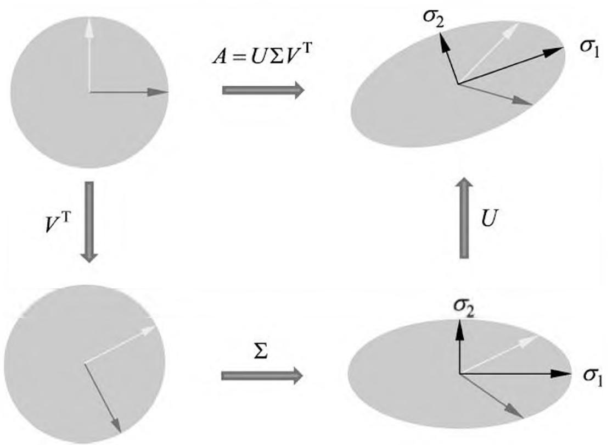
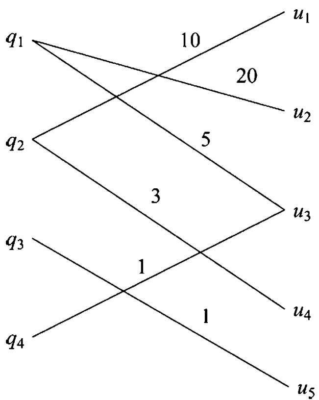

# 第 15 章 奇异值分解

奇异值分解（singular value decomposition, SVD）是一种矩阵因子分解方法，是线性代数的概念，但在统计学习中被广泛使用，成为其重要工具。本书介绍的主成分分析、潜在语义分析都用到奇异值分解。

任意一个 $m \times n$ 矩阵，都可以表示为三个矩阵的乘积（因子分解）形式，分别是 $m$ 阶正交矩阵、由降序排列的非负的对角线元素组成的 $m \times n$ 矩形对角矩阵和 $n$ 阶正交矩阵，称为该矩阵的奇异值分解。矩阵的奇异值分解一定存在，但不唯一。奇异值分解可以看作是矩阵数据压缩的一种方法，即用因子分解的方式近似地表示原始矩阵，这种近似是在平方损失意义下的最优近似。

15.1 节讲述矩阵奇异值分解的定义与基本定理，叙述奇异值分解的紧凑和截断形式、几何解释、主要性质；15.2 节讲述奇异值分解的算法；15.3 节论述奇异值分解是矩阵的一种最优近似方法。

## 15.1 奇异值分解的定义与性质

### 15.1.1 定义与定理

定义 15.1（奇异值分解）矩阵的奇异值分解是指，将一个非零的 $m \times n$ 实矩阵 $A, A \in \mathbf{R}^{m \times n}$ ，表示为以下三个实矩阵乘积形式的运算 ①，即进行矩阵的因子分解：

> - ① 奇异值分解可以更一般地定义在复数矩阵上，这里并不涉及。

$$
A = U \Sigma V ^ {\mathrm {T}} \tag {15.1}
$$

其中 $U$ 是 $m$ 阶正交矩阵（orthogonal matrix）， $V$ 是 $n$ 阶正交矩阵， $\Sigma$ 是由降序排列的非负的对角线元素组成的 $m \times n$ 矩形对角矩阵（rectangular diagonal matrix），满足

$$
\begin{array}{l} U U ^ {\mathrm {T}} = I \\ V V ^ {\mathrm {T}} = I \\ \Sigma = \operatorname {d i a g} \left(\sigma_ {1}, \sigma_ {2}, \dots , \sigma_ {p}\right) \\ \sigma_ {1} \geqslant \sigma_ {2} \geqslant \dots \geqslant \sigma_ {p} \geqslant 0 \\ p = \min  (m, n) \\ \end{array}
$$

$U\Sigma V^{\mathrm{T}}$ 称为矩阵 $A$ 的奇异值分解（singular value decomposition, SVD）， $\sigma_{i}$ 称为矩阵 $A$ 的奇异值（singular value）， $U$ 的列向量称为左奇异向量（left singular vector）， $V$ 的列向量称为右奇异向量（right singular vector）。

注意奇异值分解不要求矩阵 $A$ 是方阵，事实上矩阵的奇异值分解可以看作是方阵的对角化的推广。

下面看一个奇异值分解的例子。

例 15.1 给定一个 $5 \times 4$ 矩阵 $A$

$$
A = \left[ \begin{array}{l l l l} 1 & 0 & 0 & 0 \\ 0 & 0 & 0 & 4 \\ 0 & 3 & 0 & 0 \\ 0 & 0 & 0 & 0 \\ 2 & 0 & 0 & 0 \end{array} \right]
$$

它的奇异值分解由三个矩阵的乘积 $U\Sigma V^{\mathrm{T}}$ 给出，矩阵 $U,\Sigma ,V^{\mathrm{T}}$ 分别为

$$
\begin{array}{l} U = \left[ \begin{array}{c c c c c} 0 & 0 & \sqrt {0 . 2} & 0 & \sqrt {0 . 8} \\ 1 & 0 & 0 & 0 & 0 \\ 0 & 1 & 0 & 0 & 0 \\ 0 & 0 & 0 & 1 & 0 \\ 0 & 0 & \sqrt {0 . 8} & 0 & - \sqrt {0 . 2} \end{array} \right], \quad \Sigma = \left[ \begin{array}{c c c c} 4 & 0 & 0 & 0 \\ 0 & 3 & 0 & 0 \\ 0 & 0 & \sqrt {5} & 0 \\ 0 & 0 & 0 & 0 \\ 0 & 0 & 0 & 0 \end{array} \right] \\ V ^ {\mathrm {T}} = \left[ \begin{array}{c c c c} 0 & 0 & 0 & 1 \\ 0 & 1 & 0 & 0 \\ 1 & 0 & 0 & 0 \\ 0 & 0 & 1 & 0 \end{array} \right] \\ \end{array}
$$

矩阵 $\Sigma$ 是对角矩阵，对角线外的元素都是 0，对角线上的元素非负，按降序排列。矩阵 $U$ 和 $V$ 是正交矩阵，它们与各自的转置矩阵相乘是单位矩阵，即

$$
U U ^ {\mathrm {T}} = I _ {5}, V V ^ {\mathrm {T}} = I _ {4}
$$

矩阵的奇异值分解不是唯一的。在此例中如果选择 $U$ 为

$$
U = \left[ \begin{array}{c c c c c} 0 & 0 & \sqrt {0 . 2} & \sqrt {0 . 4} & - \sqrt {0 . 4} \\ 1 & 0 & 0 & 0 & 0 \\ 0 & 1 & 0 & 0 & 0 \\ 0 & 0 & 0 & \sqrt {0 . 5} & \sqrt {0 . 5} \\ 0 & 0 & \sqrt {0 . 8} & - \sqrt {0 . 1} & \sqrt {0 . 1} \end{array} \right]
$$

而 $\Sigma$ 与 $V$ 不变，那么 $U\Sigma V^{\mathrm{T}}$ 也是 $A$ 的一个奇异值分解。

任意给定一个实矩阵，其奇异值分解是否一定存在呢？答案是肯定的，下面的奇异值分解的基本定理给予保证。

定理 15.1（奇异值分解基本定理）若 $A$ 为一 $m \times n$ 实矩阵， $A \in \mathbf{R}^{m \times n}$ ，则 $A$ 的奇异值分解存在

$$
A = U \Sigma V ^ {\mathrm {T}} \tag {15.2}
$$

其中 $U$ 是 $m$ 阶正交矩阵， $V$ 是 $n$ 阶正交矩阵， $\Sigma$ 是 $m \times n$ 矩形对角矩阵，其对角线元素非负，且按降序排列。

证明 证明是构造性的，对给定的矩阵 $A$ ，构造出其奇异值分解的各个矩阵。为了方便，不妨假设 $m \geqslant n$ ，如果 $m < n$ 证明仍然成立。证明由三步完成。①（1）确定 $V$ 和 $\Sigma$首先构造 $n$ 阶正交实矩阵 $V$ 和 $m \times n$ 矩形对角实矩阵 $\Sigma$ 。

> - ① 线性代数的基本知识可参见本章的参考文献。

矩阵 $A$ 是 $m \times n$ 实矩阵，则矩阵 $A^{\mathrm{T}}A$ 是 $n$ 阶实对称矩阵。因而 $A^{\mathrm{T}}A$ 的特征值都是实数，并且存在一个 $n$ 阶正交实矩阵 $V$ 实现 $A^{\mathrm{T}}A$ 的对角化，使得 $V^{\mathrm{T}}(A^{\mathrm{T}}A)V = A$ 成立，其中 $\Lambda$ 是 $n$ 阶对角矩阵，其对角线元素由 $A^{\mathrm{T}}A$ 的特征值组成。

而且， $A^{\mathrm{T}}A$ 的特征值都是非负的。事实上，令 $\lambda$ 是 $A^{\mathrm{T}}A$ 的一个特征值， $x$ 是对应的特征向量，则

$$
\left\| A x \right\| ^ {2} = x ^ {\mathrm {T}} A ^ {\mathrm {T}} A x = \lambda x ^ {\mathrm {T}} x = \lambda \| x \| ^ {2}
$$

于是

$$
\lambda = \frac {\| A x \| ^ {2}}{\| x \| ^ {2}} \geqslant 0 \tag {15.3}
$$

可以假设正交矩阵 $V$ 的列的排列使得对应的特征值形成降序排列

$$
\lambda_ {1} \geqslant \lambda_ {2} \geqslant \dots \geqslant \lambda_ {n} \geqslant 0
$$

计算特征值的平方根（实际就是矩阵 $A$ 的奇异值）

$$
\sigma_ {j} = \sqrt {\lambda_ {j}}, \quad j = 1, 2, \dots , n
$$

设矩阵 $A$ 的秩是 $r$ , $\operatorname{rank}(A) = r$ , 则矩阵 $A^{\mathrm{T}}A$ 的秩也是 $r$ 。由于 $A^{\mathrm{T}}A$ 是对称矩阵, 它的秩等于正的特征值的个数, 所以

$$
\lambda_ {1} \geqslant \lambda_ {2} \geqslant \dots \geqslant \lambda_ {r} > 0, \quad \lambda_ {r + 1} = \lambda_ {r + 2} = \dots = \lambda_ {n} = 0 \tag {15.4}
$$

对应地有

$$
\sigma_ {1} \geqslant \sigma_ {2} \geqslant \dots \geqslant \sigma_ {r} > 0, \quad \sigma_ {r + 1} = \sigma_ {r + 2} = \dots = \sigma_ {n} = 0 \tag {15.5}
$$

令

$$
V _ {1} = \left[ \begin{array}{c c c c} \nu_ {1} & \nu_ {2} & \dots & \nu_ {r} \end{array} \right], V _ {2} = \left[ \begin{array}{c c c c} \nu_ {r + 1} & \nu_ {r + 2} & \dots & \nu_ {n} \end{array} \right]
$$

其中 $\nu_{1},\dots ,\nu_{r}$ 为 $A^{\mathrm{T}}A$ 的正特征值对应的特征向量， $\nu_{r + 1},\dots ,\nu_{n}$ 为 0 特征值对应的特征向量，则

$$
V = \left[ \begin{array}{l l} V _ {1} & V _ {2} \end{array} \right] \tag {15.6}
$$

这就是矩阵 $A$ 的奇异值分解中的 $n$ 阶正交矩阵 $V$ 。

令

$$
\Sigma_ {1} = \left[ \begin{array}{c c c c} \sigma_ {1} & & & \\ & \sigma_ {2} & & \\ & & \ddots & \\ & & & \sigma_ {r} \end{array} \right]
$$

则 $\Sigma_{1}$ 是一个 $r$ 阶对角矩阵，其对角线元素为按降序排列的正的 $\sigma_{1},\dots ,\sigma_{r}$ ，于是 $m\times n$ 矩形对角矩阵 $\boldsymbol{\Sigma}$ 可以表为

$$
\Sigma = \left[ \begin{array}{c c} \Sigma_ {1} & 0 \\ 0 & 0 \end{array} \right] \tag {15.7}
$$

这就是矩阵 $A$ 的奇异值分解中的 $m \times n$ 矩形对角矩阵 $\Sigma$ 。

下面推出后面要用到的一个公式。在式 (15.6) 中， $V_{2}$ 的列向量是 $A^{\mathrm{T}}A$ 对应于特征值为 0 的特征向量。因此

$$
A ^ {\mathrm {T}} A v _ {j} = 0, \quad j = r + 1, \dots , n \tag {15.8}
$$

于是， $V_{2}$ 的列向量构成了 $A^{\mathrm{T}}A$ 的零空间 $N(A^{\mathrm{T}}A)$ ，而 $N(A^{\mathrm{T}}A) = N(A)$ 。所以 $V_{2}$ 的列向量构成 $A$ 的零空间的一组标准正交基。因此，

$$
A V _ {2} = 0 \tag {15.9}
$$

由于 $V$ 是正交矩阵，由式(15.6)可得

$$
I = V V ^ {\mathrm {T}} = V _ {1} V _ {1} ^ {\mathrm {T}} + V _ {2} V _ {2} ^ {\mathrm {T}} \tag {15.10}
$$

$$
A = A I = A V _ {1} V _ {1} ^ {\mathrm {T}} + A V _ {2} V _ {2} ^ {\mathrm {T}} = A V _ {1} V _ {1} ^ {\mathrm {T}} \tag {15.11}
$$

#### （2）确定 $U$

接着构造 $m$ 阶正交实矩阵 $U$ 。

令

$$
u _ {j} = \frac {1}{\sigma_ {j}} A v _ {j}, \quad j = 1, 2, \dots , r \tag {15.12}
$$

$$
U _ {1} = \left[ \begin{array}{l l l l} u _ {1} & u _ {2} & \dots & u _ {r} \end{array} \right] \tag {15.13}
$$

则有

$$
A V _ {1} = U _ {1} \Sigma_ {1} \tag {15.14}
$$

$U_{1}$ 的列向量构成了一组标准正交集，因为

$$
\begin{array}{l} u _ {i} ^ {\mathrm {T}} u _ {j} = \left(\frac {1}{\sigma_ {i}} v _ {i} ^ {\mathrm {T}} A ^ {\mathrm {T}}\right) \left(\frac {1}{\sigma_ {j}} A v _ {j}\right) \\ = \frac {1}{\sigma_ {i} \sigma_ {j}} v _ {i} ^ {\mathrm {T}} (A ^ {\mathrm {T}} A v _ {j}) \\ \mathbf {\sigma} = \frac {\sigma_ {j}}{\sigma_ {i}} v _ {i} ^ {\mathrm {T}} v _ {j} \\ = \delta_ {i j}, \quad i = 1, 2, \dots , r; \quad j = 1, 2, \dots , r \tag {15.15} \\ \end{array}
$$

由式(15.12)和式(15.15）可知， $u_{1},u_{2},\dots ,u_{r}$ 构成 $A$ 的列空间的一组标准正交基，列空间的维数为 $r$ 。如果将 $A$ 看成是从 $\mathbf{R}^n$ 到 $\mathbf{R}^{m}$ 的线性变换，则 $A$ 的列空间和 $A$ 的值域 $R(A)$ 是相同的。因此 $u_{1},u_{2},\dots ,u_{r}$ 也是 $R(A)$ 的一组标准正交基。

若 $R(A)^{\perp}$ 表示 $R(A)$ 的正交补，则有 $R(A)$ 的维数为 $r$ ， $R(A)^{\perp}$ 的维数为 $m - r$ ，两者的维数之和等于 $m$ 。而且有 $R(A)^{\perp} = N(A^{\mathrm{T}})$ 成立。① 令 $\{u_{r + 1}, u_{r + 2}, \dots, u_m\}$ 为 $N(A^{\mathrm{T}})$ 的一组标准正交基，并令

> - ① 参照附录 D。

$$
U _ {2} = \left[ \begin{array}{l l l l} u _ {r + 1} & u _ {r + 2} & \dots & u _ {m} \end{array} \right]
$$

$$
U = \left[ \begin{array}{l l} U _ {1} & U _ {2} \end{array} \right] \tag {15.16}
$$

则 $u_{1}, u_{2}, \dots, u_{m}$ 构成了 $\mathbf{R}^{m}$ 的一组标准正交基。因此， $U$ 是 $m$ 阶正交矩阵，这就是矩阵 $A$ 的奇异值分解中的 $m$ 阶正交矩阵。

(3) 证明 $U \Sigma V^{\mathrm{T}} = A$由式(15.6)、式(15.7)、式(15.11)、式(15.14)和式(15.16)得

$$
\begin{array}{l} U \Sigma V ^ {\mathrm {T}} = [ U _ {1} \quad U _ {2} ] \left[ \begin{array}{c c} \Sigma_ {1} & 0 \\ 0 & 0 \end{array} \right] \left[ \begin{array}{c} V _ {1} ^ {\mathrm {T}} \\ V _ {2} ^ {\mathrm {T}} \end{array} \right] \\ = U _ {1} \Sigma_ {1} V _ {1} ^ {\mathrm {T}} \\ = A V _ {1} V _ {1} ^ {\mathrm {T}} \\ = A \tag {15.17} \\ \end{array}
$$

至此证明了矩阵 $A$ 存在奇异值分解。

### 15.1.2 紧奇异值分解与截断奇异值分解

定理 15.1 给出的奇异值分解

$$
A = U \Sigma V ^ {\mathrm {T}}
$$

又称为矩阵的完全奇异值分解（full singular value decomposition）。实际常用的是奇异值分解的紧凑形式和截断形式。紧奇异值分解是与原始矩阵等秩的奇异值分解，截断奇异值分解是比原始矩阵低秩的奇异值分解。

#### 1. 紧奇异值分解

定义 15.2 设有 $m \times n$ 实矩阵 $A$ ，其秩为 $\operatorname{rank}(A) = r$ ， $r \leqslant \min(m, n)$ ，则称 $U_r \Sigma_r V_r^{\mathrm{T}}$ 为 $A$ 的紧奇异值分解（compact singular value decomposition），即

$$
A = U _ {r} \Sigma_ {r} V _ {r} ^ {\mathrm {T}} \tag {15.18}
$$

其中 $U_{r}$ 是 $m \times r$ 矩阵， $V_{r}$ 是 $n \times r$ 矩阵， $\Sigma_{r}$ 是 $r$ 阶对角矩阵；矩阵 $U_{r}$ 由完全奇异值分解中 $U$ 的前 $r$ 列、矩阵 $V_{r}$ 由 $V$ 的前 $r$ 列、矩阵 $\Sigma_{r}$ 由 $\Sigma$ 的前 $r$ 个对角线元素得到。紧奇异值分解的对角矩阵 $\Sigma_{r}$ 的秩与原始矩阵 $A$ 的秩相等。

例 15.2 由例 15.1 给出的矩阵 $A$ 的秩 $r = 3$

$$
A = \left[ \begin{array}{l l l l} 1 & 0 & 0 & 0 \\ 0 & 0 & 0 & 4 \\ 0 & 3 & 0 & 0 \\ 0 & 0 & 0 & 0 \\ 2 & 0 & 0 & 0 \end{array} \right]
$$

$A$ 的紧奇异值分解是

$$
A = U _ {r} \Sigma_ {r} V _ {r} ^ {\mathrm {T}}
$$

其中

$$
U _ {r} = \left[ \begin{array}{l l l} 0 & 0 & \sqrt {0 . 2} \\ 1 & 0 & 0 \\ 0 & 1 & 0 \\ 0 & 0 & 0 \\ 0 & 0 & \sqrt {0 . 8} \end{array} \right], \quad \Sigma_ {r} = \left[ \begin{array}{l l l} 4 & 0 & 0 \\ 0 & 3 & 0 \\ 0 & 0 & \sqrt {5} \end{array} \right], \quad V _ {r} ^ {\mathrm {T}} = \left[ \begin{array}{l l l l} 0 & 0 & 0 & 1 \\ 0 & 1 & 0 & 0 \\ 1 & 0 & 0 & 0 \end{array} \right]
$$

#### 2. 截断奇异值分解

在矩阵的奇异值分解中，只取最大的 $k$ 个奇异值（ $k < r, r$ 为矩阵的秩）对应的部分，就得到矩阵的截断奇异值分解。实际应用中提到矩阵的奇异值分解时，通常指截断奇异值分解。

定义 15.3 设 $A$ 为 $m \times n$ 实矩阵，其秩 $\operatorname{rank}(A) = r$ ，且 $0 < k < r$ ，则称 $U_k \Sigma_k V_k^{\mathrm{T}}$ 为矩阵 $A$ 的截断奇异值分解（truncated singular value decomposition）

$$
A \approx U _ {k} \Sigma_ {k} V _ {k} ^ {\mathrm {T}} \tag {15.19}
$$

其中 $U_{k}$ 是 $m\times k$ 矩阵， $V_{k}$ 是 $n\times k$ 矩阵， $\Sigma_{k}$ 是 $k$ 阶对角矩阵；矩阵 $U_{k}$ 由完全奇异值分解中 $U$ 的前 $k$ 列、矩阵 $V_{k}$ 由 $V$ 的前 $k$ 列、矩阵 $\Sigma_{k}$ 由 $\Sigma$ 的前 $k$ 个对角线元素得到。对角矩阵 $\Sigma_{k}$ 的秩比原始矩阵 $A$ 的秩低。

例 15.3 由例 15.1 所给出的矩阵 $A$

$$
A = \left[ \begin{array}{l l l l} 1 & 0 & 0 & 0 \\ 0 & 0 & 0 & 4 \\ 0 & 3 & 0 & 0 \\ 0 & 0 & 0 & 0 \\ 2 & 0 & 0 & 0 \end{array} \right]
$$

的秩为 3，若取 $k = 2$ 则其截断奇异值分解是

$$
A \approx A _ {2} = U _ {2} \Sigma_ {2} V _ {2} ^ {\mathrm {T}}
$$

其中

$$
U _ {2} = \left[ \begin{array}{l l} 0 & 0 \\ 1 & 0 \\ 0 & 1 \\ 0 & 0 \\ 0 & 0 \end{array} \right], \quad \Sigma_ {2} = \left[ \begin{array}{l l} 4 & 0 \\ 0 & 3 \end{array} \right], \quad V _ {2} ^ {\mathrm {T}} = \left[ \begin{array}{l l l l} 0 & 0 & 0 & 1 \\ 0 & 1 & 0 & 0 \end{array} \right]
$$

$$
A _ {2} = U _ {2} \Sigma_ {2} V _ {2} ^ {\mathrm {T}} = \left[ \begin{array}{c c c c} 0 & 0 & 0 & 0 \\ 0 & 0 & 0 & 4 \\ 0 & 3 & 0 & 0 \\ 0 & 0 & 0 & 0 \\ 0 & 0 & 0 & 0 \end{array} \right]
$$

这里的 $U_{2}, V_{2}$ 是例 15.1 的 $U$ 和 $V$ 的前 2 列， $\Sigma_{2}$ 是 $\Sigma$ 的前 2 行前 2 列。 $A_{2}$ 与 $A$ 比较， $A$ 的元素 1 和 2 在 $A_{2}$ 中均变成 0。

在实际应用中，常常需要对矩阵的数据进行压缩，将其近似表示，奇异值分解提供了一种方法。后面将要叙述，奇异值分解是在平方损失（弗罗贝尼乌斯范数）意义下对矩阵的最优近似。紧奇异值分解对应着无损压缩，截断奇异值分解对应着有损压缩。

### 15.1.3 几何解释

从线性变换的角度理解奇异值分解， $m \times n$ 矩阵 $A$ 表示从 $n$ 维空间 $\mathbf{R}^n$ 到 $m$ 维空间 $\mathbf{R}^m$ 的一个线性变换，

$$
T: x \rightarrow A x
$$

$x \in \mathbf{R}^n, Ax \in \mathbf{R}^m, x$ 和 $Ax$ 分别是各自空间的向量。线性变换可以分解为三个简单的变换：一个坐标系的旋转或反射变换、一个坐标轴的缩放变换、另一个坐标系的旋转或反射变换。奇异值定理保证这种分解一定存在。这就是奇异值分解的几何解释。

对矩阵 $A$ 进行奇异值分解，得到 $A = U\Sigma V^{\mathrm{T}}$ ， $V$ 和 $U$ 都是正交矩阵，所以 $V$ 的列向量 $v_{1},v_{2},\dots ,v_{n}$ 构成 $\mathbf{R}^n$ 空间的一组标准正交基，表示 $\mathbf{R}^n$ 中的正交坐标系的旋转或反射变换； $U$ 的列向量 $u_{1},u_{2},\dots ,u_{m}$ 构成 $\mathbf{R}^{m}$ 空间的一组标准正交基，表示 $\mathbf{R}^{m}$ 中的正交坐标系的旋转或反射变换； $\Sigma$ 的对角元素 $\sigma_1,\sigma_2,\dots ,\sigma_n$ 是一组非负实数，表示 $\mathbf{R}^n$ 中的原始正交坐标系坐标轴的 $\sigma_1,\sigma_2,\dots ,\sigma_n$ 倍的缩放变换。

任意一个向量 $x \in \mathbf{R}^n$ ，经过基于 $A = U\Sigma V^{\mathrm{T}}$ 的线性变换，等价于经过坐标系的旋转或反射变换 $V^{\mathrm{T}}$ ，坐标轴的缩放变换 $\Sigma$ ，以及坐标系的旋转或反射变换 $U$ ，得到向量 $Ax \in \mathbf{R}^{m}$ 。图 15.1 给出直观的几何解释（见文前彩图）。原始空间的标准正交基（红色与黄色），经过坐标系的旋转变换 $V^{\mathrm{T}}$ 、坐标轴的缩放变换 $\Sigma$ （黑色 $\sigma_{1},\sigma_{2}$ ）、坐标系的旋转变换 $U$ ，得到和经过线性变换 $A$ 等价的结果。

> 图 15.1 奇异值分解的几何解释(见彩图)

下面通过一个例子直观地说明奇异值分解的几何意义。

例 15.4 给定一个 2 阶矩阵

$$
A = \left[ \begin{array}{c c} 3 & 1 \\ 2 & 1 \end{array} \right]
$$

其奇异值分解为

$$
U = \left[ \begin{array}{l l} 0. 8 1 7 4 & - 0. 5 7 6 0 \\ 0. 5 7 6 0 & 0. 8 1 7 4 \end{array} \right], \quad \Sigma = \left[ \begin{array}{l l} 3. 8 6 4 3 & 0 \\ 0 & 0. 2 5 8 8 \end{array} \right], \quad V ^ {\mathrm {T}} = \left[ \begin{array}{l l} 0. 9 3 2 7 & 0. 3 6 0 6 \\ - 0. 3 6 0 6 & 0. 9 3 2 7 \end{array} \right]
$$

观察基于矩阵 $A$ 的奇异值分解将 $\mathbf{R}^2$ 的标准正交基

$$
e _ {1} = \left[ \begin{array}{l} 1 \\ 0 \end{array} \right], e _ {2} = \left[ \begin{array}{l} 0 \\ 1 \end{array} \right]
$$

进行线性转换的情况。

首先， $V^{\mathrm{T}}$ 表示一个旋转变换，将标准正交基 $e_1, e_2$ 旋转，得到向量 $V^{\mathrm{T}}e_1, V^{\mathrm{T}}e_2$ :

$$
V ^ {\mathrm {T}} e _ {1} = \left[ \begin{array}{c} 0. 9 3 2 7 \\ - 0. 3 6 0 6 \end{array} \right], V ^ {\mathrm {T}} e _ {2} = \left[ \begin{array}{c} 0. 3 6 0 6 \\ 0. 9 3 2 7 \end{array} \right]
$$

其次， $\Sigma$ 表示一个缩放变换，将向量 $V^{\mathrm{T}}e_1$ ， $V^{\mathrm{T}}e_2$ 在坐标轴方向缩放 $\sigma_{1}$ 倍和 $\sigma_{2}$ 倍，得到向量 $\Sigma V^{\mathrm{T}}e_1$ ， $\Sigma V^{\mathrm{T}}e_2$ ：

$$
\Sigma V ^ {\mathrm {T}} e _ {1} = \left[ \begin{array}{c} 3. 6 0 4 2 \\ - 0. 0 9 3 3 \end{array} \right], \Sigma V ^ {\mathrm {T}} e _ {2} = \left[ \begin{array}{c} 1. 3 9 3 5 \\ 0. 2 4 1 4 \end{array} \right]
$$

最后， $U$ 表示一个旋转变换，再将向量 $\Sigma V^{\mathrm{T}}e_1$ ， $\Sigma V^{\mathrm{T}}e_2$ 旋转，得到向量 $U\Sigma V^{\mathrm{T}}e_1$ ， $U\Sigma V^{\mathrm{T}}e_2$ ，也就是向量 $Ae_1$ 和 $Ae_2$ ：

$$
A e _ {1} = U \Sigma V ^ {\mathrm {T}} e _ {1} = \left[ \begin{array}{l} 3 \\ 2 \end{array} \right], A e _ {2} = U \Sigma V ^ {\mathrm {T}} e _ {2} \left[ \begin{array}{l} 1 \\ 1 \end{array} \right]
$$

综上，矩阵的奇异值分解也可以看作是将其对应的线性变换分解为旋转变换、缩放变换及旋转变换的组合。根据定理 15.1，这个变换的组合一定存在。

### 15.1.4 主要性质

（1）设矩阵 $A$ 的奇异值分解为 $A = U\Sigma V^{\mathrm{T}}$ ，则以下关系成立：

$$
A ^ {\mathrm {T}} A = \left(U \Sigma V ^ {\mathrm {T}}\right) ^ {\mathrm {T}} \left(U \Sigma V ^ {\mathrm {T}}\right) = V \left(\Sigma^ {\mathrm {T}} \Sigma\right) V ^ {\mathrm {T}} \tag {15.20}
$$

$$
A A ^ {\mathrm {T}} = \left(U \Sigma V ^ {\mathrm {T}}\right) \left(U \Sigma V ^ {\mathrm {T}}\right) ^ {\mathrm {T}} = U \left(\Sigma \Sigma^ {\mathrm {T}}\right) U ^ {\mathrm {T}} \tag {15.21}
$$

也就是说，矩阵 $A^{\mathrm{T}}A$ 和 $AA^{\mathrm{T}}$ 的特征分解存在，且可以由矩阵 $A$ 的奇异值分解的矩阵表示。 $V$ 的列向量是 $A^{\mathrm{T}}A$ 的特征向量， $U$ 的列向量是 $AA^{\mathrm{T}}$ 的特征向量， $\Sigma$ 的奇异值是 $A^{\mathrm{T}}A$ 和 $AA^{\mathrm{T}}$ 的特征值的平方根。

（2）在矩阵 $A$ 的奇异值分解中，奇异值、左奇异向量和右奇异向量之间存在对应关系。

由 $A = U\Sigma V^{\mathrm{T}}$ 易知

$$
A V = U \Sigma
$$

比较这一等式两端的第 $j$ 列，得到

$$
A v _ {j} = \sigma_ {j} u _ {j}, \quad j = 1, 2, \dots , n \tag {15.22}
$$

这是矩阵 $A$ 的右奇异向量和奇异值、左奇异向量的关系。

类似地，由

$$
A ^ {\mathrm {T}} U = V \Sigma^ {\mathrm {T}}
$$

得到

$$
A ^ {\mathrm {T}} u _ {j} = \sigma_ {j} v _ {j}, \quad j = 1, 2, \dots , n \tag {15.23}
$$

$$
A ^ {\mathrm {T}} u _ {j} = 0, \quad j = n + 1, n + 2, \dots , m \tag {15.24}
$$

这是矩阵 $A$ 的左奇异向量和奇异值、右奇异向量的关系。

- (3) 矩阵 $A$ 的奇异值分解中, 奇异值 $\sigma_{1}, \sigma_{2}, \dots, \sigma_{n}$ 是唯一的, 而矩阵 $U$ 和 $V$ 不是唯一的。
- （4）矩阵 $A$ 和 $\Sigma$ 的秩相等，等于正奇异值 $\sigma_{i}$ 的个数 $r$ （包含重复的奇异值）。
- （5）矩阵 $A$ 的 $r$ 个右奇异向量 $v_{1}, v_{2}, \dots, v_{r}$ 构成 $A^{\mathrm{T}}$ 的值域 $R(A^{\mathrm{T}})$ 的一组标准正交基。因为矩阵 $A^{\mathrm{T}}$ 是从 $\mathbf{R}^{m}$ 映射到 $\mathbf{R}^{n}$ 的线性变换，则 $A^{\mathrm{T}}$ 的值域 $R(A^{\mathrm{T}})$ 和 $A^{\mathrm{T}}$ 的列空间是相同的， $v_{1}, v_{2}, \dots, v_{r}$ 是 $A^{\mathrm{T}}$ 的一组标准正交基，因而也是 $R(A^{\mathrm{T}})$ 的一组标准正交基。①

> - ① 参照附录 D。

矩阵 $A$ 的 $n - r$ 个右奇异向量 $v_{r + 1}, v_{r + 2}, \dots, v_n$ 构成 $A$ 的零空间 $N(A)$ 的一组标准正交基。

矩阵 $A$ 的 $r$ 个左奇异向量 $u_{1}, u_{2}, \dots, u_{r}$ 构成值域 $R(A)$ 的一组标准正交基。

矩阵 $A$ 的 $m - r$ 个左奇异向量 $u_{r + 1}, u_{r + 2}, \dots, u_m$ 构成 $A^{\mathrm{T}}$ 的零空间 $N(A^{\mathrm{T}})$ 的一组标准正交基。

## 15.2 奇异值分解的计算

奇异值分解基本定理证明的过程蕴含了奇异值分解的计算方法。矩阵 $A$ 的奇异值分解可以通过求对称矩阵 $A^{\mathrm{T}}A$ 的特征值和特征向量得到。 $A^{\mathrm{T}}A$ 的特征向量构成正交矩阵 $V$ 的列； $A^{\mathrm{T}}A$ 的特征值 $\lambda_{j}$ 的平方根为奇异值 $\sigma_{i}$ ，即

$$
\sigma_ {j} = \sqrt {\lambda_ {j}}, \quad j = 1, 2, \dots , n
$$

对其由大到小排列作为对角线元素，构成对角矩阵 $\Sigma$ ；求正奇异值对应的左奇异向量，再求扩充的 $A^{\mathrm{T}}$ 的标准正交基，构成正交矩阵 $U$ 的列。从而得到 $A$ 的奇异值分解 $A = U\Sigma V^{\mathrm{T}}$ 。

给定 $m \times n$ 矩阵 $A$ ，可以按照上面的叙述写出矩阵奇异值分解的计算过程。

（1）首先求 $A^{\mathrm{T}}A$ 的特征值和特征向量。

计算对称矩阵 $W = A^{\mathrm{T}}A$求解特征方程

$$
(W - \lambda I) x = 0
$$

得到特征值 $\lambda_{i}$ ，并将特征值由大到小排列

$$
\lambda_ {1} \geqslant \lambda_ {2} \geqslant \dots \geqslant \lambda_ {n} \geqslant 0
$$

将特征值 $\lambda_{i}(i = 1,2,\dots ,n)$ 代入特征方程求得对应的特征向量。

(2) 求 $n$ 阶正交矩阵 $V$将特征向量单位化，得到单位特征向量 $v_{1}, v_{2}, \dots, v_{n}$ ，构成 $n$ 阶正交矩阵 $V$ ：

$$
V = \left[ \begin{array}{c c c c} v _ {1} & v _ {2} & \dots & v _ {n} \end{array} \right]
$$

(3) 求 $m \times n$ 对角矩阵 $\Sigma$计算 $A$ 的奇异值

$$
\sigma_ {i} = \sqrt {\lambda_ {i}}, \quad i = 1, 2, \dots , n
$$

构造 $m \times n$ 矩形对角矩阵 $\Sigma$ , 主对角线元素是奇异值, 其余元素是零,

$$
\Sigma = \operatorname {d i a g} \left(\sigma_ {1}, \sigma_ {2}, \dots , \sigma_ {n}\right)
$$

（4）求 $m$ 阶正交矩阵 $U$对 $A$ 的前 $r$ 个正奇异值，令

$$
u _ {j} = \frac {1}{\sigma_ {j}} A v _ {j}, \quad j = 1, 2, \dots , r
$$

得到

$$
U _ {1} = \left[ \begin{array}{c c c c} u _ {1} & u _ {2} & \dots & u _ {r} \end{array} \right]
$$

求 $A^{\mathrm{T}}$ 的零空间的一组标准正交基 $\{u_{r + 1}, u_{r + 2}, \dots, u_m\}$ ，令

$$
U _ {2} = \left[ \begin{array}{l l l l} u _ {r + 1} & u _ {r + 2} & \dots & u _ {m} \end{array} \right]
$$

并令

$$
U = \left[ \begin{array}{l l} U _ {1} & U _ {2} \end{array} \right]
$$

（5）得到奇异值分解

$$
\boldsymbol {A} = \boldsymbol {U} \boldsymbol {\Sigma} \boldsymbol {V} ^ {\mathrm {T}}
$$

下面通过一个简单的例题，说明奇异值分解的算法。

例 15.5 试求矩阵

$$
A = \left[ \begin{array}{l l} 1 & 1 \\ 2 & 2 \\ 0 & 0 \end{array} \right]
$$

的奇异值分解。

解（1）求矩阵 $A^{\mathrm{T}}A$ 的特征值和特征向量求对称矩阵 $A^{\mathrm{T}}A$

$$
A ^ {\mathrm {T}} A = \left[ \begin{array}{l l l} 1 & 2 & 0 \\ 1 & 2 & 0 \end{array} \right] \left[ \begin{array}{l l} 1 & 1 \\ 2 & 2 \\ 0 & 0 \end{array} \right] = \left[ \begin{array}{l l} 5 & 5 \\ 5 & 5 \end{array} \right]
$$

特征值 $\lambda$ 和特征向量 $x$ 满足特征方程

$$
(A ^ {\mathrm {T}} A - \lambda I) x = 0
$$

得到齐次线性方程组

$$
\left\{ \begin{array}{r l} (5 - \lambda) x _ {1} + & 5 x _ {2} = 0 \\ 5 x _ {1} + & (5 - \lambda) x _ {2} = 0 \end{array} \right.
$$

该方程组有非零解的充要条件是

$$
\left| \begin{array}{c c} 5 - \lambda & 5 \\ 5 & 5 - \lambda \end{array} \right| = 0
$$

即

$$
\lambda^ {2} - 1 0 \lambda = 0
$$

解此方程，得矩阵 $A^{\mathrm{T}}A$ 的特征值 $\lambda_1 = 10$ 和 $\lambda_{2} = 0$将特征值 $\lambda_{1} = 10$ 代入线性方程组，得到对应的单位特征向量

$$
v _ {1} = \left[ \begin{array}{c} \frac {1}{\sqrt {2}} \\ \frac {1}{\sqrt {2}} \end{array} \right]
$$

同样得到特征值 $\lambda_{2} = 0$ 对应的单位特征向量

$$
v _ {2} = \left[ \begin{array}{c} \frac {1}{\sqrt {2}} \\ - \frac {1}{\sqrt {2}} \end{array} \right]
$$

(2) 求正交矩阵 $V$构造正交矩阵 $V$

$$
V = \left[ \begin{array}{c c} \frac {1}{\sqrt {2}} & \frac {1}{\sqrt {2}} \\ \frac {1}{\sqrt {2}} & - \frac {1}{\sqrt {2}} \end{array} \right]
$$

(3) 求对角矩阵 $\Sigma$奇异值为 $\sigma_{1} = \sqrt{\lambda_{1}} = \sqrt{10}$ 和 $\sigma_{2} = 0$ 。构造对角矩阵

$$
\Sigma = \left[ \begin{array}{c c} \sqrt {1 0} & 0 \\ 0 & 0 \\ 0 & 0 \end{array} \right]
$$

注意在 $\Sigma$ 中要加上零行向量，使得 $\Sigma$ 能够与 $U, V$ 进行矩阵乘法运算。

### (4) 求正交矩阵 $U$

基于 $A$ 的正奇异值计算得到列向量 $u_{1}$

$$
u _ {1} = \frac {1}{\sigma_ {1}} A v _ {1} = \frac {1}{\sqrt {1 0}} \left[ \begin{array}{l l} 1 & 1 \\ 2 & 2 \\ 0 & 0 \end{array} \right] \left[ \begin{array}{l} \frac {1}{\sqrt {2}} \\ \frac {1}{\sqrt {2}} \end{array} \right] = \left[ \begin{array}{l} \frac {1}{\sqrt {5}} \\ \frac {2}{\sqrt {5}} \\ 0 \end{array} \right]
$$

列向量 $u_{2}, u_{3}$ 是 $A^{\mathrm{T}}$ 的零空间 $N(A^{\mathrm{T}})$ 的一组标准正交基。为此，求解以下线性方程组

$$
A ^ {\mathrm {T}} x = \left[ \begin{array}{l l l} 1 & 2 & 0 \\ 1 & 2 & 0 \end{array} \right] \left[ \begin{array}{l} x _ {1} \\ x _ {2} \\ x _ {3} \end{array} \right] = \left[ \begin{array}{l} 0 \\ 0 \end{array} \right]
$$

即

$$
\begin{array}{l} x _ {1} + 2 x _ {2} + 0 x _ {3} = 0 \\ x _ {1} = - 2 x _ {2} + 0 x _ {3} \\ \end{array}
$$

分别取 $(x_{2},x_{3})$ 为 $(1,0)$ 和 $(0,1)$ ，得到 $N(A^{\mathrm{T}})$ 的基

$$
\begin{array}{r} (- 2, 1, 0) ^ {\mathrm {T}}, \quad (0, 0, 1) ^ {\mathrm {T}} \end{array}
$$

$N(A^{\mathrm{T}})$ 的一组标准正交基是

$$
u _ {2} = \left(- \frac {2}{\sqrt {5}}, \frac {1}{\sqrt {5}}, 0\right) ^ {\mathrm {T}}, \quad u _ {3} = (0, 0, 1) ^ {\mathrm {T}}
$$

构造正交矩阵 $U$

$$
U = \left[ \begin{array}{c c c} {\frac {1}{\sqrt {5}}} & {- \frac {2}{\sqrt {5}}} & 0 \\ {\frac {2}{\sqrt {5}}} & {\frac {1}{\sqrt {5}}} & 0 \\ {0} & 0 & 1 \end{array} \right]
$$

（5）矩阵 $A$ 的奇异值分解

$$
A = U \Sigma V ^ {\mathrm {T}} = \left[ \begin{array}{c c c} \frac {1}{\sqrt {5}} & - \frac {2}{\sqrt {5}} & 0 \\ \frac {2}{\sqrt {5}} & \frac {1}{\sqrt {5}} & 0 \\ 0 & 0 & 1 \end{array} \right] \left[ \begin{array}{c c} \sqrt {1 0} & 0 \\ 0 & 0 \\ 0 & 0 \end{array} \right] \left[ \begin{array}{c c} \frac {1}{\sqrt {2}} & \frac {1}{\sqrt {2}} \\ \frac {1}{\sqrt {2}} & - \frac {1}{\sqrt {2}} \end{array} \right]
$$

上面的算法和例题只是为了说明计算的过程，并不是实际应用中的算法。可以看出，奇异值分解算法关键在于 $A^{\mathrm{T}}A$ 的特征值的计算。实际应用的奇异值分解算法是通过求 $A^{\mathrm{T}}A$ 的特征值进行，但不直接计算 $A^{\mathrm{T}}A$ 。按照这个思路产生了许多矩阵奇异值分解的有效算法，这里不予介绍，读者可以参考文献[3,4]。

## 15.3 奇异值分解与矩阵近似

### 15.3.1 弗罗贝尼乌斯范数

奇异值分解也是一种矩阵近似的方法，这个近似是在弗罗贝尼乌斯范数（Frobenius norm）意义下的近似。矩阵的弗罗贝尼乌斯范数是向量的 $L_{2}$ 范数的直接推广，对应着机器学习中的平方损失函数。

定义 15.4（弗罗贝尼乌斯范数）设矩阵 $A \in \mathbf{R}^{m \times n}$ ， $A = [a_{ij}]_{m \times n}$ ，定义矩阵 $A$ 的弗罗贝尼乌斯范数为

$$
\left\| A \right\| _ {F} = \left(\sum_ {i = 1} ^ {m} \sum_ {j = 1} ^ {n} \left(a _ {i j}\right) ^ {2}\right) ^ {\frac {1}{2}} \tag {15.25}
$$

引理 15.1 设矩阵 $A \in \mathbf{R}^{m \times n}$ , $A$ 的奇异值分解为 $U\Sigma V^{\mathrm{T}}$ , 其中 $\Sigma = \operatorname{diag}(\sigma_1, \sigma_2, \dots, \sigma_n)$ , 则

$$
\left\| A \right\| _ {F} = \left(\sigma_ {1} ^ {2} + \sigma_ {2} ^ {2} + \dots + \sigma_ {n} ^ {2}\right) ^ {\frac {1}{2}} \tag {15.26}
$$

证明 一般地，若 $Q$ 是 $m$ 阶正交矩阵，则有

$$
\| Q A \| _ {F} = \| A \| _ {F} \tag {15.27}
$$

因为

$$
\begin{array}{l} \left\| Q A \right\| _ {F} ^ {2} = \left\| (Q a _ {1}, Q a _ {2}, \dots , Q a _ {n}) \right\| _ {F} ^ {2} \\ = \sum_ {i = 1} ^ {n} \| Q a _ {i} \| _ {2} ^ {2} = \sum_ {i = 1} ^ {n} \| a _ {i} \| _ {2} ^ {2} = \| A \| _ {F} ^ {2} \\ \end{array}
$$

同样，若 $P$ 是 $n$ 阶正交矩阵，则有

$$
\left\| A P ^ {\mathrm {T}} \right\| _ {F} = \left\| A \right\| _ {F} \tag {15.28}
$$

故

$$
\left\| A \right\| _ {F} = \left\| U \Sigma V ^ {\mathrm {T}} \right\| _ {F} = \left\| \Sigma \right\| _ {F} \tag {15.29}
$$

即

$$
\left\| A \right\| _ {F} = \left(\sigma_ {1} ^ {2} + \sigma_ {2} ^ {2} + \dots + \sigma_ {n} ^ {2}\right) ^ {\frac {1}{2}} \tag {15.30}
$$

### 15.3.2 矩阵的最优近似

奇异值分解是在平方损失（弗罗贝尼乌斯范数）意义下对矩阵的最优近似，即数据压缩。

定理 15.2 设矩阵 $A \in \mathbf{R}^{m \times n}$ , 矩阵的秩 $\operatorname{rank}(A) = r$ , 并设 $\mathcal{M}$ 为 $\mathbf{R}^{m \times n}$ 中所有秩不超过 $k$ 的矩阵集合, $0 < k < r$ , 则存在一个秩为 $k$ 的矩阵 $X \in \mathcal{M}$ , 使得

$$
\left\| A - X \right\| _ {F} = \min  _ {S \in \mathcal {M}} \| A - S \| _ {F} \tag {15.31}
$$

称矩阵 $X$ 为矩阵 $A$ 在弗罗贝尼乌斯范数意义下的最优近似。

本书不证明这一定理，将应用这个结果，通过矩阵 $A$ 的奇异值分解求出近似矩阵 $X$ 。

定理 15.3 设矩阵 $A \in \mathbf{R}^{m \times n}$ , 矩阵的秩 $\operatorname{rank}(A) = r$ , 有奇异值分解 $A = U\Sigma V^{\mathrm{T}}$ , 并设 $\mathcal{M}$ 为 $\mathbf{R}^{m \times n}$ 中所有秩不超过 $k$ 的矩阵的集合, $0 < k < r$ , 若秩为 $k$ 的矩阵 $X \in \mathcal{M}$ 满足

$$
\left\| A - X \right\| _ {F} = \min  _ {S \in \mathcal {M}} \| A - S \| _ {F} \tag {15.32}
$$

则

$$
\left\| A - X \right\| _ {F} = \left(\sigma_ {k + 1} ^ {2} + \sigma_ {k + 2} ^ {2} + \dots + \sigma_ {n} ^ {2}\right) ^ {\frac {1}{2}} \tag {15.33}
$$

特别地，若 $A^{\prime} = U\Sigma^{\prime}V^{\mathrm{T}}$ ，其中

$$
\Sigma^ {\prime} = \left[ \begin{array}{c c c c c c} \sigma_ {1} & & & & & \\ & \ddots & & 0 & & \\ & & \sigma_ {k} & & & \\ & & & 0 & & \\ & 0 & & & \ddots & \\ & & & & & 0 \end{array} \right] = \left[ \begin{array}{c c} \Sigma_ {k} & 0 \\ 0 & 0 \end{array} \right]
$$

则

$$
\| A - A ^ {\prime} \| _ {F} = (\sigma_ {k + 1} ^ {2} + \sigma_ {k + 2} ^ {2} + \dots + \sigma_ {n} ^ {2}) ^ {\frac {1}{2}} = \min _ {S \in \mathcal {M}} \| A - S \| _ {F} (1 5. 3 4)
$$

证明 令 $X \in \mathcal{M}$ 为满足式 (15.32) 的一个矩阵。由于

$$
\left\| A - X \right\| _ {F} \leqslant \left\| A - A ^ {\prime} \right\| _ {F} = \left(\sigma_ {k + 1} ^ {2} + \sigma_ {k + 2} ^ {2} + \dots + \sigma_ {n} ^ {2}\right) ^ {\frac {1}{2}} \tag {15.35}
$$

下面证明

$$
\left\| A - X \right\| _ {F} \geqslant \left(\sigma_ {k + 1} ^ {2} + \sigma_ {k + 2} ^ {2} + \dots + \sigma_ {n} ^ {2}\right) ^ {\frac {1}{2}}
$$

于是式 (15.33) 成立。

设 $X$ 的奇异值分解为 $Q\Omega P^{\mathrm{T}}$ ，其中

$$
\Omega = \left[ \begin{array}{c c c c c} \omega_ {1} & & & & \\ & \ddots & & 0 & \\ & & \omega_ {k} & & \\ & & & 0 & \\ & 0 & & & 0 \end{array} \right] = \left[ \begin{array}{c c} \Omega_ {k} & 0 \\ 0 & 0 \end{array} \right]
$$

若令矩阵 $B = Q^{\mathrm{T}}AP$ ，则 $A = QBP^{\mathrm{T}}$ 。由此得到

$$
\left\| A - X \right\| _ {F} = \left\| Q (B - \Omega) P ^ {\mathrm {T}} \right\| _ {F} = \left\| B - \Omega \right\| _ {F} \tag {15.36}
$$

用 $\Omega$ 分块方法对 $B$ 分块

$$
B = \left[ \begin{array}{l l} B _ {1 1} & B _ {1 2} \\ B _ {2 1} & B _ {2 2} \end{array} \right]
$$

其中 $B_{11}$ 是 $k \times k$ 子矩阵， $B_{12}$ 是 $k \times (n - k)$ 子矩阵， $B_{21}$ 是 $(m - k) \times k$ 子矩阵， $B_{22}$ 是 $(m - k) \times (n - k)$ 子矩阵。可得

$$
\begin{array}{l} \left\| A - X \right\| _ {F} ^ {2} = \left\| B - \Omega \right\| _ {F} ^ {2} \\ = \| B _ {1 1} - \Omega_ {k} \| _ {F} ^ {2} + \| B _ {1 2} \| _ {F} ^ {2} + \| B _ {2 1} \| _ {F} ^ {2} + \| B _ {2 2} \| _ {F} ^ {2} (1 5. 3 7) \\ \end{array}
$$

现证 $B_{12} = 0$ ， $B_{21} = 0$ 。用反证法。若 $B_{12} \neq 0$ ，令

$$
Y = Q \left[ \begin{array}{c c} B _ {1 1} & B _ {1 2} \\ 0 & 0 \end{array} \right] P ^ {\mathrm {T}}
$$

则 $Y \in \mathcal{M}$ , 且

$$
\left\| A - Y \right\| _ {F} ^ {2} = \left\| B _ {2 1} \right\| _ {F} ^ {2} + \left\| B _ {2 2} \right\| _ {F} ^ {2} <   \left\| A - X \right\| _ {F} ^ {2} \tag {15.38}
$$

这与 $X$ 的定义式 (15.35) 矛盾，证明了 $B_{12} = 0$ 。同样可证 $B_{21} = 0$ 。于是

$$
\left\| A - X \right\| _ {F} ^ {2} = \left\| B _ {1 1} - \Omega_ {k} \right\| _ {F} ^ {2} + \left\| B _ {2 2} \right\| _ {F} ^ {2} \tag {15.39}
$$

再证 $B_{11} = \Omega_k$ 。为此令

$$
Z = Q \left[ \begin{array}{c c} B _ {1 1} & 0 \\ 0 & 0 \end{array} \right] P ^ {\mathrm {T}}
$$

则 $Z \in \mathcal{M}$ , 且

$$
\left\| A - Z \right\| _ {F} ^ {2} = \left\| B _ {2 2} \right\| _ {F} ^ {2} \leqslant \left\| B _ {1 1} - \Omega_ {k} \right\| _ {F} ^ {2} + \left\| B _ {2 2} \right\| _ {F} ^ {2} = \left\| A - X \right\| _ {F} ^ {2} \tag {15.40}
$$

由式（15.35）知， $\|B_{11} - \Omega_k\|_F^2 = 0$ ，即 $B_{11} = \Omega_k$ 。

最后看 $B_{22}$ 。若 $(m - k) \times (n - k)$ 子矩阵 $B_{22}$ 有奇异值分解 $U_{1} \Lambda V_{1}^{\mathrm{T}}$ ，则

$$
\left\| A - X \right\| _ {F} = \left\| B _ {2 2} \right\| _ {F} = \left\| \Lambda \right\| _ {F} \tag {15.41}
$$

证明 $\Lambda$ 的对角线元素为 $A$ 的奇异值。为此，令

$$
U _ {2} = \left[ \begin{array}{c c} I _ {k} & 0 \\ 0 & U _ {1} \end{array} \right], V _ {2} = \left[ \begin{array}{c c} I _ {k} & 0 \\ 0 & V _ {1} \end{array} \right]
$$

其中 $I_{k}$ 是 $k$ 阶单位矩阵， $U_{2}, V_{2}$ 的分块与 $B$ 的分块一致。注意到 $B$ 及 $B_{22}$ 的奇异值分解，即得

$$
U _ {2} ^ {\mathrm {T}} Q ^ {\mathrm {T}} A P V _ {2} = \left[ \begin{array}{c c} \Omega_ {k} & 0 \\ 0 & \Lambda \end{array} \right] \tag {15.42}
$$

$$
A = \left(Q U _ {2}\right) \left[ \begin{array}{c c} \Omega_ {k} & 0 \\ 0 & \Lambda \end{array} \right] \left(P V _ {2}\right) ^ {\mathrm {T}} \tag {15.43}
$$

由此可知 $\Lambda$ 的对角线元素为 $A$ 的奇异值。故有

$$
\left\| A - X \right\| _ {F} = \left\| \Lambda \right\| _ {F} \geqslant \left(\sigma_ {k + 1} ^ {2} + \sigma_ {k + 2} ^ {2} + \dots + \sigma_ {n} ^ {2}\right) ^ {\frac {1}{2}} \tag {15.44}
$$

于是证明了

$$
\left\| A - X \right\| _ {F} = \left(\sigma_ {k + 1} ^ {2} + \sigma_ {k + 2} ^ {2} + \dots + \sigma_ {n} ^ {2}\right) ^ {\frac {1}{2}} = \left\| A - A ^ {\prime} \right\| _ {F}
$$

定理 15.3 表明，在秩不超过 $k$ 的 $m \times n$ 矩阵的集合中，存在矩阵 $A$ 的弗罗贝尼乌斯范数意义下的最优近似矩阵 $X$ 。 $A' = U\Sigma'V^{\mathrm{T}}$ 是达到最优值的一个矩阵。

前面定义了矩阵的紧奇异值分解与截断奇异值分解。事实上紧奇异值分解是在弗罗贝尼乌斯范数意义下的无损压缩，截断奇异值分解是有损压缩。截断奇异值分解得到的矩阵的秩为 $k$ ，通常远小于原始矩阵的秩 $r$ ，所以是由低秩矩阵实现了对原始矩阵的压缩。

### 15.3.3 矩阵的外积展开式

下面介绍利用外积展开式对矩阵 $A$ 的近似。矩阵 $A$ 的奇异值分解 $U\Sigma V^{\mathrm{T}}$ 也可以由外积形式表示。事实上，若将 $A$ 的奇异值分解看成矩阵 $U\Sigma$ 和 $V^{\mathrm{T}}$ 的乘积，将 $U\Sigma$ 按列向量分块，将 $V^{\mathrm{T}}$ 按行向量分块，即得

$$
\begin{array}{l} U \Sigma = \left[ \begin{array}{c c c c} \sigma_ {1} u _ {1} & \sigma_ {2} u _ {2} & \dots & \sigma_ {n} u _ {n} \end{array} \right] \\ V ^ {\mathrm {T}} = \left[ \begin{array}{c} v _ {1} ^ {\mathrm {T}} \\ v _ {2} ^ {\mathrm {T}} \\ \vdots \\ v _ {n} ^ {\mathrm {T}} \end{array} \right] \\ \end{array}
$$

则

$$
A = \sigma_ {1} u _ {1} v _ {1} ^ {\mathrm {T}} + \sigma_ {2} u _ {2} v _ {2} ^ {\mathrm {T}} + \dots + \sigma_ {n} u _ {n} v _ {n} ^ {\mathrm {T}} \tag {15.45}
$$

式(15.45)称为矩阵 $A$ 的外积展开式，其中 $u_{k}v_{k}^{\mathrm{T}}$ 为 $m\times n$ 矩阵，是列向量 $u_{k}$ 和行向量 $\boldsymbol{v}_{k}^{\mathrm{T}}$ 的外积，其第 $i$ 行第 $j$ 列元素为 $u_{k}$ 的第 $i$ 个元素与 $v_{k}^{\mathrm{T}}$ 的第 $j$ 个元素的乘积。即

$$
u _ {i} v _ {j} ^ {\mathrm {T}} = \left[ \begin{array}{c} u _ {1 i} \\ u _ {2 i} \\ \vdots \\ u _ {m i} \end{array} \right] \left[ \begin{array}{c c c c} v _ {1 j} & v _ {2 j} & \dots & v _ {n j} \end{array} \right] = \left[ \begin{array}{c c c c} u _ {1 i} v _ {1 j} & u _ {1 i} v _ {2 j} & \dots & u _ {1 i} v _ {n j} \\ u _ {2 i} v _ {1 j} & u _ {2 i} v _ {2 j} & \dots & u _ {2 i} v _ {n j} \\ \vdots & \vdots & & \vdots \\ u _ {m i} v _ {1 j} & u _ {m i} v _ {2 j} & \dots & u _ {m i} v _ {n j} \end{array} \right]
$$

$A$ 的外积展开式也可以写成下面的形式

$$
A = \sum_ {k = 1} ^ {n} A _ {k} = \sum_ {k = 1} ^ {n} \sigma_ {k} u _ {k} v _ {k} ^ {\mathrm {T}} \tag {15.46}
$$

其中 $A_{k} = \sigma_{k}u_{k}v_{k}^{\mathrm{T}}$ 是 $m\times n$ 矩阵。式(15.46)将矩阵 $A$ 分解为矩阵的有序加权和。

由矩阵 $A$ 的外积展开式知，若 $A$ 的秩为 $n$ ，则

$$
A = \sigma_ {1} u _ {1} v _ {1} ^ {\mathrm {T}} + \sigma_ {2} u _ {2} v _ {2} ^ {\mathrm {T}} + \dots + \sigma_ {n} u _ {n} v _ {n} ^ {\mathrm {T}} \tag {15.47}
$$

设矩阵

$$
A _ {n - 1} = \sigma_ {1} u _ {1} v _ {1} ^ {\mathrm {T}} + \sigma_ {2} u _ {2} v _ {2} ^ {\mathrm {T}} + \dots + \sigma_ {n - 1} u _ {n - 1} v _ {n - 1} ^ {\mathrm {T}}
$$

则 $A_{n - 1}$ 的秩为 $n - 1$ ，并且 $A_{n - 1}$ 是秩为 $n - 1$ 矩阵在弗罗贝尼乌斯范数意义下 $A$ 的最优近似矩阵。

类似地，设矩阵

$$
A _ {n - 2} = \sigma_ {1} u _ {1} v _ {1} ^ {\mathrm {T}} + \sigma_ {2} u _ {2} v _ {2} ^ {\mathrm {T}} + \dots + \sigma_ {n - 2} u _ {n - 2} v _ {n - 2} ^ {\mathrm {T}}
$$

则 $A_{n - 2}$ 的秩为 $n - 2$ ，并且 $A_{n - 2}$ 是秩为 $n - 2$ 矩阵中在弗罗贝尼乌斯范数意义下 $A$ 的最优近似矩阵。以此类推。一般地，设矩阵

$$
A _ {k} = \sigma_ {1} u _ {1} v _ {1} ^ {\mathrm {T}} + \sigma_ {2} u _ {2} v _ {2} ^ {\mathrm {T}} + \dots + \sigma_ {k} u _ {k} v _ {k} ^ {\mathrm {T}}
$$

则 $A_{k}$ 的秩为 $k$ ，并且 $A_{k}$ 是秩为 $k$ 的矩阵中在弗罗贝尼乌斯范数意义下 $A$ 的最优近似矩阵。矩阵 $A_{k}$ 就是 $A$ 的截断奇异值分解。

由于通常奇异值 $\sigma_{i}$ 递减很快，所以 $k$ 取很小值时， $A_{k}$ 也可以对 $A$ 有很好的近似。

例 15.6 由例 15.1 给出的矩阵

$$
A = \left[ \begin{array}{c c c c} 1 & 0 & 0 & 0 \\ 0 & 0 & 0 & 4 \\ 0 & 3 & 0 & 0 \\ 0 & 0 & 0 & 0 \\ 2 & 0 & 0 & 0 \end{array} \right]
$$

的秩为 3，求 $A$ 的秩为 2 的最优近似。

解 由例 15.3 可知

$$
u _ {1} = \left[ \begin{array}{l} 0 \\ 1 \\ 0 \\ 0 \\ 0 \end{array} \right], u _ {2} = \left[ \begin{array}{l} 0 \\ 0 \\ 1 \\ 0 \\ 0 \end{array} \right], v _ {1} = \left[ \begin{array}{l} 0 \\ 0 \\ 0 \\ 1 \end{array} \right], v _ {2} = \left[ \begin{array}{l} 0 \\ 1 \\ 0 \\ 0 \end{array} \right]
$$

$$
\sigma_ {1} = 4, \quad \sigma_ {2} = 3
$$

于是得到

$$
A _ {2} = \sigma_ {1} u _ {1} v _ {1} ^ {\mathrm {T}} + \sigma_ {2} u _ {2} v _ {2} ^ {\mathrm {T}} = \left[ \begin{array}{c c c c} 0 & 0 & 0 & 0 \\ 0 & 0 & 0 & 4 \\ 0 & 3 & 0 & 0 \\ 0 & 0 & 0 & 0 \\ 0 & 0 & 0 & 0 \end{array} \right]
$$

以此矩阵作为 $A$ 的最优近似。

# 本章概要

1. 矩阵的奇异值分解是指将 $m \times n$ 实矩阵 $A$ 表示为以下三个实矩阵乘积形式的运算

$$
A = U \Sigma V ^ {\mathrm {T}}
$$

其中 $U$ 是 $m$ 阶正交矩阵， $V$ 是 $n$ 阶正交矩阵， $\Sigma$ 是 $m \times n$ 矩形对角矩阵

$$
\Sigma = \operatorname {d i a g} \left(\sigma_ {1}, \sigma_ {2}, \dots , \sigma_ {p}\right), \quad p = \min  \{m, n \}
$$

其对角线元素非负，且满足

$$
\sigma_ {1} \geqslant \sigma_ {2} \geqslant \dots \geqslant \sigma_ {p} \geqslant 0
$$

2. 任意给定一个实矩阵，其奇异值分解一定存在，但并不唯一。

3. 奇异值分解包括紧奇异值分解和截断奇异值分解。紧奇异值分解是与原始矩阵等秩的奇异值分解，截断奇异值分解是比原始矩阵低秩的奇异值分解。

4. 奇异值分解有明确的几何解释。奇异值分解对应三个连续的线性变换：一个旋转变换，一个缩放变换和另一个旋转变换。第一个和第三个旋转变换分别基于空间的标准正交基进行。

5. 设矩阵 $A$ 的奇异值分解为 $A = U\Sigma V^{\mathrm{T}}$ , 则有

$$
\begin{array}{l} A ^ {\mathrm {T}} A = V \left(\Sigma^ {\mathrm {T}} \Sigma\right) V ^ {\mathrm {T}} \\ A A ^ {\mathrm {T}} = U \left(\Sigma \Sigma^ {\mathrm {T}}\right) U ^ {\mathrm {T}} \\ \end{array}
$$

即对称矩阵 $A^{\mathrm{T}}A$ 和 $AA^{\mathrm{T}}$ 的特征分解可以由矩阵 $A$ 的奇异值分解矩阵表示。

6. 矩阵 $A$ 的奇异值分解可以通过求矩阵 $A^{\mathrm{T}}A$ 的特征值和特征向量得到： $A^{\mathrm{T}}A$ 的特征向量构成正交矩阵 $V$ 的列；从 $AA^{\mathrm{T}}$ 的特征值 $\lambda_{j}$ 的平方根得到奇异值 $\sigma_{i}$ ，即

$$
\sigma_ {j} = \sqrt {\lambda_ {j}}, \quad j = 1, 2, \dots , n
$$

对其由大到小排列，作为对角线元素，构成对角矩阵 $\Sigma$ ；求正奇异值对应的左奇异向量，再求扩充的 $A^{\mathrm{T}}$ 的标准正交基，构成正交矩阵 $U$ 的列。

7. 矩阵 $A = [a_{ij}]_{m \times n}$ 的弗罗贝尼乌斯范数定义为

$$
\| A \| _ {F} = \left(\sum_ {i = 1} ^ {m} \sum_ {j = 1} ^ {n} (a _ {i j}) ^ {2}\right) ^ {\frac {1}{2}}
$$

在秩不超过 $k$ 的 $m \times n$ 矩阵的集合中，存在矩阵 $A$ 的弗罗贝尼乌斯范数意义下的最优近似矩阵 $X$ 。秩为 $k$ 的截断奇异值分解得到的矩阵 $A_{k}$ 能够达到这个最优值。奇异值分解是弗罗贝尼乌斯范数意义下，也就是平方损失意义下的矩阵最优近似。

8. 任意一个实矩阵 $A$ 可以由其外积展开式表示

$$
A = \sigma_ {1} u _ {1} v _ {1} ^ {\mathrm {T}} + \sigma_ {2} u _ {2} v _ {2} ^ {\mathrm {T}} + \dots + \sigma_ {n} u _ {n} v _ {n} ^ {\mathrm {T}}
$$

其中 $u_{k}v_{k}^{\mathrm{T}}$ 为 $m\times n$ 矩阵，是列向量 $u_{k}$ 和行向量 $\boldsymbol{v}_k^{\mathrm{T}}$ 的外积， $\sigma_{k}$ 为奇异值， $u_{k},v_{k}^{\mathrm{T}},\sigma_{k}$ 通过矩阵 $A$ 的奇异值分解得到。

# 继续阅读

要进一步了解奇异值分解及相关内容可以参考线性代数教材，例如文献[1,2]，也可以观看网上公开课程，例如“MIT 18.06SC Linear Algebra”，文献[2]为其教科书。在计算机上奇异值分解通常用数值计算方法进行，奇异值分解的数值计算方法，可参阅文献[3,4]。本章介绍的奇异值分解是定义在矩阵上的，奇异值分解可以扩展到张量（tensor），有两种不同的定义，张量奇异值分解详见文献[5]。

# 习题

15.1 试求矩阵

$$
A = \left[ \begin{array}{c c c} 1 & 2 & 0 \\ 2 & 0 & 2 \end{array} \right]
$$

的奇异值分解。

15.2 试求矩阵

$$
A = \left[ \begin{array}{l l} 2 & 4 \\ 1 & 3 \\ 0 & 0 \\ 0 & 0 \end{array} \right]
$$

的奇异值分解并写出其外积展开式 15.3 比较矩阵的奇异值分解与对称矩阵的对角化的异同。

15.4 证明任何一个秩为 1 的矩阵可写成两个向量的外积形式，并给出实例。

15.5 搜索中的点击数据记录用户搜索时提交的查询语句，点击的网页 URL，以及点击的次数，构成一个二部图，其中一个结点集合 $\{q_i\}$ 表示查询，另一个结点集合 $\{u_j\}$ 表示 URL，边表示点击关系，边上的权重表示点击次数。图 15.2 是一个简化的点击数据例。点击数据可以由矩阵表示，试对该矩阵进行奇异值分解，并解释得到的三个矩阵所表示的内容。

> 图 15.2 搜索点击数据例

# 参考文献

- [1] Leon S J. Linear algebra with applications. Pearson, 2009. (中译本: 线性代数. 张文博, 张丽静译. 北京: 机械工业出版社, 2007.)
- [2] Strang G. Introduction to linear algebra. Fourth Edition. Wellesley-Cambridge Press, 2009.
- [3] Cline A K. Dhillon I S. Computation of the singular value decomposition, Handbook of linear algebra. CRC Press, 2006.
- [4] 徐树方. 矩阵计算的理论与方法. 北京：北京大学出版社，1995.
- [5] Kolda T G, Bader B W. Tensor decompositions and applications. SIAM Review, 2009, 51(3): 455-500.