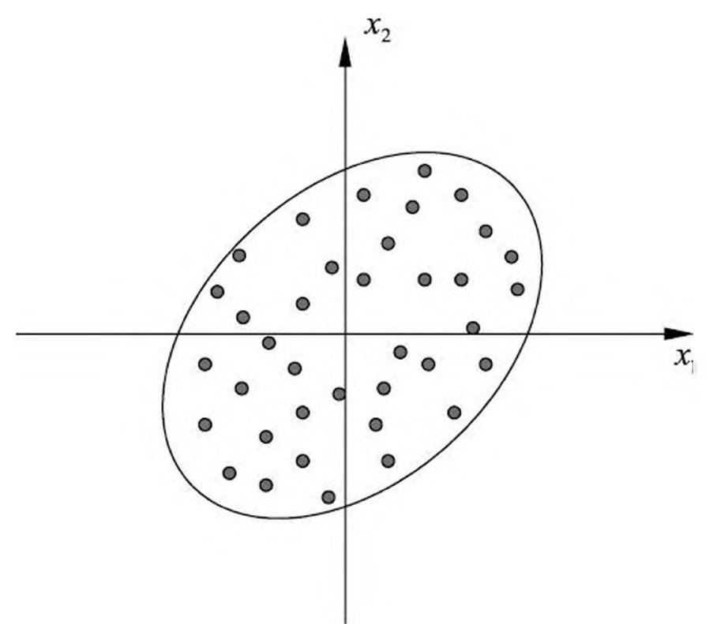
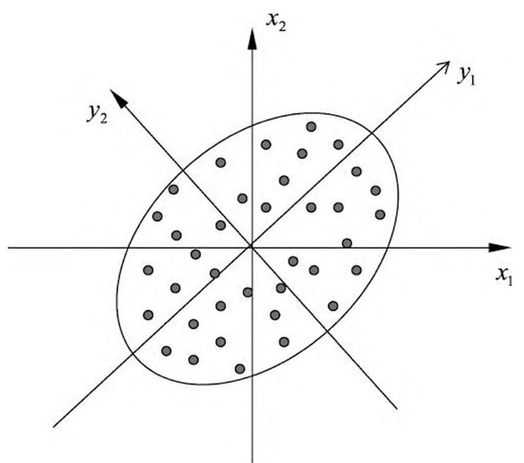
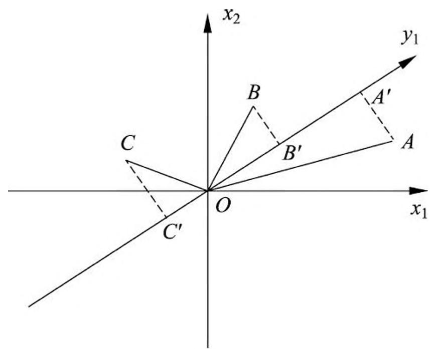
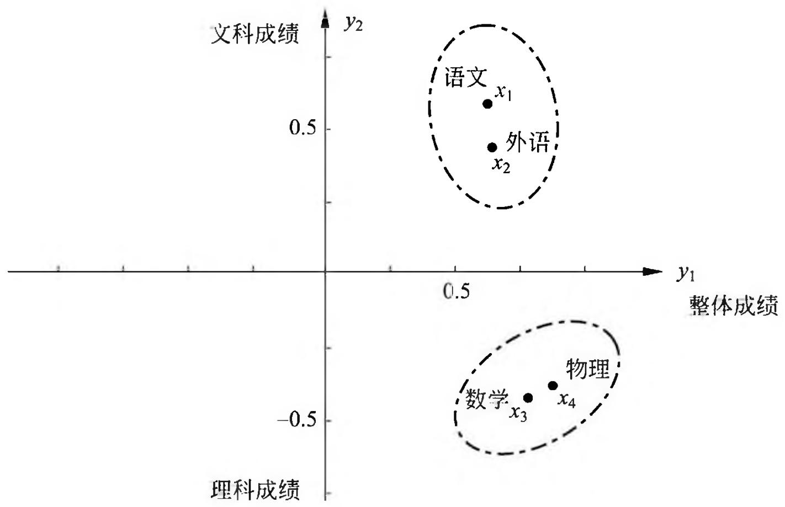

# 第 16 章 主成分分析

主成分分析（principal component analysis, PCA）是一种常用的无监督学习方法，这一方法利用正交变换把由线性相关变量表示的观测数据转换为少数几个由线性无关变量表示的数据，线性无关的变量称为主成分。主成分的个数通常小于原始变量的个数，所以主成分分析属于降维方法。主成分分析主要用于发现数据中的基本结构，即数据中变量之间的关系，是数据分析的有力工具，也用于其他机器学习方法的前处理。主成分分析属于多元统计分析的经典方法，首先由 Pearson 于 1901 年提出，但只是针对非随机变量，1933 年由 Hotelling 推广到随机变量。

本章 16.1 节介绍主成分分析的基本想法，叙述总体主成分分析的定义、定理与性质。16.2 节介绍样本主成分分析的概念，重点叙述主成分分析的算法，包括协方差矩阵的特征值分解方法和数据矩阵的奇异值分解方法。

## 16.1 总体主成分分析

## 16.1.1 基本想法

统计分析中，数据的变量之间可能存在相关性，以致增加了分析的难度。于是，考虑由少数不相关的变量来代替相关的变量，用来表示数据，并且要求能够保留数据中的大部分信息。

主成分分析中，首先对给定数据进行规范化，使得数据每一变量的平均值为 0，方差为 1。之后对数据进行正交变换，原来由线性相关变量表示的数据，通过正交变换变成由若干个线性无关的新变量表示的数据。新变量是可能的正交变换中变量的方差的和（信息保存）最大的，方差表示在新变量上信息的大小。将新变量依次称为第一主成分、第二主成分等。这就是主成分分析的基本思想。通过主成分分析，可以利用主成分近似地表示原始数据，这可理解为发现数据的“基本结构”；也可以把数据由少数主成分表示，这可理解为对数据降维。

下面给出主成分分析的直观解释。数据集合中的样本由实数空间（正交坐标系）

中的点表示，空间的一个坐标轴表示一个变量，规范化处理后得到的数据分布在原点附近。对原坐标系中的数据进行主成分分析等价于进行坐标系旋转变换，将数据投影到新坐标系的坐标轴上；新坐标系的第一坐标轴、第二坐标轴等分别表示第一主成分、第二主成分等，数据在每一轴上的坐标值的平方表示相应变量的方差；并且，这个坐标系是在所有可能的新的坐标系中，坐标轴上的方差的和最大的。

例如，数据由两个变量 $x_{1}$ 和 $x_{2}$ 表示，存在于二维空间中，每个点表示一个样本，如图 16.1(a) 所示。对数据已做规范化处理，可以看出，这些数据分布在以原点为中心的左下至右上倾斜的椭圆之内。很明显在这个数据中的变量 $x_{1}$ 和 $x_{2}$ 是线性相关的，具体地，当知道其中一个变量 $x_{1}$ 的取值时，对另一个变量 $x_{2}$ 的预测不是完全随机的；反之亦然。

主成分分析对数据进行正交变换，具体地，对原坐标系进行旋转变换，并将数据在新坐标系表示，如图 16.1(b)所示。数据在原坐标系由变量 $x_{1}$ 和 $x_{2}$ 表示，通过正交变换后，在新坐标系里，由变量 $y_{1}$ 和 $y_{2}$ 表示。主成分分析选择方差最大的方向（第一主成分）作为新坐标系的第一坐标轴，即 $y_{1}$ 轴，在这里意味着选择椭圆的长轴作为新坐标系的第一坐标轴；之后选择与第一坐标轴正交，且方差次之的方向（第二主成分）作为新坐标系的第二坐标轴，即 $y_{2}$ 轴，在这里意味着选择椭圆的短轴作为新坐标系的第二坐标轴。在新坐标系里，数据中的变量 $y_{1}$ 和 $y_{2}$ 是线性无关的，当知道其中一个变量 $y_{1}$ 的取值时，对另一个变量 $y_{2}$ 的预测是完全随机的；反之亦然．如果主成分分析只取第一主成分，即新坐标系的 $y_{1}$ 轴，那么等价于将数据投影在椭圆长轴上，用这个主轴表示数据，将二维空间的数据压缩到一维空间中。

> (a)

> (b) 图 16.1 主成分分析的示例

下面再看方差最大的解释。假设有两个变量 $x_{1}$ 和 $x_{2}$ ，三个样本点 $A, B, C$ ，样本分布在由 $x_{1}$ 和 $x_{2}$ 轴组成的坐标系中，如图 16.2 所示。对坐标系进行旋转变换，得到新的坐标轴 $y_{1}$ ，表示新的变量 $y_{1}$ 。样本点 $A, B, C$ 在 $y_{1}$ 轴上投影，得到 $y_{1}$ 轴的坐标值 $A', B', C'$ 。坐标值的平方和 $OA'^2 + OB'^2 + OC'^2$ 表示样本在变量 $y_{1}$ 上的方差和。主成分分析旨在选取正交变换中方差最大的变量，作为第一主成分，也就是旋转变换中坐标值的平方和最大的轴。注意到旋转变换中样本点到原点的距离的平方和 $OA^2 + OB^2 + OC^2$ 保持不变，根据勾股定理，坐标值的平方和 $OA'^2 + OB'^2 + OC'^2$ 最大等价于样本点到 $y_{1}$ 轴的距离的平方和 $AA'^2 + BB'^2 + CC'^2$ 最小。所以，等价地，主成分分析在旋转变换中选取离样本点的距离平方和最小的轴，作为第一主成分。第二主成分等的选取，在保证与已选坐标轴正交的条件下，类似地进行。

> 图 16.2 主成分的几何解释

在数据总体（population）上进行的主成分分析称为总体主成分分析，在有限样本上进行的主成分分析称为样本主成分分析，前者是后者的基础。以下分别予以介绍。

## 16.1.2 定义和导出

假设 $\pmb{x} = (x_{1}, x_{2}, \dots, x_{m})^{\mathrm{T}}$ 是 $m$ 维随机变量，其均值向量是 $\pmb{\mu}$

$$
\pmb {\mu} = E (\pmb {x}) = \left(\mu_ {1}, \mu_ {2}, \dots , \mu_ {m}\right) ^ {\mathrm {T}}
$$

协方差矩阵是 $\Sigma$

$$
\Sigma = \operatorname {c o v} (\pmb {x}, \pmb {x}) = E [ (\pmb {x} - \pmb {\mu}) (\pmb {x} - \pmb {\mu}) ^ {\mathrm {T}} ]
$$

考虑由 $m$ 维随机变量 $\pmb{x}$ 到 $m$ 维随机变量 $\pmb{y} = (y_{1}, y_{2}, \dots, y_{m})^{\mathrm{T}}$ 的线性变换

$$
y _ {i} = \alpha_ {i} ^ {\mathrm {T}} \boldsymbol {x} = \alpha_ {1 i} x _ {1} + \alpha_ {2 i} x _ {2} + \dots + \alpha_ {m i} x _ {m} \tag {16.1}
$$

其中 $\alpha_{i}^{\mathrm{T}} = (\alpha_{1i},\alpha_{2i},\dots ,\alpha_{mi})$ ， $i = 1,2,\dots ,m$ 。

由随机变量的性质可知，

$$
E \left(y _ {i}\right) = \alpha_ {i} ^ {\mathrm {T}} \mu , \quad i = 1, 2, \dots , m \tag {16.2}
$$

$$
\operatorname {v a r} \left(y _ {i}\right) = \alpha_ {i} ^ {\mathrm {T}} \Sigma \alpha_ {i}, \quad i = 1, 2, \dots , m \tag {16.3}
$$

$$
\operatorname {c o v} \left(y _ {i}, y _ {j}\right) = \alpha_ {i} ^ {\mathrm {T}} \Sigma \alpha_ {j}, \quad i = 1, 2, \dots , m; \quad j = 1, 2, \dots , m \tag {16.4}
$$

下面给出总体主成分的定义。

定义 16.1（总体主成分） 给定一个如式(16.1)所示的线性变换，如果它们满足下列条件：

(1) 系数向量 $\alpha_{i}^{\mathrm{T}}$ 是单位向量，即 $\alpha_{i}^{\mathrm{T}}\alpha_{i} = 1, i = 1,2,\dots,m;$（2）变量 $y_{i}$ 与 $y_{j}$ 互不相关，即 $\operatorname{cov}(y_i, y_j) = 0 (i \neq j)$（3）变量 $y_{1}$ 是 $x$ 的所有线性变换中方差最大的； $y_{2}$ 是与 $y_{1}$ 不相关的 $x$ 的所有线性变换中方差最大的；一般地， $y_{i}$ 是与 $y_{1}, y_{2}, \dots, y_{i-1} (i = 1, 2, \dots, m)$ 都不相关的 $x$ 的所有线性变换中方差最大的；这时分别称 $y_{1}, y_{2}, \dots, y_{m}$ 为 $x$ 的第一主成分、第二主成分、…、第 $m$ 主成分。

定义中的条件(1)表明线性变换是正交变换， $\alpha_{1},\alpha_{2},\dots ,\alpha_{m}$ 是其一组标准正交基，

$$
\alpha_ {i} ^ {\mathrm {T}} \alpha_ {j} = \left\{ \begin{array}{l l} 1, & i = j \\ 0, & i \neq j \end{array} \right.
$$

条件（2）（3）给出了一个求主成分的方法：第一步，在 $\pmb{x}$ 的所有线性变换

$$
\alpha_ {1} ^ {\mathrm {T}} \boldsymbol {x} = \sum_ {i = 1} ^ {m} \alpha_ {i 1} x _ {i}
$$

中，在 $\alpha_{1}^{\mathrm{T}}\alpha_{1} = 1$ 条件下，求方差最大的，得到 $\pmb{x}$ 的第一主成分；第二步，在与 $\alpha_{1}^{\mathrm{T}}\pmb{x}$ 不相关的 $\pmb{x}$ 的所有线性变换

$$
\alpha_ {2} ^ {\mathrm {T}} \boldsymbol {x} = \sum_ {i = 1} ^ {m} \alpha_ {i 2} x _ {i}
$$

中，在 $\alpha_{2}^{\mathrm{T}}\alpha_{2} = 1$ 条件下，求方差最大的，得到 $\pmb{x}$ 的第二主成分；第 $k$ 步，在与 $\alpha_{1}^{\mathrm{T}}\pmb {x},\alpha_{2}^{\mathrm{T}}\pmb {x},\dots ,\alpha_{k - 1}^{\mathrm{T}}\pmb{x}$ 不相关的 $\pmb{x}$ 的所有线性变换

$$
\alpha_ {k} ^ {\mathrm {T}} \boldsymbol {x} = \sum_ {i = 1} ^ {m} \alpha_ {i k} x _ {i}
$$

中，在 $\alpha_{k}^{\mathrm{T}}\alpha_{k} = 1$ 条件下，求方差最大的，得到 $\pmb{x}$ 的第 $k$ 主成分；如此继续下去，直到得到 $\pmb{x}$ 的第 $m$ 主成分。

## 16.1.3 主要性质

首先叙述一个关于总体主成分的定理。这一定理阐述了总体主成分与协方差矩阵的特征值和特征向量的关系，同时给出了一个求主成分的方法。

定理 16.1 设 $\pmb{x}$ 是 $m$ 维随机变量， $\Sigma$ 是 $\pmb{x}$ 的协方差矩阵， $\Sigma$ 的特征值分别是 $\lambda_1 \geqslant \lambda_2 \geqslant \dots \geqslant \lambda_m \geqslant 0$ ，特征值对应的单位特征向量分别是 $\alpha_1, \alpha_2, \dots, \alpha_m$ ，则 $\pmb{x}$ 的第 $k$ 主成分是

$$
y _ {k} = \alpha_ {k} ^ {\mathrm {T}} \boldsymbol {x} = \alpha_ {1 k} x _ {1} + \alpha_ {2 k} x _ {2} + \dots + \alpha_ {m k} x _ {m}, \quad k = 1, 2, \dots , m \tag {16.5}
$$

$\pmb{x}$ 的第 $k$ 主成分的方差是

$$
\operatorname {v a r} \left(y _ {k}\right) = \alpha_ {k} ^ {\mathrm {T}} \Sigma \alpha_ {k} = \lambda_ {k}, \quad k = 1, 2, \dots , m \tag {16.6}
$$

即协方差矩阵 $\Sigma$ 的第 $k$ 个特征值。① 证明 采用拉格朗日乘子法求出主成分。

> - ① 若特征值有重根，对应的特征向量组成 $m$ 维空间 $\mathbf{R}^m$ 的一个子空间，子空间的维数等于重根数，在子空间任取一个正交坐标系，这个坐标系的单位向量就可作为特征向量。这时坐标系的取法不唯一。

首先求 $\pmb{x}$ 的第一主成分 $y_{1} = \alpha_{1}^{\mathrm{T}}\pmb{x}$ ，即求系数向量 $\alpha_{1}$ 。由定义 16.1 知，第一主成分的 $\alpha_{1}$ 是在 $\alpha_{1}^{\mathrm{T}}\alpha_{1} = 1$ 条件下， $\pmb{x}$ 的所有线性变换中使方差

$$
\operatorname {v a r} \left(\alpha_ {1} ^ {\mathrm {T}} \boldsymbol {x}\right) = \alpha_ {1} ^ {\mathrm {T}} \Sigma \alpha_ {1}
$$

达到最大的。

求第一主成分就是求解约束最优化问题：

$$
\max  _ {\alpha_ {1}} \quad \alpha_ {1} ^ {\mathrm {T}} \Sigma \alpha_ {1} \tag {16.7}
$$

$$
\begin{array}{l l} \text {s . t .} & \alpha_ {1} ^ {\mathrm {T}} \alpha_ {1} = 1 \end{array}
$$

定义拉格朗日函数

$$
\alpha_ {1} ^ {\mathrm {T}} \Sigma \alpha_ {1} - \lambda \left(\alpha_ {1} ^ {\mathrm {T}} \alpha_ {1} - 1\right)
$$

其中 $\lambda$ 是拉格朗日乘子。将拉格朗日函数对 $\alpha_{1}$ 求导，并令其为 0，得

$$
\Sigma \alpha_ {1} - \lambda \alpha_ {1} = 0
$$

因此， $\lambda$ 是 $\Sigma$ 的特征值， $\alpha_{1}$ 是对应的单位特征向量。于是，目标函数

$$
\alpha_ {1} ^ {\mathrm {T}} \Sigma \alpha_ {1} = \alpha_ {1} ^ {\mathrm {T}} \lambda \alpha_ {1} = \lambda \alpha_ {1} ^ {\mathrm {T}} \alpha_ {1} = \lambda
$$

假设 $\alpha_{1}$ 是 $\Sigma$ 的最大特征值 $\lambda_{1}$ 对应的单位特征向量，显然 $\alpha_{1}$ 与 $\lambda_{1}$ 是最优化问题的解 ①。所以， $\alpha_{1}^{\mathrm{T}}x$ 构成第一主成分，其方差等于协方差矩阵的最大特征值

> - ① 为了叙述方便，这里将变量和其最优值用同一符号表示。

$$
\operatorname {v a r} \left(\alpha_ {1} ^ {\mathrm {T}} \boldsymbol {x}\right) = \alpha_ {1} ^ {\mathrm {T}} \Sigma \alpha_ {1} = \lambda_ {1} \tag {16.8}
$$

接着求 $\pmb{x}$ 的第二主成分 $y_{2} = \alpha_{2}^{\mathrm{T}}\pmb{x}$ 。第二主成分的 $\alpha_{2}$ 是在 $\alpha_{2}^{\mathrm{T}}\alpha_{2} = 1$ ，且 $\alpha_{2}^{\mathrm{T}}\pmb{x}$ 与 $\alpha_{1}^{\mathrm{T}}\pmb{x}$ 不相关的条件下， $\pmb{x}$ 的所有线性变换中使方差

$$
\operatorname {v a r} \left(\alpha_ {2} ^ {\mathrm {T}} \boldsymbol {x}\right) = \alpha_ {2} ^ {\mathrm {T}} \Sigma \alpha_ {2}
$$

达到最大的。

求第二主成分需要求解约束最优化问题

$$
\max  _ {\alpha_ {2}} \quad \alpha_ {2} ^ {\mathrm {T}} \Sigma \alpha_ {2} \tag {16.9}
$$

$$
\begin{array}{l} s. t. \quad \alpha_ {1} ^ {\mathrm {T}} \Sigma \alpha_ {2} = 0, \quad \alpha_ {2} ^ {\mathrm {T}} \Sigma \alpha_ {1} = 0 \\ \alpha_ {2} ^ {\mathrm {T}} \alpha_ {2} = 1 \\ \end{array}
$$

注意到

$$
\alpha_ {1} ^ {\mathrm {T}} \Sigma \alpha_ {2} = \alpha_ {2} ^ {\mathrm {T}} \Sigma \alpha_ {1} = \alpha_ {2} ^ {\mathrm {T}} \lambda_ {1} \alpha_ {1} = \lambda_ {1} \alpha_ {2} ^ {\mathrm {T}} \alpha_ {1} = \lambda_ {1} \alpha_ {1} ^ {\mathrm {T}} \alpha_ {2}
$$

以及

$$
\alpha_ {1} ^ {\mathrm {T}} \alpha_ {2} = 0, \qquad \alpha_ {2} ^ {\mathrm {T}} \alpha_ {1} = 0
$$

定义拉格朗日函数

$$
\alpha_ {2} ^ {\mathrm {T}} \Sigma \alpha_ {2} - \lambda (\alpha_ {2} ^ {\mathrm {T}} \alpha_ {2} - 1) - \phi \alpha_ {2} ^ {\mathrm {T}} \alpha_ {1}
$$

其中 $\lambda, \phi$ 是拉格朗日乘子。对 $\alpha_{2}$ 求导，并令其为 0，得

$$
2 \Sigma \alpha_ {2} - 2 \lambda \alpha_ {2} - \phi \alpha_ {1} = 0 \tag {16.10}
$$

将方程左乘以 $\alpha_{1}^{\mathrm{T}}$ 有

$$
2 \alpha_ {1} ^ {\mathrm {T}} \Sigma \alpha_ {2} - 2 \lambda \alpha_ {1} ^ {\mathrm {T}} \alpha_ {2} - \phi \alpha_ {1} ^ {\mathrm {T}} \alpha_ {1} = 0
$$

此式前两项为 0，且 $\alpha_{1}^{\mathrm{T}}\alpha_{1} = 1$ ，导出 $\phi = 0$ ，因此式(16.10)成为

$$
\Sigma \alpha_ {2} - \lambda \alpha_ {2} = 0
$$

由此， $\lambda$ 是 $\Sigma$ 的特征值， $\alpha_{2}$ 是对应的单位特征向量。于是，目标函数

$$
\alpha_ {2} ^ {\mathrm {T}} \Sigma \alpha_ {2} = \alpha_ {2} ^ {\mathrm {T}} \lambda \alpha_ {2} = \lambda \alpha_ {2} ^ {\mathrm {T}} \alpha_ {2} = \lambda
$$

假设 $\alpha_{2}$ 是 $\Sigma$ 的第二大特征值 $\lambda_{2}$ 对应的单位特征向量，显然 $\alpha_{2}$ 与 $\lambda_{2}$ 是以上最优化问题的解 ①。于是 $\alpha_{2}^{\mathrm{T}}\pmb{x}$ 构成第二主成分，其方差等于协方差矩阵的第二大特征值，

> - ① 为了叙述方便，这里将变量和其最优值用同一符号表示。

$$
\operatorname {v a r} \left(\alpha_ {2} ^ {\mathrm {T}} \boldsymbol {x}\right) = \alpha_ {2} ^ {\mathrm {T}} \Sigma \alpha_ {2} = \lambda_ {2} \tag {16.11}
$$

一般地， $\pmb{x}$ 的第 $k$ 主成分是 $\alpha_{k}^{\mathrm{T}}\pmb{x}$ ，并且 $\operatorname{var}(\alpha_k^{\mathrm{T}}\pmb{x}) = \lambda_k$ ，这里 $\lambda_{k}$ 是 $\Sigma$ 的第 $k$ 个特征值并且 $\alpha_{k}$ 是对应的单位特征向量。可以从个第 $k - 1$ 主成分出发递推证明第 $k$ 个主成分的情况，这里省去。

按照上述方法求得第一、第二、直到第 $m$ 主成分，其系数向量 $\alpha_{1},\alpha_{2},\dots ,\alpha_{m}$ 分别是 $\Sigma$ 的第一个、第二个、直到第 $m$ 个单位特征向量， $\lambda_1,\lambda_2,\dots ,\lambda_m$ 分别是对应的特征值。并且，第 $k$ 主成分的方差等于 $\Sigma$ 的第 $k$ 个特征值，

$$
\operatorname {v a r} \left(\alpha_ {k} ^ {\mathrm {T}} \boldsymbol {x}\right) = \alpha_ {k} ^ {\mathrm {T}} \Sigma \alpha_ {k} = \lambda_ {k}, \quad k = 1, 2, \dots , m \tag {16.12}
$$

定理证毕。

由定理 16.1 得到推论 16.1 $m$ 维随机变量 $\pmb{y} = (y_{1}, y_{2}, \dots, y_{m})^{\mathrm{T}}$ 的分量依次是 $\pmb{x}$ 的第一主成分到第 $m$ 主成分的充要条件是：

(1) $\pmb{y} = A^{\mathrm{T}}\pmb{x}$ , $A$ 为正交矩阵

$$
A = \left[ \begin{array}{c c c c} \alpha_ {1 1} & \alpha_ {1 2} & \dots & \alpha_ {1 m} \\ \alpha_ {2 1} & \alpha_ {2 2} & \dots & \alpha_ {2 m} \\ \vdots & \vdots & & \vdots \\ \alpha_ {m 1} & \alpha_ {m 2} & \dots & \alpha_ {m m} \end{array} \right]
$$

(2) $\pmb{y}$ 的协方差矩阵为对角矩阵

$$
\operatorname {c o v} (\pmb {y}) = \operatorname {d i a g} (\lambda_ {1}, \lambda_ {2}, \dots , \lambda_ {m})
$$

$$
\lambda_ {1} \geqslant \lambda_ {2} \geqslant \dots \geqslant \lambda_ {m}
$$

其中 $\lambda_{k}$ 是 $\Sigma$ 的第 $k$ 个特征值， $\alpha_{k}$ 是对应的单位特征向量， $k = 1,2,\dots,m$ 。

以上证明中， $\lambda_{k}$ 是 $\Sigma$ 的第 $k$ 个特征值， $\alpha_{k}$ 是对应的单位特征向量，即

$$
\Sigma \alpha_ {k} = \lambda_ {k} \alpha_ {k}, \quad k = 1, 2, \dots , m \tag {16.13}
$$

用矩阵表示即为

$$
\Sigma A = A \Lambda \tag {16.14}
$$

这里 $A = [\alpha_{ij}]_{m\times m}$ ， $\varLambda$ 是对角矩阵，其第 $k$ 个对角元素是 $\lambda_{k}$ 。因为 $A$ 是正交矩阵，即 $A^{\mathrm{T}}A = AA^{\mathrm{T}} = I$ ，由式(16.14）得到两个公式

$$
A ^ {\mathrm {T}} \Sigma A = \Lambda \tag {16.15}
$$

和

$$
\Sigma = A \Lambda A ^ {\mathrm {T}} \tag {16.16}
$$

下面叙述总体主成分的性质：

（1）总体主成分 $\pmb{y}$ 的协方差矩阵是对角矩阵

$$
\operatorname {c o v} (\boldsymbol {y}) = \Lambda = \operatorname {d i a g} \left(\lambda_ {1}, \lambda_ {2}, \dots , \lambda_ {m}\right) \tag {16.17}
$$

（2）总体主成分 $\pmb{y}$ 的方差之和等于随机变量 $\pmb{x}$ 的方差之和，即

$$
\sum_ {i = 1} ^ {m} \lambda_ {i} = \sum_ {i = 1} ^ {m} \sigma_ {i i} \tag {16.18}
$$

其中 $\sigma_{ii}$ 是随机变量 $x_{i}$ 的方差，即协方差矩阵 $\Sigma$ 的对角元素。事实上，利用式(16.16)及矩阵的迹（trace）的性质，可知

$$
\begin{array}{l} \sum_ {i = 1} ^ {m} \operatorname {v a r} \left(x _ {i}\right) = \operatorname {t r} \left(\Sigma^ {\mathrm {T}}\right) = \operatorname {t r} \left(A \Lambda A ^ {\mathrm {T}}\right) = \operatorname {t r} \left(A ^ {\mathrm {T}} \Lambda A\right) \\ = \operatorname {t r} (\Lambda) = \sum_ {i = 1} ^ {m} \lambda_ {i} = \sum_ {i = 1} ^ {m} \operatorname {v a r} \left(y _ {i}\right) \tag {16.19} \\ \end{array}
$$

（3）第 $k$ 个主成分 $y_{k}$ 与变量 $x_{i}$ 的相关系数 $\rho (y_k,x_i)$ 称为因子负荷量（factor loading），它表示第 $k$ 个主成分 $y_{k}$ 与变量 $x_{i}$ 的相关关系。计算公式是

$$
\rho \left(y _ {k}, x _ {i}\right) = \frac {\sqrt {\lambda_ {k}} \alpha_ {i k}}{\sqrt {\sigma_ {i i}}}, \quad k, i = 1, 2, \dots , m \tag {16.20}
$$

因为

$$
\rho (y _ {k}, x _ {i}) = \frac {\operatorname {c o v} (y _ {k} , x _ {i})}{\sqrt {\operatorname {v a r} (y _ {k}) \operatorname {v a r} (x _ {i})}} = \frac {\operatorname {c o v} (\alpha_ {k} ^ {\mathrm {T}} \pmb {x} , e _ {i} ^ {\mathrm {T}} \pmb {x})}{\sqrt {\lambda_ {k}} \sqrt {\sigma_ {i i}}}
$$

其中 $e_i$ 为基本单位向量，其第 $i$ 个分量为 1，其余为 0。再由协方差的性质

$$
\operatorname {c o v} \left(\alpha_ {k} ^ {\mathrm {T}} \boldsymbol {x}, e _ {i} ^ {\mathrm {T}} \boldsymbol {x}\right) = \alpha_ {k} ^ {\mathrm {T}} \Sigma e _ {i} = e _ {i} ^ {\mathrm {T}} \Sigma \alpha_ {k} = \lambda_ {k} e _ {i} ^ {\mathrm {T}} \alpha_ {k} = \lambda_ {k} \alpha_ {i k}
$$

故得式 (16.20)。

（4）第 $k$ 个主成分 $y_{k}$ 与 $m$ 个变量的因子负荷量满足

$$
\sum_ {i = 1} ^ {m} \sigma_ {i i} \rho^ {2} \left(y _ {k}, x _ {i}\right) = \lambda_ {k} \tag {16.21}
$$

由式 (16.20) 有

$$
\sum_ {i = 1} ^ {m} \sigma_ {i i} \rho^ {2} (y _ {k}, x _ {i}) = \sum_ {i = 1} ^ {m} \lambda_ {k} \alpha_ {i k} ^ {2} = \lambda_ {k} \alpha_ {k} ^ {\mathrm {T}} \alpha_ {k} = \lambda_ {k}
$$

(5) $m$ 个主成分与第 $i$ 个变量 $x_{i}$ 的因子负荷量满足

$$
\sum_ {k = 1} ^ {m} \rho^ {2} \left(y _ {k}, x _ {i}\right) = 1 \tag {16.22}
$$

由于 $y_{1}, y_{2}, \dots, y_{m}$ 互不相关，故

$$
\rho^ {2} \left(x _ {i}, \left(y _ {1}, y _ {2}, \dots , y _ {m}\right)\right) = \sum_ {k = 1} ^ {m} \rho^ {2} \left(y _ {k}, x _ {i}\right)
$$

又因 $x_{i}$ 可以表为 $y_{1}, y_{2}, \dots, y_{m}$ 的线性组合，所以 $x_{i}$ 与 $y_{1}, y_{2}, \dots, y_{m}$ 的相关系数的平方为 1，即

$$
\rho^ {2} (x _ {i}, (y _ {1}, y _ {2}, \dots , y _ {m})) = 1
$$

故得式 (16.22)。

## 16.1.4 主成分的个数

主成分分析的主要目的是降维，所以一般选择 $k(k \ll m)$ 个主成分（线性无关变量）来代替 $m$ 个原有变量（线性相关变量），使问题得以简化，并能保留原有变量的大部分信息。这里所说的信息是指原有变量的方差。为此，先给出一个定理，说明选择 $k$ 个主成分是最优选择。

定理 16.2 对任意正整数 $q$ ， $1\leqslant q\leqslant m$ ，考虑正交线性变换

$$
\boldsymbol {y} = B ^ {\mathrm {T}} \boldsymbol {x} \tag {16.23}
$$

其中 $\pmb{y}$ 是 $q$ 维向量， $B^{\mathrm{T}}$ 是 $q \times m$ 矩阵，令 $\pmb{y}$ 的协方差矩阵为

$$
\Sigma_ {\boldsymbol {y}} = B ^ {\mathrm {T}} \Sigma B \tag {16.24}
$$

则 $\Sigma_{\pmb{y}}$ 的迹 $\operatorname {tr}(\Sigma_{\pmb{y}})$ 在 $B = A_{q}$ 时取得最大值，其中矩阵 $A_{q}$ 由正交矩阵 $A$ 的前 $q$ 列组成。

证明 令 $\beta_{k}$ 是 $B$ 的第 $k$ 列，由于正交矩阵 $A$ 的列构成 $m$ 维空间的基，所以 $\beta_{k}$ 可以由 $A$ 的列表示，即

$$
\beta_ {k} = \sum_ {j = 1} ^ {m} c _ {j k} \alpha_ {j}, \quad k = 1, 2, \dots , q
$$

等价地

$$
B = A C \tag {16.25}
$$

其中 $C$ 是 $m \times q$ 矩阵，其第 $j$ 行第 $k$ 列元素为 $c_{jk}$ 。

首先，

$$
B ^ {\mathrm {T}} \Sigma B = C ^ {\mathrm {T}} A ^ {\mathrm {T}} \Sigma A C = C ^ {\mathrm {T}} \Lambda C = \sum_ {j = 1} ^ {m} \lambda_ {j} c _ {j} c _ {j} ^ {\mathrm {T}}
$$

其中 $c_{j}^{\mathrm{T}}$ 是 $C$ 的第 $j$ 行。因此

$$
\begin{array}{l} \operatorname {t r} \left(B ^ {\mathrm {T}} \Sigma B\right) = \sum_ {j = 1} ^ {m} \lambda_ {j} \operatorname {t r} \left(c _ {j} c _ {j} ^ {\mathrm {T}}\right) \\ = \sum_ {j = 1} ^ {m} \lambda_ {j} \operatorname {t r} \left(c _ {j} ^ {\mathrm {T}} c _ {j}\right) \\ = \sum_ {j = 1} ^ {m} \lambda_ {j} c _ {j} ^ {\mathrm {T}} c _ {j} \\ = \sum_ {j = 1} ^ {m} \sum_ {k = 1} ^ {q} \lambda_ {j} c _ {j k} ^ {2} \tag {16.26} \\ \end{array}
$$

其次，由式(16.25)及 $A$ 的正交性知

$$
C = A ^ {\mathrm {T}} B
$$

由于 $A$ 是正交的， $B$ 的列是正交的，所以

$$
C ^ {\mathrm {T}} C = B ^ {\mathrm {T}} A A ^ {\mathrm {T}} B = B ^ {\mathrm {T}} B = I _ {q}
$$

即 $C$ 的列也是正交的。于是

$$
\operatorname {t r} \left(C ^ {\mathrm {T}} C\right) = \operatorname {t r} \left(I _ {q}\right)
$$

$$
\sum_ {j = 1} ^ {m} \sum_ {k = 1} ^ {q} c _ {j k} ^ {2} = q \tag {16.27}
$$

这样，矩阵 $C$ 可以认为是某个 $m$ 阶正交矩阵 $D$ 的前 $q$ 列。正交矩阵 $D$ 的行也正交，所以满足

$$
d _ {j} ^ {\mathrm {T}} d _ {j} = 1, \quad j = 1, 2, \dots , m
$$

其中 $d_j^{\mathrm{T}}$ 是 $D$ 的第 $j$ 行。由于矩阵 $D$ 的行包括矩阵 $C$ 的行的前 $q$ 个元素，所以

$$
c _ {j} ^ {\mathrm {T}} c _ {j} \leqslant 1, \quad j = 1, 2, \dots , m
$$

即

$$
\sum_ {k = 1} ^ {q} c _ {j k} ^ {2} \leqslant 1, \quad j = 1, 2, \dots , m \tag {16.28}
$$

注意到在式 (16.26) 中 $\sum_{k=1}^{q} c_{jk}^{2}$ 是 $\lambda_{j}$ 的系数，由式 (16.27) 这些系数之和是 $q$ ，且由式 (16.28) 知这些系数小于等于 1。因为 $\lambda_{1} \geqslant \lambda_{2} \geqslant \dots \geqslant \lambda_{q} \geqslant \dots \geqslant \lambda_{m}$ ，显然，当能找到 $c_{jk}$ 使得

$$
\sum_ {k = 1} ^ {q} c _ {j k} ^ {2} = \left\{ \begin{array}{l l} 1, & j = 1, \dots , q \\ 0, & j = q + 1, \dots , m \end{array} \right. \tag {16.29}
$$

时， $\sum_{j = 1}^{m}\left(\sum_{k = 1}^{q}c_{jk}^{2}\right)\lambda_{j}$ 最大。而当 $B = A_{q}$ 时，有

$$
c _ {j k} = \left\{ \begin{array}{l l} {{1,}} & {{1 \leqslant j = k \leqslant q}} \\ {{0,}} & {{\text {其 他}}} \end{array} \right.
$$

满足式 (16.29)。所以，当 $B = A_q$ 时， $\operatorname{tr}(\Sigma_y)$ 达到最大值。

定理 16.2 表明，当 $\pmb{x}$ 的线性变换 $\pmb{y}$ 在 $B = A_{q}$ 时，其协方差矩阵 $\Sigma_{\mathbf{y}}$ 的迹 $\operatorname{tr}(\Sigma_{\mathbf{y}})$ 取得最大值，这就是说，当取 $A$ 的前 $q$ 列取 $\pmb{x}$ 的前 $q$ 个主成分时，能够最大限度地保留原有变量方差的信息。

定理 16.3 考虑正交变换

$$
\boldsymbol {y} = B ^ {\mathrm {T}} \boldsymbol {x}
$$

这里 $B^{\mathrm{T}}$ 是 $p \times m$ 矩阵, $A$ 和 $\Sigma_{\mathbf{y}}$ 的定义与定理 16.2 相同, 则 $\operatorname{tr}(\Sigma_{\mathbf{y}})$ 在 $B = A_{p}$ 时取得最小值, 其中矩阵 $A_{p}$ 由 $A$ 的后 $p$ 列组成。

证明类似定理 16.2，有兴趣的读者可以自行证明。定理 16.3 可以理解为，当舍弃 $A$ 的后 $\pmb{p}$ 列，即舍弃变量 $\pmb{x}$ 的后 $\pmb{p}$ 个主成分时，原有变量的方差的信息损失最少。

以上两个定理可以作为选择 $k$ 个主成分的理论依据。具体选择 $k$ 的方法，通常利用方差贡献率。

定义 16.2 第 $k$ 主成分 $y_{k}$ 的方差贡献率定义为 $y_{k}$ 的方差与所有方差之和的比，记作 $\eta_{k}$

$$
\eta_ {k} = \frac {\lambda_ {k}}{\sum_ {i = 1} ^ {m} \lambda_ {i}} \tag {16.30}
$$

$k$ 个主成分 $y_{1}, y_{2}, \dots, y_{k}$ 的累计方差贡献率定义为 $k$ 个方差之和与所有方差之和的比

$$
\sum_ {i = 1} ^ {k} \eta_ {i} = \frac {\sum_ {i = 1} ^ {k} \lambda_ {i}}{\sum_ {i = 1} ^ {m} \lambda_ {i}} \tag {16.31}
$$

通常取 $k$ 使得累计方差贡献率达到规定的百分比以上，例如 $70\% \sim 80\%$ 以上。累计方差贡献率反映了主成分保留信息的比例，但它不能反映对某个原有变量 $x_{i}$ 保留信息的比例，这时通常利用 $k$ 个主成分 $y_{1}, y_{2}, \dots, y_{k}$ 对原有变量 $x_{i}$ 的贡献率。

定义 16.3 $k$ 个主成分 $y_{1}, y_{2}, \dots, y_{k}$ 对原有变量 $x_{i}$ 的贡献率定义为 $x_{i}$ 与 $(y_{1}, y_{2}, \dots, y_{k})$ 的相关系数的平方，记作 $\nu_{i}$

$$
\nu_ {i} = \rho^ {2} (x _ {i}, (y _ {1}, y _ {2}, \dots , y _ {k}))
$$

计算公式如下：

$$
\nu_ {i} = \rho^ {2} \left(x _ {i}, \left(y _ {1}, y _ {2}, \dots , y _ {k}\right)\right) = \sum_ {j = 1} ^ {k} \rho^ {2} \left(x _ {i}, y _ {j}\right) = \sum_ {j = 1} ^ {k} \frac {\lambda_ {j} \alpha_ {i j} ^ {2}}{\sigma_ {i i}} \tag {16.32}
$$

## 16.1.5 规范化变量的总体主成分

在实际问题中，不同变量可能有不同的量纲，直接求主成分有时会产生不合理的结果。为了消除这个影响，常常对各个随机变量实施规范化，使其均值为 0，方差为 1。

设 $\pmb{x} = (x_{1}, x_{2}, \dots, x_{m})^{\mathrm{T}}$ 为 $m$ 维随机变量， $x_{i}$ 为第 $i$ 个随机变量， $i = 1, 2, \dots, m$ ，令

$$
x _ {i} ^ {*} = \frac {x _ {i} - E \left(x _ {i}\right)}{\sqrt {\operatorname {v a r} \left(x _ {i}\right)}}, \quad i = 1, 2, \dots , m \tag {16.33}
$$

其中 $E(x_{i})$ ， $\operatorname {var}(x_i)$ 分别是随机变量 $x_{i}$ 的均值和方差，这时 $x_{i}^{*}$ 就是 $x_{i}$ 的规范化随机变量。

显然，规范化随机变量的协方差矩阵就是相关矩阵 $R$ 。主成分分析通常在规范化随机变量的协方差矩阵即相关矩阵上进行。

对照总体主成分的性质可知，规范化随机变量的总体主成分有以下性质：

（1）规范化变量主成分的协方差矩阵是

$$
\Lambda^ {*} = \operatorname {d i a g} \left(\lambda_ {1} ^ {*}, \lambda_ {2} ^ {*}, \dots , \lambda_ {m} ^ {*}\right) \tag {16.34}
$$

其中 $\lambda_1^* \geqslant \lambda_2^* \geqslant \dots \geqslant \lambda_m^* \geqslant 0$ 为相关矩阵 $R$ 的特征值。

（2）协方差矩阵的特征值之和为 $m$

$$
\sum_ {k = 1} ^ {m} \lambda_ {k} ^ {*} = m \tag {16.35}
$$

（3）规范化随机变量 $x_{i}^{*}$ 与主成分 $y_{k}^{*}$ 的相关系数（因子负荷量）为

$$
\rho \left(y _ {k} ^ {*}, x _ {i} ^ {*}\right) = \sqrt {\lambda_ {k} ^ {*}} e _ {i k} ^ {*}, \quad k, i = 1, 2, \dots , m \tag {16.36}
$$

其中 $e_k^* = (e_{1k}^*, e_{2k}^*, \dots, e_{mk}^*)^\mathrm{T}$ 为矩阵 $R$ 对应于特征值 $\lambda_k^*$ 的单位特征向量。

（4）所有规范化随机变量 $x_{i}^{*}$ 与主成分 $y_{k}^{*}$ 的相关系数的平方和等于 $\lambda_{k}^{*}$

$$
\sum_ {i = 1} ^ {m} \rho^ {2} \left(y _ {k} ^ {*}, x _ {i} ^ {*}\right) = \sum_ {i = 1} ^ {m} \lambda_ {k} ^ {*} e _ {i k} ^ {* 2} = \lambda_ {k} ^ {*}, \quad k = 1, 2, \dots , m \tag {16.37}
$$

（5）规范化随机变量 $x_{i}^{*}$ 与所有主成分 $y_{k}^{*}$ 的相关系数的平方和等于 1

$$
\sum_ {k = 1} ^ {m} \rho^ {2} \left(y _ {k} ^ {*}, x _ {i} ^ {*}\right) = \sum_ {k = 1} ^ {m} \lambda_ {k} ^ {*} e _ {i k} ^ {* 2} = 1, \quad i = 1, 2, \dots , m \tag {16.38}
$$

## 16.2 样本主成分分析

16.1 节叙述了总体主成分分析, 是定义在样本总体上的。在实际问题中, 需要在观测数据上进行主成分分析, 这就是样本主成分分析。有了总体主成分的概念, 容易理解样本主成分的概念。样本主成分也和总体主成分具有相同的性质。所以本节重点叙述样本主成分的算法

## 16.2.1 样本主成分的定义和性质

假设对 $m$ 维随机变量 $\pmb{x} = (x_{1}, x_{2}, \dots, x_{m})^{\mathrm{T}}$ 进行 $n$ 次独立观测， $\pmb{x}_{1}, \pmb{x}_{2}, \dots, \pmb{x}_{n}$ 表示观测样本，其中 $\pmb{x}_{j} = (x_{1j}, x_{2j}, \dots, x_{mj})^{\mathrm{T}}$ 表示第 $j$ 个观测样本， $x_{ij}$ 表示第 $j$ 个观测样本的第 $i$ 个变量， $j = 1, 2, \dots, n$ 。观测数据用样本矩阵 $\pmb{X}$ 表示，记作

$$
X = \left[ \begin{array}{l l l l} \boldsymbol {x} _ {1} & \boldsymbol {x} _ {2} & \dots & \boldsymbol {x} _ {n} \end{array} \right] = \left[ \begin{array}{c c c c} x _ {1 1} & x _ {1 2} & \dots & x _ {1 n} \\ x _ {2 1} & x _ {2 2} & \dots & x _ {2 n} \\ \vdots & \vdots & & \vdots \\ x _ {m 1} & x _ {m 2} & \dots & x _ {m n} \end{array} \right] \tag {16.39}
$$

给定样本矩阵 $X$ ，可以估计样本均值，以及样本协方差。样本均值向量 $\overline{x}$ 为

$$
\bar {x} = \frac {1}{n} \sum_ {j = 1} ^ {n} x _ {j} \tag {16.40}
$$

样本协方差矩阵 $S$ 为

$$
S = \left[ s _ {i j} \right] _ {m \times m}
$$

$$
s _ {i j} = \frac {1}{n - 1} \sum_ {k = 1} ^ {n} (x _ {i k} - \bar {x} _ {i}) (x _ {j k} - \bar {x} _ {j}), \quad i, j = 1, 2, \dots , m \tag {16.41}
$$

其中 $\bar{x}_i = \frac{1}{n}\sum_{k=1}^{n}x_{ik}$ 为第 $i$ 个变量的样本均值， $\bar{x}_j = \frac{1}{n}\sum_{k=1}^{n}x_{jk}$ 为第 $j$ 个变量的样本均值。

样本相关矩阵 $R$ 为

$$
R = [ r _ {i j} ] _ {m \times m}, \quad r _ {i j} = \frac {s _ {i j}}{\sqrt {s _ {i i} s _ {j j}}}, \quad i, j = 1, 2, \dots , m \qquad \qquad (1 6. 4 2)
$$

定义 $m$ 维向量 $\pmb{x} = (x_{1}, x_{2}, \dots, x_{m})^{\mathrm{T}}$ 到 $m$ 维向量 $\pmb{y} = (y_{1}, y_{2}, \dots, y_{m})^{\mathrm{T}}$ 的线性变换

$$
\boldsymbol {y} = A ^ {\mathrm {T}} \boldsymbol {x} \tag {16.43}
$$

其中

$$
\begin{array}{l} A = \left[ \begin{array}{l l l l} a _ {1} & a _ {2} & \dots & a _ {m} \end{array} \right] = \left[ \begin{array}{l l l l} a _ {1 1} & a _ {1 2} & \dots & a _ {1 m} \\ a _ {2 1} & a _ {2 2} & \dots & a _ {2 m} \\ \vdots & \vdots & & \vdots \\ a _ {m 1} & a _ {m 2} & \dots & a _ {m m} \end{array} \right] \\ a _ {i} = \left(a _ {1 i}, a _ {2 i}, \dots , a _ {m i}\right) ^ {\mathrm {T}}, \quad i = 1, 2, \dots , m \\ \end{array}
$$

考虑式 (16.43) 的任意一个线性变换

$$
\boldsymbol {y} _ {i} = a _ {i} ^ {\mathrm {T}} \boldsymbol {x} = a _ {1 i} \boldsymbol {x} _ {1} + a _ {2 i} \boldsymbol {x} _ {2} + \dots + a _ {m i} \boldsymbol {x} _ {m}, \quad i = 1, 2, \dots , m \tag {16.44}
$$

其中 $y_{i}$ 是 $m$ 维向量 $\pmb{y}$ 的第 $i$ 个变量，相应于容量为 $n$ 的样本 $\pmb{x}_1, \pmb{x}_2, \dots, \pmb{x}_n, y_i$ 的样本均值 $\bar{y}_i$ 为

$$
\bar {y} _ {i} = \frac {1}{n} \sum_ {j = 1} ^ {n} a _ {i} ^ {\mathrm {T}} \boldsymbol {x} _ {j} = a _ {i} ^ {\mathrm {T}} \bar {\boldsymbol {x}} \tag {16.45}
$$

其中 $\bar{\pmb{x}}$ 是随机向量 $\pmb{x}$ 的样本均值

$$
\bar {\boldsymbol {x}} = \frac {1}{n} \sum_ {j = 1} ^ {n} \boldsymbol {x} _ {j}
$$

$y_{i}$ 的样本方差 $\operatorname {var}(y_i)$ 为

$$
\begin{array}{l} \operatorname {v a r} \left(y _ {i}\right) = \frac {1}{n - 1} \sum_ {j = 1} ^ {n} \left(a _ {i} ^ {\mathrm {T}} \boldsymbol {x} _ {j} - a _ {i} ^ {\mathrm {T}} \bar {\boldsymbol {x}}\right) ^ {2} \\ = a _ {i} ^ {\mathrm {T}} \left[ \frac {1}{n - 1} \sum_ {j = 1} ^ {n} \left(\boldsymbol {x} _ {j} - \bar {\boldsymbol {x}}\right) \left(\boldsymbol {x} _ {j} - \bar {\boldsymbol {x}}\right) ^ {\mathrm {T}} \right] a _ {i} = a _ {i} ^ {\mathrm {T}} S a _ {i} \tag {16.46} \\ \end{array}
$$

对任意两个线性变换 $y_{i} = \alpha_{i}^{\mathrm{T}}\pmb {x},y_{k} = \alpha_{k}^{\mathrm{T}}\pmb{x}$ ，相应于容量为 $n$ 的样本 $\pmb {x}_1,\pmb {x}_2,\dots ,\pmb {x}_n$ $y_{i},y_{k}$ 的样本协方差为

$$
\operatorname {c o v} \left(y _ {i}, y _ {k}\right) = a _ {i} ^ {\mathrm {T}} S a _ {k} \tag {16.47}
$$

现在给出样本主成分的定义。

定义 16.4（样本主成分）给定样本矩阵 $\pmb{X}$ 。样本第一主成分 $y_{1} = a_{1}^{\mathrm{T}}\pmb{x}$ 是在 $a_1^{\mathrm{T}}a_1 = 1$ 条件下，使得 $a_1^{\mathrm{T}}x_j(j = 1,2,\dots ,n)$ 的样本方差 $a_1^{\mathrm{T}}Sa_1$ 最大的 $\pmb{x}$ 的线性变换；样本第二主成分 $y_{2} = a_{2}^{\mathrm{T}}x$ 是在 $a_2^{\mathrm{T}}a_2 = 1$ 和 $a_2^{\mathrm{T}}x_j$ 与 $a_1^{\mathrm{T}}x_j(j = 1,2,\dots ,n)$ 的样本协方差 $a_1^{\mathrm{T}}Sa_2 = 0$ 条件下，使得 $a_2^{\mathrm{T}}x_j(j = 1,2,\dots ,n)$ 的样本方差 $a_2^{\mathrm{T}}Sa_2$ 最大的 $\pmb{x}$ 的线性变换；一般地，样本第 $i$ 主成分 $y_{i} = a_{i}^{\mathrm{T}}x$ 是在 $a_i^{\mathrm{T}}a_i = 1$ 和 $a_i^{\mathrm{T}}x_j$ 与 $a_k^{\mathrm{T}}x_j(k < i,j = 1,2,\dots ,n)$ 的样本协方差 $a_k^{\mathrm{T}}Sa_i = 0$ 条件下，使得 $a_i^{\mathrm{T}}x_j(j = 1,2,\dots ,n)$ 的样本方差 $a_i^{\mathrm{T}}Sa_i$ 最大的 $\pmb{x}$ 的线性变换。

样本主成分与总体主成分具有同样的性质。这从样本主成分的定义容易看出。只要以样本协方差矩阵 $S$ 代替总体协方差矩阵 $\Sigma$ 即可。总体主成分的定理 16.2 及定理 16.3 对样本主成分依然成立。样本主成分的性质不再重述。

在使用样本主成分时，一般假设样本数据是规范化的，即对样本矩阵作如下变换：

$$
x _ {i j} ^ {*} = \frac {x _ {i j} - \bar {x} _ {i}}{\sqrt {s _ {i i}}}, \quad i = 1, 2, \dots , m; \quad j = 1, 2, \dots , n \tag {16.48}
$$

其中

$$
\bar {x} _ {i} = \frac {1}{n} \sum_ {j = 1} ^ {n} x _ {i j}, \quad i = 1, 2, \dots , m
$$

$$
s _ {i i} = \frac {1}{n - 1} \sum_ {j = 1} ^ {n} (x _ {i j} - \bar {x} _ {i}) ^ {2}, \quad i = 1, 2, \dots , m
$$

为了方便，以下将规范化变量 $x_{ij}^{*}$ 仍记作 $x_{ij}$ ，规范化的样本矩阵仍记作 $X$ 。这时，样本协方差矩阵 $S$ 就是样本相关矩阵 $R$

$$
R = \frac {1}{n - 1} X X ^ {\mathrm {T}} \tag {16.49}
$$

样本协方差矩阵 $S$ 是总体协方差矩阵 $\Sigma$ 的无偏估计，样本相关矩阵 $R$ 是总体相关矩阵的无偏估计， $S$ 的特征值和特征向量是 $\Sigma$ 的特征值和特征向量的极大似然估计。关于这个问题本书不作讨论，有兴趣的读者可参阅多元统计的书籍，例如文献 [1]。

## 16.2.2 相关矩阵的特征值分解算法

传统的主成分分析通过数据的协方差矩阵或相关矩阵的特征值分解进行，现在常用的方法是通过数据矩阵的奇异值分解进行。首先叙述数据的协方差矩阵或相关矩阵的特征值分解方法。

给定样本矩阵 $X$ ，利用数据的样本协方差矩阵或者样本相关矩阵的特征值分解进行主成分分析。具体步骤如下：

- (1) 对观测数据按式 (16.48) 进行规范化处理, 得到规范化数据矩阵, 仍以 $X$ 表示。
- (2) 依据规范化数据矩阵, 计算样本相关矩阵 $R$

$$
R = [ r _ {i j} ] _ {m \times m} = \frac {1}{n - 1} X X ^ {\mathrm {T}}
$$

其中

$$
r _ {i j} = \frac {1}{n - 1} \sum_ {l = 1} ^ {n} x _ {i l} x _ {l j}, \quad i, j = 1, 2, \dots , m
$$

(3) 求样本相关矩阵 $R$ 的 $k$ 个特征值和对应的 $k$ 个单位特征向量。

求解 $R$ 的特征方程

$$
\left| R - \lambda I \right| = 0
$$

得 $R$ 的 $m$ 个特征值

$$
\lambda_ {1} \geqslant \lambda_ {2} \geqslant \dots \geqslant \lambda_ {m}
$$

求方差贡献率 $\sum_{i=1}^{k} \eta_{i}$ 达到预定值的主成分个数 $k$ 。

求前 $k$ 个特征值对应的单位特征向量

$$
a _ {i} = \left(a _ {1 i}, a _ {2 i}, \dots , a _ {m i}\right) ^ {\mathrm {T}}, \quad i = 1, 2, \dots , k
$$

（4）求 $k$ 个样本主成分以 $k$ 个单位特征向量为系数进行线性变换，求出 $k$ 个样本主成分

$$
y _ {i} = a _ {i} ^ {\mathrm {T}} \boldsymbol {x}, \quad i = 1, 2, \dots , k \tag {16.50}
$$

（5）计算 $k$ 个主成分 $y_{j}$ 与原变量 $x_{i}$ 的相关系数 $\rho (x_i,y_j)$ ，以及 $k$ 个主成分对原变量 $x_{i}$ 的贡献率 $\nu_{i}$ 。

(6) 计算 $n$ 个样本的 $k$ 个主成分值将规范化样本数据代入 $k$ 个主成分式(16.50)，得到 $n$ 个样本的主成分值。第 $j$ 个样本 $\pmb{x}_j = (x_{1j}, x_{2j}, \dots, x_{mj})^{\mathrm{T}}$ 的第 $i$ 主成分值是

$$
\begin{array}{l} y _ {i j} = \left(a _ {1 i}, a _ {2 i}, \dots , a _ {m i}\right) \left(x _ {1 j}, x _ {2 j}, \dots , x _ {m j}\right) ^ {\mathrm {T}} = \sum_ {l = 1} ^ {m} a _ {l i} x _ {l j} \\ i = 1, 2, \dots , m, \quad j = 1, 2, \dots , n \\ \end{array}
$$

主成分分析得到的结果可以用于其他机器学习方法的输入。比如，将样本点投影到以主成分为坐标轴的空间中，然后应用聚类算法，就可以对样本点进行聚类。

下面举例说明主成分分析方法。

例 16.1 假设有 $n$ 个学生参加四门课程的考试，将学生们 的考试成绩看作随机变量的取值，对考试成绩数据进行标准化处理，得到样本相关矩阵 $R$ ，列于表 16.1。

**表 16.1 样本相关矩阵 $R$**

<table><tr><td>课程</td><td>语文</td><td>外语</td><td>数学</td><td>物理</td></tr><tr><td>语文</td><td>1</td><td>0.44</td><td>0.29</td><td>0.33</td></tr><tr><td>外语</td><td>0.44</td><td>1</td><td>0.35</td><td>0.32</td></tr><tr><td>数学</td><td>0.29</td><td>0.35</td><td>1</td><td>0.60</td></tr><tr><td>物理</td><td>0.33</td><td>0.32</td><td>0.60</td><td>1</td></tr></table>

试对数据进行主成分分析。

解 设变量 $x_{1}, x_{2}, x_{3}, x_{4}$ 分别表示语文、外语、数学、物理的成绩。对样本相关矩阵进行特征值分解，得到相关矩阵的特征值，并按大小排序，

$$
\lambda_ {1} = 2. 1 7, \quad \lambda_ {2} = 0. 8 7, \quad \lambda_ {3} = 0. 5 7, \quad \lambda_ {4} = 0. 3 9
$$

这些特征值就是各主成分的方差贡献率。假设要求主成分的累计方差贡献率大于 $75\%$ 那么只需取前两个主成分即可，即 $k = 2$ ，因为

$$
\frac {\lambda_ {1} + \lambda_ {2}}{\sum_ {i = 1} ^ {4} \lambda_ {i}} = 0. 7 6
$$

求出对应于特征值 $\lambda_1, \lambda_2$ 的单位特征向量，列于表 16.2，表中最后一列为主成分的方差贡献率。

**表 16.2 单位特征向量和主成分的方差贡献率**

<table><tr><td>项目</td><td>x1</td><td>x2</td><td>x3</td><td>x4</td><td>方差贡献率</td></tr><tr><td>y1</td><td>0.460</td><td>0.476</td><td>0.523</td><td>0.537</td><td>0.543</td></tr><tr><td>y2</td><td>0.574</td><td>0.486</td><td>-0.476</td><td>-0.456</td><td>0.218</td></tr></table>

由此按照式 (16.50) 可得第一、第二主成分：

$$
y _ {1} = 0. 4 6 0 x _ {1} + 0. 4 7 6 x _ {2} + 0. 5 2 3 x _ {3} + 0. 5 3 7 x _ {4}
$$

$$
y _ {2} = 0. 5 7 4 x _ {1} + 0. 4 8 6 x _ {2} - 0. 4 7 6 x _ {3} - 0. 4 5 6 x _ {4}
$$

这就是主成分分析的结果。变量 $y_{1}$ 和 $y_{2}$ 表示第一、第二主成分。

接下来由特征值和单位特征向量求出第一、第二主成分的因子负荷量，以及第一、第二主成分对变量 $x_{i}$ 的贡献率，列于表 16.3。

**表 16.3 主成分的因子负荷量和贡献率**

<table><tr><td>项目</td><td>x1</td><td>x2</td><td>x3</td><td>x4</td></tr><tr><td>y1</td><td>0.678</td><td>0.701</td><td>0.770</td><td>0.791</td></tr><tr><td>y2</td><td>0.536</td><td>0.453</td><td>-0.444</td><td>-0.425</td></tr><tr><td>y1,y2对xi的贡献率</td><td>0.747</td><td>0.697</td><td>0.790</td><td>0.806</td></tr></table>

从表 16.3 中可以看出，第一主成分 $y_{1}$ 对应的因子负荷量 $\rho (y_1,x_i),i = 1,2,3,4,$ 均为正数，表明各门课程成绩提高都可使 $y_{1}$ 提高，也就是说，第一主成分 $y_{1}$ 反映了学生的整体成绩。还可以看出，因子负荷量的数值相近，且 $\rho (y_1,x_4)$ 的数值最大，这表明物理成绩在整体成绩中占最重要位置。

第二主成分 $y_{2}$ 对应的因子负荷量 $\rho(y_{2}, x_{i}), i = 1, 2, 3, 4$ , 有正有负, 正的是语文和外语, 负的是数学和物理, 表明文科成绩提高都可使 $y_{2}$ 提高, 而理科成绩提高都可使 $y_{2}$ 降低, 也就是说, 第二主成分 $y_{2}$ 反映了学生的文科成绩与理科成绩的关系。

图 16.3 将原变量 $x_{1},x_{2},x_{3},x_{4}$ （分别表示语文、外语、数学、物理）和主成分 $y_{1},y_{2}$ （分别表示整体成绩、文科对理科成绩）的因子负荷量在平面坐标系中表示。可以看出变量之间的关系。4 个原变量聚成了两类；因子负荷量相近的语文、外语为一类，数学、物理为一类，前者反映文科课程成绩，后者反映理科课程成绩。

> 图 16.3 因子负荷量的分布图

## 16.2.3 数据矩阵的奇异值分解算法

给定样本矩阵 $X$ ，利用数据矩阵奇异值分解进行主成分分析。具体过程如下。这里假设有 $k$ 个主成分。

参照式 (15.19)，对于 $m \times n$ 实矩阵 $A$ ，假设其秩为 $r$ ， $0 < k < r$ ，则可以将矩阵 $A$ 进行截断奇异值分解

$$
A \approx U _ {k} \Sigma_ {k} V _ {k} ^ {\mathrm {T}}
$$

式中 $U_{k}$ 是 $m \times k$ 矩阵， $V_{k}$ 是 $n \times k$ 矩阵， $\Sigma_{k}$ 是 $k$ 阶对角矩阵； $U_{k}, V_{k}$ 分别由取 $A$ 的完全奇异值分解的矩阵 $U, V$ 的前 $k$ 列， $\Sigma_{k}$ 由取 $A$ 的完全奇异值分解的矩阵 $\Sigma$ 的前 $k$ 个对角线元素得到。

定义一个新的 $n \times m$ 矩阵 $X'$

$$
X ^ {\prime} = \frac {1}{\sqrt {n - 1}} X ^ {\mathrm {T}} \tag {16.51}
$$

$X^{\prime}$ 的每一列均值为零。不难得知，

$$
\begin{array}{l} X ^ {\prime \mathrm {T}} X ^ {\prime} = \left(\frac {1}{\sqrt {n - 1}} X ^ {\mathrm {T}}\right) ^ {\mathrm {T}} \left(\frac {1}{\sqrt {n - 1}} X ^ {\mathrm {T}}\right) \\ = \frac {1}{n - 1} X X ^ {\mathbf {T}} \tag {16.52} \\ \end{array}
$$

即 $X^{\prime \mathrm{T}}X^{\prime}$ 等于 $X$ 的协方差矩阵 $S_{X}$ 。

$$
S _ {X} = X ^ {\prime \mathbf {T}} X ^ {\prime} \tag {16.53}
$$

主成分分析归结于求协方差矩阵 $S_{X}$ 的特征值和对应的单位特征向量，所以问题转化为求矩阵 $X^{\prime \mathrm{T}}X^{\prime}$ 的特征值和对应的单位特征向量。

假设 $X^{\prime}$ 的截断奇异值分解为 $X^{\prime} = U\Sigma V^{\mathrm{T}}$ ，那么 $V$ 的列向量就是 $S_{X} = X^{\prime \mathrm{T}}X^{\prime}$ 的单位特征向量。因此， $V$ 的列向量就是 $X$ 的主成分。于是，求 $X$ 主成分可以通过求 $X^{\prime}$ 的奇异值分解来实现。具体算法如下。

## 算法 16.1（主成分分析算法）

输入: $m \times n$ 样本矩阵 $X$ , 其每一行元素的均值为零;输出: $k \times n$ 样本主成分矩阵 $Y$ 。

参数：主成分个数 $k$（1）构造新的 $n \times m$ 矩阵

$$
X ^ {\prime} = \frac {1}{\sqrt {n - 1}} X ^ {\mathbf {T}}
$$

$X^{\prime}$ 每一列的均值为零。

（2）对矩阵 $X^{\prime}$ 进行截断奇异值分解，得到

$$
X ^ {\prime} = U \Sigma V ^ {\mathrm {T}}
$$

有 $k$ 个奇异值、奇异向量。矩阵 $V$ 的前 $k$ 列构成 $k$ 个样本主成分。

(3) 求 $k \times n$ 样本主成分矩阵

$$
\boldsymbol {Y} = \boldsymbol {V} ^ {\mathrm {T}} \boldsymbol {X}
$$

## 本章概要

1. 假设 $\pmb{x}$ 为 $m$ 维随机变量，其均值为 $\pmb{\mu}$ ，协方差矩阵为 $\Sigma$ 。

考虑由 $m$ 维随机变量 $\pmb{x}$ 到 $m$ 维随机变量 $\pmb{y}$ 的线性变换

$$
y _ {i} = \alpha_ {i} ^ {\mathrm {T}} \boldsymbol {x} = \sum_ {k = 1} ^ {m} \alpha_ {k i} x _ {k}, \quad i = 1, 2, \dots , m
$$

其中 $\alpha_{i}^{\mathrm{T}} = (\alpha_{1i},\alpha_{2i},\dots ,\alpha_{mi})$ 。

如果该线性变换满足以下条件，则称之为总体主成分：

(1) $\alpha_{i}^{\mathrm{T}}\alpha_{i} = 1, i = 1,2,\dots ,m;$(2) $\operatorname{cov}(y_i, y_j) = 0 (i \neq j)$ ;（3）变量 $y_{1}$ 是 $\pmb{x}$ 的所有线性变换中方差最大的； $y_{2}$ 是与 $y_{1}$ 不相关的 $\pmb{x}$ 的所有线性变换中方差最大的；一般地， $y_{i}$ 是与 $y_{1}, y_{2}, \dots, y_{i-1}$ ， $(i = 1, 2, \dots, m)$ 都不相关的 $\pmb{x}$ 的所有线性变换中方差最大的；这时分别称 $y_{1}, y_{2}, \dots, y_{m}$ 为 $\pmb{x}$ 的第一主成分、第二主成分、…、第 $m$ 主成分。

2. 假设 $\pmb{x}$ 是 $m$ 维随机变量，其协方差矩阵是 $\Sigma$ ， $\Sigma$ 的特征值分别是 $\lambda_1 \geqslant \lambda_2 \geqslant \dots \geqslant \lambda_m \geqslant 0$ ，特征值对应的单位特征向量分别是 $\alpha_1, \alpha_2, \dots, \alpha_m$ ，则 $\pmb{x}$ 的第 $i$ 主成分可以写作

$$
y _ {i} = \alpha_ {i} ^ {\mathrm {T}} \boldsymbol {x} = \sum_ {k = 1} ^ {m} \alpha_ {k i} x _ {k}, \quad i = 1, 2, \dots , m
$$

并且， $\pmb{x}$ 的第 $i$ 主成分的方差是协方差矩阵 $\Sigma$ 的第 $i$ 个特征值，即

$$
\operatorname {v a r} (y _ {i}) = \alpha_ {i} ^ {\mathrm {T}} \Sigma \alpha_ {i} = \lambda_ {i}
$$

3. 主成分有以下性质：

主成分 $\pmb{y}$ 的协方差矩阵是对角矩阵

$$
\operatorname {c o v} (\boldsymbol {y}) = \Lambda = \operatorname {d i a g} \left(\lambda_ {1}, \lambda_ {2}, \dots , \lambda_ {m}\right)
$$

主成分 $\pmb{y}$ 的方差之和等于随机变量 $\pmb{x}$ 的方差之和

$$
\sum_ {i = 1} ^ {m} \lambda_ {i} = \sum_ {i = 1} ^ {m} \sigma_ {i i}
$$

其中 $\sigma_{ii}$ 是 $x_{i}$ 的方差，即协方差矩阵 $\Sigma$ 的对角线元素。

主成分 $y_{k}$ 与变量 $x_{i}$ 的相关系数 $\rho(y_{k}, x_{i})$ 称为因子负荷量 (factor loading)，它表示第 $k$ 个主成分 $y_{k}$ 与变量 $x_{i}$ 的相关关系，即 $y_{k}$ 对 $x_{i}$ 的贡献程度。

$$
\rho (y _ {k}, x _ {i}) = \frac {\sqrt {\lambda_ {k}} \alpha_ {i k}}{\sqrt {\sigma_ {i i}}}, \quad k, i = 1, 2, \dots , m
$$

4. 样本主成分分析就是基于样本协方差矩阵的主成分分析。

给定样本矩阵

$$
X = \left[ \begin{array}{l l l l} \boldsymbol {x} _ {1} & \boldsymbol {x} _ {2} & \dots & \boldsymbol {x} _ {n} \end{array} \right] = \left[ \begin{array}{c c c c} x _ {1 1} & x _ {1 2} & \dots & x _ {1 n} \\ x _ {2 1} & x _ {2 2} & \dots & x _ {2 n} \\ \vdots & \vdots & & \vdots \\ x _ {m 1} & x _ {m 2} & \dots & x _ {m n} \end{array} \right]
$$

其中 $\pmb{x}_j = (x_{1j}, x_{2j}, \dots, x_{mj})^{\mathrm{T}}$ 是 $\pmb{x}$ 的第 $j$ 个独立观测样本， $j = 1, 2, \dots, n$ 。

$X$ 的样本协方差矩阵

$$
S = \left[ s _ {i j} \right] _ {m \times m}, \quad s _ {i j} = \frac {1}{n - 1} \sum_ {k = 1} ^ {n} \left(x _ {i k} - \bar {x} _ {i}\right) \left(x _ {j k} - \bar {x} _ {j}\right)
$$

$$
i = 1, 2, \dots , m, \quad j = 1, 2, \dots , m
$$

其中 $\bar{x}_i = \frac{1}{n}\sum_{k = 1}^{n}x_{ik}$ 。

给定样本数据矩阵 $X$ ，考虑向量 $\pmb{x}$ 到 $\pmb{y}$ 的线性变换

$$
\pmb {y} = A ^ {\mathrm {T}} \pmb {x}
$$

这里

$$
A = \left[ \begin{array}{l l l l} a _ {1} & a _ {2} & \dots & a _ {m} \end{array} \right] = \left[ \begin{array}{l l l l} a _ {1 1} & a _ {1 2} & \dots & a _ {1 m} \\ a _ {2 1} & a _ {2 2} & \dots & a _ {2 m} \\ \vdots & \vdots & & \vdots \\ a _ {m 1} & a _ {m 2} & \dots & a _ {m m} \end{array} \right]
$$

如果该线性变换满足以下条件，则称之为样本主成分。样本第一主成分 $y_{1} = a_{1}^{\mathrm{T}}\pmb{x}$ 是在 $a_1^{\mathrm{T}}a_1 = 1$ 条件下，使得 $a_1^{\mathrm{T}}x_j (j = 1,2,\dots ,n)$ 的样本方差 $a_1^{\mathrm{T}}Sa_1$ 最大的 $\pmb{x}$ 的线性变换；样本第二主成分 $y_{2} = a_{2}^{\mathrm{T}}\pmb{x}$ 是在 $a_2^{\mathrm{T}}a_2 = 1$ 和 $a_2^{\mathrm{T}}x_j$ 与 $a_1^{\mathrm{T}}x_j (j = 1,2,\dots ,n)$ 的样本协方差 $a_1^{\mathrm{T}}Sa_2 = 0$ 条件下，使得 $a_2^{\mathrm{T}}x_j (j = 1,2,\dots ,n)$ 的样本方差 $a_2^{\mathrm{T}}Sa_2$ 最大的 $\pmb{x}$ 的线性变换；一般地，样本第 $i$ 主成分 $y_{i} = a_{i}^{\mathrm{T}}x$ 是在 $a_i^{\mathrm{T}}a_i = 1$ 和 $a_i^{\mathrm{T}}x_j$ 与 $a_k^{\mathrm{T}}x_j (k < i, j = 1,2,\dots ,n)$ 的样本协方差 $a_k^{\mathrm{T}}Sa_i = 0$ 条件下，使得 $a_i^{\mathrm{T}}x_j (j = 1,2,\dots ,n)$ 的样本方差 $a_i^{\mathrm{T}}Sa_i$ 最大的 $\pmb{x}$ 的线性变换。

5. 主成分分析方法主要有两种，可以通过相关矩阵的特征值分解或样本矩阵的奇异值分解进行。

（1）相关矩阵的特征值分解算法。针对 $m \times n$ 样本矩阵 $X$ ，求样本相关矩阵

$$
R = \frac {1}{n - 1} X X ^ {\mathrm {T}}
$$

再求样本相关矩阵的 $k$ 个特征值和对应的单位特征向量，构造正交矩阵

$$
V = (v _ {1}, v _ {2}, \dots , v _ {k})
$$

$V$ 的每一列对应一个主成分，得到 $k \times n$ 样本主成分矩阵

$$
\boldsymbol {Y} = \boldsymbol {V} ^ {\mathrm {T}} \boldsymbol {X}
$$

(2) 矩阵 $X$ 的奇异值分解算法。针对 $m \times n$ 样本矩阵 $X$

$$
X ^ {\prime} = \frac {1}{\sqrt {n - 1}} X ^ {\mathrm {T}}
$$

对矩阵 $X^{\prime}$ 进行截断奇异值分解，保留 $k$ 个奇异值、奇异向量，得到

$$
X ^ {\prime} = U S V ^ {\mathrm {T}}
$$

$V$ 的每一列对应一个主成分，得到 $k \times n$ 样本主成分矩阵 $Y$

$$
Y = V ^ {\mathrm {T}} X
$$

## 继续阅读

要进一步了解主成分分析，可参阅文献 $[1\sim 4]$ 。可以通过核方法隐式地在高维空间中进行主成分分析，相关的方法称为核主成分分析（kernel principal component analysis）[5]。主成分分析是关于一组变量之间的相关关系的分析方法，典型相关分析（canonical correlation analysis）是关于两组变量之间的相关关系的分析方法[6]。

近年，强健的主成分分析（robust principal component analysis）被提出，是主成分分析的扩展，适合于严重受损数据的基本结构发现[7]。

## 习题

16.1 对以下样本数据进行主成分分析：

$$
X = \left[ \begin{array}{c c c c c c} 2 & 3 & 3 & 4 & 5 & 7 \\ 2 & 4 & 5 & 5 & 6 & 8 \end{array} \right]
$$

16.2 证明样本协方差矩阵 $S$ 是总体协方差矩阵方差 $\Sigma$ 的无偏估计。

16.3 设 $X$ 为数据规范化样本矩阵，则主成分等价于求解以下最优化问题：

$$
\begin{array}{l} \min _ {L} \quad \| X - L \| _ {F} \\ \begin{array}{l l} \text {s . t .} & \operatorname {r a n k} (L) \leqslant k \end{array} \\ \end{array}
$$

这里 $F$ 是弗罗贝尼乌斯范数， $k$ 是主成分个数。试问为什么？

## 参考文献

- [1] 方开泰. 实用多元统计分析. 上海: 华东师范大学出版社, 1989.
- [2] 夏绍玮, 杨家本, 杨振斌. 系统工程概论. 北京: 清华大学出版社, 1995.
- [3] Jolliffe I. Principal component analysis, Second Edition. John Wiley & Sons, 2002.
- [4] Shlens J. A tutorial on principal component analysis. arXiv preprint arXiv: 14016.1100, 2014.
- [5] Scholkopf B, Smola A, Muller K-R. Kernel principal component analysis. Artificial Neural Networks—ICANN'97. Springer, 1997: 583-588.
- [6] Hardoon D R, Szedmak S, Shawe-Taylor J. Canonical correlation analysis: an overview with application to learning methods. Neural Computation, 2004, 16(12): 2639-2664.
- [7] Candes E J, Li X D, Ma Y, et al. Robust principal component analysis? Journal of the ACM (JACM), 2011, 58(3): 11.