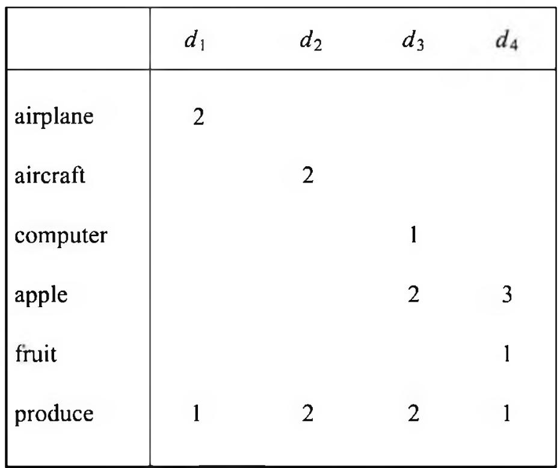
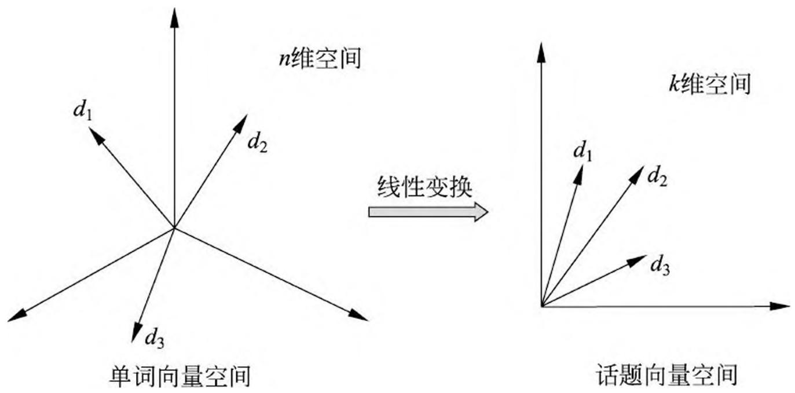
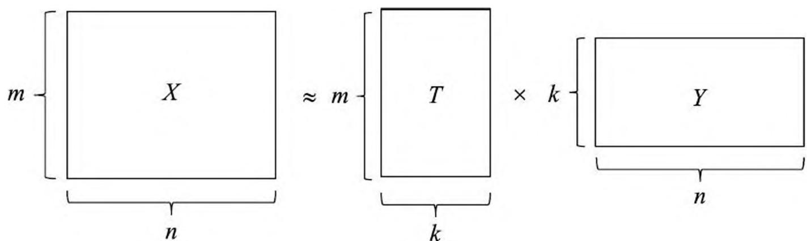

# 第 17 章 潜在语义分析

潜在语义分析（latent semantic analysis, LSA）是一种无监督学习方法，主要用于文本的话题分析，其特点是通过矩阵分解发现文本与单词之间的基于话题的语义关系。潜在语义分析由 Deerwester 等于 1990 年提出，最初应用于文本信息检索，所以也被称为潜在语义索引（latent semantic indexing, LSI），在推荐系统、图像处理、生物信息学等领域也有广泛应用。

文本信息处理中，传统的方法以单词向量表示文本的语义内容，以单词向量空间的度量表示文本之间的语义相似度。潜在语义分析旨在解决这种方法不能准确表示语义的问题，试图从大量的文本数据中发现潜在的话题，以话题向量表示文本的语义内容，以话题向量空间的度量更准确地表示文本之间的语义相似度。这也是话题分析（topic modeling）的基本想法。

潜在语义分析使用的是非概率的话题分析模型。具体地，将文本集合表示为单词-文本矩阵，对单词-文本矩阵进行奇异值分解，从而得到话题向量空间，以及文本在话题向量空间的表示。奇异值分解（singular value decomposition，SVD）即在第 15 章介绍的矩阵因子分解方法，其特点是分解的矩阵正交。

非负矩阵分解（non-negative matrix factorization，NMF）是另一种矩阵的因子分解方法，其特点是分解的矩阵非负。1999 年 Lee 和 Sheung 的论文[3]发表之后，非负矩阵分解引起高度重视和广泛使用。非负矩阵分解也可以用于话题分析。

本章 17.1 节介绍单词向量空间模型和话题向量空间模型，指出进行潜在语义分析的必要性。17.2 节叙述潜在语义分析的奇异值分解算法。17.3 节叙述非负矩阵分解算法。

## 17.1 单词向量空间与话题向量空间

## 17.1.1 单词向量空间

文本信息处理，比如文本信息检索、文本数据挖掘的一个核心问题是对文本的语义内容进行表示，并进行文本之间的语义相似度计算。最简单的方法是利用向量空间模型（vector space model, VSM），也就是单词向量空间模型（word vector space model）。向量空间模型的基本想法是，给定一个文本，用一个向量表示该文本的“语义”，向量的每一维对应一个单词，其数值为该单词在该文本中出现的频数或权值；基本假设是文本中所有单词的出现情况表示了文本的语义内容；文本集合中的每个文本都表示为一个向量，存在于一个向量空间；向量空间的度量，如内积或标准化内积表示文本之间的“语义相似度”。

例如，文本信息检索的任务是，用户提出查询时，帮助用户找到与查询最相关的文本，以排序的形式展示给用户。一个最简单的做法是采用单词向量空间模型，将查询与文本表示为单词的向量，计算查询向量与文本向量的内积，作为语义相似度，以这个相似度的高低对文本进行排序。在这里，查询被看成是一个伪文本，查询与文本的语义相似度表示查询与文本的相关性。

下面给出严格定义。给定一个含有 $n$ 个文本的集合 $D = \{d_{1}, d_{2}, \dots, d_{n}\}$ ，以及在所有文本中出现的 $m$ 个单词的集合 $W = \{w_{1}, w_{2}, \dots, w_{m}\}$ 。将单词在文本中出现的数据用一个单词-文本矩阵（word-document matrix）表示，记作 $X$

$$
X = \left[ \begin{array}{c c c c} x _ {1 1} & x _ {1 2} & \dots & x _ {1 n} \\ x _ {2 1} & x _ {2 2} & \dots & x _ {2 n} \\ \vdots & \vdots & & \vdots \\ x _ {m 1} & x _ {m 2} & \dots & x _ {m n} \end{array} \right] \tag {17.1}
$$

这是一个 $m \times n$ 矩阵，元素 $x_{ij}$ 表示单词 $w_i$ 在文本 $d_j$ 中出现的频数或权值。由于单词的种类很多，而每个文本中出现单词的种类通常较少，所以单词-文本矩阵是一个稀疏矩阵。

权值通常用单词频率-逆文本频率（term frequency-inverse document frequency, TF-IDF）表示，其定义是

$$
\mathrm {T F I D F} _ {i j} = \frac {\mathrm {t f} _ {i j}}{\mathrm {t f} _ {\bullet j}} \log \frac {\mathrm {d f}}{\mathrm {d f} _ {i}}, \quad i = 1, 2, \dots , m; \quad j = 1, 2, \dots , n \tag {17.2}
$$

式中 $\mathrm{tf}_{ij}$ 是单词 $w_{i}$ 出现在文本 $d_{j}$ 中的频数， $\mathrm{tf}_{\bullet j}$ 是文本 $d_{j}$ 中出现的所有单词的频数之和， $\mathrm{df}_{i}$ 是含有单词 $w_{i}$ 的文本数， $\mathrm{df}$ 是文本集合 $D$ 的全部文本数。直观上，一个单词在一个文本中出现的频数越高，这个单词在这个文本中的重要度就越高；一个单词在整个文本集合中出现的文本数越少，这个单词就越能表示其所在文本的特点，重要度就越高；一个单词在一个文本的 TF-IDF 是两种重要度的积，表示综合重要度。

单词向量空间模型直接使用单词-文本矩阵的信息。单词-文本矩阵的第 $j$ 列向量$x_{j}$ 表示文本 $d_{j}$

$$
x _ {j} = \left[ \begin{array}{c} x _ {1 j} \\ x _ {2 j} \\ \vdots \\ x _ {m j} \end{array} \right], \quad j = 1, 2, \dots , n \tag {17.3}
$$

其中 $x_{ij}$ 是单词 $w_{i}$ 在文本 $d_{j}$ 的权值， $i = 1,2,\dots,m$ ，权值越大，该单词在该文本中的重要度就越高。这时矩阵 $X$ 也可以写作 $X = \left[x_{1} x_{2} \dots x_{n}\right]$ 。

两个单词向量的内积或标准化内积（余弦）表示对应的文本之间的语义相似度。因此，文本 $d_{i}$ 与 $d_{j}$ 之间的相似度为

$$
x _ {i} \cdot x _ {j}, \quad \frac {x _ {i} \cdot x _ {j}}{\| x _ {i} \| \| x _ {j} \|} \tag {17.4}
$$

式中·表示向量的内积， $\| \cdot \|$ 表示向量的范数。

直观上，在两个文本中共同出现的单词越多，其语义内容就越相近，这时，对应的单词向量同不为零的维度就越多，内积就越大（单词向量元素的值都是非负的），表示两个文本在语义内容上越相似。这个模型虽然简单，却能很好地表示文本之间的语义相似度，与人们对语义相似度的判断接近，在一定程度上能够满足应用的需求，至今仍在文本信息检索、文本数据挖掘等领域被广泛使用，可以认为是文本信息处理的一个基本原理。注意，两个文本的语义相似度并不是由一两个单词是否在两个文本中出现决定，而是由所有的单词在两个文本中共同出现的“模式”决定。

单词向量空间模型的优点是模型简单，计算效率高。因为单词向量通常是稀疏的，两个向量的内积计算只需要在其同不为零的维度上进行即可，需要的计算很少，可以高效地完成。单词向量空间模型也有一定的局限性，体现在内积相似度未必能够准确表达两个文本的语义相似度上。因为自然语言的单词具有一词多义性（polysemy）及多词一义性（synonymy），即同一个单词可以表示多个语义，多个单词可以表示同一个语义，所以基于单词向量的相似度计算存在不精确的问题。

图 17.1 给出一个例子。单词-文本矩阵，每一行表示一个单词，每一列表示一个文本，矩阵的每一个元素表示单词在文本中出现的频数，频数 0 省略。单词向量空间模型中，文本 $d_{1}$ 与 $d_{2}$ 相似度并不高，尽管两个文本的内容相似，这是因为同义词“airplane”与“aircraft”被当作了两个独立的单词，单词向量空间模型不考虑单词的同义性，在此情况下无法进行准确的相似度计算。另一方面，文本 $d_{3}$ 与 $d_{4}$ 有一定的相似度，尽管两个文本的内容并不相似，这是因为单词“apple”具有多义，可以表示“apple computer”和“fruit”，单词向量空间模型不考虑单词的多义性，在此情况下也无法进行准确的相似度计算。

> 图 17.1 单词-文本矩阵例

## 17.1.2 话题向量空间

两个文本的语义相似度可以体现在两者的话题相似度上。所谓话题（topic），并没有严格的定义，就是指文本所讨论的内容或主题。一个文本一般含有若干个话题。如果两个文本的话题相似，那么两者的语义应该也相似。话题可以由若干个语义相关的单词表示，同义词（如“airplane”与“aircraft”）可以表示同一个话题，而多义词（如“apple”）可以表示不同的话题。这样，基于话题的模型就可以解决上述基于单词的模型存在的问题。

可以设想定义一种话题向量空间模型（topic vector space model）。给定一个文本，用话题空间的一个向量表示该文本，该向量的每一分量对应一个话题，其数值为该话题在该文本中出现的权值。用两个向量的内积或标准化内积表示对应的两个文本的语义相似度。注意话题的个数通常远远小于单词的个数，话题向量空间模型更加抽象。事实上潜在语义分析正是构建话题向量空间的方法（即话题分析的方法），单词向量空间模型与话题向量空间模型可以互为补充，现实中，两者可以同时使用。

## 1. 话题向量空间

给定一个文本集合 $D = \{d_{1}, d_{2}, \dots, d_{n}\}$ 和一个相应的单词集合 $W = \{w_{1}, w_{2}, \dots, w_{m}\}$ 。可以获得其单词-文本矩阵 $X$ ， $X$ 构成原始的单词向量空间，每一列是一个文本在单词向量空间中的表示。

$$
X = \left[ \begin{array}{c c c c} x _ {1 1} & x _ {1 2} & \dots & x _ {1 n} \\ x _ {2 1} & x _ {2 2} & \dots & x _ {2 n} \\ \vdots & \vdots & & \vdots \\ x _ {m 1} & x _ {m 2} & \dots & x _ {m n} \end{array} \right] \tag {17.5}
$$

矩阵 $X$ 也可以写作 $X = \left[x_{1} \quad x_{2} \quad \dots \quad x_{n}\right]$ 。

假设所有文本共含有 $k$ 个话题。假设每个话题由一个定义在单词集合 $W$ 上的 $m$ 维向量表示，称为话题向量，即

$$
t _ {l} = \left[ \begin{array}{c} t _ {1 l} \\ t _ {2 l} \\ \vdots \\ t _ {m l} \end{array} \right], \quad l = 1, 2, \dots , k \tag {17.6}
$$

其中 $t_{il}$ 是单词 $w_{i}$ 在话题 $t_l$ 的权值， $i = 1,2,\dots ,m$ ，权值越大，该单词在该话题中的重要度就越高。这 $k$ 个话题向量 $t_1,t_2,\dots ,t_k$ 张成一个话题向量空间（topic vector space），维数为 $k$ 。注意话题向量空间 $T$ 是单词向量空间 $X$ 的一个子空间。

话题向量空间 $T$ 也可以表示为一个矩阵，称为单词-话题矩阵（word-topic matrix），记作

$$
T = \left[ \begin{array}{c c c c} t _ {1 1} & t _ {1 2} & \dots & t _ {1 k} \\ t _ {2 1} & t _ {2 2} & \dots & t _ {2 k} \\ \vdots & \vdots & & \vdots \\ t _ {m 1} & t _ {m 2} & \dots & t _ {m k} \end{array} \right] \tag {17.7}
$$

矩阵 $T$ 也可以写作 $T = \left[t_{1} \quad t_{2} \quad \dots \quad t_{k}\right]$ 。

## 2. 文本在话题向量空间的表示

现在考虑文本集合 $D$ 的文本 $d_{j}$ , 在单词向量空间中由一个向量 $x_{j}$ 表示, 将 $x_{j}$ 投影到话题向量空间 $T$ 中, 得到在话题向量空间的一个向量 $y_{j}, y_{j}$ 是一个 $k$ 维向量, 其表达式为

$$
y _ {j} = \left[ \begin{array}{c} y _ {1 j} \\ y _ {2 j} \\ \vdots \\ y _ {k j} \end{array} \right], \quad j = 1, 2, \dots , n \tag {17.8}
$$

其中 $y_{lj}$ 是文本 $d_j$ 在话题 $t_l$ 的权值， $l = 1,2,\dots ,k$ ，权值越大，该话题在该文本中的重要度就越高。

矩阵 $Y$ 表示话题在文本中出现的情况，称为话题-文本矩阵（topic-documentmatrix), 记作

$$
Y = \left[ \begin{array}{c c c c} y _ {1 1} & y _ {1 2} & \dots & y _ {1 n} \\ y _ {2 1} & y _ {2 2} & \dots & y _ {2 n} \\ \vdots & \vdots & & \vdots \\ y _ {k 1} & y _ {k 2} & \dots & y _ {k n} \end{array} \right] \tag {17.9}
$$

矩阵 $Y$ 也可以写作 $Y = \left[y_{1} y_{2} \cdots y_{n}\right]$ 。

## 3. 从单词向量空间到话题向量空间的线性变换

这样一来，在单词向量空间的文本向量 $x_{j}$ 可以通过它在话题空间中的向量 $y_{j}$ 近似表示，具体地由 $k$ 个话题向量以 $y_{j}$ 为系数的线性组合近似表示。

$$
x _ {j} \approx y _ {1 j} t _ {1} + y _ {2 j} t _ {2} + \dots + y _ {k j} t _ {k}, \quad j = 1, 2, \dots , n \tag {17.10}
$$

所以，单词-文本矩阵 $X$ 可以近似的表示为单词-话题矩阵 $T$ 与话题-文本矩阵 $Y$ 的乘积形式。这就是潜在语义分析。

$$
X \approx T Y \tag {17.11}
$$

直观上潜在语义分析是将文本在单词向量空间的表示通过线性变换转换为在话题向量空间中的表示，如图 17.2 所示。这个线性变换由矩阵因子分解式(17.11)的形式体现。图 17.3 示意性的表示实现潜在语义分析的矩阵因子分解。

> 图 17.2 将文本在单词向量空间的表示通过线性变换转换为话题空间的表示

在原始的单词向量空间中，两个文本 $d_{i}$ 与 $d_{j}$ 的相似度可以由对应的向量的内积表示，即 $x_{i} \cdot x_{j}$ 。经过潜在语义分析之后，在话题向量空间中，两个文本 $d_{i}$ 与 $d_{j}$ 的相似度可以由对应的向量的内积即 $y_{i} \cdot y_{j}$ 表示。

要进行潜在语义分析，需要同时决定两部分的内容，一是话题向量空间 $T$ ，二是

> 图 17.3 潜在语义分析通过矩阵因子分解实现，单词-文本矩阵 $X$ 可以近似的表示为单词-话题矩阵 $T$ 与话题-文本矩阵 $Y$ 的乘积形式

文本在话题空间的表示 $Y$ ，使两者的乘积是原始矩阵数据的近似，而这一结果完全从话题-文本矩阵的信息中获得。

## 17.2 潜在语义分析算法

潜在语义分析利用矩阵奇异值分解，具体地，对单词-文本矩阵进行奇异值分解，将其左矩阵作为话题向量空间，将其对角矩阵与右矩阵的乘积作为文本在话题向量空间的表示。

## 17.2.1 矩阵奇异值分解算法

## 1. 单词-文本矩阵

给定文本集合 $D = \{d_{1}, d_{2}, \dots, d_{n}\}$ 和单词集合 $W = \{w_{1}, w_{2}, \dots, w_{m}\}$ 。潜在语义分析首先将这些数据表成一个单词-文本矩阵

$$
X = \left[ \begin{array}{c c c c} x _ {1 1} & x _ {1 2} & \dots & x _ {1 n} \\ x _ {2 1} & x _ {2 2} & \dots & x _ {2 n} \\ \vdots & \vdots & & \vdots \\ x _ {m 1} & x _ {m 2} & \dots & x _ {m n} \end{array} \right] \tag {17.12}
$$

这是一个 $m \times n$ 矩阵，元素 $x_{ij}$ 表示单词 $w_i$ 在文本 $d_j$ 中出现的频数或权值。

## 2. 截断奇异值分解

潜在语义分析根据确定的话题个数 $k$ 对单词-文本矩阵 $X$ 进行截断奇异值分解

$$
X \approx U _ {k} \Sigma_ {k} V _ {k} ^ {\mathrm {T}} = \left[ \begin{array}{l l l l} u _ {1} & u _ {2} & \dots & u _ {k} \end{array} \right] \left[ \begin{array}{c c c c} \sigma_ {1} & 0 & 0 & 0 \\ 0 & \sigma_ {2} & 0 & 0 \\ 0 & 0 & \ddots & 0 \\ 0 & 0 & 0 & \sigma_ {k} \end{array} \right] \left[ \begin{array}{c} v _ {1} ^ {\mathrm {T}} \\ v _ {2} ^ {\mathrm {T}} \\ \vdots \\ v _ {k} ^ {\mathrm {T}} \end{array} \right] \tag {17.13}
$$

式中 $k \leqslant n \leqslant m$ ， $U_{k}$ 是 $m \times k$ 矩阵，它的列由 $X$ 的前 $k$ 个互相正交的左奇异向量组成， $\Sigma_{k}$ 是 $k$ 阶对角方阵，对角元素为前 $k$ 个最大奇异值， $V_{k}$ 是 $n \times k$ 矩阵，它的列由 $X$ 的前 $k$ 个互相正交的右奇异向量组成。

## 3. 话题向量空间

在单词-文本矩阵 $X$ 的截断奇异值分解式 (17.13) 中, 矩阵 $U_{k}$ 的每一个列向量 $u_{1}, u_{2}, \dots, u_{k}$ 表示一个话题, 称为话题向量。由这 $k$ 个话题向量张成一个子空间

$$
U _ {k} = \left[ \begin{array}{c c c c} u _ {1} & u _ {2} & \dots & u _ {k} \end{array} \right]
$$

称为话题向量空间。

## 4. 文本的话题空间表示

有了话题向量空间，接着考虑文本在话题空间的表示。将式 (17.13) 写作

$$
\begin{array}{l} X = \left[ \begin{array}{c c c c} x _ {1} & x _ {2} & \dots & x _ {n} \end{array} \right] \approx U _ {k} \Sigma_ {k} V _ {k} ^ {\mathrm {T}} \\ = \left[ \begin{array}{l l l l} u _ {1} & u _ {2} & \dots & u _ {k} \end{array} \right] \left[ \begin{array}{c c c c} \sigma_ {1} & & & \\ & \sigma_ {2} & 0 & \\ & 0 & \ddots & \\ & & & \sigma_ {k} \end{array} \right] \left[ \begin{array}{c c c c} v _ {1 1} & v _ {2 1} & \dots & v _ {n 1} \\ v _ {1 2} & v _ {2 2} & \dots & v _ {n 2} \\ \vdots & \vdots & & \vdots \\ v _ {1 k} & v _ {2 k} & \dots & v _ {n k} \end{array} \right] \\ = \left[ \begin{array}{l l l l} u _ {1} & u _ {2} & \dots & u _ {k} \end{array} \right] \left[ \begin{array}{c c c c} \sigma_ {1} v _ {1 1} & \sigma_ {1} v _ {2 1} & \dots & \sigma_ {1} v _ {n 1} \\ \sigma_ {2} v _ {1 2} & \sigma_ {2} v _ {2 2} & \dots & \sigma_ {2} v _ {n 2} \\ \vdots & \vdots & & \vdots \\ \sigma_ {k} v _ {1 k} & \sigma_ {k} v _ {2 k} & \dots & \sigma_ {k} v _ {n k} \end{array} \right] \tag {17.14} \\ \end{array}
$$

其中

$$
u _ {l} = \left[ \begin{array}{c} u _ {1 l} \\ u _ {2 l} \\ \vdots \\ u _ {m l} \end{array} \right], \quad l = 1, 2, \dots , k
$$

由式 (17.14) 知, 矩阵 $X$ 的第 $j$ 列向量 $x_{j}$ 满足

$$
\begin{array}{l} x _ {j} \approx U _ {k} \left(\Sigma_ {k} V _ {k} ^ {\mathrm {T}}\right) _ {j} \\ = \left[ \begin{array}{c c c c} u _ {1} & u _ {2} & \dots & u _ {k} \end{array} \right] \left[ \begin{array}{c} \sigma_ {1} v _ {j 1} \\ \sigma_ {2} v _ {j 2} \\ \vdots \\ \sigma_ {k} v _ {j k} \end{array} \right] \\ = \sum_ {l = 1} ^ {k} \sigma_ {l} v _ {j l} u _ {l}, \quad j = 1, 2, \dots , n \tag {17.15} \\ \end{array}
$$

式中 $(\Sigma_{k}V_{k}^{\mathrm{T}})_{j}$ 是矩阵 $(\Sigma_{k}V_{k}^{\mathrm{T}})$ 的第 $j$ 列向量。式(17.15)是文本 $d_{j}$ 的近似表达式，由 $k$ 个话题向量 $u_{l}$ 的线性组合构成。矩阵 $(\Sigma_{k}V_{k}^{\mathrm{T}})$ 的每一个列向量

$$
\left[ \begin{array}{c} \sigma_ {1} v _ {1 1} \\ \sigma_ {2} v _ {1 2} \\ \vdots \\ \sigma_ {k} v _ {1 k} \end{array} \right], \quad \left[ \begin{array}{c} \sigma_ {1} v _ {2 1} \\ \sigma_ {2} v _ {2 2} \\ \vdots \\ \sigma_ {k} v _ {2 k} \end{array} \right], \dots , \left[ \begin{array}{c} \sigma_ {1} v _ {n 1} \\ \sigma_ {2} v _ {n 2} \\ \vdots \\ \sigma_ {k} v _ {n k} \end{array} \right]
$$

是一个文本在话题向量空间的表示。

综上，可以通过对单词-文本矩阵的奇异值分解进行潜在语义分析

$$
X \approx U _ {k} \Sigma_ {k} V _ {k} ^ {\mathrm {T}} = U _ {k} \left(\Sigma_ {k} V _ {k} ^ {\mathrm {T}}\right) \tag {17.16}
$$

得到话题空间 $U_{k}$ ，以及文本在话题空间的表示 $(\Sigma_{k}V_{k}^{\mathrm{T}})$ 。

## 17.2.2 例子

下面介绍潜在语义分析的一个例子 ①。假设有 9 个文本，11 个单词，单词-文本矩阵 $X$ 为 $11 \times 9$ 矩阵，矩阵的元素是单词在文本中出现的频数，表示如下：

> - (1) http://www.puffinwarellc.com/index.php/news-and-articles/articles/33-latent-semantic-analysis-tutorial.html?showall=1

<table><tr><td rowspan="2">Index Words</td><td colspan="9">Titles</td></tr><tr><td>T1</td><td>T2</td><td>T3</td><td>T4</td><td>T5</td><td>T6</td><td>T7</td><td>T8</td><td>T9</td></tr><tr><td>book</td><td></td><td></td><td>1</td><td>1</td><td></td><td></td><td></td><td></td><td></td></tr><tr><td>dads</td><td></td><td></td><td></td><td></td><td></td><td>1</td><td></td><td></td><td>1</td></tr><tr><td>dummies</td><td></td><td>1</td><td></td><td></td><td></td><td></td><td></td><td>1</td><td></td></tr><tr><td>estate</td><td></td><td></td><td></td><td></td><td></td><td></td><td>1</td><td></td><td>1</td></tr><tr><td>guide</td><td>1</td><td></td><td></td><td></td><td></td><td>1</td><td></td><td></td><td></td></tr><tr><td>investing</td><td>1</td><td>1</td><td>1</td><td>1</td><td>1</td><td>1</td><td>1</td><td>1</td><td>1</td></tr><tr><td>market</td><td>1</td><td></td><td>1</td><td></td><td></td><td></td><td></td><td></td><td></td></tr><tr><td>real</td><td></td><td></td><td></td><td></td><td></td><td></td><td>1</td><td></td><td>1</td></tr><tr><td>rich</td><td></td><td></td><td></td><td></td><td></td><td>2</td><td></td><td></td><td>1</td></tr><tr><td>stock</td><td>1</td><td></td><td>1</td><td></td><td></td><td></td><td></td><td>1</td><td></td></tr><tr><td>value</td><td></td><td></td><td></td><td>1</td><td>1</td><td></td><td></td><td></td><td></td></tr></table>

进行潜在语义分析。实施对矩阵的截断奇异值分解，假设话题的个数是 3，矩阵的截断奇异值分解结果为

<table><tr><td>Book</td><td>0.15</td><td>-0.27</td><td>0.04</td></tr><tr><td>Dads</td><td>0.24</td><td>0.38</td><td>-0.09</td></tr><tr><td>Dummies</td><td>0.13</td><td>-0.17</td><td>0.07</td></tr><tr><td>Estate</td><td>0.18</td><td>0.19</td><td>0.45</td></tr><tr><td>Guide</td><td>0.22</td><td>0.09</td><td>-0.46</td></tr><tr><td>Investing</td><td>0.74</td><td>-0.21</td><td>0.21</td></tr><tr><td>Market</td><td>0.18</td><td>-0.30</td><td>-0.28</td></tr><tr><td>Real</td><td>0.18</td><td>0.19</td><td>0.45</td></tr><tr><td>Rich</td><td>0.36</td><td>0.59</td><td>-0.34</td></tr><tr><td>Stock</td><td>0.25</td><td>-0.42</td><td>-0.28</td></tr><tr><td>Value</td><td>0.12</td><td>-0.14</td><td>0.23</td></tr></table>

<table><tr><td>3.91</td><td>0</td><td>0</td></tr><tr><td>0</td><td>2.61</td><td>0</td></tr><tr><td>0</td><td>0</td><td>2.00</td></tr></table>

<table><tr><td>T1</td><td>T2</td><td>T3</td><td>T4</td><td>T5</td><td>T6</td><td>T7</td><td>T8</td><td>T9</td></tr><tr><td>0.35</td><td>0.22</td><td>0.34</td><td>0.26</td><td>0.22</td><td>0.49</td><td>0.28</td><td>0.29</td><td>0.44</td></tr><tr><td>-0.32</td><td>-0.15</td><td>-0.46</td><td>-0.24</td><td>-0.14</td><td>0.55</td><td>0.07</td><td>-0.31</td><td>0.44</td></tr><tr><td>-0.41</td><td>0.14</td><td>-0.16</td><td>0.25</td><td>0.22</td><td>-0.51</td><td>0.55</td><td>0.00</td><td>0.34</td></tr></table>

可以看出，左矩阵 $U_{3}$ 有 3 个列向量（左奇异向量）。第 1 列向量 $u_{1}$ 的值均为正，第 2 列向量 $u_{2}$ 和第 3 列向量 $u_{3}$ 的值有正有负。中间的对角矩阵 $\Sigma_{3}$ 的元素是 3 个由大到小的奇异值（正值）。右矩阵是 $V_{3}^{\mathrm{T}}$ ，其转置矩阵 $V_{3}$ 也有 3 个列向量（右奇异向量）。第 1 列向量 $v_{1}$ 的值也都为正，第 2 列向量 $v_{2}$ 和第 3 列向量 $v_{3}$ 的值有正有负。

现在，将 $\Sigma_3$ 与 $V_{3}^{\mathrm{T}}$ 相乘，整体变成两个矩阵乘积的形式

$$
\begin{array}{l} X \approx U _ {3} \left(\Sigma_ {3} V _ {3} ^ {\mathrm {T}}\right) \\ = \left[ \begin{array}{r r r} 0. 1 5 & - 0. 2 7 & 0. 0 4 \\ 0. 2 4 & 0. 3 8 & - 0. 0 9 \\ 0. 1 3 & - 0. 1 7 & 0. 0 7 \\ 0. 1 8 & 0. 1 9 & 0. 4 5 \\ 0. 2 2 & 0. 0 9 & - 0. 4 6 \\ 0. 7 4 & - 0. 2 1 & 0. 2 1 \\ 0. 1 8 & - 0. 3 0 & - 0. 2 8 \\ 0. 1 8 & 0. 1 9 & 0. 4 5 \\ 0. 3 6 & 0. 5 9 & - 0. 3 4 \\ 0. 2 5 & - 0. 4 2 & - 0. 2 8 \\ 0. 1 2 & - 0. 1 4 & 0. 2 3 \end{array} \right] \\ \end{array}
$$

$$
\left[ \begin{array}{r r r r r r r r r} 1. 3 7 & 0. 8 6 & 1. 3 3 & 1. 0 2 & 0. 8 6 & 1. 9 2 & 1. 0 9 & 1. 1 3 & 1. 7 2 \\ - 0. 8 4 & - 0. 3 9 & - 1. 2 0 & - 0. 6 3 & - 0. 3 7 & 1. 4 4 & 0. 1 8 & - 0. 8 1 & 1. 1 5 \\ - 0. 8 2 & 0. 2 8 & - 0. 3 2 & 0. 5 0 & 0. 4 4 & - 1. 0 2 & 1. 1 0 & 0. 0 0 & 0. 6 8 \end{array} \right]
$$

矩阵 $U_{3}$ 有 3 个列向量，表示 3 个话题，矩阵 $U_{3}$ 表示话题向量空间。矩阵 $(\Sigma_3V_3^{\mathrm{T}})$ 有 9 个列向量，表示 9 个文本，矩阵 $(\Sigma_3V_3^{\mathrm{T}})$ 是文本集合在话题向量空间的表示。

## 17.3 非负矩阵分解算法

非负矩阵分解也可以用于话题分析。对单词-文本矩阵进行非负矩阵分解，将其左矩阵作为话题向量空间，将其右矩阵作为文本在话题向量空间的表示。注意通常单词-文本矩阵是非负的。

## 17.3.1 非负矩阵分解

若一个矩阵的所有元素非负，则称该矩阵为非负矩阵，若 $X$ 是非负矩阵，则记作 $X \geqslant 0$ 。

给定一个非负矩阵 $X \geqslant 0$ ，找到两个非负矩阵 $W \geqslant 0$ 和 $H \geqslant 0$ ，使得

$$
X \approx W H \tag {17.17}
$$

即将非负矩阵 $X$ 分解为两个非负矩阵 $W$ 和 $H$ 的乘积的形式，称为非负矩阵分解。因为 $WH$ 与 $X$ 完全相等很难实现，所以只要求 $WH$ 与 $X$ 近似相等。

假设非负矩阵 $X$ 是 $m \times n$ 矩阵，非负矩阵 $W$ 和 $H$ 分别为 $m \times k$ 矩阵和 $k \times n$ 矩阵。假设 $k < \min(m, n)$ ，即 $W$ 和 $H$ 小于原矩阵 $X$ ，所以非负矩阵分解是对原数据的压缩。

由式(17.17)知，矩阵 $X$ 的第 $j$ 列向量 $x_{j}$ 满足

$$
\begin{array}{l} x _ {j} \approx W h _ {j} \\ = \left[ \begin{array}{c c c c} w _ {1} & w _ {2} & \dots & w _ {k} \end{array} \right] \left[ \begin{array}{c} h _ {1 j} \\ h _ {2 j} \\ \vdots \\ h _ {k j} \end{array} \right] \\ = \sum_ {l = 1} ^ {k} h _ {l j} w _ {l}, \quad j = 1, 2, \dots , n \tag {17.18} \\ \end{array}
$$

其中 $h_j$ 是矩阵 $H$ 的第 $j$ 列， $w_l$ 是矩阵 $W$ 的第 $l$ 列， $h_{lj}$ 是 $h_j$ 的第 $l$ 个元素， $l = 1,2,\dots,k$ 。

式(17.18)表示，矩阵 $X$ 的第 $j$ 列 $x_{j}$ 可以由矩阵 $W$ 的 $k$ 个列 $\boldsymbol{w}_{l}$ 的线性组合逼近，线性组合的系数是矩阵 $H$ 的第 $j$ 列 $h_j$ 的元素。这里矩阵 $W$ 的列向量为一组基，矩阵 $H$ 的列向量为线性组合系数。称 $W$ 为基矩阵， $H$ 为系数矩阵。非负矩阵分解旨在用较少的基向量、系数向量来表示较大的数据矩阵。

## 17.3.2 潜在语义分析模型

给定一个 $m \times n$ 非负的单词-文本矩阵 $X \geqslant 0$ 。假设文本集合共包含 $k$ 个话题，对 $X$ 进行非负矩阵分解。即求非负的 $m \times k$ 矩阵 $W \geqslant 0$ 和 $k \times n$ 矩阵 $H \geqslant 0$ ，使得

$$
X \approx W H \tag {17.19}
$$

令 $W = \left[w_{1} \quad w_{2} \quad \dots \quad w_{k}\right]$ 为话题向量空间， $w_{1}, w_{2}, \dots, w_{k}$ 表示文本集合的 $k$ 个话题，令 $H = \left[h_{1} \quad h_{2} \quad \dots \quad h_{n}\right]$ 为文本在话题向量空间的表示， $h_{1}, h_{2}, \dots, h_{n}$ 表示文本集合的 $n$ 个文本。这就是基于非负矩阵分解的潜在语义分析模型。

非负矩阵分解具有很直观的解释，话题向量和文本向量都非负，对应着“伪概率分布”，向量的线性组合表示局部叠加构成整体。

## 17.3.3 非负矩阵分解的形式化

非负矩阵分解可以形式化为最优化问题求解。首先定义损失函数或代价函数。

第一种损失函数是平方损失。设两个非负矩阵 $A = [a_{ij}]_{m \times n}$ 和 $B = [b_{ij}]_{m \times n}$ ，平方损失函数定义为

$$
\left\| A - B \right\| ^ {2} = \sum_ {i, j} \left(a _ {i j} - b _ {i j}\right) ^ {2} \tag {17.20}
$$

其下界是 0，当且仅当 $A = B$ 时达到下界。

另一种损失函数是散度（divergence）。设两个非负矩阵 $A = [a_{ij}]_{m \times n}$ 和 $B = [b_{ij}]_{m \times n}$ ，散度损失函数定义为

$$
D (A \| B) = \sum_ {i, j} \left(a _ {i j} \log \frac {\bar {a} _ {i j}}{b _ {i j}} - a _ {i j} + b _ {i j}\right) \tag {17.21}
$$

其下界也是 0，当且仅当 $A = B$ 时达到下界。 $A$ 和 $B$ 不对称。当 $\sum_{i,j} a_{ij} = \sum_{i,j} b_{ij} = 1$ 时散度损失函数退化为 Kullback-Leibler 散度或相对熵，这时 $A$ 和 $B$ 是概率分布。

接着定义以下的最优化问题。

目标函数 $\| X - WH\|^2$ 关于 $W$ 和 $H$ 的最小化，满足约束条件 $W, H \geqslant 0$ ，即

$$
\min  _ {W, H} \| X - W H \| ^ {2} \tag {17.22}
$$

$$
s. t. \quad W, H \geqslant 0
$$

或者，目标函数 $D(X\| WH)$ 关于 $W$ 和 $H$ 的最小化，满足约束条件 $W,H\geqslant 0$ ，即

$$
\min  _ {W, H} D (X \| W H) \tag {17.23}
$$

$$
\begin{array}{l l} \text {s . t .} & W, H \geqslant 0 \end{array}
$$

## 17.3.4 算法

考虑求解最优化问题 (17.22) 和问题 (17.23)。由于目标函数 $\|X - WH\|^2$ 和 $D(X \| WH)$ 只是对变量 $W$ 和 $H$ 之一的凸函数，而不是同时对两个变量的凸函数，因此找到全局最优（最小值）比较困难，可以通过数值最优化方法求局部最优（极小值）。梯度下降法比较容易实现，但是收敛速度慢。共轭梯度法收敛速度快，但实现比较复杂。Lee 和 Seung 提出了新的基于“乘法更新规则”的优化算法，交替地对 $W$ 和 $H$ 进行更新，其理论依据是下面的定理。

定理 17.1 平方损失 $\| X - WH\|^2$ 对下列乘法更新规则

$$
H _ {l j} \leftarrow H _ {l j} \frac {\left(W ^ {\mathrm {T}} X\right) _ {l j}}{\left(W ^ {\mathrm {T}} W H\right) _ {l j}} \tag {17.24}
$$

$$
W _ {i l} \leftarrow W _ {i l} \frac {\left(X H ^ {\mathrm {T}}\right) _ {i l}}{\left(W H H ^ {\mathrm {T}}\right) _ {i l}} \tag {17.25}
$$

是非增的。当且仅当 $W$ 和 $H$ 是平方损失函数的稳定点时函数的更新不变。

定理 17.2 散度损失 $D(X - WH)$ 对下列乘法更新规则

$$
H _ {l j} \leftarrow H _ {l j} \frac {\sum_ {i} \left[ W _ {i l} X _ {i j} / (W H) _ {i j} \right]}{\sum_ {i} W _ {i l}} \tag {17.26}
$$

$$
W _ {i l} \leftarrow W _ {i l} \frac {\sum_ {j} \left[ H _ {l j} X _ {i j} / (W H) _ {i j} \right]}{\sum_ {j} H _ {l j}} \tag {17.27}
$$

是非增的。当且仅当 $W$ 和 $H$ 是散度损失函数的稳定点时函数的更新不变。

定理 17.1 和定理 17.2 给出了乘法更新规则。定理的证明可以参阅文献[4]。

现叙述非负矩阵分解的算法。只介绍第一个问题 (17.22) 的算法，第二个问题 (17.23) 的算法类似。

最优化目标函数是 $\| X - WH\|^2$ ，为了方便将目标函数乘以 $1/2$ ，其最优解与原问题相同，记作

$$
J (W, H) = \frac {1}{2} \| X - W H \| ^ {2} = \frac {1}{2} \sum \left[ X _ {i j} - (W H) _ {i j} \right] ^ {2}
$$

应用梯度下降法求解。首先求目标函数的梯度

$$
\begin{array}{l} \frac {\partial J (W , H)}{\partial W _ {i l}} = - \sum_ {j} [ X _ {i j} - (W H) _ {i j} ] H _ {l j} \\ = - \left[ \left(X H ^ {\mathrm {T}}\right) _ {i l} - \left(W H H ^ {\mathrm {T}}\right) _ {i l} \right] \tag {17.28} \\ \end{array}
$$

同样可得

$$
\frac {\partial J (W , H)}{\partial H _ {l j}} = - \left[ \left(W ^ {\mathrm {T}} X\right) _ {l j} - \left(W ^ {\mathrm {T}} W H\right) _ {l j} \right] \tag {17.29}
$$

然后求得梯度下降法的更新规则，由式(17.28)和式(17.29)有

$$
W _ {i l} = W _ {i l} + \lambda_ {i l} \left[ \left(X H ^ {\mathrm {T}}\right) _ {i l} - \left(W H H ^ {\mathrm {T}}\right) _ {i l} \right] \tag {17.30}
$$

$$
H _ {l j} = H _ {l j} + \mu_ {l j} [ (W ^ {\mathrm {T}} X) _ {l j} - (W ^ {\mathrm {T}} W H) _ {l j} ] \tag {17.31}
$$

式中 $\lambda_{il}$ ， $\mu_{lj}$ 是步长。选取

$$
\lambda_ {i l} = \frac {W _ {i l}}{\left(W H H ^ {\mathrm {T}}\right) _ {i l}}, \quad \mu_ {l j} = \frac {H _ {l j}}{\left(W ^ {\mathrm {T}} W H\right) _ {l j}} \tag {17.32}
$$

即得乘法更新规则

$$
W _ {i l} = W _ {i l} \frac {\left(X H ^ {\mathrm {T}}\right) _ {i l}}{\left(W H H ^ {\mathrm {T}}\right) _ {i l}}, \quad i = 1, 2, \dots , m; \quad l = 1, 2, \dots , k \tag {17.33}
$$

$$
H _ {l j} = H _ {l j} \frac {(W ^ {\mathrm {T}} X) _ {l j}}{(W ^ {\mathrm {T}} W H) _ {l j}}, \quad l = 1, 2, \dots , k; \quad j = 1, 2, \dots , n \qquad (1 7. 3 4)
$$

选取初始矩阵 $W$ 和 $H$ 为非负矩阵，可以保证迭代过程及结果的矩阵 $W$ 和 $H$ 均为非负。

下面叙述基于乘法更新规则的矩阵非负分解迭代算法。算法交替对 $W$ 和 $H$ 迭代，每次迭代对 $W$ 的列向量归一化，使基向量为单位向量。

## 算法 17.1（非负矩阵分解的迭代算法）

输入：单词-文本矩阵 $X \geqslant 0$ ，文本集合的话题个数 $k$ ，最大迭代次数 $t$输出：话题矩阵 $W$ ，文本表示矩阵 $H$ 。

(1) 初始化$W \geqslant 0$ , 并对 $W$ 的每一列数据归一化;

$$
H \geqslant 0;
$$

(2) 迭代对迭代次数由 1 到 $t$ 执行下列步骤：

- (a) 更新 $W$ 的元素, 对 $l$ 从 1 到 $k$ , $i$ 从 1 到 $m$ 按式 (17.33) 更新 $W_{il}$ ;
- (b) 更新 $H$ 的元素, 对 $l$ 从 1 到 $k$ , $j$ 从 1 到 $n$ 按式 (17.34) 更新 $H_{lj}$ 。

## 本章概要

1. 单词向量空间模型通过单词的向量表示文本的语义内容。以单词-文本矩阵 $X$ 为输入，其中每一行对应一个单词，每一列对应一个文本，每一个元素表示单词在文本中的频数或权值（如 TF-IDF）。

$$
X = \left[ \begin{array}{c c c c} x _ {1 1} & x _ {1 2} & \dots & x _ {1 n} \\ x _ {2 1} & x _ {2 2} & \dots & x _ {2 n} \\ \vdots & \vdots & & \vdots \\ x _ {m 1} & x _ {m 2} & \dots & x _ {m n} \end{array} \right]
$$

单词向量空间模型认为，这个矩阵的每一列向量是单词向量，表示一个文本，两个单词向量的内积或标准化内积表示文本之间的语义相似度。

2. 话题向量空间模型通过话题的向量表示文本的语义内容。假设有话题-文本矩阵

$$
Y = \left[ \begin{array}{c c c c} y _ {1 1} & y _ {1 2} & \dots & y _ {1 n} \\ y _ {2 1} & y _ {2 2} & \dots & y _ {2 n} \\ \vdots & \vdots & & \vdots \\ y _ {k 1} & y _ {k 2} & \dots & y _ {k n} \end{array} \right]
$$

其中每一行对应一个话题，每一列对应一个文本，每一个元素表示话题在文本中的权值。话题向量空间模型认为，这个矩阵的每一列向量是话题向量，表示一个文本，两个话题向量的内积或标准化内积表示文本之间的语义相似度。假设有单词-话题矩阵 $T$

$$
T = \left[ \begin{array}{c c c c} t _ {1 1} & t _ {1 2} & \dots & t _ {1 k} \\ t _ {2 1} & t _ {2 2} & \dots & t _ {2 k} \\ \vdots & \vdots & & \vdots \\ t _ {m 1} & t _ {m 2} & \dots & t _ {m k} \end{array} \right]
$$

其中每一行对应一个单词，每一列对应一个话题，每一个元素表示单词在话题中的权值。

给定一个单词-文本矩阵 $X$

$$
X = \left[ \begin{array}{c c c c} x _ {1 1} & x _ {1 2} & \dots & x _ {1 n} \\ x _ {2 1} & x _ {2 2} & \dots & x _ {2 n} \\ \vdots & \vdots & & \vdots \\ x _ {m 1} & x _ {m 2} & \dots & x _ {m n} \end{array} \right]
$$

潜在语义分析的目标是，找到合适的单词-话题矩阵 $T$ 与话题-文本矩阵 $Y$ ，将单词-文本矩阵 $X$ 近似的表示为 $T$ 与 $Y$ 的乘积形式。

$$
X \approx T Y
$$

等价地，潜在语义分析将文本在单词向量空间的表示 $X$ 通过线性变换 $T$ 转换为话题向量空间中的表示 $Y$ 。

潜在语义分析的关键是对单词-文本矩阵进行以上的矩阵因子分解（话题分析）。

3. 潜在语义分析的算法是奇异值分解。通过对单词-文本矩阵进行截断奇异值分解，得到

$$
X \approx U _ {k} \Sigma_ {k} V _ {k} ^ {\mathrm {T}} = U _ {k} (\Sigma_ {k} V _ {k} ^ {\mathrm {T}})
$$

矩阵 $U_{k}$ 表示话题空间，矩阵 $(\Sigma_{k}V_{k}^{\mathrm{T}})$ 是文本在话题空间的表示。

4. 非负矩阵分解也可以用于话题分析。非负矩阵分解将非负的单词-文本矩阵近似分解成两个非负矩阵 $W$ 和 $H$ 的乘积，得到

$$
X \approx W H
$$

矩阵 $W$ 表示话题空间，矩阵 $H$ 是文本在话题空间的表示。

非负矩阵分解可以表为以下的最优化问题：

$$
\min _ {W, H} \left\| X - W H \right\| ^ {2}
$$

$$
\begin{array}{l l} \text {s . t .} & W, H \geqslant 0 \end{array}
$$

非负矩阵分解的算法是迭代算法。乘法更新规则的迭代算法，交替地对 $W$ 和 $H$ 进行更新。本质是梯度下降法，通过定义特殊的步长和非负的初始值，保证迭代过程及结果的矩阵 $W$ 和 $H$ 均为非负。

## 继续阅读

文献[1]为潜在语义分析的原始论文，相关的介绍还有文献[2]，主要是关于基于矩阵奇异值分解的潜在语义分析。基于非负矩阵分解的潜在语义分析可以参照文献 $[3 \sim 5]$ 。还有基于稀疏矩阵分解的方法[6]。后两种方法可以通过并行计算实现，大大提高计算效率。

## 习题

17.1 试将图 17.1 的例子进行潜在语义分析，并对结果进行观察。

17.2 给出损失函数是散度损失时的非负矩阵分解（潜在语义分析）的算法。

17.3 给出潜在语义分析的两种算法的计算复杂度，包括奇异值分解法和非负矩阵分解法。

17.4 列出潜在语义分析与主成分分析的异同。

## 参考文献

- [1] Deerwester S C, Dumais S T, Landauer T K, et al. Indexing by latent semantic analysis. Journal of the Association for Information Science and Technology, 1990, 41: 391-407.
- [2] Landauer T K. Latent semantic analysis. In: Encyclopedia of Cognitive Science, Wiley, 2006.
- [3] Lee D D, Seung H S. Learning the parts of objects by non-negative matrix factorization. Nature, 1999, 401(6755): 788-791.
- [4] Lee D D, Seung H S. Algorithms for non-negative matrix factorization. Advances in Neural Information Processing Systems, 2001: 556-562.

- [5] Xu W, Liu X, Gong Y. Document clustering based on non-negative matrix factorization. Proceedings of the 26th Annual International ACM SIGIR Conference on Research and Development in Information Retrieval, 2003.
- [6] Wang Q, Xu J, Li H, et al. Regularized latent semantic indexing. Proceedings of the 34th International ACM SIGIR Conference on Research and Development in Information Retrieval, 2011.