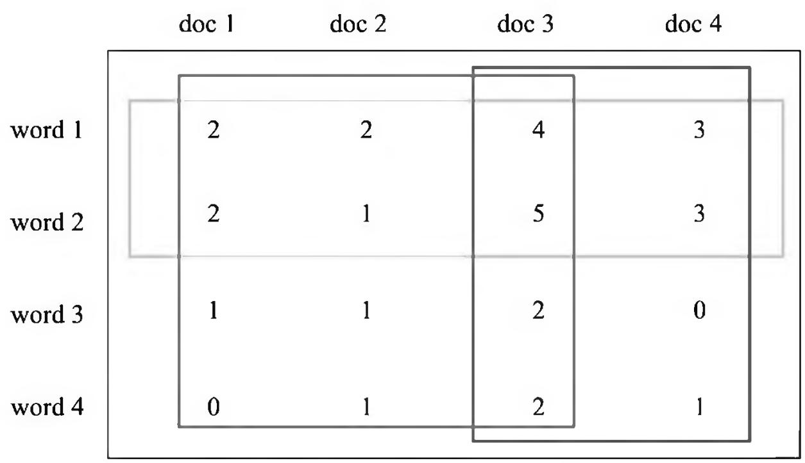
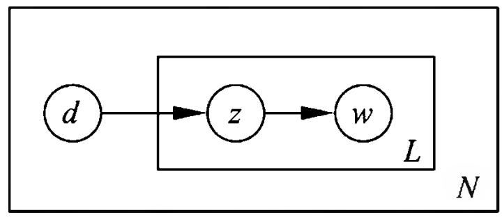
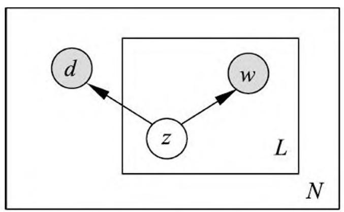
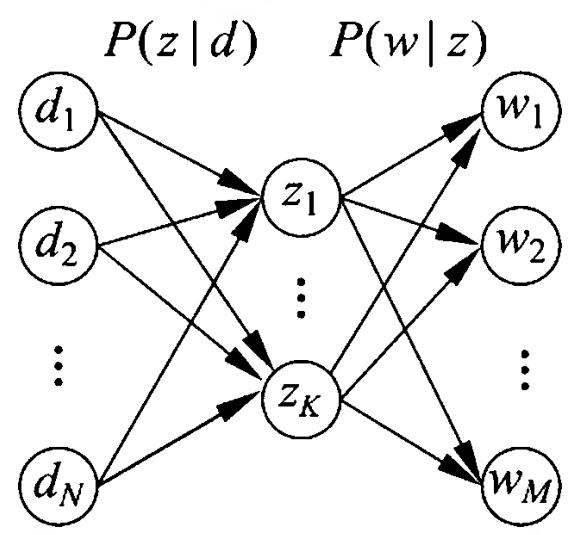
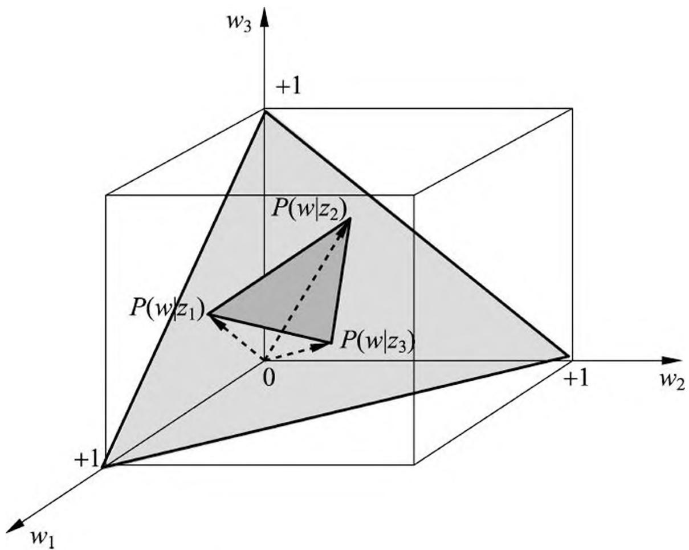
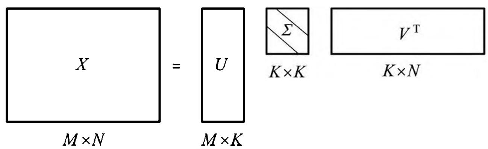

# 第 18 章 概率潜在语义分析

概率潜在语义分析（probabilistic latent semantic analysis, PLSA），也称概率潜在语义索引（probabilistic latent semantic indexing, PLSI），是一种利用概率生成模型对文本集合进行话题分析的无监督学习方法。模型的最大特点是用隐变量表示话题；整个模型表示文本生成话题，话题生成单词，从而得到单词-文本共现数据的过程；假设每个文本由一个话题分布决定，每个话题由一个单词分布决定。

概率潜在语义分析受潜在语义分析的启发，1999 年由 Hofmann 提出，前者基于概率模型，后者基于非概率模型。概率潜在语义分析最初用于文本数据挖掘，后来扩展到其他领域。

首先在 18.1 节叙述概率潜在语义分析的模型，包括生成模型和共现模型。然后在 18.2 节介绍概率潜在语义分析模型的学习策略和算法。

## 18.1 概率潜在语义分析模型

首先叙述概率潜在语义分析的直观解释。概率潜在语义分析模型有生成模型，以及等价的共现模型。先介绍生成模型，然后介绍共现模型，最后讲解模型的性质。

## 18.1.1 基本想法

给定一个文本集合，每个文本讨论若干个话题，每个话题由若干个单词表示。对文本集合进行概率潜在语义分析，就能够发现每个文本的话题，以及每个话题的单词。话题是不能从数据中直接观察到的，是潜在的。

文本集合转换为文本-单词共现数据，具体表现为单词-文本矩阵，图 18.1 给出一个单词-文本矩阵的例子（详见文前彩图）。每一行对应一个单词，每一列对应一个文本，每一个元素表示单词在文本中出现的次数。一个话题表示一个语义内容。文本数据基于如下的概率模型产生（共现模型）：首先有话题的概率分布，然后有话题给定条件下文本的条件概率分布，以及话题给定条件下单词的条件概率分布。概率潜在语义分析就是发现由隐变量表示的话题，即潜在语义。直观上，语义相近的单词、语义相近的文本会被聚到相同的“软的类别”中，而话题所表示的就是这样的软的类别。假设有 3 个潜在的话题，图中红、绿、蓝框各自表示一个话题。

> 图 18.1 概率潜在语义分析的直观解释(见彩图)

## 18.1.2 生成模型

假设有单词集合 $W = \{w_{1}, w_{2}, \dots, w_{M}\}$ ，其中 $M$ 是单词个数；文本（指标）集合 $D = \{d_{1}, d_{2}, \dots, d_{N}\}$ ，其中 $N$ 是文本个数；话题集合 $Z = \{z_{1}, z_{2}, \dots, z_{K}\}$ ，其中 $K$ 是预先设定的话题个数。随机变量 $w$ 取值于单词集合；随机变量 $d$ 取值于文本集合，随机变量 $z$ 取值于话题集合。概率分布 $P(d)$ 、条件概率分布 $P(z|d)$ 、条件概率分布 $P(w|z)$ 皆属于多项分布，其中 $P(d)$ 表示生成文本 $d$ 的概率， $P(z|d)$ 表示文本 $d$ 生成话题 $z$ 的概率， $P(w|z)$ 表示话题 $z$ 生成单词 $w$ 的概率。

每个文本 $d$ 拥有自己的话题概率分布 $P(z|d)$ ，每个话题 $z$ 拥有自己的单词概率分布 $P(w|z)$ ；也就是说一个文本的内容由其相关话题决定，一个话题的内容由其相关单词决定。

生成模型通过以下步骤生成文本-单词共现数据：

- （1）依据概率分布 $P(d)$ ，从文本（指标）集合中随机选取一个文本 $d$ ，共生成 $N$ 个文本；针对每个文本，执行以下操作；
- (2) 在文本 $d$ 给定条件下, 依据条件概率分布 $P(z|d)$ , 从话题集合随机选取一个话题 $z$ , 共生成 $L$ 个话题, 这里 $L$ 是文本长度;
- （3）在话题 $z$ 给定条件下，依据条件概率分布 $P(w|z)$ ，从单词集合中随机选取一个单词 $w$ 。

注意这里为叙述方便，假设文本都是等长的，现实中不需要这个假设。

生成模型中，单词变量 $w$ 与文本变量 $d$ 是观测变量，话题变量 $z$ 是隐变量。也就是说模型生成的是单词-话题-文本三元组 $(w, z, d)$ 的集合，但观测到的是单词-文本二元组 $(w, d)$ 的集合，观测数据表示为单词-文本矩阵 $T$ 的形式，矩阵 $T$ 的行表示单词，列表示文本，元素表示单词-文本对 $(w, d)$ 的出现次数。

从数据的生成过程可以推出，文本-单词共现数据 $T$ 的生成概率为所有单词-文本对 $(w, d)$ 的生成概率的乘积，

$$
P (T) = \prod_ {(w, d)} P (w, d) ^ {n (w, d)} \tag {18.1}
$$

这里 $n(w, d)$ 表示 $(w, d)$ 的出现次数，单词-文本对出现的总次数是 $N \times L$ 。每个单词-文本对 $(w, d)$ 的生成概率由以下公式决定：

$$
\begin{array}{l} P (w, d) = P (d) P (w | d) \\ = P (d) \sum_ {z} P (w, z | d) \\ = P (d) \sum_ {z} P (z | d) P (w | z) \tag {18.2} \\ \end{array}
$$

式 (18.2) 即生成模型的定义。

生成模型假设在话题 $z$ 给定条件下，单词 $\boldsymbol{w}$ 与文本 $d$ 条件独立，即

$$
P (w, z | d) = P (z | d) P (w | z) \tag {18.3}
$$

生成模型属于概率有向图模型，可以用有向图（directed graph）表示，如图 18.2 所示。图中实心圆表示观测变量，空心圆表示隐变量，箭头表示概率依存关系，方框表示多次重复，方框内数字表示重复次数。文本变量 $d$ 是一个观测变量，话题变量 $z$ 是一个隐变量，单词变量 $w$ 是一个观测变量。

> 图 18.2 概率潜在语义分析的生成模型

## 18.1.3 共现模型

可以定义与以上的生成模型等价的共现模型。

文本-单词共现数据 $T$ 的生成概率为所有单词-文本对 $(w, d)$ 的生成概率的乘积：

$$
P (T) = \prod_ {(w, d)} P (w, d) ^ {n (w, d)} \tag {18.4}
$$

每个单词-文本对 $(w, d)$ 的概率由以下公式决定：

$$
P (w, d) = \sum_ {z \in Z} P (z) P (w | z) P (d | z) \tag {18.5}
$$

式 (18.5) 即共现模型的定义。容易验证，生成模型 (18.2) 和共现模型 (18.5) 是等价的。

共现模型假设在话题 $z$ 给定条件下，单词 $\boldsymbol{w}$ 与文本 $d$ 是条件独立的，即

$$
P (w, d | z) = P (w | z) P (d | z) \tag {18.6}
$$

图 18.3 所示是共现模型。图中文本变量 $d$ 是一个观测变量，单词变量 $\boldsymbol{w}$ 是一个观测变量，话题变量 $z$ 是一个隐变量。图 18.1 是共现模型的直观解释。

> 图 18.3 概率潜在语义模型的共现模型

虽然生成模型与共现模型在概率公式意义上是等价的，但是拥有不同的性质。生成模型刻画文本-单词共现数据生成的过程，共现模型描述文本-单词共现数据拥有的模式。生成模型式 (18.2) 中单词变量 $w$ 与文本变量 $d$ 是非对称的，而共现模型式 (18.5) 中单词变量 $w$ 与文本变量 $d$ 是对称的；所以前者也称为非对称模型，后者也称为对称模型。由于两个模型的形式不同，其学习算法的形式也不同。

## 18.1.4 模型性质

## 1. 模型参数

如果直接定义单词与文本的共现概率 $P(w, d)$ , 模型参数的个数是 $O(M \cdot N)$ , 其中 $M$ 是单词数, $N$ 是文本数。概率潜在语义分析的生成模型和共现模型的参数个数是 $O(M \cdot K + N \cdot K)$ , 其中 $K$ 是话题数。现实中 $K \ll M$ , 所以概率潜在语义分析通过话题对数据进行了更简洁地表示, 减少了学习过程中过拟合的可能性。图 18.4 显示模型中文本、话题、单词之间的关系。

> 图 18.4 概率潜在语义分析中文本、话题、单词之间的关系

## 2. 模型的几何解释

下面给出生成模型的几何解释。概率分布 $P(w|d)$ 表示文本 $d$ 生成单词 $w$ 的概率，

$$
\sum_ {i = 1} ^ {M} P (w _ {i} | d) = 1, \quad 0 \leqslant P (w _ {i} | d) \leqslant 1, \quad i = 1, \dots , M
$$

可以由 $M$ 维空间的 $(M - 1)$ 单纯形（simplex）中的点表示。图 18.5 为三维空间的情况。单纯形上的每个点表示一个分布 $P(w|d)$ （分布的参数向量)，所有的分布 $P(w|d)$ （分布的参数向量）都在单纯形上，称这个 $(M - 1)$ 单纯形为单词单纯形。

> 图 18.5 单词单纯形与话题单纯形

从式 (18.2) 可知, 概率潜在分析模型 (生成模型) 中的文本概率分布 $P(w|d)$ 有下面的关系成立:

$$
P (w | d) = \sum_ {z} P (z | d) P (w | z) \tag {18.7}
$$

这里概率分布 $P(w|z)$ 表示话题 $z$ 生成单词 $w$ 的概率。

概率分布 $P(w|z)$ 也存在于 $M$ 维空间中的 $(M - 1)$ 单纯形之中。如果有 $K$ 个话题，那么就有 $K$ 个概率分布 $P(w|z_k), k = 1,2,\dots ,K$ ，由 $(M - 1)$ 单纯形上的 $K$ 个点表示（参照图 18.5）。以这 $K$ 个点为顶点，构成一个 $(K - 1)$ 单纯形，称为话题单纯形。话题单纯形是单词单纯形的子单纯形。参阅图 18.5。

从式 (18.7) 知, 生成模型中文本的分布 $P(w|d)$ 可以由 $K$ 个话题的分布 $P(w|z_k), k = 1, \dots, K$ , 的线性组合表示, 文本对应的点就在 $K$ 个话题的点构成的 $(K - 1)$ 话题单纯形中。这就是生成模型的几何解释。注意通常 $K \ll M$ , 概率潜在语义模型存在于一个相对很小的参数空间中。图 18.5 中显示的是 $M = 3$ , $K = 3$ 时的情况。当 $K = 2$ 时话题单纯形是一个线段, 当 $K = 1$ 时话题单纯形是一个点。

## 3. 与潜在语义分析的关系

概率潜在语义分析模型（共现模型）可以在潜在语义分析模型的框架下描述。图 18.6 显示潜在语义分析，对单词-文本矩阵进行奇异值分解得到 $X = U\Sigma V^{\mathrm{T}}$ ，其中 $U$ 和 $V$ 为正交矩阵， $\Sigma$ 为非负降序对角矩阵（参照第 17 章）。

> 图 18.6 概率潜在语义分析与潜在语义分析的关系

共现模型 (18.5) 也可以表示为三个矩阵乘积的形式。这样，概率潜在语义分析与潜在语义分析的对应关系可以从中看得很清楚。下面是共现模型的矩阵乘积形式：

$$
\begin{array}{l} X ^ {\prime} = U ^ {\prime} \Sigma^ {\prime} V ^ {\prime \mathrm {T}} \\ X ^ {\prime} = \left[ P (w, d) \right] _ {M \times N} \\ U ^ {\prime} = \left[ P (w | z) \right] _ {M \times K} \tag {18.8} \\ \end{array}
$$

$$
\begin{array}{l} \Sigma^ {\prime} = \left[ P (z) \right] _ {K \times K} \\ V ^ {\prime} = \left[ P (d | z) \right] _ {N \times K} \\ \end{array}
$$

概率潜在语义分析模型 (18.8) 中的矩阵 $U'$ 和 $V'$ 是非负的、规范化的，表示条件概率分布，而潜在语义分析模型中的矩阵 $U$ 和 $V$ 是正交的，未必非负，并不表示概率分布。

## 18.2 概率潜在语义分析的算法

概率潜在语义分析模型是含有隐变量的模型，其学习通常使用 EM 算法。本节介绍生成模型学习的 EM 算法。

EM 算法是一种迭代算法，每次迭代包括交替的两步：E 步，求期望；M 步，求极大。E 步是计算 $Q$ 函数，即完全数据的对数似然函数对不完全数据的条件分布的期望。M 步是对 $Q$ 函数极大化，更新模型参数。详细介绍见第 9 章。下面叙述生成模型的 EM 算法。

设单词集合为 $W = \{w_{1}, w_{2}, \dots, w_{M}\}$ ，文本集合为 $D = \{d_{1}, d_{2}, \dots, d_{N}\}$ ，话题集合为 $Z = \{z_{1}, z_{2}, \dots, z_{K}\}$ 。给定单词-文本共现数据 $T = \{n(w_{i}, d_{j})\}, i = 1, 2, \dots, M$ ， $j = 1, 2, \dots, N$ ，目标是估计概率潜在语义分析模型（生成模型）的参数。如果使用极大似然估计，对数似然函数是

$$
\begin{array}{l} L = \sum_ {i = 1} ^ {M} \sum_ {j = 1} ^ {N} n \left(w _ {i}, d _ {j}\right) \log P \left(w _ {i}, d _ {j}\right) \\ = \sum_ {i = 1} ^ {M} \sum_ {j = 1} ^ {N} n \left(w _ {i}, d _ {j}\right) \log \left[ \sum_ {k = 1} ^ {K} P \left(w _ {i} \mid z _ {k}\right) P \left(z _ {k} \mid d _ {j}\right) \right] \\ \end{array}
$$

但是模型含有隐变量，对数似然函数的优化无法用解析方法求解，这时使用 EM 算法。应用 EM 算法的核心是定义 $Q$ 函数。

E 步：计算 $Q$ 函数$Q$ 函数为完全数据的对数似然函数对不完全数据的条件分布的期望。针对概率潜在语义分析的生成模型， $Q$ 函数是

$$
Q = \sum_ {k = 1} ^ {K} \left\{\sum_ {j = 1} ^ {N} n \left(d _ {j}\right) \left[ \log P \left(d _ {j}\right) + \sum_ {i = 1} ^ {M} \frac {n \left(w _ {i} , d _ {j}\right)}{n \left(d _ {j}\right)} \log P \left(w _ {i} \mid z _ {k}\right) P \left(z _ {k} \mid d _ {j}\right) \right] \right\} P \left(z _ {k} \mid w _ {i}, d _ {j}\right) \tag {18.9}
$$

式中 $n(d_j) = \sum_{i=1}^{M} n(w_i, d_j)$ 表示文本 $d_j$ 中的单词个数， $n(w_i, d_j)$ 表示单词 $w_i$ 在文本 $d_j$ 中出现的次数。条件概率分布 $P(z_k | w_i, d_j)$ 代表不完全数据，是已知变量。条件概率分布 $P(w_i | z_k)$ 和 $P(z_k | d_j)$ 的乘积代表完全数据，是未知变量。

由于可以从数据中直接统计得出 $P(d_{j})$ 的估计，这里只考虑 $P(w_{i}|z_{k})$ ， $P(z_{k}|d_{j})$ 的估计，可将 $Q$ 函数简化为函数 $Q^{\prime}$

$$
Q ^ {\prime} = \sum_ {i = 1} ^ {M} \sum_ {j = 1} ^ {N} n \left(w _ {i}, d _ {j}\right) \sum_ {k = 1} ^ {K} P \left(z _ {k} \mid w _ {i}, d _ {j}\right) \log \left[ P \left(w _ {i} \mid z _ {k}\right) P \left(z _ {k} \mid d _ {j}\right) \right] \tag {18.10}
$$

$Q^{\prime}$ 函数中的 $P(z_{k}|w_{i},d_{j})$ 可以根据贝叶斯公式计算

$$
P \left(z _ {k} \mid w _ {i}, d _ {j}\right) = \frac {P \left(w _ {i} \mid z _ {k}\right) P \left(z _ {k} \mid d _ {j}\right)}{\sum_ {k = 1} ^ {K} P \left(w _ {i} \mid z _ {k}\right) P \left(z _ {k} \mid d _ {j}\right)} \tag {18.11}
$$

其中 $P(z_{k}|d_{j})$ 和 $P(w_{i}|z_{k})$ 由上一步迭代得到。

M 步：极大化 $Q$ 函数。

通过约束最优化求解 $Q$ 函数的极大值，这时 $P(z_{k}|d_{j})$ 和 $P(w_{i}|z_{k})$ 是变量。因为变量 $P(w_{i}|z_{k})$ ， $P(z_{k}|d_{j})$ 形成概率分布，满足约束条件

$$
\begin{array}{l} \sum_ {i = 1} ^ {M} P \left(w _ {i} \mid z _ {k}\right) = 1, \quad k = 1, 2, \dots , K \\ \sum_ {k = 1} ^ {K} P \left(z _ {k} \mid d _ {j}\right) = 1, \quad j = 1, 2, \dots , N \\ \end{array}
$$

应用拉格朗日法，引入拉格朗日乘子 $\tau_{k}$ 和 $\rho_{j}$ ，定义拉格朗日函数 $\Lambda$

$$
\varLambda = Q ^ {\prime} + \sum_ {k = 1} ^ {K} \tau_ {k} \Big (1 - \sum_ {i = 1} ^ {M} P (w _ {i} | z _ {k}) \Big) + \sum_ {j = 1} ^ {N} \rho_ {j} \Big (1 - \sum_ {k = 1} ^ {K} P (z _ {k} | d _ {j}) \Big)
$$

将拉格朗日函数 $\Lambda$ 分别对 $P(w_{i}|z_{k})$ 和 $P(z_{k}|d_{j})$ 求偏导数，并令其等于 0，得到下面的方程组

$$
\begin{array}{l} \sum_ {j = 1} ^ {N} n \left(w _ {i}, d _ {j}\right) P \left(z _ {k} \mid w _ {i}, d _ {j}\right) - \tau_ {k} P \left(w _ {i} \mid z _ {k}\right) = 0, \quad i = 1, 2, \dots , M; \quad k = 1, 2, \dots , K \\ \sum_ {i = 1} ^ {M} n \left(w _ {i}, d _ {j}\right) P \left(z _ {k} \mid w _ {i}, d _ {j}\right) - \rho_ {j} P \left(z _ {k} \mid d _ {j}\right) = 0, \quad j = 1, 2, \dots , N; \quad k = 1, 2, \dots , K \\ \end{array}
$$

解方程组得到 M 步的参数估计公式：

$$
P \left(w _ {i} \mid z _ {k}\right) = \frac {\sum_ {j = 1} ^ {N} n \left(w _ {i} , d _ {j}\right) P \left(z _ {k} \mid w _ {i} , d _ {j}\right)}{\sum_ {m = 1} ^ {M} \sum_ {j = 1} ^ {N} n \left(w _ {m} , d _ {j}\right) P \left(z _ {k} \mid w _ {m} , d _ {j}\right)} \tag {18.12}
$$

$$
P \left(z _ {k} \mid d _ {j}\right) = \frac {\sum_ {i = 1} ^ {M} n \left(w _ {i} , d _ {j}\right) P \left(z _ {k} \mid w _ {i} , d _ {j}\right)}{n \left(d _ {j}\right)} \tag {18.13}
$$

总结有下面的算法：

## 算法 18.1（概率潜在语义模型参数估计的 EM 算法）

输入：设单词集合为 $W = \{w_{1}, w_{2}, \dots, w_{M}\}$ ，文本集合为 $D = \{d_{1}, d_{2}, \dots, d_{N}\}$ ，话题集合为 $Z = \{z_{1}, z_{2}, \dots, z_{K}\}$ ，共现数据 $\{n(w_{i}, d_{j})\}, i = 1, 2, \dots, M, j = 1, 2, \dots, N$ ；

输出： $P(w_{i}|z_{k})$ 和 $P(z_{k}|d_{j})$ 。

- （1）设置参数 $P(w_{i}|z_{k})$ 和 $P(z_{k}|d_{j})$ 的初始值。
- （2）迭代执行以下 E 步，M 步，直到收敛为止。

E 步:

$$
P (z _ {k} | w _ {i}, d _ {j}) = \frac {P (w _ {i} | z _ {k}) P (z _ {k} | d _ {j})}{\sum_ {k = 1} ^ {K} P (w _ {i} | z _ {k}) P (z _ {k} | d _ {j})}
$$

M 步:

$$
\begin{array}{l} P (w _ {i} | z _ {k}) = \frac {\sum_ {j = 1} ^ {N} n (w _ {i} , d _ {j}) P (z _ {k} | w _ {i} , d _ {j})}{\sum_ {m = 1} ^ {M} \sum_ {j = 1} ^ {N} n (w _ {m} , d _ {j}) P (z _ {k} | w _ {m} , d _ {j})} \\ P (z _ {k} | d _ {j}) = \frac {\sum_ {i = 1} ^ {M} n (w _ {i} , d _ {j}) P (z _ {k} | w _ {i} , d _ {j})}{n (d _ {j})} \\ \end{array}
$$

## 本章概要

1. 概率潜在语义分析是利用概率生成模型对文本集合进行话题分析的方法。概率潜在语义分析受潜在语义分析的启发提出，两者可以通过矩阵分解关联起来。

给定一个文本集合，通过概率潜在语义分析，可以得到各个文本生成话题的条件概率分布，以及各个话题生成单词的条件概率分布。

概率潜在语义分析的模型有生成模型，以及等价的共现模型。其学习策略是观测数据的极大似然估计，其学习算法是 EM 算法。

2. 生成模型表示文本生成话题，话题生成单词，从而得到单词-文本共现数据的过程；假设每个文本由一个话题分布决定，每个话题由一个单词分布决定。单词变量 $w$ 与文本变量 $d$ 是观测变量话题变量 $z$ 是隐变量。生成模型的定义如下：

$$
P (T) = \prod_ {(w, d)} P (w, d) ^ {n (w, d)}
$$

$$
P (w, d) = P (d) P (w | d) = P (d) \sum_ {z} P (z | d) P (w | z)
$$

3. 共现模型描述文本单词共现数据拥有的模式。共现模型的定义如下：

$$
P (T) = \prod_ {(w, d)} P (w, d) ^ {n (w, d)}
$$

$$
P (w, d) = \sum_ {z \in Z} P (z) P (w | z) P (d | z)
$$

4. 概率潜在语义分析的模型的参数个数是 $O(M \cdot K + N \cdot K)$ 。现实中 $K \ll M$ 所以概率潜在语义分析通过话题对数据进行了更简洁地表示，实现了数据压缩。

5. 模型中的概率分布 $P(w|d)$ 可以由参数空间中的单纯形表示。 $M$ 维参数空间中，单词单纯形表示所有可能的文本的分布，在其中的话题单纯形表示在 $K$ 个话题定义下的所有可能的文本的分布。话题单纯形是单词单纯形的子集，表示潜在语义空间。

6. 概率潜在语义分析的学习通常采用 EM 算法。通过迭代学习模型的参数， $P(w|z)$ 和 $P(z|d)$ ，而 $P(d)$ 可直接统计得出。

## 继续阅读

概率潜在语义分析的原始文献有[1-3]。在文献[4]中，作者讨论了概率潜在语义分析与非负矩阵分解的关系。

## 习题

- 18.1 证明生成模型与共现模型是等价的。
- 18.2 推导共现模型的 EM 算法。
- 18.3 对以下文本数据集进行概率潜在语义分析。

<table><tr><td rowspan="2">Index Words</td><td colspan="9">Titles</td></tr><tr><td>T1</td><td>T2</td><td>T3</td><td>T4</td><td>T5</td><td>T6</td><td>T7</td><td>T8</td><td>T9</td></tr><tr><td>book</td><td></td><td></td><td>1</td><td>1</td><td></td><td></td><td></td><td></td><td></td></tr><tr><td>dads</td><td></td><td></td><td></td><td></td><td></td><td>1</td><td></td><td></td><td>1</td></tr><tr><td>dummies</td><td></td><td>1</td><td></td><td></td><td></td><td></td><td></td><td>1</td><td></td></tr><tr><td>estate</td><td></td><td></td><td></td><td></td><td></td><td></td><td>1</td><td></td><td>1</td></tr><tr><td>guide</td><td>1</td><td></td><td></td><td></td><td></td><td>1</td><td></td><td></td><td></td></tr><tr><td>investing</td><td>1</td><td>1</td><td>1</td><td>1</td><td>1</td><td>1</td><td>1</td><td>1</td><td>1</td></tr><tr><td>market</td><td>1</td><td></td><td>1</td><td></td><td></td><td></td><td></td><td></td><td></td></tr><tr><td>real</td><td></td><td></td><td></td><td></td><td></td><td></td><td>1</td><td></td><td>1</td></tr><tr><td>rich</td><td></td><td></td><td></td><td></td><td></td><td>2</td><td></td><td></td><td>1</td></tr><tr><td>stock</td><td>1</td><td></td><td>1</td><td></td><td></td><td></td><td></td><td>1</td><td></td></tr><tr><td>value</td><td></td><td></td><td></td><td>1</td><td>1</td><td></td><td></td><td></td><td></td></tr></table>

## 参考文献

- [1] Hofmann T. Probabilistic latent semantic analysis. Proceedings of the Fifteenth Conference on Uncertainty in Artificial Intelligence, 1999: 289-296.
- [2] Hofmann T. Probabilistic latent semantic indexing. Proceedings of the 22nd Annual International ACM SIGIR Conference on Research and Development in Information Retrieval, 1999.
- [3] Hofmann T. Unsupervised learning by probabilistic latent semantic analysis. Machine Learning, 2001, 42: 177-196.
- [4] Ding C, Li T, Peng W. On the equivalence between non-negative matrix factorization and probabilistic latent semantic indexing. Computational Statistics & Data Analysis, 2008, 52(8): 3913-3927.