# 第 19 章 马尔可夫链蒙特卡罗法

蒙特卡罗法（Monte Carlo method），也称为统计模拟方法（statistical simulation method），是通过从概率模型的随机抽样进行近似数值计算的方法。马尔可夫链蒙特卡罗法（Markov Chain Monte Carlo，MCMC），则是以马尔可夫链（Markov chain）为概率模型的蒙特卡罗法。马尔可夫链蒙特卡罗法构建一个马尔可夫链，使其平稳分布就是要进行抽样的分布，首先基于该马尔可夫链进行随机游走，产生样本的序列，之后使用该平稳分布的样本进行近似数值计算。

Metropolis-Hastings 算法是最基本的马尔可夫链蒙特卡罗法，Metropolis 等人在 1953 年提出原始的算法，Hastings 在 1970 年对之加以推广，形成了现在的形式。吉布斯抽样（Gibbs sampling）是更简单、使用更广泛的马尔可夫链蒙特卡罗法，1984 年由 S. Geman 和 D. Geman 提出。

马尔可夫链蒙特卡罗法被应用于概率分布的估计、定积分的近似计算、最优化问题的近似求解等问题，特别是被应用于统计学习中概率模型的学习与推理，是重要的统计学习计算方法。

本章首先在 19.1 节介绍一般的蒙特卡罗法，在 19.2 节介绍马尔可夫链，然后在 19.3 节叙述马尔可夫链蒙特卡罗的一般方法，最后在 19.4 节和 19.5 节分别讲述 Metropolis-Hastings 算法和吉布斯抽样。

## 19.1 蒙特卡罗法

本节介绍一般的蒙特卡罗法在随机抽样、数学期望估计、定积分计算的应用。马尔可夫链蒙特卡罗法是蒙特卡罗法的一种方法。

## 19.1.1 随机抽样

统计学和机器学习的目的是基于数据对概率分布的特征进行推断，蒙特卡罗法要解决的问题是，假设概率分布的定义已知，通过抽样获得概率分布的随机样本，并通过得到的随机样本对概率分布的特征进行分析。比如，从样本得到经验分布，从而估计总体分布；或者从样本计算出样本均值，从而估计总体期望。所以蒙特卡罗法的核心是随机抽样（random sampling）。

一般的蒙特卡罗法有直接抽样法、接受-拒绝抽样法、重要性抽样法等。接受-拒绝抽样法、重要性抽样法适合于概率密度函数复杂（如密度函数含有多个变量，各变量相互不独立，密度函数形式复杂），不能直接抽样的情况。

这里介绍接受-拒绝抽样法（accept-reject sampling method）。假设有随机变量 $x$ ，取值 $x \in \mathcal{X}$ ，其概率密度函数为 $p(x)$ 。目标是得到该概率分布的随机样本，以对这个概率分布进行分析。

接受-拒绝法的基本想法如下。假设 $p(x)$ 不可以直接抽样。找一个可以直接抽样的分布，称为建议分布（proposal distribution）。假设 $q(x)$ 是建议分布的概率密度函数，并且有 $q(x)$ 的 $c$ 倍一定大于等于 $p(x)$ ，其中 $c > 0$ ，如图 19.1 所示（详见文前彩图）。按照 $q(x)$ 进行抽样，假设得到结果是 $x^{*}$ ，再按照 $\frac{p(x^{*})}{cq(x^{*})}$ 的比例随机决定是否接受 $x^{*}$ 。直观上，落到 $p(x^{*})$ 范围内的就接受（绿色），落到 $p(x^{*})$ 范围外的就拒绝（红色）。接受-拒绝法实际是按照 $p(x)$ 的涵盖面积（或涵盖体积）占 $cq(x)$ 的涵盖面积（或涵盖体积）的比例进行抽样。

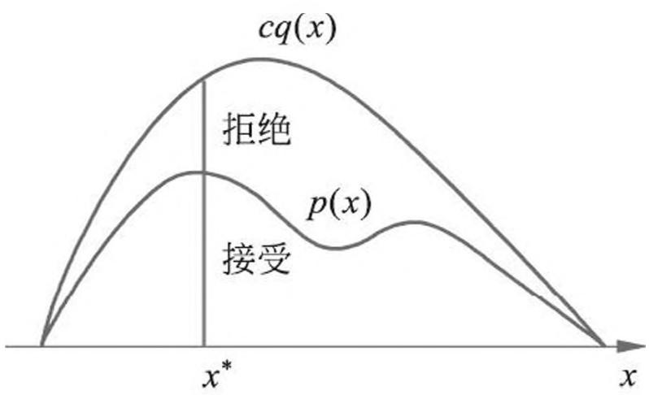

> 图 19.1 接受-拒绝抽样法（见彩图）

接受-拒绝法的具体算法如下。

## 算法 19.1（接受-拒绝法）

输入：抽样的目标概率分布的概率密度函数 $p(x)$输出：概率分布的随机样本 $x_{1}, x_{2}, \dots, x_{n}$ 。

参数：样本数 $n$

- （1）选择概率密度函数为 $q(x)$ 的概率分布，作为建议分布，使其对任一 $x$ 满足 $c q ( x ) \geqslant p ( x )$ ，其中 $c > 0$ 。
- （2）按照建议分布 $q(x)$ 随机抽样得到样本 $x^{*}$ ，再按照均匀分布在 $(0,1)$ 范围内抽样得到 $u$ 。
- (3) 如果 $u \leqslant \frac{p(x^{*})}{cq(x^{*})}$ , 则将 $x^{*}$ 作为抽样结果; 否则, 回到步骤 (2)。

（4）直至得到 $n$ 个随机样本，结束。

接受-拒绝法的优点是容易实现，缺点是效率可能不高。如果 $p(x)$ 的涵盖体积占 $cq(x)$ 的涵盖体积的比例很低，就会导致拒绝的比例很高，抽样效率很低。注意，一般是在高维空间进行抽样，即使 $p(x)$ 与 $cq(x)$ 很接近，两者涵盖体积的差异也可能很大（与我们在三维空间的直观不同）。

## 19.1.2 数学期望估计

一般的蒙特卡罗法，如直接抽样法、接受-拒绝抽样法、重要性抽样法，也可以用于数学期望估计（estimation of mathematical expectation）。假设有随机变量 $x$ ，取值 $x \in \mathcal{X}$ ，其概率密度函数为 $p(x)$ ， $f(x)$ 为定义在 $\mathcal{X}$ 上的函数，目标是求函数 $f(x)$ 关于密度函数 $p(x)$ 的数学期望 $E_{p(x)}[f(x)]$ 。

针对这个问题，蒙特卡罗法按照概率分布 $p(x)$ 独立地抽取 $n$ 个样本 $x_{1}, x_{2}, \dots, x_{n}$ ，比如用以上的抽样方法，之后计算函数 $f(x)$ 的样本均值 $\hat{f}_n$

$$
\hat {f} _ {n} = \frac {1}{n} \sum_ {i = 1} ^ {n} f \left(x _ {i}\right) \tag {19.1}
$$

作为数学期望 $E_{p(x)}[f(x)]$ 的近似值。

根据大数定律可知，当样本容量增大时，样本均值以概率 1 收敛于数学期望：

$$
\hat {f} _ {n} \rightarrow E _ {p (x)} [ f (x) ], \quad n \rightarrow \infty \tag {19.2}
$$

这样就得到了数学期望的近似计算方法：

$$
E _ {p (x)} [ f (x) ] \approx \frac {1}{n} \sum_ {i = 1} ^ {n} f \left(x _ {i}\right) \tag {19.3}
$$

## 19.1.3 积分计算

一般的蒙特卡罗法也可以用于定积分的近似计算，称为蒙特卡罗积分（Monte Carlo integration）。假设有一个函数 $h(x)$ ，目标是计算该函数的积分

$$
\int_ {\mathcal {X}} h (x) \mathrm {d} x
$$

如果能够将函数 $h(x)$ 分解成一个函数 $f(x)$ 和一个概率密度函数 $p(x)$ 的乘积的形式，那么就有

$$
\int_ {\mathcal {X}} h (x) \mathrm {d} x = \int_ {\mathcal {X}} f (x) p (x) \mathrm {d} x = E _ {p (x)} [ f (x) ] \tag {19.4}
$$

于是函数 $h(x)$ 的积分可以表示为函数 $f(x)$ 关于概率密度函数 $p(x)$ 的数学期望。实际上，给定一个概率密度函数 $p(x)$ ，只要取 $f(x) = \frac{h(x)}{p(x)}$ ，就可得式 (19.4)。就是说，任何一个函数的积分都可以表示为某一个函数的数学期望的形式。而函数的数学期望又可以通过函数的样本均值估计。于是，就可以利用样本均值来近似计算积分。这就是蒙特卡罗积分的基本想法。

$$
\int_ {\mathcal {X}} h (x) \mathrm {d} x = E _ {p (x)} [ f (x) ] \approx \frac {1}{n} \sum_ {i = 1} ^ {n} f \left(x _ {i}\right) \tag {19.5}
$$

例 19.1 用蒙特卡罗积分法求 $\int_0^1\mathrm{e}^{-x^2 /2}\mathrm{d}x$解 令 $f(x) = \mathrm{e}^{-x^2 /2}$

$$
p (x) = 1 \quad (0 <   x <   1)
$$

也就是说，假设随机变量 $x$ 在 $(0,1)$ 区间遵循均匀分布。

使用蒙特卡罗积分法，如图 19.2 所示，在(0,1)区间按照均匀分布抽取 10 个随机样本 $x_{1}, x_{2}, \dots, x_{10}$ 。计算样本的函数均值 $\hat{f}_{10}$

$$
\hat {f} _ {1 0} = \frac {1}{1 0} \sum_ {i = 1} ^ {1 0} \mathrm {e} ^ {- x _ {i} ^ {2} / 2} = 0. 8 3 2
$$

也就是积分的近似。随机样本数越大，计算就越精确。

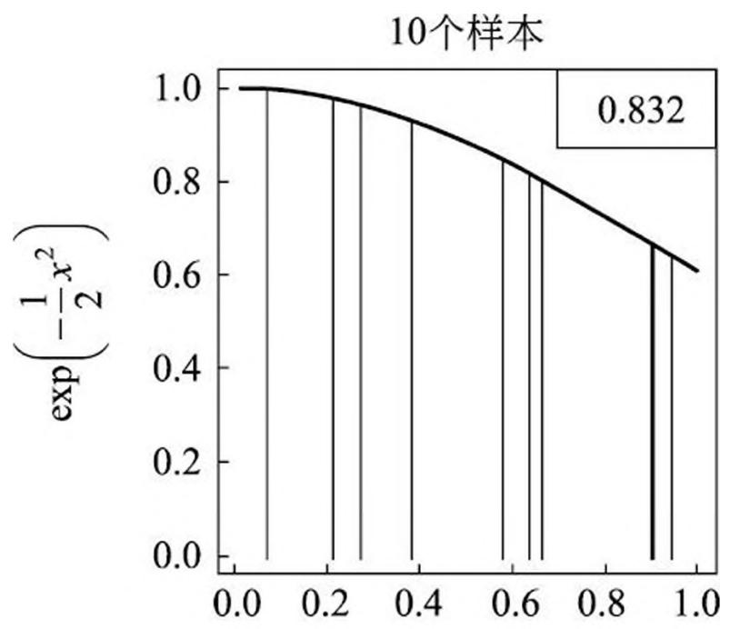

> 图 19.2 蒙特卡罗积分例

例 19.2 用蒙特卡罗积分法求 $\int_{-\infty}^{\infty}x\frac{1}{\sqrt{2\pi}}\exp \left(\frac{-x^2}{2}\right)\mathrm{d}x$ 。

解 令 $f(x) = x$

$$
p (x) = \frac {1}{\sqrt {2 \pi}} \exp \left(\frac {- x ^ {2}}{2}\right)
$$

$p(x)$ 是标准正态分布的密度函数。

使用蒙特卡罗积分法，按照标准正态分布在区间 $(-\infty, \infty)$ 抽样 $x_{1}, x_{2}, \dots, x_{n}$ ，取其平均值，就得到要求的积分值。当样本增大时，积分值趋于 0。

本章介绍的马尔科夫链蒙特卡罗法也适合于概率密度函数复杂，不能直接抽样的情况，旨在解决一般的蒙特卡罗法，如接受-拒绝抽样法、重要性抽样法，抽样效率不高的问题。一般的蒙特卡罗法中的抽样样本是独立的，而马尔可夫链蒙特卡罗法中的抽样样本不是独立的，样本序列形成马尔科夫链。

## 19.2 马尔可夫链

本节首先给出马尔可夫链的定义，之后介绍马尔可夫链的一些性质。马尔可夫链蒙特卡罗法用到这些性质。

## 19.2.1 基本定义

定义 19.1（马尔可夫链）考虑一个随机变量的序列 $X = \{X_0, X_1, \dots, X_t, \dots\}$ ，这里 $X_t$ 表示时刻 $t$ 的随机变量， $t = 0, 1, 2, \dots$ 。每个随机变量 $X_t (t = 0, 1, 2, \dots)$ 的取值集合相同，称为状态空间，表示为 $\mathcal{S}$ 。随机变量可以是离散的，也可以是连续的。以上随机变量的序列构成随机过程（stochastic process）。

假设在时刻 0 的随机变量 $X_0$ 遵循概率分布 $P(X_0) = \pi_0$ ，称为初始状态分布。在某个时刻 $t\geqslant 1$ 的随机变量 $X_{t}$ 与前一个时刻的随机变量 $X_{t - 1}$ 之间有条件分布 $P(X_{t}|X_{t - 1})$ ，如果 $X_{t}$ 只依赖于 $X_{t - 1}$ ，而不依赖于过去的随机变量 $\{X_0,X_1,\dots ,X_{t - 2}\}$ ，这一性质称为马尔可夫性，即

$$
P \left(X _ {t} \mid X _ {0}, X _ {1}, \dots , X _ {t - 1}\right) = P \left(X _ {t} \mid X _ {t - 1}\right), \quad t = 1, 2, \dots \tag {19.6}
$$

具有马尔可夫性的随机序列 $X = \{X_0, X_1, \dots, X_t, \dots\}$ 称为马尔可夫链（Markov chain），或马尔可夫过程（Markov process）。条件概率分布 $P(X_t | X_{t-1})$ 称为马尔可夫链的转移概率分布。转移概率分布决定了马尔可夫链的特性。

马尔可夫性的直观解释是“未来只依赖于现在（假设现在已知），而与过去无关”。这个假设在许多应用中是合理的。

若转移概率分布 $P(X_{t}|X_{t - 1})$ 与 $t$ 无关，即

$$
P \left(X _ {t + s} \mid X _ {t - 1 + s}\right) = P \left(X _ {t} \mid X _ {t - 1}\right), \quad t = 1, 2, \dots ; \quad s = 1, 2, \dots \tag {19.7}
$$

则称该马尔可夫链为时间齐次的马尔可夫链（time homogenous Markov chain）。本书中提到的马尔可夫链都是时间齐次的。

以上定义的是一阶马尔可夫链，可以扩展到 $n$ 阶马尔可夫链，满足 $n$ 阶马尔可夫性

$$
P \left(X _ {t} \mid X _ {0} X _ {1} \dots X _ {t - 2} X _ {t - 1}\right) = P \left(X _ {t} \mid X _ {t - n} \dots X _ {t - 2} X _ {t - 1}\right) \tag {19.8}
$$

本书主要考虑一阶马尔可夫链。容易验证 $n$ 阶马尔可夫链可以转换为一阶马尔可夫链。

## 19.2.2 离散状态马尔可夫链

## 1. 转移概率矩阵和状态分布

离散状态马尔可夫链 $X = \{X_0, X_1, \dots, X_t, \dots\}$ ，随机变量 $X_{t}(t = 0,1,2,\dots)$ 定义在离散空间 $S$ ，转移概率分布可以由矩阵表示。

若马尔可夫链在时刻 $(t - 1)$ 处于状态 $j$ ，在时刻 $t$ 移动到状态 $i$ ，将转移概率记作

$$
p _ {i j} = \left(X _ {t} = i \mid X _ {t - 1} = j\right), \quad i = 1, 2, \dots ; \quad j = 1, 2, \dots \tag {19.9}
$$

满足

$$
p _ {i j} \geqslant 0, \quad \sum_ {i} p _ {i j} = 1
$$

马尔可夫链的转移概率 $p_{ij}$ 可以由矩阵表示，即

$$
P = \left[ \begin{array}{c c c c} p _ {1 1} & p _ {1 2} & p _ {1 3} & \dots \\ p _ {2 1} & p _ {2 2} & p _ {2 3} & \dots \\ p _ {3 1} & p _ {3 2} & p _ {3 3} & \dots \\ \dots & \dots & \dots & \dots \end{array} \right] \tag {19.10}
$$

称为马尔可夫链的转移概率矩阵，转移概率矩阵 $P$ 满足条件 $p_{ij} \geqslant 0, \sum_{i} p_{ij} = 1$ 。满足这两个条件的矩阵称为随机矩阵（stochastic matrix）。注意这里矩阵列元素之和为 1。

考虑马尔可夫链 $X = \{X_0, X_1, \dots, X_t, \dots\}$ 在时刻 $t$ （ $t = 0, 1, 2, \dots$ ）的概率分布，称为时刻 $t$ 的状态分布，记作

$$
\pi (t) = \left[ \begin{array}{c} \pi_ {1} (t) \\ \pi_ {2} (t) \\ \vdots \end{array} \right] \tag {19.11}
$$

其中 $\pi_i(t)$ 表示时刻 $t$ 状态为 $i$ 的概率 $P(X_{t} = i)$

$$
\pi_ {i} (t) = P (X _ {t} = i), \quad i = 1, 2, \dots
$$

特别地，马尔可夫链的初始状态分布可以表示为

$$
\pi (0) = \left[ \begin{array}{c} \pi_ {1} (0) \\ \pi_ {2} (0) \\ \vdots \end{array} \right] \tag {19.12}
$$

其中 $\pi_i(0)$ 表示时刻 0 状态为 $i$ 的概率 $P(X_0 = i)$ 。通常初始分布 $\pi(0)$ 的向量只有一个分量是 1，其余分量都是 0，表示马尔可夫链从一个具体状态开始。

有限离散状态的马尔可夫链可以由有向图表示。结点表示状态，边表示状态之间的转移，边上的数值表示转移概率。从一个初始状态出发，根据有向边上定义的概率在状态之间随机跳转（或随机转移），就可以产生状态的序列。马尔可夫链实际上是刻画随时间在状态之间转移的模型，假设未来的转移状态只依赖于现在的状态，而与过去的状态无关。

下面通过一个简单的例子给出马尔可夫链的直观解释。假设观察某地的天气，按日依次是“晴，雨，晴，晴，晴，雨，晴……”，具有一定的规律。马尔可夫链可以刻画这个过程。假设天气的变化具有马尔可夫性，即明天的天气只依赖于今天的天气，而与昨天及以前的天气无关。这个假设经验上是合理的，至少是现实情况的近似。具体地，比如，如果今天是晴天，那么明天是晴天的概率是 0.9，是雨天的概率是 0.1；如果今天是雨天，那么明天是晴天的概率是 0.5，是雨天的概率也是 0.5。图 19.3 表示这个马尔可夫链。基于这个马尔可夫链，从一个初始状态出发，随时间在状态之间随机转移，就可以产生天气的序列，可以对天气进行预测。

下面看一个马尔可夫链应用的例子。自然语言处理、语音处理中经常用到语言模型（language model），是建立在词表上的 $n$ 阶马尔可夫链。比如，在英语语音识别中，语音模型产生出两个候选：“How to recognize speech”与“How to wreck a nice

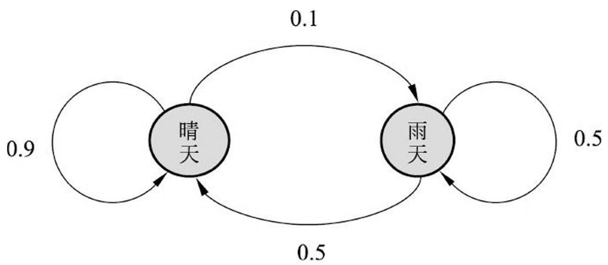

> 图 19.3 马尔可夫链例

beach”①，要判断哪个可能性更大。显然从语义的角度前者的可能性更大，语言模型可以帮助做出这个判断。

> - (1) 这两句英文的发音相近, 但后者语义不可解释。

将一个语句看作是一个单词的序列 $w_{1}w_{2}\dots w_{s}$ , 目标是计算其概率。同一个语句很少在语料中重复多次出现, 所以直接从语料中估计每个语句的概率是困难的。语言模型用局部的单词序列的概率, 组合计算出全局的单词序列的概率, 可以很好地解决这个问题。

假设每个单词只依赖于其前面出现的单词，也就是说单词序列具有马尔可夫性，那么可以定义一阶马尔可夫链，即语言模型，如下计算语句的概率。

$$
\begin{array}{l} P (w _ {1} w _ {2} \dots w _ {s}) \\ = P \left(w _ {1}\right) P \left(w _ {2} \mid w _ {1}\right) P \left(w _ {3} \mid w _ {1} w _ {2}\right) \dots P \left(w _ {i} \mid w _ {1} w _ {2} \dots w _ {i - 1}\right) \dots P \left(w _ {s} \mid w _ {1} w _ {2} \dots w _ {s - 1}\right) \\ = P \left(w _ {1}\right) P \left(w _ {2} \mid w _ {1}\right) P \left(w _ {3} \mid w _ {2}\right) \dots P \left(w _ {i} \mid w _ {i - 1}\right) \dots P \left(w _ {s} \mid w _ {s - 1}\right) \\ \end{array}
$$

这里第三个等式基于马尔可夫链假设。这个马尔可夫链中，状态空间为词表，一个位置上单词的产生只依赖于前一个位置的单词，而不依赖于更前面的单词。以上是一阶马尔可夫链，一般可以扩展到 $n$ 阶马尔可夫链。

语言模型的学习等价于确定马尔可夫链中的转移概率值，如果有充分的语料，转移概率可以直接从语料中估计。直观上，“wreck a nice”出现之后，下面出现“beach”的概率极低，所以第二个语句的概率应该更小，从语言模型的角度看第一个语句的可能性更大。

马尔可夫链 $X$ 在时刻 $t$ 的状态分布，可以由在时刻 $(t - 1)$ 的状态分布以及转移概率分布决定

$$
\pi (t) = P \pi (t - 1) \tag {19.13}
$$

这是因为

$$
\begin{array}{l} \pi_ {i} (t) = P \left(X _ {t} = i\right) \\ = \sum_ {m} P (X _ {t} = i | X _ {t - 1} = m) P (X _ {t - 1} = m) \\ = \sum_ {m} p _ {i m} \pi_ {m} (t - 1) \\ \end{array}
$$

马尔可夫链在时刻 $t$ 的状态分布，可以通过递推得到。事实上，由式(19.13)

$$
\pi (t) = P \pi (t - 1) = P (P \pi (t - 2)) = P ^ {2} \pi (t - 2)
$$

递推得到

$$
\pi (t) = P ^ {t} \pi (0) \tag {19.14}
$$

这里的 $P^t$ 称为 $t$ 步转移概率矩阵，

$$
P _ {i j} ^ {t} = P (X _ {t} = i | X _ {0} = j)
$$

表示时刻 0 从状态 $j$ 出发，时刻 $t$ 达到状态 $i$ 的 $t$ 步转移概率。 $P^t$ 也是随机矩阵。式(19.14)说明，马尔可夫链的状态分布由初始分布和转移概率分布决定。

对图 19.3 中的马尔可夫链，转移矩阵为

$$
P = \left[ \begin{array}{c c} 0. 9 & 0. 5 \\ 0. 1 & 0. 5 \end{array} \right]
$$

如果第一天是晴天的话，其天气概率分布（初始状态分布）如下：

$$
\pi (0) = \left[ \begin{array}{l} 1 \\ 0 \end{array} \right]
$$

根据这个马尔可夫链模型，可以计算第二天、第三天及之后的天气概率分布（状态分布）。

$$
\begin{array}{l} \pi (1) = P \pi (0) = \left[ \begin{array}{c c} 0. 9 & 0. 5 \\ 0. 1 & 0. 5 \end{array} \right] \left[ \begin{array}{c} 1 \\ 0 \end{array} \right] = \left[ \begin{array}{c} 0. 9 \\ 0. 1 \end{array} \right] \\ \pi (2) = P ^ {2} \pi (0) = \left[ \begin{array}{c c} 0. 9 & 0. 5 \\ 0. 1 & 0. 5 \end{array} \right] ^ {2} \left[ \begin{array}{c} 1 \\ 0 \end{array} \right] = \left[ \begin{array}{c} 0. 8 6 \\ 0. 1 4 \end{array} \right] \\ \end{array}
$$

## 2. 平稳分布

定义 19.2（平稳分布）设有马尔可夫链 $X = \{X_0, X_1, \dots, X_t, \dots\}$ ，其状态空间为 $S$ ，转移概率矩阵为 $P = (p_{ij})$ ，如果存在状态空间 $S$ 上的一个分布

$$
\pi = \left[ \begin{array}{c} \pi_ {1} \\ \pi_ {2} \\ \vdots \\ \cdot \end{array} \right]
$$

使得

$$
\pi = P \pi \tag {19.15}
$$

则称 $\pi$ 为马尔可夫链 $X = \{X_0, X_1, \dots, X_t, \dots\}$ 的平稳分布。

直观上，如果马尔可夫链的平稳分布存在，那么以该平稳分布作为初始分布，面向未来进行随机状态转移，之后任何一个时刻的状态分布都是该平稳分布。

引理 19.1 给定一个马尔可夫链 $X = \{X_0, X_1, \dots, X_t, \dots\}$ ，状态空间为 $\mathcal{S}$ ，转移概率矩阵为 $P = (p_{ij})$ ，则分布 $\pi = (\pi_1, \pi_2, \dots)^{\mathrm{T}}$ 为 $X$ 的平稳分布的充分必要条件是 $\pi = (\pi_1, \pi_2, \dots)^{\mathrm{T}}$ 是下列方程组的解：

$$
x _ {i} = \sum_ {j} p _ {i j} x _ {j}, \quad i = 1, 2, \dots \tag {19.16}
$$

$$
x _ {i} \geqslant 0, \quad i = 1, 2, \dots \tag {19.17}
$$

$$
\sum_ {i} x _ {i} = 1 \tag {19.18}
$$

证明 必要性。假设 $\pi = (\pi_1, \pi_2, \dots)^{\mathrm{T}}$ 是平稳分布，显然满足式 (19.17) 和式 (19.18)。又

$$
\pi_ {i} = \sum_ {j} p _ {i j} \pi_ {j}, \quad i = 1, 2, \dots
$$

即 $\pi = (\pi_1,\pi_2,\dots)^{\mathrm{T}}$ 满足式(19.16)。

充分性。由式 (19.17) 和式 (19.18) 知 $\pi = (\pi_1, \pi_2, \dots)^{\mathrm{T}}$ 是一概率分布。假设 $\pi = (\pi_1, \pi_2, \dots)^{\mathrm{T}}$ 为 $X_t$ 的分布，则

$$
P (X _ {t} = i) = \pi_ {i} = \sum_ {j} p _ {i j} \pi_ {j} = \sum_ {j} p _ {i j} P (X _ {t - 1} = j), \quad i = 1, 2, \dots
$$

$\pi = (\pi_1, \pi_2, \dots)^{\mathrm{T}}$ 也为 $X_{t-1}$ 的分布。事实上这对任意 $t$ 成立。所以 $\pi = (\pi_1, \pi_2, \dots)^{\mathrm{T}}$ 是马尔可夫链的平稳分布。

引理 19.1 给出一个求马尔可夫链平稳分布的方法。

例 19.3 设有图 19.4 所示马尔可夫链，其转移概率矩阵为

$$
P = \left[ \begin{array}{c c c} 1 / 2 & 1 / 2 & 1 / 4 \\ 1 / 4 & 0 & 1 / 4 \\ 1 / 4 & 1 / 2 & 1 / 2 \end{array} \right]
$$

求其平稳分布。

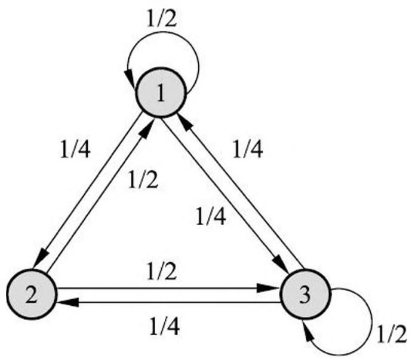

> 图 19.4 马尔可夫链例

解 设平稳分布为 $\pi = (x_{1}, x_{2}, x_{3})^{\mathrm{T}}$ ，则由式 (19.16)~式 (19.18) 有

$$
\begin{array}{l} x _ {1} = \frac {1}{2} x _ {1} + \frac {1}{2} x _ {2} + \frac {1}{4} x _ {3} \\ x _ {2} = \frac {1}{4} x _ {1} + \frac {1}{4} x _ {3} \\ x _ {3} = \frac {1}{4} x _ {1} + \frac {1}{2} x _ {2} + \frac {1}{2} x _ {3} \\ x _ {1} + x _ {2} + x _ {3} = 1 \\ x _ {i} \geqslant 0, \quad i = 1, 2, 3 \\ \end{array}
$$

解方程组，得到唯一的平稳分布

$$
\pi = \left( \begin{array}{l l l} 2 / 5 & 1 / 5 & 2 / 5 \end{array} \right) ^ {\mathrm {T}}
$$

例 19.4 设有图 19.5 所示马尔可夫链，其转移概率分布如下，求其平稳分布。

$$
\left[ \begin{array}{c c c} 1 & 1 / 3 & 0 \\ 0 & 1 / 3 & 0 \\ 0 & 1 / 3 & 1 \end{array} \right]
$$

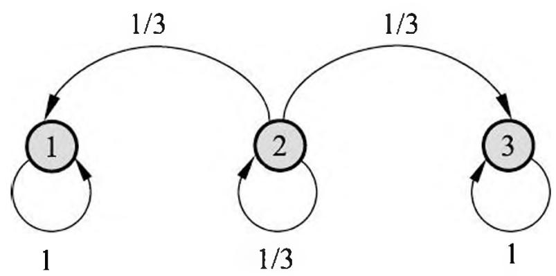

> 图 19.5 马尔可夫链例

解 这个马尔可夫链的平稳分布并不唯一， $\pi = (3/401/4)^{\mathrm{T}}$ ， $\pi = (2/301/3)^{\mathrm{T}}$ 等皆为其平稳分布。

马尔可夫链可能存在唯一平稳分布，无穷多个平稳分布，或不存在平稳分布 ①。

> - ① 当离散状态马尔可夫链有无穷个状态时，有可能没有平稳分布。

## 19.2.3 连续状态马尔可夫链

连续状态马尔可夫链 $X = \{X_0, X_1, \dots, X_t, \dots\}$ ，随机变量 $X_{t}(t = 0,1,2,\dots)$ 定义在连续状态空间 $S$ ，转移概率分布由概率转移核或转移核（transition kernel）表示。

设 $S$ 是连续状态空间，对任意的 $x \in S, A \subset S$ ，转移核 $P(x, A)$ 定义为

$$
P (x, A) = \int_ {A} p (x, y) \mathrm {d} y \tag {19.19}
$$

其中 $p(x, \cdot)$ 是概率密度函数，满足 $p(x, \cdot) \geqslant 0$ ， $P(x, S) = \int_{S} p(x, y) \, \mathrm{d}y = 1$ 。转移核 $P(x, A)$ 表示从 $x \sim A$ 的转移概率

$$
P \left(X _ {t} = A \mid X _ {t - 1} = x\right) = P (x, A) \tag {19.20}
$$

有时也将概率密度函数 $p(x, \cdot)$ 称为转移核。

若马尔可夫链的状态空间 $S$ 上的概率分布 $\pi (x)$ 满足条件

$$
\pi (y) = \int p (x, y) \pi (x) \mathrm {d} x, \quad \forall y \in S \tag {19.21}
$$

则称分布 $\pi (x)$ 为该马尔可夫链的平稳分布。等价地，

$$
\pi (A) = \int P (x, A) \pi (x) \mathrm {d} x, \quad \forall A \subset S \tag {19.22}
$$

或简写为

$$
\pi = P \pi \tag {19.23}
$$

## 19.2.4 马尔可夫链的性质

以下介绍离散状态马尔可夫链的性质。可以自然推广到连续状态马尔可夫链。

## 1. 不可约

定义 19.3（不可约）设有马尔可夫链 $X = \{X_0, X_1, \dots, X_t, \dots\}$ ，状态空间为 $\mathcal{S}$ ，对于任意状态 $i, j \in \mathcal{S}$ ，如果存在一个时刻 $t(t > 0)$ 满足

$$
P \left(X _ {t} = i \mid X _ {0} = j\right) > 0 \tag {19.24}
$$

也就是说，时刻 0 从状态 $j$ 出发，时刻 $t$ 到达状态 $i$ 的概率大于 0，则称此马尔可夫链 $X$ 是不可约的（irreducible），否则称马尔可夫链是可约的（reducible）。

直观上，一个不可约的马尔可夫链，从任意状态出发，当经过充分长时间后，可以到达任意状态。例 19.3 中的马尔可夫链是不可约的，例 19.5 中的马尔可夫链是可约的。

例 19.5 图 19.6 所示马尔可夫链是可约的。

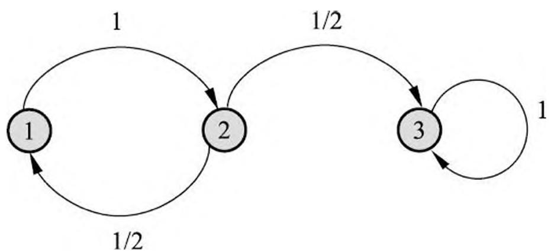

> 图 19.6 马尔可夫链例

解 转移概率矩阵

$$
\left[ \begin{array}{c c c} 0 & 1 / 2 & 0 \\ 1 & 0 & 0 \\ 0 & 1 / 2 & 1 \end{array} \right]
$$

平稳分布 $\pi = (0 0 1)^{\mathrm{T}}$ 。此马尔可夫链, 转移到状态 3 后, 就在该状态上循环跳转,不能到达状态 1 和状态 2 , 最终停留在状态 3 。

## 2. 非周期

定义 19.4（非周期）设有马尔可夫链 $X = \{X_0, X_1, \dots, X_t, \dots\}$ ，状态空间为 $S$ ，对于任意状态 $i \in S$ ，如果时刻 0 从状态 $i$ 出发， $t$ 时刻返回状态的所有时间长 $\{t: P(X_{t} = i \mid X_{0} = i) > 0\}$ 的最大公约数是 1，则称此马尔可夫链 $X$ 是非周期的（aperiodic），否则称马尔可夫链是周期的（periodic）。

直观上，一个非周期性的马尔可夫链，不存在一个状态，从这一个状态出发，再返回到这个状态时所经历的时间长呈一定的周期性。例 19.3 中的马尔可夫链是非周期的，例 19.6 中的马尔可夫链是周期的。

例 19.6 图 19.7 所示的马尔可夫链是周期的。

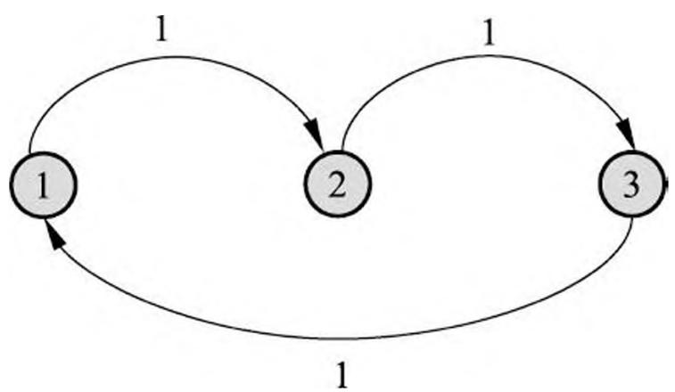

> 图 19.7 马尔可夫链例

解 转移概率矩阵

$$
\left[ \begin{array}{c c c} 0 & 0 & 1 \\ 1 & 0 & 0 \\ 0 & 1 & 0 \end{array} \right]
$$

其平稳分布是 $\pi = (1/3 \quad 1/3 \quad 1/3)^{\mathrm{T}}$ 。此马尔可夫链从每个状态出发，返回该状态的时刻都是 3 的倍数， $\{3,6,9\}$ ，具有周期性，最终停留在每个状态的概率都为 $1/3$ 。

定理 19.2 不可约且非周期的有限状态马尔可夫链，有唯一平稳分布存在。

## 3. 正常返

定义 19.5（正常返）设有马尔可夫链 $X = \{X_0, X_1, \dots, X_t, \dots\}$ ，状态空间为 $S$ ，对于任意状态 $i, j \in S$ ，定义概率 $p_{ij}^t$ 为时刻 0 从状态 $j$ 出发，时刻 $t$ 首次转移到状态 $i$ 的概率，即 $p_{ij}^t = P(X_t = i, X_s \neq i, s = 1, 2, \dots, t - 1 | X_0 = j), t = 1, 2, \dots$ 。若对所有状态 $i, j$ 都满足 $\lim_{t \to \infty} p_{ij}^t > 0$ ，则称马尔可夫链 $X$ 是正常返的（positive recurrent）。

直观上，一个正常返的马尔可夫链，其中任意一个状态，从其他任意一个状态出发，当时间趋于无穷时，首次转移到这个状态的概率不为 0。例 19.7 中的马尔可夫链根据不同条件是正常返的或不是正常返的。

例 19.7 图 19.8 所示无限状态马尔可夫链，当 $p > q$ 时是正常返的，当 $p \leqslant q$ 不是正常返的。

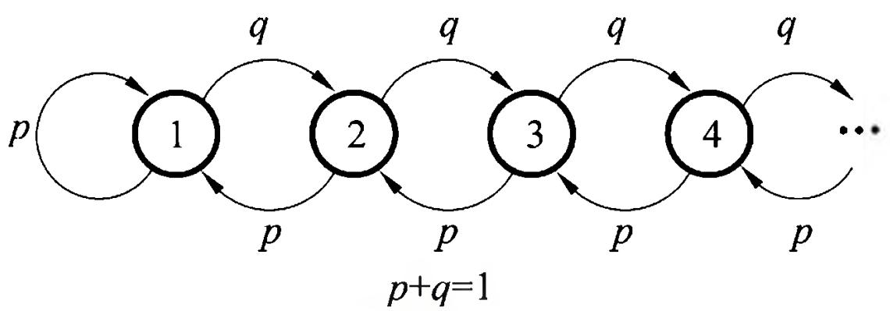

> 图 19.8 马尔可夫链例

解 转移概率矩阵

$$
\left[ \begin{array}{c c c c c} p & p & 0 & 0 \\ q & 0 & p & 0 \\ 0 & q & 0 & p \\ 0 & 0 & q & 0 \\ \vdots & & & \ddots \end{array} \right]
$$

当 $p > q$ 时，平稳分布是

$$
\pi_ {i} = \left(\frac {q}{p}\right) ^ {i} \left(\frac {p - q}{p}\right), \quad i = 1, 2, \dots
$$

当时间趋于无穷时，转移到任何一个状态的概率不为 0，马尔可夫链是正常返的。

当 $p \leqslant q$ 时，不存在平稳分布，马尔可夫链不是正常返的。

定理 19.3 不可约、非周期且正常返的马尔可夫链，有唯一平稳分布存在。

## 4. 遍历定理

下面叙述马尔可夫链的遍历定理。

定理 19.4（遍历定理）设有马尔可夫链 $X = \{X_0, X_1, \dots, X_t, \dots\}$ ，状态空间为 $S$ ，若马尔可夫链 $X$ 是不可约、非周期且正常返的，则该马尔可夫链有唯一平稳分布 $\pi = (\pi_1, \pi_2, \dots)^{\mathrm{T}}$ ，并且转移概率的极限分布是马尔可夫链的平稳分布

$$
\lim  _ {t \rightarrow \infty} P (X _ {t} = i | X _ {0} = j) = \pi_ {i}, \quad i = 1, 2, \dots ; \quad j = 1, 2, \dots \tag {19.25}
$$

若 $f(X)$ 是定义在状态空间上的函数， $E_{\pi}[|f(X)|] < \infty$ ，则

$$
P \left\{\hat {f _ {t}} \rightarrow E _ {\pi} [ f (X) ] \right\} = 1 \tag {19.26}
$$

这里

$$
\hat {f} _ {t} = \frac {1}{t} \sum_ {s = 1} ^ {t} f (x _ {s})
$$

$E_{\pi}[f(X)] = \sum_{i} f(i) \pi_{i}$ 是 $f(X)$ 关于平稳分布 $\pi = (\pi_1, \pi_2, \dots)^{\mathrm{T}}$ 的数学期望，式(19.26)表示

$$
\hat {f} _ {t} \rightarrow E _ {\pi} [ f (X) ], \quad t \rightarrow \infty \tag {19.27}
$$

几乎处处成立或以概率 1 成立。

遍历定理的直观解释：满足相应条件的马尔可夫链，当时间趋于无穷时，马尔可夫链的状态分布趋近于平稳分布，随机变量的函数的样本均值以概率 1 收敛于该函数的数学期望。样本均值可以认为是时间均值，而数学期望是空间均值。遍历定理实际表述了遍历性的含义：当时间趋于无穷时，时间均值等于空间均值。遍历定理的三个条件：不可约、非周期、正常返，保证了当时间趋于无穷时达到任意一个状态的概率不为 0。

理论上并不知道经过多少次迭代，马尔可夫链的状态分布才能接近于平稳分布，在实际应用遍历定理时，取一个足够大的整数 $m$ ，经过 $m$ 次迭代之后认为状态分布就是平稳分布，这时计算从第 $m + 1$ 次迭代到第 $n$ 次迭代的均值，即

$$
\hat {E} f = \frac {1}{n - m} \sum_ {i = m + 1} ^ {n} f \left(x _ {i}\right) \tag {19.28}
$$

称为遍历均值。

## 5. 可逆马尔可夫链

定义 19.6（可逆马尔可夫链）设有马尔可夫链 $X = \{X_0, X_1, \dots, X_t, \dots\}$ ，状态空间为 $\mathcal{S}$ ，转移概率矩阵为 $P$ ，如果有状态分布 $\pi = (\pi_1, \pi_2, \dots)^{\mathrm{T}}$ ，对于任意状态 $i, j \in \mathcal{S}$ ，对任意一个时刻 $t$ 满足

$$
P \left(X _ {t} = i \mid X _ {t - 1} = j\right) \pi_ {j} = P \left(X _ {t - 1} = j \mid X _ {t} = i\right) \pi_ {i}, \quad i, j = 1, 2, \dots \tag {19.29}
$$

或简写为

$$
p _ {j i} \pi_ {j} = p _ {i j} \pi_ {i}, \quad i, j = 1, 2, \dots \tag {19.30}
$$

则称此马尔可夫链 $X$ 为可逆马尔可夫链（reversible Markov chain），式 (19.30) 称为细致平衡方程（detailed balance equation）。

直观上，如果有可逆的马尔可夫链，那么以该马尔可夫链的平稳分布作为初始分布，进行随机状态转移，无论是面向未来还是面向过去，任何一个时刻的状态分布都是该平稳分布。例 19.3 中的马尔可夫链是可逆的，例 19.8 中的马尔可夫链是不可逆的。

例 19.8 图 19.9 所示马尔可夫链是不可逆的。

> 图 19.9 马尔可夫链例

解 转移概率矩阵

$$
\left[ \begin{array}{c c c} 1 / 4 & 1 / 2 & 1 / 4 \\ 1 / 4 & 0 & 1 / 2 \\ 1 / 2 & 1 / 2 & 1 / 4 \end{array} \right]
$$

平稳分布 $\pi = (8 / 25\quad 7 / 25\quad 2 / 5)^{\mathrm{T}}$ 。不满足细致平稳方程。

定理 19.5（细致平衡方程）满足细致平衡方程的状态分布 $\pi$ 就是该马尔可夫链的平稳分布。即

$$
P \pi = \pi
$$

证明 事实上

$$
(P \pi) _ {i} = \sum_ {j} p _ {i j} \pi_ {j} = \sum_ {j} p _ {j i} \pi_ {i} = \pi_ {i} \sum_ {j} p _ {j i} = \pi_ {i}, \quad i = 1, 2, \dots \tag {19.31}
$$

定理 19.5 说明，可逆马尔可夫链一定有唯一平稳分布，给出了一个马尔可夫链有平稳分布的充分条件（不是必要条件）。也就是说，可逆马尔可夫链满足遍历定理 19.4 的条件。

## 19.3 马尔可夫链蒙特卡罗法

## 19.3.1 基本想法

假设目标是对一个概率分布进行随机抽样，或者是求函数关于该概率分布的数学期望。可以采用传统的蒙特卡罗法，如接受-拒绝法、重要性抽样法，也可以使用马尔可夫链蒙特卡罗法。马尔可夫链蒙特卡罗法更适合于随机变量是多元的、密度函数是非标准形式的、随机变量各分量不独立等情况。

假设多元随机变量 $x$ ，满足 $x\in \mathcal{X}$ ，其概率密度函数为 $p(x)$ ， $f(x)$ 为定义在 $x\in \mathcal{X}$ 上的函数，目标是获得概率分布 $p(x)$ 的样本集合，以及求函数 $f(x)$ 的数学期望 $E_{p(x)}[f(x)]$ 。

应用马尔可夫链蒙特卡罗法解决这个问题。基本想法是：在随机变量 $x$ 的状态空间 $\mathcal{S}$ 上定义一个满足遍历定理的马尔可夫链 $X = \{X_0, X_1, \dots, X_t, \dots\}$ ，使其平稳分布就是抽样的目标分布 $p(x)$ 。然后在这个马尔可夫链上进行随机游走，每个时刻得到一个样本。根据遍历定理，当时间趋于无穷时，样本的分布趋近平稳分布，样本的函数均值趋近函数的数学期望。所以，当时间足够长时（时刻大于某个正整数 $m$ ），在之后的时间（时刻小于等于某个正整数 $n$ ， $n > m$ ）里随机游走得到的样本集合 $\{x_{m+1}, x_{m+2}, \dots, x_n\}$ 就是目标概率分布的抽样结果，得到的函数均值（遍历均值）就是要计算的数学期望值：

$$
\hat {E} f = \frac {1}{n - m} \sum_ {i = m + 1} ^ {n} f \left(x _ {i}\right) \tag {19.32}
$$

到时刻 $m$ 为止的时间段称为燃烧期。

如何构建具体的马尔可夫链成为这个方法的关键。连续变量的时候，需要定义转移核函数；离散变量的时候，需要定义转移矩阵。一个方法是定义特殊的转移核函数或者转移矩阵，构建可逆马尔可夫链，这样可以保证遍历定理成立。常用的马尔可夫链蒙特卡罗法有 Metropolis-Hastings 算法、吉布斯抽样。

由于这个马尔可夫链满足遍历定理，随机游走的起始点并不影响得到的结果，即从不同的起始点出发，都会收敛到同一平稳分布。

马尔可夫链蒙特卡罗法的收敛性的判断通常是经验性的，比如，在马尔可夫链上进行随机游走，检验遍历均值是否收敛。具体地，每隔一段时间取一次样本，得到多个样本以后，计算遍历均值，当计算的均值稳定后，认为马尔可夫链已经收敛。再比如，在马尔可夫链上并行进行多个随机游走，比较各个随机游走的遍历均值是否接近一致。

马尔可夫链蒙特卡罗法中得到的样本序列，相邻的样本点是相关的，而不是独立的。因此，在需要独立样本时，可以在该样本序列中再次进行随机抽样，比如每隔一段时间取一次样本，将这样得到的子样本集合作为独立样本集合。

马尔可夫链蒙特卡罗法比接受-拒绝法更容易实现，因为只需要定义马尔可夫链，而不需要定义建议分布。一般来说马尔可夫链蒙特卡罗法比接受-拒绝法效率更高，没有大量被拒绝的样本，虽然燃烧期的样本也要抛弃。

## 19.3.2 基本步骤

根据上面的讨论，可以将马尔可夫链蒙特卡罗法概括为以下三步：

- （1）首先，在随机变量 $x$ 的状态空间 $\mathcal{S}$ 上构造一个满足遍历定理的马尔可夫链，使其平稳分布为目标分布 $p(x)$ ；
- (2) 从状态空间的某一点 $x_0$ 出发, 用构造的马尔可夫链进行随机游走, 产生样本序列 $x_0, x_1, \dots, x_t, \dots$ 。
- （3）应用马尔可夫链的遍历定理，确定正整数 $m$ 和 $n$ ， $(m < n)$ ，得到样本集合 $\{x_{m + 1},x_{m + 2},\dots ,x_n\}$ ，求得函数 $f(x)$ 的均值（遍历均值）

$$
\hat {E} f = \frac {1}{n - m} \sum_ {i = m + 1} ^ {n} f \left(x _ {i}\right) \tag {19.33}
$$

就是马尔可夫链蒙特卡罗法的计算公式。

这里有几个重要问题：

- （1）如何定义马尔可夫链，保证马尔可夫链蒙特卡罗法的条件成立。
- (2) 如何确定收敛步数 $m$ , 保证样本抽样的无偏性。
- (3) 如何确定迭代步数 $n$ , 保证遍历均值计算的精度。

## 19.3.3 马尔可夫链蒙特卡罗法与统计学习

马尔可夫链蒙特卡罗法在统计学习，特别是贝叶斯学习中，起着重要的作用。主要是因为马尔可夫链蒙特卡罗法可以用在概率模型的学习和推理上。

假设观测数据由随机变量 $y \in \mathcal{Y}$ 表示，模型由随机变量 $x \in \mathcal{X}$ 表示，贝叶斯学习通过贝叶斯定理计算给定数据条件下模型的后验概率，并选择后验概率最大的模型。后验概率

$$
p (x \mid y) = \frac {p (x) p (y \mid x)}{\int_ {\mathcal {X}} p \left(y \mid x ^ {\prime}\right) p \left(x ^ {\prime}\right) \mathrm {d} x ^ {\prime}} \tag {19.34}
$$

贝叶斯学习中经常需要进行三种积分运算：归范化（normalization）、边缘化（marginalization）、数学期望（expectation）。

后验概率计算中需要归范化计算：

$$
\int_ {\mathcal {X}} p \left(y \mid x ^ {\prime}\right) p \left(x ^ {\prime}\right) \mathrm {d} x ^ {\prime} \tag {19.35}
$$

如果有隐变量 $z \in \mathcal{Z}$ , 后验概率的计算需要边缘化计算:

$$
p (x | y) = \int_ {z} p (x, z | y) \mathrm {d} z \tag {19.36}
$$

如果有一个函数 $f(x)$ ，可以计算该函数的关于后验概率分布的数学期望：

$$
E _ {P (x \mid y)} [ f (x) ] = \int_ {\mathcal {X}} f (x) p (x \mid y) \mathrm {d} x \tag {19.37}
$$

当观测数据和模型都很复杂的时候，以上的积分计算变得困难。马尔可夫链蒙特卡罗法为这些计算提供了一个通用的有效解决方案。

## 19.4 Metropolis-Hastings 算法

本节叙述 Metropolis-Hastings 算法，是马尔可夫链蒙特卡罗法的代表算法。

## 19.4.1 基本原理

## 1. 马尔可夫链

假设要抽样的概率分布为 $p(x)$ 。Metropolis-Hastings 算法采用转移核为 $p(x, x')$ 的马尔可夫链：

$$
p \left(x, x ^ {\prime}\right) = q \left(x, x ^ {\prime}\right) \alpha \left(x, x ^ {\prime}\right) \tag {19.38}
$$

其中 $q(x,x^{\prime})$ 和 $\alpha (x,x^{\prime})$ 分别称为建议分布（proposal distribution）和接受分布（acceptance distribution）。

建议分布 $q(x,x^{\prime})$ 是另一个马尔可夫链的转移核，并且 $q(x,x^{\prime})$ 是不可约的，即其概率值恒不为 0，同时是一个容易抽样的分布。接受分布 $\alpha (x,x^{\prime})$ 是

$$
\alpha \left(x, x ^ {\prime}\right) = \min  \left\{1, \frac {p \left(x ^ {\prime}\right) q \left(x ^ {\prime} , x\right)}{p (x) q \left(x , x ^ {\prime}\right)} \right\} \tag {19.39}
$$

这时，转移核 $p(x,x^{\prime})$ 可以写成

$$
p \left(x, x ^ {\prime}\right) = \left\{ \begin{array}{l l} q \left(x, x ^ {\prime}\right), & p \left(x ^ {\prime}\right) q \left(x ^ {\prime}, x\right) \geqslant p (x) q \left(x, x ^ {\prime}\right) \\ q \left(x ^ {\prime}, x\right) \frac {p \left(x ^ {\prime}\right)}{p (x)}, & p \left(x ^ {\prime}\right) q \left(x ^ {\prime}, x\right) <   p (x) q \left(x, x ^ {\prime}\right) \end{array} \right. \tag {19.40}
$$

转移核为 $p(x,x^{\prime})$ 的马尔可夫链上的随机游走以以下方式进行。如果在时刻$(t - 1)$ 处于状态 $x$ ，即 $x_{t - 1} = x$ ，则先按建议分布 $q(x,x^{\prime})$ 抽样产生一个候选状态 $x^{\prime}$ 然后按照接受分布 $\alpha (x,x^{\prime})$ 抽样决定是否接受状态 $x^{\prime}$ 。以概率 $\alpha (x,x^{\prime})$ 接受 $x^{\prime}$ ，决定时刻 $t$ 转移到状态 $x^{\prime}$ ，而以概率 $1 - \alpha (x,x^{\prime})$ 拒绝 $x^{\prime}$ ，决定时刻 $t$ 仍停留在状态 $x$ 。具体地，从区间(0,1)上的均匀分布中抽取一个随机数 $u$ ，决定时刻 $t$ 的状态。

$$
x _ {t} = \left\{ \begin{array}{l l} x ^ {\prime}, & u \leqslant \alpha (x, x ^ {\prime}) \\ x, & u > \alpha (x, x ^ {\prime}) \end{array} \right.
$$

可以证明，转移核为 $p(x,x^{\prime})$ 的马尔可夫链是可逆马尔可夫链（满足遍历定理），其平稳分布就是 $p(x)$ ，即要抽样的目标分布。也就是说这是马尔可夫链蒙特卡罗法的一个具体实现。

定理 19.6 由转移核 $(19.38) \sim (19.40)$ 构成的马尔可夫链是可逆的，即

$$
p (x) p \left(x, x ^ {\prime}\right) = p \left(x ^ {\prime}\right) p \left(x ^ {\prime}, x\right) \tag {19.41}
$$

并且 $p(x)$ 是该马尔可夫链的平稳分布。

证明 若 $x = x'$ ，则式（19.41）显然成立。

设 $x \neq x'$ ，则

$$
\begin{array}{l} p (x) p (x, x ^ {\prime}) = p (x) q (x, x ^ {\prime}) \operatorname * {m i n} \left\{1, \frac {p (x ^ {\prime}) q (x ^ {\prime} , x)}{p (x) q (x , x ^ {\prime})} \right\} \\ = \operatorname * {m i n} \left\{p (x) q (x, x ^ {\prime}), p (x ^ {\prime}) q (x ^ {\prime}, x) \right\} \\ = p (x ^ {\prime}) q (x ^ {\prime}, x) \operatorname * {m i n} \left\{\frac {p (x) q (x , x ^ {\prime})}{p (x ^ {\prime}) q (x ^ {\prime} , x)}, 1 \right\} \\ = p \left(x ^ {\prime}\right) p \left(x ^ {\prime}, x\right) \\ \end{array}
$$

式 (19.41) 成立。

由式（19.41）知，

$$
\begin{array}{l} \int p (x) p (x, x ^ {\prime}) \mathrm {d} x = \int p (x ^ {\prime}) p (x ^ {\prime}, x) \mathrm {d} x \\ = p (x ^ {\prime}) \int p (x ^ {\prime}, x) \mathrm {d} x \\ = p (x ^ {\prime}) \\ \end{array}
$$

根据平稳分布的定义 (19.21), $p(x)$ 是马尔可夫链的平稳分布。

## 2. 建议分布

建议分布 $q(x, x')$ 有多种可能的形式，这里介绍两种常用形式。

第一种形式，假设建议分布是对称的，即对任意的 $x$ 和 $x'$ 有

$$
q \left(x, x ^ {\prime}\right) = q \left(x ^ {\prime}, x\right) \tag {19.42}
$$

这样的建议分布称为 Metropolis 选择，也是 Metropolis-Hastings 算法最初采用的建议分布。这时，接受分布 $\alpha (x,x^{\prime})$ 简化为

$$
\alpha \left(x, x ^ {\prime}\right) = \min  \left\{1, \frac {p \left(x ^ {\prime}\right)}{p (x)} \right\} \tag {19.43}
$$

Metropolis 选择的一个特例是 $q(x, x')$ 取条件概率分布 $p(x'|x)$ ，定义为多元正态分布，其均值是 $x$ ，其协方差矩阵是常数矩阵。

Metropolis 选择的另一个特例是令 $q(x, x') = q(|x - x'|)$ ，这时算法称为随机游走 Metropolis 算法。例如，

$$
q (x, x ^ {\prime}) \propto \exp (- \frac {(x ^ {\prime} - x) ^ {2}}{2})
$$

Metropolis 选择的特点是当 $x'$ 与 $x$ 接近时， $q(x, x')$ 的概率值高，否则 $q(x, x')$ 的概率值低。状态转移在附近点的可能性更大。

第二种形式称为独立抽样。假设 $q(x,x^{\prime})$ 与当前状态 $\pmb{x}$ 无关，即 $q(x,x^{\prime}) = q(x^{\prime})$ 。建议分布的计算按照 $q(x^{\prime})$ 独立抽样进行。此时，接受分布 $\alpha (x,x^{\prime})$ 可以写成

$$
\alpha \left(x, x ^ {\prime}\right) = \min  \left\{1, \frac {w \left(x ^ {\prime}\right)}{w (x)} \right\} \tag {19.44}
$$

其中 $w(x^{\prime}) = p(x^{\prime}) / q(x^{\prime})$ ， $w(x) = p(x) / q(x)$ 。

独立抽样实现简单，但可能收敛速度慢，通常选择接近目标分布 $p(x)$ 的分布作为建议分布 $q(x)$ 。

## 3. 满条件分布

马尔可夫链蒙特卡罗法的目标分布通常是多元联合概率分布 $p(x) = p(x_{1},x_{2},\dots ,$ $x_{k})$ ，其中 $x = (x_{1},x_{2},\dots ,x_{k})^{\mathrm{T}}$ 为 $\pmb{k}$ 维随机变量。如果条件概率分布 $p(x_I|x_{-I})$ 中所有 $k$ 个变量全部出现，其中 $x_{I} = \{x_{i},i\in I\}$ ， $x_{-I} = \{x_i,i\notin I\}$ ， $I\subset K = \{1,2,\dots ,k\}$ 那么称这种条件概率分布为满条件分布（full conditional distribution）。

满条件分布有以下性质：对任意的 $x, x' \in \mathcal{X}$ 和任意的 $I \subset K$ ，有

$$
p \left(x _ {I} \mid x _ {- I}\right) = \frac {p (x)}{\int p (x) \mathrm {d} x _ {I}} \propto p (x) \tag {19.45}
$$

而且，对任意的 $x, x' \in \mathcal{X}$ 和任意的 $I \subset K$ ，有

$$
\frac {p \left(x _ {I} ^ {\prime} \mid x _ {- I} ^ {\prime}\right)}{p \left(x _ {I} \mid x _ {- I}\right)} = \frac {p \left(x ^ {\prime}\right)}{p (x)} \tag {19.46}
$$

Metropolis-Hastings 算法中, 可以利用性质 (19.46), 简化计算, 提高计算效率。具体地, 通过满条件分布概率的比 $\frac{p(x_I'|x_{-I}')}{p(x_I|x_{-I})}$ 计算联合概率的比 $\frac{p(x')}{p(x)}$ , 而前者更容易计算。

例 19.9 设 $x_{1}$ 和 $x_{2}$ 的联合概率分布的密度函数为

$$
p (x _ {1}, x _ {2}) \propto \exp \left\{- \frac {1}{2} (x _ {1} - 1) ^ {2} (x _ {2} - 1) ^ {2} \right\}
$$

求其满条件分布。

解 由满条件分布的定义有

$$
\begin{array}{l} p \left(x _ {1} \mid x _ {2}\right) \propto p \left(x _ {1}, x _ {2}\right) \\ \propto \exp \left\{- \frac {1}{2} (x _ {1} - 1) ^ {2} (x _ {2} - 1) ^ {2} \right\} \\ \propto N (1, (x _ {2} - 1) ^ {- 2}) \\ \end{array}
$$

这里 $N(1,(x_2 - 1)^{-2})$ 是均值为 1，方差为 $(x_{2} - 1)^{-2}$ 的正态分布，这时 $x_{1}$ 是变量， $x_{2}$ 是参数。同样可得

$$
\begin{array}{l} p (x _ {2} | x _ {1}) \propto p (x _ {1}, x _ {2}) \\ \propto \exp \left\{- \frac {1}{2} (x _ {2} - 1) ^ {2} (x _ {1} - 1) ^ {2} \right\} \\ \propto N (1, \left(x _ {1} - 1\right) ^ {- 2}) \\ \end{array}
$$

## 19.4.2 Metropolis-Hastings 算法

## 算法 19.2（Metropolis-Hastings 算法）

输入：抽样的目标分布的密度函数 $p(x)$ ，函数 $f(x)$输出： $p(x)$ 的随机样本 $x_{m + 1},x_{m + 2},\dots ,x_{n}$ ，函数样本均值 $f_{mn}$参数：收敛步数 $m$ ，迭代步数 $n$ 。

- （1）任意选择一个初始值 $x_0$
- (2) 对 $i = 1, 2, \dots, n$ 循环执行

- (a) 设状态 $x_{i-1} = x$ ，按照建议分布 $q(x, x')$ 随机抽取一个候选状态 $x'$ 。
- （b）计算接受概率

$$
\alpha (x, x ^ {\prime}) = \min \left\{1, \frac {p (x ^ {\prime}) q (x ^ {\prime} , x)}{p (x) q (x , x ^ {\prime})} \right\}
$$

（c）从区间 $(0,1)$ 中按均匀分布随机抽取一个数 $u$ 。

若 $u \leqslant \alpha(x, x')$ ，则状态 $x_i = x'$ ；否则，状态 $x_i = x$ 。

（3）得到样本集合 $\{x_{m + 1},x_{m + 2},\dots ,x_n\}$计算

$$
f _ {m n} = \frac {1}{n - m} \sum_ {i = m + 1} ^ {n} f (x _ {i})
$$

## 19.4.3 单分量 Metropolis-Hastings 算法

在 Metropolis-Hastings 算法中，通常需要对多元变量分布进行抽样，有时对多元变量分布的抽样是困难的。可以对多元变量的每一变量的条件分布依次分别进行抽样，从而实现对整个多元变量的一次抽样，这就是单分量 Metropolis-Hastings（single-component Metropolis-Hastings）算法。

假设马尔可夫链的状态由 $k$ 维随机变量表示

$$
\boldsymbol {x} = (x _ {1}, x _ {2}, \dots , x _ {k}) ^ {\mathrm {T}}
$$

其中 $x_{j}$ 表示随机变量 $x$ 的第 $j$ 个分量， $j = 1,2,\dots ,k$ ，而 $x^{(i)}$ 表示马尔可夫链在时刻 $i$ 的状态

$$
x ^ {(i)} = (x _ {1} ^ {(i)}, x _ {2} ^ {(i)}, \dots , x _ {k} ^ {(i)}) ^ {\mathrm {T}}, \quad i = 1, 2, \dots , n
$$

其中 $x_{j}^{(i)}$ 是随机变量 $x^{(i)}$ 的第 $j$ 个分量， $j = 1,2,\dots ,k$ 。

为了生成容量为 $n$ 的样本集合 $\{x^{(1)}, x^{(2)}, \dots, x^{(n)}\}$ ，单分量 Metropolis-Hastings 算法由下面的 $k$ 步迭代实现 Metropolis-Hastings 算法的一次迭代。

设在第 $(i - 1)$ 次迭代结束时分量 $x_{j}$ 的取值为 $x_{j}^{(i - 1)}$ ，在第 $i$ 次迭代的第 $j$ 步，对分量 $x_{j}$ 根据 Metropolis-Hastings 算法更新，得到其新的取值 $x_{j}^{(i)}$ 。首先，由建议分布 $q(x_{j}^{(i - 1)},x_{j}|x_{-j}^{(i)})$ 抽样产生分量 $x_{j}$ 的候选值 $x_{j}^{\prime (i)}$ ，这里 $x_{-j}^{(i)}$ 表示在第 $i$ 次迭代的第 $(j - 1)$ 步后的 $x^{(i)}$ 除去 $x_{j}^{(i - 1)}$ 的所有值，即

$$
x _ {- j} ^ {(i)} = (x _ {1} ^ {(i)}, \dots , x _ {j - 1} ^ {(i)}, x _ {j + 1} ^ {(i - 1)}, \dots , x _ {k} ^ {(i - 1)}) ^ {\mathrm {T}}
$$

其中分量 $1,2,\dots ,j - 1$ 已经更新。然后，按照接受概率

$$
\alpha \left(x _ {j} ^ {(i - 1)}, x _ {j} ^ {\prime (i)} \mid x _ {- j} ^ {(i)}\right) = \min  \left\{1, \frac {p \left(x _ {j} ^ {\prime (i)} \mid x _ {- j} ^ {(i)}\right) q \left(x _ {j} ^ {\prime (i)} , x _ {j} ^ {(i - 1)} \mid x _ {- j} ^ {(i)}\right)}{p \left(x _ {j} ^ {(i - 1)} \mid x _ {- j} ^ {(i)}\right) q \left(x _ {j} ^ {(i - 1)} , x _ {j} ^ {\prime (i)} \mid x _ {- j} ^ {(i)}\right)} \right\} \tag {19.47}
$$

抽样决定是否接受候选值 $x_{j}^{\prime(i)}$ 。如果 $x_{j}^{\prime(i)}$ 被接受，则令 $x_{j}^{(i)} = x_{j}^{\prime(i)}$ ；否则令 $x_{j}^{(i)} = x_{j}^{(i-1)}$ 。其余分量在第 $j$ 步不改变。马尔可夫链的转移概率为

$$
p \left(x _ {j} ^ {(i - 1)}, x _ {j} ^ {\prime (i)} \mid x _ {- j} ^ {(i)}\right) = \alpha \left(x _ {j} ^ {(i - 1)}, x _ {j} ^ {\prime (i)} \mid x _ {- j} ^ {(i)}\right) q \left(x _ {j} ^ {(i - 1)}, x _ {j} ^ {\prime (i)} \mid x _ {- j} ^ {(i)}\right) \tag {19.48}
$$

图 19.10 示意单分量 Metropolis-Hastings 算法的迭代过程。目标是对含有两个变量的随机变量 $x$ 进行抽样。如果变量 $x_{1}$ 或 $x_{2}$ 更新，那么在水平或垂直方向产生一个移动，连续水平和垂直移动产生一个新的样本点。注意由于建议分布可能不被接受，Metropolis-Hastings 算法可能在一些相邻的时刻不产生移动。

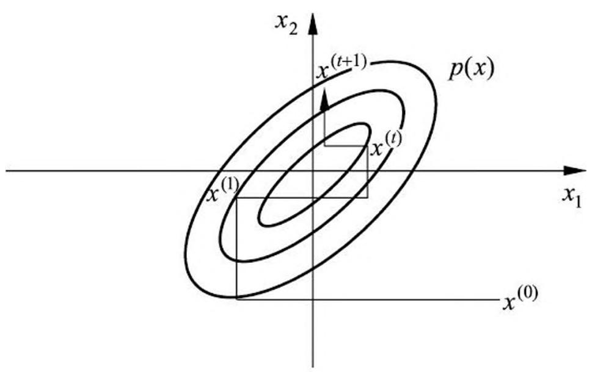

> 图 19.10 单分量 Metropolis-Hastings 算法例

## 19.5 吉布斯抽样

本节叙述马尔可夫链蒙特卡罗法的常用算法吉布斯抽样，可以认为是 Metropolis-Hastings 算法的特殊情况，但是更容易实现，因而被广泛使用。

## 19.5.1 基本原理

吉布斯抽样（Gibbs sampling）用于多元变量联合分布的抽样和估计 ①。其基本做法是，从联合概率分布定义满条件概率分布，依次对满条件概率分布进行抽样，得到样本的序列。可以证明这样的抽样过程是在一个马尔可夫链上的随机游走，每一个样本对应着马尔可夫链的状态，平稳分布就是目标的联合分布。整体成为一个马尔可夫链蒙特卡罗法，燃烧期之后的样本就是联合分布的随机样本。

> - ① 吉布斯抽样以统计力学奠基人吉布斯（Josiah Willard Gibbs）命名，将该算法与统计力学进行类比。

假设多元变量的联合概率分布为 $p(x) = p(x_1, x_2, \dots, x_k)$ 。吉布斯抽样从一个初始样本 $x^{(0)} = (x_1^{(0)}, x_2^{(0)}, \dots, x_k^{(0)})^{\mathrm{T}}$ 出发，不断进行迭代，每一次迭代得到联合分布的一个样本 $x^{(i)} = (x_1^{(i)}, x_2^{(i)}, \dots, x_k^{(i)})^{\mathrm{T}}$ 。最终得到样本序列 $\{x^{(0)}, x^{(1)}, \dots, x^{(n)}\}$ 。

在每次迭代中，依次对 $k$ 个随机变量中的一个变量进行随机抽样。如果在第 $i$ 次迭代中，对第 $j$ 个变量进行随机抽样，那么抽样的分布是满条件概率分布 $p(x_{j}|x_{-j}^{(i)})$ 这里 $x_{-j}^{(i)}$ 表示第 $i$ 次迭代中，变量 $j$ 以外的其他变量。

设在第 $(i - 1)$ 步得到样本 $(x_{1}^{(i - 1)}, x_{2}^{(i - 1)}, \dots, x_{k}^{(i - 1)})^{\mathrm{T}}$ ，在第 $i$ 步，首先对第一个变量按照以下满条件概率分布随机抽样

$$
p (x _ {1} | x _ {2} ^ {(t - 1)}, \dots , x _ {k} ^ {(t - 1)})
$$

得到 $x_{1}^{(i)}$ ，之后依次对第 $j$ 个变量按照以下满条件概率分布随机抽样

$$
p (x _ {j} | x _ {1} ^ {(i)}, \dots , x _ {j - 1} ^ {(i)}, x _ {j + 1} ^ {(i - 1)}, \dots , x _ {k} ^ {(i - 1)}), \quad j = 2, \dots , k - 1
$$

得到 $x_{j}^{(i)}$ ，最后对第 $k$ 个变量按照以下满条件概率分布随机抽样

$$
p (x _ {k} | \boldsymbol {x} _ {1} ^ {(i)}, \dots , \boldsymbol {x} _ {k - 1} ^ {(i)})
$$

得到 $x_{k}^{(i)}$ ，于是得到整体样本 $x^{(i)} = (x_1^{(i)},x_2^{(i)},\dots ,x_k^{(i)})^{\mathrm{T}}$ 。

吉布斯抽样是单分量 Metropolis-Hastings 算法的特殊情况。定义建议分布是当前变量 $x_{j}, j = 1,2,\dots ,k$ 的满条件概率分布

$$
q \left(x, x ^ {\prime}\right) = p \left(x _ {j} ^ {\prime} \mid x _ {- j}\right) \tag {19.49}
$$

这时，接受概率 $\alpha = 1$

$$
\begin{array}{l} \alpha (x, x ^ {\prime}) = \operatorname * {m i n} \left\{1, \frac {p (x ^ {\prime}) q (x ^ {\prime} , x)}{p (x) q (x , x ^ {\prime})} \right\} \\ = \min  \left\{1, \frac {p (x _ {- j} ^ {\prime}) p (x _ {j} ^ {\prime} | x _ {- j} ^ {\prime}) p (x _ {j} | x _ {- j} ^ {\prime})}{p (x _ {- j}) p (x _ {j} | x _ {- j}) p (x _ {j} ^ {\prime} | x _ {- j})} \right\} = 1 \tag {19.50} \\ \end{array}
$$

这里用到 $p(x_{-j}) = p(x_{-j}^{\prime})$ 和 $p(\bullet |x_{-j}) = p(\bullet |x_{-j}^{\prime})$ 。

转移核就是满条件概率分布

$$
p \left(x, x ^ {\prime}\right) = p \left(x _ {j} ^ {\prime} \mid x _ {- j}\right) \tag {19.51}
$$

也就是说依次按照单变量的满条件概率分布 $p(x'_j|x_{-j})$ 进行随机抽样，就能实现单分量 Metropolis-Hastings 算法。吉布斯抽样对每次抽样的结果都接受，没有拒绝，这一点和一般的 Metropolis-Hastings 算法不同。

这里，假设满条件概率分布 $p(x'_j|x_{-j})$ 不为 0，即马尔可夫链是不可约的。

## 19.5.2 吉布斯抽样算法

## 算法 19.3 (吉布斯抽样)

输入：目标概率分布的密度函数 $p(x)$ ，函数 $f(x)$ ；

输出： $p(x)$ 的随机样本 $x_{m + 1},x_{m + 2},\dots ,x_{n}$ ，函数样本均值 $f_{mn}$参数: 收敛步数 $m$ , 迭代步数 $n$ 。

(1) 初始化。给出初始样本 $x^{(0)} = (x_1^{(0)}, x_2^{(0)}, \dots, x_k^{(0)})^{\mathrm{T}}$ 。

(2) 对 $i$ 循环执行设第 $(i - 1)$ 次迭代结束时的样本为 $x^{(i - 1)} = (x_1^{(i - 1)}, x_2^{(i - 1)}, \dots, x_k^{(i - 1)})^{\mathrm{T}}$ ，则第 $i$ 次迭代进行如下几步操作：

（1）由满条件分布 $p(x_{1}|x_{2}^{(i - 1)},\dots ,x_{k}^{(i - 1)})$ 抽取 $x_{1}^{(i)}$ （20 $\vdots$ (j）由满条件分布 $p(x_{j}|x_{1}^{(i)},\dots ,x_{j - 1}^{(i)},x_{j + 1}^{(i - 1)},\dots ,x_{k}^{(i - 1)})$ 抽取 $x_{j}^{(i)}$ $\vdots$ (k）由满条件分布 $p(x_{k}|x_{1}^{(i)},\dots ,x_{k - 1}^{(i)})$ 抽取 $x_{k}^{(i)}$得到第 $i$ 次迭代值 $x^{(i)} = (x_1^{(i)}, x_2^{(i)}, \dots, x_k^{(i)})^{\mathrm{T}}$ 。

(3) 得到样本集合

$$
\{x ^ {(m + 1)}, x ^ {(m + 2)}, \dots , x ^ {(n)} \}
$$

(4) 计算

$$
f _ {m n} = \frac {1}{n - m} \sum_ {i = m + 1} ^ {n} f (x ^ {(i)})
$$

例 19.10 用吉布斯抽样从以下二元正态分布中抽取随机样本。

$$
x = \left(x _ {1}, x _ {2}\right) ^ {\mathrm {T}} \sim p \left(x _ {1}, x _ {2}\right)
$$

$$
p (x _ {1}, x _ {2}) = N (0, \Sigma), \quad \Sigma = \left[ \begin{array}{c c} 1 & \rho \\ \rho & 1 \end{array} \right]
$$

解 条件概率分布为一元正态分布

$$
p \left(x _ {1} \mid x _ {2}\right) = N \left(\rho x _ {2}, \left(1 - \rho^ {2}\right)\right)
$$

$$
p (x _ {2} | x _ {1}) = N (\rho x _ {1}, (1 - \rho^ {2}))
$$

假设初始样本为 $x^{(0)} = (x_1^{(0)}, x_2^{(0)})$ ，通过吉布斯抽样，可以得到以下样本序列：

<table><tr><td>迭代次数</td><td>对x1抽样</td><td>对x2抽样</td><td>产生样本</td></tr><tr><td>1</td><td>x1~N(ρx2(0), (1-ρ2)),得到x1(1)</td><td>x2~N(ρx1(1), (1-ρ2)),得到x2(1)</td><td>x(1)=(x1(1), x2(1))T</td></tr><tr><td></td><td>x1~N(ρx2(t-1), (1-ρ2)),得到x1(t)</td><td>x2~N(ρx1(t), (1-ρ2)),得到x2(t)</td><td>x(t)=(x1(t), x2(t))T</td></tr><tr><td></td><td>x1~N(ρx2(t-1), (1-ρ2)),得到x1(t)</td><td>x2~N(ρx1(t), (1-ρ2)),得到x2(t)</td><td>x(t)=(x1(t), x2(t))T</td></tr><tr><td></td><td>x1~N(ρx2(t-1), (1-ρ2)),得到x1(t)</td><td>x2~N(ρx2(t-1), (1-ρ2)),得到x2(t)</td><td>x(t)=(x1(t), x2(t))T</td></tr><tr><td></td><td>x1~N(ρx2(t-1), (1-ρ2)),得到x1(t)</td><td>x2~N(ρx2(t-1), (1-ρ2)),得到x2(t)</td><td>x(t)=(x1(t), x2(t))T</td></tr></table>

得到的样本集合 $\{x^{(m + 1)}, x^{(m + 2)}, \dots, x^{(n)}\}$ , $m < n$ 就是二元正态分布的随机抽样。图 19.11 示意吉布斯抽样的过程。

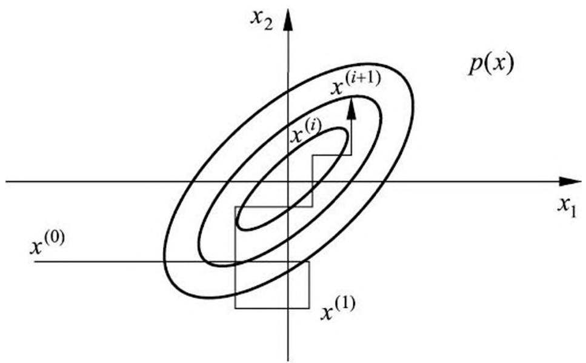

> 图 19.11 吉布斯抽样例

单分量 Metropolis-Hastings 算法和吉布斯抽样的不同之处在于，在前者算法中，抽样会在样本点之间移动，但其间可能在某一些样本点上停留（由于抽样被拒绝）；而在后者算法中，抽样会在样本点之间持续移动。

吉布斯抽样适合于满条件概率分布容易抽样的情况，而单分量 Metropolis-Hastings 算法适合于满条件概率分布不容易抽样的情况，这时使用容易抽样的条件分布作建议分布。

## 19.5.3 抽样计算

吉布斯抽样中需要对满条件概率分布进行重复多次抽样。可以利用概率分布的性质提高抽样的效率。下面以贝叶斯学习为例介绍这个技巧。

设 $y$ 表示观测数据， $\alpha ,\theta ,z$ 分别表示超参数、模型参数、未观测数据， $x = (\alpha ,\theta ,z)$ 如图 19.12 所示。贝叶斯学习的目的是估计后验概率分布 $p(x|y)$ ，求后验概率最大的模型。

$$
p (x \mid y) = p (\alpha , \theta , z \mid y) \propto p (z, y \mid \theta) p (\theta \mid \alpha) p (\alpha) \tag {19.52}
$$

式中 $p(\alpha)$ 是超参数分布， $p(\theta|\alpha)$ 是先验分布， $p(z,y|\theta)$ 是完全数据的分布。

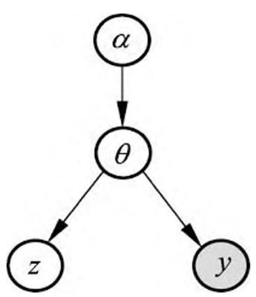

> 图 19.12 贝叶斯学习的图模型表示

现在用吉布斯抽样估计 $p(x|y)$ ，其中 $y$ 已知， $x = (\alpha, \theta, z)$ 未知。吉布斯抽样中各个变量 $\alpha, \theta, z$ 的满条件分布有以下关系：

$$
p \left(\alpha_ {i} \mid \alpha_ {- i}, \theta , z, y\right) \propto p (\theta \mid \alpha) p (\alpha) \tag {19.53}
$$

$$
p \left(\theta_ {j} \mid \theta_ {- j}, \alpha , z, y\right) \propto p (z, y \mid \theta) p (\theta \mid \alpha) \tag {19.54}
$$

$$
p \left(z _ {k} \mid z _ {- k}, \alpha , \theta , y\right) \propto p (z, y \mid \theta) \tag {19.55}
$$

其中 $\alpha_{-i}$ 表示变量 $\alpha_{i}$ 以外的所有变量， $\theta_{-j}$ 和 $z_{-k}$ 类似。满条件概率分布与若干条件概率分布的乘积成正比，各个条件概率分布只由少量的相关变量组成（图模型中相邻结点表示的变量）。所以，依满条件概率分布的抽样可以通过依这些条件概率分布的乘积的抽样进行。这样可以大幅减少抽样的计算复杂度，因为计算只涉及部分变量。

## 本章概要

1. 蒙特卡罗法是通过基于概率模型的抽样进行数值近似计算的方法，蒙特卡罗法可以用于概率分布的抽样、概率分布数学期望的估计、定积分的近似计算。

随机抽样是蒙特卡罗法的一种应用，有直接抽样法、接受-拒绝抽样法等。接受-拒绝法的基本想法是，找一个容易抽样的建议分布，其密度函数的数倍大于等于想要抽样的概率分布的密度函数。按照建议分布随机抽样得到样本，再按要抽样的概率分布与建议分布的倍数的比例随机决定接受或拒绝该样本，循环执行以上过程。

数学期望估计是蒙特卡罗法的另一种应用，按照概率分布 $p(x)$ 抽取随机变量 $x$ 的 $n$ 个独立样本，根据大数定律可知，当样本容量增大时，函数的样本均值以概率 1 收敛于函数的数学期望

$$
\hat {f} _ {n} \rightarrow E _ {p (x)} [ f (x) ], \quad n \rightarrow \infty
$$

计算样本均值 $\hat{f}_n$ ，作为数学期望 $E_{p(x)}[f(x)]$ 的估计值。

2. 马尔可夫链是具有马尔可夫性的随机过程

$$
P (X _ {t} | X _ {0} X _ {1} \dots X _ {t - 1}) = P (X _ {t} | X _ {t - 1}), \quad t = 1, 2, \dots
$$

通常考虑时间齐次马尔可夫链。有离散状态马尔可夫链和连续状态马尔可夫链，分别由概率转移矩阵 $P$ 和概率转移核 $p(x, y)$ 定义。

满足 $\pi = P\pi$ 或 $\pi (y) = \int p(x,y)\pi (x)\mathrm{d}x$ 的状态分布称为马尔可夫链的平稳分布。

马尔可夫链有不可约性、非周期性、正常返等性质。一个马尔可夫链若是不可约、非周期、正常返的，则该马尔可夫链满足遍历定理。当时间趋于无穷时，马尔可夫链的状态分布趋近于平稳分布，函数的样本平均依概率收敛于该函数的数学期望。

$$
\begin{array}{l} \lim  _ {t \rightarrow \infty} P (X _ {t} = i | X _ {0} = j) = \pi_ {i}, \quad i = 1, 2, \dots ; \quad j = 1, 2, \dots \\ \hat {f} _ {t} \rightarrow E _ {\pi} [ f (X) ], \quad t \rightarrow \infty \\ \end{array}
$$

可逆马尔可夫链是满足遍历定理的充分条件。

3. 马尔可夫链蒙特卡罗法是以马尔可夫链为概率模型的蒙特卡罗积分方法，其基本想法如下：

- (1) 在随机变量 $x$ 的状态空间 $\mathcal{X}$ 上构造一个满足遍历定理条件的马尔可夫链, 其平稳分布为目标分布 $p(x)$ ;
- （2）由状态空间的某一点 $X_0$ 出发，用所构造的马尔可夫链进行随机游走，产生样本序列 $X_{1},X_{2},\dots ,X_{t},\dots$
- （3）应用马尔可夫链遍历定理，确定正整数 $m$ 和 $n(m < n)$ ，得到样本集合 $\{x_{m+1}, x_{m+2}, \dots, x_n\}$ ，进行函数 $f(x)$ 的均值（遍历均值）估计：

$$
\hat {E} f = \frac {1}{n - m} \sum_ {i = m + 1} ^ {n} f (x _ {i})
$$

4. Metropolis-Hastings 算法是最基本的马尔可夫链蒙特卡罗法。假设目标是对概率分布 $p(x)$ 进行抽样，构造建议分布 $q(x, x')$ ，定义接受分布 $\alpha(x, x')$ 。进行随机游走，假设当前处于状态 $x$ ，按照建议分布 $q(x, x')$ 随机抽样，按照概率 $\alpha(x, x')$ 接受抽样，转移到状态 $x'$ ，按照概率 $1 - \alpha(x, x')$ 拒绝抽样，停留在状态 $x$ ，持续以上操作，得到一系列样本。这样的随机游走是根据转移核为 $p(x, x') = q(x, x') \alpha(x, x')$ 的可逆马尔可夫链（满足遍历定理条件）进行的，其平稳分布就是要抽样的目标分布 $p(x)$ 。

5. 吉布斯抽样（Gibbs sampling）用于多元联合分布的抽样和估计。吉布斯抽样是单分量 Metropolis-Hastings 算法的特殊情况。这时建议分布为满条件概率分布

$$
q (x, x ^ {\prime}) = p (x _ {j} ^ {\prime} | x _ {- j})
$$

吉布斯抽样的基本做法是，从联合分布定义满条件概率分布，依次从满条件概率分布进行抽样，得到联合分布的随机样本。假设多元联合概率分布为 $p(x) = p(x_{1},x_{2},\dots ,x_{k})$ ，吉布斯抽样从一个初始样本 $x^{(0)} = (x_1^{(0)},x_2^{(0)},\dots ,x_k^{(0)})^{\mathrm{T}}$ 出发，不断进行迭代，每一次迭代得到联合分布的一个样本 $x^{(i)} = (x_1^{(i)},x_2^{(i)},\dots ,x_k^{(i)})^{\mathrm{T}}$ 。在第 $i$ 次迭代中，依次对第 $j$ 个变量按照满条件概率分布随机抽样 $p(x_j|x_1^{(i)},\dots ,x_{j - 1}^{(i)},$ $x_{j + 1}^{(i - 1)},\dots ,x_k^{(i - 1)})$ ， $j = 1,2,\dots ,k$ ，得到 $x_{j}^{(i)}$ 。最终得到样本序列 $\{x^{(0)},x^{(1)},\dots ,x^{(n)}\}$ 。

## 继续阅读

马尔可夫链的介绍可见文献 [1]。Metropolis-Hastings 算法和吉布斯抽样的原始论文分别是 [2, 3]。随机抽样的介绍见文献 [4]。马尔可夫链蒙特卡罗法的介绍可以参阅文献 [4-8]。也可以观看 YouTube 上的视频: Mathematicalmonk, Markov Chain Monte Carlo (MCMC) Introduction.

## 习题

19.1 用蒙特卡罗积分法求

$$
\int_ {- \infty} ^ {\infty} x ^ {2} \exp \left(- \frac {x ^ {2}}{2}\right) \mathrm {d} x
$$

19.2 证明如果马尔可夫链是不可约的，且有一个状态是非周期的，则其他所有状态也是非周期的，即这个马尔可夫链是非周期的。

19.3 验证具有以下转移概率矩阵的马尔可夫链是可约的，但是非周期的。

$$
P = \left[ \begin{array}{c c c c} 1 / 2 & 1 / 2 & 0 & 0 \\ 1 / 2 & 0 & 1 / 2 & 0 \\ 0 & 1 / 2 & 0 & 0 \\ 0 & 0 & 1 / 2 & 1 \end{array} \right]
$$

19.4 验证具有以下转移概率矩阵的马尔可夫链是不可约的, 但是周期性的。

$$
P = \left[ \begin{array}{c c c c} 0 & 1 / 2 & 0 & 0 \\ 1 & 0 & 1 / 2 & 0 \\ 0 & 1 / 2 & 0 & 1 \\ 0 & 0 & 1 / 2 & 0 \end{array} \right]
$$

19.5 证明可逆马尔可夫链一定是不可约的。

19.6 从一般的 Metropolis-Hastings 算法推导出单分量 Metropolis-Hastings 算法。

19.7 假设进行伯努利实验，后验概率为 $P(\theta | y)$ ，其中变量 $y \in \{0, 1\}$ 表示实验可能的结果，变量 $\theta$ 表示结果为 1 的概率。再假设先验概率 $P(\theta)$ 遵循 Beta 分布 $B(\alpha, \beta)$ ，其中 $\alpha = 1, \beta = 1$ ；似然函数 $P(y | \theta)$ 遵循二项分布 $\operatorname{Bin}(n, k, \theta)$ ，其中 $n = 10, k = 4$ ，即实验进行 10 次其中结果为 1 的次数为 4。试用 Metropolis-Hastings 算法求后验概率分布 $P(\theta | y) \propto P(\theta) P(y | \theta)$ 的均值和方差。（提示：可采用 Metropolis 选择，即假设建议分布是对称的。）19.8 设某试验可能有五种结果，其出现的概率分别为

$$
\frac {\theta}{4} + \frac {1}{8}, \quad \frac {\theta}{4}, \quad \frac {\eta}{4}, \quad \frac {\eta}{4} + \frac {3}{8}, \quad \frac {1}{2} (1 - \theta - \eta)
$$

模型含有两个参数 $\theta$ 和 $\eta$ ，都介于 0 和 1 之间。现有 22 次试验结果的观测值为

$$
y = \left(y _ {1}, y _ {2}, y _ {3}, y _ {4}, y _ {5}\right) = (1 4, 1, 1, 1, 5)
$$

其中 $y_{i}$ 表示 22 次试验中第 $i$ 个结果出现的次数， $i = 1,2,\dots,5$ 。试用吉布斯抽样估计参数 $\theta$ 和 $\eta$ 的均值和方差。

## 参考文献

- [1] Serfzo R. Basics of applied stochastic processes. Springer, 2009.
- [2] Metropolis N, Rosenbluth A W, Rosenbluth M N, et al. Equation of state calculations by fast computing machines. The Journal of Chemical Physics, 1953, 21(6): 1087-1092.
- [3] Geman S, Geman D. Stochastic relaxation, Gibbs distribution and the Bayesian restoration of images. IEEE Transactions on Pattern Analysis and Machine Intelligence, 1984, 6: 721-741.
- [4] Bishop C M. Pattern recognition and machine learning. Springer, 2006.
- [5] Gilks W R, Richardson S, Spiegelhalter, DJ. Introducing Markov chain Monte Carlo. Markov Chain Monte Carlo in Practice, 1996.
- [6] Andrieu C, De Freitas N, Doucet A, et al. An introduction to MCMC for machine learning. Machine Learning, 2003, 50(1-2): 5-43.
- [7] Hoff P. A first course in Bayesian statistical methods. Springer, 2009.
- [8] 苦诗松，王静龙，濮晓龙. 高等数理统计. 北京：高等教育出版社，1998.