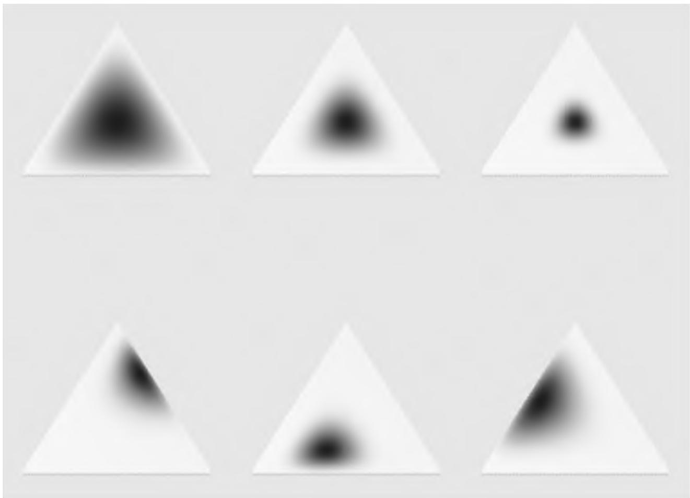
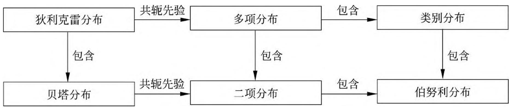
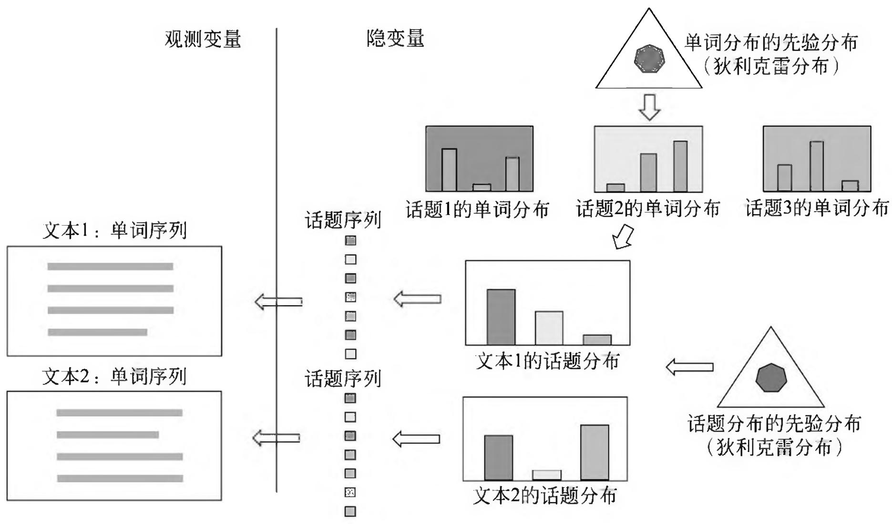
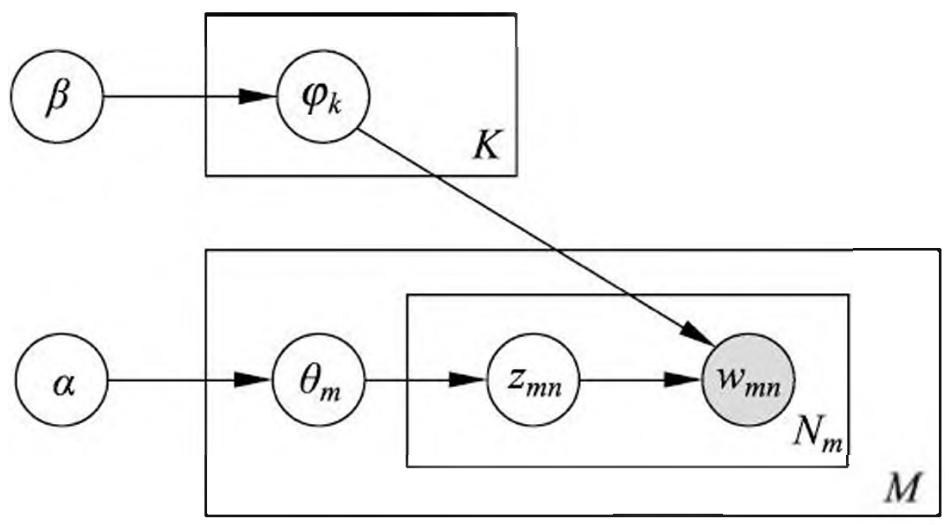
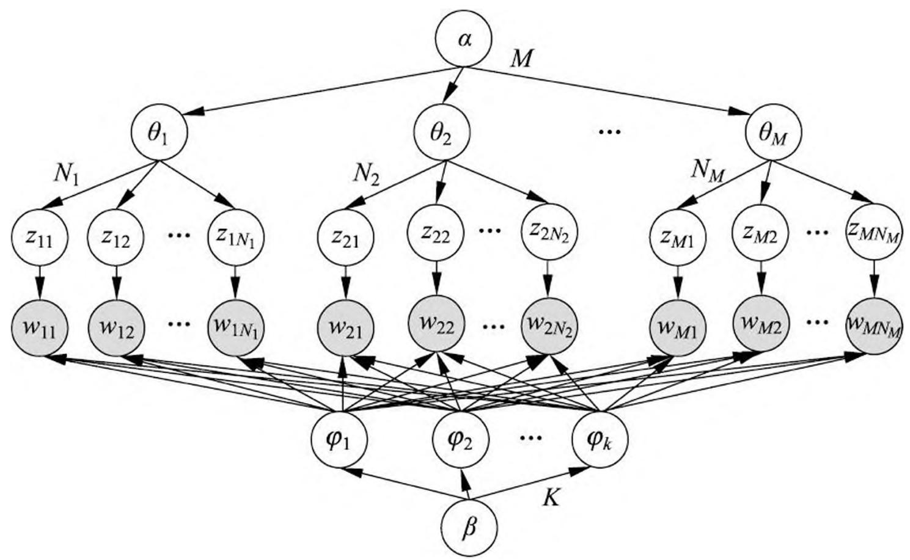
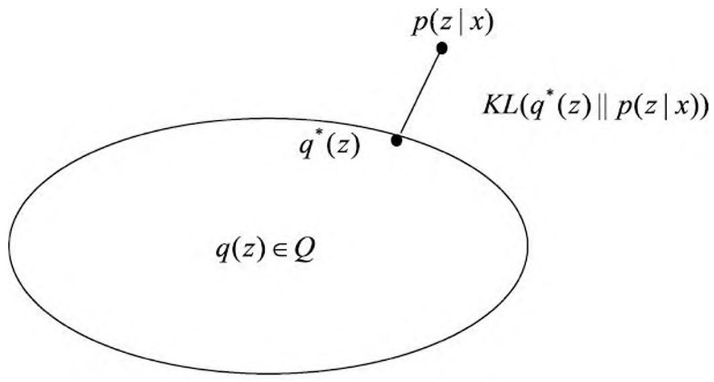
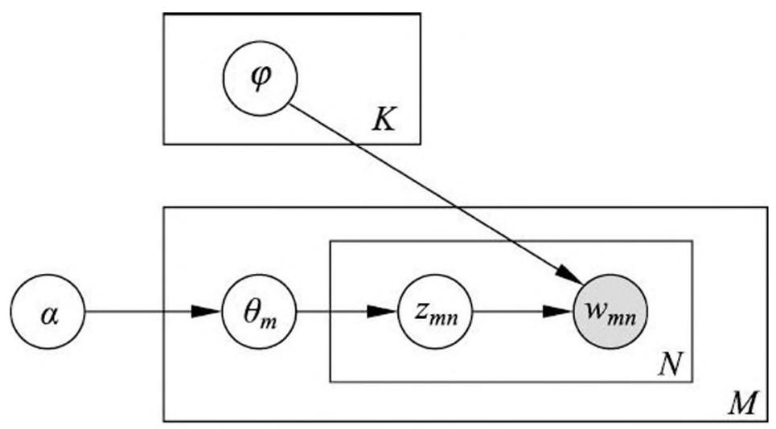
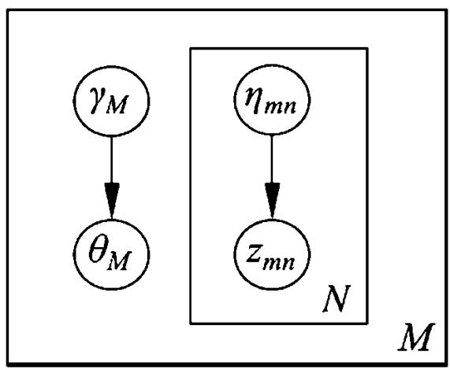

# 第 20 章 潜在狄利克雷分配

潜在狄利克雷分配（latent Dirichlet allocation, LDA），作为基于贝叶斯学习的话题模型，是潜在语义分析、概率潜在语义分析的扩展，于 2002 年由 Blei 等提出。LDA 在文本数据挖掘、图像处理、生物信息处理等领域被广泛使用。

LDA 模型是文本集合的生成概率模型。假设每个文本由话题的一个多项分布表示，每个话题由单词的一个多项分布表示，特别假设文本的话题分布的先验分布是狄利克雷分布，话题的单词分布的先验分布也是狄利克雷分布。先验分布的导入使 LDA 能够更好地应对话题模型学习中的过拟合现象。

LDA 的文本集合的生成过程如下：首先随机生成一个文本的话题分布，之后在该文本的每个位置，依据该文本的话题分布随机生成一个话题，然后在该位置依据该话题的单词分布随机生成一个单词，直至文本的最后一个位置，生成整个文本。重复以上过程生成所有文本。

LDA 模型是含有隐变量的概率图模型。模型中，每个话题的单词分布，每个文本的话题分布，文本的每个位置的话题是隐变量；文本的每个位置的单词是观测变量。LDA 模型的学习与推理无法直接求解，通常使用吉布斯抽样（Gibbs sampling）和变分 EM 算法（variational EM algorithm），前者是蒙特卡罗法，而后者是近似算法。

本章 20.1 节介绍狄利克雷分布，20.2 节阐述潜在狄利克雷分配模型，20.3 节和 20.4 节叙述模型的算法，包括吉布斯抽样和变分 EM 算法。

## 20.1 狄利克雷分布

## 20.1.1 分布定义

首先介绍作为 LDA 模型基础的多项分布和狄利克雷分布。

## 1. 多项分布

多项分布（multinomial distribution）是一种多元离散随机变量的概率分布，是二项分布（binomial distribution）的扩展。

假设重复进行 $n$ 次独立随机试验，每次试验可能出现的结果有 $k$ 种，第 $i$ 种结果出现的概率为 $p_i$ ，第 $i$ 种结果出现的次数为 $n_i$ 。如果用随机变量 $X = (X_1, X_2, \dots, X_k)$ 表示试验所有可能结果的次数，其中 $X_i$ 表示第 $i$ 种结果出现的次数，那么随机变量 $X$ 服从多项分布。

定义 20.1（多项分布） 若多元离散随机变量 $X = (X_{1},X_{2},\dots ,X_{k})$ 的概率质量函数为

$$
\begin{array}{l} P (X _ {1} = n _ {1}, X _ {2} = n _ {2}, \dots , X _ {k} = n _ {k}) = \frac {n !}{n _ {1} ! n _ {2} ! \cdots n _ {k} !} p _ {1} ^ {n _ {1}} p _ {2} ^ {n _ {2}} \dots p _ {k} ^ {n _ {k}} \\ = \frac {n !}{\prod_ {i = 1} ^ {k} n _ {i} !} \prod_ {i = 1} ^ {k} p _ {i} ^ {n _ {i}} \tag {20.1} \\ \end{array}
$$

其中 $p = (p_1, p_2, \dots, p_k)$ , $p_i \geqslant 0, i = 1, 2, \dots, k$ , $\sum_{i=1}^{k} p_i = 1$ , $\sum_{i=1}^{k} n_i = n$ , 则称随机变量 $X$ 服从参数为 $(n, p)$ 的多项分布, 记作 $X \sim \mathrm{Mult}(n, p)$ 。

当试验的次数 $n$ 为 1 时，多项分布变成类别分布（categorical distribution）。类别分布表示试验可能出现的 $k$ 种结果的概率。显然多项分布包含类别分布。

## 2. 狄利克雷分布

狄利克雷分布（Dirichlet distribution）是一种多元连续随机变量的概率分布，是贝塔分布（beta distribution）的扩展。在贝叶斯学习中，狄利克雷分布常作为多项分布的先验分布使用。

定义 20.2（狄利克雷分布） 若多元连续随机变量 $\theta = (\theta_{1},\theta_{2},\dots ,\theta_{k})$ 的概率密度函数为

$$
p (\theta | \alpha) = \frac {\Gamma \left(\sum_ {i = 1} ^ {k} \alpha_ {i}\right)}{\prod_ {i = 1} ^ {k} \Gamma \left(\alpha_ {i}\right)} \prod_ {i = 1} ^ {k} \theta_ {i} ^ {\alpha_ {i} - 1} \tag {20.2}
$$

其中 $\sum_{i=1}^{k} \theta_{i} = 1, \theta_{i} \geqslant 0, \alpha = (\alpha_{1}, \alpha_{2}, \dots, \alpha_{k}), \alpha_{i} > 0, i = 1, 2, \dots, k,$ 则称随机变量 $\theta$ 服从参数为 $\alpha$ 的狄利克雷分布，记作 $\theta \sim \mathrm{Dir}(\alpha)$ 。

式中 $\Gamma(s)$ 是伽马函数，定义为

$$
\Gamma (s) = \int_ {0} ^ {\infty} x ^ {s - 1} \mathrm {e} ^ {- x} \mathrm {d} x, \quad s > 0
$$

具有性质

$$
\Gamma (s + 1) = s \Gamma (s)
$$

当 $s$ 是自然数时，有

$$
\Gamma (s + 1) = s!
$$

由于满足条件

$$
\theta_ {i} \geqslant 0, \quad \sum_ {i = 1} ^ {k} \theta_ {i} = 1
$$

所以狄利克雷分布 $\theta$ 存在于 $(k - 1)$ 维单纯形上。图 20.1 为二维单纯形上的狄利克雷分布（详见文前彩图）。 $\theta_{1} + \theta_{2} + \theta_{3} = 1$ ， $\theta_{1},\theta_{2},\theta_{3}\geqslant 0$ 。图中狄利克雷分布的参数为 $\alpha = (3,3,3),\alpha = (7,7,7),\alpha = (20,20,20),\alpha = (2,6,11),\alpha = (14,9,5),\alpha = (6,2,6).$

> 图 20.1 狄利克雷分布例(见彩图)

令

$$
\mathrm {B} (\alpha) = \frac {\prod_ {i = 1} ^ {k} \Gamma \left(\alpha_ {i}\right)}{\Gamma \left(\sum_ {i = 1} ^ {k} \alpha_ {i}\right)} \tag {20.3}
$$

则狄利克雷分布的密度函数可以写成

$$
p (\theta | \alpha) = \frac {1}{\mathrm {B} (\alpha)} \prod_ {i = 1} ^ {k} \theta_ {i} ^ {\alpha_ {i} - 1} \tag {20.4}
$$

$\mathrm{B}(\alpha)$ 是规范化因子，称为多元贝塔函数（或扩展的贝塔函数）。由密度函数的性质

$$
\int \frac {\Gamma \left(\sum_ {i = 1} ^ {k} \alpha_ {i}\right)}{\prod_ {i = 1} ^ {k} \Gamma (\alpha_ {i})} \prod_ {i = 1} ^ {k} \theta_ {i} ^ {\alpha_ {i} - 1} \mathrm {d} \theta = \frac {\Gamma \left(\sum_ {i = 1} ^ {k} \alpha_ {i}\right)}{\prod_ {i = 1} ^ {k} \Gamma (\alpha_ {i})} \int \prod_ {i = 1} ^ {k} \theta_ {i} ^ {\alpha_ {i} - 1} \mathrm {d} \theta = 1
$$

得

$$
\mathrm {B} (\alpha) = \int \prod_ {i = 1} ^ {k} \theta_ {i} ^ {\alpha_ {i} - 1} \mathrm {d} \theta \tag {20.5}
$$

所以式 (20.5) 是多元贝塔函数的积分表示。

## 3. 二项分布和贝塔分布

二项分布是多项分布的特殊情况，贝塔分布是狄利克雷分布的特殊情况。

二项分布是指如下概率分布。 $X$ 为离散随机变量，取值为 $m$ ，其概率质量函数为

$$
P (X = m) = \binom {n} {m} p ^ {m} (1 - p) ^ {n - m}, \quad m = 0, 1, 2, \dots , n \tag {20.6}
$$

其中 $n$ 和 $p(0 \leqslant p \leqslant 1)$ 是参数。

贝塔分布是指如下概率分布， $X$ 为连续随机变量，取值范围为[0,1]，其概率密度函数为

$$
p (x) = \left\{ \begin{array}{l l} { \frac {1}{\mathrm {B} (s , t)} x ^ {s - 1} (1 - x) ^ {t - 1},} & {0 \leqslant x \leqslant 1} \\ {0,} & {\text {其 他}} \end{array} \right. \tag {20.7}
$$

其中 $s > 0$ 和 $t > 0$ 是参数， $\mathrm{B}(s,t) = \frac{\Gamma(s)\Gamma(t)}{\Gamma(s + t)}$ 是贝塔函数，定义为

$$
\mathrm {B} (s, t) = \int_ {0} ^ {1} x ^ {s - 1} (1 - x) ^ {t - 1} \mathrm {d} x \tag {20.8}
$$

当 $s, t$ 是自然数时，

$$
\mathrm {B} (s, t) = \frac {(s - 1) ! (t - 1) !}{(s + t - 1) !} \tag {20.9}
$$

当 $n$ 为 1 时，二项分布变成伯努利分布（Bernoulli distribution）或 0-1 分布。伯努利分布表示试验可能出现的 2 种结果的概率。显然二项分布包含伯努利分布。图 20.2 给出几种概率分布的关系。

> 图 20.2 概率分布之间的关系

## 20.1.2 共轭先验

狄利克雷分布有一些重要性质：（1）狄利克雷分布属于指数分布族；（2）狄利克雷分布是多项分布的共轭先验（conjugate prior）。

贝叶斯学习中常使用共轭分布。如果后验分布与先验分布属于同类，则先验分布与后验分布称为共轭分布（conjugatedistributions），先验分布称为共轭先验（conjugateprior）。如果多项分布的先验分布是狄利克雷分布，则其后验分布也为狄利克雷分布，两者构成共轭分布。作为先验分布的狄利克雷分布的参数又称为超参数。使用共轭分布的好处是便于从先验分布计算后验分布。

设 $\mathcal{W} = \{w_1, w_2, \dots, w_k\}$ 是由 $k$ 个元素组成的集合。随机变量 $X$ 服从 $\mathcal{W}$ 上的多项分布， $X \sim \mathrm{Mult}(n, \theta)$ ，其中 $n = (n_1, n_2, \dots, n_k)$ 和 $\theta = (\theta_1, \theta_2, \dots, \theta_k)$ 是参数。参数 $n$ 为从 $\mathcal{W}$ 中重复独立抽取样本的次数， $n_i$ 为样本中 $w_i$ 出现的次数 $(i = 1, 2, \dots, k)$ ；参数 $\theta_i$ 为 $w_i$ 出现的概率 $(i = 1, 2, \dots, k)$ 。

将样本数据表示为 $D$ ，目标是计算在样本数据 $D$ 给定条件下参数 $\theta$ 的后验概率 $p(\theta |D)$ 。对于给定的样本数据 $D$ ，似然函数是

$$
p (D | \theta) = \theta_ {1} ^ {n _ {1}} \theta_ {2} ^ {n _ {2}} \dots \theta_ {k} ^ {n _ {k}} = \prod_ {i = 1} ^ {k} \theta_ {i} ^ {n _ {i}} \tag {20.10}
$$

假设随机变量 $\theta$ 服从狄利克雷分布 $p(\theta|\alpha)$ ，其中 $\alpha = (\alpha_1, \alpha_2, \dots, \alpha_k)$ 为参数。则 $\theta$ 的先验分布为

$$
p (\theta | \alpha) = \frac {\Gamma \left(\sum_ {i = 1} ^ {k} \alpha_ {i}\right)}{\prod_ {i = 1} ^ {k} \Gamma \left(\alpha_ {i}\right)} \prod_ {i = 1} ^ {k} \theta_ {i} ^ {\alpha_ {i} - 1} = \frac {1}{\mathrm {B} (\alpha)} \prod_ {i = 1} ^ {k} \theta_ {i} ^ {\alpha_ {i} - 1} = \operatorname {D i r} (\theta | \alpha), \quad \alpha_ {i} > 0 \tag {20.11}
$$

根据贝叶斯规则，在给定样本数据 $D$ 和参数 $\alpha$ 条件下， $\theta$ 的后验概率分布是

$$
\begin{array}{l} p (\theta | D, \alpha) = \frac {p (D | \theta) p (\theta | \alpha)}{p (D | \alpha)} \\ = \frac {\prod_ {i = 1} ^ {k} \theta_ {i} ^ {n _ {i}} \frac {1}{\mathrm {B} (\alpha)} \theta_ {i} ^ {\alpha_ {i} - 1}}{\int \prod_ {i = 1} ^ {k} \theta_ {i} ^ {n _ {i}} \frac {1}{\mathrm {B} (\alpha)} \theta_ {i} ^ {\alpha_ {i} - 1} \mathrm {d} \theta} \\ = \frac {1}{\mathrm {B} (\alpha + n)} \prod_ {i = 1} ^ {k} \theta_ {i} ^ {\alpha_ {i} + n _ {i} - 1} \\ = \operatorname {D i r} (\theta | \alpha + n) \tag {20.12} \\ \end{array}
$$

可以看出先验分布 (20.11) 和后验分布 (20.12) 都是狄利克雷分布，两者有不同的参数，所以狄利克雷分布是多项分布的共轭先验。狄利克雷后验分布的参数等于狄利克雷先验分布参数 $\alpha = (\alpha_{1},\alpha_{2},\dots ,\alpha_{k})$ 加上多项分布的观测计数 $n = (n_{1},n_{2},\dots ,n_{k})$ ，好像试验之前就已经观察到计数 $\alpha = (\alpha_{1},\alpha_{2},\dots ,\alpha_{k})$ ，因此也把 $\alpha$ 叫做先验伪计数（prior pseudo-counts）。

## 20.2 潜在狄利克雷分配模型

## 20.2.1 基本想法

潜在狄利克雷分配（LDA）是文本集合的生成概率模型。模型假设话题由单词的多项分布表示，文本由话题的多项分布表示，单词分布和话题分布的先验分布都是狄利克雷分布。文本内容的不同是由于它们的话题分布不同。（严格意义上说，这里的多项分布都是类别分布，在机器学习与自然语言处理中，有时对两者不作严格区分。）LDA 模型表示文本集合的自动生成过程：首先，基于单词分布的先验分布（狄利克雷分布）生成多个单词分布，即决定多个话题内容；之后，基于话题分布的先验分布（狄利克雷分布）生成多个话题分布，即决定多个文本内容；然后，基于每一个话题分布生成话题序列，针对每一个话题，基于话题的单词分布生成单词，整体构成一个单词序列，即生成文本，重复这个过程生成所有文本。文本的单词序列是观测变量，文本的话题序列是隐变量，文本的话题分布和话题的单词分布也是隐变量。图 20.3 示意 LDA 的文本生成过程（详见文前彩图）。

LDA 模型是概率图模型，其特点是以狄利克雷分布为多项分布的先验分布，学习

> 图 20.3 LDA 的文本生成过程(见彩图)

就是给定文本集合，通过后验概率分布的估计，推断模型的所有参数。利用 LDA 进行话题分析，就是对给定文本集合，学习到每个文本的话题分布，以及每个话题的单词分布。

可以认为 LDA 是 PLSA（概率潜在语义分析）的扩展，相同点是两者都假设话题是单词的多项分布，文本是话题的多项分布。不同点是 LDA 使用狄利克雷分布作为先验分布，而 PLSA 不使用先验分布（或者说假设先验分布是均匀分布），两者对文本生成过程有不同假设；学习过程 LDA 基于贝叶斯学习，而 PLSA 基于极大似然估计。LDA 的优点是，使用先验概率分布，可以防止学习过程中产生的过拟合（over-fitting）。

## 20.2.2 模型定义

本书采用常用 LDA 模型的定义，与原始文献中提出的模型略有不同。

## 1. 模型要素

潜在狄利克雷分配（LDA）使用三个集合：一是单词集合 $W = \{w_{1},\dots ,w_{v},\dots ,$ （20 $w_{V}\}$ ，其中 $w_{v}$ 是第 $\pmb{\upsilon}$ 个单词， $v = 1,2,\dots ,V$ ， $V$ 是单词的个数。二是文本集合 $D = \{\mathbf{w}_1,\dots ,\mathbf{w}_m,\dots ,\mathbf{w}_M\}$ ，其中 $\mathbf{w}_m$ 是第 $m$ 个文本， $m = 1,2,\dots ,M$ ， $M$ 是文本的个数。文本 $\mathbf{w}_m$ 是一个单词序列 $\mathbf{w}_m = (w_{m1},\dots ,w_{mn},\dots ,w_{mN_m})$ ，其中 $w_{mn}$ 是文本 $\mathbf{w}_m$ 的第 $n$ 个单词， $n = 1,2,\dots ,N_m$ ， $N_{m}$ 是文本 $\mathbf{w}_m$ 中单词的个数。三是话题集合 $Z = \{z_{1},\dots ,z_{k},\dots ,z_{K}\}$ ，其中 $z_{k}$ 是第 $k$ 个话题， $k = 1,2,\dots ,K$ ， $K$ 是话题的个数。

每一个话题 $z_{k}$ 由一个单词的条件概率分布 $p(w|z_k)$ 决定， $w \in W$ 。分布 $p(w|z_k)$ 服从多项分布（严格意义上类别分布），其参数为 $\varphi_{k}$ 。参数 $\varphi_{k}$ 服从狄利克雷分布（先验分布），其超参数为 $\beta$ 。参数 $\varphi_{k}$ 是一个 $V$ 维向量 $\varphi_{k} = (\varphi_{k1},\varphi_{k2},\dots ,\varphi_{kV})$ ，其中 $\varphi_{kv}$ 表示话题 $z_{k}$ 生成单词 $w_{v}$ 的概率。所有话题的参数向量构成一个 $K \times V$ 矩阵 $\varphi = \{\varphi_k\}_{k = 1}^K$ 。超参数 $\beta$ 也是一个 $V$ 维向量 $\beta = (\beta_{1},\beta_{2},\dots ,\beta_{V})$ 。

每一个文本 $\mathbf{w}_m$ 由一个话题的条件概率分布 $p(z|\mathbf{w}_m)$ 决定， $z \in Z$ 。分布 $p(z|\mathbf{w}_m)$ 服从多项分布（严格意义上类别分布），其参数为 $\theta_m$ 。参数 $\theta_m$ 服从狄利克雷分布（先验分布），其超参数为 $\alpha$ 。参数 $\theta_m$ 是一个 $K$ 维向量 $\theta_m = (\theta_{m1},\theta_{m2},\dots,\theta_{mK})$ ，其中 $\theta_{mk}$ 表示文本 $\mathbf{w}_m$ 生成话题 $z_k$ 的概率。所有文本的参数向量构成一个 $M \times K$ 矩阵 $\pmb{\theta} = \{\theta_m\}_{m=1}^M$ 。超参数 $\alpha$ 也是一个 $K$ 维向量 $\alpha = (\alpha_1,\alpha_2,\dots,\alpha_K)$ 。

每一个文本 $\mathbf{w}_m$ 中的每一个单词 $w_{mn}$ 由该文本的话题分布 $p(z|\mathbf{w}_m)$ 以及所有话题的单词分布 $p(w|z_k)$ 决定。

## 2. 生成过程

LDA 文本集合的生成过程如下：

给定单词集合 $W$ ，文本集合 $D$ ，话题集合 $Z$ ，狄利克雷分布的超参数 $\alpha$ 和 $\beta$ 。

## (1) 生成话题的单词分布

随机生成 $K$ 个话题的单词分布。具体过程如下，按照狄利克雷分布 $\operatorname{Dir}(\beta)$ 随机生成一个参数向量 $\varphi_{k}$ ， $\varphi_{k} \sim \operatorname{Dir}(\beta)$ ，作为话题 $z_{k}$ 的单词分布 $p(w|z_k)$ ， $w \in W$ ， $k = 1,2,\dots,K$ 。

## （2）生成文本的话题分布

随机生成 $M$ 个文本的话题分布。具体过程如下：按照狄利克雷分布 $\operatorname{Dir}(\alpha)$ 随机生成一个参数向量 $\theta_{m}$ ， $\theta_{m} \sim \operatorname{Dir}(\alpha)$ ，作为文本 $\mathbf{w}_{m}$ 的话题分布 $p(z|\mathbf{w}_{m})$ ， $m = 1,2,\dots,M$ 。

## （3）生成文本的单词序列

随机生成 $M$ 个文本的 $N_{m}$ 个单词。文本 $\mathbf{w}_{m}(m = 1,2,\dots ,M)$ 的单词 $w_{mn}(n = 1,2,\dots ,N_m)$ 的生成过程如下：

（3-1）首先按照多项分布 $\mathrm{Mult}(\theta_m)$ 随机生成一个话题 $z_{mn}$ ， $z_{mn} \sim \mathrm{Mult}(\theta_m)$ 。

（3-2）然后按照多项分布 $\mathrm{Mult}(\varphi_{z_{mn}})$ 随机生成一个单词 $w_{mn}$ ， $w_{mn} \sim \mathrm{Mult}(\varphi_{z_{mn}})$ 。文本 $\mathbf{w}_m$ 本身是单词序列 $\mathbf{w}_m = (w_{m1}, w_{m2}, \dots, w_{mN_m})$ ，对应着隐式的话题序列 $\mathbf{z}_m = (z_{m1}, z_{m2}, \dots, z_{mN_m})$ 。

总结 LDA 生成文本的算法如下。

## 算法 20.1（LDA 的文本生成算法）

（1）对于话题 $z_{k}$ $(k = 1,2,\dots ,K)$生成多项分布参数 $\varphi_{k}\sim \mathrm{Dir}(\beta)$ ，作为话题的单词分布 $p(w|z_k)$(2) 对于文本 $\mathbf{w}_m (m = 1, 2, \dots, M)$ :生成多项分布参数 $\theta_{m} \sim \mathrm{Dir}(\alpha)$ , 作为文本的话题分布 $p(z|\mathbf{w}_m)$ ;（3）对于文本 $\mathbf{w}_m$ 的单词 $w_{mn}$ （ $m = 1,2,\dots,M$ ， $n = 1,2,\dots,N_m$ ）：

- (a) 生成话题 $z_{mn} \sim \mathrm{Mult}(\theta_m)$ , 作为单词对应的话题;
- (b) 生成单词 $w_{mn} \sim \mathrm{Mult}(\varphi_{z_{mn}})$ 。

LDA 的文本生成过程中，假定话题个数 $K$ 给定，实际通常通过实验选定。狄利克雷分布的超参数 $\alpha$ 和 $\beta$ 通常也是事先给定的。在没有其他先验知识的情况下，可以假设向量 $\alpha$ 和 $\beta$ 的所有分量均为 1，这时的文本的话题分布 $\theta_{m}$ 是对称的，话题的单词分布 $\varphi_{k}$ 也是对称的。

## 20.2.3 概率图模型

LDA 模型本质是一种概率图模型（probabilistic graphical model）。图 20.4 为 LDA 作为概率图模型的板块表示（plate notation）。图中结点表示随机变量，实心结点是观测变量，空心结点是隐变量；有向边表示概率依存关系；矩形（板块）表示重复，板块内数字表示重复的次数。

> 图 20.4 LDA 的板块表示

图 20.4 中的 LDA 板块表示，结点 $\alpha$ 和 $\beta$ 是模型的超参数，结点 $\varphi_{k}$ 表示话题的单词分布的参数，结点 $\theta_{m}$ 表示文本的话题分布的参数，结点 $z_{mn}$ 表示话题，结点 $w_{mn}$ 表示单词。结点 $\beta$ 指向结点 $\varphi_{k}$ ，重复 $K$ 次，表示根据超参数 $\beta$ 生成 $K$ 个话题的单词分布的参数 $\varphi_{k}$ ；结点 $\alpha$ 指向结点 $\theta_{m}$ ，重复 $M$ 次，表示根据超参数 $\alpha$ 生成 $M$ 个文本的话题分布的参数 $\theta_{m}$ ；结点 $\theta_{m}$ 指向结点 $z_{mn}$ ，重复 $N_{m}$ 次，表示根据文本的话题分布 $\theta_{m}$ 生成 $N_{m}$ 个话题 $z_{mn}$ ；结点 $z_{mn}$ 指向结点 $w_{mn}$ ，同时 $K$ 个结点 $\varphi_{k}$ 也指向结点 $w_{mn}$ ，表示根据话题 $z_{mn}$ 以及 $K$ 个话题的单词分布 $\varphi_{k}$ 生成单词 $w_{mn}$ 。

板块表示的优点是简洁，板块表示展开之后，成为普通的有向图表示（图 20.5）。有向图中结点表示随机变量，有向边表示概率依存关系。可以看出 LDA 是相同随机变量被重复多次使用的概率图模型。

> 图 20.5 LDA 的展开图模型表示

## 20.2.4 随机变量序列的可交换性

一个有限的随机变量序列是可交换的（exchangeable），是指随机变量的联合概率分布对随机变量的排列不变。

$$
P \left(x _ {1}, x _ {2}, \dots , x _ {N}\right) = P \left(x _ {\pi (1)}, x _ {\pi (2)}, \dots , x _ {\pi (N)}\right) \tag {20.13}
$$

这里 $\pi(1), \pi(2), \dots, \pi(N)$ 代表自然数 $1, 2, \dots, N$ 的任意一个排列。一个无限的随机变量序列是无限可交换（infinitely exchangeable）的，是指它的任意一个有限子序列都是可交换的。

如果一个随机变量序列 $X_{1}, X_{2}, \dots, X_{N}, \dots$ 是独立同分布的，那么它们是无限可交换的。反之不然。

随机变量序列可交换的假设在贝叶斯学习中经常使用。根据 De Finetti 定理，任意一个无限可交换的随机变量序列对一个随机参数是条件独立同分布的。即任意一个无限可交换的随机变量序列 $X_{1}, X_{2}, \dots, X_{i}, \dots$ 的基于一个随机参数 $Y$ 的条件概率，等于基于这个随机参数 $Y$ 的各个随机变量 $X_{1}, X_{2}, \dots, X_{i}, \dots$ 的条件概率的乘积。

$$
P \left(X _ {1}, X _ {2}, \dots , X _ {i}, \dots | Y\right) = P \left(X _ {1} | Y\right) P \left(X _ {2} | Y\right) \dots P \left(X _ {i} | Y\right) \dots \tag {20.14}
$$

LDA 假设文本由无限可交换的话题序列组成。由 De Finetti 定理知，实际是假设文本中的话题对一个随机参数是条件独立同分布的。所以在参数给定的条件下，文本中的话题的顺序可以忽略。作为对比，概率潜在语义模型假设文本中的话题是独立同分布的，文本中的话题的顺序也可以忽略。

## 20.2.5 概率公式

LDA 模型整体是由观测变量和隐变量组成的联合概率分布，可以表为

$$
p (\mathbf {w}, \mathbf {z}, \theta , \varphi | \alpha , \beta) = \prod_ {k = 1} ^ {K} p \left(\varphi_ {k} \mid \beta\right) \prod_ {m = 1} ^ {M} p \left(\theta_ {m} \mid \alpha\right) \prod_ {n = 1} ^ {N _ {m}} p \left(z _ {m n} \mid \theta_ {m}\right) p \left(w _ {m n} \mid z _ {m n}, \varphi\right) \tag {20.15}
$$

其中观测变量 $\mathbf{w}$ 表示所有文本中的单词序列，隐变量 $\mathbf{z}$ 表示所有文本中的话题序列，隐变量 $\theta$ 表示所有文本的话题分布的参数，隐变量 $\varphi$ 表示所有话题的单词分布的参数， $\alpha$ 和 $\beta$ 是超参数。式中 $p(\varphi_k|\beta)$ 表示超参数 $\beta$ 给定条件下第 $k$ 个话题的单词分布的参数 $\varphi_k$ 的生成概率， $p(\theta_m|\alpha)$ 表示超参数 $\alpha$ 给定条件下第 $m$ 个文本的话题分布的参数 $\theta_m$ 的生成概率， $p(z_{mn}|\theta_m)$ 表示第 $m$ 个文本的话题分布 $\theta_m$ 给定条件下文本的第 $n$ 个位置的话题 $z_{mn}$ 的生成概率， $p(w_{mn}|z_{mn},\varphi)$ 表示在第 $m$ 个文本的第 $n$ 个位置的话题 $z_{mn}$ 及所有话题的单词分布的参数 $\varphi$ 给定条件下第 $m$ 个文本的第 $n$ 个位置的单词 $w_{mn}$ 的生成概率。参见图 20.5。

第 $m$ 个文本的联合概率分布可以表为

$$
p \left(\mathbf {w} _ {m}, \mathbf {z} _ {m}, \theta_ {m}, \varphi \mid \alpha , \beta\right) = \prod_ {k = 1} ^ {K} p \left(\varphi_ {k} \mid \beta\right) p \left(\theta_ {m} \mid \alpha\right) \prod_ {n = 1} ^ {N _ {m}} p \left(z _ {m n} \mid \theta_ {m}\right) p \left(w _ {m n} \mid z _ {m n}, \varphi\right) \tag {20.16}
$$

其中 $\mathbf{w}_m$ 表示该文本中的单词序列， $\mathbf{z}_m$ 表示该文本的话题序列， $\theta_m$ 表示该文本的话题分布参数。

LDA 模型的联合分布含有隐变量，对隐变量进行积分得到边缘分布。

参数 $\theta_{m}$ 和 $\varphi$ 给定条件下第 $m$ 个文本的生成概率是

$$
p \left(\mathbf {w} _ {m} \mid \theta_ {m}, \varphi\right) = \prod_ {n = 1} ^ {N _ {m}} \left[ \sum_ {k = 1} ^ {K} p \left(z _ {m n} = k \mid \theta_ {m}\right) p \left(w _ {m n} \mid \varphi_ {k}\right) \right] \tag {20.17}
$$

超参数 $\alpha$ 和 $\beta$ 给定条件下第 $m$ 个文本的生成概率是

$$
p \left(\mathbf {w} _ {m} \mid \alpha , \beta\right) = \prod_ {k = 1} ^ {K} \int p (\varphi_ {k} \mid \beta) \left[ \int p \left(\theta_ {m} \mid \alpha\right) \prod_ {n = 1} ^ {N _ {m}} \left[ \sum_ {l = 1} ^ {K} p \left(z _ {m n} = l \mid \theta_ {m}\right) p \left(w _ {m n} \mid \varphi_ {l}\right) \right] \mathrm {d} \theta_ {m} \right] \mathrm {d} \varphi_ {k} \tag {20.18}
$$

超参数 $\alpha$ 和 $\beta$ 给定条件下所有文本的生成概率是

$$
p (\mathbf {w} | \alpha , \beta) = \prod_ {k = 1} ^ {K} \int p (\varphi_ {k} | \beta) \left[ \prod_ {m = 1} ^ {M} \int p (\theta_ {m} | \alpha) \prod_ {n = 1} ^ {N _ {\bar {m}}} \left[ \sum_ {l = 1} ^ {K} p \left(z _ {m n} = l \mid \theta_ {m}\right) p \left(w _ {m n} \mid \varphi_ {l}\right) \right] \mathrm {d} \theta_ {m} \right] \mathrm {d} \varphi_ {k} \tag {20.19}
$$

## 20.3 LDA 的吉布斯抽样算法

潜在狄利克雷分配（LDA）的学习（参数估计）是一个复杂的最优化问题，很难精确求解，只能近似求解。常用的近似求解方法有吉布斯抽样（Gibbs sampling）和变分推理（variational inference）。本节讲述吉布斯抽样，下节讲述变分推理算法。吉布斯抽样的优点是实现简单，缺点是迭代次数可能较多。

## 20.3.1 基本想法

LDA 模型的学习, 给定文本 (单词序列) 的集合 $D = \{\mathbf{w}_1, \dots, \mathbf{w}_m, \dots, \mathbf{w}_M\}$ , 其中 $\mathbf{w}_m$ 是第 $m$ 个文本 (单词序列), $\mathbf{w}_m = (w_{m1}, \dots, w_{mn}, \dots, w_{mN_m})$ , 以 $\mathbf{w}$ 表示文本集合的单词序列, 即 $\mathbf{w} = (w_{11}, w_{12}, \dots, w_{1N_1}, w_{21}, w_{22}, \dots, w_{2N_2}, \dots, w_{M1}, w_{M2}, \dots, w_{MN_M})$ (参考图 20.5); 超参数 $\alpha$ 和 $\beta$ 已知。目标是要推断: (1) 话题序列的集合 $\mathbf{z} = \{\mathbf{z}_1, \dots, \mathbf{z}_m, \dots, \mathbf{z}_M\}$ 的后验概率分布, 其中 $\mathbf{z}_m$ 是第 $m$ 个文本的话题序列, $\mathbf{z}_m = (z_{m1}, \dots, z_{mn}, \dots, z_{mN_m})$ ; (2) 参数 $\theta = \{\theta_1, \dots, \theta_m, \dots, \theta_M\}$ , 其中 $\theta_m$ 是文本 $\mathbf{w}_m$ 的话题分布的参数; (3) 参数 $\varphi = \{\varphi_1, \dots, \varphi_k, \dots, \varphi_K\}$ , 其中 $\varphi_k$ 是话题 $z_k$ 的单词分布的参数。也就是说, 要对联合概率分布 $p(\mathbf{w}, \mathbf{z}, \theta, \varphi | \alpha, \beta)$ 进行估计, 其中 $\mathbf{w}$ 是观测变量, 而 $\mathbf{z}$ , $\theta$ , $\varphi$ 是隐变量。

第 19 章讲述了吉布斯抽样，这是一种常用的马尔可夫链蒙特卡罗法。为了估计多元随机变量 $x$ 的联合分布 $p(x)$ ，吉布斯抽样法选择 $x$ 的一个分量，固定其他分量，按照其条件概率分布进行随机抽样，依次循环对每一个分量执行这个操作，得到联合分布 $p(x)$ 的一个随机样本，重复这个过程，在燃烧期之后，得到联合概率分布 $p(x)$ 的样本集合。

LDA 模型的学习通常采用收缩的吉布斯抽样（collapsed Gibbs sampling）方法 ①，基本想法是，通过对隐变量 $\theta$ 和 $\varphi$ 积分，得到边缘概率分布 $p(\mathbf{w},\mathbf{z}|\alpha ,\beta)$ （也是联合分布），其中变量 $\mathbf{w}$ 是可观测的，变量 $\mathbf{z}$ 是不可观测的；对后验概率分布 $p(\mathbf{z}|\mathbf{w},\alpha ,\beta)$ 进行吉布斯抽样，得到分布 $p(\mathbf{z}|\mathbf{w},\alpha ,\beta)$ 的样本集合；再利用这个样本集合对参数 $\theta$ 和 $\varphi$ 进行估计，最终得到 LDA 模型 $p(\mathbf{w},\mathbf{z},\theta ,\varphi |\alpha ,\beta)$ 的所有参数估计。

> - ① 原理上也可以考虑整体吉布斯抽样（full Gibbs sampling），但算法更加复杂。

## 20.3.2 算法的主要部分

根据上面的分析，问题转化为对后验概率分布 $p(\mathbf{z}|\mathbf{w},\alpha ,\beta)$ 的吉布斯抽样，该分布表示在所有文本的单词序列给定条件下所有可能话题序列的条件概率。这里先给出该分布的表达式，之后给出该分布的满条件分布表达式。

## 1. 抽样分布的表达式

首先有关系

$$
p (\mathbf {z} | \mathbf {w}, \alpha , \beta) = \frac {p (\mathbf {w} , \mathbf {z} | \alpha , \beta)}{p (\mathbf {w} | \alpha , \beta)} \propto p (\mathbf {w}, \mathbf {z} | \alpha , \beta) \tag {20.20}
$$

这里变量 $\mathbf{w},\alpha$ 和 $\beta$ 已知，分母相同，可以不予考虑。联合分布 $p(\mathbf{w},\mathbf{z}|\alpha ,\beta)$ 的表达式可以进一步分解为

$$
p (\mathbf {w}, \mathbf {z} | \alpha , \beta) = p (\mathbf {w} | \mathbf {z}, \alpha , \beta) p (\mathbf {z} | \alpha , \beta) = p (\mathbf {w} | \mathbf {z}, \beta) p (\mathbf {z} | \alpha) \tag {20.21}
$$

两个因子可以分别处理。

推导第一个因子 $p(\mathbf{w}|\mathbf{z},\beta)$ 的表达式。首先

$$
p (\mathbf {w} | \mathbf {z}, \varphi) = \prod_ {k = 1} ^ {K} \prod_ {v = 1} ^ {V} \varphi_ {k v} ^ {n _ {k v}} \tag {20.22}
$$

其中 $\varphi_{kv}$ 是第 $k$ 个话题生成单词集合第 $v$ 个单词的概率， $n_{kv}$ 是数据中第 $k$ 个话题生成第 $v$ 个单词的次数。于是

$$
\begin{array}{l} p (\mathbf {w} | \mathbf {z}, \beta) = \int p (\mathbf {w} | \mathbf {z}, \varphi) p (\varphi | \beta) \mathrm {d} \varphi \\ = \int \prod_ {k = 1} ^ {K} \frac {1}{\mathrm {B} (\beta)} \prod_ {v = 1} ^ {V} \varphi_ {k v} ^ {n _ {k v} + \beta_ {v} - 1} \mathrm {d} \varphi \\ = \prod_ {k = 1} ^ {K} \frac {1}{\mathrm {B} (\beta)} \int \prod_ {v = 1} ^ {V} \varphi_ {k v} ^ {n _ {k v} + \beta_ {v} - 1} \mathrm {d} \varphi \\ = \prod_ {k = 1} ^ {K} \frac {\mathrm {B} \left(n _ {k} + \beta\right)}{\mathrm {B} (\beta)} \tag {20.23} \\ \end{array}
$$

其中 $n_k = \{n_{k1}, n_{k2}, \dots, n_{kV}\}$ 。

第二个因子 $p(\mathbf{z}|\alpha)$ 的表达式可以类似推导。首先

$$
p (\mathbf {z} | \theta) = \prod_ {m = 1} ^ {M} \prod_ {k = 1} ^ {K} \theta_ {m k} ^ {n _ {m k}} \tag {20.24}
$$

其中 $\theta_{mk}$ 是第 $m$ 个文本生成第 $k$ 个话题的概率， $n_{mk}$ 是数据中第 $m$ 个文本生成第 $k$ 个话题的次数。于是

$$
\begin{array}{l} p (\mathbf {z} | \alpha) = \int p (\mathbf {z} | \theta) p (\theta | \alpha) d \theta \\ = \int \prod_ {m = 1} ^ {M} \frac {1}{\mathrm {B} (\alpha)} \prod_ {k = 1} ^ {K} \theta_ {m k} ^ {n _ {m k} + \alpha_ {k} - 1} \mathrm {d} \theta \\ = \prod_ {m = 1} ^ {M} \frac {1}{\mathrm {B} (\alpha)} \int \prod_ {k = 1} ^ {K} \theta_ {m k} ^ {n _ {m k} + \alpha_ {k} - 1} \mathrm {d} \theta \\ = \prod_ {m = 1} ^ {M} \frac {\mathrm {B} \left(n _ {m} + \alpha\right)}{\mathrm {B} (\alpha)} \tag {20.25} \\ \end{array}
$$

其中 $n_m = \{n_{m1}, n_{m2}, \dots, n_{mK}\}$ 。由式 (20.23) 和式 (20.25) 得

$$
p (\mathbf {z}, \mathbf {w} | \alpha , \beta) = \prod_ {k = 1} ^ {K} \frac {\mathrm {B} \left(n _ {k} + \beta\right)}{\mathrm {B} (\beta)} \cdot \prod_ {m = 1} ^ {M} \frac {\mathrm {B} \left(n _ {m} + \alpha\right)}{\mathrm {B} (\alpha)} \tag {20.26}
$$

故由式 (20.20) 和式 (20.26)，得收缩的吉布斯抽样分布的公式

$$
p (\mathbf {z} | \mathbf {w}, \alpha , \beta) \propto \prod_ {k = 1} ^ {K} \frac {\mathrm {B} (n _ {k} + \beta)}{\mathrm {B} (\beta)} \cdot \prod_ {m = 1} ^ {M} \frac {\mathrm {B} (n _ {m} + \alpha)}{\mathrm {B} (\alpha)} \tag {20.27}
$$

## 2. 满条件分布的表达式

分布 $p(\mathbf{z}|\mathbf{w},\alpha ,\beta)$ 的满条件分布可以写成

$$
p \left(z _ {i} \mid \mathbf {z} _ {- i}, \mathbf {w}, \alpha , \beta\right) = \frac {1}{Z _ {z _ {i}}} p (\mathbf {z} \mid \mathbf {w}, \alpha , \beta) \tag {20.28}
$$

这里 $w_{i}$ 表示所有文本的单词序列的第 $i$ 个位置的单词， $z_{i}$ 表示单词 $w_{i}$ 对应的话题， $i = (m,n)$ ， $i = 1,2,\dots,I$ ， $\mathbf{z}_{-i} = \{z_j:j\neq i\}$ ， $Z_{z_i}$ 表示分布 $p(\mathbf{z}|\mathbf{w},\alpha ,\beta)$ 对变量 $z_{i}$ 的边缘化因子。式(20.28)是在所有文本单词序列、其他位置话题序列给定条件下第 $i$ 个位置的话题的条件概率分布。由式(20.27)和式(20.28)可以推出

$$
p \left(z _ {i} \mid \mathbf {z} _ {- i}, \mathbf {w}, \alpha , \beta\right) \propto \frac {n _ {k v} + \beta_ {v}}{\sum_ {v = 1} ^ {V} \left(n _ {k v} + \beta_ {v}\right)} \cdot \frac {n _ {m k} + \alpha_ {k}}{\sum_ {k = 1} ^ {K} \left(n _ {m k} + \alpha_ {k}\right)} \tag {20.29}
$$

其中第 $m$ 个文本的第 $n$ 个位置的单词 $w_{i}$ 是单词集合的第 $\pmb{v}$ 个单词，其话题 $z_{i}$ 是话题集合的第 $k$ 个话题， $n_{kv}$ 表示第 $k$ 个话题中第 $v$ 个单词的计数，但减去当前单词的计数， $n_{mk}$ 表示第 $m$ 个文本中第 $k$ 个话题的计数，但减去当前单词的话题的计数。

## 20.3.3 算法的后处理

通过吉布斯抽样得到的分布 $p(\mathbf{z}|\mathbf{w},\alpha ,\beta)$ 的样本，可以得到变量 $\mathbf{z}$ 的分配值，也可以估计变量 $\theta$ 和 $\varphi$ 。

1. 参数 $\theta = \{\theta_{m}\}$ 的估计根据 LDA 模型的定义，后验概率满足

$$
p \left(\theta_ {m} \mid \mathbf {z} _ {m}, \alpha\right) = \frac {1}{Z _ {\theta_ {m}}} \prod_ {n = 1} ^ {N _ {m}} p \left(z _ {m n} \mid \theta_ {m}\right) p \left(\theta_ {m} \mid \alpha\right) = \operatorname {D i r} \left(\theta_ {m} \mid n _ {m} + \alpha\right) \tag {20.30}
$$

这里 $n_m = \{n_{m1}, n_{m2}, \dots, n_{mK}\}$ 是第 $m$ 个文本的话题的计数， $Z_{\theta_m}$ 表示分布 $p(\theta_m, \mathbf{z}_m | \alpha)$ 对变量 $\theta_m$ 的边缘化因子。于是得到参数 $\theta = \{\theta_m\}$ 的估计式

$$
\theta_ {m k} = \frac {n _ {m k} + \alpha_ {k}}{\sum_ {k = 1} ^ {K} \left(n _ {m k} + \alpha_ {k}\right)}, \quad m = 1, 2, \dots , M; \quad k = 1, 2, \dots , K \tag {20.31}
$$

2. 参数 $\varphi = \{\varphi_{k}\}$ 的估计后验概率满足

$$
p \left(\varphi_ {k} | \mathbf {w}, \mathbf {z}, \beta\right) = \frac {1}{Z _ {\varphi_ {k}}} \prod_ {i = 1} ^ {I} p \left(w _ {i} \mid \varphi_ {k}\right) p \left(\varphi_ {k} \mid \beta\right) = \operatorname {D i r} \left(\varphi_ {k} \mid n _ {k} + \beta\right) \tag {20.32}
$$

这里 $n_k = \{n_{k1}, n_{k2}, \dots, n_{kV}\}$ 是第 $k$ 个话题的单词的计数， $Z_{\varphi_k}$ 表示分布 $p(\varphi_k, \mathbf{w}|\mathbf{z}, \beta)$ 对变量 $\varphi_k$ 的边缘化因子， $I$ 是文本集合单词序列 $\mathbf{w}$ 的单词总数。于是得到参数的估计式

$$
\varphi_ {k v} = \frac {n _ {k v} + \beta_ {v}}{\sum_ {v = 1} ^ {V} \left(n _ {k v} + \beta_ {v}\right)}, \quad k = 1, 2, \dots , K; \quad v = 1, 2, \dots , V \tag {20.33}
$$

## 20.3.4 算法

总结 LDA 的吉布斯抽样的具体算法。

对给定的所有文本的单词序列 $\mathbf{w}$ ，每个位置上随机指派一个话题，整体构成所有文本的话题序列 $\mathbf{z}$ 。然后循环执行以下操作。

在每一个位置上计算在该位置上的话题的满条件概率分布，然后进行随机抽样，得到该位置的新的话题，分派给这个位置。

$$
p (z _ {i} | \mathbf {z} _ {- i}, \mathbf {w}, \alpha , \beta) \propto \frac {n _ {k v} + \beta_ {v}}{\sum_ {v = 1} ^ {V} (n _ {k v} + \beta_ {v})} \cdot \frac {n _ {m k} + \alpha_ {k}}{\sum_ {k = 1} ^ {K} (n _ {m k} + \alpha_ {k})}
$$

这个条件概率分布由两个因子组成，第一个因子表示话题生成该位置的单词的概率，第二个因子表示该位置的文本生成话题的概率。

整体准备两个计数矩阵：话题-单词矩阵 $N_{K \times V} = [n_{kv}]$ 和文本-话题矩阵 $N_{M \times K} = [n_{mk}]$ 。在每一个位置，对两个矩阵中该位置的已有话题的计数减 1，计算满条件概率分布，然后进行抽样，得到该位置的新话题，之后对两个矩阵中该位置的新话题的计数加 1。计算移到下一个位置。

在燃烧期之后得到的所有文本的话题序列就是条件概率分布 $p(\mathbf{z}|\mathbf{w},\alpha ,\beta)$ 的样本。

## 算法 20.2（LDA 吉布斯抽样算法）

输入：文本的单词序列 $\mathbf{w} = \{\mathbf{w}_1, \dots, \mathbf{w}_m, \dots, \mathbf{w}_M\}$ ， $\mathbf{w}_m = (w_{m1}, \dots, w_{mn}, \dots, w_{mN_m})$ ；

输出：文本的话题序列 $\mathbf{z} = \{\mathbf{z}_1,\dots ,\mathbf{z}_m,\dots ,\mathbf{z}_M\}$ ， $\mathbf{z}_m = (z_{m1},\dots ,z_{mn},\dots ,z_{m_{N_m}})$ 的后验概率分布 $p(\mathbf{z}|\mathbf{w},\alpha ,\beta)$ 的样本计数，模型的参数 $\varphi$ 和 $\theta$ 的估计值；

参数：超参数 $\alpha$ 和 $\beta$ ，话题个数 $K$ 。

- （1）设所有计数矩阵的元素 $n_{mk}$ ， $n_{kv}$ ，计数向量的元素 $n_m$ ， $n_k$ 初值为 0；
- (2) 对所有文本 $\mathbf{w}_m, m = 1, 2, \dots, M$

对第 $m$ 个文本中的所有单词 $w_{mn}$ ， $n = 1,2,\dots ,N_m$(a) 抽样话题 $z_{mn} = z_k \sim \mathrm{Mult}\left(\frac{1}{K}\right)$ ;增加文本-话题计数 $n_{mk} = n_{mk} + 1$增加文本-话题和计数 $n_{m} = n_{m} + 1$增加话题-单词计数 $n_{kv} = n_{kv} + 1$增加话题-单词和计数 $n_k = n_k + 1$（3）循环执行以下操作，直到进入燃烧期对所有文本 $\mathbf{w}_m, m = 1,2,\dots ,M$对第 $m$ 个文本中的所有单词 $w_{mn}$ ， $n = 1,2,\dots ,N_m$(a) 当前的单词 $w_{mn}$ 是第 $\pmb{v}$ 个单词，话题指派 $z_{mn}$ 是第 $\pmb{k}$ 个话题；

减少计数 $n_{mk} = n_{mk} - 1$ ， $n_m = n_m - 1$ ， $n_{kv} = n_{kv} - 1$ ， $n_k = n_k - 1$（b）按照满条件分布进行抽样

$$
p (z _ {i} | \mathbf {z} _ {- i}, \mathbf {w}, \alpha , \beta) \propto \frac {n _ {k v} + \beta_ {v}}{\sum_ {v = 1} ^ {V} (n _ {k v} + \beta_ {v})} \cdot \frac {n _ {m k} + \alpha_ {k}}{\sum_ {k = 1} ^ {K} (n _ {m k} + \alpha_ {k})}
$$

得到新的第 $k^{\prime}$ 个话题，分配给 $z_{mn}$

- (c) 增加计数 $n_{mk'} = n_{mk'} + 1$ , $n_m = n_m + 1$ , $n_{k'v} = n_{k'v} + 1$ , $n_{k'} = n_{k'} + 1$ ;
- (d) 得到更新的两个计数矩阵 $N_{K \times V} = [n_{kv}]$ 和 $N_{M \times K} = [n_{mk}]$ , 表示后验概率分布 $p(\mathbf{z}|\mathbf{w},\alpha,\beta)$ 的样本计数;

（4）利用得到的样本计数，计算模型参数

$$
\theta_ {m k} = \frac {n _ {m k} + \alpha_ {k}}{\sum_ {k = 1} ^ {K} \left(n _ {m k} + \alpha_ {k}\right)}
$$

$$
\varphi_ {k v} = \frac {n _ {k v} + \beta_ {v}}{\sum_ {v = 1} ^ {V} \left(n _ {k v} + \beta_ {v}\right)}
$$

## 20.4 LDA 的变分 EM 算法

本节首先介绍变分推理，然后介绍变分 EM 算法，最后介绍将变分 EM 算法应用到 LDA 模型学习的具体算法。LDA 的变分 EM 算法具有推理与学习效率高的优点。

## 20.4.1 变分推理

变分推理（variational inference）是贝叶斯学习中常用的、含有隐变量模型的学习和推理方法。变分推理和马尔可夫链蒙特卡罗法（MCMC）属于不同的技巧。MCMC 通过随机抽样的方法近似地计算模型的后验概率，变分推理则通过解析的方法计算模型的后验概率的近似值。

变分推理的基本想法如下。假设模型是联合概率分布 $p(x,z)$ ，其中 $x$ 是观测变量（数据）， $z$ 是隐变量，包括参数。目标是学习模型的后验概率分布 $p(z|x)$ ，用模型进行概率推理。但这是一个复杂的分布，直接估计分布的参数很困难。所以考虑用概率分布 $q(z)$ 近似条件概率分布 $p(z|x)$ ，用 KL 散度 $D(q(z)||p(z|x))$ 计算两者的相似度， $q(z)$ 称为变分分布（variational distribution）。如果能找到与 $p(z|x)$ 在 KL 散度意义下最近的分布 $q^{*}(z)$ ，则可以用这个分布近似 $p(z|x)$ 。

$$
p (z | x) \approx q ^ {*} (z) \tag {20.34}
$$

图 20.6 给出了 $q^{*}(z)$ 与 $p(z|x)$ 的关系。KL 散度的定义见附录 E。

> 图 20.6 变分推理的原理

KL 散度可以写成以下形式

$$
\begin{array}{l} D (q (z) \| p (z | x)) = E _ {q} \left[ \log q (z) \right] - E _ {q} \left[ \log p (z | x) \right] \\ = E _ {q} [ \log q (z) ] - E _ {q} [ \log p (x, z) ] + \log p (x) \\ = \log p (x) - \left\{E _ {q} [ \log p (x, z) ] - E _ {q} [ \log q (z) ] \right\} \tag {20.35} \\ \end{array}
$$

注意到 KL 散度大于等于零，当且仅当两个分布一致时为零，由此可知式(20.35)右端第一项与第二项满足关系

$$
\log p (x) \geqslant E _ {q} [ \log p (x, z) ] - E _ {q} [ \log q (z) ] \tag {20.36}
$$

不等式右端是左端的下界，左端称为证据（evidence），右端称为证据下界（evidence lower bound, ELBO），证据下界记作

$$
L (q) = E _ {q} [ \log p (x, z) ] - E _ {q} [ \log q (z) ] \tag {20.37}
$$

KL 散度(20.35)的最小化可以通过证据下界(20.37)的最大化实现，因为目标是求 $q(z)$ 使 KL 散度最小化，这时 $\log p(x)$ 是常量。因此，变分推理变成求解证据下界最大化的问题。

变分推理可以从另一个角度理解。目标是通过证据 $\log p(x)$ 的最大化，估计联合概率分布 $p(x,z)$ 。因为含有隐变量 $z$ ，直接对证据进行最大化困难，转而根据式(20.36)对证据下界进行最大化。

对变分分布 $q(z)$ 要求是具有容易处理的形式，通常假设 $q(z)$ 对 $z$ 的所有分量都是互相独立的（实际是条件独立于参数），即满足

$$
q (z) = q \left(z _ {1}\right) q \left(z _ {2}\right) \dots q \left(z _ {n}\right) \tag {20.38}
$$

这时的变分分布称为平均场（mean filed）①。KL 散度的最小化或证据下界最大化实际是在平均场的集合，即满足独立假设的分布集合 $Q = \{q(z)|q(z) = \prod_{i = 1}^{n}q(z_i)\}$ 之中进行的。

> - ① 平均场的概念最初来自物理学。

总结起来，变分推理有以下几个步骤：定义变分分布 $q(z)$ ；推导其证据下界表达式；用最优化方法对证据下界进行优化，如坐标上升，得到最优分布 $q^{*}(z)$ ，作为后验分布 $p(z|x)$ 的近似。

## 20.4.2 变分 EM 算法

变分推理中，可以通过迭代的方法最大化证据下界，这时算法是 EM 算法的推广，称为变分 EM 算法。

假设模型是联合概率分布 $p(x,z|\theta)$ ，其中 $x$ 是观测变量， $z$ 是隐变量， $\theta$ 是参数。目标是通过观测数据的概率（证据） $\log p(x|\theta)$ 的最大化，估计模型的参数 $\theta$ 。使用变分推理，导入平均场 $q(z) = \prod_{i=1}^{n} q(z_i)$ ，定义证据下界

$$
L (q, \theta) = E _ {q} [ \log p (x, z | \theta) ] - E _ {q} [ \log q (z) ] \tag {20.39}
$$

通过迭代，分别以 $q$ 和 $\theta$ 为变量对证据下界进行最大化，就得到变分 EM 算法。

## 算法 20.3（变分 EM 算法）

循环执行以下 E 步和 M 步，直到收敛。

- (1) E 步: 固定 $\theta$ , 求 $L(q, \theta)$ 对 $q$ 的最大化。
- (2) M 步: 固定 $q$ , 求 $L(q, \theta)$ 对 $\theta$ 的最大化。

给出模型参数 $\theta$ 的估计值。

根据变分推理原理，观测数据的概率和证据下界满足

$$
\log p (x | \theta) - L (q, \theta) = D (q (z) \| p (z | x, \theta)) \geqslant 0 \tag {20.40}
$$

变分 EM 算法的迭代过程中，以下关系成立：

$$
\log p (x \mid \theta^ {(t - 1)}) = L \left(q ^ {(t)}, \theta^ {(t - 1)}\right) \leqslant L \left(q ^ {(t)}, \theta^ {(t)}\right) \leqslant \log p (x \mid \theta^ {(t)}) \tag {20.41}
$$

其中上角标 $t - 1$ 和 $t$ 表示迭代次数，左边的等式基于 E 步计算和变分推理原理，中间的不等式基于 M 步计算，右边的不等式基于变分推理原理。说明每次迭代都保证观测数据的概率不递减。因此，变分 EM 算法一定收敛，但可能收敛到局部最优。

EM 算法实际也是对证据下界进行最大化。不妨对照 9.4 节 EM 算法的推广，EM 算法的推广是求 F 函数的极大-极大算法，其中的 F 函数就是证据下界。EM 算法假设 $q(z) = p(z|x)$ 且 $p(z|x)$ 容易计算，而变分 EM 算法则考虑一般情况使用容易计算的平均场 $q(z) = \prod_{i=1}^{n} q(z_i)$ 。当模型复杂时，EM 算法未必可用，但变分 EM 算法仍然可以使用。

## 20.4.3 算法推导

将变分 EM 算法应用到图 20.7 的 LDA 模型的学习上，是图 20.4 的 LDA 模型的简化。首先定义具体的变分分布，推导证据下界的表达式，接着推导变分分布的参数和 LDA 模型的参数的估计式，最后给出 LDA 模型的变分 EM 算法。

> 图 20.7 LDA 模型

## 1. 证据下界的定义

为简单起见，一次只考虑一个文本，记作 $\mathbf{w}$ 。文本的单词序列 $\mathbf{w} = (w_{1},\dots ,w_{n},\dots ,$ $w_{N})$ ，对应的话题序列 $\mathbf{z} = (z_1,\dots ,z_n,\dots ,z_N)$ ，以及话题分布 $\theta$ ，随机变量 $\mathbf{w}$ ， $\mathbf{z}$ 和 $\theta$ 的联合分布是

$$
p (\theta , \mathbf {z}, \mathbf {w} | \alpha , \varphi) = p (\theta | \alpha) \prod_ {n = 1} ^ {N} p (z _ {n} | \theta) p (w _ {n} | z _ {n}, \varphi) \tag {20.42}
$$

其中 $\mathbf{w}$ 是可观测变量， $\theta$ 和 $\mathbf{z}$ 是隐变量， $\alpha$ 和 $\varphi$ 是参数。

定义基于平均场的变分分布

$$
q (\theta , \mathbf {z} | \gamma , \eta) = q (\theta | \gamma) \prod_ {n = 1} ^ {N} q (z _ {n} | \eta_ {n}) \tag {20.43}
$$

其中 $\gamma$ 是狄利克雷分布参数， $\eta = (\eta_1, \eta_2, \dots, \eta_n)$ 是多项分布参数，变量 $\theta$ 和 $\mathbf{z}$ 的各个分量都是条件独立的。目标是求 KL 散度意义下最相近的变分分布 $q(\theta, \mathbf{z} | \gamma, \eta)$ ，以近似 LDA 模型的后验分布 $p(\theta, \mathbf{z} | \mathbf{w}, \alpha, \varphi)$ 。

图 20.8 是变分分布的板块表示。LDA 模型中隐变量 $\theta$ 和 $\mathbf{z}$ 之间存在依存关系，变分分布中这些依存关系被去掉，变量 $\theta$ 和 $\mathbf{z}$ 条件独立。

> 图 20.8 基于平均场的变分分布

由此得到一个文本的证据下界

$$
L (\gamma , \eta , \alpha , \varphi) = E _ {q} \left[ \log p \left(\theta , \mathbf {z}, \mathbf {w} \mid \alpha , \varphi\right) \right] - E _ {q} \left[ \log q \left(\theta , \mathbf {z} \mid \gamma , \eta\right) \right] \tag {20.44}
$$

其中数学期望是对分布 $q(\theta, \mathbf{z}|\gamma, \eta)$ 定义的，为了方便写作 $E_q[\cdot]$ 。 $\gamma$ 和 $\eta$ 是变分分布的参数， $\alpha$ 和 $\varphi$ 是 LDA 模型的参数。

所有文本的证据下界为

$$
L _ {\mathbf {w}} (\gamma , \eta , \alpha , \varphi) = \sum_ {m = 1} ^ {M} \left\{E _ {q _ {m}} \left[ \log p \left(\theta_ {m}, \mathbf {z} _ {m}, \mathbf {w} _ {m} | \alpha , \varphi\right) \right] - E _ {q _ {m}} \left[ \log q \left(\theta_ {m}, \mathbf {z} _ {m} \mid \gamma_ {m}, \eta_ {m}\right) \right] \right\} \tag {20.45}
$$

为求解证据下界 $L(\gamma, \eta, \alpha, \varphi)$ 的最大化，首先写出证据下界的表达式。为此展开证据下界式 (20.44)

$$
\begin{array}{l} L (\gamma , \eta , \alpha , \varphi) = E _ {q} [ \log p (\theta | \alpha) ] + E _ {q} [ \log p (\mathbf {z} | \theta) ] + E _ {q} [ \log p (\mathbf {w} | \mathbf {z}, \varphi) ] - \\ E _ {q} [ \log q (\theta | \gamma) ] - E _ {q} [ \log q (\mathbf {z} | \eta) ] \tag {20.46} \\ \end{array}
$$

根据变分参数 $\gamma$ 和 $\eta$ ，模型参数 $\alpha$ 和 $\varphi$ 继续展开，并将展开式的每一项写成一行

$$
\begin{array}{l} L (\gamma , \eta , \alpha , \varphi) = \log \Gamma \left(\sum_ {l = 1} ^ {K} \alpha_ {l}\right) - \sum_ {k = 1} ^ {K} \log \Gamma (\alpha_ {k}) + \sum_ {k = 1} ^ {K} (\alpha_ {k} - 1) \left[ \Psi (\gamma_ {k}) - \Psi \left(\sum_ {l = 1} ^ {K} \gamma_ {l}\right) \right] + \\ \sum_ {n = 1} ^ {N} \sum_ {k = 1} ^ {K} \eta_ {n k} \left[ \Psi (\gamma_ {k}) - \Psi \left(\sum_ {l = 1} ^ {K} \gamma_ {l}\right) \right] + \\ \sum_ {n = 1} ^ {N} \sum_ {k = 1} ^ {K} \sum_ {v = 1} ^ {V} \eta_ {n k} w _ {n} ^ {v} \log \varphi_ {k v} - \\ \log \Gamma \left(\sum_ {l = 1} ^ {K} \gamma_ {l}\right) + \sum_ {k = 1} ^ {K} \log \Gamma (\gamma_ {k}) - \sum_ {k = 1} ^ {K} (\gamma_ {k} - 1) \left[ \Psi (\gamma_ {k}) - \Psi \left(\sum_ {l = 1} ^ {K} \gamma_ {l}\right) \right] - \\ \sum_ {n = 1} ^ {N} \sum_ {k = 1} ^ {K} \eta_ {n k} \log \eta_ {n k} \tag {20.47} \\ \end{array}
$$

式中 $\Psi (\alpha_{k})$ 是对数伽马函数的导数，即

$$
\Psi \left(\alpha_ {k}\right) = \frac {\mathrm {d}}{\mathrm {d} \alpha_ {k}} \log \Gamma \left(\alpha_ {k}\right) \tag {20.48}
$$

第一项推导，求 $E_{q}$ $[\log p(\theta |\alpha)]$ ，是关于分布 $q(\theta ,\mathbf{z}|\gamma ,\eta)$ 的数学期望。

$$
E _ {q} \left[ \log p (\theta | \alpha) \right] = \sum_ {k = 1} ^ {K} \left(\alpha_ {k} - 1\right) E _ {q} \left[ \log \theta_ {k} \right] + \log \Gamma \left(\sum_ {l = 1} ^ {K} \alpha_ {l}\right) - \sum_ {k = 1} ^ {K} \log \Gamma \left(\alpha_ {k}\right) \tag {20.49}
$$

其中 $\theta \sim \mathrm{Dir}(\theta|\gamma)$ ，所以利用附录 E 式（E.7）有

$$
E _ {q (\theta | \gamma)} \left[ \log \theta_ {k} \right] = \Psi \left(\gamma_ {k}\right) - \Psi \left(\sum_ {l = 1} ^ {K} \gamma_ {l}\right) \tag {20.50}
$$

故得

$$
E _ {q} \left[ \log p (\theta | \alpha) \right] = \log \Gamma \left(\sum_ {l = 1} ^ {K} \alpha_ {l}\right) - \sum_ {k = 1} ^ {K} \log \Gamma \left(\alpha_ {k}\right) + \sum_ {k = 1} ^ {K} \left(\alpha_ {k} - 1\right) \left[ \Psi \left(\gamma_ {k}\right) - \Psi \left(\sum_ {l = 1} ^ {K} \gamma_ {l}\right) \right] \tag {20.51}
$$

式中 $\alpha_{k}$ 和 $\gamma_{k}$ 表示第 $k$ 个话题的狄利克雷分布参数。

第二项推导，求 $E_{q}[\log p(\mathbf{z}|\theta)]$ ，是关于分布 $q(\theta ,\mathbf{z}|\gamma ,\eta)$ 的数学期望。

$$
\begin{array}{l} E _ {q} (\log p (\mathbf {z} | \theta)) = \sum_ {n = 1} ^ {N} E _ {q} \left[ \log p (z _ {n} | \theta) \right] \\ = \sum_ {n = 1} ^ {N} E _ {q (\theta , z _ {n} | \gamma , \eta)} [ \log (z _ {n} | \theta) ] \\ = \sum_ {n = 1} ^ {N} \sum_ {k = 1} ^ {K} q (z _ {n k} | \eta) E _ {q (\theta | \gamma)} [ \log \theta_ {k} ] \\ = \sum_ {n = 1} ^ {N} \sum_ {k = 1} ^ {K} \eta_ {n k} \left[ \Psi \left(\gamma_ {k}\right) - \Psi \left(\sum_ {l = 1} ^ {K} \gamma_ {l}\right) \right] \tag {20.52} \\ \end{array}
$$

式中 $\eta_{nk}$ 表示文档第 $n$ 个位置的单词由第 $k$ 个话题产生的概率， $\gamma_{k}$ 表示第 $k$ 个话题的狄利克雷分布参数。最后一步用到附录 E 式 (E.4)。

第三项推导，求 $E_{q}\left[\log p(\mathbf{w}|\mathbf{z},\varphi)\right]$ ，是关于分布 $q(\theta ,\mathbf{z}|\gamma ,\eta)$ 的数学期望。

$$
\begin{array}{l} E _ {q} [ \log p (\mathbf {w} | \mathbf {z}, \varphi) ] = \sum_ {n = 1} ^ {N} E _ {q} [ \log p (w _ {n} | z _ {n}, \varphi) ] \\ = \sum_ {n = 1} ^ {N} E _ {q (z _ {n} | \eta)} [ \log p (w _ {n} | z _ {n}, \varphi) ] \\ = \sum_ {n = 1} ^ {N} \sum_ {k = 1} ^ {K} q (z _ {n k} | \eta) \log p (w _ {n} | z _ {n k}, \varphi) \\ = \sum_ {n = 1} ^ {N} \sum_ {k = 1} ^ {K} \sum_ {v = 1} ^ {V} \eta_ {n k} w _ {n} ^ {v} \log \varphi_ {k v} \tag {20.53} \\ \end{array}
$$

式中 $\eta_{nk}$ 表示文档第 $n$ 个位置的单词由第 $k$ 个话题产生的概率， $w_{n}^{v}$ 在第 $n$ 个位置的单词是单词集合的第 $v$ 个单词时取值为 1，否则取值为 0， $\varphi_{kv}$ 表示第 $k$ 个话题生成单词集合中第 $v$ 个单词的概率。

第四项推导，求 $E_{q}\left[\log q(\theta |\gamma)\right]$ ，是关于分布 $q(\theta ,\mathbf{z}|\gamma ,\eta)$ 的数学期望。由于 $\theta \sim$ $\mathrm{Dir}(\gamma)$ ，类似式(20.50）可以得到

$$
E _ {q} \left[ \log q (\theta | \gamma) \right] = \log \Gamma \left(\sum_ {l = 1} ^ {K} \gamma_ {l}\right) - \sum_ {k = 1} ^ {K} \log \Gamma \left(\gamma_ {k}\right) + \sum_ {k = 1} ^ {K} \left(\gamma_ {k} - 1\right) \left[ \Psi \left(\gamma_ {k}\right) - \Psi \left(\sum_ {l = 1} ^ {K} \gamma_ {l}\right) \right] \tag {20.54}
$$

式中 $\gamma_{k}$ 表示第 $k$ 个话题的狄利克雷分布参数。

第五项公式推导，求 $E_{q}\left[\log q(\mathbf{z}|\eta)\right]$ ，是关于分布 $q(\theta ,\mathbf{z}|\gamma ,\eta)$ 的数学期望。

$$
\begin{array}{l} E _ {q} \left[ \log q (\mathbf {z} | \eta) \right] = \sum_ {n = 1} ^ {N} E _ {q} \left[ \log q \left(z _ {n} | \eta\right) \right] \\ = \sum_ {n = 1} ^ {N} E _ {q (z _ {n} | \eta)} [ \log q (z _ {n} | \eta) ] \\ = \sum_ {n = 1} ^ {N} \sum_ {k = 1} ^ {K} q \left(z _ {n k} | \eta\right) \log q \left(z _ {n k} | \eta\right) \\ = \sum_ {n = 1} ^ {N} \sum_ {k = 1} ^ {K} \eta_ {n k} \log \eta_ {n k} \tag {20.55} \\ \end{array}
$$

式中 $\eta_{nk}$ 表示文档第 $n$ 个位置的单词由第 $k$ 个话题产生的概率， $\gamma_{k}$ 表示第 $k$ 个话题的狄利克雷分布参数。

## 2. 变分参数 $\gamma$ 和 $\eta$ 的估计

首先通过证据下界最优化估计参数 $\eta$ 。 $\eta_{nk}$ 表示第 $n$ 个位置的单词是由第 $k$ 个话题生成的概率。考虑式 (20.47) 关于 $\eta_{nk}$ 的最大化， $\eta_{nk}$ 满足约束条件 $\sum_{l=1}^{K} \eta_{nl} = 1$ 。包含 $\eta_{nk}$ 的约束最优化问题拉格朗日函数为

$$
L _ {\left[ \eta_ {n k} \right]} = \eta_ {n k} \left[ \Psi \left(\gamma_ {k}\right) - \Psi \left(\sum_ {l = 1} ^ {K} \gamma_ {l}\right) \right] + \eta_ {n k} \log \varphi_ {k v} - \eta_ {n k} \log \eta_ {n k} + \lambda_ {n} \left(\sum_ {l = 1} ^ {K} \eta_ {n l} - 1\right) \tag {20.56}
$$

这里 $\varphi_{kv}$ 是（在第 $n$ 个位置）由第 $k$ 个话题生成第 $v$ 个单词的概率。

对 $\eta_{nk}$ 求偏导数得

$$
\frac {\partial L}{\partial \eta_ {n k}} = \Psi (\gamma_ {k}) - \Psi \left(\sum_ {l = 1} ^ {K} \gamma_ {l}\right) + \log \varphi_ {k v} - \log \eta_ {n k} - 1 + \lambda_ {n} \tag {20.57}
$$

令偏导数为零，得到参数 $\eta_{nk}$ 的估计值

$$
\eta_ {n k} \propto \varphi_ {k v} \exp \left(\Psi \left(\gamma_ {k}\right) - \Psi \left(\sum_ {l = 1} ^ {K} \gamma_ {l}\right)\right) \tag {20.58}
$$

接着通过证据下界最优化估计参数 $\gamma$ 。 $\gamma_{k}$ 是第 $k$ 个话题的狄利克雷分布参数。考虑式 (20.47) 关于 $\gamma_{k}$ 的最大化

$$
\begin{array}{l} L _ {[ \gamma_ {k} ]} = \sum_ {k = 1} ^ {K} (\alpha_ {k} - 1) \left[ \Psi (\gamma_ {k}) - \Psi \left(\sum_ {l = 1} ^ {K} \gamma_ {l}\right) \right] + \sum_ {n = 1} ^ {N} \sum_ {k = 1} ^ {K} \eta_ {n k} \left[ \Psi (\gamma_ {k}) - \Psi \left(\sum_ {l = 1} ^ {K} \gamma_ {l}\right) \right] - \\ \log \Gamma \left(\sum_ {l = 1} ^ {K} \gamma_ {l}\right) + \log \Gamma \left(\gamma_ {k}\right) - \sum_ {k = 1} ^ {K} \left(\gamma_ {k} - 1\right) \left[ \Psi \left(\gamma_ {k}\right) - \Psi \left(\sum_ {l = 1} ^ {K} \gamma_ {l}\right) \right] \tag {20.59} \\ \end{array}
$$

简化为

$$
L _ {[ \gamma_ {k} ]} = \sum_ {k = 1} ^ {K} \left[ \Psi \left(\gamma_ {k}\right) - \Psi \left(\sum_ {l = 1} ^ {K} \gamma_ {l}\right) \right] \left(\alpha_ {k} + \sum_ {n = 1} ^ {N} \eta_ {n k} - \gamma_ {k}\right) - \log \Gamma \left(\sum_ {l = 1} ^ {K} \gamma_ {l}\right) + \log \Gamma (\gamma_ {k}) \tag {20.60}
$$

对 $\gamma_{k}$ 求偏导数得

$$
\frac {\partial L}{\partial \gamma_ {k}} = \left[ \Psi^ {\prime} \left(\gamma_ {k}\right) - \Psi^ {\prime} \left(\sum_ {l = 1} ^ {K} \gamma_ {l}\right) \right] \left(\alpha_ {k} + \sum_ {n = 1} ^ {N} \eta_ {n k} - \gamma_ {k}\right) \tag {20.61}
$$

令偏导数为零，求解得到参数 $\gamma_{k}$ 的估计值

$$
\gamma_ {k} = \alpha_ {k} + \sum_ {n = 1} ^ {N} \eta_ {n k} \tag {20.62}
$$

据此，得到由坐标上升算法估计变分参数的方法，具体算法如下。

## 算法 20.4（LDA 的变分参数估计算法）

- (1) 初始化: 对所有 $k$ 和 $n$ , $\eta_{nk}^{(0)} = 1 / K$
- (2) 初始化: 对所有 $k, \gamma_{k} = \alpha_{k} + N / K$

(3) 重复

- (4) 对 $n = 1$ 到 $N$
- (5) 对 $k = 1$ 到 $K$

$$
\eta_ {n k} ^ {(t + 1)} = \varphi_ {k v} \exp \left[ \Psi \left(\gamma_ {k} ^ {(t)}\right) - \Psi \left(\sum_ {l =} ^ {K} \gamma_ {l} ^ {(t)}\right) \right] \tag {6}
$$

(7) 规范化 $\eta_{nk}^{(t+1)}$ 使其和为 1

$$
\gamma^ {(t + 1)} = \alpha + \sum_ {n = 1} ^ {N} \eta_ {n} ^ {(t + 1)} \tag {8}
$$

(9) 直到收敛

## 3. 模型参数 $\alpha$ 和 $\varphi$ 的估计

给定一个文本集合 $D = \{\mathbf{w}_1, \dots, \mathbf{w}_m, \dots, \mathbf{w}_M\}$ ，模型参数估计对所有文本同时进行。

首先通过证据下界的最大化估计 $\varphi$ 。 $\varphi_{kv}$ 表示第 $k$ 个话题生成单词集合第 $v$ 个单词的概率。将式(20.47)扩展到所有文本，并考虑关于 $\varphi$ 的最大化。满足 $K$ 个约束条件

$$
\sum_ {v = 1} ^ {V} \varphi_ {k v} = 1, \quad k = 1, 2, \dots , K
$$

约束最优化问题的拉格朗日函数为

$$
L _ {[ \beta ]} = \sum_ {m = 1} ^ {M} \sum_ {n = 1} ^ {N _ {m}} \sum_ {k = 1} ^ {K} \sum_ {v = 1} ^ {V} \eta_ {m n k} w _ {m n} ^ {v} \log \varphi_ {k v} + \sum_ {k = 1} ^ {K} \lambda_ {k} \left(\sum_ {v = 1} ^ {V} \varphi_ {k v} - 1\right) \tag {20.63}
$$

对 $\varphi_{kv}$ 求偏导数并令其为零，归一化求解，得到参数 $\varphi_{kv}$ 的估计值

$$
\varphi_ {k v} = \sum_ {m = 1} ^ {M} \sum_ {n = 1} ^ {N _ {m}} \eta_ {m n k} w _ {m n} ^ {v} \tag {20.64}
$$

其中 $\eta_{mnk}$ 为第 $m$ 个文本的第 $n$ 个单词属于第 $k$ 个话题的概率， $w_{mn}^{v}$ 在第 $m$ 个文本的第 $n$ 个单词是单词集合的第 $v$ 个单词时取值为 1，否则为 0。

接着通过证据下界的最大化估计参数 $\alpha$ 。 $\alpha_{k}$ 表示第 $k$ 个话题的狄利克雷分布参数。将式 (20.47) 扩展到所有文本，并考虑关于 $\alpha$ 的最大化

$$
L _ {[ \alpha ]} = \sum_ {m = 1} ^ {M} \left\{\log \Gamma \left(\sum_ {l = 1} ^ {K} \alpha_ {l}\right) - \sum_ {k = 1} ^ {K} \log \Gamma (\alpha_ {k}) + \sum_ {k = 1} ^ {K} (\alpha_ {k} - 1) \left[ \Psi (\gamma_ {m k}) - \Psi \left(\sum_ {l = 1} ^ {K} \gamma_ {m l}\right) \right] \right\} \tag {20.65}
$$

对 $\alpha_{k}$ 求偏导数得

$$
\frac {\partial L}{\partial \alpha_ {k}} = M \left[ \Psi \left(\sum_ {l = 1} ^ {K} \alpha_ {l}\right) - \Psi \left(\alpha_ {k}\right) \right] + \sum_ {m = 1} ^ {M} \left[ \Psi \left(\gamma_ {m k}\right) - \Psi \left(\sum_ {l = 1} ^ {K} \gamma_ {m l}\right) \right] \tag {20.66}
$$

再对 $\alpha_{l}$ 求偏导数得

$$
\frac {\partial^ {2} L}{\partial \alpha_ {k} \partial \alpha_ {l}} = M \left[ \Psi^ {\prime} \left(\sum_ {l = 1} ^ {K} \alpha_ {l}\right) - \delta (k, l) \Psi^ {\prime} \left(\alpha_ {k}\right) \right] \tag {20.67}
$$

这里 $\delta (k,l)$ 是 delta 函数。

式 (20.65) 和式 (20.66) 分别是函数 (20.64) 对变量 $\alpha$ 的梯度 $g(\alpha)$ 和 Hessian 矩阵 $H(\alpha)$ 。应用牛顿法（又称为牛顿-拉弗森方法）求该函数的最大化 ①。用以下公式迭代，得到参数 $\alpha$ 的估计值。

> - ① 牛顿法的介绍可参照附录 B。

$$
\alpha_ {\text {n e w}} = \alpha_ {\text {o l d}} - H \left(\alpha_ {\text {o l d}}\right) ^ {- 1} g \left(\alpha_ {\text {o l d}}\right) \tag {20.68}
$$

据此，得到估计参数 $\alpha$ 的算法。

## 20.4.4 算法总结

根据上面的推导给出 LDA 的变分 EM 算法。

## 算法 20.5（LDA 的变分 EM 算法）

输入：给定文本集合 $D = \{\mathbf{w}_1,\dots ,\mathbf{w}_m,\dots ,\mathbf{w}_M\}$输出：变分参数 $\gamma, \eta$ ，模型参数 $\alpha, \varphi$ 。

交替迭代 E 步和 M 步，直到收敛。

## (1) E 步

固定模型参数 $\alpha, \varphi$ ，通过关于变分参数 $\gamma, \eta$ 的证据下界的最大化，估计变分参数 $\gamma, \eta$ 。具体见算法 20.4。

## (2) M 步

固定变分参数 $\gamma, \eta$ ，通过关于模型参数 $\alpha, \varphi$ 的证据下界的最大化，估计模型参数 $\alpha, \varphi$ 。具体算法见式 (20.63) 和式 (20.67)。

根据变分参数 $(\gamma, \eta)$ 可以估计模型参数 $\theta = (\theta_{1}, \dots, \theta_{m}, \dots, \theta_{M}), \mathbf{z} = (z_{1}, \dots, z_{m}, \dots, z_{M})$ 。

以上介绍的是图 20.7 中简化 LDA 模型的变分 EM 算法，图 20.4 中完整 LDA 模型的变分 EM 算法作为推广可以类似的导出。

## 本章概要

1. 狄利克雷分布的概率密度函数为

$$
p (\theta | \alpha) = \frac {\Gamma \left(\sum_ {i = 1} ^ {k} \alpha_ {i}\right)}{\prod_ {i = 1} ^ {k} \Gamma (\alpha_ {i})} \prod_ {i = 1} ^ {k} \theta_ {i} ^ {\alpha_ {i} - 1}
$$

其中 $\sum_{i=1}^{k} \theta_{i} = 1, \theta_{i} \geqslant 0, \alpha = (\alpha_{1}, \alpha_{2}, \dots, \alpha_{k}), \alpha_{i} > 0, i = 1, 2, \dots, k$ 。狄利克雷分布是多项分布的共轭先验。

2. 潜在狄利克雷分配（LDA）是文本集合的生成概率模型。模型假设话题由单词的多项分布表示，文本由话题的多项分布表示，单词分布和话题分布的先验分布都是狄利克雷分布。LDA 模型属于概率图模型，可以由板块表示法表示。LDA 模型中，每个话题的单词分布、每个文本的话题分布、文本的每个位置的话题是隐变量，文本的每个位置的单词是观测变量。

3. LDA 生成文本集合的生成过程如下：

（1）话题的单词分布：随机生成所有话题的单词分布，话题的单词分布是多项分布，其先验分布是狄利克雷分布。

（2）文本的话题分布：随机生成所有文本的话题分布，文本的话题分布是多项分布，其先验分布是狄利克雷分布。

(3) 文本的内容: 随机生成所有文本的内容。在每个文本的每个位置, 按照文本的话题分布随机生成一个话题, 再按照该话题的单词分布随机生成一个单词。

4. LDA 模型的学习与推理不能直接求解。通常采用的方法是吉布斯抽样算法和变分 EM 算法，前者是蒙特卡罗法而后者是近似算法。

5. LDA 的收缩的吉布斯抽样算法的基本想法如下。目标是对联合概率分布 $p(\mathbf{w}, \mathbf{z}, \theta, \varphi | \alpha, \beta)$ 进行估计。通过积分求和将隐变量 $\theta$ 和 $\varphi$ 消掉，得到边缘概率分布 $p(\mathbf{w}, \mathbf{z} | \alpha, \beta)$ ；对概率分布 $p(\mathbf{w} | \mathbf{z}, \alpha, \beta)$ 进行吉布斯抽样，得到分布 $p(\mathbf{w} | \mathbf{z}, \alpha, \beta)$ 的随机样本；再利用样本对变量 $\mathbf{z}$ ， $\theta$ 和 $\varphi$ 的概率进行估计，最终得到 LDA 模型 $p(\mathbf{w}, \mathbf{z}, \theta, \varphi | \alpha, \beta)$ 的参数估计。具体算法如下。对给定的文本单词序列，每个位置上随机指派一个话题，整体构成话题系列。然后循环执行以下操作。对整个文本序列进行扫描，在每一个位置上计算在该位置上的话题的满条件概率分布，然后进行随机抽样，得到该位置的新的话题，指派给这个位置。

6. 变分推理的基本想法如下。假设模型是联合概率分布 $p(x, z)$ ，其中 $x$ 是观测变量（数据）， $z$ 是隐变量。目标是学习模型的后验概率分布 $p(z|x)$ 。考虑用变分分布 $q(z)$ 近似条件概率分布 $p(z|x)$ ，用 KL 散度计算两者的相似性找到与 $p(z|x)$ 在 KL 散度意义下最近的 $q^{*}(z)$ ，用这个分布近似 $p(z|x)$ 。假设 $q(z)$ 中的 $z$ 的所有分量都是互相独立的。利用 Jensen 不等式，得到 KL 散度的最小化可以通过证据下界的最大化实现。因此，变分推理变成求解以下证据下界最大化问题：

$$
L (q, \theta) = E _ {q} [ \log p (x, z | \theta) ] - E _ {q} [ \log q (z) ]
$$

7. LDA 的变分 EM 算法如下。针对 LDA 模型，定义变分分布，应用变分 EM 算法。目标是对证据下界 $L(\gamma, \eta, \alpha, \varphi)$ 进行最大化，其中 $\alpha$ 和 $\varphi$ 是模型参数， $\gamma$ 和 $\eta$ 是变分参数。交替迭代 E 步和 M 步，直到收敛。

- (1) E 步: 固定模型参数 $\alpha, \varphi$ , 通过关于变分参数 $\gamma, \eta$ 的证据下界的最大化, 估计变分参数 $\gamma, \eta$ 。
- (2) M 步: 固定变分参数 $\gamma, \eta$ , 通过关于模型参数 $\alpha, \varphi$ 的证据下界的最大化, 估计模型参数 $\alpha, \varphi$ 。

## 继续阅读

LDA 的原始论文是文献 [1, 2], LDA 的吉布斯抽样算法见文献 $[3 \sim 5]$ , 变分 EM 算法见文献 [2]。变分推理的介绍可参考文献 [6]。LDA 的分布式学习算法有文献 [7], 快速学习算法有文献 [8], 在线学习算法有文献 [9]。

## 习题

- 20.1 推导狄利克雷分布数学期望公式。
- 20.2 针对 17.2.2 的文本例子，使用 LDA 模型进行话题分析。
- 20.3 找出 LDA 的吉布斯抽样算法、变分 EM 算法中利用到狄利克雷分布的部分，思考 LDA 中使用狄利克雷分布的重要性。
- 20.4 给出 LDA 的吉布斯抽样算法和变分 EM 算法的算法复杂度。
- 20.5 证明变分 EM 算法收敛。

## 参考文献

- [1] Blei D M, Ng A Y, Jordan M I. Latent Dirichlet allocation. In: Advances in Neural Information Processing Systems 14. MIT Press, 2002.
- [2] Blei D M, Ng A Y, Jordan M I. Latent Dirichlet allocation. Journal of Machine Learning Research, 2003, 3: 933-1022.
- [3] Griffiths T L, Steyvers M. Finding scientific topics. Proceedings of the National Academy of Science, 2004, 101: 5228-5235.
- [4] Steyvers M, Griffiths T. Probabilistic topic models. In: Landauer T, McNamara D, Dennis S, et al. (eds.) Handbook of Latent Semantic Analysis, Psychology Press, 2014.
- [5] Gregor Heinrich. Parameter estimation for text analysis. Technical note, 2004.
- [6] Blei D M, Kucukelbir A, McAuliffe J D. Variational inference: a review for statisticians. Journal of the American Statistical Association, 2017, 112(518).

- [7] Newman D, Smyth P, Welling M, Asuncion A U. Distributed inference for latent Dirichlet allocation. In: Advances in Neural Information Processing Systems, 2008: 1081-1088.
- [8] Porteous I, Newman D, Ihler A, et al. Fast collapsed Gibbs sampling for latent Dirichlet allocation. Proceedings of the 14th ACM SIGKDD International Conference on Knowledge Discovery and Data Mining, 2008: 569-577.
- [9] Hoffman M, Bach F R, Blei D M. Online learning for latent Dirichlet allocation. In: Advances in Neural Information Processing Systems, 2010: 856-864.