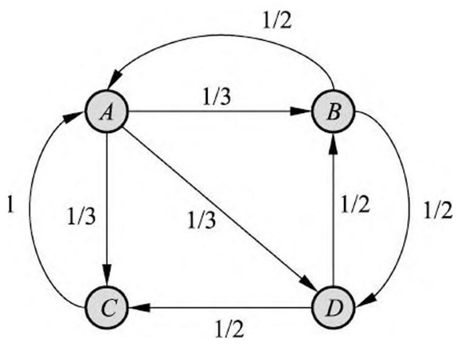
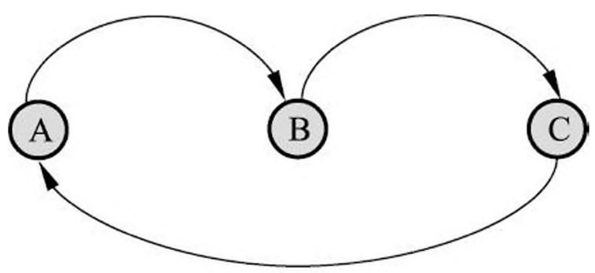
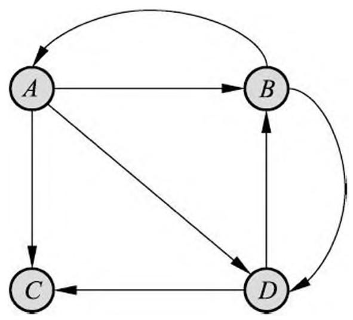
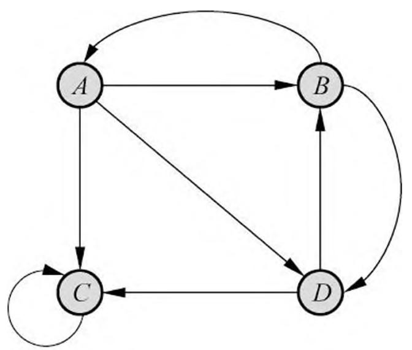
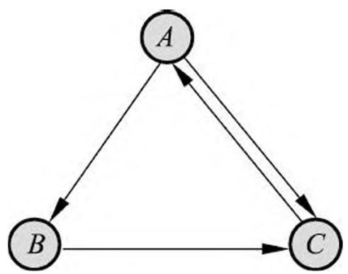

# 第 21 章 PageRank 算法

在实际应用中许多数据都以图（graph）的形式存在，比如，互联网、社交网络都可以看作是一个图。图数据上的机器学习具有理论与应用上的重要意义。PageRank 算法是图的链接分析（link analysis）的代表性算法，属于图数据上的无监督学习方法。

PageRank 算法最初作为互联网网页重要度的计算方法，1996 年由 Page 和 Brin 提出，并用于谷歌搜索引擎的网页排序。事实上，PageRank 可以定义在任意有向图上，后来被应用到社会影响力分析、文本摘要等多个问题。

PageRank 算法的基本想法是在有向图上定义一个随机游走模型，即一阶马尔可夫链，描述随机游走者沿着有向图随机访问各个结点的行为。在一定条件下，极限情况访问每个结点的概率收敛到平稳分布，这时各个结点的平稳概率值就是其 PageRank 值，表示结点的重要度。PageRank 是递归定义的，PageRank 的计算可以通过迭代算法进行。

本章 21.1 节给出 PageRank 的定义，21.2 节叙述 PageRank 的计算方法，包括常用的幂法（power method）。

## 21.1 PageRank 的定义

## 21.1.1 基本想法

历史上，PageRank 算法作为计算互联网网页重要度的算法被提出。PageRank 是定义在网页集合上的一个函数，它对每个网页给出一个正实数，表示网页的重要程度，整体构成一个向量，PageRank 值越高，网页就越重要，在互联网搜索的排序中可能就被排在前面 ①。

> - ① 网页在搜索引擎上的排序，除了网页本身的重要度以外，还由网页与查询的匹配度决定。在互联网搜索中，网页的 PageRank 与查询无关，可以事先离线计算，加入网页索引。

假设互联网是一个有向图，在其基础上定义随机游走模型，即一阶马尔可夫链，表示网页浏览者在互联网上随机浏览网页的过程。假设浏览者在每个网页依照连接出去的超链接以等概率跳转到下一个网页，并在网上持续不断进行这样的随机跳转，这个过程形成一阶马尔可夫链。PageRank 表示这个马尔可夫链的平稳分布。每个网页的 PageRank 值就是平稳概率。

图 21.1 表示一个有向图，假设是简化的互联网例，结点 $A, B, C$ 和 $D$ 表示网页，结点之间的有向边表示网页之间的超链接，边上的权值表示网页之间随机跳转的概率。假设有一个浏览者，在网上随机游走。如果浏览者在网页 $A$ ，则下一步以 1/3 的概率转移到网页 $B, C$ 和 $D$ 。如果浏览者在网页 $B$ ，则下一步以 1/2 的概率转移到网页 $A$ 和 $D$ 。如果浏览者在网页 $C$ ，则下一步以概率 1 转移到网页 $A$ 。如果浏览者在网页 $D$ ，则下一步以 1/2 的概率转移到网页 $B$ 和 $C$ 。

> 图 21.1 有向图

直观上，一个网页，如果指向该网页的超链接越多，随机跳转到该网页的概率也就越高，该网页的 PageRank 值就越高，这个网页也就越重要。一个网页，如果指向该网页的 PageRank 值越高，随机跳转到该网页的概率也就越高，该网页的 PageRank 值就越高，这个网页也就越重要。PageRank 值依赖于网络的拓扑结构，一旦网络的拓扑（连接关系）确定，PageRank 值就确定。

PageRank 的计算可以在互联网的有向图上进行，通常是一个迭代过程。先假设一个初始分布，通过迭代，不断计算所有网页的 PageRank 值，直到收敛为止。

下面首先给出有向图及有向图上随机游走模型的定义，然后给出 PageRank 的基本定义，以及 PageRank 的一般定义。基本定义对应于理想情况，一般定义对应于现实情况。

## 21.1.2 有向图和随机游走模型

## 1. 有向图

定义 21.1（有向图）有向图（directed graph）记作 $G = (V, E)$ ，其中 $V$ 和 $E$ 分别表示结点和有向边的集合。

比如，互联网就可以看作是一个有向图，每个网页是有向图的一个结点，网页之间的每一条超链接是有向图的一条边。

从一个结点出发到达另一个结点，所经过的边的一个序列称为一条路径（path），路径上边的个数称为路径的长度。如果一个有向图从其中任何一个结点出发可以到达其他任何一个结点，就称这个有向图是强连通图（strongly connected graph）。图 21.1 中的有向图就是一个强连通图。

假设 $k$ 是一个大于 1 的自然数，如果从有向图的一个结点出发返回到这个结点的路径的长度都是 $k$ 的倍数，那么称这个结点为周期性结点。如果一个有向图不含有周期性结点，则称这个有向图为非周期性图（aperiodic graph），否则为周期性图。

图 21.2 是一个周期性有向图的例子。从结点 $A$ 出发返回到 $A$ ，必须经过路径 $A - B - C - A$ ，所有可能的路径的长度都是 3 的倍数，所以结点 $A$ 是周期性结点。这个有向图是周期性图。

> 图 21.2 周期性有向图

## 2. 随机游走模型

定义 21.2（随机游走模型）给定一个含有 $n$ 个结点的有向图，在有向图上定义随机游走（random walk）模型，即一阶马尔可夫链 ①，其中结点表示状态，有向边表示状态之间的转移，假设从一个结点到通过有向边相连的所有结点的转移概率相等。具体地，转移矩阵是一个 $n$ 阶矩阵 $M$

> - ① 马尔可夫链的介绍可参照第 19 章。

$$
M = \left[ m _ {i j} \right] _ {n \times n} \tag {21.1}
$$

第 $i$ 行第 $j$ 列的元素 $m_{ij}$ 取值规则如下：如果结点 $j$ 有 $k$ 个有向边连出，并且结点 $i$ 是其连出的一个结点，则 $m_{ij} = \frac{1}{k}$ ；否则 $m_{ij} = 0, i,j = 1,2,\dots,n$ 。

注意转移矩阵具有性质：

$$
m _ {i j} \geqslant 0 \tag {21.2}
$$

$$
\sum_ {i = 1} ^ {n} m _ {i j} = 1 \tag {21.3}
$$

即每个元素非负，每列元素之和为 1，即矩阵 $M$ 为随机矩阵（stochastic matrix）。

在有向图上的随机游走形成马尔可夫链。也就是说，随机游走者每经一个单位时间转移一个状态，如果当前时刻在第 $j$ 个结点（状态），那么下一个时刻在第 $i$ 个结点（状态）的概率是 $m_{ij}$ ，这一概率只依赖于当前的状态，与过去无关，具有马尔可夫性。

在图 21.1 的有向图上可以定义随机游走模型。结点 $A$ 到结点 $B, C$ 和 $D$ 存在有向边，可以以概率 $1/3$ 从 $A$ 分别转移到 $B, C$ 和 $D$ ，并以概率 0 转移到 $A$ ，于是可以写出转移矩阵的第 1 列。结点 $B$ 到结点 $A$ 和 $D$ 存在有向边，可以以概率 $1/2$ 从 $B$ 分别转移到 $A$ 和 $D$ ，并以概率 0 分别转移到 $B$ 和 $C$ ，于是可以写出矩阵的第 2 列。等等。于是得到转移矩阵

$$
M = \left[ \begin{array}{c c c c} 0 & 1 / 2 & 1 & 0 \\ 1 / 3 & 0 & 0 & 1 / 2 \\ 1 / 3 & 0 & 0 & 1 / 2 \\ 1 / 3 & 1 / 2 & 0 & 0 \end{array} \right]
$$

随机游走在某个时刻 $t$ 访问各个结点的概率分布就是马尔可夫链在时刻 $t$ 的状态分布，可以用一个 $n$ 维列向量 $R_{t}$ 表示，那么在时刻 $t + 1$ 访问各个结点的概率分布 $R_{t + 1}$ 满足

$$
R _ {t + 1} = M R _ {t} \tag {21.4}
$$

## 21.1.3 PageRank 的基本定义

给定一个包含 $n$ 个结点的强连通且非周期性的有向图，在其基础上定义随机游走模型。假设转移矩阵为 $M$ ，在时刻 $0,1,2,\dots,t,\dots$ 访问各个结点的概率分布为

$$
R _ {0}, M R _ {0}, M ^ {2} R _ {0}, \dots , M ^ {t} R _ {0}, \dots
$$

则极限

$$
\lim  _ {t \rightarrow \infty} M ^ {t} R _ {0} = R \tag {21.5}
$$

存在，极限向量 $R$ 表示马尔可夫链的平稳分布，满足

$$
M R = R
$$

定义 21.3（PageRank 的基本定义）给定一个包含 $n$ 个结点 $v_{1}, v_{2}, \dots, v_{n}$ 的强连通且非周期性的有向图，在有向图上定义随机游走模型，即一阶马尔可夫链。随机游走的特点是从一个结点到有有向边连出的所有结点的转移概率相等，转移矩阵为 $M$ 。这个马尔可夫链具有平稳分布 $R$

$$
M R = R \tag {21.6}
$$

平稳分布 $R$ 称为这个有向图的 PageRank。 $R$ 的各个分量称为各个结点的 PageRank 值。

$$
R = \left[ \begin{array}{c} P R (v _ {1}) \\ P R (v _ {2}) \\ \vdots \\ P R (v _ {n}) \end{array} \right]
$$

其中 $PR(v_{i}), i = 1,2,\dots ,n$ ，表示结点 $\boldsymbol{v}_{i}$ 的 PageRank 值。

显然有

$$
P R \left(v _ {i}\right) \geqslant 0, \quad i = 1, 2, \dots , n \tag {21.7}
$$

$$
\sum_ {i = 1} ^ {n} P R \left(v _ {i}\right) = 1 \tag {21.8}
$$

$$
P R \left(v _ {i}\right) = \sum_ {v _ {j} \in M \left(v _ {i}\right)} \frac {P R \left(v _ {j}\right)}{L \left(v _ {j}\right)}, \quad i = 1, 2, \dots , n \tag {21.9}
$$

这里 $M(v_{i})$ 表示指向结点 $\pmb{v_{i}}$ 的结点集合， $L(v_{j})$ 表示结点 $\pmb{v_{j}}$ 连出的有向边的个数。

PageRank 的基本定义是理想化的情况，在这种情况下，PageRank 存在，而且可以通过不断迭代求得 PageRank 值。

定理 21.1 不可约且非周期的有限状态马尔可夫链，有唯一平稳分布存在，并且当时间趋于无穷时状态分布收敛于唯一的平稳分布。

根据马尔可夫链平稳分布定理，强连通且非周期的有向图上定义的随机游走模型（马尔可夫链），在图上的随机游走当时间趋于无穷时状态分布收敛于唯一的平稳分布。

例 21.1 已知图 21.1 的有向图，求该图的 PageRank。① 解 转移矩阵

> - ① 例 21.1 和例 21.2 来自于文献[2]。

$$
M = \left[ \begin{array}{c c c c} 0 & 1 / 2 & 1 & 0 \\ 1 / 3 & 0 & 0 & 1 / 2 \\ 1 / 3 & 0 & 0 & 1 / 2 \\ 1 / 3 & 1 / 2 & 0 & 0 \end{array} \right]
$$

取初始分布向量 $R_0$ 为

$$
R _ {0} = \left[ \begin{array}{l} 1 / 4 \\ 1 / 4 \\ 1 / 4 \\ 1 / 4 \end{array} \right]
$$

以转移矩阵 $M$ 连乘初始向量 $R_0$ 得到向量序列

$$
\left[ \begin{array}{l} 1 / 4 \\ 1 / 4 \\ 1 / 4 \\ 1 / 4 \end{array} \right], \quad \left[ \begin{array}{l} 9 / 2 4 \\ 5 / 2 4 \\ 5 / 2 4 \\ 5 / 2 4 \end{array} \right], \quad \left[ \begin{array}{l} 1 5 / 4 8 \\ 1 1 / 4 8 \\ 1 1 / 4 8 \\ 1 1 / 4 8 \end{array} \right], \quad \left[ \begin{array}{l} 1 1 / 3 2 \\ 7 / 3 2 \\ 7 / 3 2 \\ 7 / 3 2 \end{array} \right], \quad \dots , \quad \left[ \begin{array}{l} 3 / 9 \\ 2 / 9 \\ 2 / 9 \\ 2 / 9 \end{array} \right]
$$

最后得到极限向量

$$
R = \left[ \begin{array}{l} 3 / 9 \\ 2 / 9 \\ 2 / 9 \\ 2 / 9 \end{array} \right]
$$

即有向图的 PageRank 值。

一般的有向图未必满足强连通且非周期性的条件。比如，在互联网，大部分网页没有连接出去的超链接，也就是说从这些网页无法跳转到其他网页。所以 PageRank 的基本定义不适用。

例 21.2 从图 21.1 的有向图中去掉由 $C$ 到 $A$ 的边，得到图 21.3 的有向图。在图 21.3 的有向图中，结点 $C$ 没有边连接出去。

> 图 21.3 有向图

图 21.3 的有向图的转移矩阵 $M$ 是

$$
M = \left[ \begin{array}{c c c c} 0 & 1 / 2 & 0 & 0 \\ 1 / 3 & 0 & 0 & 1 / 2 \\ 1 / 3 & 0 & 0 & 1 / 2 \\ 1 / 3 & 1 / 2 & 0 & 0 \end{array} \right]
$$

这时 $M$ 不是一个随机矩阵，因为随机矩阵要求每一列的元素之和是 1，这里第 3 列的和是 0，不是 1。

如果仍然计算在各个时刻的各个结点的概率分布，就会得到如下结果

$$
\left[ \begin{array}{l} 1 / 4 \\ 1 / 4 \\ 1 / 4 \\ 1 / 4 \end{array} \right], \quad \left[ \begin{array}{l} 3 / 2 4 \\ 5 / 2 4 \\ 5 / 2 4 \\ 5 / 2 4 \end{array} \right], \quad \left[ \begin{array}{l} 5 / 4 8 \\ 7 / 4 8 \\ 7 / 4 8 \\ 7 / 4 8 \end{array} \right], \quad \left[ \begin{array}{l} 2 1 / 2 8 8 \\ 3 1 / 2 8 8 \\ 3 1 / 2 8 8 \\ 3 1 / 2 8 8 \end{array} \right], \dots , \quad \left[ \begin{array}{l} 0 \\ 0 \\ 0 \\ 0 \end{array} \right]
$$

可以看到，随着时间推移，访问各个结点的概率皆变为 0。

## 21.1.4 PageRank 的一般定义

PageRank 一般定义的想法是在基本定义的基础上导入平滑项。

给定一个含有 $n$ 个结点 $v_{i}, i = 1,2,\dots ,n$ ，的任意有向图，假设考虑一个在图上随机游走模型，即一阶马尔可夫链，其转移矩阵是 $M$ ，从一个结点到其连出的所有结点的转移概率相等。这个马尔可夫链未必具有平稳分布。假设考虑另一个完全随机游走的模型，其转移矩阵的元素全部为 $1 / n$ ，也就是说从任意一个结点到任意一个结点的转移概率都是 $1 / n$ 。两个转移矩阵的线性组合又构成一个新的转移矩阵，在其上可以定义一个新的马尔可夫链。容易证明这个马尔可夫链一定具有平稳分布，且平稳分布满足

$$
R = d M R + \frac {1 - d}{n} \mathbf {1} \tag {21.10}
$$

式中 $d(0 \leqslant d \leqslant 1)$ 是系数，称为阻尼因子（damping factor）， $R$ 是 $n$ 维向量， $\mathbf{1}$ 是所有分量为 1 的 $n$ 维向量。 $R$ 表示的就是有向图的一般 PageRank。

$$
R = \left[ \begin{array}{c} P R (v _ {1}) \\ P R (v _ {2}) \\ \vdots \\ P R (v _ {n}) \end{array} \right]
$$

$PR(v_{i}), i = 1,2,\dots ,n$ ，表示结点 $v_{i}$ 的 PageRank 值。

式 (21.10) 中第一项表示（状态分布是平稳分布时）依照转移矩阵 $M$ 访问各个结点的概率，第二项表示完全随机访问各个结点的概率。阻尼因子 $d$ 取值由经验决定，例如 $d = 0.85$ 。当 $d$ 接近 1 时，随机游走主要依照转移矩阵 $M$ 进行；当 $d$ 接近 0 时，随机游走主要以等概率随机访问各个结点。

可以由式 (21.10) 写出每个结点的 PageRank, 这是一般 PageRank 的定义。

$$
P R \left(v _ {i}\right) = d \left(\sum_ {v _ {j} \in M \left(v _ {i}\right)} \frac {P R \left(v _ {j}\right)}{L \left(v _ {j}\right)}\right) + \frac {1 - d}{n}, \quad i = 1, 2, \dots , n \tag {21.11}
$$

这里 $M(v_{i})$ 是指向结点 $\boldsymbol{v}_{i}$ 的结点集合， $L(v_{j})$ 是结点 $\boldsymbol{v}_{j}$ 连出的边的个数。

第二项称为平滑项，由于采用平滑项，所有结点的 PageRank 值都不会为 0，具有以下性质：

$$
P R \left(v _ {i}\right) > 0, \quad i = 1, 2, \dots , n \tag {21.12}
$$

$$
\sum_ {i = 1} ^ {n} P R \left(v _ {i}\right) = 1 \tag {21.13}
$$

下面给出 PageRank 的一般定义。

定义 21.4（PageRank 的一般定义）给定一个含有 $n$ 个结点的任意有向图，在有向图上定义一个一般的随机游走模型，即一阶马尔可夫链。一般的随机游走模型的转移矩阵由两部分的线性组合组成，一部分是有向图的基本转移矩阵 $M$ ，表示从一个结点到其连出的所有结点的转移概率相等，另一部分是完全随机的转移矩阵，表示从任意一个结点到任意一个结点的转移概率都是 $1 / n$ ，线性组合系数为阻尼因子 $d(0 \leqslant d \leqslant 1)$ 。这个一般随机游走的马尔可夫链存在平稳分布，记作 $R$ 。定义平稳分布向量 $R$ 为这个有向图的一般 PageRank。 $R$ 由公式

$$
R = d M R + \frac {1 - d}{n} \mathbf {1} \tag {21.14}
$$

决定，其中 1 是所有分量为 1 的 $n$ 维向量。

一般 PageRank 的定义意味着互联网浏览者，按照以下方法在网上随机游走：在任意一个网页上，浏览者或者以概率 $d$ 决定按照超链接随机跳转，这时以等概率从连接出去的超链接跳转到下一个网页；或者以概率 $(1 - d)$ 决定完全随机跳转，这时以等概率 $1 / n$ 跳转到任意一个网页。第二个机制保证从没有连接出去的超链接的网页也可以跳转出。这样可以保证平稳分布，即一般 PageRank 的存在，因而一般 PageRank 适用于任何结构的网络。

## 21.2 PageRank 的计算

PageRank 的定义是构造性的，即定义本身就给出了算法。本节列出 PageRank 的计算方法包括迭代算法、幂法、代数算法。常用的方法是幂法。

## 21.2.1 迭代算法

给定一个含有 $n$ 个结点的有向图，转移矩阵为 $M$ ，有向图的一般 PageRank 由迭代公式

$$
R _ {t + 1} = d M R _ {t} + \frac {1 - d}{n} \mathbf {1} \tag {21.15}
$$

的极限向量 $R$ 确定。

PageRank 的迭代算法, 就是按照这个一般定义进行迭代, 直至收敛。

算法 21.1（PageRank 的迭代算法）输入：含有 $n$ 个结点的有向图，转移矩阵 $M$ ，阻尼因子 $d$ ，初始向量 $R_0$输出：有向图的 PageRank 向量 $R$ 。

(1) 令 $t = 0$(2) 计算

$$
R _ {t + 1} = d M R _ {t} + \frac {1 - d}{n} \mathbf {1}
$$

- （3）如果 $R_{t + 1}$ 与 $R_{t}$ 充分接近，令 $R = R_{t + 1}$ ，停止迭代。
- （4）否则，令 $t = t + 1$ ，执行步（2）。

例 21.3 给定图 21.4 所示的有向图，取 $d = 0.8$ ，求图的 PageRank。

解 从图 21.4 得知转移矩阵为

$$
M = \left[ \begin{array}{c c c c} 0 & 1 / 2 & 0 & 0 \\ 1 / 3 & 0 & 0 & 1 / 2 \\ 1 / 3 & 0 & 1 & 1 / 2 \\ 1 / 3 & 1 / 2 & 0 & 0 \end{array} \right]
$$

> 图 21.4 有向图

按照式 (21.15) 计算

$$
d M = \frac {4}{5} \times \left[ \begin{array}{c c c c} 0 & 1 / 2 & 0 & 0 \\ 1 / 3 & 0 & 0 & 1 / 2 \\ 1 / 3 & 0 & 1 & 1 / 2 \\ 1 / 3 & 1 / 2 & 0 & 0 \end{array} \right] = \left[ \begin{array}{c c c c} 0 & 2 / 5 & 0 & 0 \\ 4 / 1 5 & 0 & 0 & 2 / 5 \\ 4 / 1 5 & 0 & 4 / 5 & 2 / 5 \\ 4 / 1 5 & 2 / 5 & 0 & 0 \end{array} \right]
$$

$$
\frac {1 - d}{n} \mathbf {1} = \left[ \begin{array}{l} 1 / 2 0 \\ 1 / 2 0 \\ 1 / 2 0 \\ 1 / 2 0 \end{array} \right]
$$

迭代公式为

$$
R _ {t + 1} = \left[ \begin{array}{c c c c} 0 & 2 / 5 & 0 & 0 \\ 4 / 1 5 & 0 & 0 & 2 / 5 \\ 4 / 1 5 & 0 & 4 / 5 & 2 / 5 \\ 4 / 1 5 & 2 / 5 & 0 & 0 \end{array} \right] R _ {t} + \left[ \begin{array}{c} 1 / 2 0 \\ 1 / 2 0 \\ 1 / 2 0 \\ 1 / 2 0 \end{array} \right]
$$

令初始向量

$$
R _ {0} = \left[ \begin{array}{l} 1 / 4 \\ 1 / 4 \\ 1 / 4 \\ 1 / 4 \end{array} \right]
$$

进行迭代

$$
\begin{array}{l} R _ {1} = \left[ \begin{array}{c c c c} 0 & 2 / 5 & 0 & 0 \\ 4 / 1 5 & 0 & 0 & 2 / 5 \\ 4 / 1 5 & 0 & 4 / 5 & 2 / 5 \\ 4 / 1 5 & 2 / 5 & 0 & 0 \end{array} \right] \left[ \begin{array}{l} 1 / 4 \\ 1 / 4 \\ 1 / 4 \\ 1 / 4 \end{array} \right] + \left[ \begin{array}{l} 1 / 2 0 \\ 1 / 2 0 \\ 1 / 2 0 \\ 1 / 2 0 \end{array} \right] = \left[ \begin{array}{l} 9 / 6 0 \\ 1 3 / 6 0 \\ 2 5 / 6 0 \\ 1 3 / 6 0 \end{array} \right] \\ R _ {2} = \left[ \begin{array}{c c c c} 0 & 2 / 5 & 0 & 0 \\ 4 / 1 5 & 0 & 0 & 2 / 5 \\ 4 / 1 5 & 0 & 4 / 5 & 2 / 5 \\ 4 / 1 5 & 2 / 5 & 0 & 0 \end{array} \right] \left[ \begin{array}{c} 9 / 6 0 \\ 1 3 / 6 0 \\ 2 5 / 6 0 \\ 1 3 / 6 0 \end{array} \right] + \left[ \begin{array}{c} 1 / 2 0 \\ 1 / 2 0 \\ 1 / 2 0 \\ 1 / 2 0 \end{array} \right] = \left[ \begin{array}{c} 4 1 / 3 0 0 \\ 5 3 / 3 0 0 \\ 1 5 3 / 3 0 0 \\ 5 3 / 3 0 0 \end{array} \right] \\ \end{array}
$$

等等。最后得到

$$
\left[ \begin{array}{l} 1 / 4 \\ 1 / 4 \\ 1 / 4 \\ 1 / 4 \end{array} \right], \left[ \begin{array}{l} 9 / 6 0 \\ 1 3 / 6 0 \\ 2 5 / 6 0 \\ 1 3 / 6 0 \end{array} \right], \left[ \begin{array}{l} 4 1 / 3 0 0 \\ 5 3 / 3 0 0 \\ 1 5 3 / 3 0 0 \\ 5 3 / 3 0 0 \end{array} \right], \left[ \begin{array}{l} 5 4 3 / 4 5 0 0 \\ 7 0 7 / 4 5 0 0 \\ 2 5 4 3 / 4 5 0 0 \\ 7 0 7 / 4 5 0 0 \end{array} \right], \dots , \left[ \begin{array}{l} 1 5 / 1 4 8 \\ 1 9 / 1 4 8 \\ 9 5 / 1 4 8 \\ 1 9 / 1 4 8 \end{array} \right]
$$

计算结果表明，结点 $C$ 的 PageRank 值超过一半，其他结点也有相应的 PageRank 值。

## 21.2.2 幂法

幂法（power method）是一个常用的 PageRank 计算方法，通过近似计算矩阵的主特征值和主特征向量求得有向图的一般 PageRank。

首先介绍幂法。幂法主要用于近似计算矩阵的主特征值（dominant eigenvalue）和主特征向量（dominant eigenvector）。主特征值是指绝对值最大的特征值，主特征向量是其对应的特征向量。注意特征向量不是唯一的，只是其方向是确定的，乘上任意系数还是特征向量。

假设要求 $n$ 阶矩阵 $A$ 的主特征值和主特征向量，采用下面的步骤。

首先，任取一个初始 $n$ 维向量 $x_0$ ，构造如下的一个 $n$ 维向量序列

$$
x _ {0}, \quad x _ {1} = A x _ {0}, \quad x _ {2} = A x _ {1}, \quad \dots , \quad x _ {k} = A x _ {k - 1}
$$

然后，假设矩阵 $A$ 有 $n$ 个特征值，按照绝对值大小排列

$$
\left| \lambda_ {1} \right| \geqslant \left| \lambda_ {2} \right| \geqslant \dots \geqslant \left| \lambda_ {n} \right|
$$

对应的 $n$ 个线性无关的特征向量为

$$
u _ {1}, u _ {2}, \dots , u _ {n}
$$

这 $n$ 个特征向量构成 $n$ 维空间的一组基。

于是，可以将初始向量 $x_0$ 表示为 $u_{1}, u_{2}, \dots, u_{n}$ 的线性组合

$$
x _ {0} = a _ {1} u _ {1} + a _ {2} u _ {2} + \dots + a _ {n} u _ {n}
$$

得到

$$
x _ {1} = A x _ {0} = a _ {1} A u _ {1} + a _ {2} A u _ {2} + \dots + a _ {n} A u _ {n}
$$

$$
\begin{array}{l} x _ {k} = A ^ {k} x _ {0} = a _ {1} A ^ {k} u _ {1} + a _ {2} A ^ {k} u _ {2} + \dots + a _ {n} A ^ {k} u _ {n} \\ = a _ {1} \lambda_ {1} ^ {k} u _ {1} + a _ {2} \lambda_ {2} ^ {k} u _ {2} + \dots + a _ {n} \lambda_ {n} ^ {k} u _ {n} \\ \end{array}
$$

接着，假设矩阵 $A$ 的主特征值 $\lambda_{1}$ 是特征方程的单根，由上式得

$$
x _ {k} = a _ {1} \lambda_ {1} ^ {k} \left[ u _ {1} + \frac {a _ {2}}{a _ {1}} \left(\frac {\lambda_ {2}}{\lambda_ {1}}\right) ^ {k} u _ {2} + \dots + \frac {a _ {n}}{a _ {1}} \left(\frac {\lambda_ {n}}{\lambda_ {1}}\right) ^ {k} u _ {n} \right] \tag {21.16}
$$

由于 $|\lambda_1| > |\lambda_j|$ , $j = 2, \dots, n$ , 当 $k$ 充分大时有

$$
x _ {k} = a _ {1} \lambda_ {1} ^ {k} \left[ u _ {1} + \varepsilon_ {k} \right] \tag {21.17}
$$

这里 $\varepsilon_{k}$ 是当 $k\to \infty$ 时的无穷小量， $\varepsilon_{k}\rightarrow 0(k\rightarrow \infty)$ 。即

$$
x _ {k} \rightarrow a _ {1} \lambda_ {1} ^ {k} u _ {1} (k \rightarrow \infty) \tag {21.18}
$$

说明当 $k$ 充分大时向量 $x_{k}$ 与特征向量 $u_{1}$ 只相差一个系数。由式(21.18)知，

$$
\begin{array}{l} x _ {k} \approx a _ {1} \lambda_ {1} ^ {k} u _ {1} \\ x _ {k + 1} \approx a _ {1} \lambda_ {1} ^ {k + 1} u _ {1} \\ \end{array}
$$

于是主特征值 $\lambda_{1}$ 可表示为

$$
\lambda_ {1} \approx \frac {x _ {k + 1 , j}}{x _ {k , j}} \tag {21.19}
$$

其中 $x_{k,j}$ 和 $x_{k+1,j}$ 分别是 $x_k$ 和 $x_{k+1}$ 的第 $j$ 个分量。

在实际计算时，为了避免出现绝对值过大或过小的情况，通常在每步迭代后即进行规范化，将向量除以其范数，即

$$
y _ {t + 1} = A x _ {t} \tag {21.20}
$$

$$
x _ {t + 1} = \frac {y _ {t + 1}}{\| y _ {t + 1} \|} \tag {21.21}
$$

这里的范数是向量的无穷范数，即向量各分量的绝对值的最大值

$$
\left\| x \right\| _ {\infty} = \operatorname * {m a x} \{| x _ {1} |, | x _ {2} |, \dots , | x _ {n} | \}
$$

现在回到计算一般 PageRank。

转移矩阵可以写作

$$
R = \left(d M + \frac {1 - d}{n} \mathbf {E}\right) R = A R \tag {21.22}
$$

其中 $d$ 是阻尼因子， $\mathbf{E}$ 是所有元素为 1 的 $n$ 阶方阵。根据 Perron-Frobenius 定理 ①，一般 PageRank 的向量 $R$ 是矩阵 $A$ 的主特征向量，主特征值是 1。所以可以使用幂法近似计算一般 PageRank。

> - ① Perron-Frobenius 定理的形式比较复杂，这里不予叙述。

## 算法 21.2（计算一般 PageRank 的幂法）

输入：含有 $n$ 个结点的有向图，有向图的转移矩阵 $M$ ，系数 $d$ ，初始向量 $x_0$ ，计算精度 $\varepsilon$输出：有向图的 PageRank $R$ 。

- （1）令 $t = 0$ ，选择初始向量 $x_0$
- （2）计算有向图的一般转移矩阵 $A$

$$
A = d M + \frac {1 - d}{n} \mathbf {E}
$$

(3) 迭代并规范化结果向量

$$
y _ {t + 1} = A x _ {t}
$$

$$
x _ {t + 1} = \frac {y _ {t + 1}}{\left\| y _ {t + 1} \right\|}
$$

（4）当 $\| x_{t + 1} - x_t\| < \varepsilon$ 时，令 $R = x_{t}$ ，停止迭代。

（5）否则，令 $t = t + 1$ ，执行步（3）。

(6) 对 $R$ 进行规范化处理, 使其表示概率分布。

例 21.4 给定一个如图 21.5 所示的有向图，取 $d = 0.85$ ，求有向图的一般 PageRank。

> 图 21.5 有向图

解 利用幂法，按照算法 21.2，计算有向图的一般 PageRank。

由图 21.5 可知转移矩阵

$$
M = \left[ \begin{array}{r r r} 0 & 0 & 1 \\ 1 / 2 & 0 & 0 \\ 1 / 2 & 1 & 0 \end{array} \right]
$$

（1）令 $t = 0$

$$
x _ {0} = \left[ \begin{array}{l} 1 \\ 1 \\ 1 \end{array} \right]
$$

（2）计算有向图的一般转移矩阵 $A$

$$
\begin{array}{l} A = d M + \frac {1 - d}{n} \mathbf {E} \\ = 0. 8 5 \times \left[ \begin{array}{c c c} 0 & 0 & 1 \\ 1 / 2 & 0 & 0 \\ 1 / 2 & 1 & 0 \end{array} \right] + \frac {0 . 1 5}{3} \times \left[ \begin{array}{c c c} 1 & 1 & 1 \\ 1 & 1 & 1 \\ 1 & 1 & 1 \end{array} \right] \\ = \left[ \begin{array}{l l l} 0. 0 5 & 0. 0 5 & 0. 9 \\ 0. 4 7 5 & 0. 0 5 & 0. 0 5 \\ 0. 4 7 5 & 0. 9 & 0. 0 5 \end{array} \right] \\ \end{array}
$$

（3）迭代并规范化

$$
y _ {1} = A x _ {0} = \left[ \begin{array}{l} 1 \\ 0. 5 7 5 \\ 1. 4 2 5 \end{array} \right]
$$

$$
x _ {1} = \frac {1}{1 . 4 2 5} \left[ \begin{array}{l} 1 \\ 0. 5 7 5 \\ 1. 4 2 5 \end{array} \right] = \left[ \begin{array}{l} 0. 7 0 1 8 \\ 0. 4 0 3 5 \\ 1 \end{array} \right]
$$

$$
y _ {2} = A x _ {1} = \left[ \begin{array}{l l l} 0. 0 5 & 0. 0 5 & 0. 9 \\ 0. 4 7 5 & 0. 0 5 & 0. 0 5 \\ 0. 4 7 5 & 0. 9 & 0. 0 5 \end{array} \right] \left[ \begin{array}{l} 0. 7 0 1 8 \\ 0. 4 0 3 5 \\ 1 \end{array} \right] = \left[ \begin{array}{l} 0. 9 5 5 3 \\ 0. 4 0 3 5 \\ 0. 7 4 6 5 \end{array} \right]
$$

$$
x _ {2} = \frac {1}{0 . 9 5 5 3} \left[ \begin{array}{l} 0. 9 5 5 3 \\ 0. 4 0 3 5 \\ 0. 7 4 6 5 \end{array} \right] = \left[ \begin{array}{l} 1 \\ 0. 4 2 2 4 \\ 0. 7 8 1 4 \end{array} \right]
$$

$$
y _ {3} = A x _ {2} = \left[ \begin{array}{l l l} 0. 0 5 & 0. 0 5 & 0. 9 \\ 0. 4 7 5 & 0. 0 5 & 0. 0 5 \\ 0. 4 7 5 & 0. 9 & 0. 0 5 \end{array} \right] \left[ \begin{array}{l} 1 \\ 0. 4 2 2 4 \\ 0. 7 8 1 4 \end{array} \right] = \left[ \begin{array}{l} 0. 7 7 4 4 \\ 0. 5 3 5 2 \\ 0. 8 9 4 3 \end{array} \right]
$$

$$
x _ {3} = \frac {1}{0 . 8 9 4 3} \left[ \begin{array}{l} 0. 7 7 4 4 \\ 0. 5 3 5 2 \\ 0. 8 9 4 3 \end{array} \right] = \left[ \begin{array}{l} 0. 8 6 5 9 \\ 0. 5 9 8 5 \\ 1 \end{array} \right]
$$

如此继续迭代规范化，得到 $x_{t}$ ， $t = 0,1,2,\dots ,21,22$ ，的向量序列

$$
\left[ \begin{array}{l} 1 \\ 1 \\ 1 \end{array} \right], \quad \left[ \begin{array}{l} 0. 7 0 1 8 \\ 0. 4 0 3 5 \\ 1 \end{array} \right], \quad \left[ \begin{array}{l} 1 \\ 0. 4 2 2 4 \\ 0. 7 8 1 4 \end{array} \right], \quad \left[ \begin{array}{l} 0. 8 6 5 9 \\ 0. 5 9 8 5 \\ 1 \end{array} \right], \quad \left[ \begin{array}{l} 0. 9 7 3 2 \\ 0. 4 9 1 2 \\ 1 \end{array} \right], \quad \left[ \begin{array}{l} 1 \\ 0. 5 5 1 6 \\ 0. 9 8 0 7 \end{array} \right],
$$

$$
\left[ \begin{array}{l} 0. 9 4 0 9 \\ 0. 5 4 0 5 \\ 1 \end{array} \right], \dots , \left[ \begin{array}{l} 0. 9 7 6 0 \\ 0. 5 4 0 8 \\ 1 \end{array} \right], \left[ \begin{array}{l} 0. 9 7 5 5 \\ 0. 5 4 0 4 \\ 1 \end{array} \right], \left[ \begin{array}{l} 0. 9 7 6 1 \\ 0. 5 4 0 6 \\ 1 \end{array} \right], \left[ \begin{array}{l} 0. 9 7 5 6 \\ 0. 5 4 0 6 \\ 1 \end{array} \right], \left[ \begin{array}{l} 0. 9 7 5 8 \\ 0. 5 4 0 4 \\ 1 \end{array} \right]
$$

假设后面得到的两个向量已满足计算精度要求，那么取

$$
R = \left[ \begin{array}{l} 0. 9 7 5 6 \\ 0. 5 4 0 6 \\ 1 \end{array} \right]
$$

即得所求的一般 PageRank。如果将一般 PageRank 作为一个概率分布，进行规范化，使各分量之和为 1，那么相应的一般 PageRank 可以写作

$$
R = \left[ \begin{array}{l} 0. 3 8 7 7 \\ 0. 2 1 4 9 \\ 0. 3 9 7 4 \end{array} \right]
$$

## 21.2.3 代数算法

代数算法通过一般转移矩阵的逆矩阵计算求有向图的一般 PageRank。

按照一般 PageRank 的定义式(21.14)

$$
R = d M R + \frac {\mathbf {1} - d}{n} \mathbf {1}
$$

于是，

$$
(I - d M) R = \frac {1 - d}{n} \mathbf {1} \tag {21.23}
$$

$$
R = (I - d M) ^ {- 1} \frac {1 - d}{n} \mathbf {1} \tag {21.24}
$$

这里 $I$ 是单位矩阵。当 $0 < d < 1$ 时，线性方程组 (21.23) 的解存在且唯一。这样，可以通过求逆矩阵 $(I - dM)^{-1}$ 得到有向图的一般 PageRank。

## 本章概要

1. PageRank 是互联网网页重要度的计算方法，可以定义推广到任意有向图结点的重要度计算上。其基本思想是在有向图上定义随机游走模型，即一阶马尔可夫链，描述游走者沿着有向图随机访问各个结点的行为，在一定条件下，极限情况访问每个结点的概率收敛到平稳分布，这时各个结点的概率值就是其 PageRank 值，表示结点相对重要度。

2. 有向图上可以定义随机游走模型，即一阶马尔可夫链，其中结点表示状态，有向边表示状态之间的转移，假设一个结点到连接出的所有结点的转移概率相等。转移概率由转移矩阵 $M$ 表示

$$
M = \left[ m _ {i j} \right] _ {n \times n}
$$

第 $i$ 行第 $j$ 列的元素 $m_{ij}$ 表示从结点 $j$ 跳转到结点 $i$ 的概率。

3. 当含有 $n$ 个结点的有向图是强连通且非周期性的有向图时，在其基础上定义的随机游走模型，即一阶马尔可夫链具有平稳分布，平稳分布向量 $R$ 称为这个有向图的 PageRank。若矩阵 $M$ 是马尔可夫链的转移矩阵，则向量 $R$ 满足

$$
M R = R
$$

向量 $R$ 的各个分量称为各个结点的 PageRank 值。

$$
R = \left[ \begin{array}{c} P R (v _ {1}) \\ P R (v _ {2}) \\ \vdots \\ P R (v _ {n}) \end{array} \right]
$$

其中 $PR(v_{i}), i = 1,2,\dots ,n$ ，表示结点 $\boldsymbol{v}_{i}$ 的 PageRank 值。这是 PageRank 的基本定义。

4. PageRank 基本定义的条件现实中往往不能满足，对其进行扩展得到 PageRank 的一般定义。任意含有 $n$ 个结点的有向图上，可以定义一个随机游走模型，即一阶马尔可夫链，转移矩阵由两部分的线性组合组成，其中一部分按照转移矩阵 $M$ ，从一个结点到连接出的所有结点的转移概率相等，另一部分按照完全随机转移矩阵，从任一结点到任一结点的转移概率都是 $1 / n$ 。这个马尔可夫链存在平稳分布，平稳分布向量 $R$ 称为这个有向图的一般 PageRank，满足

$$
R = d M R + \frac {1 - d}{n} {\bf 1}
$$

其中 $d(0 \leqslant d \leqslant 1)$ 是阻尼因子， $\mathbf{1}$ 是所有分量为 1 的 $n$ 维向量。

5. PageRank 的计算方法包括迭代算法、幂法、代数算法。

幂法将 PageRank 的等价式写成

$$
R = \left(d M + \frac {1 - d}{n} \mathbf {E}\right) R = A R
$$

其中 $d$ 是阻尼因子， $\mathbf{E}$ 是所有元素为 1 的 $n$ 阶方阵。

可以看出 $R$ 是一般转移矩阵 $A$ 的主特征向量，即最大的特征值对应的特征向量。幂法就是一个计算矩阵的主特征值和主特征向量的方法。

步骤是：选择初始向量 $x_0$ ；计算一般转移矩阵 $A$ ；进行迭代并规范化向量

$$
y _ {t + 1} = A x _ {t}
$$

$$
x _ {t + 1} = \frac {\mathcal {Y} _ {t + 1}}{\| \mathcal {Y} _ {t + 1} \|}
$$

直至收敛。

## 继续阅读

PageRank 的原始论文是文献 [1], 其详细介绍可见文献 [2, 3]。介绍马尔可夫过程的教材有 [4]。与 PageRank 同样著名的链接分析算法还有 HITS 算法 [5], 可以发现网络中的枢纽与权威。PageRank 有不少扩展与变形, 原始的 PageRank 是基于离散时间马尔可夫链的, BrowseRank 是基于连续时间马尔可夫链的推广 [6], 可以更好地防范网页排名欺诈。Personalized PageRank 是个性化的 PageRank (文献 [7]), Topic Sensitive PageRank 是基于话题的 PageRank (文献 [8]), TrustRank 是防范网页排名欺诈的 PageRank (文献 [9])。

## 习题

- 21.1 假设方阵 $A$ 是随机矩阵，即其每个元素非负，每列元素之和为 1，证明 $A^k$ 仍然是随机矩阵，其中 $k$ 是自然数。
- 21.2 例 21.1 中，以不同的初始分布向量 $R_0$ 进行迭代，仍然得到同样的极限向量 $R$ ，即 PageRank。请验证。
- 21.3 证明 PageRank 一般定义中的马尔可夫链具有平稳分布，即式(21.11)成立。
- 21.4 证明随机矩阵的最大特征值为 1。

## 参考文献

- [1] Page L, Brin S, Motwani R, et al. The PageRank citation ranking: bringing order to the Web. Stanford University, 1999.
- [2] Rajaraman A, Ullman J D. Mining of massive datasets. Cambridge University Press, 2014.

- [3] Liu B. Web data mining: exploring hyperlinks, contents, and usage data. Springer Science & Business Media, 2007.
- [4] Serfzo R. Basics of applied stochastic processes. Springer, 2009.
- [5] Kleinberg J M. Authoritative sources in a hyperlinked environment. Journal of the ACM(JACM), 1999, 46(5): 604-632.
- [6] Liu Y, Gao B, Liu T Y, et al. BrowseRank: letting Web users vote for page importance. Proceedings of the 31st SIGIR Conference, 2008: 451-458.
- [7] Jeh G, Widom J. Scaling personalized Web search. Proceedings of the 12th WWW Conference, 2003: 271-279.
- [8] Haveliwala T H. Topic-sensitive PageRank. Proceedings of the 11th WWW Conference, 2002: 517-526.
- [9] Gyöngyi Z, Garcia-Molina H, Pedersen J. Combating Web spam with TrustRank. Proceedings of VLDB Conference, 2004: 576-587.