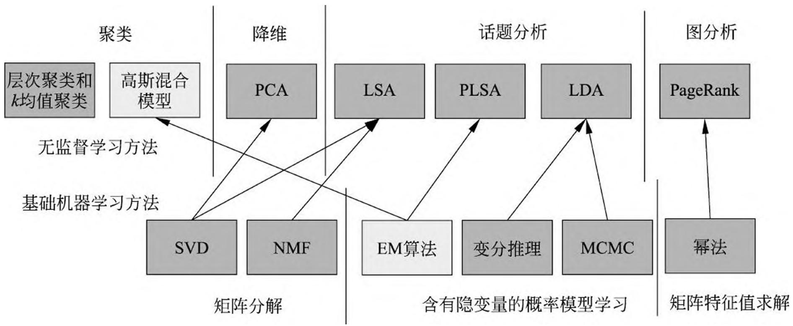
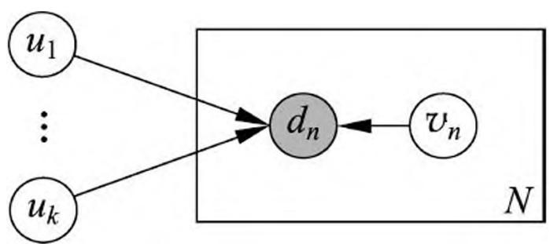
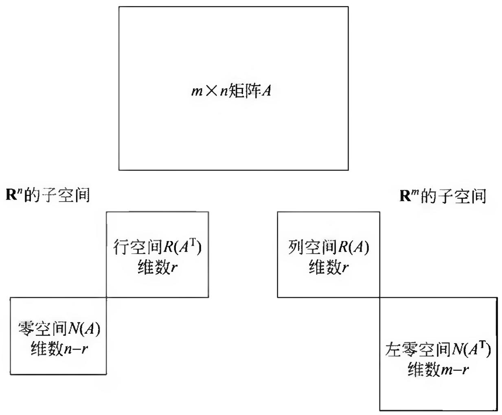

# 第 22 章 无监督学习方法总结

## 22.1 无监督学习方法的关系和特点

第 2 篇详细介绍了八种常用的统计机器学习方法，即聚类方法（包括层次聚类与 $k$ 均值聚类）、奇异值分解（SVD）、主成分分析（PCA）、潜在语义分析（LSA）、概率潜在语义分析（PLSA）、马尔可夫链蒙特卡罗法（MCMC，包括 Metropolis-Hastings 算法和吉布斯抽样）、潜在狄利克雷分配（LDA）、PageRank 算法。此外，还简单介绍了另外三种常用的统计机器学习方法，即非负矩阵分解（NMF）、变分推理、幂法。这些方法通常用于无监督学习的聚类、降维、话题分析以及图分析。

### 22.1.1 各种方法之间的关系

> 图 22.1 总结一些机器学习方法之间的关系，包括第 1 篇、第 2 篇介绍的方法，分别用深灰色与浅灰色表示。图中上面是无监督学习方法，下面是基础机器学习方法。 图 22.1 机器学习方法之间的关系

无监督学习用于聚类、降维、话题分析、图分析。聚类的方法有层次聚类、 $k$ 均值聚类、高斯混合模型，降维的方法有 PCA，话题分析的方法包括 LSA、PLSA、LDA，图分析的方法有 PageRank。

基础方法不涉及具体的机器学习模型。基础方法不仅可以用于无监督学习，也可以用于监督学习、半监督学习。基础方法分为矩阵分解，矩阵特征值求解，含有隐变量的概率模型估计，前两者是线性代数问题，后者是概率统计问题。矩阵分解的方法有 SVD 和 NMF，矩阵特征值求解的方法有幂法，含有隐变量的概率模型学习的方法有 EM 算法、变分推理、MCMC。

### 22.1.2 无监督学习方法

聚类有硬聚类和软聚类，层次聚类与 $k$ 均值聚类是硬聚类方法。高斯混合模型是软聚类方法。层次聚类基于启发式算法， $k$ 均值聚类基于迭代算法，高斯混合模型学习通常基于 EM 算法。

降维有线性降维和非线性降维，PCA 是线性降维方法。PCA 基于 SVD。

话题分析兼有聚类和降维特点，有非概率模型、概率模型。LSA、NMF 是非概率模型，PLSA、LDA 是概率模型。PLSA 不假设模型具有先验分布，学习基于极大似然估计；LDA 假设模型具有先验分布，学习基于贝叶斯学习，具体地后验概率估计。LSA 的学习基于 SVD，NMF 可以直接用于话题分析。PLSA 的学习基于 EM 算法，LDA 的学习基于吉布斯抽样或变分推理。

图分析的一个问题是链接分析，即结点的重要度计算。PageRank 是链接分析的一个方法。PageRank 通常基于幂法。

表 22.1 总结了无监督学习方法的模型、策略、算法。

**表 22.1 无监督学习方法的特点**

<table><tr><td></td><td>方法</td><td>模型</td><td>策略</td><td>算法</td></tr><tr><td rowspan="3">聚类</td><td>层次聚类</td><td>聚类树</td><td>类内样本距离最小</td><td>启发式算法</td></tr><tr><td>k均值聚类</td><td>k中心聚类</td><td>样本与类中心距离最小</td><td>迭代算法</td></tr><tr><td>高斯混合模型</td><td>高斯混合模型</td><td>似然函数最大</td><td>EM算法</td></tr><tr><td>降维</td><td>PCA</td><td>低维正交空间</td><td>方差最大</td><td>SVD</td></tr><tr><td rowspan="4">话题分析</td><td>LSA</td><td>矩阵分解模型</td><td>平方损失最小</td><td>SVD</td></tr><tr><td>NMF</td><td>矩阵分解模型</td><td>平方损失最小</td><td>非负矩阵分解</td></tr><tr><td>PLSA</td><td>PLSA 模型</td><td>似然函数最大</td><td>EM算法</td></tr><tr><td>LDA</td><td>LDA 模型</td><td>后验概率估计</td><td>吉布斯抽样,变分推理</td></tr><tr><td>图分析</td><td>PageRank</td><td>有向图上的马尔可夫链</td><td>平稳分布求解</td><td>幂法</td></tr></table>

### 22.1.3 基础机器学习方法

矩阵分解基于不同假设：SVD 基于正交假设，即分解得到的左右矩阵是正交矩阵，中间矩阵是非负对角矩阵；非负矩阵分解基于非负假设，即分解得到的左右矩阵皆是非负矩阵。

含有隐变量的概率模型的学习有两种方法：迭代计算方法、随机抽样方法。EM 算法和变分推理（包括变分 EM 算法）属于迭代计算方法，吉布斯抽样属于随机抽样方法。变分 EM 算法是 EM 算法的推广。

矩阵的特征值与特征向量求解方法中，幂法是常用的算法。

表 22.2 总结了含隐变量概率模型的学习方法的特点。

**表 22.2 含有隐变量概率模型的学习方法的特点**

<table><tr><td>算法</td><td>基本原理</td><td>收敛性</td><td>收敛速度</td><td>实现难易度</td><td>适合问题</td></tr><tr><td>EM算法</td><td>迭代计算、后验概率估计</td><td>收敛于局部最优</td><td>较快</td><td>容易</td><td>简单模型</td></tr><tr><td>变分推理</td><td>迭代计算、后验概率近似估计</td><td>收敛于局部最优</td><td>较慢</td><td>较复杂</td><td>复杂模型</td></tr><tr><td>吉布斯抽样</td><td>随机抽样、后验概率估计</td><td>依概率收敛于全局最优</td><td>较慢</td><td>容易</td><td>复杂模型</td></tr></table>

## 22.2 话题模型之间的关系和特点

本书介绍的四种话题模型 LSA、NMF、PLSA 和 LDA，前两者是非概率模型，后两者是概率模型。下面讨论它们之间的关系（细节可参考文献[1,2])。

可以从矩阵分解的统一框架看 LSA、NMF 和 PLSA。在这个框架下，通过最小化一般化 Bregman 散度进行有约束的矩阵分解 $D = UV$ ，得到这三个话题模型：

$$
\min  _ {U, V} B (D \| U V)
$$

这里 $B(D\| UV)$ 表示 $D$ 和 $UV$ 之间的一般化 Bregman 散度（generalized Bregman divergence），当且仅当两者相等时取值为 0。一般化 Bregman 散度包含平方损失、KL 散度等。三个话题模型拥有三种不同的具体形式。表 22.3 给出了三个话题模型的损失函数和约束的公式，其中 PLSA 的矩阵 $D$ 需要进行归一化 $\sum_{m,n}d_{mn} = 1$ 。

话题模型 LSA、NMF 是非概率模型，但也有概率模型解释。可以从概率图模型的统一框架看 LSA、NMF、PLSA 和 LDA。在这个框架下，认为文本由概率模型生

**表 22.3 矩阵分解的角度看话题模型**

<table><tr><td>方法</td><td>一般损失函数 B(D||UV)</td><td>矩阵U的约束条件</td><td>矩阵V的约束条件</td></tr><tr><td>LSA</td><td>||D-UV||2F</td><td>UTU=I</td><td>VV^T = λ^2</td></tr><tr><td>NMF</td><td>||D-UV||2F</td><td>u_mk ≥ 0</td><td>vkn ≥ 0</td></tr><tr><td rowspan="2">PLSA</td><td rowspan="2">∑mn d_mn log(d_mn/(UV)_{mn})</td><td>UT1 = 1</td><td>V^T1 = 1</td></tr><tr><td>u_mk ≥ 0</td><td>vkn ≥ 0</td></tr></table>

成，基于不同的假设得到四个不同的话题模型。四个话题模型有不同的概率图模型定义。LSA 和 NMF，每个文本 $d_{n}$ 由高斯分布 $P(d_{n}|U,v_{n})\propto \exp (-\| d_{n} - Uv_{n}\|^{2})$ 生成，其参数是 $U$ 和 $v_{n}$ ，共有 $N$ 个文本，如图 22.2 所示。两个话题模型有不同的约束条件，表 22.4 给出约束条件的公式。

> 图 22.2 话题模型 LSA 和 NMF 的概率图模型表示

**表 22.4 话题模型 LSA 和 NMF 的约束条件**

<table><tr><td>方法</td><td>变量uk的约束条件</td><td>变量vn的约束条件</td></tr><tr><td>LSA</td><td>正交</td><td>正交</td></tr><tr><td>NMF</td><td>umk≥0</td><td>vkn≥0</td></tr></table>

# 参考文献

- [1] Singh A P, Gordon G J. A unified view of matrix factorization models. In: Daelemans W, Goethals B, Morik K. (eds) Machine Learning and Knowledge Discovery in Databases. ECML PKDD 2008. Lecture Notes in Computer Science, vol 5212. Berlin: Springer, 2008.
- [2] Wang Q, Xu J, Li H, et al. Regularized latent semantic indexing: a new approach to large-scale topic modeling. ACM Transactions on Information Systems (TOIS), 2013, 31(1), 5.

# 附录 A 梯度下降法

梯度下降法（gradient descent）或最速下降法（steepest descent）是求解无约束最优化问题的一种最常用的方法，具有实现简单的优点。梯度下降法是迭代算法，每一步需要求解目标函数的梯度向量。

假设 $f(x)$ 是 $\mathbf{R}^n$ 上具有一阶连续偏导数的函数。要求解的无约束最优化问题是

$$
\min  _ {x \in \mathbf {R} ^ {n}} f (x) \tag {A.1}
$$

$x^{*}$ 表示目标函数 $f(x)$ 的极小点。

梯度下降法是一种迭代算法。选取适当的初值 $x^{(0)}$ ，不断迭代，更新 $x$ 的值，进行目标函数的极小化，直到收敛。由于负梯度方向是使函数值下降最快的方向，在迭代的每一步，以负梯度方向更新 $x$ 的值，从而达到减少函数值的目的。

由于 $f(x)$ 具有一阶连续偏导数，若第 $k$ 次迭代值为 $x^{(k)}$ ，则可将 $f(x)$ 在 $x^{(k)}$ 附近进行一阶泰勒展开：

$$
f (x) = f \left(x ^ {(k)}\right) + g _ {k} ^ {\mathrm {T}} \left(x - x ^ {(k)}\right) \tag {A.2}
$$

这里， $g_{k} = g(x^{(k)}) = \nabla f(x^{(k)})$ 为 $f(x)$ 在 $x^{(k)}$ 的梯度。

求出第 $k + 1$ 次迭代值 $x^{(k + 1)}$ :

$$
x ^ {(k + 1)} \leftarrow x ^ {(k)} + \lambda_ {k} p _ {k} \tag {A.3}
$$

其中， $p_k$ 是搜索方向，取负梯度方向 $p_k = -\nabla f(x^{(k)})$ ， $\lambda_k$ 是步长，由一维搜索确定，即 $\lambda_k$ 使得

$$
f \left(x ^ {(k)} + \lambda_ {k} p _ {k}\right) = \min  _ {\lambda \geqslant 0} f \left(x ^ {(k)} + \lambda p _ {k}\right) \tag {A.4}
$$

梯度下降法算法如下：

算法 A.1（梯度下降法）输入：目标函数 $f(x)$ ，梯度函数 $g(x) = \nabla f(x)$ ，计算精度 $\varepsilon$输出： $f(x)$ 的极小点 $x^{*}$ 。

- （1）取初始值 $x^{(0)}\in \mathbf{R}^n$ ，置 $k = 0$ 。
- （2）计算 $f(x^{(k)})$ 。
- （3）计算梯度 $g_{k} = g(x^{(k)})$ ，当 $\| g_k\| <  \varepsilon$ 时，停止迭代，令 $x^{*} = x^{(k)}$ ；否则，令 $p_k = -g(x^{(k)})$ ，求 $\lambda_{k}$ ，使

$$
f (x ^ {(k)} + \lambda_ {k} p _ {k}) = \min  _ {\lambda \geqslant 0} f (x ^ {(k)} + \lambda p _ {k})
$$

(4) 置 $x^{(k + 1)} = x^{(k)} + \lambda_k p_k$ ，计算 $f(x^{(k + 1)})$当 $\left\| f(x^{(k + 1)}) - f(x^{(k)})\right\| < \varepsilon$ 或 $\left\| x^{(k + 1)} - x^{(k)}\right\| < \varepsilon$ 时，停止迭代，令 $x^{*} = x^{(k + 1)}$ 。

（5）否则，置 $k = k + 1$ ，转（3）。

当目标函数是凸函数时，梯度下降法的解是全局最优解。一般情况下，其解不保证是全局最优解。梯度下降法的收敛速度也未必是很快的。

# 附录 B 牛顿法和拟牛顿法

牛顿法（Newton method）和拟牛顿法（quasi-Newton method）也是求解无约束最优化问题的常用方法，有收敛速度快的优点。牛顿法是迭代算法，每一步需要求解目标函数的黑塞矩阵的逆矩阵，计算比较复杂。拟牛顿法通过正定矩阵近似黑塞矩阵的逆矩阵或黑塞矩阵，简化了这一计算过程。

## 1. 牛顿法

考虑无约束最优化问题

$$
\min  _ {x \in \mathbf {R} ^ {n}} f (x) \tag {B.1}
$$

其中 $x^{*}$ 为目标函数的极小点。

假设 $f(x)$ 具有二阶连续偏导数，若第 $k$ 次迭代值为 $x^{(k)}$ ，则可将 $f(x)$ 在 $x^{(k)}$ 附近进行二阶泰勒展开：

$$
f (x) = f (x ^ {(k)}) + g _ {k} ^ {\mathrm {T}} (x - x ^ {(k)}) + \frac {1}{2} (x - x ^ {(k)}) ^ {\mathrm {T}} H (x ^ {(k)}) (x - x ^ {(k)}) \qquad \mathrm {(B . 2)}
$$

这里， $g_{k} = g(x^{(k)}) = \nabla f(x^{(k)})$ 是 $f(x)$ 的梯度向量在点 $x^{(k)}$ 的值， $H(x^{(k)})$ 是 $f(x)$ 的黑塞矩阵（Hessian matrix）

$$
H (x) = \left[ \frac {\partial^ {2} f}{\partial x _ {i} \partial x _ {j}} \right] _ {n \times n} \tag {B.3}
$$

在点 $x^{(k)}$ 的值。函数 $f(x)$ 有极值的必要条件是在极值点处一阶导数为 0，即梯度向量为 0。特别是当 $H(x^{(k)})$ 是正定矩阵时，函数 $f(x)$ 的极值为极小值。

牛顿法利用极小点的必要条件

$$
\nabla f (x) = 0 \tag {B.4}
$$

每次迭代中从点 $x^{(k)}$ 开始，求目标函数的极小点，作为第 $k + 1$ 次迭代值 $x^{(k + 1)}$ 。具体地，假设 $x^{(k + 1)}$ 满足：

$$
\nabla f \left(x ^ {(k + 1)}\right) = 0 \tag {B.5}
$$

由式 (B.2) 有

$$
\nabla f (x) = g _ {k} + H _ {k} \left(x - x ^ {(k)}\right) \tag {B.6}
$$

其中 $H_{k} = H(x^{(k)})$ 。这样，式（B.5）成为

$$
g _ {k} + H _ {k} \left(x ^ {(k + 1)} - x ^ {(k)}\right) = 0 \tag {B.7}
$$

因此，

$$
x ^ {(k + 1)} = x ^ {(k)} - H _ {k} ^ {- 1} g _ {k} \tag {B.8}
$$

或者

$$
x ^ {(k + 1)} = x ^ {(k)} + p _ {k} \tag {B.9}
$$

其中，

$$
H _ {k} p _ {k} = - g _ {k} \tag {B.10}
$$

用式 (B.8) 作为迭代公式的算法就是牛顿法。

### 算法 B.1（牛顿法）

输入：目标函数 $f(x)$ ，梯度 $g(x) = \nabla f(x)$ ，黑塞矩阵 $H(x)$ ，精度要求 $\varepsilon$ 输出： $f(x)$ 的极小点 $x^{*}$ 。

- （1）取初始点 $x^{(0)}$ ，置 $k = 0$ 。
- (2) 计算 $g_{k} = g(x^{(k)})$ 。
- (3) 若 $\| g_k\| < \varepsilon$ ，则停止计算，得近似解 $x^{*} = x^{(k)}$ 。
- （4）计算 $H_{k} = H(x^{(k)})$ ，并求 $p_k$

$$
H _ {k} p _ {k} = - g _ {k}
$$

- (5) 置 $x^{(k + 1)} = x^{(k)} + p_k$ 。
- (6) 置 $k = k + 1$ ，转（2）。

步骤（4）求 $p_k$ ， $p_k = -H_k^{-1} g_k$ ，要求 $H_k^{-1}$ ，计算比较复杂，所以有其他改进的方法。

## 2. 拟牛顿法的思路

在牛顿法的迭代中，需要计算黑塞矩阵的逆矩阵 $H^{-1}$ ，这一计算比较复杂，考虑用一个 $n$ 阶矩阵 $G_{k} = G(x^{(k)})$ 来近似代替 $H_{k}^{-1} = H^{-1}(x^{(k)})$ 。这就是拟牛顿法的基本想法。

先看牛顿法迭代中黑塞矩阵 $H_{k}$ 满足的条件。首先， $H_{k}$ 满足以下关系。在式 (B.6)中取 $x = x^{(k + 1)}$ ，即得

$$
g _ {k + 1} - g _ {k} = H _ {k} \left(x ^ {(k + 1)} - x ^ {(k)}\right) \tag {B.11}
$$

记 $y_{k} = g_{k + 1} - g_{k}$ ， $\delta_{k} = x^{(k + 1)} - x^{(k)}$ ，则

$$
y _ {k} = H _ {k} \delta_ {k} \tag {B.12}
$$

或

$$
H _ {k} ^ {- 1} y _ {k} = \delta_ {k} \tag {B.13}
$$

式 (B.12) 或式 (B.13) 称为拟牛顿条件。

如果 $H_{k}$ 是正定的 $(H_{k}^{-1}$ 也是正定的)，那么可以保证牛顿法搜索方向 $p_k$ 是下降方向。这是因为搜索方向是 $p_k = -H_k^{-1}g_k$ ，由式 (B.8) 有

$$
x = x ^ {(k)} + \lambda p _ {k} = x ^ {(k)} - \lambda H _ {k} ^ {- 1} g _ {k} \tag {B.14}
$$

所以 $f(x)$ 在 $x^{(k)}$ 的泰勒展开式 (B.2) 可以近似写成:

$$
f (x) = f \left(x ^ {(k)}\right) - \lambda g _ {k} ^ {\mathrm {T}} H _ {k} ^ {- 1} g _ {k} \tag {B.15}
$$

因 $H_{k}^{-1}$ 正定，故有 $g_{k}^{\mathrm{T}}H_{k}^{-1}g_{k} > 0$ 。当 $\lambda$ 为一个充分小的正数时，总有 $f(x) < f(x^{(k)})$ 也就是说 $p_k$ 是下降方向。

拟牛顿法将 $G_{k}$ 作为 $H_{k}^{-1}$ 的近似，要求矩阵 $G_{k}$ 满足同样的条件。首先，每次迭代矩阵 $G_{k}$ 是正定的。同时， $G_{k}$ 满足下面的拟牛顿条件：

$$
G _ {k + 1} y _ {k} = \delta_ {k} \tag {B.16}
$$

按照拟牛顿条件选择 $G_{k}$ 作为 $H_{k}^{-1}$ 的近似或选择 $B_{k}$ 作为 $H_{k}$ 的近似的算法称为拟牛顿法。

按照拟牛顿条件，在每次迭代中可以选择更新矩阵 $G_{k + 1}$

$$
G _ {k + 1} = G _ {k} + \Delta G _ {k} \tag {B.17}
$$

这种选择有一定的灵活性，因此有多种具体实现方法。下面介绍 Broyden 类似牛顿法。

## 3. DFP (Davidon-Fletcher-Powell) 算法 (DFP algorithm)

DFP 算法选择 $G_{k + 1}$ 的方法是，假设每一步迭代中矩阵 $G_{k + 1}$ 是由 $G_{k}$ 加上两个附加项构成的，即

$$
G _ {k + 1} = G _ {k} + P _ {k} + Q _ {k} \tag {B.18}
$$

其中 $P_{k}, Q_{k}$ 是待定矩阵。这时，

$$
G _ {k + 1} y _ {k} = G _ {k} y _ {k} + P _ {k} y _ {k} + Q _ {k} y _ {k} \tag {B.19}
$$

为使 $G_{k + 1}$ 满足拟牛顿条件，可使 $P_{k}$ 和 $Q_{k}$ 满足：

$$
P _ {k} y _ {k} = \delta_ {k} \tag {B.20}
$$

$$
Q _ {k} y _ {k} = - G _ {k} y _ {k} \tag {B.21}
$$

事实上，不难找出这样的 $P_{k}$ 和 $Q_{k}$ ，例如取

$$
P _ {k} = \frac {\delta_ {k} \delta_ {k} ^ {\mathrm {T}}}{\delta_ {k} ^ {\mathrm {T}} y _ {k}} \tag {B.22}
$$

$$
Q _ {k} = - \frac {G _ {k} y _ {k} y _ {k} ^ {\mathrm {T}} G _ {k}}{y _ {k} ^ {\mathrm {T}} G _ {k} y _ {k}} \tag {B.23}
$$

这样就可得到矩阵 $G_{k + 1}$ 的迭代公式：

$$
G _ {k + 1} = G _ {k} + \frac {\delta_ {k} \delta_ {k} ^ {\mathrm {T}}}{\delta_ {k} ^ {\mathrm {T}} y _ {k}} - \frac {G _ {k} y _ {k} y _ {k} ^ {\mathrm {T}} G _ {k}}{y _ {k} ^ {\mathrm {T}} G _ {k} y _ {k}} \tag {B.24}
$$

称为 DFP 算法。

可以证明，如果初始矩阵 $G_{0}$ 是正定的，则迭代过程中的每个矩阵 $G_{k}$ 都是正定的。

DFP 算法如下:

### 算法 B.2（DFP 算法）

输入：目标函数 $f(x)$ ，梯度 $g(x) = \nabla f(x)$ ，精度要求 $\varepsilon$输出： $f(x)$ 的极小点 $x^{*}$ 。

- （1）选定初始点 $x^{(0)}$ ，取 $G_{0}$ 为正定对称矩阵，置 $k = 0$ 。
- (2) 计算 $g_{k} = g(x^{(k)})$ 。若 $\| g_{k}\| < \varepsilon$ ，则停止计算，得近似解 $x^{*} = x^{(k)}$ ；否则转（3）。
- (3) 置 $p_k = -G_k g_k$ 。
- （4）一维搜索：求 $\lambda_{k}$ 使得

$$
f (x ^ {(k)} + \lambda_ {k} p _ {k}) = \min  _ {\lambda \geqslant 0} f (x ^ {(k)} + \lambda p _ {k})
$$

(5) 置 $x^{(k + 1)} = x^{(k)} + \lambda_k p_k$ 。

（6）计算 $g_{k + 1} = g(x^{(k + 1)})$ ，若 $\| g_{k + 1}\| < \varepsilon$ ，则停止计算，得近似解 $x^{*} = x^{(k + 1)}$ 否则，按式(B.24)算出 $G_{k + 1}$ 。

(7) 置 $k = k + 1$ , 转 (3)。

4. BFGS (Broyden-Fletcher-Goldfarb-Shanno) 算法 (BFGS algorithm)BFGS 算法是最流行的拟牛顿算法。

可以考虑用 $G_{k}$ 逼近黑塞矩阵的逆矩阵 $H^{-1}$ ，也可以考虑用 $B_{k}$ 逼近黑塞矩阵 $H$ 。这时，相应的拟牛顿条件是

$$
B _ {k + 1} \delta_ {k} = y _ {k} \tag {B.25}
$$

可以用同样的方法得到另一迭代公式。首先令

$$
B _ {k + 1} = B _ {k} + P _ {k} + Q _ {k} \tag {B.26}
$$

$$
B _ {k + 1} \delta_ {k} = B _ {k} \delta_ {k} + P _ {k} \delta_ {k} + Q _ {k} \delta_ {k} \tag {B.27}
$$

考虑使 $P_{k}$ 和 $Q_{k}$ 满足：

$$
P _ {k} \delta_ {k} = y _ {k} \tag {B.28}
$$

$$
Q _ {k} \delta_ {k} = - B _ {k} \delta_ {k} \tag {B.29}
$$

找出适合条件的 $P_{k}$ 和 $Q_{k}$ , 得到 BFGS 算法矩阵 $B_{k+1}$ 的迭代公式:

$$
B _ {k + 1} = B _ {k} + \frac {y _ {k} y _ {k} ^ {\mathrm {T}}}{y _ {k} ^ {\mathrm {T}} \delta_ {k}} - \frac {B _ {k} \delta_ {k} \delta_ {k} ^ {\mathrm {T}} B _ {k}}{\delta_ {k} ^ {\mathrm {T}} B _ {k} \delta_ {k}} \tag {B.30}
$$

可以证明，如果初始矩阵 $B_0$ 是正定的，则迭代过程中的每个矩阵 $B_k$ 都是正定的。下面写出 BFGS 拟牛顿算法。

### 算法 B.3（BFGS 算法）

输入：目标函数 $f(x)$ ， $g(x) = \nabla f(x)$ ，精度要求 $\varepsilon$输出： $f(x)$ 的极小点 $x^{*}$

- （1）选定初始点 $x^{(0)}$ ，取 $B_{0}$ 为正定对称矩阵，置 $k = 0$ 。
- (2) 计算 $g_{k} = g(x^{(k)})$ 。若 $\| g_{k} \| < \varepsilon$ ，则停止计算，得近似解 $x^{*} = x^{(k)}$ ；否则转（3）。
- (3) 由 $B_{k}p_{k} = -g_{k}$ 求出 $p_k$ 。
- （4）一维搜索：求 $\lambda_{k}$ 使得

$$
f (x ^ {(k)} + \lambda_ {k} p _ {k}) = \min  _ {\lambda \geqslant 0} f (x ^ {(k)} + \lambda p _ {k})
$$

(5) 置 $x^{(k + 1)} = x^{(k)} + \lambda_k p_k$ 。

（6）计算 $g_{k + 1} = g(x^{(k + 1)})$ ，若 $\| g_{k + 1}\| < \varepsilon$ ，则停止计算，得近似解 $x^{*} = x^{(k + 1)}$ 否则，按式(B.30)算出 $B_{k + 1}$ 。

(7) 置 $k = k + 1$ , 转 (3)。

## 5. Broyden 类算法 (Broyden's algorithm)

我们可以从 BFGS 算法矩阵 $B_{k}$ 的迭代公式(B.30)得到 BFGS 算法关于 $G_{k}$ 的迭代公式。事实上，若记 $G_{k} = B_{k}^{-1}$ ， $G_{k + 1} = B_{k + 1}^{-1}$ ，那么对式(B.30)两次应用 Sherman-Morrison 公式 ① 即得

> - ① Sherman-Morrison 公式：假设 $A$ 是 $n$ 阶可逆矩阵， $u, v$ 是 $n$ 维向量，且 $A + uv^{\mathrm{T}}$ 也是可逆矩阵，则

$$
G _ {k + 1} = \left(I - \frac {\delta_ {k} y _ {k} ^ {\mathrm {T}}}{\delta_ {k} ^ {\mathrm {T}} y _ {k}}\right) G _ {k} \left(I - \frac {\delta_ {k} y _ {k} ^ {\mathrm {T}}}{\delta_ {k} ^ {\mathrm {T}} y _ {k}}\right) ^ {\mathrm {T}} + \frac {\delta_ {k} \delta_ {k} ^ {\mathrm {T}}}{\delta_ {k} ^ {\mathrm {T}} y _ {k}} \qquad \qquad \mathrm {(B . 3 1)}
$$

称为 BFGS 算法关于 $G_{k}$ 的迭代公式。

由 DFP 算法 $G_{k}$ 的迭代公式 (B.23) 得到的 $G_{k+1}$ 记作 $G^{\mathrm{DFP}}$ ，由 BFGS 算法 $G_{k}$ 的迭代公式 (B.31) 得到的 $G_{k+1}$ 记作 $G^{\mathrm{BFGS}}$ ，它们都满足方程拟牛顿条件式，所以它们的线性组合

$$
G _ {k + 1} = \alpha G ^ {\mathrm {D F P}} + (1 - \alpha) G ^ {\mathrm {B F G S}} \tag {B.32}
$$

也满足拟牛顿条件式，而且是正定的。其中 $0 \leqslant \alpha \leqslant 1$ 。这样就得到了一类拟牛顿法，称为 Broyden 类算法。

# 附录 C 拉格朗日对偶性

在约束最优化问题中，常常利用拉格朗日对偶性（Lagrange duality）将原始问题转换为对偶问题，通过解对偶问题而得到原始问题的解。该方法应用在许多统计学习方法中，例如，最大熵模型与支持向量机。这里简要叙述拉格朗日对偶性的主要概念和结果。

## 1. 原始问题

假设 $f(x), c_{i}(x), h_{j}(x)$ 是定义在 $\mathbf{R}^n$ 上的连续可微函数。考虑约束最优化问题

$$
\min  _ {x \in \mathbf {R} ^ {n}} f (x) \tag {C.1}
$$

$$
\text {s . t .} \quad c _ {i} (x) \leqslant 0, \quad i = 1, 2, \dots , k \tag {C.2}
$$

$$
h _ {j} (x) = 0, \quad j = 1, 2, \dots , l \tag {C.3}
$$

称此约束最优化问题为原始最优化问题或原始问题。

首先，引进广义拉格朗日函数（generalized Lagrange function）

$$
L (x, \alpha , \beta) = f (x) + \sum_ {i = 1} ^ {k} \alpha_ {i} c _ {i} (x) + \sum_ {j = 1} ^ {l} \beta_ {j} h _ {j} (x) \tag {C.4}
$$

这里， $x = (x^{(1)},x^{(2)},\dots ,x^{(n)})^{\mathrm{T}}\in \mathbf{R}^{n}$ ， $\alpha_{i}$ ， $\beta_{j}$ 是拉格朗日乘子， $\alpha_{i}\geqslant 0$ 。考虑 $x$ 的函数：

$$
\theta_ {P} (x) = \max  _ {\alpha , \beta : \alpha_ {i} \geqslant 0} L (x, \alpha , \beta) \tag {C.5}
$$

这里，下标 $P$ 表示原始问题。

假设给定某个 $x$ 。如果 $x$ 违反原始问题的约束条件，即存在某个 $i$ 使得 $c_{i}(x) > 0$ 或者存在某个 $j$ 使得 $h_j(x) \neq 0$ ，那么就有

$$
\theta_ {P} (x) = \max  _ {\alpha , \beta : \alpha_ {i} \geqslant 0} \left[ f (x) + \sum_ {i = 1} ^ {k} \alpha_ {i} c _ {i} (x) + \sum_ {j = 1} ^ {l} \beta_ {j} h _ {j} (x) \right] = + \infty \tag {C.6}
$$

因为若某个 $i$ 使约束 $c_{i}(x) > 0$ ，则可令 $\alpha_{i}\rightarrow +\infty$ ，若某个 $j$ 使 $h_j(x)\neq 0$ ，则可令 $\beta_{j}$ 使 $\beta_{j}h_{j}(x)\to +\infty$ ，而将其余各 $\alpha_{i}$ ， $\beta_{j}$ 均取为 0。

相反地，如果 $x$ 满足约束条件式 (C.2) 和式 (C.3)，则由式 (C.5) 和式 (C.4) 可知， $\theta_P(x) = f(x)$ 。因此，

$$
\theta_ {P} (x) = \left\{ \begin{array}{l l} f (x), & x \text {满 足 原 始 问 题 约 束} \\ + \infty , & \text {其 他} \end{array} \right. \tag {C.7}
$$

所以如果考虑极小化问题

$$
\min  _ {x} \theta_ {P} (x) = \min  _ {x} \max  _ {\alpha , \beta : \alpha_ {i} \geqslant 0} L (x, \alpha , \beta) \tag {C.8}
$$

它是与原始最优化问题 (C.1)~(C.3) 等价的, 即它们有相同的解。问题 $\min_{\boldsymbol{x}} \max_{\alpha, \beta: \alpha_i \geqslant 0} L(\boldsymbol{x}, \alpha, \beta)$ 称为广义拉格朗日函数的极小极大问题。这样一来, 就把原始最优化问题表示为广义拉格朗日函数的极小极大问题。为了方便, 定义原始问题的最优值

$$
p ^ {*} = \min  _ {x} \theta_ {P} (x) \tag {C.9}
$$

称为原始问题的值。

## 2. 对偶问题

定义

$$
\theta_ {D} (\alpha , \beta) = \min  _ {x} L (x, \alpha , \beta) \tag {C.10}
$$

再考虑极大化 $\theta_D(\alpha, \beta) = \min_x L(x, \alpha, \beta)$ ，即

$$
\max  _ {\alpha , \beta : \alpha_ {i} \geqslant 0} \theta_ {D} (\alpha , \beta) = \max  _ {\alpha , \beta : \alpha_ {i} \geqslant 0} \min  _ {x} L (x, \alpha , \beta) \tag {C.11}
$$

问题 $\max_{\alpha, \beta: \alpha_i \geqslant 0} \min_{x} L(x, \alpha, \beta)$ 称为广义拉格朗日函数的极大极小问题。

可以将广义拉格朗日函数的极大极小问题表示为约束最优化问题：

$$
\max  _ {\alpha , \beta} \theta_ {D} (\alpha , \beta) = \max  _ {\alpha , \beta} \min  _ {x} L (x, \alpha , \beta) \tag {C.12}
$$

$$
s. t. \quad \alpha_ {i} \geqslant 0, \quad i = 1, 2, \dots , k \tag {C.13}
$$

称为原始问题的对偶问题。定义对偶问题的最优值

$$
d ^ {*} = \max  _ {\alpha , \beta : \alpha_ {i} \geqslant 0} \theta_ {D} (\alpha , \beta) \tag {C.14}
$$

称为对偶问题的值。

## 3. 原始问题和对偶问题的关系

下面讨论原始问题和对偶问题的关系。

定理 C.1 若原始问题和对偶问题都有最优值，则

$$
d ^ {*} = \max  _ {\alpha , \beta : \alpha_ {i} \geqslant 0} \min  _ {x} L (x, \alpha , \beta) \leqslant \min  _ {x} \max  _ {\alpha , \beta : \alpha_ {i} \geqslant 0} L (x, \alpha , \beta) = p ^ {*} \tag {C.15}
$$

证明 由式 (C.12) 和式 (C.5)，对任意的 $\alpha, \beta$ 和 $x$ ，有

$$
\theta_ {D} (\alpha , \beta) = \min  _ {x} L (x, \alpha , \beta) \leqslant L (x, \alpha , \beta) \leqslant \max  _ {\alpha , \beta : \alpha_ {i} \geqslant 0} L (x, \alpha , \beta) = \theta_ {P} (x) \tag {C.16}
$$

即

$$
\theta_ {D} (\alpha , \beta) \leqslant \theta_ {P} (x) \tag {C.17}
$$

由于原始问题和对偶问题均有最优值，所以，

$$
\max  _ {\alpha , \beta : \alpha_ {i} \geqslant 0} \theta_ {D} (\alpha , \beta) \leqslant \min  _ {x} \theta_ {P} (x) \tag {C.18}
$$

即

$$
d ^ {*} = \max  _ {\alpha , \beta : \alpha_ {i} \geqslant 0} \min  _ {x} L (x, \alpha , \beta) \leqslant \min  _ {x} \max  _ {\alpha , \beta : \alpha_ {i} \geqslant 0} L (x, \alpha , \beta) = p ^ {*} \tag {C.19}
$$

推论 C.1 设 $x^{*}$ 和 $\alpha^{*},\beta^{*}$ 分别是原始问题(C.1) $\sim$ (C.3)和对偶问题(C.12) $\sim$ (C.13)的可行解，并且 $d^{*} = p^{*}$ ，则 $x^{*}$ 和 $\alpha^{*},\beta^{*}$ 分别是原始问题和对偶问题的最优解。

在某些条件下，原始问题和对偶问题的最优值相等， $d^{*} = p^{*}$ 。这时可以用解对偶问题替代解原始问题。下面以定理的形式叙述有关的重要结论而不予证明。

定理 C.2 考虑原始问题(C.1)~(C.3)和对偶问题(C.12)~(C.13)。假设函数 $f(x)$ 和 $c_{i}(x)$ 是凸函数， $h_j(x)$ 是仿射函数；并且假设不等式约束 $c_{i}(x)$ 是严格可行的，即存在 $x$ ，对所有 $i$ 有 $c_{i}(x) < 0$ ，则存在 $x^{*}, \alpha^{*}, \beta^{*}$ ，使 $x^{*}$ 是原始问题的解， $\alpha^{*}, \beta^{*}$ 是对偶问题的解，并且

$$
p ^ {*} = d ^ {*} = L \left(x ^ {*}, \alpha^ {*}, \beta^ {*}\right) \tag {C.20}
$$

定理 C.3 对原始问题(C.1)~(C.3)和对偶问题(C.12)~(C.13)，假设函数 $f(x)$ 和 $c_{i}(x)$ 是凸函数， $h_j(x)$ 是仿射函数，并且不等式约束 $c_{i}(x)$ 是严格可行的，则 $x^{*}$ 和 $\alpha^{*},\beta^{*}$ 分别是原始问题和对偶问题的解的充分必要条件是 $x^{*},\alpha^{*},\beta^{*}$ 满足下面的 Karush-Kuhn-Tucker (KKT) 条件：

$$
\nabla_ {x} L \left(x ^ {*}, \alpha^ {*}, \beta^ {*}\right) = 0 \tag {C.21}
$$

$$
\alpha_ {i} ^ {*} c _ {i} \left(x ^ {*}\right) = 0, \quad i = 1, 2, \dots , k \tag {C.22}
$$

$$
c _ {i} \left(x ^ {*}\right) \leqslant 0, \quad i = 1, 2, \dots , k \tag {C.23}
$$

$$
\alpha_ {i} ^ {*} \geqslant 0, \quad i = 1, 2, \dots , k \tag {C.24}
$$

$$
h _ {j} \left(x ^ {*}\right) = 0 \quad j = 1, 2, \dots , l \tag {C.25}
$$

特别指出，式(C.22)称为 KKT 的对偶互补条件。由此条件可知：若 $\alpha_{i}^{*} > 0$ ，则 $c_{i}(x^{*}) = 0$ 。

# 附录 D 矩阵的基本子空间

简要介绍本书用到的矩阵的基本子空间相关的定义和定理。

## 1. 向量空间的子空间

若 $S$ 是向量空间 $V$ 的非空子集，且 $S$ 满足以下条件：

- （1）对任意实数 $a$ ，若 $x\in S$ ，则 $ax\in S$
- (2) 若 $x \in S$ 且 $y \in S$ , 则 $x + y \in S$ ;

则 $S$ 称为 $V$ 的子空间。

设 $v_{1}, v_{2}, \dots, v_{n}$ 为向量空间 $V$ 中的向量，则其线性组合

$$
a _ {1} v _ {1} + a _ {2} v _ {2} + \dots + a _ {n} v _ {n}
$$

构成 $V$ 的子空间，称为 $v_{1}, v_{2}, \dots, v_{n}$ 张成（span）的子空间，或 $v_{1}, v_{2}, \dots, v_{n}$ 的张成，记作

$$
\operatorname {s p a n} \left(v _ {1}, v _ {2}, \dots , v _ {n}\right) 。
$$

如果 $\operatorname{span}\{v_1, v_2, \dots, v_n\} = V$ ，就说 $v_1, v_2, \dots, v_n$ 张成 $V$ 。

## 2. 向量空间的基和维数

向量空间 $V$ 中的向量 $v_{1}, v_{2}, \dots, v_{n}$ 称为空间 $V$ 的基，如果满足条件

- (1) $v_{1}, v_{2}, \dots, v_{n}$ 线性无关;
- (2) $v_{1}, v_{2}, \dots, v_{n}$ 张成 $V$ 。

反之亦然。向量空间的基的个数即向量空间的维数。

## 3. 矩阵的行空间和列空间

设 $A$ 为一 $m \times n$ 矩阵。 $A$ 的每一行可以看作是 $\mathbf{R}^n$ 中的一个向量，称为 $A$ 的行向量。类似地， $A$ 的每一列可以看作是 $\mathbf{R}^m$ 中的一个向量，称为 $A$ 的列向量。

设 $A$ 为一 $m \times n$ 矩阵，则由 $A$ 的行向量张成的 $\mathbf{R}^n$ 的子空间，称为 $A$ 的行空间；由 $A$ 的列向量张成的 $\mathbf{R}^m$ 的子空间，称为 $A$ 的列空间。

矩阵 $A$ 的行空间的维数等于列空间的维数。

一个矩阵的行空间的维数（等价地列空间的维数）称为矩阵的秩。

## 4. 矩阵的零空间

设 $A$ 为 $m \times n$ 矩阵，令 $N(A)$ 为齐次方程组 $Ax = 0$ 的所有解的集合，则 $N(A)$ 为 $\mathbf{R}^n$ 的一个子空间，称为 $A$ 的零空间（null space），即

$$
N (A) = \{x \in R ^ {n} | A x = 0 \} \tag {D.1}
$$

一个矩阵的零空间的维数称为矩阵的零度。

秩-零度定理。设 $A$ 为一 $m \times n$ 矩阵，则 $A$ 的秩与 $A$ 的零度之和为 $n$ 。事实上，若 $A$ 的秩为 $r$ ，则方程组 $Ax = 0$ 的独立变量的个数为 $r$ ，自由变量的个数为 $(n - r)$ 。 $N(A)$ 的维数等于自由变量的个数。所以定理成立。

## 5. 子空间的正交补

设 $X$ 和 $Y$ 为 $\mathbf{R}^n$ 的子空间，若对每一 $x \in X$ 和 $y \in Y$ 都满足 $x^{\mathrm{T}}y = 0$ ，则称 $X$ 和 $Y$ 是正交的，记作 $X \perp Y$ 。

令 $Y$ 为 $\mathbf{R}^n$ 的子空间， $R^n$ 中与 $Y$ 中的每一向量正交的向量集合记作 $Y^\perp$ ，即

$$
Y ^ {\perp} = \left\{x \in \mathbf {R} ^ {n} \mid x ^ {\mathrm {T}} y = 0, \forall y \in Y \right\} \tag {D.2}
$$

集合 $Y^{\perp}$ 称为 $Y$ 的正交补。

可以证明，若 $Y$ 是 $\mathbf{R}^n$ 的子空间，则 $Y^\perp$ 也是 $\mathbf{R}^n$ 的子空间。

## 6. 矩阵的基本子空间

设 $A$ 为一 $m \times n$ 矩阵，可以将 $A$ 看成是将 $\mathbf{R}^n$ 映射到 $\mathbf{R}^m$ 的线性变换。一个向量 $z \in \mathbf{R}^m$ 在 $A$ 的列空间的充要条件是存在 $x \in \mathbf{R}^n$ ，使得 $z = Ax$ 。这样 $A$ 的列空间和 $A$ 的值域是相同的。记 $A$ 的值域为 $R(A)$ ，则

$$
\begin{array}{l} R (A) = \left\{z \in \mathbf {R} ^ {m} \mid \exists x \in \mathbf {R} ^ {n}, z = A x \right\} \\ = A \text {的 列 空 间} \tag {D.3} \\ \end{array}
$$

类似地，一个向量 $y \in \mathbf{R}^n$ ， $y^{\mathrm{T}}$ 在 $A$ 的行空间的充要条件是存在 $x \in \mathbf{R}^m$ ，使得 $y = A^{\mathrm{T}}x$ 。这样 $A$ 的行空间和 $A^{\mathrm{T}}$ 的值域 $R(A^{\mathrm{T}})$ 是相同的。

$$
\begin{array}{l} R \left(A ^ {\mathrm {T}}\right) = \left\{y \in \mathbf {R} ^ {n} \mid \exists x \in \mathbf {R} ^ {m}, y = A ^ {\mathrm {T}} x \right\} \\ = A \text {的 行 空 间} \tag {D.4} \\ \end{array}
$$

矩阵 $A$ 有四个基本子空间：列空间、行空间、零空间、 $A$ 的转置零空间（左零空间）。有下面的定理成立。

定理 D.1 若 $A$ 为一 $m \times n$ 矩阵，则 $N(A) = R(A^{\mathrm{T}})^{\perp}$ ，且 $N(A^{\mathrm{T}}) = R(A)^{\perp}$ 。

证明 容易验证 $R(A^{\mathrm{T}}) \perp N(A)$ 。由于 $R(A^{\mathrm{T}}) \perp N(A)$ ，故得 $N(A) \subset R(A^{\mathrm{T}})^\perp$ 。另一方面，若 $x$ 为 $R(A^{\mathrm{T}})^\perp$ 中的任何向量，则 $x$ 和 $A^{\mathrm{T}}$ 的每一个列向量正交。因此，可得 $Ax = 0$ 。于是 $x$ 必为 $N(A)$ 的元素，由此得到

$$
N (A) = R \left(A ^ {\mathrm {T}}\right) ^ {\perp} \tag {D.5}
$$

类似可得

$$
N \left(A ^ {\mathrm {T}}\right) = R (A) ^ {\perp} \tag {D.6}
$$

> 图 D.1 示意矩阵的基本子空间之间的关系。 图 D.1 矩阵的基本子空间之间的关系

# 附录 E KL 散度的定义和狄利克雷分布的性质

## 1. KL 散度的定义

首先给出 KL 散度（KL divergence，Kullback-Leibler divergence）的定义。KL 散度是描述两个概率分布 $Q(x)$ 和 $P(x)$ 相似度的一种度量，记作 $D(Q\| P)$ 。对离散随机变量，KL 散度定义为

$$
D (Q \| P) = \sum_ {i} Q (i) \log \frac {Q (i)}{P (i)} \tag {E.1}
$$

对连续随机变量，KL 散度定义为

$$
D (Q \| P) = \int Q (x) \log \frac {Q (x)}{P (x)} \mathrm {d} x \tag {E.2}
$$

容易证明 KL 散度具有性质： $D(Q\| P)\geqslant 0$ 。当且仅当 $Q = P$ 时， $D(Q\| P) = 0$ 。事实上，利用 Jensen 不等式即得

$$
\begin{array}{l} - D (Q \| P) = \int Q (x) \log \frac {P (x)}{Q (x)} \mathrm {d} x \\ \leqslant \log \int Q (x) \frac {P (x)}{Q (x)} \mathrm {d} x \\ = \log \int P (x) \mathrm {d} x = 0 \tag {E.3} \\ \end{array}
$$

KL 散度是非对称的，也不满足三角不等式，不是严格意义上的距离度量。

## 2. 狄利克雷分布的性质

设随机变量 $\theta$ 服从狄利克雷分布 $\theta \sim \mathrm{Dir}(\theta|\alpha)$ ，利用指数分布族性质，求函数 $\log \theta$ 的关于狄利克雷分布的数学期望 $E[\log \theta]$ 。

指数分布族是指概率分布密度可以写成如下形式的概率分布集合：

$$
p (x | \eta) = h (x) \exp \left\{\eta^ {\mathrm {T}} T (x) - A (\eta) \right\} \tag {E.4}
$$

其中 $\eta$ 是自然参数， $T(x)$ 是充分统计量， $h(x)$ 是潜在测度， $A(\eta)$ 是对数规范化因子

$$
A (\eta) = \log \int h (x) \exp \left\{\eta^ {\mathrm {T}} T (x) \right\} \mathrm {d} x.
$$

指数分布族具有性质：对数规范化因子 $A(\eta)$ 对自然参数 $\eta$ 的导数等于充分统计量 $T(x)$ 的数学期望。事实上，

$$
\begin{array}{l} \frac {\mathrm {d}}{\mathrm {d} \eta} A (\eta) = \frac {\mathrm {d}}{\mathrm {d} \eta} \log \int h (x) \exp \{\eta^ {\mathrm {T}} T (x) \} \mathrm {d} x \\ = \frac {\int T (x) \exp \left\{\eta^ {\mathrm {T}} T (x) \right\} h (x) \mathrm {d} x}{\int h (x) \exp \left\{\eta^ {\mathrm {T}} T (x) \right\} \mathrm {d} x} \\ = \int T (x) \exp \left\{\eta^ {\mathrm {T}} T (x) - A (\eta) \right\} h (x) \mathrm {d} x \\ = \int T (x) p (x | \eta) \mathrm {d} x \\ = E [ T (X) ] \tag {E.5} \\ \end{array}
$$

狄利克雷分布属于指数分布族，因为其密度函数可以写成指数分布族的密度函数形式

$$
\begin{array}{l} p (\theta | \alpha) = \frac {\Gamma \left(\sum_ {l = 1} ^ {K} \alpha_ {l}\right)}{\prod_ {k = 1} ^ {K} \Gamma (\alpha_ {k})} \prod_ {k = 1} ^ {K} \theta_ {k} ^ {\alpha_ {k} - 1} \\ = \exp \left\{\left(\sum_ {k = 1} ^ {K} \left(\alpha_ {k} - 1\right) \log \theta_ {k}\right) + \log \Gamma \left(\sum_ {l = 1} ^ {K} \alpha_ {l}\right) - \sum_ {k = 1} ^ {K} \log \Gamma \left(\alpha_ {k}\right) \right\} \tag {E.6} \\ \end{array}
$$

自然参数是 $\eta_{k} = \alpha_{k} - 1$ ，充分统计量是 $T(\theta_k) = \log \theta_k$ ，对数规范化因子是 $A(\alpha) = \sum_{k = 1}^{K}\log \Gamma (\alpha_k) - \log \Gamma \left(\sum_{l = 1}^{K}\alpha_l\right)$利用性质 (E.5)，对数规范化因子对自然参数的导数等于充分统计量的数学期望，得到狄利克雷分布的数学期望 $E_{p(\theta|\alpha)}[\log \theta]$ 的计算式

$$
\begin{array}{l} E _ {p (\theta | \alpha)} [ \log \theta_ {k} ] = \frac {\mathrm {d}}{\mathrm {d} \alpha_ {k}} A (\alpha) = \frac {\mathrm {d}}{\mathrm {d} \alpha_ {k}} \left[ \sum_ {k = 1} ^ {K} \log \Gamma (\alpha_ {k}) - \log \Gamma \left(\sum_ {l = 1} ^ {K} \alpha_ {l}\right) \right] \\ = \Psi \left(\alpha_ {k}\right) - \Psi \left(\sum_ {l = 1} ^ {K} \alpha_ {l}\right), \quad k = 1, 2, \dots , K \tag {E.7} \\ \end{array}
$$

其中 $\Psi$ 是 digamma 函数，即对数伽马函数的一阶导数。

# 索引

## 数字和字母

0-1 损失函数（0-1 loss function），16AdaBoost 算法（AdaBoostalgorithm），156Baum-Welch 算法（Baum-Welchalgorithm），207BFGS（Broyden-Fletcher-Goldfarb-Shanno）算法（BFGSalgorithm），445Broyden 类算法（Broyden's algorithm）, 446DFP (Davidon-Fletcher-Powell) 算法 (DFP algorithm), 443Gram 矩阵（Grammatrix），45Jensen 不等式（Jensen inequality），179$k$ 均值聚类（ $k$ -means clustering），255$k$ 近邻法（ $k$ -nearest neighbor， $k$ -NN），49$kd$ 树（ $kd$ tree），53KKT 条件（Karush-Kuhn-Tuckerconditions），143KL 散度（KLdivergence，Kullback-Leiblerdivergence），455$L_{p}$ 距离（ $L_{p}$ distance），50Mercer 核（Mercer kernel），140Minkowski 距离（Minkowski distance），50$Q$ 函数（ $Q$ function），178$S$ 折交叉验证（ $S$ -foldcross validation），24S 形曲线（sigmoid curve），91

### A

奥卡姆剃刀（Occam'srazor），23

### B

板块表示（plate notation），393 半监督学习（semi-supervised learning）, 11 贝塔分布（beta distribution），386 贝叶斯推理（Bayesian inference），13 贝叶斯学习（Bayesian learning），13 边（edge），215 边缘化（marginalization），369 变分 EM 算法（variational EM algorithm），385 变分分布（variational distribution），402 变分推理（variational inference），396, 401 标注（tagging），30 病态问题（ill-formed problem），17 伯努利分布（Bernoulli distribution），388 不可约的（irreducible），363 不完全数据（incomplete-data），177

### C

参数化模型（parametricmodel），12 参数空间（parameter space），16 测试集（test set），24 测试数据（test data），6 测试误差（test error），19 策略（strategy），4 层次聚类（hierarchical clustering），255 成对马尔可夫性（pairwise Markov property），216 次最优（sub-optimal），70 簇（cluster），258

### D

代价函数（cost function），16,78 代理损失函数（surrogate loss function），132, 239 带符号的距离（signeddistance），115 单纯形（simplex），96,343 单词-文本矩阵（word-document matrix）, 322 单词-话题矩阵（word-topic matrix），325 单词频率-逆文本频率（term frequency-inverse document frequency，TF-IDF），322 单词向量空间模型（word vector space model), 322 单分量 Metropolis-Hastings（single-component Metropolis-Hastings），374 单连接（single linkage），260 单元（cell），50,68 狄利克雷分布（Dirichlet distribution），386 动态贝叶斯网络（dynamic Bayesian network），212 动态规划（dynamic programming），208 动作（action），9 动作价值函数（action value function），10 对偶算法（dual algorithm），120 对偶问题（dual problem），120 对数几率（log odds），92 对数似然损失函数（log-likelihood loss function），17 对数损失函数（logarithmic loss function), 17 对数线性模型（log linear model），103 多词一义性（synonymy），323 多数表决规则（majority voting rule), 52 多项分布（multinomial distribution），385 多项逻辑斯谛回归模型（multi-nominal logistic regression model), 94 多项式核函数（polynomial kernel function），140

### E

二项分布（binomial distribution），385 二项逻辑斯谛回归模型（binomial logistic regression model），92

### F

罚项（penalty term），18,22 泛化能力（generalization ability），20, 24 泛化误差（generalization error），25 泛化误差上界（generalization error bound), 25 非参数化模型（non-parametricmodel），12 非负矩阵分解（non-negative matrix factorization, NMF), 321 非概率模型（non-probabilistic model），11 非线性模型（non-linear model），12 非线性支持向量机（non-linear support vector machine), 111 非周期的（aperiodic），364 非周期性图（aperiodic graph），417 分类（classification），28 分类器 (classifier), 28 分类与回归树（classification and regression tree, CART), 80 分离超平面（separating hyperplane），36 分裂（divisive），261 风险函数（risk function），17 弗罗贝尼乌斯范数（Frobenius norm），286

### G

改进的迭代尺度法（improved iterative scaling, IIS), 103 概率近似正确（probably approximately correct, PAC), 155 概率模型（probabilistic model），11 概率模型估计（probability model estimation），248 概率潜在语义分析（probabilistic latent semantic analysis,PLSA),339 概率潜在语义索引（probabilistic latent semantic indexing, PLSI), 339 概率上下文无关文法（probabilistic context-free grammar），212 概率图模型（probabilistic graphical model), 12, 215, 393 概率无向图模型（probabilistic undirected graphical model), 215, 217 感知机（perceptron），35 高斯核函数（Gaussian kernel function）, 140 高斯混合模型（Gaussian mixture model), 183 根结点（root node），76 共轭分布（conjugatedistributions），389 共轭先验（conjugate prior），389 估计误差（estimation error），52 观测变量（observable variable），175 观测序列（observation sequence），193 广义拉格朗日函数（generalizedLagrangefunction），447 广义期望极大（generalizedexpectation maximization，GEM），187 归范化（normalization），369 规范化因子（normalization factor），218 过拟合（over-fitting），18,20,391

### H

函数间隔（functional margin），113 合页损失函数（hinge loss function），131 核方法（kernel method），14, 111 核函数（kernel function），111 核技巧（kernel trick），133 黑塞矩阵（Hessian matrix），441 后向（backward），197 互信息（mutual information），74 划分（partition），53,68 话题（topic），324 话题-文本矩阵（topic-document matrix），326 话题分析（topic modeling），321 话题向量空间（topic vector space），325 话题向量空间模型（topic vector space model), 324 回归（regression），32

### J

迹（trace），304 基尼指数（Gini index），81 吉布斯抽样（Gibbs sampling），351, 376, 381, 385, 396 极大（maximization），175 极大-极大算法（maximization-maximizationalgorithm），187 极大似然估计（maximum likelihood estimation），18 几何间隔（geometric margin），114 几率（odds），92 加法模型（additive model），162 价值函数（value function），10 假设空间（hypothesis space），4, 7, 15 间隔（margin），119 监督学习（supervised learning），4, 6 剪枝（pruning），78 建议分布（proposal distribution），352, 370 奖励（reward），9 奖励函数（reward function），10 降维（dimensionality reduction），247 交叉验证（cross validation），24 接受-拒绝抽样法（accept-reject sampling method), 352 接受分布（acceptancedistribution），370 结点（node），67,215 结构风险最小化（structural risk minimization, SRM), 18 截断奇异值分解（truncated singular value decomposition），277 解码（decoding），197 紧奇异值分解（compact singular value decomposition），276 近似误差（approximation error），52 经验风险（empirical risk），17 经验风险最小化（empirical risk minimization, ERM), 18 经验熵（empirical entropy），73 经验损失（empirical loss），17 经验条件熵（empirical conditional entropy），73 精确率（precision），29 径向基函数（radial basis function），140 局部马尔可夫性（local Markov property），216 矩形对角矩阵（rectangulardiagonal matrix），271 距离（distance），256 聚合（agglomerative），261 聚类（clustering），246 决策函数（decision function），7 决策树（decision tree），67 决策树桩（decision stump），166 绝对损失函数（absolute loss function），17

### K

可交换的（exchangeable），394 可逆马尔可夫链（reversible Markov chain), 366 可约的（reducible），363

### L

拉格朗日乘子（Lagrange multiplier），120 拉格朗日对偶性（Lagrange duality），447 拉格朗日函数（Lagrange function），120 拉普拉斯平滑（Laplace smoothing），64 类标记 (class label), 50, 59 类别（class），28 类别分布（categorical distribution），386 连接（linkage），260 链接分析（link analysis），252,415 零空间（null space），452 流形（manifold），247 留一交叉验证（leave-one-out cross validation），24 路径（path），417 逻辑斯谛分布（logistic distribution），91 逻辑斯谛回归（logistic regression），91

### M

马尔可夫过程（Markov process），355 马尔可夫决策过程（Markov decision process），9 马尔可夫链（Markov chain），355 马尔可夫链蒙特卡罗法（Markov Chain Monte Carlo, MCMC), 351 马尔可夫随机场（Markov random field），215, 217 马哈拉诺比斯距离（Mahalanobis distance), 257 满条件分布（fullconditionaldistribution），372 曼哈顿距离（Manhattan distance），51, 256 蒙特卡罗法（MonteCarlo method），351 蒙特卡罗积分（MonteCarlointegration），353 幂法（power method），415, 425 闵可夫斯基距离（Minkowski distance），256 模型（model），4 模型选择（model selection），20

### N

内部结点 (internal node), 67 拟牛顿法（quasi-Newton method），441 牛顿法（Newton method），441

### 0

欧氏距离（Euclidean distance), 51, 256 欧氏距离平方 (squared Euclidean distance), 263

### P

判别方法（discriminative approach），27 判别模型（discriminativemodel），27 批量学习（batch learning），13 偏置（bias），35 平方损失函数（quadratic loss function），16 平均场（meanfiled），403 评价准则（evaluation criterion），4 朴素贝叶斯（naiveBayes），59 朴素贝叶斯算法（naiveBayesalgorithm），62

### Q

期望（expectation），175 期望极大算法（expectation maximization algorithm), 175 期望损失（expected loss），17 奇异值（singularvalue），272 奇异值分解（singularvaluedecomposition,SVD),271,272,321 前向（forward），197 前向-后向算法（forward-backwardalgorithm），198 前向分步算法（forward stagewise algorithm），163 潜在变量（latent variable），175 潜在狄利克雷分配（latent Dirichlet allocation, LDA), 385 潜在语义分析（latent semantic analysis, LSA), 321 潜在语义索引（latent semantic indexing, LSI), 321 强化学习（reinforcement learning），4, 9 强可学习（strongly learnable），155 强连通图（strongly connected graph）, 417 切比雪夫距离(Chebyshev distance), 256 切分变量 (splitting variable), 81 切分点（splitting point），81 区域（region），68 全局马尔可夫性（global Markov property），216 权值（weight），35 权值向量（weight vector），35 确定性模型（deterministic model），11

### R

软间隔最大化（soft margin maximization），111 软聚类（soft clustering），246, 258 弱可学习（weakly learnable），155

### S

散布矩阵（scatter matrix），259 散度（divergence），332 熵（entropy），72 深度学习（deep learning），12 生成方法（generative approach），27 生成模型（generativemodel），27 时间齐次的马尔可夫链（time homoge- nous Markov chain), 356 实例（instance），6 势函数（potential function），218 试错（trial and error），9 收缩的吉布斯抽样（collapsed Gibbs sampling），396 输出空间（output space），6 输入空间（input space），6 数据（data），4 数学期望（expectation），369 数学期望估计（estimation of mathematical expectation），353 衰减系数（discount factor），10 算法（algorithm），4 随机抽样（random sampling），352 随机过程（stochastic process），355 随机矩阵（stochastic matrix），356,418 随机梯度下降法（stochastic gradient descent），38 随机游走（random walk），417 损失函数（loss function），16,78

### T

特异点（outlier），125 特征函数（feature function），97 特征空间（feature space），6 特征向量（feature vector），6 梯度提升（gradient boosting），170 梯度下降法（gradient descent），439 提升（boost），155 提升（boosting），155 提升树（boosting tree），155, 166 条件熵（conditional entropy），73 条件随机场（conditional random field, CRF), 215, 218 统计机器学习（statistical machine learning），3 统计模拟方法（statistical simulation method), 351 统计学习（statistical learning），3 凸二次规划（convexquadraticprogramming），111，116,126 图（graph），215,415 图分析（graph analytics），252 团（clique），217

### W

完全连接（complete linkage），260 完全奇异值分解（full singular value decomposition），276 完全数据（complete-data），177 维特比算法（Viterbi algorithm），207 伪计数（prior pseudo-counts），390 无监督学习（unsupervised learning），4, 8 无限可交换 (infinitely exchangeable), 394 误差率（error rate），20

### X

希尔伯特空间（Hilbert space），136 细致平衡方程（detailed balance equation），366 线性分类模型 (linear classification model), 35 线性分类器（linear classifier），35 线性可分数据集（linearly separable data set），37 线性可分支持向量机（linear support vector machine in linearly separable case), 111 线性链（linear chain），215 线性链条件随机场（linear chain conditional random field), 218 线性模型（linear model），12 线性扫描（linear scan），53 线性支持向量机（linear support vector machine), 111 相关系数（correlation coefficient），257 相似度（similarity），256 向量空间模型（vector space model, VSM), 322 协方差矩阵（covariance matrix），259 信息增益（information gain），72, 73 信息增益比（information gain ratio），76 序列最小最优化（sequential minimal optimization,SMO），143 学习率（learning rate），39 训练集（training set），24 训练数据（training data），6 训练误差（training error），19

### Y

验证集（validation set），24 样本（sample），6 叶结点（leaf node），67 一般化 Bregman 散度（generalizedBregmandivergence），437 一词多义性（polysemy），323 因子分解（factorization），218 因子负荷量（factor loading），305 隐变量（hidden variable），175 隐马尔可夫模型（hidden Markov model, HMM), 193 硬间隔最大化（hard margin maximization），111 硬聚类（hard clustering), 246, 258 有向边（directed edge），67 有向图（directed graph），341, 416 右奇异向量（right singular vector），272 余弦（cosine），257 余弦相似度（cosinesimilarity），141 语言模型（language model），357 原始问题（primal problem），120

### Z

再生核希尔伯特空间（reproducing kernel Hilbert space, RKHS), 138 在线学习 (online learning), 13 早停止（early stopping），239 张成（span），451 张量（tensor），294 召回率（recall），29 正常返的（positive recurrent），364 正定核函数（positive definite kernel function），136 正交矩阵（orthogonal matrix），271 正则化（regularization），22 正则化项（regularizer），18,22 证据（evidence），402 证据下界 (evidence lower bound, ELBO), 402 支持向量（support vector），118 支持向量机（support vector machines，SVM），111 直径（diameter），259 指示函数（indicator function），20 指数损失函数（exponential loss function), 164 中位数（median），54 周期的（periodic），364 主动学习（active learning），11 主特征向量（dominant eigenvector), 425 主特征值（dominant eigenvalue），425 转移概率（transition probability），10 转移核（transition kernel），362 状态（state），9 状态价值函数（state value function），10 状态序列（state sequence），193 准确率（accuracy），20 字符串核函数（string kernel function），140 自上而下（top-down），261 自下而上（bottom-up），261 阻尼因子（dampingfactor），421 最大后验概率估计（maximum posterior probability estimation, MAP), 18 最大间隔法（maximum margin method）, 116 最大熵模型（maximum entropy model），91, 94 最大团（maximal clique), 217 最速下降法（steepest descent），439 最小二乘法（least squares），32 最小二乘回归树（least squares regression tree), 82 左奇异向量（left singular vector），272